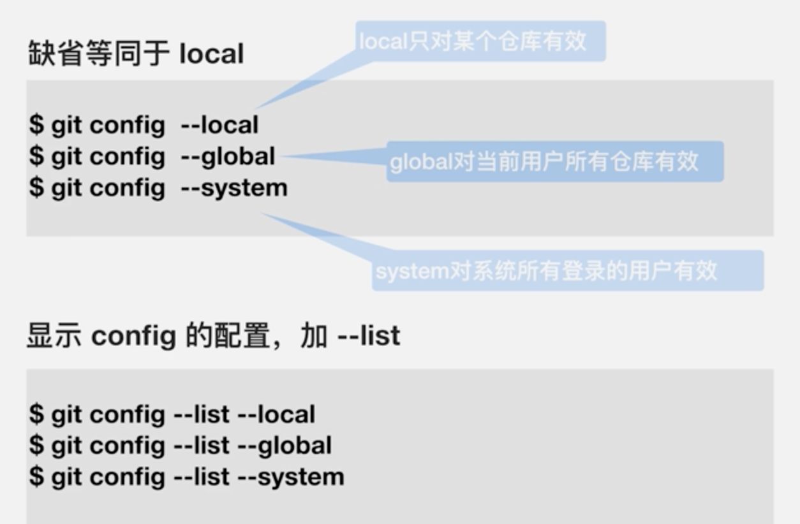
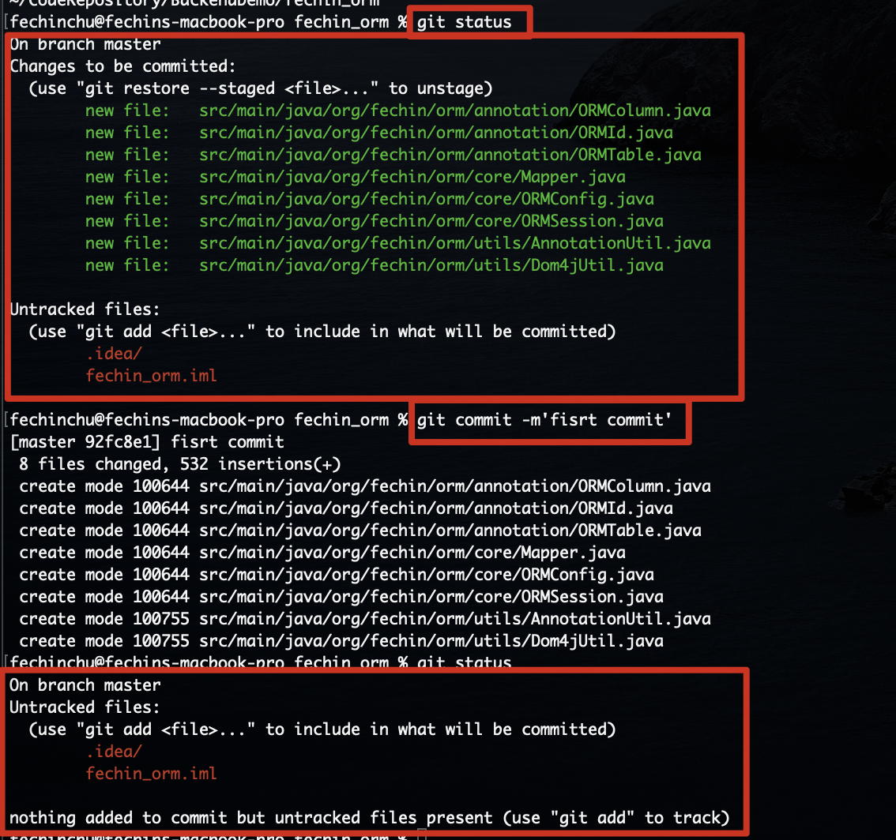

# Git、GitHub、GitLab

# 1.Git基础

## 1.1.综述

### 1.1.1.集中式VCS


* 有集中的版本管理服务器;
* 具备文件版本管理和分支管理能力;
* 集成效率有明显地提高;

* 客户端必须时刻与服务器相连;

### 1.1.2.分布式VCS


* 服务端和客户端都有完整的版本库;
* 脱离服务端,客户端照样可以管理版本;
* 查看历史和版本比较等多数操作,都不需要访问服务器,比集中式VCS更能提高版本管理效率;

### 1.1.3.Git特点

* 最优的存储能力;
* 非凡的性能;
* 开源的;
* 很容易做备份;
* 支持离线操作;
* 很容易定制工作流程;


## 1.2.Git使用前的配置

~~~shell
git config --global user.name 'zhuguoqing'
git config --global user.email 'fechin0826@163.com'
~~~



## 1.3.创建仓库

这里分为两种场景

1. 把已有的项目代码纳入Git管理

~~~shell
cd (项目所在目录)
git init
~~~

2. 新建项目直接用Git管理

~~~shell
cd (某个文件夹)
git init (项目名) #会在当前路径下创建于项目名称相同的文件夹
cd (项目名)
~~~

## 1.4.工作区和暂存区


在添加到暂存区的时候,会有warning提示:会把Windows格式的CRLF换行转换成Unix格式的LF换行,这些是转换文件格式的警告,不影响使用.git默认支持LF.windows commit代码时git会把CRLF转化成LF,update代码时候LF转化成CRLF.



> `git add -u`:将文件的修改,文件的删除,添加到暂存区;
>
> `git add .`:将文件的修改,文件的新建,添加到暂存区;
>
> `git add -A`或者`git add -all`:将文件的修改,文件的删除,文件的新建,添加到暂存区;


## 1.5.给文件重命名

### 1.5.1.垃圾操作


### 1.5.2.正式操作


```shell
git mv (源文件名) (目标文件名)
```

## 1.6.查看版本历史

1. `git log`:普通的git版本 历史命令;

2. `git log --oneline`:查看一行的git版本历史命令;
3. `git log -n2`:查看最近2个的版本历史命令;
4. `git log --all --graph`;

## 1.7.gitk:通过图形界面工具查看版本历史

## 1.8.`.git`目录


### 1.8.1.HEAD


`HEAD`是一个指向指向的是`refs/heads/master`;


由上图我们可以看到,当我们切换分支的时候,我们的`HEAD`中的内容也会变化;

### 1.8.2.config


当然如果我们配置了local的user信息,在config文件中也可以看到user信息;

### 1.8.3.refs目录


refs目录下面有两个子目录,分别为`heads`和`tags`

#### 1.8.3.1.heads目录

heads目录下存放的就是各种分支


我们可以查看master的内容


接着我们通过`git cat-file -t db2b064....`来查看master里面存储的究竟是什么类型,查看之后我们发现是commit类型;

#### 1.8.3.2.tags目录

存放标签的目录


### 1.8.4.objects

## 1.9 commit、tree、blob


## 1.10.分离头指针


分离头指针:含义就是我们正在工作在没有分支的状态下.容易被git当成垃圾清除掉;

## 1.11.HEAD和branch

# 2.个人操作Git

## 2.1.常用操作

~~~shell
#列出目前所有的分支
git branch -av
#删除分支
git branch -D (分支名)
~~~

~~~shell
#修改最新的commit的messages
git commit --amend
~~~

~~~shell
#比较暂存区和HEAD所含文件的差异
git diff --cached  
~~~

```shell
#比较工作区和暂存区的差异
git diff
我们也可以`git diff -- (文件名)`来对文件进行过滤
```

```shell
#让暂存区恢复成和HEAD一样
git reset HEAD -- (文件名)
```

```shell
#让工作区的文件恢复为和暂存区一样
git checkout -- (文件名)
```

```shell
#回退到前几次的commit
git reset --hard (前几次的commit)
```

```shell
#查看不同commit的指定文件的差异
git diff (commit) (commit) -- (文件名)
```

```shell
#删除文件
git rm (文件名)
```

## 2.2.如何修改旧版的commit的message

`git rebase -i (parent commit号)`,比方说如下图,我们需要first commit的message,那么我们需要输入的是它的父commit号,`5a88beeb88`;


我们将pick改成reword,保存退出,进入到另外一个界面之后,我们把需要修改的message进行修改即可,保存退出.


rebase之后我们发现commit的标识已经变了,但是内容没有变,同样message也修改成我们需要的内容.

## 2.3.如何把连续的commit整理成一个

`git rebase -i (parent commit)`


保存退出后进入到自动弹出到新的文件中.下图我们可以看到start init实际上是我们之前在新的文件中输入的内容.


## 2.4.如何把间隔的commit整理成一个

## 2.5.开发中临时加塞了紧急任务如何处理

## 2.6.如何将Git仓库备份到本地

常见的传输协议


哑协议和智能协议如下图所示


我们在克隆的时候,可以添加`--bare`参数, 表示的是不带工作区的备份仓库;

# 3.Git与GitHub的同步

## 3.1.配置公私钥

1. Checking for existing SSH keys

~~~shell
ls -al ~/.ssh
~~~

2. Generating a new SSH keys

~~~shell
ssh-keygen -t rsa -b 4096 -C "fechin0826@163.com"
~~~

3. Adding a new SSH key to you GitHub account

~~~shell
pbcopy < ~/.ssh/id_rsa.pub
~~~

复制完成之后将公钥粘贴到GitHub上


## 3.2.把本地仓库同步到GitHub

~~~shell
git remote add (远程仓库起个名字) git@github.com:fechinchu/gittest02.git
~~~

~~~shell
git remote -v #查看远端的git仓库
~~~

```shell
git push (远程仓库名) --all #推到远程仓库会报错
```


会发现push报错,是因为远程仓库中有本地没有的文件,或者修改了本地没有修改的文件.

> pull与fetch的区别
>
> * pull:将远端拉下来的分支与本地的分支进行merge
> * fetch:仅仅将远端的数据拉下来

~~~shell
git fetch (远程仓库名) master #拉取远程仓库内容
~~~

~~~shell
git merge --allow-unrelated-histories (远程仓库名)/master #合并本地master和远端master
~~~


```shell
git push (远程仓库名) master
```


提交成功.

# 4.Git多人单分支集成时的常见场景

## 4.1.不同人修改了不同文件

### 4.1.1.人物1

从远端克隆下代码:

~~~shell
git clone git@github.com:fechinchu/gittest02.git fechin_orm02
~~~

查看分支状态:

~~~shell
git branch -va
#输出结果
* master                                  3cfcbee Merge remote-tracking branch 'github/master'
  remotes/origin/HEAD                     -> origin/master
  remotes/origin/feature/add_git_commands 3cfcbee Merge remote-tracking branch 'github/master'
  remotes/origin/master                   3cfcbee Merge remote-tracking branch 'github/master'
~~~


因为我们在本地无法直接在clone下来的远程分支上做变更,只能基于远程分支建本地分之后,才能床架commit

~~~shell
 git checkout -b feature/add_git_commands origin/feature/add_git_commands
~~~

在执行完成commit之后我们查看:


直接`git push`,他会直接将内容推送到远端对应的检出的分支上.这样子就将该分支的本地分支与远端分支合并为一条分支


### 4.1.2.人物2

```shell
git fetch github
```

~~~shell
git checkout -b feature/add_git_commands github/feature/add_git_commands
~~~

接下来我们对文件内容进行修改,commit


**但是不幸的是这时候,人物1对不同的文件进行了修改,这时候push出现了问题**


这时候我们需要将远端的代码拉取下来

~~~shell
git fetch github
~~~

然后对代码进行合并

~~~shell
git merge github/feature/add_git_commands
~~~


这时候我们发现本地版本已经超前两个版本,这时候进行推送远端

~~~shell
git push
~~~

所以说我们提交代码需要先pull(pull的话会将远端的分支与本地的分支进行合并),再push

## 4.2.不同人修改了相同文件的不同区域


我们还是先将远端代码pull下来,这里并不需要解决冲突.操作与修改不同文件是一样的.

## 4.3.不同人修改了相同文件的相同区域

## 4.4.同时变更了文件名和文件内容

场景:一个人修改了文件名并提交,另一个修改了该文件的文件内容并提交.

**Git会自动的知道哪个文件改变了名字,并将文件内容修改到新文件名的文件中;**

## 4.5.把同一文件改成了不同的文件名

# 5.Git使用禁忌

# 6.GitHub

