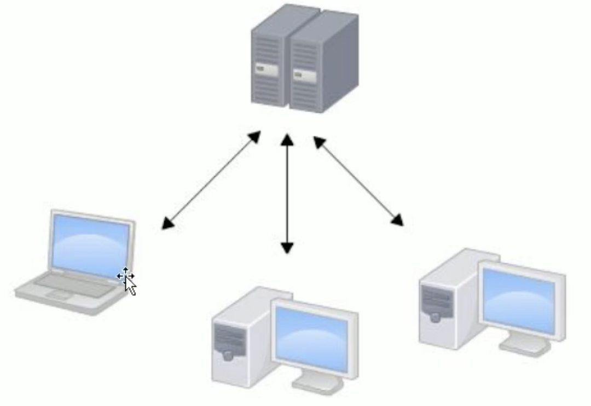
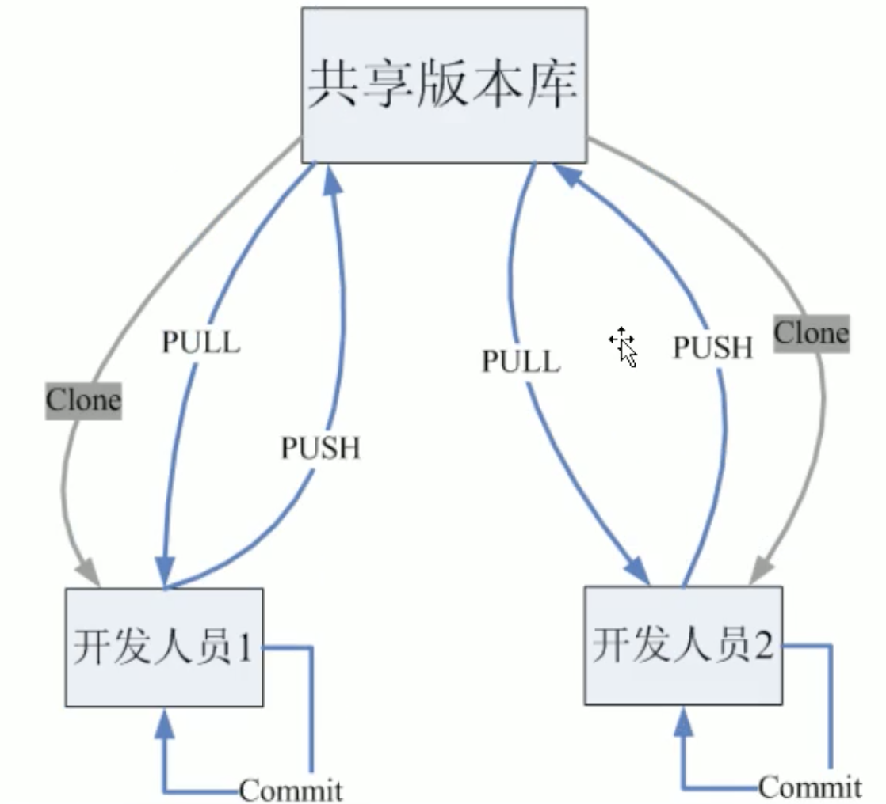
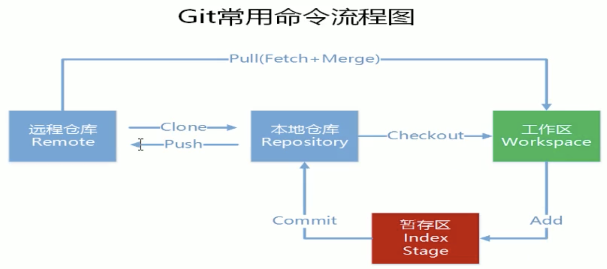

# Git

# 1.Git与SVN对比

## 1.1.SVN

SVN是集中式版本控制系统,版本库是集中放在中央服务器的,干活的时候,用的是自己的电脑,所以要从中央服务器得到最新的版本,然后干活,干完后,需要将自己做完的货推送到中央服务器,集中式版本控制系统是必须联网才能工作.

集中管理方式在一定程度上看到其他开发人员在干什么,而管理者也可以很轻松的掌握每个人的开发权限.但是相较于其优点而言,集中式版本控制缺点也很明显:

* 服务器单点故障;
* 容错性较差;

## 1.2.Git

Git是分布式版本控制系统,没有中央服务器,每个人的电脑就是一个完整的版本库,这样,工作时间不需要联网,因为版本都是在自己的电脑上,既然每个人的电脑都有一个完整的版本库.比方说自己在电脑上改了文件A,其他人也在电脑上改了文件A,这时候,他们之间只需要把各自的修改推送给对方,就可以互相看到对方的修改了.

# 2.Git的工作流程

1. 从远程仓库克隆Git资源作为本地仓库;
2. 从本地仓库中checkout代码然后进行代码的修改;
3. 在提交前先将代码提交到暂存区;
4. 提交修改,提交到本地仓库.本地仓库中保存修改的各个历史版本;
5. 在修改完成后,需要和团队成员共享代码时,可以将代码push到远程仓库;

# 3.使用Git管理文件版本

## 3.1.创建版本库

版本库又称为仓库,英文名是repository,可以简单理解成一个目录,这个目录里面的所有文件都可以被Git管理起来,每个文件的修改,删除,Git都能够追踪,以便任何时刻都可以追踪你是,或者在将来某个时刻可以"还原".由于Git是分布式版本管理工具,所以git在不需要联网的情况下也具有完整的版本管理能力;

`git init`;

## 3.2.添加文件

### 3.2.1.

### 3.2.2.工作区和暂存区

Git和其他版本控制系统如SVN的一个不同之处就是有暂存区的概念.

什么是工作区?工作区就是你在电脑里能看到的目录,比如我的代码文件夹就是一个工作区.在这个目录中的`.git`隐藏文件才是版本库.Git的版本库里存了很多东西,其中最重要的就是称为stage(或者叫index)的暂存区,还有Git为我们自动创建的第一个分支master,以及指向master的一个指针叫HEAD.

如下图所示:

我们把文件往Git版本库里添加的时候,是分两步执行的:

1. 第一步是用`git add`把文件添加进去,实际上就是把文件修改添加到暂存区;
2. 第二步是用`git commit`提交更改,实际上就是把暂存区的所有内容提交到当前分支;

因为我们创建Git版本库时候,Git自动为我们创建了唯一一个master分支.所以,现在`git commit`就是往master分支上提交更改.简单理解为:**需要提交的文件修改通通放到暂存区,然后一次性提交暂存区的所有修改**

## 3.3.修改文件

