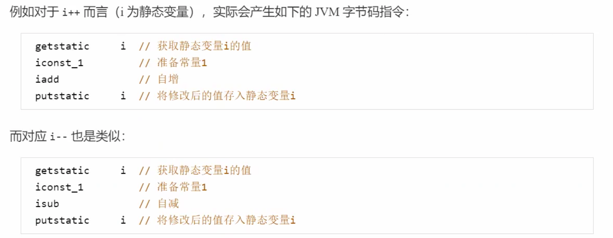

# Java并发编程02

# 1.共享模型之管程

~~~java
@Slf4j(topic = "DemoTest")
public class DemoTest {
    
    public static int varInt = 0;

    public static void main(String[] args) throws InterruptedException {
        Thread thread01 = new Thread(() -> {
            for (int i = 0; i < 5000; i++) {
                varInt++;
            }
        });

        Thread thread02 = new Thread(() -> {
            for (int i = 0; i < 5000; i++) {
                varInt--;
            }
        });

        thread01.start();
        thread02.start();
        thread01.join();
        thread02.join();
        log.info("result:{}",varInt);
    }
}
~~~

以上的结果可能是正数,负数,零.为什么呢?因为Java对静态变量的自增并不是原子操作,要彻底理解,必须从字节码分析



出现负数的情况:


出现正数的情况:


> 临界区Critical Section:
>
> * 一个程序运行多个线程本身没有问题;
> * 问题出在多个线程访问**共享资源**;
>   * 多个线程读共享资源其实也没问题;
>   * 在多个线程对共享资源读写操作时发生指令交错,就会出现问题;
> * 一段代码块内如果存在对**共享资源**的多线程读写操作,称这段代码为**临界区**;
>
> 竞态条件Race Condition:
>
> * 多个线程在临界区内执行,由于代码的执行序列不同而导致结果无法预测,称之为发生了**竞态条件**

## 1.1.synchronized

为了避免临界区的竞态条件发生,有多种手段可以达到目的;

* 阻塞式解决方法:`synchronized`,`lock`
* 非阻塞式的解决方法:原子变量

synchronized俗称`对象锁`,它采用互斥的方式让同一时刻至多只能有一个线程能够持有`对象锁`,其他线程再想获取就会阻塞主,这样就能保证拥有锁的线程可以安全的执行临界区内的代码,不用担心上下文切换.

> 注意:虽然Java中互斥和同步都可以采用synchronized关键字来完成,但是它们还是有区别的:
>
> * 互斥是保证临界区的竞态条件发生,同一时刻只能有一个线程执行临界区代码;
> * 同步是由于线程执行的先后,顺序不同,需要一个线程等待其他线程运行到某个点;

~~~java
@Slf4j(topic = "DemoTest")
public class DemoTest01 {
    public static int varInt = 0;

    public static Object lock = new Object();

    public static void main(String[] args) throws InterruptedException {
        Thread thread01 = new Thread(() -> {
            for (int i = 0; i < 5000; i++) {
                synchronized (lock){
                    varInt++;
                }
            }
        });

        Thread thread02 = new Thread(() -> {
            for (int i = 0; i < 5000; i++) {
                synchronized (lock) {
                    varInt--;
                }
            }
        });

        thread01.start();
        thread02.start();
        thread01.join();
        thread02.join();
        log.info("result:{}",varInt);
    }
}
~~~

> synchronized语法
>
> ```java
> synchronized([对象]){
>   [临界区]
> }
> ```


> `synchronized`实际上是用对象锁保证了`临界区内代码的原子性`,临界区内的代码对外是不可分割的,不会被线程切换所打断;

## 1.2方法上的synchronized

```java
class Test{
  public synchronized void test(){
    
  }
}
//等价于
class Test{
  public void test(){
    synchronized(this){
      
    }
  }
}
```

~~~java
class Test{
  public synchronized static void test(){
    
  }
}
//等价于
class Test{
  public static void test(){
    synchronized(Test.class){
      
    }
  }
}
~~~

## 1.3.变量的线程安全

> **成员变量和静态变量是否线程安全?**
>
> * 如果它们没有共享,那么线程安全;
> * 如果它们被共享了,根据它们的状态是否能够改变,又分为两种情况
>   * 如果只有读操作,则线程安全;
>   * 如果有读写操作,则这段代码是临界区,需要考虑线程安全;
>
> **局部变量是否线程安全?**
>
> * 局部变量是线程安全的;
> * 局部变量的引用对象未必安全;
>   * 如果该对象没有逃离方法的作用访问,它是线程安全的;
>   * 如果该对象逃离方法的作用范围,需要考虑线程安全;

### 1.3.1.局部变量的线程安全分析


~~~java
@Slf4j(topic = "DemoTest")
public class DemoTest01 {
    public static void main(String[] args) {
        ThreadSafe01 threadSafe01 = new ThreadSafe01();
        for (int i = 0; i < 2; i++) {
            new Thread(()->{
                threadSafe01.method1();
            },"thread0"+(i+1)).start();
        }
    }
}

class ThreadSafe01{

    public void method1(){
        ArrayList<String> list=new ArrayList<>();
        for (int i = 0; i < 1000; i++) {
            method2(list);
            methdo3(list);
        }
    }

    private void method2(ArrayList<String> list){
        list.add("hello");
    }

   	private void methdo3(ArrayList<String> list){
        list.remove(0);
    }
}
~~~


###1.3.2成员变量的线程安全分析

~~~java
@Slf4j(topic = "DemoTest")
public class DemoTest {
    public static void main(String[] args) {
        ThreadUnsafe threadUnsafe = new ThreadUnsafe();
        for (int i = 0; i < 2; i++) {
            new Thread(()->{
                threadUnsafe.method1();
            },"thread0"+(i+1)).start();
        }
    }
}

class ThreadUnsafe{

    private ArrayList<String> list=new ArrayList<>();

    public void method1(){
        for (int i = 0; i < 1000; i++) {
            method2();
            methdo3();
        }
    }

    private void method2(){
        list.add("hello");
    }

    private void methdo3(){
        list.remove(0);
    }
}
~~~


无论是哪个线程中的引用都是同一个对象中的list成员变量:


### 1.3.3.局部变量有可能出现的线程安全问题

~~~java
@Slf4j(topic = "DemoTest")
public class DemoTest01 {
    public static void main(String[] args) {
        ThreadUnSafe01 threadUnSafe01 = new ThreadUnSafe01();
        for (int i = 0; i < 2; i++) {
            new Thread(()->{
                threadUnSafe01.method1();
            },"thread0"+(i+1)).start();
        }
    }
}

class ThreadSafe01{
		//改写为public final void method1(){}
    public void method1(){
        ArrayList<String> list=new ArrayList<>();
        for (int i = 0; i < 1000; i++) {
            method2(list);
            methdo3(list);
        }
    }
		//改写为private void method2(ArrayList<String> list){}
    public void method2(ArrayList<String> list){
        list.add("hello");
    }
		//改写为private void method3(ArrayList<String> list){}
    public void methdo3(ArrayList<String> list){
        list.remove(0);
    }
}

class ThreadUnSafe01 extends ThreadSafe01{
    @Override
    public void method2(ArrayList<String> list) {
        Thread hello = new Thread() {
            @Override
            public void run() {
                list.add("hello");
            }
        };
        hello.start();
    }
}
~~~

从这个例子可以看出`private`或`final`提供安全的意义所在;

## 1.4.常见线程安全类

* `String`
* `Integer`等包装类
* `StringBuffer`
* `Random`
* `Vector`
* `HashTable`
* `java.util.concurrent`包下的类

### 1.4.1.线程安全类方法的组合

这里说它们是线程安全的是指:多个线程调用它们同一个实例的某个方法时,是线程安全的,也可以理解为:

* 它们的每个方法是原子的;
* 但注意它们多个方法的组合不是原子的


### 1.4.2.不可变类线程安全性

`String`,`Integer`等都是不可变类,因为其内部的状态不可以改变,因此它们的方法都是线程安全的;

## 1.5.Monitor

### 1.5.1.Java对象头


### 1.5.2.Monitor原理

Monitor的意思就是监视器或管程

每个Java对象都可以关联一个Monitor对象,如果使用synchronized给对象上锁(重量级)之后,该对象头的Mark Word中就被设置指向Monitor对象的指针;

Monitor结构如下:


* 刚开始Monitor中的Owner为null;
* 当Thread-2执行synchronized(obj)就会将Monitor的所欲这Owner置为Thread-2,Monitor中只能有一个Owner;
* 在Thread-2上锁的过程中,如果Thread-3,Thread-4,Thread-5也来执行synchronized(obj),就会进入EntryList BLOCKED;
* Thread-2执行完同步代码块的内容,然后唤醒EntryList中等待的线程来竞争锁,竞争的时是非公平的;
* 图中WaitSet中的Thread-0,Thread-1是之前获得过锁,但条件不满足WAITING状态的线程;

注意:

* synchronized必须是进入同一个对象的Monitor才有上述效果;
* 不加synchronized的对象不会关联监视器,不遵从以上规则;

## 1.6.Synchronized原理

### 1.6.1.轻量级锁

轻量级锁的使用场景:如果一个对象虽然有多线程访问,但多线程访问的时候是错开的(也就是没有竞争),那么可以使用轻量级锁来优化.轻量级锁对使用者是透明的,即语法仍然是`synchronized`

```java
static final Object obj = new Object();
public static void method1(){
  synchronized(obj){
    //同步块A
    method2();
  }
}
public static void method2(){
  synchronized(obj){
    //同步块B
  }
}
```

1. 创建锁记录(Lock Record)对象,每个线程的栈帧都会包含一个锁记录的结构.内部可以存储锁定对象的Mark Word;


2. 让锁记录中的Object reference指向锁对象,并尝试用cas替换Object的Mark Word.将Mark Word的值存入锁记录;


3. 如果cas替换成功,对象头存储了锁记录地址和状态00,表示由该线程给对象加锁.如下图:


4. 如果cas失败,有两种情况:
   * 如果是其他线程已经持有了该Object的轻量级锁,这时表明有竞争,进入锁膨胀过程;
   * 如果是自己执行了`synchronized`锁重入,那么再添加一条Lock Record作为重入的计数;


5. 当退出synchronized代码块如果有取值为null的锁记录,表示有重入,这时重置锁记录,表示重入计数减一


6. 当退出synchronized代码块的锁记录不为null,这时使用cas将Mark Word的值恢复给对象头
   * 成功,解锁成功;
   * 失败,说明轻量级锁进行了锁膨胀或已经升级为重量级锁,进入重量级锁解锁流程;

### 1.6.2.锁膨胀

如果在尝试加轻量级锁的过程中,CAS操作无法成功,这时一种情况就是有其他线程为此线程加上了轻量级锁(有竞争),这时需要进行锁膨胀,将轻量级锁变为重量级锁;

```java
static Object obj = new Object();
public static void method1(){
  synchronized(obj){
    //同步块
  }
}
```

1. 当Thread1进行轻量级加锁时,Thread0已经对该对象加了轻量级锁


2. 这时Thread1加轻量级锁失败,进入锁膨胀流程;
   * 即为Object对象申请Monitor锁,让Object指向重量级锁地址;
   * 然后自己进入Monitor的EntryList BLOCKED


3. 当Thread0退出同步块解锁时,使用cas将Mark Word的值恢复给对象头,失败.这时会进入重量级锁流程,即按照Monitor地址找到Monitor对象,设置Owner为null,唤醒EntryList中的BLOCKED线程;

### 1.6.3.自旋优化

重量级锁竞争的时候,还可以使用自旋来进行优化,如果当前线程自旋成功(即这时候持锁线程已经退出了同步块,释放了锁),这时当前线程就可以避免阻塞;

**自旋成功的情况**


**自旋失败的情况**


* 在Java6之后自旋锁是自适应的,比如对象刚刚的一次自旋操作成功过,那么认为这次自旋成功的可能性会高,就多自旋几次;反之就少自旋甚至不自旋,总之,比较智能.
* 自旋会占用CPU时间,单核CPU自旋就是浪费,多核CPU自旋才能发挥优势;
* Java7之后不能控制是否开启自旋功能;

### 1.6.4.偏向锁

轻量级锁在没有竞争时,每次重入仍然需要自行cas操作;

Java6中引入了偏向锁来做进一步优化,只有第一次使用cas将线程ID设置到对象的Mark Word头,之后发现这个线程ID是自己的标识没有竞争,不用重新cas,以后只要不发生竞争,这个对象就归该线程所有;

```java
static final Object obj = new Object();
public static void m1(){
  synchronized(obj){
    m2();
  }
}
public static void m2(){
  synchronized(obj){
    m3();
  }
}
public static void m3(){
  synchronized(obj){
  }
}
```


#### 1.6.4.1.偏向状态


一个对象创建时:

* 如果开启了偏向锁(默认开启),那么对象创建后,markword值为0x05,即最后3位为101,这时候它的thread,epoch,age都为0;
* 偏向锁默认是延迟的,不会在程序启动时立即生效,如果想避免延迟,可以加VM参数`XX:BiasedLockingStartupDelay=0`来禁用延迟;
* 如果没有开启偏向锁,那么对象创建后,markword值为0x01即最后3位为001,这时它的hashcode,age都为0,第一次使用到hashcode时才会赋值;

**测试偏向锁**

我们可以使用jol第三方工具来查看对象头信息

~~~java
// 添加虚拟机参数 -XX:BiasedLockingStartupDelay=0
public static void main(String[] args) throws IOException {
	Dog d = new Dog();
	ClassLayout classLayout = ClassLayout.parseInstance(d);
  
	new Thread(() -> {
		log.debug("synchronized 前");
		System.out.println(classLayout.toPrintableSimple(true));
		synchronized (d) {
			log.debug("synchronized 中");
			System.out.println(classLayout.toPrintableSimple(true));
		}
		log.debug("synchronized 后");
		System.out.println(classLayout.toPrintableSimple(true));
	}, "t1").start();
}
~~~

输出:

~~~shell
11:08:58.117 c.TestBiased [t1] - synchronized 前
00000000 00000000 00000000 00000000 00000000 00000000 00000000 00000101
11:08:58.121 c.TestBiased [t1] - synchronized 中
00000000 00000000 00000000 00000000 00011111 11101011 11010000 00000101
11:08:58.121 c.TestBiased [t1] - synchronized 后
00000000 00000000 00000000 00000000 00011111 11101011 11010000 00000101
~~~

**测试禁用偏向锁**

在上面的测试代码运行时添加VM参数`-XX:-UseBiasedLocking`禁用偏向锁

输出:

~~~shell
11:13:10.018 c.TestBiased [t1] - synchronized 前
00000000 00000000 00000000 00000000 00000000 00000000 00000000 00000001
11:13:10.021 c.TestBiased [t1] - synchronized 中
00000000 00000000 00000000 00000000 00100000 00010100 11110011 10001000
11:13:10.021 c.TestBiased [t1] - synchronized 后
00000000 00000000 00000000 00000000 00000000 00000000 00000000 00000001
~~~

**测试hashCode**

* 正常状态对象一开始是没有hashCode的,第一次调用才生成

#### 1.6.4.2.撤销偏向锁-调用对象hashCode

调用了对象的hashCode,但偏向锁的对象MarkWord中存储的是线程id,如果调用hashCode会导致偏向锁被撤销.

* 轻量级锁会在锁记录中记录hashCode;
* 重量级锁会在Monitor中记录hashCode;

在调用hashCode后使用偏向锁,记得去掉`-XX:-UseBiasedLocking`

~~~java
public static void main(String[] args) throws IOException {
	Dog d = new Dog();
  d.hashCode();//会禁用这个对象的偏向锁
	ClassLayout classLayout = ClassLayout.parseInstance(d);
  
	new Thread(() -> {
		log.debug("synchronized 前");
		System.out.println(classLayout.toPrintableSimple(true));
		synchronized (d) {
			log.debug("synchronized 中");
			System.out.println(classLayout.toPrintableSimple(true));
		}
		log.debug("synchronized 后");
		System.out.println(classLayout.toPrintableSimple(true));
	}, "t1").start();
}
~~~

~~~shell
1:22:10.386 c.TestBiased [main] - 调用 hashCode:1778535015
11:22:10.391 c.TestBiased [t1] - synchronized 前
00000000 00000000 00000000 01101010 00000010 01001010 01100111 00000001
11:22:10.393 c.TestBiased [t1] - synchronized 中
00000000 00000000 00000000 00000000 00100000 11000011 11110011 01101000
11:22:10.393 c.TestBiased [t1] - synchronized 后
00000000 00000000 00000000 01101010 00000010 01001010 01100111 00000001
~~~

#### 1.6.4.3.撤销偏向锁-其他线程使用对象

~~~java
public static void main(String[] args) throws IOException {	
	Dog d = new Dog();
  d.hashCode();//会禁用这个对象的偏向锁
	ClassLayout classLayout = ClassLayout.parseInstance(d);
  //线程1
	new Thread(() -> {
		log.debug("synchronized 前");
		System.out.println(classLayout.toPrintableSimple(true));
		synchronized (d) {
			log.debug("synchronized 中");
			System.out.println(classLayout.toPrintableSimple(true));
		}
		log.debug("synchronized 后");
		System.out.println(classLayout.toPrintableSimple(true));
    //notify
    synchronized(TestBiased.class){
      TestBiased.class.notify();
    }
	}, "t1").start();
  
	//线程2
	new Thread(() -> {
    //wait
    synchronized(TestBiased.class){
      TestBiased.class.wait();
    }
		log.debug("synchronized 前");
		System.out.println(classLayout.toPrintableSimple(true));
		synchronized (d) {
			log.debug("synchronized 中");
			System.out.println(classLayout.toPrintableSimple(true));
		}
		log.debug("synchronized 后");
		System.out.println(classLayout.toPrintableSimple(true));
	}, "t2").start();
}
~~~

~~~shell
[t1] - 00000000 00000000 00000000 00000000 00011111 01000001 00010000 00000101
[t2] - 00000000 00000000 00000000 00000000 00011111 01000001 00010000 00000101
[t2] - 00000000 00000000 00000000 00000000 00011111 10110101 11110000 01000000
[t2] - 00000000 00000000 00000000 00000000 00000000 00000000 00000000 00000001
~~~

#### 1.6.4.4.撤销偏向锁-调用wait/notify

~~~java
public static void main(String[] args) throws InterruptedException {
	Dog d = new Dog();
	Thread t1 = new Thread(() -> {
		log.debug(ClassLayout.parseInstance(d).toPrintableSimple(true));
		synchronized (d) {
			log.debug(ClassLayout.parseInstance(d).toPrintableSimple(true));
			try {
				d.wait();
			} catch (InterruptedException e) {
				e.printStackTrace();
			}
			log.debug(ClassLayout.parseInstance(d).toPrintableSimple(true));
		}
	}, "t1");
	t1.start();
  
	new Thread(() -> {
		try {
			Thread.sleep(6000);
		} catch (InterruptedException e) {
			e.printStackTrace();
		}
		synchronized (d) {
			log.debug("notify");
			d.notify();
		}
	}, "t2").start();
}
~~~

~~~shell
[t1] - 00000000 00000000 00000000 00000000 00000000 00000000 00000000 00000101
[t1] - 00000000 00000000 00000000 00000000 00011111 10110011 11111000 00000101
[t2] - notify
[t1] - 00000000 00000000 00000000 00000000 00011100 11010100 00001101 11001010
~~~

#### 1.6.4.5.批量重偏向

如果对象虽然被多个线程访问,但没有竞争,这时偏向了线程T1的对象仍然有机会重新偏向T2,重偏向会重置对象的ThreadID.当撤销偏向锁阈值超过20次后,JVM会给这些对象加锁时重新偏向至加锁线程;

~~~java
private static void test3() throws InterruptedException {
	Vector<Dog> list = new Vector<>();
	Thread t1 = new Thread(() -> {
		for (int i = 0; i < 30; i++) {
			Dog d = new Dog();
			list.add(d);
			synchronized (d) {
				log.debug(i + "\t" + ClassLayout.parseInstance(d).toPrintableSimple(true));
			}
		}
		synchronized (list) {
			list.notify();
		}
	}, "t1");
	t1.start();
  
	Thread t2 = new Thread(() -> {
		synchronized (list) {
			try {
				list.wait();
			} catch (InterruptedException e) {
				e.printStackTrace();
			}
		}
		log.debug("===============> ");
		for (int i = 0; i < 30; i++) {
			Dog d = list.get(i);
			log.debug(i + "\t" + ClassLayout.parseInstance(d).toPrintableSimple(true));
			synchronized (d) {
				log.debug(i + "\t" + ClassLayout.parseInstance(d).toPrintableSimple(true));
			}
			log.debug(i + "\t" + ClassLayout.parseInstance(d).toPrintableSimple(true));
		}
	}, "t2");
	t2.start();
}
~~~

#### 1.6.4.6.批量撤销

当撤销偏向锁阈值操作40次之后,JVM会将整个类的所有对象都会变为不可偏向,新建的对象也是不可偏向的;

~~~java
static Thread t1,t2,t3;
private static void test4() throws InterruptedException {
	Vector<Dog> list = new Vector<>();
	int loopNumber = 39;
	t1 = new Thread(() -> {
		for (int i = 0; i < loopNumber; i++) {
			Dog d = new Dog();
			list.add(d);
			synchronized (d) {
				log.debug(i + "\t" + ClassLayout.parseInstance(d).toPrintableSimple(true));
			}
		}
		LockSupport.unpark(t2);
	}, "t1");
	t1.start();
  
	t2 = new Thread(() -> {
		LockSupport.park();
		log.debug("===============> ");
		for (int i = 0; i < loopNumber; i++) {
			Dog d = list.get(i);
			log.debug(i + "\t" + ClassLayout.parseInstance(d).toPrintableSimple(true));
			synchronized (d) {
				log.debug(i + "\t" + ClassLayout.parseInstance(d).toPrintableSimple(true));
			}
			log.debug(i + "\t" + ClassLayout.parseInstance(d).toPrintableSimple(true));
		}
		LockSupport.unpark(t3);
	}, "t2");
  t2.start();
  
	t3 = new Thread(() -> {
		LockSupport.park();
		log.debug("===============> ");
		for (int i = 0; i < loopNumber; i++) {
			Dog d = list.get(i);
			log.debug(i + "\t" + ClassLayout.parseInstance(d).toPrintableSimple(true));
			synchronized (d) {
				log.debug(i + "\t" + ClassLayout.parseInstance(d).toPrintableSimple(true));
			}
			log.debug(i + "\t" + ClassLayout.parseInstance(d).toPrintableSimple(true));
		}
	}, "t3");
	t3.start();
  
	t3.join();
	log.debug(ClassLayout.parseInstance(new Dog()).toPrintableSimple(true));
}
~~~

### 1.6.5.锁消除和锁粗化

## 1.7.wait和notify

### 1.7.1.wait/notify原理


* Owner线程发现条件不满足,调用wait方法,即可进入WaitSet编程WAITING状态;
* BLOCKED和WAITING的线程都处于阻塞状态,不占用CPU时间片;
* BLOCKED线程会在Owner线程释放锁时唤醒;
* WAITING线程会在Owner线程调用notify或notifyAll时唤醒,但唤醒后并不意味着立刻获得锁,仍需进入EntryList重新竞争;

### 1.7.2.API介绍

* `obj.wait()`:让进入object监视器的线程到waitSet等待;
* `obj.notify()`:让object上正在waitSet等待的线程中挑一个唤醒;
* `obj.notifyAll()`:让object上正在waitSet等待的线程全部唤醒;
* **这些API都是线程之间进行协作的手段,都属于Object对象的方法,必须获得此对象的锁,才能调用这几个方法**

~~~java
@Slf4j(topic = "DemoTest")
public class DemoTest {

    private static Object lock = new Object();

    public static void main(String[] args) throws InterruptedException {
        new Thread(()->{
            synchronized (lock){
                try {
                    lock.wait();
                    log.info("thread01 do other things");
                } catch (InterruptedException e) {
                    e.printStackTrace();
                }
            }
        }).start();

        new Thread(()->{
            synchronized (lock){
                try {
                    lock.wait();
                    log.info("thread02 do other things");
                } catch (InterruptedException e) {
                    e.printStackTrace();
                }
            }
        }).start();

        TimeUnit.SECONDS.sleep(2);
        synchronized (lock){
            //lock.notify();
            lock.notifyAll();
            log.info("end");
        }
    }
}
~~~

* `wait()`方法会释放锁对象的锁,进入WaitSet等待区,从而让其他线程有机会获取对象的锁,无限制等待,直到`notify()`为止;
* `wait(long n)`有时限的等待,到n毫秒后结束等待,或是被`notify()`;

### 1.7.3.wait和notify的正确使用

`sleep(long n)`和`wait(long n)`的区别和联系

* sleep是Thread方法,而wait是Object方法;
* sleep不需要强制和synchronized配合使用,但wait需要和synchronized一起使用;
* **sleep在睡眠的同时,不会释放对象锁,但wait在等待的时候会释放对象锁;**
* 它们状态都是TIMED_WAITING;

标准代码:

~~~java
synchronized(lock){
  while(条件不成立){
    lock.wait();
  }
  //干活;
}
//另一个线程
synchronized(lock){
  lock.notifyAll();
}
~~~

## 1.8.设计模式-同步模式保护性暂停

### 1.8.1.保护性暂停原理

Guarded Suspension,用在一个线程等待另一个线程的执行结果;

* 有一个结果需要从一个线程传递到另一个线程,让他们关联同一个GuardedObject;
* 如果有结果不断从一个线程到另一个线程那么可以使用消息队列;
* JDK中,join的实现,Future的实现,采用的就是此模式;
* 因为要等待另一方的结果,因此归类为同步模式;


~~~java
public class GuardedObject {

    private Object response;

    private final Object lock = new Object();

    public Object get(){
        synchronized (lock){
            //条件如果不满足的话就一直等待
            while(response==null){
                try {
                    lock.wait();
                } catch (InterruptedException e) {
                    e.printStackTrace();
                }
            }
            return response;
        }
    }

    public void complete(Object response){
        synchronized (lock) {
            this.response = response;
            lock.notifyAll();
        }
    }
}
~~~

带超时版的GuarderObject

~~~java
public class GuarderObject {

    private Object response;

    private final Object lock = new Object();

    public Object get(long timeOut){
        synchronized (lock){
            long startTime = System.currentTimeMillis();
            long passTime = 0;
            //条件如果不满足的话就一直等待
            while(response==null){
                //如果经过的时间超过了超时时间,退出循环;
                if(passTime>=timeOut){
                    break;
                }
                try {
                    lock.wait(timeOut-passTime);
                } catch (InterruptedException e) {
                    e.printStackTrace();
                }
                passTime = System.currentTimeMillis() - startTime;
            }
            return response;
        }
    }

    public void complete(Object response){
        synchronized (lock) {
            this.response = response;
            lock.notifyAll();
        }
    }
}
~~~

### 1.8.2.join原理

join的原理其实与同步模式的保护性暂停设计模式是一样的,区别在于保护性暂停模式等待的是一个线程的运行结果,但join等待的是一个线程的结束;

是调用者轮询检查线程alive状态;

~~~java
t1.join();
~~~

等价于下面的代码

~~~java
synchronized(t1){
  //调用者线程进入t1的waitSet等待,直到t1运行结束
  while(t1.isAlive()){
    t1.wait(0);           
  }
}
~~~

### 1.8.3.保护性暂停的拓展


Guarded Object

~~~java
public class GuardedObject {

    private int id;

    public GuardedObject(int id) {
        this.id = id;
    }

    public int getId() {
        return id;
    }

    public void setId(int id) {
        this.id = id;
    }

    private Object response;

    private final Object lock = new Object();

    public Object get(long timeOut){
        synchronized (lock){
            long startTime = System.currentTimeMillis();
            long passTime = 0;
            //条件如果不满足的话就一直等待,防止虚假唤醒
            while(response==null){
                //如果经过的时间超过了超时时间,退出循环;
                if(passTime>=timeOut){
                    break;
                }
                try {
                    lock.wait(timeOut-passTime);
                } catch (InterruptedException e) {
                    e.printStackTrace();
                }
                passTime = System.currentTimeMillis() - startTime;
            }
            return response;
        }
    }

    public void complete(Object response){
        synchronized (lock) {
            this.response = response;
            lock.notifyAll();
        }
    }
}
~~~

中间解耦类

~~~java
public class MixObject {
  	//因为Hashtable是线程安全的,所以getGuardedObject和createGuardedObject并不需要加上synchronized.
    private static Map<Integer, GuardedObject> boxes = new Hashtable<>();

    private static Integer id = 0;

    public static synchronized int generateId(){
        return id++;
    }

    public static GuardedObject getGuardedObject(int id) {
        return boxes.remove(id);
    }
    public static GuardedObject createGuardedObject() {
        GuardedObject go = new GuardedObject(generateId());
        boxes.put(go.getId(), go);
        return go;
    }
    public static Set<Integer> getIds() {
        return boxes.keySet();
    }
 }
~~~

消息发送者

~~~java
@Slf4j(topic = "Producer")
public class Producer extends Thread{
    private int id;
    private String msg;
    public Producer(int id,String msg){
        this.id = id;
        this.msg = msg;
    }
    @Override
    public void run() {
        GuardedObject guardedObject = MixObject.getGuardedObject(id);
        log.info("发送消息,消息id:{},消息内容:{}",id,msg);
        guardedObject.complete(msg);

    }
}
~~~

消息接收者

~~~java
@Slf4j(topic = "Receiver")
public class Receiver extends Thread{
    @Override
    public void run() {
        GuardedObject guardedObject = MixObject.createGuardedObject();
        int id = guardedObject.getId();
        log.info("开始收取消息:id是{}",id);
        Object obj = guardedObject.get(1000);
        log.info("读取消息:{}",obj);
    }
}
~~~

测试

~~~java
public class DemoTest {

    public static void main(String[] args) throws InterruptedException {

        for (int i = 0; i < 3; i++) {
            Receiver receiver = new Receiver();
            receiver.start();
        }
        TimeUnit.SECONDS.sleep(1);
        Set<Integer> ids = MixObject.getIds();
        for (Integer id : ids) {
            Producer producer = new Producer(id, "消息:" + id);
            producer.start();
        }
    }
}
~~~

## 1.9.设计模式-异步模式生产者/消费者

要点:

* 与前面的保护性暂停中的GuardObject不同,不需要产生结果和消费结果线程一一对应;
* 消费队列可以用来平衡生产和消费的线程资源;
* 生产者仅仅负责产生结果数据,不关心数据该如何处理,而消费者专心处理结果数据;
* 消息队列是有容量限制的,满时不会再加入数据,空时不会再消耗数据;
* JDK中各种阻塞队列,采用的就是这种模式;


~~~java
//这个类只能够用于线程间通信与RabbitMQ等进程间通信的消息队列并不一样
public class MessageQueue {

    private LinkedList<Message> linkedList = new LinkedList<>();

    /**
     * 容量
     */
    private int capcity;

    public MessageQueue(int capcity) {
        this.capcity = capcity;
    }

    /**
     * 存入消息
     */
    public void put(Message message) {
        synchronized (linkedList){
            while (linkedList.size()>=capcity){
                try {
                    linkedList.wait();
                } catch (InterruptedException e) {
                    e.printStackTrace();
                }
            }
            linkedList.addLast(message);
            linkedList.notifyAll();
        }
    }

    /**
     * 取出消息
     */
    public Message get() {
        synchronized (linkedList) {
            while (linkedList.isEmpty()) {
                try {
                    linkedList.wait();
                } catch (InterruptedException e) {
                    e.printStackTrace();
                }
            }
            Message message = linkedList.removeFirst();
            linkedList.notifyAll();
            return message;
        }
    }
}
~~~

## 1.10.park和unpark

### 1.10.1.基本使用

它们是LockSupport类中的方法

~~~java
//暂停当前线程
LockSupport.park();

//恢复某个线程的运行
LockSupport.unpark(暂停的线程对象);
~~~

特点:

* `wait`,`notify`,`notifyAll`必须配合Object Monitor一起使用,而`park`和`unpark`不必;
* `park`,`unpark`是以线程为单位阻塞阻塞和唤醒线程,而`notify`只能随机唤醒一个等待线程,`notifyAll`是唤醒所有等待线程;
* `park`和`unpark`可以先`unpark`,但`wait`和`notify`不能先`notify`;

### 1.10.1.park和unpark原理

每个线程都有自己的一个Parker对象,由三部分组成`_mutex`,`_counter`,`_cond`


1. 当前线程调用`Unsafe.park()`方法;
2. 检查`_counter`,本情况为0,这时,获得`_mutex`互斥锁;
3. 线程进入`_cond`条件,变量阻塞;
4. 设置`_counter` = 0;


1. 调用`Unsafe.unpark(Thread-0)`方法,设置_counter为1;
2. 唤醒`_cond`条件变量中的Thread_0;
3. `Thread_0`恢复运行;
4. 设置`_counter`为0;


1. 调用`Unsafe.unpark(Thread-0)`方法,设置`_counter`为1;
2. 当前线程调用`Unsafe.park()`方法;
3. 检查`_counter`,本情况为1,这时候线程无需阻塞,继续运行;
4. 设置`_counter`为0;

## 1.11.重新理解线程状态转换


> 情况1:`NEW->RUNNABLE`
>
> * 当调用`t.start()`方法时,由`NEW->RUNNABLE`;
>
> 情况2:`RUNNABLE<->WAITING`
>
> * 调用`obj.wait()`方法时,t线程从`RUNNABLE->WAITING`;
> * 调用`obj.notify()`,`obj.notifyAll()`,`t.interrupt()`时
>   * 竞争锁成功,t线程从`WAITING->RUNNABLE`;
>   * 竞争锁失败,t线程从`WAITING->BLOCKED`;
>
> 情况3:`RUNNABLE<->WAITING`
>
> * 当前线程调用`t.join()`方法时,当前线程从`RUNNABLE->WAITING`;
>   * 注意是当前线程在t线程对象的监视器上等待
> * t线程运行结束,或调用了当前线程的`interrupt()`,当前线程从`WAITING->RUNNABLE`;
>
> 情况4:`RUNNABLE<->WAITING`
>
> * 当前线程调用`LockSupport.park()`方法会让当前线程从`RUNNABLE->WAITING`;
> * 调用`LockSupport.unpark(目标线程)`,或调用了线程的`interrupt()`,会让目标线程从`WAITING->RUNNABLE`;
>
> 情况5:`RUNNABLE<->TIMED_WAITING`
>
> * 调用`obj.wait(long n)`方法时,t线程从`RUNNABLE->WAITING`;
> * t线程等待时间超过n毫秒,或调用`obj.notify()`,`obj.notifyAll()`,`t.interrupt()`时
>   * 竞争锁成功,t线程从`WAITING->RUNNABLE`;
>   * 竞争锁失败,t线程从`WAITING->BLOCKED`;
>
> 情况6:`RUNNABLE<->TIMED_WAITING`
>
> * 当前线程调用`t.join(long n)`方法时,当前线程从`RUNNABLE->TIMED_WAITING`;
>   * 注意是当前线程在t线程对象的监视器上等待;
> * 当前线程等待时间超过了n毫秒,或t线程运行结束,或调用了当前线程的`interrupt()`时,当前线程从`TIMED_WAITING->RUNNABLE`;
>
> 情况7:`RUNNABLE<->TIMED_WAITING`
>
> * 当前线程调用了Thread.sleep(long n),当前线程从`RUNNABLE -> TIMED_WAITING`
> * 当前线程等待时间超过了n毫秒,当前线程从`TIMED_WAITING ->RUNNABLE`;
>
> 情况8:`RUNNABLE<->TIMED_WAITING`
>
> * 当前线程调用了`LockSupport.parkNanos(long nanos)`或`LockSupport.parkUntil(long millis)`时,当前线程从`RUUNABLE->TIMED_WAITING`;
> * 调用`LockSupport.unpark(目标线程)`或调用了线程的`interrupt()`,或等待超时,会让目标线程从`TIMED_WAITING->RUNNABLE`;
>
> 情况9:`RUNNABLE<->BLOCKED`
>
> * t线程用`synchronized(obj)`获取了对象锁时如果竞争失败,从`RUNNABLE->BLOCKED`;
> * 持obj锁线程的同步带吗块执行完毕,会唤醒该对象上所有的`BLOCKED`的线程重新竞争,如果其中t线程竞争成功,从`BLOCKED->RUNNABLE`,其他失败线程仍然是`BLOCKED`
>
> 情况10:`RUNNBALE->TERMINATED`
>
> * 当前线程所有代码运行完毕,进入`TERMINATED`

## 1.12.多把锁

* 好处:可以增强并发度;
* 坏处:如果一个线程需要同时获得多把锁,就容易发生死锁;

### 1.12.1.活跃性

#### 1.12.1.1.死锁

有这样的情况:一个线程需要同时获取多把锁,这时就容易发生死锁;

~~~java
@Slf4j(topic = "DemoTest")
public class DemoTest {
    public static final Object lock01 = new Object();
    public static final Object lock02 = new Object();

    public static void main(String[] args) {
        new Thread(()->{
            synchronized (lock01){
                log.info("thread01 in lock01");
                synchronized (lock02){
                    log.info("thread01 in lock02");
                }
            }
        }).start();

        new Thread(()->{
            synchronized (lock02){
                log.info("thread02 in lock01");
                synchronized (lock01){
                    log.info("thread02 in lock02");
                }
            }
        }).start();
    }
}
~~~

检测死锁可以使用jconsole工具:


或者使用jps定位进程id,再用jstack定位死锁;


#### 1.12.1.2.活锁

活锁出现在两个线程相互改变对方的结束条件,最后谁也无法结束;

~~~java
@Slf4j(topic = "DemoTest")
public class DemoTest {
    public static volatile int count = 10;

    public static final Object lock = new Object();

    public static void main(String[] args) {
        new Thread(()->{
            // 期望减到 0 退出循环
            while (count > 0) {
                try {
                    Thread.sleep(200);
                } catch (InterruptedException e) {
                    e.printStackTrace();
                }
                count--;
                log.debug("count: {}", count);
            }
        }).start();

        new Thread(()->{
            // 期望超过 20 退出循环
            while (count < 20) {
                try {
                    Thread.sleep(200);
                } catch (InterruptedException e) {
                    e.printStackTrace();
                }
                count++;
                log.debug("count: {}", count);
            }
        }).start();
    }
}
~~~

#### 1.12.1.3.饥饿

饥饿的定义:一个线程由于优先级太低,始终得不到CPU调度执行,也不能结束,饥饿的情况不易掩饰

下图是死锁的产生


顺序加锁的解决方案


## 1.13.ReentrantLock

相比较于synchronized它具备如下特点:

* 可中断
* 可以设置超时时间;
* 可以设置公平锁(先到先得,而不是随机获取锁);
* 支持多个条件变量;

与synchronized一样,都支持可重入;

基本语法:

~~~java
reentrantLock.lock();
try{
  //临界区
}finally{
  //释放锁
  reentrantLock.unlock();
}
~~~

### 1.13.1.可重入

可重入是指同一个线程如果首次获得这把锁,那么因为它是这把锁的拥有者,因此有权利再次获取这把锁,如果是不可重入锁,那么第二次获得锁时,自己也会被锁挡住;

### 1.13.2.可打断

~~~java
@Slf4j(topic = "DemoTest01")
public class DemoTest01 {

    private static ReentrantLock lock = new ReentrantLock();

    public static void main(String[] args) {
        Thread t1 = new Thread(() -> {
            log.debug("启动...");
            try {
                lock.lockInterruptibly();
            } catch (InterruptedException e) {
                e.printStackTrace();
                log.debug("等锁的过程中被打断");
                return;
            }
            try {
                log.debug("获得了锁");
            } finally {
                lock.unlock();
            }
        }, "t1");
        lock.lock();
        log.debug("获得了锁");
        t1.start();
        /**
         * 在使用阻塞等待获取锁的方式中，必须在try代码块之外，并且在加锁方法与try代码块之间没有任何可能抛出异常的方法调用，避免加锁成功后，在finally中无法解锁。
         * 说明一：如果在lock方法与try代码块之间的方法调用抛出异常，那么无法解锁，造成其它线程无法成功获取锁。
         * 说明二：如果lock方法在try代码块之内，可能由于其它方法抛出异常，导致在finally代码块中，unlock对未加锁的对象解锁，它会调用AQS的tryRelease方法（取决于具体实现类），抛出IllegalMonitorStateException异常。
         * 说明三：在Lock对象的lock方法实现中可能抛出unchecked异常，产生的后果与说明二相同。 java.concurrent.LockShouldWithTryFinallyRule.rule.desc
         *
         * Positive example：
         *     Lock lock = new XxxLock();
         *     // ...
         *     lock.lock();
         *     try {
         *         doSomething();
         *         doOthers();
         *     } finally {
         *         lock.unlock();
         *     }
         *
         * Negative example：
         *     Lock lock = new XxxLock();
         *     // ...
         *     try {
         *         // If an exception is thrown here, the finally block is executed directly
         *         doSomething();
         *         // The finally block executes regardless of whether the lock is successful or not
         *         lock.lock();
         *         doOthers();
         *
         *     } finally {
         *         lock.unlock();
         *     }
         *
         */
        try {
            Thread.sleep(1000);
            t1.interrupt();
            log.debug("执行打断");
        } catch (InterruptedException e) {
            e.printStackTrace();
        } finally {
            lock.unlock();
        }
    }
}
~~~


### 1.13.3.锁超时

~~~java
@Slf4j(topic = "DemoTest01")
public class DemoTest02 {

    private static ReentrantLock lock = new ReentrantLock();

    public static void main(String[] args) {
        ReentrantLock lock = new ReentrantLock();
        Thread t1 = new Thread(() -> {
            log.debug("启动...");
            try {
                if (!lock.tryLock(1, TimeUnit.SECONDS)) {
                    log.debug("获取等待 1s 后失败，返回");
                    return;
                }
            } catch (InterruptedException e) {
                e.printStackTrace();
            }
            try {
                log.debug("获得了锁");
            } finally {
                lock.unlock();
            }
        }, "t1");
        lock.lock();
        log.debug("获得了锁");
        t1.start();
        try {
            TimeUnit.SECONDS.sleep(1);
        } catch (InterruptedException e) {
            e.printStackTrace();
        } finally {
            lock.unlock();
        }
    }
}
~~~

### 1.13.4.公平锁

ReentrantLock默认是不公平的锁.我们在闯进ReentrantLock对象的时候,可以在构造函数中设为true,该锁就是公平锁;公平锁一般没有必要,会降低并发度.

`ReentrantLock lock = new ReentrantLock(true);`

### 1.13.5.条件变量

synchronized中也有条件变量,就是waitSet,当条件不满足时进入waitSet等待;

ReetrantLock的条件变量是支持多个条件变量的;

ReetrantLock要点:

* await前需要获得锁;
* await执行后,会释放锁,进入conditionObject等待;
* await的线程被唤醒(或打断,或超时)去重新竞争lock锁;
* 竞争lock锁成功后,从await后继续执行;

 常用API

* `Condition condition = reentrantLock.newCondition();`
* `condition.await();`
* `condition.signal();`
* `condition.signalAll();`

