# Java并发编程03

# 1. 共享模型之内存

<Java并发编程02>说的Monitor主要关注的是访问共享变量时,保证临界区代码的**原子性**.接下里我们需要说的是多线程间的**可见性**问题和多条指令执行的**有序性**.

## 1.1.Java内存模型

JMM即Java Memory Model,它定义了主存(所有线程的共享数据),工作内存(所有线程的私有数据)抽象概念,底层对应着CPU寄存器,缓存,硬件内存,CPU指令优化等;

JMM体现在以下几个方面:

* 原子性-保证指令不会受到线程上下文切换的影响;
* 可见性-保证指令不会受到CPU缓存的影响;
* 有序性-保证指令不会受到CPU指令并行优化的影响;

## 1.2.可见性

### 1.2.1.可见性问题分析

~~~java
@Slf4j(topic = "DemoTest")
public class DemoTest {
    private static boolean run = true;
    public static void main(String[] args) throws InterruptedException {
        Thread t = new Thread(()->{
            while (run){
                
            }
        });
        t.start();
        TimeUnit.SECONDS.sleep(1);
        run = false;
    }
}
~~~

线程并不会如我们预想的那样停下来.分析:

1. 初始状态,t线程刚开始从主内存读取了run的值到工作内存

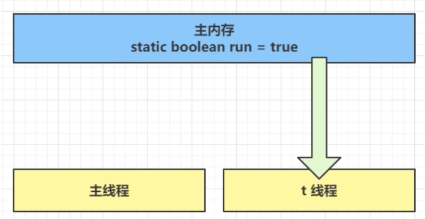

2. 因为t线程要频繁从主内存中读取run的值,JIT编译器会将run的值缓存至自己工作内存中的高速缓存中,减少主存中的run的访问,提高效率.

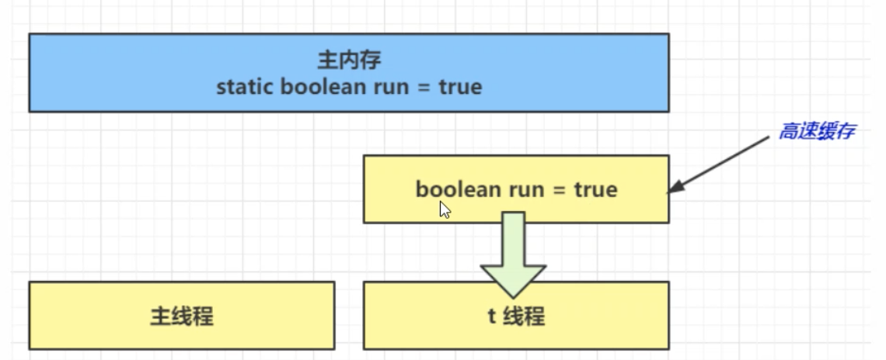

3. 1秒之后,main线程修改了run的值,并同步至主存,而t是从自己的工作内存中的高速缓存中读取这个变量的值,结果永远是旧值;

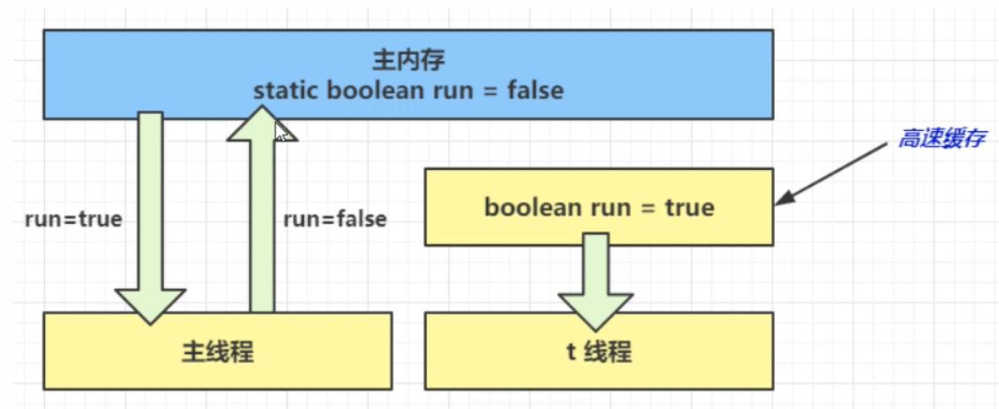

### 1.2.2.解决方法

**volatile**可以用来修饰成员变量和静态成员变量,他可以避免从自己的工作缓存中查找变量的值,必须到主存中获取它的值,线程操作volatile变量都是直接操作主存;

 ### 1.2.3.可见性和原子性

前面体现的实际就是可见性,它保证的是多个线程之间,一个线程对volatile变量的修改对另一个线程可见,不能保证原子性,仅用在一个写线程,多个读线程的情况;

> synchronized语句块既可以保证代码的原子性,也同时保证代码块内变量的可见性,但缺点是sychronized是属于重量级操作,性能相对较低;

### 1.2.4.设计模式-两阶段终止模式

~~~java
@Slf4j(topic = "DemoTest")
public class DemoTest {
    private volatile boolean flag = true;

    public void start(){
        Thread monitor = new Thread(()->{
            while (true){
                if(!flag){
                    log.info("料理后事");
                    break;
                }
                log.info("正在执行监控");
            }
        });
        monitor.start();
    }

    public void stop(){
        flag = false;
    }
}
~~~

### 1.2.5.设计模式-同步模式之Balking

Balking(犹豫)模式用在一个线程发现另一个线程或本线程已经做了某一件相同的事,那么本线程就无需再做了,直接结束返回.

~~~java
@Slf4j(topic = "bulking")
public class Balking {
    /**
     * 判断是否执行过start方法
     */
    private boolean starting = false;

    private Thread monitorThread;

    public void start() {
        synchronized (this) {
            if (starting) {
                return;
            }
            starting = true;
            monitorThread = new Thread(() -> {
                log.info("正在监控");
            }, "monitor");
            monitorThread.start();
        }
    }
}
~~~

Balking模式还用在实现线程安全的单例

~~~java
public final class BalkingSingleton {
    private BalkingSingleton(){}

    private static BalkingSingleton INSTANCE = null;

    public static synchronized BalkingSingleton getInstance(){
        if(INSTANCE != null){
            return INSTANCE;
        }
        INSTANCE = new BalkingSingleton();
        return INSTANCE;
    }
}
~~~

## 1.3.有序性

JVM会在不影响正确性的前提下,可以调整语句的执行顺序.这种特性称之为**指令重排**,多线程下指令重排会影响正确性,为什么要有指令重排这项优化了?我们可以从CPU执行指令的原理来理解.

### 1.3.1.指令重排序优化

事实上,现代处理器会设计一个时钟周期完成一条执行时间最长的CPU指令,指令还可以划分成一个个更小的阶段.例如,每条指令都可以分为:`取指令->指令译码->执行指令->内存访问->数据写回`,这5个阶段;

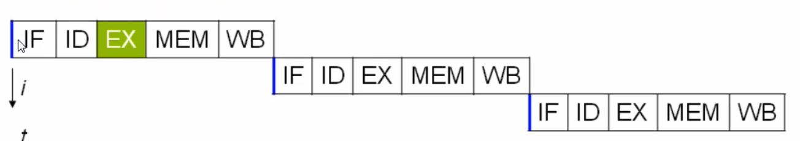

在不改变程序结果的前提下,这些指令的各个阶段可以通过**重排序**和**组合**来实现**指令级并行**

### 1.3.2.支持流水线的处理器

现在CPU支持多级指令流水线,例如支持同时执行`取指令->指令译码->执行指令->内存访问->数据写回`的处理器,就可以称之为**五级指令流水线**.这时CPU可以在一个时钟周期内,同时运行五条指令的不同阶段(相当于一条执行时间最长的复杂指令),IPC=1,本质上,流水线技术并不能缩短单条指令的执行时间,但它变相地提高了指令地吞吐率.

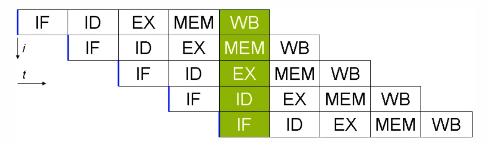

### 1.3.3.有序性问题

~~~java
int num = 0;
boolean ready = false;
// 线程1 执行此方法
public void actor1(I_Result r) {
	if(ready) {
		r.r1 = num + num;
	} else {
		r.r1 = 1;
	}
}
// 线程2 执行此方法
public void actor2(I_Result r) {
	num = 2;
	ready = true;
}
~~~

情况1:线程1先执行,这时ready=false,所以进入else分支结果为1;

情况2:线程2先执行num=2,但还没来得及执行ready=true,还是进入else分支,结果为1;

情况3:线程2执行到ready=true,线程1执行,这回进入if分支,结果为4;

**情况4:线程2执行ready =true,切换到线程1,进入if分支,相加为0;**

## 1.4.Volatile原理

volatile的底层实现原理是内存屏障,Memory Barrier(Memory Fence);

* 对volatile变量的写指令后会加入写屏障;
*   对volatile变量的读指令前会加入读屏障;

~~~java
int num = 0;
volatile boolean ready = false;
// 线程1 执行此方法
public void actor1(I_Result r) {
	if(ready) {
		r.r1 = num + num;
	} else {
		r.r1 = 1;
	}
}
// 线程2 执行此方法
public void actor2(I_Result r) {
	num = 2;
	ready = true;
}
~~~

### 1.4.1.如何保证可见性

* **写屏障(sfence)保证在该屏障之前的,对共享变量的改动,都同步到内存中;**

* ~~~java
  public void actor2(I_Result r){
    num = 2;
    ready = true;//ready是volatile赋值带写屏障
    //写屏障
  }
  ~~~

* **读屏障(lfence)保证在屏障之后,对共享变量的读取,加载的是主存中的最新数据;**

* ~~~java
  public void actor1(I_Result r){
    //读屏障
    //ready是volatile读取值带读屏障
    if(ready){
      r.r1 = num+num;
    }else{
      r.r1 = 1;
    }
  }
  ~~~

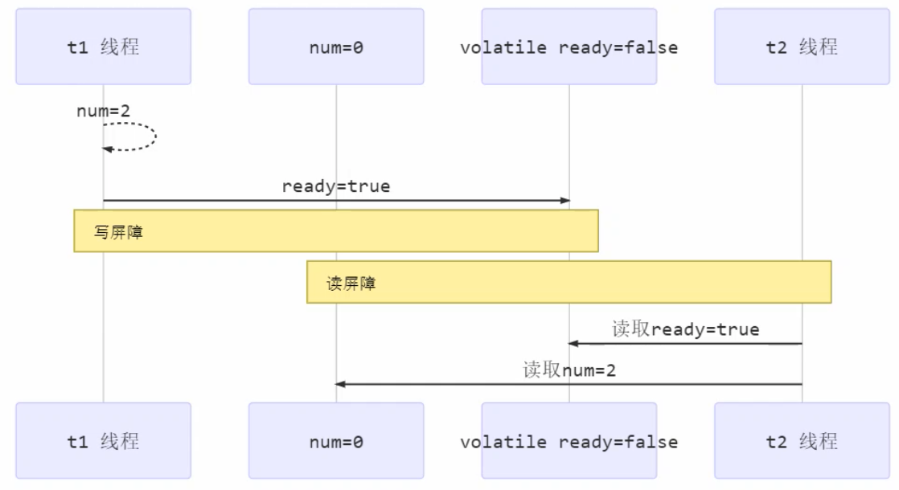

### 1.4.2.如何保证有序性

* **写屏障会确保指令重排序时,不会将写屏障之前的代码排在写屏障之后;**

* ~~~java
  public void actor2(I_Result r){
    num = 2;
    ready = true;//ready是volatile赋值带写屏障
    //写屏障
  }
  ~~~

* **读屏障会确保指令重排序时,不会将读屏障之后的代码排在读屏障之前;**

* ~~~java
  public void actor1(I_Result r){
    //读屏障
    //ready是volatile读取值带读屏障
    if(ready){
      r.r1 = num+num;
    }else{ 
      r.r1 = 1;
    }
  }
  ~~~

  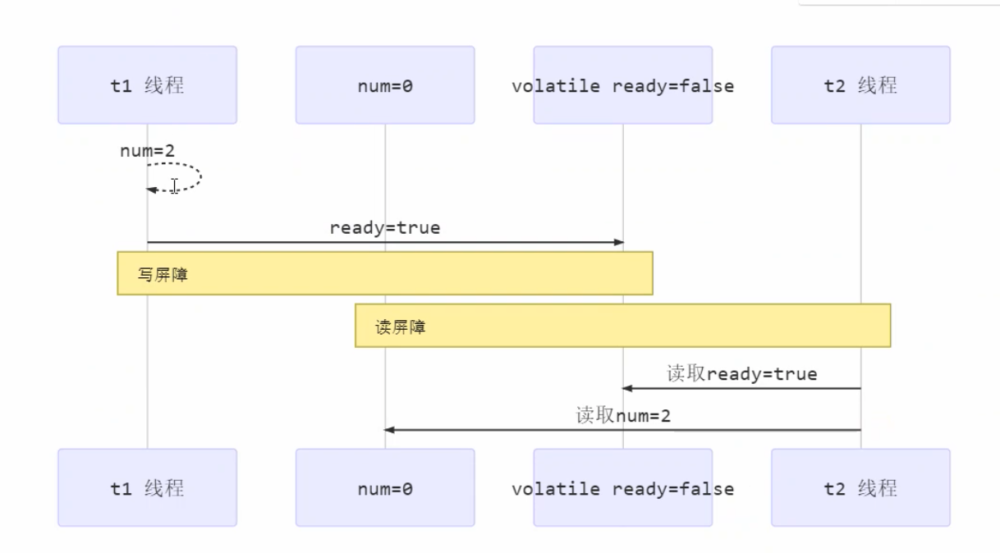

> 但是并不能解决指令交错(下图所示):
>
> * **写屏障仅仅是保证之后的读能够读到最新的结果,但不能保证读跑到它前面去;**
> * **而有序新的保证也只是保证了本线程内的相关代码不被重新排序;**

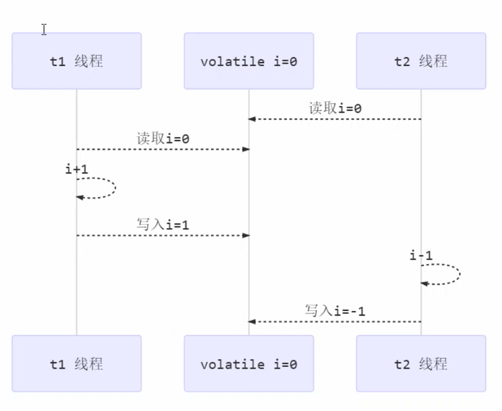

### 1.4.3.double-checked-locking(DCL)问题

~~~java
public final class Singleton {
	private Singleton() { }
	private static Singleton INSTANCE = null;
	public static Singleton getInstance() {
		if(INSTANCE == null) { // t2
			// 首次访问会同步，而之后的使用没有 synchronized
			synchronized(Singleton.class) {
				if (INSTANCE == null) { // t1
					INSTANCE = new Singleton();
				}
			}
		}
		return INSTANCE;
	}
}
~~~

以上的实现特点是:

* 懒惰实例化;
* 首次使用`getInstance()`才使用synchronized加锁,后续使用无需加锁;
* 第一个if使用了INSTANCE变量,是在同步代码块之外,但在多线程环境下,上面的代码是由问题的.

getInstance方法对应的字节码为:

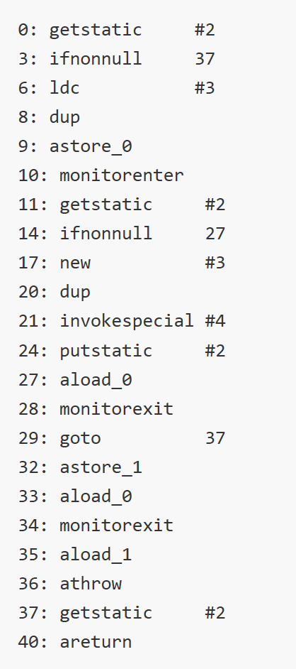

* 17表示创建对象,将对象应用入栈; //new Singleton;
* 20表示复制一份对象引用 //引用地址
* 21表示利用一个对象引用,调用构造方法;
* 24表示利用一个对象引用,赋值给static INSTANCE

也许JVM会优化为先执行24,再执行21.如果两个线程t1,t2按如下时间序列执行:

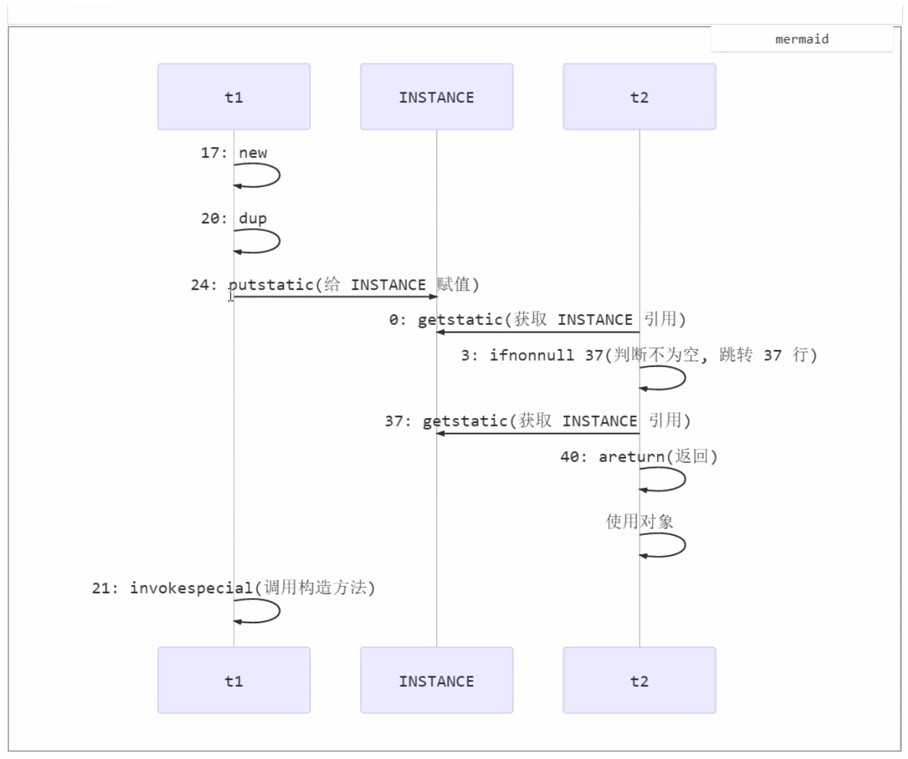

关键就在于t1还未完全将构造方法执行完毕,如果在构造方法中要执行很多初始化操作,那么t2拿到将是一个未初始化完毕的单例;**对INSTANCE使用volatile修饰即可,可以禁用指令重排,但要注意的是在JDK5以上的版本的volatile才会真正有效**;

### 1.4.4.double-checked-locking(DCL)解决

~~~java
public final class Singleton {
	private Singleton() { }
	private static volatile Singleton INSTANCE = null;
	public static Singleton getInstance() {
		if(INSTANCE == null) { 
			// 实例没有创建,才会进入内部的synchronized代码锁;
			synchronized(Singleton.class) {
        //也许有其他线程已经创建实例,所以再判断一次
				if (INSTANCE == null) { 
					INSTANCE = new Singleton();
				}
			}
		}
		return INSTANCE;
	}
}
~~~

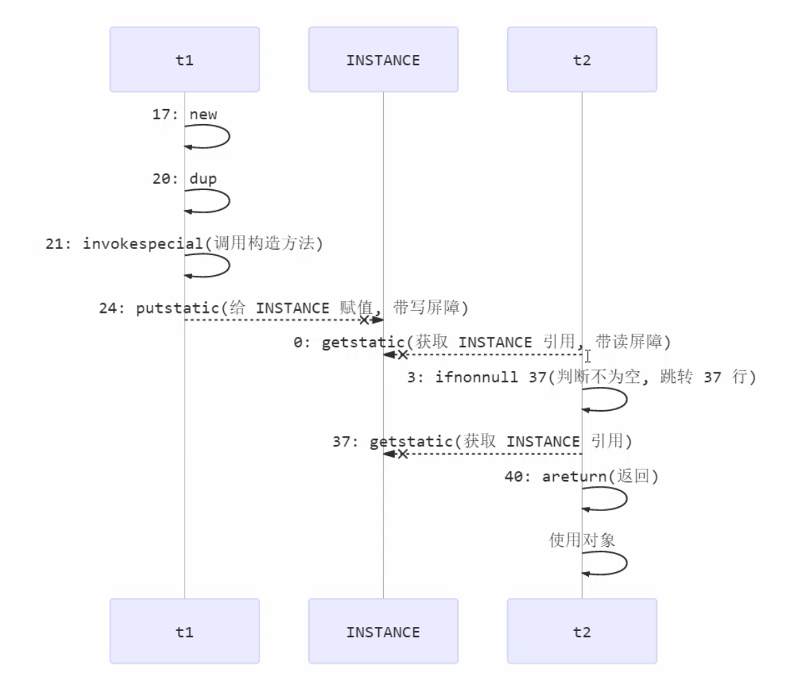 

# 2.共享模型之无锁

~~~java
public class AccountSafe {
    private AtomicInteger balance;

    public AccountSafe(Integer balance) {
        this.balance = new AtomicInteger(balance);
    }
    
    public Integer getBalance() {
        return balance.get();
    }
    
    public void withdraw(Integer amount) {
        while (true) {
            int prev = balance.get();
            int next = prev - amount;
          	//真正修改,修改成功那么返回true,退出循环;
            if (balance.compareAndSet(prev, next)) {
                break;
            }
        }
        // 可以简化为下面的方法
        // balance.addAndGet(-1 * amount);
    }
}
~~~

## 2.1.CAS与volatile

**CAS**

前面看到的`AtomicInteger`的解决方法,内部并没有用锁来保护共享变量的线程安全.其中的关键就是compareAndSet,它的简称就是CAS(Compare And Swap的说法),它必须是原子操作;

~~~java
public void withdraw(Integer amount) {
        while (true) {
            int prev = balance.get();
            int next = prev - amount;
          	//真正修改,修改成功那么返回true,退出循环;
            if (balance.compareAndSet(prev, next)) {
                break;
            }
        }
    }
~~~

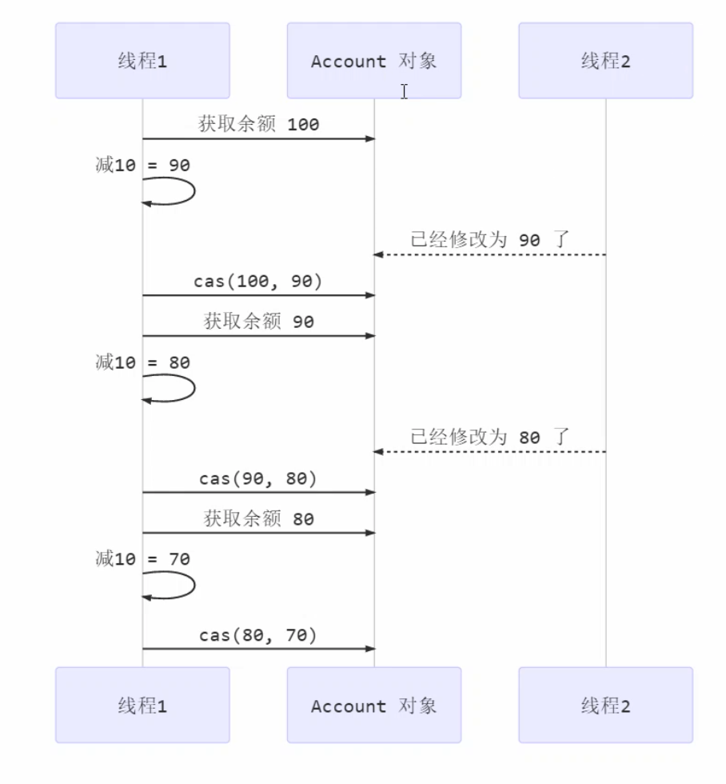

其实CAS的底层是`lock cmpxchg`指令(X86架构),在单核CPU和多核CPU下能够保证**比较交换**的原子性;在多核状态下,某个核执行到带lock的指令时,CPU会让总线锁住,当这个核把此指令执行完毕,再开启总线,这个过程不会被线程的调度机制打断,保证了多个线程对内存操作的准确性,是原子的.

**volatile**

在获取共享变量时,为了保证该变量的可见性,需要使用volatile修饰;它可以用来修饰成员变量和静态变量,也可以避免线程从自己的工作缓存中查找变量的值,必须到主存中获取它的值,线程操作volatile变量都是直接操作主存,即一个线程对volatile变量的修改,对另一个线程可见.**CAS必须借助volatile才能读到共享变量的最新值来实现比较并交换的效果**.

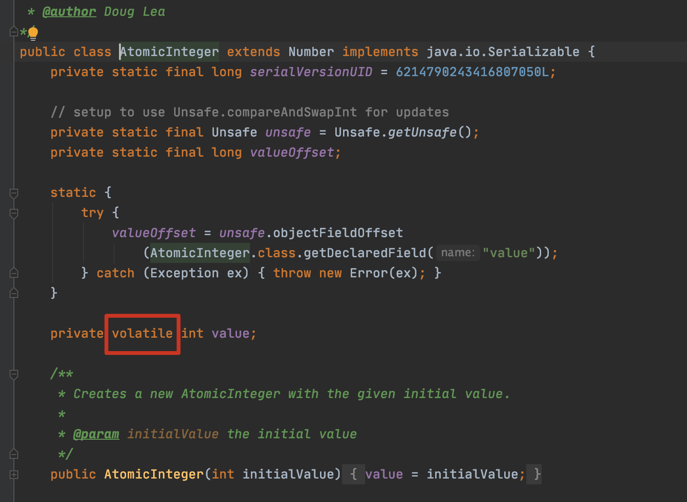

## 2.2.CAS的特点

结合CAS和volatile可以实现无锁并发,适用于线程数少,多核CPU的场景下;

* CAS是基于乐观锁的思想,不怕别的线程来修改共享变量,可以重试;
  * 因为没有适用synchronized,所以线程不会陷入阻塞;
  * 如果竞争激烈,重试情况必然频繁发生,效率反而会受到影响;
* synchronized是基于悲观锁的思想,防止别的线程来修改共享变量;

## 2.3.原子整数

JUC并发提供了:

* AtomicBoolean
* AtomicInteger
* AtomicLong

~~~java
AtomicInteger i = new AtomicInteger(0);
// 获取并自增（i = 0, 结果 i = 1, 打印 0），类似于 i++
System.out.println(i.getAndIncrement());
// 自增并获取（i = 1, 结果 i = 2, 打印 2），类似于 ++i
System.out.println(i.incrementAndGet());
// 自减并获取（i = 2, 结果 i = 1, 打印 1），类似于 --i
System.out.println(i.decrementAndGet());
// 获取并自减（i = 1, 结果 i = 0, 打印 1），类似于 i--
System.out.println(i.getAndDecrement());
// 获取并加值（i = 0, 结果 i = 5, 打印 0）
System.out.println(i.getAndAdd(5));
// 加值并获取（i = 5, 结果 i = 0, 打印 0）
System.out.println(i.addAndGet(-5));
// 获取并更新（i = 0, p 为 i 的当前值, 结果 i = -2, 打印 0）
// 其中函数中的操作能保证原子，但函数需要无副作用
System.out.println(i.getAndUpdate(p -> p - 2));
// 更新并获取（i = -2, p 为 i 的当前值, 结果 i = 0, 打印 0）
// 其中函数中的操作能保证原子，但函数需要无副作用
System.out.println(i.updateAndGet(p -> p + 2));
// 获取并计算（i = 0, p 为 i 的当前值, x 为参数1, 结果 i = 10, 打印 0）
// 其中函数中的操作能保证原子，但函数需要无副作用
// getAndUpdate 如果在 lambda 中引用了外部的局部变量，要保证该局部变量是 final 的
// getAndAccumulate 可以通过 参数1 来引用外部的局部变量，但因为其不在 lambda 中因此不必是 final
System.out.println(i.getAndAccumulate(10, (p, x) -> p + x));
// 计算并获取（i = 10, p 为 i 的当前值, x 为参数1, 结果 i = 0, 打印 0）
// 其中函数中的操作能保证原子，但函数需要无副作用
System.out.println(i.accumulateAndGet(-10, (p, x) -> p + x));
~~~

## 2.4.原子引用

* AtomicReference
* AtomicMarkableReference
* AtomicStampedReference

~~~java
public class DecimalAccountSafe {
    
    AtomicReference<BigDecimal> ref;

    public DecimalAccountSafe(BigDecimal balance) {
        ref = new AtomicReference<>(balance);
    }

    public BigDecimal getBalance() {
        return ref.get();
    }
    
    public void withdraw(BigDecimal amount) {
        while (true) {
            BigDecimal prev = ref.get();
            BigDecimal next = prev.subtract(amount);
            if (ref.compareAndSet(prev, next)) {
                break;
            }
        }
    }
}
~~~

### 2.4.1.ABA问题及解决

~~~java
@Slf4j
public class CasAba {
    static AtomicReference<String> ref = new AtomicReference<>("A");

    public static void main(String[] args) throws InterruptedException {
        log.debug("main start...");
        // 获取值 A
        // 这个共享变量被它线程修改过？
        String prev = ref.get();
        other();
        Thread.sleep(1000);
        // 尝试改为 C
        log.debug("change A->C {}", ref.compareAndSet(prev, "C"));
    }

    private static void other() throws InterruptedException {
        new Thread(() -> {
            log.debug("change A->B {}", ref.compareAndSet(ref.get(), "B"));
        }, "t1").start();
        Thread.sleep(500);
        new Thread(() -> {
            log.debug("change B->A {}", ref.compareAndSet(ref.get(), "A"));
        }, "t2").start();
    }
}
~~~

线程仅仅能判断出共享变量的值和最初值A是否相同,不能感知到这种从A改到B又改回A的情况,如果线程希望,只要有其他线程改动过共享变量,那么就算CAS失败,比较值肯定是不够的,需要再加一个版本号`AtomicStampedReference`;

~~~java
@Slf4j
public class CasAbaSolved {
    static AtomicStampedReference<String> ref = new AtomicStampedReference<>("A", 0);
    public static void main(String[] args) throws InterruptedException {
        log.debug("main start...");
        // 获取值 A
        String prev = ref.getReference();
        // 获取版本号
        int stamp = ref.getStamp();
        log.debug("版本 {}", stamp);
        // 如果中间有其它线程干扰，发生了 ABA 现象
        other();
        Thread.sleep(1000);
        // 尝试改为 C
        log.debug("change A->C {}", ref.compareAndSet(prev, "C", stamp, stamp + 1));
    }
    private static void other() throws InterruptedException {
        new Thread(() -> {
            log.debug("change A->B {}", ref.compareAndSet(ref.getReference(), "B",
                    ref.getStamp(), ref.getStamp() + 1));
            log.debug("更新版本为 {}", ref.getStamp());
        }, "t1").start();
        Thread.sleep(500);
        new Thread(() -> {
            log.debug("change B->A {}", ref.compareAndSet(ref.getReference(), "A",
                    ref.getStamp(), ref.getStamp() + 1));
            log.debug("更新版本为 {}", ref.getStamp());
        }, "t2").start();
    }
}
~~~

`AtomicStampedReference`可以给原子引用加上版本号,追踪原子引用整个变化过程,通过AtomicStampedReference我们可以知道,引用变量中途被更改了几次.但是有时候,我们并不关心引用变量更改了几次,只是单纯的关心是否更改过,所以便有了`AtomicMarkabelReference`;

~~~java
class GarbageBag {
    String desc;

    public GarbageBag(String desc) {
        this.desc = desc;
    }

    public void setDesc(String desc) {
        this.desc = desc;
    }

    @Override
    public String toString() {
        return super.toString() + " " + desc;
    }
}
~~~

~~~java
@Slf4j
public class TestABAAtomicMarkableReference {
    public static void main(String[] args) throws InterruptedException {
        GarbageBag bag = new GarbageBag("装满了垃圾");
        // 参数2 mark 可以看作一个标记，表示垃圾袋满了
        AtomicMarkableReference<GarbageBag> ref = new AtomicMarkableReference<>(bag, true);
        log.debug("主线程 start...");
        GarbageBag prev = ref.getReference();
        log.debug(prev.toString());
        new Thread(() -> {
            log.debug("打扫卫生的线程 start...");
            bag.setDesc("空垃圾袋");
            while (!ref.compareAndSet(bag, bag, true, false)) {
              
            }
            log.debug(bag.toString());
        }).start();
        Thread.sleep(1000);
        log.debug("主线程想换一只新垃圾袋？");   
        boolean success = ref.compareAndSet(prev, new GarbageBag("空垃圾袋"), true, false);
        log.debug("换了么？" + success);
        log.debug(ref.getReference().toString());
    }
}
~~~

## 2.5.原子数组

* AtomicIntegerArray
* AtomicLongArray
* AtomicReferenceArray

## 2.6.字段更新器

* AtomicReferenceFieldUpdater
* AtomicIntegerFieldUpdater
* AtomicLongFieldUpdater

利用字段更新器,可以针对对象的某个域(Field)进行原子操作,只能配合`volatile`修饰的字段使用否则会出现异常;

~~~java
public class DemoTest {

    //private static final Logger logger = LoggerFactory.getLogger(DemoTest.class);

    private volatile int field;
  
    public static void main(String[] args) {
        AtomicIntegerFieldUpdater fieldUpdater =
                AtomicIntegerFieldUpdater.newUpdater(DemoTest.class, "field");
        DemoTest demoTest = new DemoTest();
        fieldUpdater.compareAndSet(demoTest, 0, 10);
        // 修改成功 field = 10
        System.out.println(demoTest.field);
        // 修改成功 field = 20
        fieldUpdater.compareAndSet(demoTest, 10, 20);
        System.out.println(demoTest.field);
        // 修改失败 field = 20
        fieldUpdater.compareAndSet(demoTest, 10, 30);
        System.out.println(demoTest.field);
    }
}
~~~

## 2.7.原子累加器

原子累加器`LongAdder()`性能相比较`AtomicLong`提升很大,原因就是在有竞争的时候,设置多个累加单元,线程一累加Cell[0],线程二累加Cell[1]等等.最后将结果汇总.这样它们在累加时操作不同的Cell变量,因此减少了CAS重试失败,从而提高性能.

### 2.7.1.LongAdder源码

下面是LongAdder类的几个关键域

* cells是累加单元数组,懒惰初始化;
* base:基础值,如果没有竞争,那么用cas累加这个域;
* cellsBusy:在cells创建或者扩容的时候置为1,表示加锁

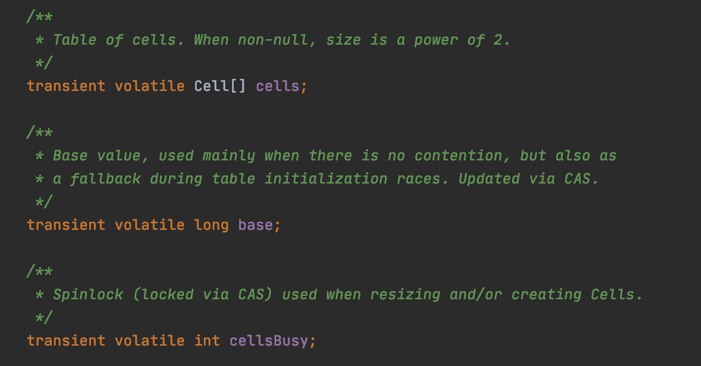

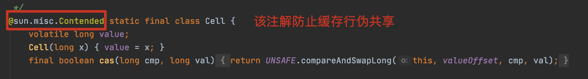

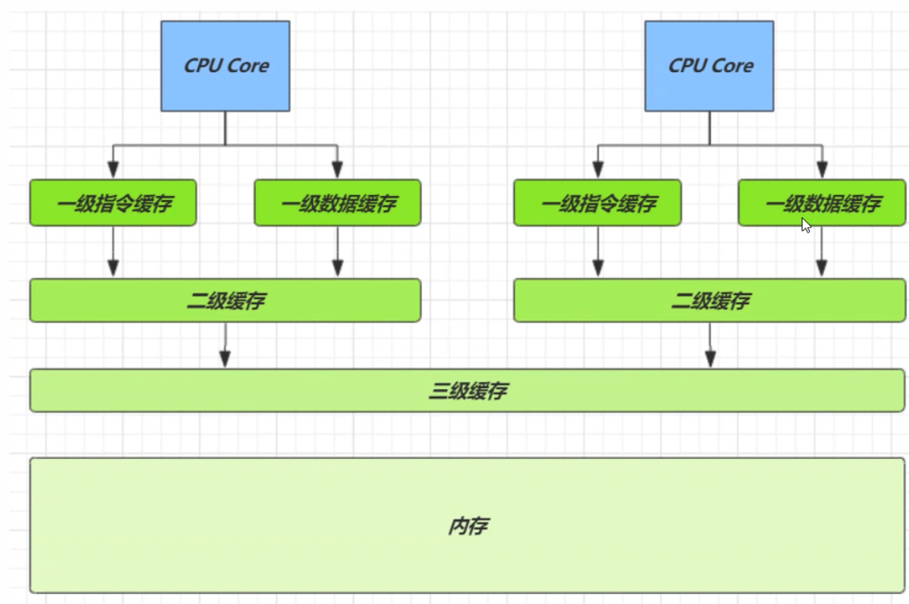

因为CPU和内存的速度差异很大,需要靠预读数据至缓存来提升效率.而缓存以**缓存行**为单位.每个缓存行对应着一块内存,一般是64byte.缓存的加入会造成数据副本的产生,即同一份数据会缓存在不同核心的缓存行中.CPU要保证数据的一致性,如果某个CPU核心更改了数据,其他CPU核心对应的整个缓存行必须失效.

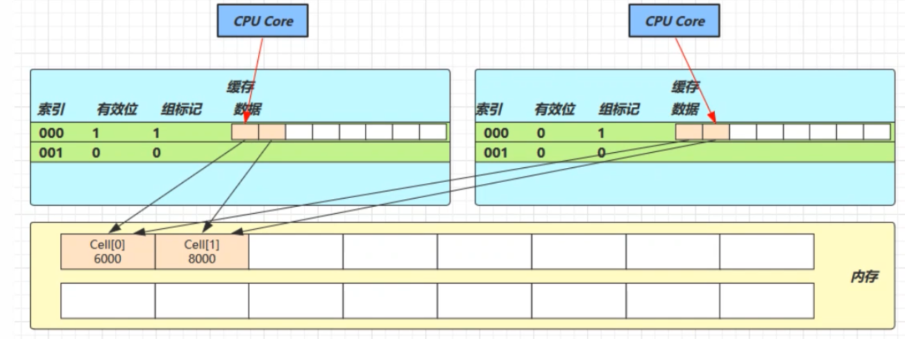

因为Cell是数组形式,在内存中是连续存储的,一个Cell为24个直接(16字节的对象头和8直接的value),因此缓存行可以存下2个Cell对象.问题就会出现:核心1要修改Cell[0],核心2要修改Cell[1],无论谁修改成功,都会导致对方的Core缓存行为失效. `@sun.misc.Contended`用来解决这个问题,它的原理是在使用此注解的对象或者字段的前后各增加128字节大小的padding,从而让CPU将对象读至缓存时占用不同的缓存行,不会造成对方缓存行的失效,解决**缓存行伪共享**.

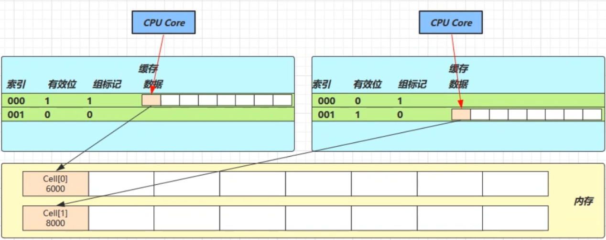

`LongAdder`的`add()`方法流程:

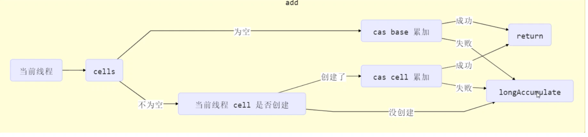

 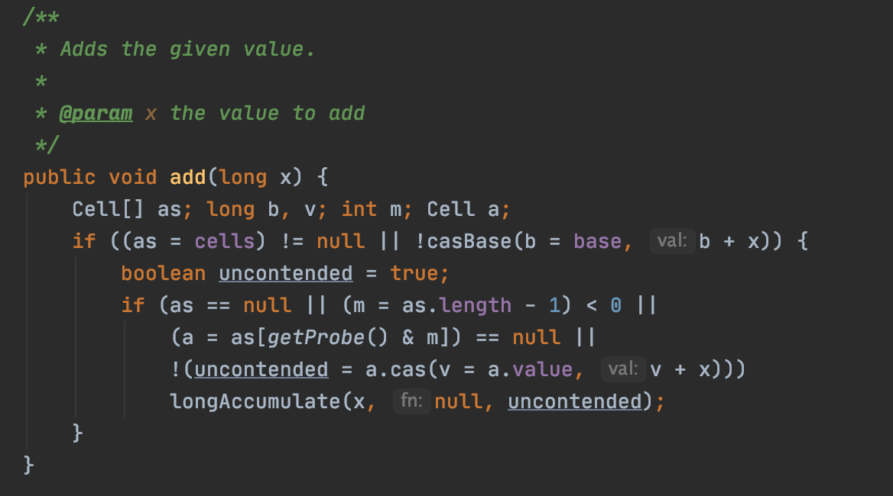

`LongAdder`的`longAccumulate()`方法流程:

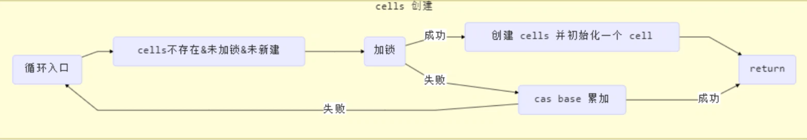

## 2.8.Unsafe

Unsafe对象提供了非常底层的,操作内存,线程的方法,Unsafe对象不能直接调用,只能通过反射获取.我们可以通过Unsafe来自定义一个AtomicData;

~~~java
class AtomicData {
    private volatile int data;
    static final Unsafe unsafe;
    static final long DATA_OFFSET;

    static {
        try {
            Field theUnsafe = Unsafe.class.getDeclaredField("theUnsafe");
            theUnsafe.setAccessible(true);
            //因为该属性是静态的是属于类的,所以直接get(null)不需要传入对象;
            unsafe = (Unsafe) theUnsafe.get(null);
        } catch (NoSuchFieldException | IllegalAccessException e) {
            throw new Error(e);
        }
        try {
            // data 属性在 DataContainer 对象中的偏移量，用于 Unsafe 直接访问该属性
            DATA_OFFSET = unsafe.objectFieldOffset(AtomicData.class.getDeclaredField("data"));
        } catch (NoSuchFieldException e) {
            throw new Error(e);
        }
    }

    public AtomicData(int data) {
        this.data = data;
    }

    public void decrease(int amount) {
        int oldValue;
        while (true) {
            // 获取共享变量旧值，可以在这一行加入断点，修改 data 调试来加深理解
            oldValue = data;
            // cas 尝试修改 data 为 旧值 + amount，如果期间旧值被别的线程改了，返回 false
            if (unsafe.compareAndSwapInt(this, DATA_OFFSET, oldValue, oldValue - amount)) {
                return;
            }
        }
    }

    public int getData() {
        return data;
    }
}
~~~

