# Java并发编程04

# 1.共享模型之不可变

## 1.1.日期转化的问题

~~~java
public class DemoTest {
    public static void main(String[] args) {
        SimpleDateFormat sdf = new SimpleDateFormat("yyyy-MM-dd");
        for (int i = 0; i < 10; i++) {
            new Thread(() -> {
                try {
                    System.out.println(sdf.parse("1951-04-21"));
                    //log.debug("{}", sdf.parse("1951-04-21"));
                } catch (Exception e) {
                    System.out.println(e);
                    throw new RuntimeException(e);
                    //log.error("{}", e);
                }
            }).start();
        }
    }
}
~~~

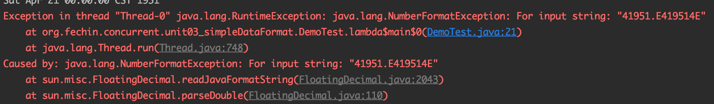

下面的代码在运行时候,由于SimpleDateFormat不是线程安全.

1. **思路-同步锁**

~~~java
public class DemoTest02 {
    public static void main(String[] args) {
        SimpleDateFormat sdf = new SimpleDateFormat("yyyy-MM-dd");
        for (int i = 0; i < 50; i++) {
            new Thread(() -> {
                synchronized (sdf) {
                    try {
                        System.out.println(sdf.parse("1951-04-21"));
                    } catch (Exception e) {
                        System.out.println(e);
                        throw new RuntimeException(e);
                    }
                }
            }).start();
        }
    }
}
~~~

2. **思路-不可变**

如果一个对象在不能够修改其内部状态(属性),那么它就是线程安全,因为它不存在并发修改.这样的对象在Java中有很多,例如在Java8后,提供了一个新的日期格式化类.

~~~java
public class DemoTest03 {
    public static void main(String[] args) {
        DateTimeFormatter dtf = DateTimeFormatter.ofPattern("yyyy-MM-dd");
        for (int i = 0; i < 10; i++) {
            new Thread(() -> {
                LocalDate date = dtf.parse("2018-10-01", LocalDate::from);
                System.out.println(date);
            }).start();
        }
    }
}
~~~

## 1.2.不可变设计

另一个大家更为熟悉的`String`类是不可变的,以它为例,说明一下不可变设计的要素.

发现该类,类中所有属性都是final的:

* 属性用final修饰保证了该属性是只读的,不能修改;
* 类用final修饰保证了该类中的方法不能不覆盖,防止子类无意间破坏不可变性;

**保护性拷贝**:使用字符串时,也有一些跟修改相关的方法啊.比如substring等;

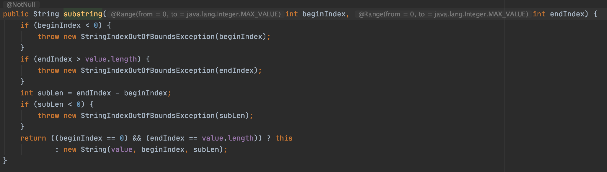

发现其内部是调用String的构造方法创建了一个新字符串,再进入这个构造看看.是否对final char[] value做出了修改.结果发现也没有,构造新字符串对象时,会生成新的char[] value,对内容进行复制.这种通过创建副本对象来避免共享的手段称为**保护性拷贝**;

## 1.3.设计模式-享元模式

### 1.3.1.简介

Flyweight pattern,出现在当需要重用数量有限的同一类对象时;

### 1.3.2.体现

#### 1.3.2.1.包装类

在JDK中Boolean,Byte,Short,Integer,Long,Character等包装类提供了valueOf()方法,例如Long的valueOf会缓存-128~127之间的Long对象,在这个范围之间会重用对象,大于这个范围,才会新建Long对象;

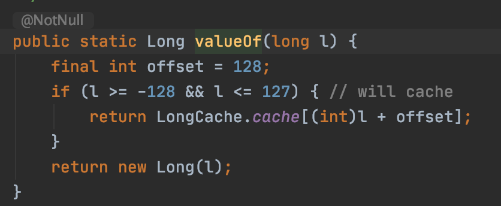

> * Byte,Short,Long缓存的范围都是-128~127;
> * Character缓存的范围是0~127;
> * Integer的默认范围是-128~127
>   * 最小值不能变
>   * 最大值可以通过调整虚拟机参数`-Djava.lang.Integer.IntegerCache.high`来改变
> * Boolean缓存了TRUE和FALSE;

#### 1.3.2.2.String串池

#### 1.3.2.3.BigDecimal BigInteger

### 1.3.3.模式体现-自定义连接池

~~~java
class Pool {
    // 1. 连接池大小
    private final int poolSize;
    // 2. 连接对象数组
    private Connection[] connections;
    // 3. 连接状态数组 0 表示空闲， 1 表示繁忙
    private AtomicIntegerArray states;

    // 4. 构造方法初始化
    public Pool(int poolSize) {
        this.poolSize = poolSize;
        this.connections = new Connection[poolSize];
        this.states = new AtomicIntegerArray(new int[poolSize]);
        for (int i = 0; i < poolSize; i++) {
            //自定义MockConnection,实现Connection
            connections[i] = new MockConnection();
        }
    }

    // 5. 借连接
    public Connection borrow() {
        while (true) {
            for (int i = 0; i < poolSize; i++) {
                // 获取空闲连接
                if (states.get(i) == 0) {
                    if (states.compareAndSet(i, 0, 1)) {
                        System.out.println(connections[i]);
                        return connections[i];
                    }
                }
            }
            // 如果没有空闲连接，当前线程进入等待
            synchronized (this) {
                try {
                    System.out.println("wait..");
                    this.wait();
                } catch (InterruptedException e) {
                    e.printStackTrace();
                }
            }
        }
    }

    // 6. 归还连接
    public void free(Connection conn) {
        for (int i = 0; i < poolSize; i++) {
            if (connections[i] == conn) {
                states.set(i, 0);
                synchronized (this) {
                    System.out.println("free "+conn);
                    this.notifyAll();
                }
                break;
            }
        }
    }
}
~~~

以上实现没有考虑:

* 连接的动态增长与搜索;
* 连接保活(可用性检测);
* 等待超时处理;
* 分布式hash;

对于关系型数据库,有比较成熟的连接池实现,例如c3p0.druid等;对于更通用的对象池.可以考虑使用apache common pool.例如redis连接池可以参考jedis中关于连接池的实现;

## 1.4.无状态

设计Servlet时为了保证线程安全,会有这样的建议,不要为Servlet设置成员变量,这种没有任何成员变量的类是线程安全的.因为成员变量保存的数据也可以称为状态信息,因此没有成员变量称之为无状态;

# 2.共享模型之工具

## 2.1.线程池

### 2.1.1.自定义线程池

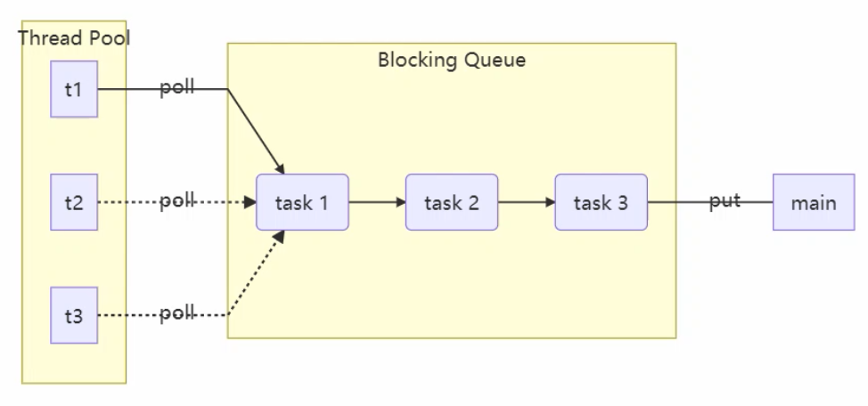

1. 自定义拒绝策略接口

~~~java
@FunctionalInterface
// 拒绝策略
interface RejectPolicy<T> {
    void reject(BlockingQueue<T> queue, T task);
}
~~~

2. 自定义任务队列

~~~java
class BlockingQueue<T> {
    // 1. 任务队列
    private Deque<T> queue = new ArrayDeque<>();
    // 2. 锁
    private ReentrantLock lock = new ReentrantLock();
    // 3. 生产者条件变量
    private Condition fullWaitSet = lock.newCondition();
    // 4. 消费者条件变量
    private Condition emptyWaitSet = lock.newCondition();
    // 5. 容量
    private int capcity;

    public BlockingQueue(int capcity) {
        this.capcity = capcity;
    }

    // 带超时阻塞获取
    public T poll(long timeout, TimeUnit unit) {
        lock.lock();
        try {
            // 将 timeout 统一转换为 纳秒
            long nanos = unit.toNanos(timeout);
            while (queue.isEmpty()) {
                try {
                    if (nanos <= 0) {
                        return null;
                    }
                    // 返回值是剩余时间
                    nanos = emptyWaitSet.awaitNanos(nanos);
                } catch (InterruptedException e) {
                    e.printStackTrace();
                }
            }
            T t = queue.removeFirst();
            fullWaitSet.signal();
            return t;
        } finally {
            lock.unlock();
        }
    }

    // 阻塞获取
    public T take() {
        lock.lock();
        try {
            while (queue.isEmpty()) {
                try {
                    emptyWaitSet.await();
                } catch (InterruptedException e) {
                    e.printStackTrace();
                }
            }
            T t = queue.removeFirst();
            fullWaitSet.signal();
            return t;
        } finally {
            lock.unlock();
        }
    }

    // 阻塞添加
    public void put(T task) {
        lock.lock();
        try {
            while (queue.size() == capcity) {
                try {
                    System.out.println("等待加入任务队列:"+task);
                    fullWaitSet.await();
                } catch (InterruptedException e) {
                    e.printStackTrace();
                }
            }
            System.out.println("加入任务队列:"+task);
            queue.addLast(task);
            emptyWaitSet.signal();
        } finally {
            lock.unlock();
        }
    }

    // 带超时时间阻塞添加
    public boolean offer(T task, long timeout, TimeUnit timeUnit) {
        lock.lock();
        try {
            long nanos = timeUnit.toNanos(timeout);
            while (queue.size() == capcity) {
                try {
                    if (nanos <= 0) {
                        return false;
                    }
                    System.out.println("等待加入任务队列"+task);
                    nanos = fullWaitSet.awaitNanos(nanos);
                } catch (InterruptedException e) {
                    e.printStackTrace();
                }
            }
            System.out.println("加入任务队列"+task);
            queue.addLast(task);
            emptyWaitSet.signal();
            return true;
        } finally {
            lock.unlock();
        }
    }

    public int size() {
        lock.lock();
        try {
            return queue.size();
        } finally {
            lock.unlock();
        }
    }

    public void tryPut(RejectPolicy<T> rejectPolicy, T task) {
        lock.lock();
        try {
            // 判断队列是否满
            if (queue.size() == capcity) {
                rejectPolicy.reject(this, task);
            } else { // 有空闲
                System.out.println("加入任务队列"+task);
                queue.addLast(task);
                emptyWaitSet.signal();
            }
        } finally {
            lock.unlock();
        }
    }
}
~~~

3. 自定义线程池

~~~java
class ThreadPool {
    // 任务队列
    private BlockingQueue<Runnable> taskQueue;
    // 线程集合
    private HashSet<Worker> workers = new HashSet<>();
    // 核心线程数
    private int coreSize;
    // 获取任务时的超时时间
    private long timeout;
    private TimeUnit timeUnit;
    private RejectPolicy<Runnable> rejectPolicy;

    // 执行任务
    public void execute(Runnable task) {
        // 当任务数没有超过 coreSize 时，直接交给 worker 对象执行
        // 如果任务数超过 coreSize 时，加入任务队列暂存
        synchronized (workers) {
            if (workers.size() < coreSize) {
                Worker worker = new Worker(task);
                System.out.println("新增 worker" + worker + "task" + task);
                workers.add(worker);
                worker.start();
            } else {
                // taskQueue.put(task);
                // 1) 死等
                // 2) 带超时等待
                // 3) 让调用者放弃任务执行
                // 4) 让调用者抛出异常
                // 5) 让调用者自己执行任务
                taskQueue.tryPut(rejectPolicy, task);
            }
        }
    }

    public ThreadPool(int coreSize, long timeout, TimeUnit timeUnit, int queueCapcity,
                      RejectPolicy<Runnable> rejectPolicy) {
        this.coreSize = coreSize;
        this.timeout = timeout;
        this.timeUnit = timeUnit;
        this.taskQueue = new BlockingQueue<>(queueCapcity);
        this.rejectPolicy = rejectPolicy;
    }

    class Worker extends Thread {
        private Runnable task;

        public Worker(Runnable task) {
            this.task = task;
        }

        @Override
        public void run() {
            // 执行任务
            // 1) 当 task 不为空，执行任务
            // 2) 当 task 执行完毕，再接着从任务队列获取任务并执行
            // while(task != null || (task = taskQueue.take()) != null) {
            while (task != null || (task = taskQueue.poll(timeout, timeUnit)) != null) {
                try {
                    System.out.println("正在执行..." + task);
                    task.run();
                } catch (Exception e) {
                    e.printStackTrace();
                } finally {
                    task = null;
                }
            }
            synchronized (workers) {
                System.out.println("worker被移除" + this);
                workers.remove(this);
            }
        }
    }
}
~~~

4. 测试类

```java
public class DemoTest {
    public static void main(String[] args) {
        ThreadPool threadPool = new ThreadPool(1,
                1000, TimeUnit.MILLISECONDS, 1, (queue, task)->{
            // 1. 死等
            // queue.put(task);
            // 2) 带超时等待
            // queue.offer(task, 1500, TimeUnit.MILLISECONDS);
            // 3) 让调用者放弃任务执行
            // log.debug("放弃{}", task);
            // 4) 让调用者抛出异常
            // throw new RuntimeException("任务执行失败 " + task);
            // 5) 让调用者自己执行任务
            // task.run();
        });
        for (int i = 0; i < 4; i++) {
            int j = i;
            threadPool.execute(() -> {
                try {
                    Thread.sleep(1000L);
                } catch (InterruptedException e) {
                    e.printStackTrace();
                }
            });
        }
    }
}
```

### 2.1.2.ThreadPoolExecutor

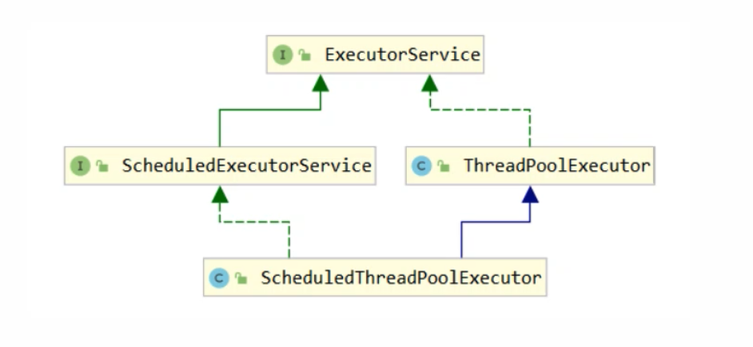

#### 2.1.2.1线程池状态

ThreadPoolExecutor使用int的高3位来表示线程池状态,低29位表示线程数量;

| 状态名     | 高3位 | 接收新任务 | 处理阻塞队列任务 | 说明                                     |
| ---------- | ----- | ---------- | ---------------- | ---------------------------------------- |
| RUNNING    | 111   | Y          | Y                |                                          |
| SHUTDOWN   | 000   | N          | Y                | 不会接收新任务,但会处理阻塞队列剩余任务; |
| STOP       | 001   | N          | N                | 会终端正在执行的任务,并抛弃阻塞队列任务; |
| TIDYING    | 010   | -          | -                | 任务全执行完毕,活动线程为0即将进入终结;  |
| TERMINATED | 011   | -          | -                | 终结状态                                 |

这些信息存储在一个原子变量ctl中,目的是将线程池状态与线程个数合二为一,这样就可以用一次CAS原子操作进行赋值;

~~~java
//c为旧值,ctlOf返回结果为新值
ctl.compareAndSet(c,ctlOf(targetState,workerCountOf(c)));

//rs为高3位代表线程池状态,wc为低29位代表线程个数,ctl是合并它们
private static int ctlOf(int rs,int wc){return rs|wc;}
~~~

#### 2.1.2.2.构造方法

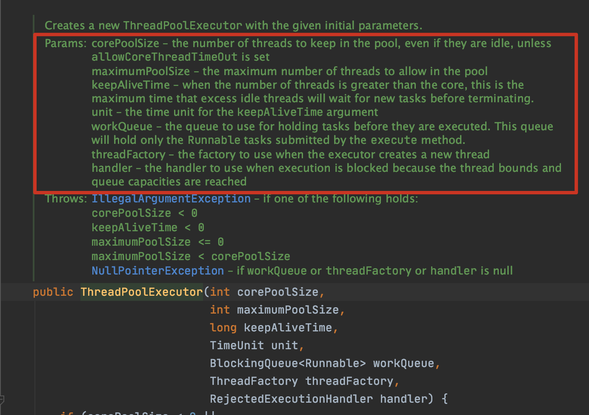

* corePoolSize:核心线程数目(最多保留的线程数);
* maximumPoolSize:最大线程数目;
* keepAliveTime:生存时间-针对救急线程;
* unit:时间单位-针对救急线程;
* workQeue:阻塞队列;
* threadFactory:线程工厂-可以为线程创建时起个好名字;
* handler 拒绝策略;

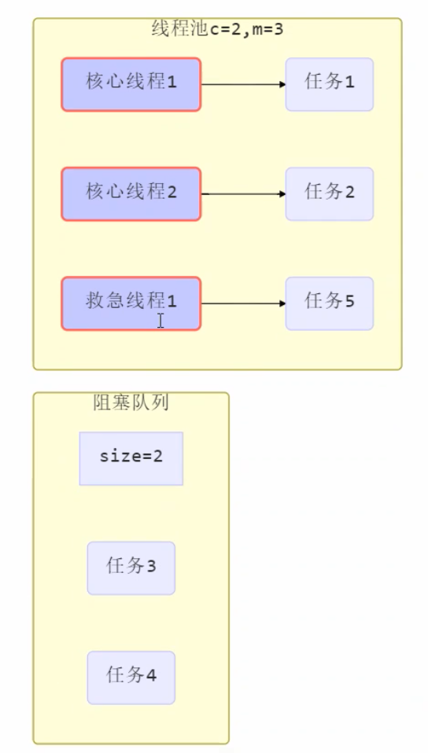

* 线程池中刚开始没有线程,当一个任务提交给线程池后,线程池会创建一个新的线程来执行任务;
* 当线程数达到corePoolSize并没有线程空闲时,这时候再加入任务,新加的任务会被加入workQueue队列排队,直到有空闲的线程;
* 如果队列选择了有界队列,那么任务超过了队列大小时,会创建maximumPoolSize-corePoolSize数目的线程来救急;
* 如果线程到达maximumPoolSize仍然有新任务这时候会执行拒绝策略.拒绝策略JDK提供了4种实现,其他框架也提供了实现:
  * AbortPolicy让调用这抛出RejectedExecutionException异常,这是默认策略;
  * CallerRunsPolicy让调用者运行任务;
  * DiscardPolicy放弃本次任务;
  * DiscardOldestPolicy:放弃队列中最早的任务,本任务取代它;
  * Dubbo的实现,在抛出RejectedExecutionException异常之前会记录日志,并dump线程栈信息,方便定位问题;
  * Netty的实现,是创建一个新线程来执行任务;
  * ActiveMQ的实现,带超时等待(60s)尝试放入队列:
  * PinPoint的实现,它使用了一个拒绝策略链,会逐一尝试策略链中每种拒绝策略;
* 当高峰过去后,超过corePoolSize的救急线程如果一段时间没有任务做,需要结束节省资源,这个时间由keepAliveTime和unit来控制;

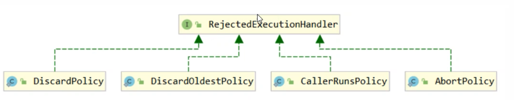

**根据这个构造方法,JDK Executors类中提供了众多工厂方法来创建各种用途的线程池.**

#### 2.1.2.3.FixedThreadPool

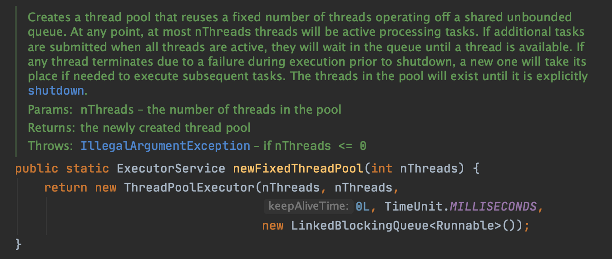

特点:

* 核心线程数=最大线程数,没有救急线程被创建,因此也无需超时时间;
* 阻塞队列是无界的,可以放任意数量的任务;

> 适用于任务量已知,相对耗时的任务

#### 2.1.2.4.CachedThreadPool

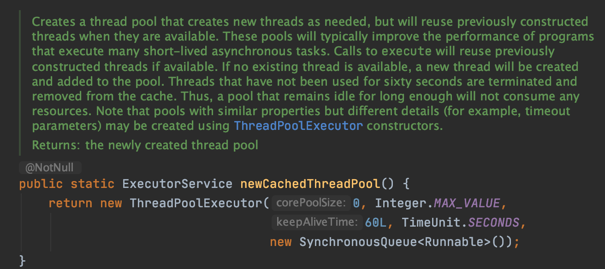

特点:

* 核心线程数是0,最大线程数是Integer.MAX_VALUE,救急线程的空闲生存时间是60s,意味着:
  * 全部都是救急线程(60s后可以回收)
  * 救急线程可以无限创建;
* 对列采用了SynchronousQueue,实现的特点是没有容量,没有线程来取是放不进去的(一手交钱一手交货);

> 该线程池表现为根据线程数会根据任务量不断增长,没有上线,当任务执行完毕,空闲1分钟后释放线程,适合任务比较秘籍,但每个任务执行时间较短的情况

#### 2.1.2.5.SingleThreadExecutor

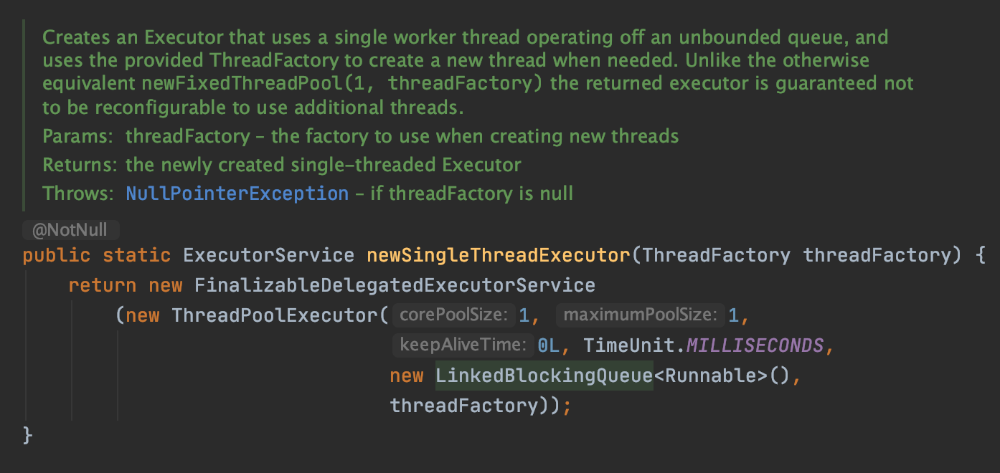

> 希望多个任务排队执行,线程数固定为1,任务多于1时,会放入无界队列排队,任务执行完毕,这唯一的线程也不会被释放.

#### 2.1.2.6.提交任务

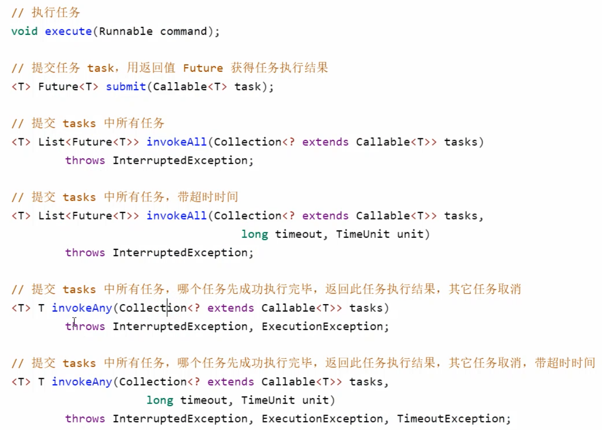

#### 2.1.2.7.关闭线程池

1. **shutdown**:线程池状态变为SHUTDOWN,不会接收新任务,但已提交任务会执行完,此方法不会阻塞调用线程的执行;

   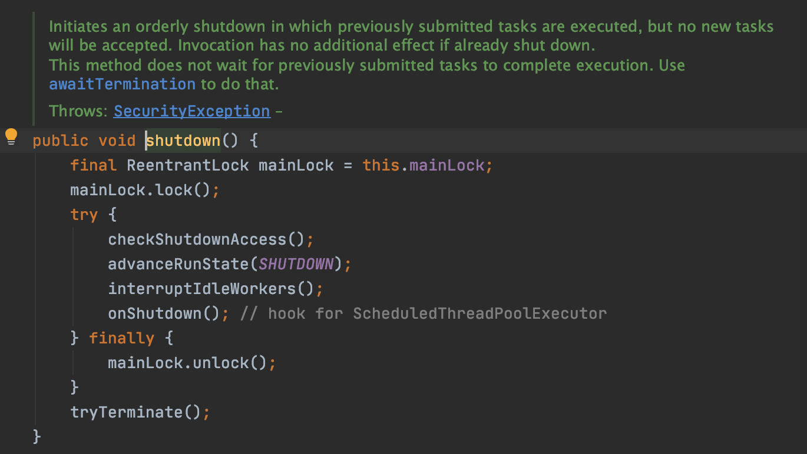

2. **shutdownNow**:线程池状态变为STOP,不会接收新任务,会将队列中的任务返回,并用interrupt的方式去中断正在执行的任务;

   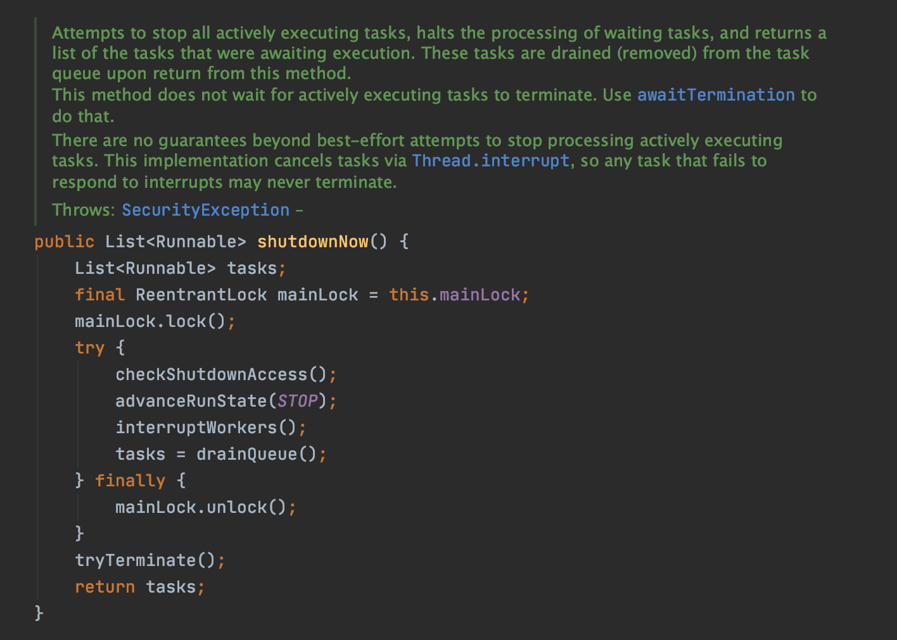

3. 其他方法:

   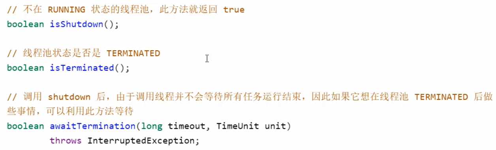

#### 2.1.2.8.设计模式-异步模式之工作线程

让有限的工作线程(Worker Thread)来轮流异步处理无限多的任务,也可以将其归类为分工模式,它的典型实现就是线程池,也体现了经典设计模式中的享元模式.

固定线程池大小会有饥饿现象,解决方法可以增加线程池大小,不过不是根本解决方法,我们可以采用不同的任务类型,采用不同的线程池; 

#### 2.1.2.9.创建多少线程池合适

* 过小会导致程序不能充分利用系统资源,容易导致饥饿;
* 过大会导致更多的线程上下文切换,占用更多的资源;

**CPU密集型运算**

通常采用`CPU核数+1`能够实现最优的CPU利用率,+1能够保证当线程由于页缺失故障(操作系统)或其他原因导致暂停时,额外的这个线程就能顶上去,保证CPU时钟周期不被浪费;

**I/O密集型运算**

CPU不总是处于繁忙状态,例如,当执行业务计算时,这时候会使用CPU资源,但当执行I/O操作时,远程RPC调用时,包括进行数据库操作时,这时候CPU就闲下来了,可以利用多线程提高它的利用率;经验公式如下:

`线程数 = 核数 * 期望CPU利用率 * 总时间(CPU计算时间+等待时间)/ CPU计算时间`

#### 2.1.2.10.ScheduledExecutorService任务调度线程池

在任务调度线程池功能加入之前,可以使用`java.util.Timer`来实现定时功能,Timer的优点在于简单易用,但由于所有的任务都是由同一个线程来调度,因此所有任务都是串行执行的,同一时间只能有一个任务在执行,前一个任务的延迟或异常都会影响到之后的任务,我们不推荐使用;

~~~java
public class DemoTest {
    public static void main(String[] args) {
        ScheduledExecutorService executor = Executors.newScheduledThreadPool(2);
        // 添加两个任务，希望它们都在 1s 后执行
        executor.schedule(() -> {
            System.out.println("任务1，执行时间：" + new Date());
            try {
                Thread.sleep(2000);
            } catch (InterruptedException e) {
            }
        }, 1000, TimeUnit.MILLISECONDS);
        executor.schedule(() -> {
            System.out.println("任务2，执行时间：" + new Date());
        }, 1000, TimeUnit.MILLISECONDS);
    }
}
~~~

~~~java
public class DemoTest02 {
    public static void main(String[] args) {
        ScheduledExecutorService executor = Executors.newScheduledThreadPool(2);
        executor.scheduleAtFixedRate(() -> {
            System.out.println("执行时间：" + new Date());
        }, 1000,1000, TimeUnit.MILLISECONDS);
    }
}
~~~

~~~java
public class DemoTest03 {
    public static void main(String[] args) {
        ScheduledExecutorService executor = Executors.newScheduledThreadPool(2);
        executor.scheduleWithFixedDelay(() -> {
            System.out.println("执行时间：" + new Date());
            try {
                Thread.sleep(1000);
            } catch (InterruptedException e) {
                e.printStackTrace();
            }
        }, 1000,1000, TimeUnit.MILLISECONDS);
    }
}
~~~

### 2.1.3.正确处理执行任务异常

方法一:主动捕获异常;

方法二:使用`Future`,调用`Future`的`get()`得到返回结果,如果抛出异常,也能通过该方法得到;

### 2.1.4.Tomcat线程池

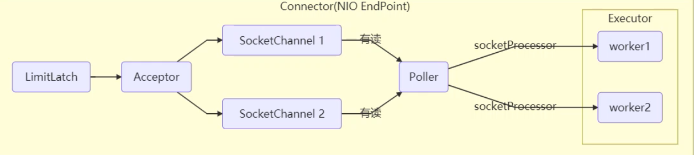

* LimitLatch用来限流,可以控制最大连接个数,类似JUC中的Semaphore;
* Acceptor只负责接收新的Socket连接;
* Poller只负责监听socket channel是否有可读的I/O事件;
* 一旦可读,封装一个任务对象`socketProcessor`,提交给Executor线程池处理;
* Executor线程池中的工作线程最终负责处理请求;

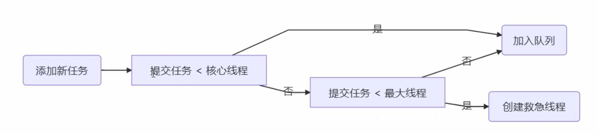

### 2.1.5.Fork/Join

#### 2.1.5.1.概念

Fork/Join是JDK1.7加入的新的线程池实现,它体现的是分治的思想,适用于能够进行任务拆分的CPU密集型运算.所谓的任务拆分,是将一个大任务拆分为算法上相同的小任务,直至不能拆分可以直接求解.根递归相关的一些计算,都可以适用分治思想进行求解.Fork/Join在分治的基础上加入了多线程,可以把每个任务的分解和合并交给不同的线程来完成,进一步提升了运算效率,Fork/Join默认会创建与cpu核心大小相同的线程池;

#### 2.1.5.2.使用

提交给Fork/Join线程池的任务需要继承`RecursiveTask(有返回值)`或`RecursiveAction(无返回值)`,例如下面定义了一个对1-n求和的任务

```java
class AddTask1 extends RecursiveTask<Integer> {
    int n;

    public AddTask1(int n) {
        this.n = n;
    }

    @Override
    public String toString() {
        return "{" + n + '}';
    }

    @Override
    protected Integer compute() {
        // 如果 n 已经为 1，可以求得结果了
        if (n == 1) {
            System.out.println("join() "+n);
            return n;
        }
        // 将任务进行拆分(fork)
        AddTask1 t1 = new AddTask1(n - 1);
        t1.fork();
        System.out.println("fork() "+n+" "+t1);
        // 合并(join)结果
        int result = n + t1.join();
        System.out.println("join() "+n+"+"+t1+"="+result);
        return result;
    }

    public static void main(String[] args) {
        ForkJoinPool pool = new ForkJoinPool(4);
        System.out.println(pool.invoke(new AddTask1(5)));
    }
}
```

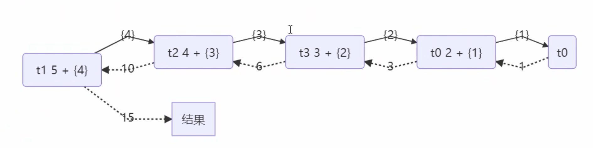

## 2.2.JUC

### 2.2.1.AQS原理

#### 2.2.1.1.概述

全称是AbstractQueuedSynchronizer,是阻塞式锁和相关的同步器工具的框架;

* 用state属性来表示资源的状态(分独占模式和共享模式),子类需要定义如何维护这个状态,控制如何获取锁和释放锁;
  * getState-获取state状态;
  * setState-设置state状态;
  * compareAndSetState-乐观锁机制设置state状态;
  * 独占模式是只有一个线程能够访问资源,而共享模式可以允许多个线程访问资源;
* 提供了基于FIFO(先进先出)的等待队列,类似于Monitor的EntryList;
* 条件变量来实现等待,唤醒机制,支持多个条件变量,类似于Monitor的WaitSet;

子类主要实现这样一些方法(默认抛出UnsupportedOperationException)

* tryAcquire 获取锁
* tryRelease 释放锁
* tryAcquireShared
* tryReleaseShared
* isHeldExclusively 是否持有独占锁

```java
@Slf4j(topic = "TestAqs")
public class TestAqs {
    public static void main(String[] args) {
        MyLock myLock = new MyLock();
        new Thread(() -> {
            myLock.lock();
            try {
                log.debug("locking");
            } finally {
                log.debug("unlocking");
                myLock.unlock();
            }
        }, "t1").start();
        
        new Thread(() -> {
            myLock.lock();
            try {
                log.debug("locking");
            } finally {
                log.debug("unlocking");
                myLock.unlock();
            }
        }, "t2").start();
    }
}

/**
 * 自定义锁(不可重入锁)
 */
class MyLock implements Lock {

    /**
     * 独占锁
     */
    class MySync extends AbstractQueuedSynchronizer {

        /**
         * 获取锁
         *
         * @param arg
         * @return
         */
        @Override
        protected boolean tryAcquire(int arg) {
            if (compareAndSetState(0, 1)) {
                //加上锁,并设置owner为当前线程
                setExclusiveOwnerThread(Thread.currentThread());
                return true;
            }
            return false;
        }

        /**
         * 释放锁
         *
         * @param arg
         * @return
         */
        @Override
        protected boolean tryRelease(int arg) {
            setExclusiveOwnerThread(null);
            setState(0);
            return true;
        }

        @Override
        protected boolean isHeldExclusively() {
            return getState() == 1;
        }

        public Condition newCondition() {
            return new ConditionObject();
        }
    }

    private MySync sync = new MySync();

    @Override
    public void lock() {
        sync.acquire(1);
    }

    @Override
    public void lockInterruptibly() throws InterruptedException {
        sync.acquireInterruptibly(1);
    }

    @Override
    public boolean tryLock() {
        return sync.tryAcquire(1);
    }

    @Override
    public boolean tryLock(long time, TimeUnit unit) throws InterruptedException {
        return sync.tryAcquireSharedNanos(1, unit.toNanos(time));
    }

    @Override
    public void unlock() {
        sync.release(1);
    }

    @Override
    public Condition newCondition() {
        return sync.newCondition();
    }
}
```

### 2.2.2.ReentrantLock原理


