# Java并发编程01

# 1.概念

## 1.1.进程与线程

**进程:**

* 程序由指令和数据组成,但这些指令要运行,数据要读写,就必须将指令加载至CPU,数据加载至内存.在指令运行过程中还需要用到磁盘,网络等设备,进程就是用来加载指令,管理内存,管理IO的;
* 当一个程序被运行,从磁盘加载这个程序的代码至内存,这时就开启了一个进程;
* 进程可以视为程序的一个实例.大部分程序可以同时运行多个实例进程(记事本,画图,浏览器),也有的程序只能启动一个实例进程(QQ音乐);

**线程:**

* 一个进程之类可以分为一个到多个线程;
* 一个线程就是一个指令流,将指令流中的一条条指令以一定的顺序交给CPU执行;
* Java中,线程作为最小调度单位,进程作为资源分配的最小单位,在Windows中进程是不活动的,只是作为线程的容器;

**两者对比:**

* 进程基本上相互独立,而线程存在于进程内,是进程的一个子集;
* 进程拥有共享的资源,如内存空间等,供其内部的线程共享;
* 进程间通信较为复杂:
  * 同一台计算机的通信称为IPC(Inter-process communication);
  * 不同计算机之间的进程通信,需要通过网络,并遵守共同的协议,例如HTTP;
* 线程通信相对简单,因为它们共享进程内的内存,一个例子是多线程可以访问同一个共享变量;
* 线程更轻量,线程上下文切换成本一般要比进程上下文切换低.

## 1.2.并行与并发

单核CPU下,线程实际还是串行执行.操作系统中有一个组件叫做任务调度器,将CPU的时间片分给不同的程序使用.只是由于CPU在线程间的切换非常快,人类感觉是同时执行的.总结一句话就是**微观串行,宏观并行**;

一般将这种线程轮流使用CPU的做法称为并发,concurrent.

| CPU  | 时间片1 | 时间片2 | 时间片3 | 时间片4 |
| ---- | ------- | ------- | ------- | ------- |
| core | 线程1   | 线程2   | 线程3   | 线程4   |

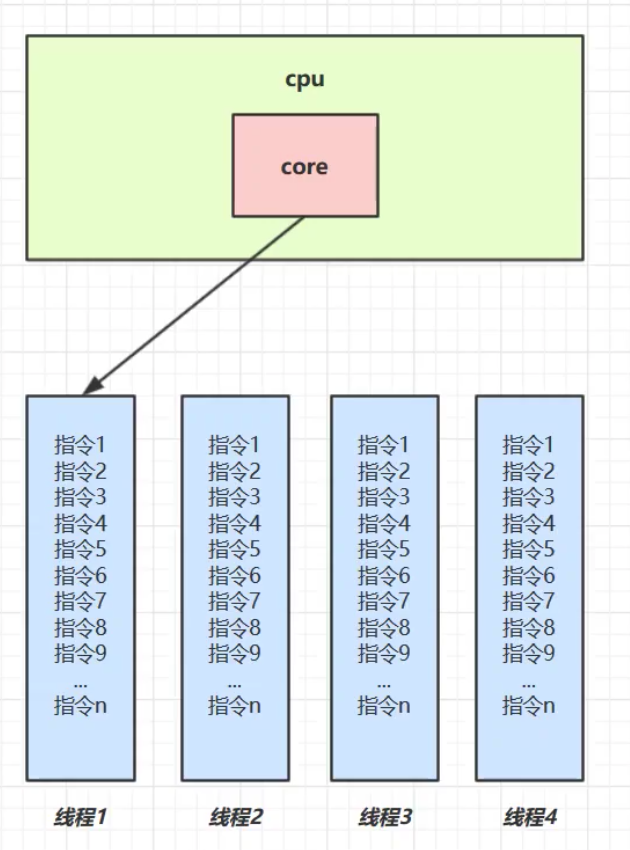

多核CPU下,每个核都可以调度运行线程,这时候线程可以是并行的;

| CPU   | 时间片1 | 时间片2 | 时间片3 | 时间片4 |
| ----- | ------- | ------- | ------- | ------- |
| core1 | 线程1   | 线程1   | 线程3   | 线程3   |
| core2 | 线程2   | 线程4   | 线程2   | 线程4   |

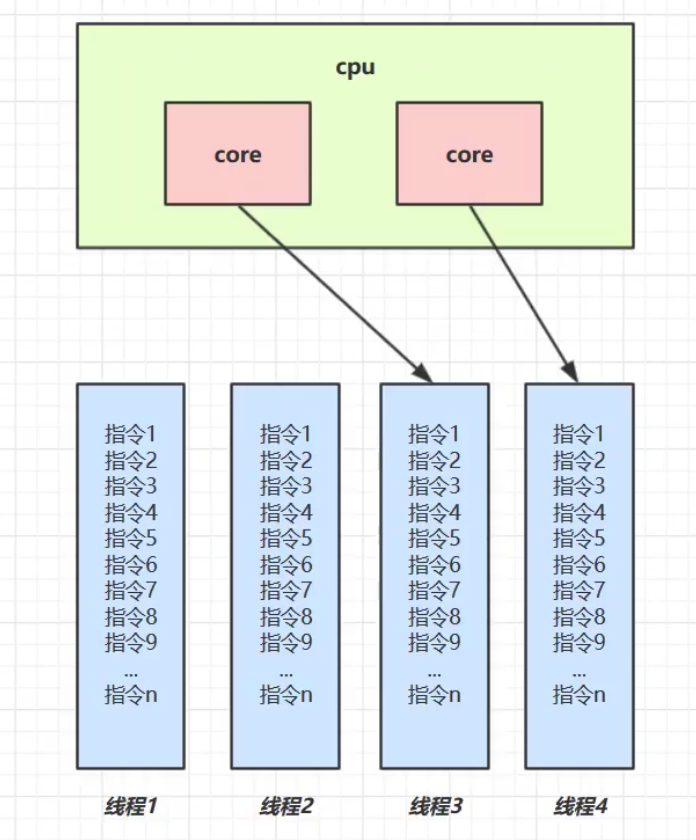

引用Rob Pike的一段描述:

* 并发(concurrent)是同一时间应对(deling with)多件事情的能力;
* 并行(parallel)是同一时间动手做(doing)多线事情的能力;

## 1.3.应用

### 1.3.1.异步调用

以调用方式来讲,如果:

* 需要等待结果返回,才能继续运行就是同步;
* 不需要等待结果返回,就能继续运行就是异步;

### 1.3.2.提高效率

* 单核CPU下,多线程不能实际提高程序运行效率,只是为了能够在不同任务之间切换,不同线程轮流使用CPU;
* 多核CPU可以并行跑多个线程,但能否提高程序运行效率还是要分情况的
  * 有些任务,经过精心设计,将任务拆分,并行执行,当然可以提高程序的运行效率,但不是所有计算任务都能拆分(查考<阿姆达尔定律>);
  * 也不是所有任务都需要拆分,任务的目的如果不同,谈拆分和效率每什么意义;
* IO操作不占用CPU,只是我们一般考本文件使用的是`阻塞IO`,这时候相当于线程虽然不用CPU,但是需要一直等待IO结束,没能充分利用线程,所以才有后面的`非阻塞IO`和`异步IO`优化;

# 2.Java线程

## 2.1.创建和运行线程

**方法一:直接使用Thread**

~~~java
//构造方法的参数是给线程指定名字,推荐如:Thread t = new Thread("t1")
Thread t = new Thread(){
  @Override
  public void run(){
    //需要执行的任务;
  }
};
//启动线程
t.start();
~~~

**方法二:使用Runnable配合Thread**

把`线程`和`任务`分开

* Thread代表线程;
* Runnable代表可运行的任务;

~~~java

Runnable runnable = new Runnable(){
  public void run(){
    //需要执行的任务
  }
};
//创建线程的对象
//参数1是任务对象,参数2是线程名字:Thread t = new Thread(runable,"t2");
Thread t = new Thread(runnable);
//启动线程
t.start();
~~~

**Thread与Runnable的关系**

* 方法一是把线程和任务合并在了一起,方法二是把线程和任务分开了;
* 用Runnable更容易与线程池等高级API配合;
* 用Runnable让任务类脱离了Thread集成体系,更灵活;

**方法三:FutureTask配合Thread**

FutureTask能够接收Callable类型的参数,用来处理有返回结果的情况;

~~~java
@Slf4j(topic = "fechin")
public class FutureTaskDemo {
    public static void main(String[] args) throws ExecutionException, InterruptedException {
        FutureTask<Integer> integerFutureTask = new FutureTask<Integer>(()->{
            log.info("wo shi yi ge xiancheng");
            return 100;
        });

        new Thread(integerFutureTask,"thread-001").start();
        Integer integer = integerFutureTask.get();
        log.info("结果是:{}",integer);
    }
}
~~~

## 2.2.查看进程线程的方法

**indows**

* 任务管理器可以查看进程和线程数,也可以用来杀死进程;
* `tasklist`:查看进程;
* `taskkill`:杀死进程;

**Linux**

* `ps -ef`:查看所有进程;
* `ps -fT -p <PID>`查看某个进程(PID)的所有线程;

* `kill` 杀死进程;
* `top`按大写H切换是否显示线程;
* `top -H -p <PID>`查看某个进程的所有线程

**Java**

* `jps`:查看所有Java进程;
* `jstack <PID>`:查看某个Java进程的所有线程状态;
* `jconsole`:查看某个Java进程中线程的运行情况(图形界面),我们直接在控制台输入`jconsole`

## 2.3.线程运行的原理

**栈与栈帧**

我们都知道JVM中由栈,堆,方法区所组成,其中栈内存是给谁用的呢?其实就是线程,每个线程启动后,虚拟机就会为其分配一块栈内存;

* 每个栈由多个栈帧(Frame)组成,对应着每次方法调用时所占用的内存;
* 每个线程只能有一个活动栈帧,对应当前正在执行的那个方法;

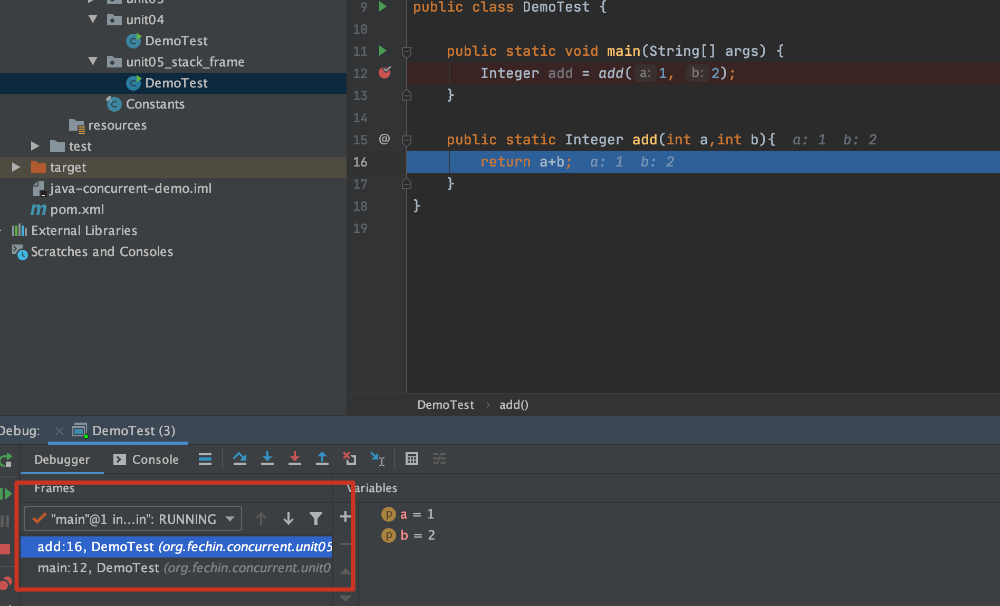

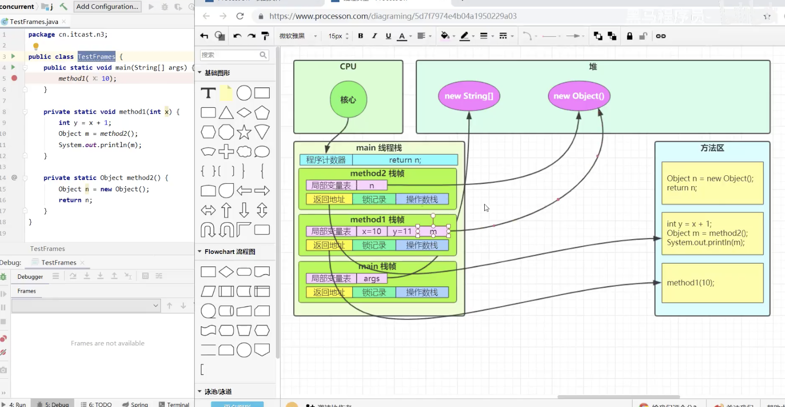

**线程上下文切换(Thread Context Switch)**

因为以下一些原因导致CPU不再执行当前的线程,转而执行另一个线程的代码

* 线程的CPU时间片用完;
* 垃圾回收;
* 有更高优先级的线程需要运行;
* 线程自己调用了sleep,yield,wait,join,park,synchronized,lock等方法;

当Context Switch发生时,需要由操作系统保存当前线程的状态,并恢复另一个线程的状态,Java中对应的概念就是程序计数器(Program Counter Register),它的作用就是记住下一条JVM执行的执行地址,是线程私有的;

* 状态包括程序计数器,虚拟机栈每个栈帧的信息,如局部变量,操作数栈,返回地址;
* Context Switch频繁发生会影响性能;

## 2.4.常见方法

| 方法名           | static | 功能说明                                                     | 注释                                                         |
| ---------------- | ------ | ------------------------------------------------------------ | ------------------------------------------------------------ |
| start()          |        | 启动一个新线程,在新的线程运行run方法中的代码                 | start方法只是让线程进入就绪,里面的代码不一定立刻运行(CPU的时间片还没分给它),**每个线程对象的start方法只能调用一次,如果调用了多次会出现IllegalThreadStateException** |
| run()            |        | 新线程启动后会调用的方法                                     | 如果在构造Thread对象时传递了Runnable参数,则线程启动后会调用Runnable中的run方法,否则默认不执行任何操作,但可以创建Thread的子类对象,来覆盖默认行为; |
| join()           |        | 等待线程运行结束                                             |                                                              |
| join(long n)     |        | 等待线程运行结束,最多等待n毫秒                               |                                                              |
| getId()          |        | 获取线程长整型id                                             | Id唯一                                                       |
| getName()        |        | 获取线程名                                                   |                                                              |
| setName(String)  |        | 修改线程名                                                   |                                                              |
| getPriority()    |        | 获取线程优先级                                               |                                                              |
| setPriority(int) |        | 修改线程优先级                                               | Java中规定线程优先级是1-10的整数,较大的优先级能提高该线程被CPU调度的几率,数字越大优先级越高; |
| getState()       |        | 获取线程状态                                                 | Java中线程状态用enum表示:分别是NEW.RUNNABLE,BLOCKED,WAITING,TIMED_WAITING,TERMINATED |
| isInterrupted()  |        | 判断是否被打断                                               | 不会清除打断标记                                             |
| isAlive()        |        | 线程是否存活(还没有运行完毕)                                 |                                                              |
| interrupt()      |        | 打断线程                                                     | 如果被打断线程正在sleep,wait,join会导致被打断的线程抛出InterruptedException,并清除打断标记;如果打断的正在运行的线程,则会设置打断标记;park的线程被打断,也会设置打断标记; |
| interrupted()    | static | 判断当前线程是否被打断                                       | 会清除打断标记                                               |
| currentThread()  | static | 获取当前正在执行的线程                                       |                                                              |
| sleep(long n)    | static | 让当前执行的线程休眠n毫秒,休眠的时间让出cpu的时间片给其他线程 |                                                              |
| yield()          | static | 提示线程调度器让出当前线程对CPU的使用                        | 主要是为了测试和调试                                         |

## 2.5.start和run

**调用run**

~~~java
public static void test01(){
        Thread thread = new Thread("thread01"){
            @Override
            public void run() {
                log.info("This thread name:{}",Thread.currentThread().getName());
                FileReader.read(Constants.FLAC_FULL_PATH);
            }
        };

        thread.run();
        log.info("main to do another things");
    }
~~~

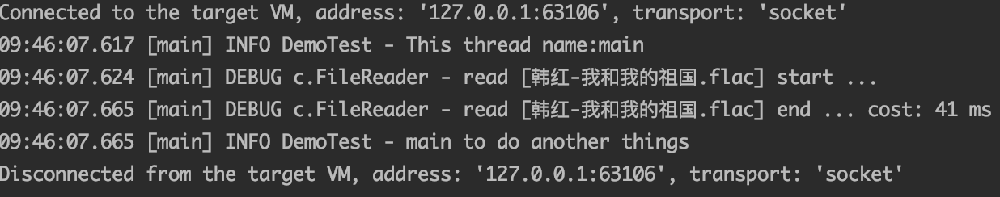

`FileReader.read()`方法调用是同步;

**调用start**

~~~java
public static void test02(){
        Thread thread = new Thread("thread02"){
            @Override
            public void run() {
                log.info("This thread name:{}",Thread.currentThread().getName());
                FileReader.read(Constants.FLAC_FULL_PATH);
            }
        };

        thread.start();
        log.info("main to do another things");
    }
~~~

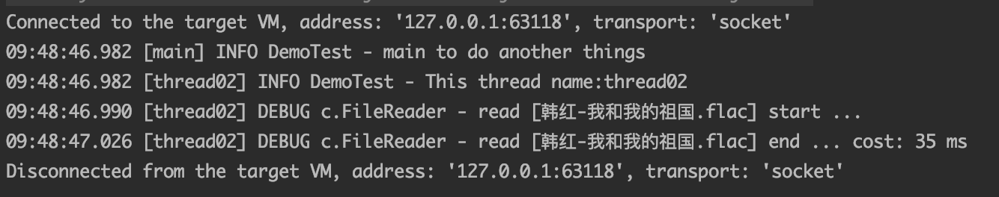

`FileReader.read()`方法调用是异步;

小结:

* 直接调用run是在主线程中执行了run,没有启动新的线程;
* 使用start是启动新的线程,通过新的线程间接执行run中的代码;

## 2.6.sleep与yield

**sleep**

1. 调用sleep会让当前线程从Running进入Timed Waiting状态(阻塞);
2. 其它线程可以使用interrupt方法打断正在睡眠的线程,这时sleep方法抛出`InterruptedException`;
3. 睡眠结束后的线程未必会立刻得到执行;
4. 建立用`TimeUnit`的`sleep`代替Thread的sleep来获得更好的可读性;

~~~java
public static void test04() throws InterruptedException {
        log.debug("start");
        TimeUnit.SECONDS.sleep(1);
        log.debug("stop");
    }
~~~

**yield**

1. 调用yield会让当前线程从Running进入Runable状态.然后调度执行其它线程;
2. 具体的实现依赖于操作系统的任务调度器;

**线程优先级**

1. 线程优先级会提示(hint)调度器优先调度该线程,但它仅仅是一个提示,调度器可以忽略它;
2. 如果CPU比较忙,那么优先级高的线程会获取更多的时间片,但CPU闲时,优先级几乎没作用;

~~~java
public static void test02(){
        Runnable task01 = () -> {
            int count = 0;
            for(;;){
                System.out.println("------>"+count++);
            }
        };

        Runnable task02 = () -> {
            int count = 0;
            for(;;){
                Thread.yield();
                System.out.println("------>"+count++);
            }
        };

        Thread t1 = new Thread(task01,"t1");
        Thread t2 = new Thread(task02,"t2");
        t1.start();
        t2.start();
    }
~~~

> 在没有利用CPU来计算时候,不要让while(true)空转浪费CPU,这时可以使用yield或者sleep来让出CPU的使用权给其他程序;
>
> ~~~java
> while(true){
> 	TimeUnit.SECONDS.sleep(1);      
> }
> ~~~
>
> * 可以使用wait或条件变量

## 2.7.join

~~~java
@Slf4j(topic = "DemoTest")
public class DemoTest {
    static int r = 0;
  
    public static void main(String[] args) {
        test01();
    }

    public static void test01(){
        log.info("开始");
        Thread thread = new Thread(()->{
            log.debug("开始");
            try {
                sleep(1000);
            } catch (InterruptedException e) {
                e.printStackTrace();
            }
            log.info("结束");
            r = 10;
        });
      	//
        thread.start();
        log.debug("结果为{}",r);
        log.debug("结束");
    }
}
~~~

分析:

* 因为主线程和线程`t1`是并行执行的,`t1`线程需要1秒之后才能算出`r=10`;
* 而主线程一开始就要打印`r`的结果,所以只能打印出`r=0`

解决方法:

* 用`thread.join()`,加在`thread.start()`之后即可;

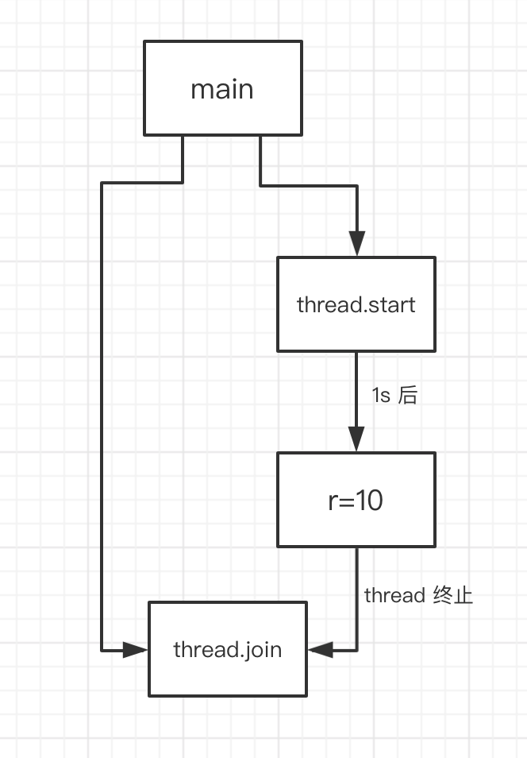

~~~java
static int r1 = 0;
static int r2 = 0;

public static void test03() throws InterruptedException {
        Thread t1 = new Thread(()->{
            try {
                sleep(1000);
            } catch (InterruptedException e) {
                e.printStackTrace();
            }
            r1 = 10;
        });
        Thread t2 = new Thread(()->{
            try {
                sleep(2000);
            } catch (InterruptedException e) {
                e.printStackTrace();
            }
            r2 = 20;
        });
        long start = System.currentTimeMillis();
        t1.start();
        t2.start();
  			//等待t1运行结束
        t1.join();
  			//等待t2运行结束
        t2.join();
        long stop = System.currentTimeMillis();
        log.info("r1:{},r2:{},cost:{}",r1,r2,stop-start);
    }

//21:01:41.293 [main] INFO DemoTest - r1:10,r2:20,cost:2002
~~~

分析如下:

* 第一个join:等待t1时,t2并没有停止,而在运行;
* 第二个join:1s后,执行到此,t2也运行了1s,因此也只需再等待1s;

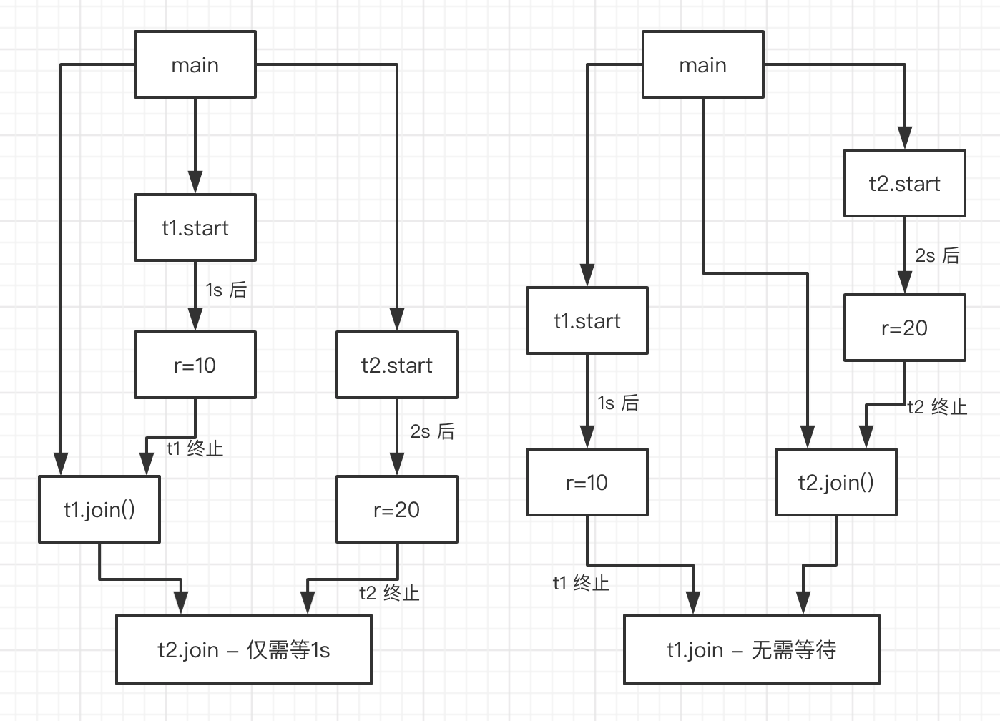

**`join(long n)`:等待线程运行结束,最多等待n毫秒;**

## 2.8.interrupt

### 2.8.1.打断阻塞状态的线程

可以打断处于阻塞状态的线程(sleep,wait,join),会导致被打断的线程抛出InterruptedException,并清除打断标记

~~~java
public class DemoTest {
    public static void main(String[] args) throws InterruptedException {
        Thread t1 = new Thread(()->{
            try {
                Thread.sleep(1000);
            } catch (InterruptedException e) {
                e.printStackTrace();
            }
        });
        t1.start();
        Thread.sleep(500);
        t1.interrupt();
        boolean interrupted = t1.isInterrupted();
        log.debug("打断状态:{}",interrupted);
    }
}
~~~

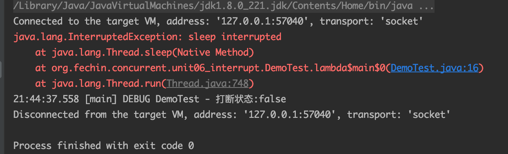

### 2.8.2.打断运行状态的线程

打断运行状态的线程,并不会直接将线程打断,而是给线程加上一个打断标记,由我们程序员去根据打断标记去决定是否要停止线程;

~~~java
@Slf4j(topic = "DemoTest02")
public class DemoTest02 {
    public static void main(String[] args) throws InterruptedException {
        Thread t1 = new Thread(()->{
            while(true) {
                Thread thread = Thread.currentThread();
                log.info("当前是否被打断{}", thread.isInterrupted());
                if(thread.isInterrupted()){
                    log.info("当前是否被打断{}",thread.isInterrupted());
                    break;
                }
            }
        });

        t1.start();
        Thread.sleep(3000);
        t1.interrupt();
    }
}
~~~

### 2.8.3.设计模式-两阶段终止模式

Two Phase Termination

在一个线程T1如何优雅终止线程T2?优雅指的是T2可以料理后事

> 错误思路
>
> * 使用线程对象的stop方法停止线程
>   * stop方法会真正的杀死线程,如果这时候线程锁住了共享资源,那么当它被杀死之后就再也没有机会释放锁.其它线程也将永远无法获取锁;
> * 使用System.exit(int)方法停止线程
>   * 目的仅仅是停止一个线程,但这种做法会让整个程序都停止;

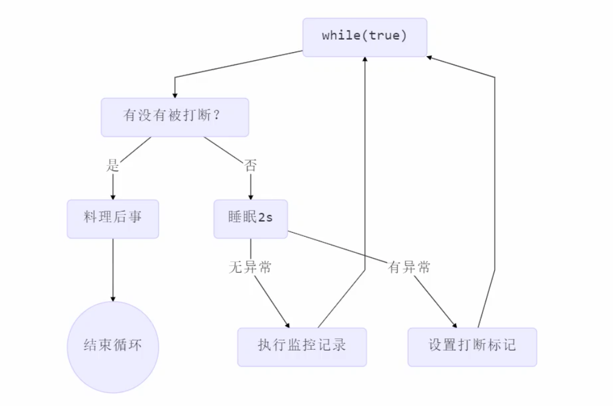

~~~java
@Slf4j(topic = "DemoTest")
public class DemoTest {
    public static void main(String[] args) throws InterruptedException {
        TwoPhaseTermination twoPhaseTermination = new TwoPhaseTermination();
        twoPhaseTermination.start();
        TimeUnit.SECONDS.sleep(5);
        twoPhaseTermination.stop();
    }
}

@Slf4j(topic = "TwoPhaseTermination")
class TwoPhaseTermination{
    private Thread monitor;

    public void start(){
        monitor = new Thread(()->{
            while (true){
                Thread thread = Thread.currentThread();
                if(thread.isInterrupted()){
                    log.info("料理后事");
                    break;
                }
                try {
                    TimeUnit.SECONDS.sleep(2);
                } catch (InterruptedException e) {
                    e.printStackTrace();
                    //如果捕捉到打断异常.设置打断标记
                    thread.interrupt();
                }
                log.info("正在执行监控");
            }
        });
        monitor.start();
    }

    public void stop(){
        monitor.interrupt();
    }
}
~~~

### 2.8.4.打断park

LockSupport.park方法是将线程暂停到运行的地方,可以使用interrupt进行打断.打断park线程,不会清空打断状态.**但是一旦被打断之后,LockSupport.park()方法就不能暂停了.**

~~~java
@Slf4j(topic = "DemoTest")
public class DemoTest {
    public static void main(String[] args) throws InterruptedException {
        Thread t1 = new Thread(()->{
            log.info("park");
            LockSupport.park();
            log.info("unpark");
            log.info("打断状态:{}",Thread.currentThread().isInterrupted());
            LockSupport.park();
            log.info("unpark");
        },"thread01");
        t1.start();

        TimeUnit.SECONDS.sleep(1);
        t1.interrupt();
    }
}
~~~

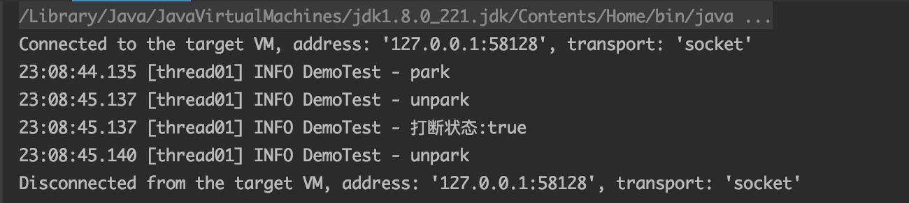

如果想LockSupport.park()继续生效,那么可以使用如下代码`Thread.interrupted()`来清除打断标记

~~~java
@Slf4j(topic = "DemoTest")
public class DemoTest {
    public static void main(String[] args) throws InterruptedException {
        Thread t1 = new Thread(()->{
            log.info("park");
            LockSupport.park();
            log.info("unpark");
            log.info("打断状态:{}",Thread.interrupted());
            LockSupport.park();
            log.info("unpark");
        },"thread01");
        t1.start();

        TimeUnit.SECONDS.sleep(1);
        t1.interrupt();
    }
}
~~~

### 2.8.5.不推荐使用的方法

还有一些不推荐使用的方法,这些方法已经过时,容易破坏同步代码块,曹成线程死锁;

| 方法名    | static | 功能说明                                           |
| --------- | ------ | -------------------------------------------------- |
| stop()    |        | 停止线程运行(**我们可以使用两阶段终止模式来替代**) |
| suspend() |        | 挂起(暂停)线程运行                                 |
| resume()  |        | 恢复线程运行                                       |

## 2.9.主线程和守护线程

默认情况下,Java进程需要等待所有线程都运行结束,才会运行结束,有一种特殊的线程叫做守护进程,只要其他非守护线程运行结束了,即使守护线程的代码没有执行完,也会强制结束.

> * 垃圾回收期线程就是一种守护线程
> * Tomcat中的Acceptor和Poller线程都是守护线程,所以Tomcat接收到shutdown命令后,不会等待它们处理完当前请求.

~~~java
@Slf4j(topic = "DemoTest")
public class DemoTest {
    public static void main(String[] args) {
        log.info("start");
        Thread t1 = new Thread(()->{
            log.info("thread01:start");
            try {
                TimeUnit.SECONDS.sleep(1000);
            } catch (InterruptedException e) {
                e.printStackTrace();
            }
            log.info("thread01:stop");
        });
        t1.setDaemon(true);
        t1.start();

        try {
            TimeUnit.SECONDS.sleep(1);
        } catch (InterruptedException e) {
            e.printStackTrace();
        }
        log.info("stop");
    }
}
~~~

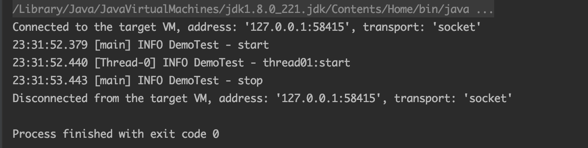

## 2.10.线程五种状态

这是从**操作系统**层面来进行描述的

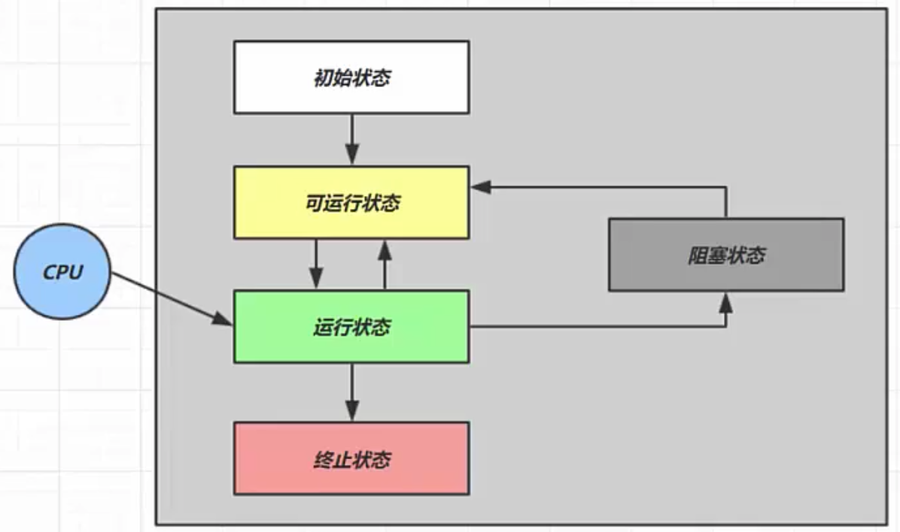

* **初始状态**:仅仅是在语言层面创建了线程对象,还未与操作系统线程关联;
* **可运行状态**:指的是该线程已经被创建,与操作系统线程相关联,可以由CPU调度执行;
* **运行状态**:指获取了CPU时间片运行中的状态;
  * 当CPU时间片用完,会从**运行状态**转换至**可运行状态**,会导致线程的上下文切换;
* **阻塞状态**
  * 如果调用了阻塞API,如BIO读写文件,这时该线程实际不会用到CPU,会导致线程上下文切换,进入**阻塞状态**;
  * 等BIO操作完毕,会由操作系统唤醒阻塞的线程,转换至**可运行状态**;
  * 与**可运行状态**的区别是,对**阻塞状态**的线程来说只要它们一直不唤醒,调度器就一直不会考虑调度它们;
* **终止状态**:表示线程已经执行完毕,生命周期已经结束,不会再转换为其他状态;

## 2.11.线程六种状态

这是从Java API层面来描述的,根据Thread.State枚举,分为六种状态;

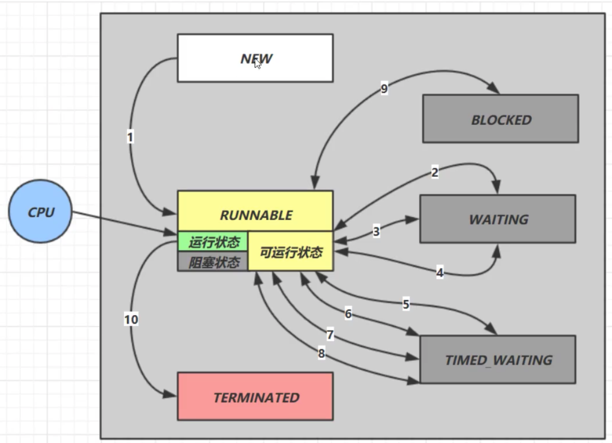

* `NEW`:线程刚被创建,但是还没有调用`start()`方法;
* `RUNNABLE`:当调用了`start()`方法之后.JAVA API层面的`RUNNABLE`涵盖了操作系统层面的**可运行状态**,**运行状态**,**阻塞状态**(由于BIO导致的线程阻塞,在Java里无法区分,仍然认为是可运行的);
* `BLOCKER`,`WAITING`,`TIMED_WAITING`都是Java API层面对**阻塞状态**的细分,后面会在状态转换一节详述;

~~~java
@Slf4j(topic = "DemoTest")
public class DemoTest {
    public static void main(String[] args) throws InterruptedException, IOException {
        //NEW
        Thread t1 = new Thread(() -> {

        });

        //RUNNABLE
        Thread t2 = new Thread(() -> {
            while (true) {

            }
        });
        t2.start();

        //TERMINATED
        Thread t3 = new Thread(() -> {
            log.info("我执行了一次");
        });
        t3.start();

        //TIMED_WAITING
        Thread t4 = new Thread(() -> {
            synchronized (DemoTest.class) {
                try {
                    TimeUnit.DAYS.sleep(1);
                } catch (InterruptedException e) {
                    e.printStackTrace();
                }
            }
        });
        t4.start();

        //WAITING
        Thread t5 = new Thread(() -> {
            try {
                //等待t2运行结束
                t2.join();
            } catch (InterruptedException e) {
                e.printStackTrace();
            }
        });
        t5.start();

        //BLOCKED
        Thread t6 = new Thread(() -> {
            synchronized (DemoTest.class){
                try {
                    TimeUnit.DAYS.sleep(1);
                } catch (InterruptedException e) {
                    e.printStackTrace();
                }
            }
        });
        t6.start();

        TimeUnit.SECONDS.sleep(1);
        log.info("t1 state:{}", t1.getState());
        log.info("t2 state:{}", t2.getState());
        log.info("t3 state:{}", t3.getState());
        log.info("t4 state:{}", t4.getState());
        log.info("t5 state:{}", t5.getState());
        log.info("t6 state:{}", t6.getState());
    }
}
~~~

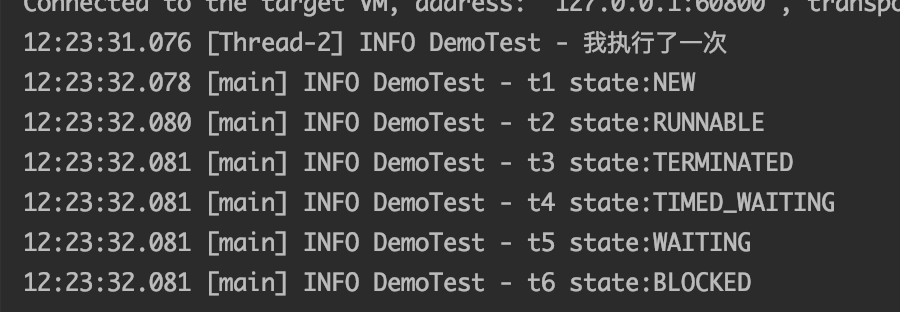

