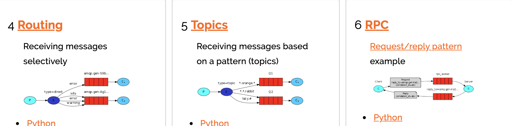

#  消息中间件的总结思考

# 1.常见的消息队列的使用的业务场景

> 我所负责的项目典型场景:
>
> * 盱眙龙虾节的百度小程序:支付回调以及退款回调,支付的回调本质上其就是调用自己需要处理的业务逻辑.百度的要求是:请求调用超过2S为超时,会触发重试,首先要保证幂等,之后还要快速执行完业务逻辑.两种方案:一种是把业务逻辑做成异步,回调并发量大的话问题不言而喻.第二种是用MQ异步处理业务逻辑;为了保证一些特殊情况的发生,做了MQ的一部分补偿.补偿架构参考9.1;
>
> * 第二个业务就涉及到SAAS-商城搬家商品版,通过HttpClient请求,然后通过Jsoup去解析.首先实时响应外,还要存储备份.方便后续添加商品,这就需要进行异步操作了,通过消息中间件的操作;

## 1.1.解耦


## 1.2.异步

> 一些无关紧要的操作实际上并不需要做成RPC的同步调用,可以做成异步调用来提高响应速度,但是同样也要做好补偿,防止出现问题.这么做如何保证事务的一致性呢?
>
> 在本项目中,我们对项目本身进行了链路追踪SkyWalking的测试响应时间,对超过500ms的C端接口进行了维护改造,部分接口采用了MQ;
>
> 按照多个实例部署的规则,多个实例应该是监听同一个Queue.但是就不能保证同一个Queue能够的消息的有序性.对业务顺序不敏感的有如下解决方案;如果有一些对业务顺序敏感.可以考虑用MySQL中的锁甚至分布式锁
>
> MySQL中的锁参考:https://mp.weixin.qq.com/s?__biz=MzIwMTg3NzYyOA==&mid=2247483733&idx=1&sn=1f066b1446a0a132af8648481063c021&chksm=96e67046a191f9508a133f6c37f2420140b6ca092eaf39012e6fbfa86874fbb57edef6d66b4e&token=1187527588&lang=zh_CN#rd. 


## 1.3.削峰

> 百度小程序的龙虾节秒杀,用MQ去削峰,处理不是特别重要的秒杀逻辑(如增加流水等等...);


### 1.3.1.推模式和拉模式

* 推模式:消息中间件将消息推送给消费者;
* 拉模式:消息中间件主动从消息中间件中拉取消息;

拉模式代码如下:

~~~java
public class ReceiverByGet {
 
    private final static String QUEUE_NAME = "hello";
 
    public static void main(String[] argv) throws Exception {
        ConnectionFactory factory = new ConnectionFactory();
        factory.setHost("localhost");
        Connection connection = factory.newConnection();
        Channel channel = connection.createChannel();
 
        channel.queueDeclare(QUEUE_NAME, false, false, false, null);
 
        while (true) {
            GetResponse resp = channel.basicGet(QUEUE_NAME, true);
            if (resp == null) {
                System.out.println("Get Nothing!");
                TimeUnit.MILLISECONDS.sleep(1000);
            } else {
                String message = new String(resp.getBody(), "UTF-8");
                System.out.printf(" [    %2$s<===](%1$s) %3$s\n", "Receiver", QUEUE_NAME, message);
                TimeUnit.MILLISECONDS.sleep(500);
            }
        }
    }
}
~~~

### 1.3.2.消费端限流

在高并发的情况下,客户量就是非常大,所以很难在生产端做限制,因此可以用MQ在消费端做限制;RabbitMQ提供了一种QOS(服务质量保证)功能,在非自动确认消息的前提下,如果一定数目的消息(通过基于consumer或者channel设置QOS的值)未被确认前,不进行消费新的消息;

在限流的情况,千万不要设置自动签收,要设置为手动签收.并设置QOS`void BasicQos(uint prfetchSize,ushort prefetchCount,bool global)`;

消费者代码如下:

~~~java
public class Consumer {

    public static void main(String[] args) throws Exception {
          
        //1 创建ConnectionFactory
        Connection connection = ConnectionUtils.getConnection();
        Channel channel = connection.createChannel();
        
        
        String exchangeName = "test_qos_exchange";
        String queueName = "test_qos_queue";
        String routingKey = "qos.#";
        
        channel.exchangeDeclare(exchangeName, "topic", true, false, null);
        channel.queueDeclare(queueName, true, false, false, null);
        channel.queueBind(queueName, exchangeName, routingKey);
        
        // 限流方式  第一件事就是 autoAck设置为 false
        // 第二件事就是qos设置为1，表示一条一条数据处理
        channel.basicQos(0, 1, false);
        
        channel.basicConsume(queueName, false, new MyConsumer(channel));
        
    }
}
~~~

# 2.消息中间件的缺点

1.**系统可用性降低**:系统引入的外部的依赖越多,越容易挂掉,本来就是A系统调用BCD三个系统接口就好了,加一个MQ进来,万一MQ挂了,整个系统就崩溃了.

2.**系统复杂性提高**:加个MQ进来,需要保证消息没有重复消费,需要处理消息丢失,需要保证消息传递的顺序性.

**3.一致性问题**:A系统处理完了直接返回成功,就以为你这个请求成功了.但问题是,要是BCD三个系统那里,BD系统写库成功了.结果C系统写库失败了.数据就不一致了.

**所以,消息队列实际是一种非常复杂的架构,引入它有很多好处,但是也得针对它带来的坏处.我们需要做各种额外的技术方案和架构来规避掉.**

# 3.activemq,rabbitmq,rocketmq,kafka优点和缺点

| 特性                    | ActiveMQ                                                     | RabbitMQ                                                     | RocketMQ                                                     | Kafka                                                        |
| ----------------------- | ------------------------------------------------------------ | ------------------------------------------------------------ | ------------------------------------------------------------ | ------------------------------------------------------------ |
| 成熟度                  | 成熟                                                         | 成熟                                                         | 比较成熟                                                     | 成熟的日志领域                                               |
| 时效性                  |                                                              | 微秒级                                                       | 毫秒级                                                       | 毫秒级                                                       |
| 社区活跃度              | 低                                                           | 高                                                           | 高                                                           | 高                                                           |
| 单机吞吐量              | 万级，吞吐量比RocketMQ和Kafka要低了一个数量级                | 万级，吞吐量比RocketMQ和Kafka要低了一个数量级                | 10万级，RocketMQ也是可以支撑高吞吐的一种MQ                   | 10万级别，这是kafka最大的优点，就是吞吐量高。一般配合大数据类的系统来进行实时数据计算、日志采集等场景 |
| topic数量对吞吐量的影响 |                                                              |                                                              | topic可以达到几百，几千个的级别，吞吐量会有较小幅度的下降这是RocketMQ的一大优势，在同等机器下，可以支撑大量的topic | topic从几十个到几百个的时候，吞吐量会大幅度下降所以在同等机器下，kafka尽量保证topic数量不要过多。如果要支撑大规模topic，需要增加更多的机器资源 |
| 可用性                  | 高，基于主从架构实现高可用性                                 | 高，基于主从架构实现高可用性                                 | 非常高，分布式架构                                           | 非常高，kafka是分布式的，一个数据多个副本，少数机器宕机，不会丢失数据，不会导致不可用 |
| 消息可靠性              | 有较低的概率丢失数据                                         |                                                              | 经过参数优化配置，可以做到0丢失                              | 经过参数优化配置，消息可以做到0丢失                          |
| 功能支持                | MQ领域的功能极其完备                                         | 基于erlang开发，所以并发能力很强，性能极其好，延时很低       | MQ功能较为完善，还是分布式的，扩展性好                       | 功能较为简单，主要支持简单的MQ功能，在大数据领域的实时计算以及日志采集被大规模使用，是事实上的标准 |
| 优劣势总结              | 非常成熟，功能强大，在业内大量的公司以及项目中都有应用偶尔会有较低概率丢失消息而且现在社区以及国内应用都越来越少，官方社区现维护越来越少，几个月才发布一个版本而且确实主要是基于解耦和异步来用的，较少在大规模吞吐的场景中使用 | erlang语言开发，性能极其好，延时很低；吞吐量到万级，MQ功能比较完备而且开源提供的管理界面非常棒，用起来很好用社区相对比较活跃，几乎每个月都发布几个版本分在国内一些互联网公司近几年用rabbitmq也比较多一些但是问题也是显而易见的，RabbitMQ确实吞吐量会低一些，这是因为他做的实现机制比较重。而且erlang开发，国内有几个公司有实力做erlang源码级别的研究和定制？如果说你没这个实力的话，确实偶尔会有一些问题，你很难去看懂源码，你公司对这个东西的掌控很弱，基本只能依赖于开源社区的快速维护和修复bug。而且rabbitmq集群动态扩展会很麻烦，不过这个我觉得还好。其实主要是erlang语言本身带来的问题。很难读源码，很难定制和掌控。 | 接口简单易用，而且毕竟在阿里大规模应用过，有阿里品牌保障日处理消息上百亿之多，可以做到大规模吞吐，性能也非常好，分布式扩展也很方便，社区维护还可以，可靠性和可用性都是ok的，还可以支撑大规模的topic数量，支持复杂MQ业务场景而且一个很大的优势在于，阿里出品都是java系的，我们可以自己阅读源码，定制自己公司的MQ，可以掌控社区活跃度相对较为一般，不过也还可以，文档相对来说简单一些，然后接口这块不是按照标准JMS规范走的有些系统要迁移需要修改大量代码还有就是阿里出台的技术，你得做好这个技术万一被抛弃，社区黄掉的风险，那如果你们公司有技术实力我觉得用RocketMQ挺好的. | kafka的特点其实很明显，就是仅仅提供较少的核心功能，但是提供超高的吞吐量，ms级的延迟，极高的可用性以及可靠性，而且分布式可以任意扩展同时kafka最好是支撑较少的topic数量即可，保证其超高吞吐量而且kafka唯一的一点劣势是有可能消息重复消费，那么对数据准确性会造成极其轻微的影响，在大数据领域中以及日志采集中，这点轻微影响可以忽略这个特性天然适合大数据实时计算以及日志收集 |

# 4.如何保证消息队列的高可用性

## 4.1.RabbitMQ的高可用架构

### 4.1.1.普通集群模式


### 4.1.2.镜像集群模式

   

## 4.2.Kafka的高可用架构

kafka:多个broker组成,每个broker是一个节点,创建一个topic,这个topic可以划分为多个partition,每个partition可以存在于不同的broker上,每个partition就放一部分数据;


# 5.如何保证消息消费时的幂等性

kafka出现重复消息的原因?


如何解决重复消费的问题?


我们往Redis中插入数据`setnx`,如果插入成功,那就消费;如果插入失败,那就不消费;

# 6.如何保证消息不会丢失


## 6.1.生产者弄丢数据

生产者将数据发送到rabbitmq的时候,可能数据在半路就弄丢了.

此时可以选择用rabbitmq提供的**事务功能**,就是生产者发送数据之前开启rabbitmq事务(channel.txSelect),然后发送消息,如果消息没有成功被RabbitMQ接收到,那么生产者会收到异常报错,此时就可以回滚事务(channel.txRollback),然后重试发送消息;如果收到了消息,那么可以提交事务(channel.txCommit).但是问题是,rabbitmq事务机制会让吞吐量下来,因为太耗性能;

也可以开启**confirm模式**,在生产者设置开启confirm模式,之后每写的消息都会分配一个唯一的id,如果写入了rabbitmq中,rabbitmq会回传一个ack消息,告诉你说这个消息OK了.如果rabbitmq没有处理这个消息,会回调一个nack接口,告诉你这个消息接收失败,可以重试.而且可以结合这个机子自己在内存里维护每个消息id的状态,如果超过一定时间还没接收到这个消息的回调,那么可以重发;

事务和confirm机制的最大不同在于,事务机制是同步的,你提交一个事务之后会阻塞在那儿,但是confirm机制是异步的,发送一个消息之后就可以发送下一个消息,然后那个消息rabbitmq接收了之后会异步回调你的一个接口通知你这个消息接收到了;

> 在 rabbitmq 中我们可以通过持久化数据解决 rabbitmq 服务器异常的数据丢失问题。
>
> 问题：生产者将消息发送出去之后，消息到底有没有到达 rabbitmq 服务器。默认情况下是不知道的。
>
> 两种方式：
>
> - AMQP 实现了事务机制
> - Confirm 模式
>
> #### 事务机制
>
> - txSelect：用户将当前的 channel 设置成 transaction 模式
> - txCommit：用于提交事务
> - txRollback：回滚事务
>
> 缺点：降低了 rabbitmq 的吞吐量。
>
> **生产者**
>
> ```java
> public class TxSend {
>     private static final String QUEUE_NAME = "test_queue_tx";
>     public static void main(String[] args) throws IOException, TimeoutException {
>         Connection connection = ConnectionUtils.getConnection();
>         Channel channel = connection.createChannel();
>         channel.queueDeclare(QUEUE_NAME, false, false, false, null);
> 
>         String msg = "hello tx message!";
> 
>         try {
>             channel.txSelect();
>             channel.basicPublish("", QUEUE_NAME, null, msg.getBytes());
>             // 出错测试
>             int xx = 1 / 0;
>             System.out.println("send: " + msg);
>             channel.txCommit();
>         } catch (Exception e) {
>             channel.txRollback();
>             System.out.println("send message rollback.");
>         }
> 
>         channel.close();
>         connection.close();
>     }
> }
> ```
>
> **消费者**
>
> ```java
> public class TxRecv {
>     private static final String QUEUE_NAME = "test_queue_tx";
>     public static void main(String[] args) throws IOException, TimeoutException {
>         Connection connection = ConnectionUtils.getConnection();
>         Channel channel = connection.createChannel();
>         channel.queueDeclare(QUEUE_NAME, false, false, false, null);
> 
>         channel.basicConsume(QUEUE_NAME, true, new DefaultConsumer(channel){
>             @Override
>             public void handleDelivery(String consumerTag, Envelope envelope, AMQP.BasicProperties properties, byte[] body) throws IOException {
>                 System.out.println("recv[tx] msg: " + new String(body, "utf-8"));
>             }
>         });
>     }
> }
> ```
>
> #### Confirm 模式
>
> **生产者端 confirm 模式的实现原理**
>
> 生产者将信道设置成 confirm 模式，一旦信道进入 confirm 模式，所有在该信道上面发布的消息都会被指派一个唯一的 ID(从1开始)，一旦消息被投递到所有的匹配队列之后，broker 就会发送一个确认给生产者（包含消息的唯一ID），这就使得生产者知道消息已经正确到达目的队列了，如果消息和队列是可持久化的，那么确认消息会将消息写入磁盘之后发出，broker 回传给生产者的确认消息中 deliver-tag 域包含了确认消息的序列号，此外 broker 也可以设置 basic.ack 的 multiple 域，表示这个序列号之前的所有消息已经得到了处理。
>
> confirm 模式最大的好处在于它是异步的。
>
> 开启 confirm 模式：
>
> ```java
> channel.confirmSelect();
> ```
>
> 编程模式：
>
> - 普通 发一条 waitForConfirms()
> - 批量 发一批 waitForConfirms()
> - 异步 confirm 模式：提供一个回调方法
>
> **confirm 单条**
>
> ```java
> public class Send1 {
>     private static final String QUEUE_NAME = "test_queue_confirm1";
>     public static void main(String[] args) throws IOException, TimeoutException, InterruptedException {
>         Connection connection = ConnectionUtils.getConnection();
>         Channel channel = connection.createChannel();
>         channel.queueDeclare(QUEUE_NAME, false, false, false, null);
> 
>         // 生产者调用 confirmSelect 将 channel 设置成为 confirm 模式 （注意）
>         channel.confirmSelect();
>         String msg = "hello confirm message!";
>         channel.basicPublish("", QUEUE_NAME, null, msg.getBytes());
>         if (!channel.waitForConfirms()) {
>             System.out.println("message send failed.");
>         } else {
>             System.out.println("message send ok.");
>         }
>         channel.close();
>         connection.close();
>     }
> }
> ```
>
> **confirm 批量**
>
> ```java
> public class Send2 {
>     private static final String QUEUE_NAME = "test_queue_confirm1";
>     public static void main(String[] args) throws IOException, TimeoutException, InterruptedException {
>         Connection connection = ConnectionUtils.getConnection();
>         Channel channel = connection.createChannel();
>         channel.queueDeclare(QUEUE_NAME, false, false, false, null);
> 
>         // 生产者调用 confirmSelect 将 channel 设置成为 confirm 模式 （注意）
>         channel.confirmSelect();
> 
>         String msg = "hello confirm message batch!";
>         // 批量模式
>         for (int i = 0; i< 10; i++) {
>             channel.basicPublish("", QUEUE_NAME, null, msg.getBytes());
>         }
>         // 确认
>         if (!channel.waitForConfirms()) {
>             System.out.println("message send failed.");
>         } else {
>             System.out.println("message send ok.");
>         }
>         channel.close();
>         connection.close();
>     }
> }
> ```
>
> **confirm 异步**
>
> Channel 对象提供的 ConfirmListener() 回调方法只包含 deliveryTag (当前 Channel 发出的消息序号)，我们需要自己为每一个 Channel 维护一个 unconfirm 的消息序号集合，每 publish 一条数据，集合中元素加 1，每回调一次 handleAck 方法，unconfirm 集合删掉相应的一条(multiple=false)或多条(multiple=true)记录。从程序运行效率上看，这个 unconfirm 集合最好采用有序集合 SortedSet 存储结构。
>
> ```java
> public class Send3 {
>     private static final String QUEUE_NAME = "test_queue_confirm3";
>     public static void main(String[] args) throws IOException, TimeoutException {
>         Connection connection = ConnectionUtils.getConnection();
>         Channel channel = connection.createChannel();
>         channel.queueDeclare(QUEUE_NAME, false, false, false, null);
> 
>         // 生产者调用 confirmSelect 将 channel 设置为 confirm 模式
>         channel.confirmSelect();
> 
>         // 未确认的消息标识
>         final SortedSet<Long> confirmSet = Collections.synchronizedSortedSet(new TreeSet<Long>());
> 
>         // 通道添加监听
>         channel.addConfirmListener(new ConfirmListener() {
>             // 没有问题的 handleAck
>             public void handleAck(long l, boolean b) throws IOException {
>                 if (b) {
>                     System.out.println("---handleAck---multiple");
>                     confirmSet.headSet(l + 1).clear();
>                 } else {
>                     System.out.println("---handleAck---multiple false");
>                     confirmSet.remove(l);
>                 }
>             }
>             // handleNack 1s 3s 10s xxx...
>             public void handleNack(long l, boolean b) throws IOException {
>                 if (b) {
>                     System.out.println("---handleNack---multiple");
>                     confirmSet.headSet(l + 1).clear();
>                 } else {
>                     System.out.println("---handleNack---multiple false");
>                     confirmSet.remove(l);
>                 }
>             }
>         });
> 
>         String msg = "sssss";
>         while (true) {
>             long seqNo = channel.getNextPublishSeqNo();
>             channel.basicPublish("", QUEUE_NAME, null, msg.getBytes());
>             confirmSet.add(seqNo);
>         }
>     }
> }
> ```
>
> **消费者**
>
> (只需修改 QUEUE_NAME)

## 6.2.rabbitmq弄丢数据

你必须开启rabbitmq的持久化,就是消息写入之后会持久化到磁盘,哪怕是rabbitmq自己挂了,恢复之后会自动读取之前存储的数据,一般数据不会丢.除非极其其罕见的是rabbitmq还没有持久化,自己就挂了,可能导致少量数据会丢失,但是这个概率很小.

设置持久化有两个步骤,第一个是创建queue的时候将其设置为持久化,这样就可以保证rabbitmq持久化queue的元数据,但是不会持久化queue里的数据;第二个是发送消息的时候将消息的deliveryMode设置为2,就是将消息设置为持久化的,此时rabbitmq就会将消息持久化到磁盘上去,必须要同时设置这两个持久化才行,rabbitmq哪怕是挂了,再次重启,也会从磁盘上重启恢复queue,恢复queue里的数据;

## 6.3.消费者弄丢数据

这个时候需要用rabbitmq提供的ack机制;简单来说就是需要我们关闭rabbitmq自动ack,每次自己代码里确保处理完的时候,在程序里ack一把.这样的话,如果你还没处理完,没有ack.那么rabbitmq就会认为你还没处理完,这个时候rabbitmq会把这个消费分配给别的consumer区处理;

# 7.如何保证消息的顺序


* 保证消息发送时候有序同步发送;
* 保证消息发送被同一队列接收;
* 保证一个队列只有一个消费者,可以有从机(待机状态),实现高可用;

# 8.消息积压如何处理

* 事前:
  * 首先消息重回队列的话这个要设置成false,防止一个消息一直在死循环导致后续消息无法消息,最终导致消息积压;
  * 设置死信队列和TTL过期时间,假如超出队列长度,超过过期时间直接转到死信队列;
* 事后:
  * 先修复consumer的问题,确保其回复消费速度.增加消费者的数量;

# 9.MQ补偿方案

## 9.1.方案一

如下的补偿会对数据库有两次入库,一次业务数据入库,一次消息入库.对数据库来说是个瓶颈;


## 9.2.方案二


1. 业务消息入库成功后,第一次消息发送;
2. 同样在消息入库成功后,发送第二次消息,这两条消息是同时发送的.第二条消息是延迟检查,可以设置2min,5min延迟发送;
3. 消费端监听指定队列;
4. 消费端处理完消息后,内部生成新的消息send confirm,投递到MQ Broker;
5. Callback Service回调服务监听MQ Broker,如果受到Downstream service发送的消息,则可以确定消息发送成功,执行消息存储到MSG DB;s
6. Check Detail检查监听step2延迟投递的消息,此时监听的队列不是同一个,5分钟后,Callback service受到消息,检查MSG DB.如果发现之前的消息已经投递成功,则不需要做其他事情.如果检查发现失败,则Callback进行补偿,主动发送RPC通信,通知上游生产端重新发送消息.

# 10.重回队列和死循环

消费端进行消费的时候,如果由于业务异常可以进行日志记录进行补偿;如果由于服务器宕机等严重问题,就需要手工进行ACK保障消费端消费成功.

消费端重回队列是为了对没有处理成功的消息,把消息重新传给Broker.一般在实际应用中,都会关闭重回队列,也就是设置为False;

生产者:

~~~java
public class Producer {

    public static void main(String[] args) throws Exception {
        
        //1创建ConnectionFactory
        Connection connection = ConnectionUtils.getConnection();
        Channel channel = connection.createChannel();
        
        String exchange = "test_ack_exchange";
        String routingKey = "ack.save";
        for(int i =0; i<5; i ++){
            
            Map<String, Object> headers = new HashMap<String, Object>();
            headers.put("num", i);
            
            //添加属性，后续会使用到
            AMQP.BasicProperties properties = new AMQP.BasicProperties.Builder()
                    .deliveryMode(2) //投递模式，持久化
                    .contentEncoding("UTF-8")
                    .headers(headers)
                    .build();
            String msg = "Hello RabbitMQ ACK Message " + i;
            channel.basicPublish(exchange, routingKey, true, properties, msg.getBytes());
        }
    }
}
~~~

消费者:

~~~java
public class Consumer {
    public static void main(String[] args) throws Exception {
        //1创建ConnectionFactory
        Connection connection = ConnectionUtils.getConnection();
        Channel channel = connection.createChannel();   
        String exchangeName = "test_ack_exchange";
        String queueName = "test_ack_queue";
        String routingKey = "ack.#";
        
        channel.exchangeDeclare(exchangeName, "topic", true, false, null);
        channel.queueDeclare(queueName, true, false, false, null);
        channel.queueBind(queueName, exchangeName, routingKey);
        
        // 手工签收 必须要关闭 autoAck = false
        channel.basicConsume(queueName, false, new MyConsumer(channel));       
    }
}


public class MyConsumer extends DefaultConsumer {

    private Channel channel ;
    
    public MyConsumer(Channel channel) {
        super(channel);
        this.channel = channel;
    }

    @Override
    public void handleDelivery(String consumerTag, Envelope envelope, AMQP.BasicProperties properties, byte[] body) throws IOException {
        System.err.println("-----------consume message----------");
        System.err.println("body: " + new String(body));
        try {
            Thread.sleep(2000);
        } catch (InterruptedException e) {
            e.printStackTrace();
        }
        if((Integer)properties.getHeaders().get("num") == 0) {
            //Nack三个参数  第二个参数：是否是批量，第三个参数：是否重回队列（需要注意可能会发生重复消费，造成死循环）
            channel.basicNack(envelope.getDeliveryTag(), false, true);
        } else {
            channel.basicAck(envelope.getDeliveryTag(), false);
        }
    }
}
~~~


这种情况就会出现死循环,我们可以设置重试次数;

# 11.死信队列

死信队列:DLX,Dead-Letter-Exchange.RabbitMQ的死信队列里与Exchange息息相关;

利用DLX,当消息在一个队列中变成死信(dead message)之后,它能被重新publish到另一个Exchange,这个Exchange就是DLX.

消息编程死信有以下几种情况:

* 消息被拒绝(basic.reject/basic.nack)并且requeue = false;
* 消息TTL过期;
* 队列达到最大长度;

DLX也是一个正常的Exchange,和一般的Exchange没有区别,它能在任何的队列上被指定,是加上就是设置某个队列的属性.当这队列中有死信时候,RabbitMQ就会自动的将这个消息重新发布到设置的Exchange上去,进而被路由到另一个队列.可以监听这个队列中的消息做相应的处理.

创建交换机和队列以及绑定:

~~~java
 /**
 * 死信交换机
 */
@Bean
public DirectExchange dlxExchange(){
	return new DirectExchange(dlxExchangeName);
}

/**
 * 死信队列
 */
@Bean
public Queue dlxQueue(){
	return new Queue(dlxQueueName);
}

/**
 * 死信队列绑定死信交换机
 */
@Bean
public Binding dlcBinding(Queue dlxQueue, DirectExchange dlxExchange){
	return BindingBuilder.bind(dlxQueue).to(dlxExchange).with(dlxRoutingKey);
}

/**
 * 业务队列
 */
@Bean
public Queue queue(){
	Map<String,Object> params = new HashMap<>();
	params.put("x-dead-letter-exchange",dlxExchangeName);//声明当前队列绑定的死信交换机
	params.put("x-dead-letter-routing-key",dlxRoutingKey);//声明当前队列的死信路由键
	params.put("x-message-ttl",10000);//设置队列消息的超时时间，单位毫秒，超过时间进入死信队列
	params.put("x-max-length", 10);//生命队列的最大长度，超过长度的消息进入死信队列
	return QueueBuilder.durable(queueName).withArguments(params).build();
}

/**
 * 业务交换机
 */
@Bean
public FanoutExchange fanoutExchange(){
	return new FanoutExchange(exchangeName,true,false);
}

/**
 * 业务队列和业务交换机的绑定
 */
@Bean
public Binding binding(Queue queue, FanoutExchange fanoutExchange){
	return  BindingBuilder.bind(queue).to(fanoutExchange);
}
~~~

~~~yaml
spring:
  rabbitmq:
    addresses: 127.0.0.1:5672
    username: lzm
    password: lzm
    virtual-host: test
    listener:
      simple:
        acknowledge-mode: manual  # 手动ack
        default-requeue-rejected: false # 设置为false，requeue或reject
~~~

创建业务队列的部分,设置业务队列的超时时间是10S,队列中最大的消息为10.上面的代码中,业务交换机为fanout类型的交换机,死信交换机为Direct类型的交换机.

生产者代码如下:

~~~java
public void send(){
	for (int i = 0; i < 5; i++) {
		CorrelationData correlationData = new CorrelationData(UUID.randomUUID().toString());
		rabbitTemplate.convertAndSend(exchangeName,"","消息==>"+i,message -> {
			message.getMessageProperties().setExpiration(3000+"");//发送消息时设置消息的超时时间
			return message;
		},correlationData);
	}
}
~~~

队列中的消息的超时时间可以是在创建队列时设置,表示对队列中所有的消息生效,也可以在发送消息时设置,两者相比取最小值作为TTL的值.


当消费在队列中的时间超过TTL的时候时,消息会自动进入死信队列.针对这一特性,**可以给消息设置过期时间后发送到某个队列,从而来进行延迟消费*.

上述红框内容:

* Lim:表示设置了队列中消息数量`x-max-length`参数;
* DLX:表示设置了死信交换机`x-dead-letter-exchange`参数;
* DLK:表示设置了死信路由键`x-dead-letter-routing-key`参数,不设置该值时,消息在进入死信队列后,路由键保持原来的不变,设置了该值,消息的路由键就变为了新设置的值;

~~~java
@RabbitHandler
@RabbitListener(queues = {"${platform.queue-name}"},concurrency = "1")
public void msgConsumer(String msg, Channel channel, Message message) throws IOException {
	try {
		if(msg.indexOf("5")>-1){
			throw new RuntimeException("抛出异常");
		}
		log.info("消息{}消费成功",msg);
		channel.basicAck(message.getMessageProperties().getDeliveryTag(), false);
	} catch (Exception e) {
		log.error("接收消息过程中出现异常，执行nack");
		//第三个参数为true表示异常消息重新返回队列，会导致一直在刷新消息，且返回的消息处于队列头部，影响后续消息的处理
		channel.basicNack(message.getMessageProperties().getDeliveryTag(), false, false);
		log.error("消息{}异常",message.getMessageProperties().getHeaders());
	}
}
~~~


查看死信队列中的数据:


# 12.RabbitMQ

## 12.1.RabbitMQ介绍

MQ全称为Message Queue，即消息队列，RabbitMQ是由erlang语言开发，基AMQP(Advanced Message Queue 高级消息队列协议)协议实现的消息队列，它是一种应用程序之间的通信方法，消息队列在分布式系统开发中应用十分广泛。

**AMQP和JMS的区别和联系:**

* JMS是定义了统一的接口,来对消息操作进行同一,AMQP是用过规定协议来统一数据交互. 

* JMS限定了必须使用Java语言,AMQP只是协议,不规定时限方式,因此是跨语言的.
*  JMS规定了两种消息模型,而AMQP的消息模型更加丰富.

**常见的MQ产品:**

* ActiveMQ:基于JMS,Apache 
* RabbitMQ:基于AMQP协议,erlang语言开发,稳定性好. 
* RocketMQ:基于JMS,阿里巴巴产品,目前交由Apache基金会. 
* Kafka:分布式消息系统,高吞吐量.

> 1:如果解决消息丢失?
>
> * ack(消费者确认):通过消息确认(Acknowlege)机制来实现,当消费者获取消息后,会向RabbitMQ发送执行 ACK,告知消息已经被接收,不过这种ACK分两种情况:
>   * 自动ACK:消息一旦被接收,消费者自动发送ACK;
>   * 手动ACK:消息接收后,不会发送ACK.需要手动调用; 
> * 持久化:我们需要将消息持久化到硬盘,防止服务宕机导致消息丢失.设置消息持久化,前提是:Queue,Exchange都持久化.Exchange,Queue,message持久化;
> * 生产者确认:生产者发送消息后,等待mq的ACK,如果没有收到或者收到失败消息,那么就会重试,如果收到成 功消息那么业务结束; 
> * 可靠消息服务:对于部分不支持生产者确认的消息队列,可以发送消息前,将消息持久化到数据库,并记录消息 状态,后续消息发送,消费等过程都依赖于数据库中消息状态的判断和修改。
>
> 2:如何避免消息堆积?
>
> * 通过同一队列多消费者监听,实现消息的争抢,加快消息消费速度。
>
> 3:如何保证消息的有序性?
>
> * 保证消息发送时候有序同步发送;
> * 保证消息发送被同一队列接收;
> * 保证一个队列只有一个消费者,可以有从机(待机状态),实现高可用。
>
> 4:如何保证避免消息重复消费?
>
> * 如果,你拿到这个消息做数据库的insert操作,那就容易了,给这个消息做一个唯一主键,那么就算出现了重复 消费的情况,就会导致主键冲突;
> * 如果拿到这个消息做Redis的set操作,不用解决,无论set几次结果都是一样,set操作本来就是幂等操作;
> * 如果上述的情况不行,可以准备一个三方介质,来做消费记录,以Redis为例,给消费分配一个全局id,只要消费 过该消息,将<id,Message>以K-V形式写入redis,那消费者开始消费前,先去redis中查询有没有消费记录即可。

**RabbitMQ的原理**


**组成部分说明：**

> * Broker:消息队列服务进程，此进程包括两个部分:Exchange和Queue；
> * Exchange:消息队列交换机，按一定的规则将消息路由转发到某个队列，对消息进行过滤；
> * Queue:消息队列，存储消息的队列，消息到达队列并转发给指定的消费方；
> * Producer:消息生产者，即生产方客户端，生产方客户端将消息发送到MQ；
> * Consumer:消息消费者，即消费方客户端，接收MQ转发的消息。

> Exchange:交换机,一方面,接收生产者发送的消息,知道如何处理消息,例如递交给某个特别的队列,递交给所有的队列 等.到底如何操作,取决于Exchange的型.Exchange有以下3种类型.
>
> * Fanout:广播,将消息交给所有绑定到交换机的队列.
> * Direct:定向,把消息交给符合指定的routing key的队列. 
> * Topic:通配符,把消息交给符合Routing pattern(路由模式)的队列.
>
> **Exchange只负责转发消息,不具备存储消息的能力**,因此如果没有任何队列Exchange绑定,或者没有符合路由规则的队列,那么消息会丢失。

**消息发布接收流程：**

> **发送消息**
>
> 1. 生产者和Broker建立TCP连接；
> 2. 生产者和Broker建立通道；
> 3. 生产者通过通道消息发送给Broker，由Exchange将消息进行转发；
> 4. Exchange将消息转发到指定的Queue(队列)。
>
> **接收消息**
>
> 1. 消费者和Broker建立TCP连接；
> 2. 消费者和Broker建立通道；
> 3. 消费者监听指定的Queue(队列)；
> 4. 当有消息到达Queue时Broker默认将消息推送给消费者；
> 5. 消费者接收到消息。

## 12.2.RabbitMQ的工作模式

RabbitMQ提供了6种消息模型**




### 12.2.1.Work queues


Work queues与入门程序相比，多了一个消费端，两个消费端共同消费同一个队列中的消息。

**应用场景**：对于任务过重或任务较多的情况使用工作队列可以提高任务的速度。

**测试:** 

1. 使用入门程序，启动多个消费者；

2. 生产者发送多个消息。

**结果：**

1. 一条消息只会被一个消费者接收
2. rabbitmq采用轮询的方式将消息平均发送给消费者；
3. 消费者在处理完某条消息后，才会收到下一条消息。

### 12.2.2.Publish/Subscribe


**发布订阅模式**：

1. 每个消费者监听自己的队列；
2. 生产者将消息发给broker，由交换机将消息转发到绑定此交换机的每个队列，每个绑定交换机的队列都将接收到消息；

**应用场景：**当用户充值成功或转账完成系统通知用户，通知方式有短信和邮件多种方法。

**结果：**使用生产者发送若干条消息，每条消息都转发到各个队列，每个消费者都接收到了消息。

### 12.2.3.Routing


**路由模式：**

1. 每个消费者监听自己的队列，并且设置routingkey；
2. 生产者将消息发送给交换机，由交换机根据routingkey来转发到指定的队列；

### 12.2.4.Topics


**通配符工作模式：**

1. Topics和Routing的基本原理相同，即生产者将详细发送给交换机，交换机根据routingKey将消息转发给与routingKey匹配的队列；
2. Topics和Routing的基本原理相同,Routing模式是相等匹配，topics模式是通配符匹配；
   1. 符号#:匹配零个或者多个词（每个词中间以`.`进行分割），比如`inform.#`可以匹配inform.sms, inform.email，inform.message.sms；
   2. 符号*:只能匹配一个词,比如`info.\*`可以匹配inform.sms,inform.email;

**应用场景：**

1. 根据用户的通知设置去通知用户，设置接收Email的用户只接收Email,设置接收sms的用户只接收sms，设置两种通知类型都接收的则两种通知都有效。

### 12.2.5.Header

**工作模式：**

1. Header模式与routing不同的地方在于，header模式取消routingkey,使用header中的key/value(键值对)匹配队列。

**生产者代码：**

~~~java
Map<String, Object> headers_email = new Hashtable<String, Object>();
headers_email.put("inform_type", "email");
Map<String, Object> headers_sms = new Hashtable<String, Object>();
headers_sms.put("inform_type", "sms");
channel.queueBind(QUEUE_INFORM_EMAIL,EXCHANGE_HEADERS_INFORM,"",headers_email); channel.queueBind(QUEUE_INFORM_SMS,EXCHANGE_HEADERS_INFORM,"",headers_sms);
~~~

**消费者代码**

~~~java
String message = "email inform to user"+i;
Map<String,Object> headers = new Hashtable<String, Object>();
headers.put("inform_type", "email");//匹配email通知消费者绑定的header
//headers.put("inform_type", "sms");//匹配sms通知消费者绑定的header AMQP.BasicProperties.Builder properties = new AMQP.BasicProperties.Builder();
properties.headers(headers);
//Email通知
channel.basicPublish(EXCHANGE_HEADERS_INFORM, "", properties.build(), message.getBytes());
~~~

### 12.2.6.RPC


RPC即客户端远程调用服务端的方法，使用MQ可以实现RPC的异步调用，基于Direct交换机实现，流程如下：

1. 客户端即是生产者就是消费者，向RPC请求队列发送RPC调用消息，同时监听RPC响应队列；
2. 服务端监听RPC请求队列的消息，收到消息后执行服务端的方法，得到方法返回的结果；
3. 服务端将RPC方法的结果发送给RPC响应队列；
4. 客户端（RPC调用方）监听RPC响应队列，接收到RPC调用结果。

## 12.3.代码实现

### 12.3.1.配置类

```java
@Configuration
public class RabbitMQConfig {
    /**
     * 队列名称
     */
    public static final String QUEUE_INFORM_EMAIL = "queue_inform_email";
    public static final String QUEUE_INFORM_SMS = "queue_inform_sms";
    /**
     * 交换机名称
     */
    public static final String EXCHANGE_TOPICS_INFORM = "exchange_topics_inform";
    /**
     * 路由名称
     */
    public static final String ROUTING_KEY_EMAIL = "inform.#.email.#";
    public static final String ROUTING_KEY_SMS = "inform.#.sms.#";
    //声明交换机
    @Bean(EXCHANGE_TOPICS_INFORM)
    public Exchange exchange(){
        //durable(持久化)，mq重启之后交换机还在；
        return ExchangeBuilder.topicExchange(EXCHANGE_TOPICS_INFORM).durable(true).build();
    }
    //声明队列
    @Bean(QUEUE_INFORM_EMAIL)
    public Queue queueEmail(){
        return new Queue(QUEUE_INFORM_EMAIL);
    }

    @Bean(QUEUE_INFORM_SMS)
    public Queue queueSMS(){
        return new Queue(QUEUE_INFORM_SMS);
    }

    //绑定队列和交换机
    @Bean
    public Binding bindingEmail(@Qualifier(QUEUE_INFORM_EMAIL) Queue queue,
                           @Qualifier(EXCHANGE_TOPICS_INFORM)Exchange exchange){
        return BindingBuilder.bind(queue).to(exchange).with(ROUTING_KEY_EMAIL).noargs();
    }
    @Bean
    public Binding bindingSMS(@Qualifier(QUEUE_INFORM_SMS) Queue queue,
                           @Qualifier(EXCHANGE_TOPICS_INFORM)Exchange exchange){
        return BindingBuilder.bind(queue).to(exchange).with(ROUTING_KEY_SMS).noargs();
    }
}
```

### 12.3.2.消息生产者

```java
@SpringBootTest
@RunWith(SpringRunner.class)
public class Producer05TopicsSpringBoot {

    @Autowired
    private RabbitTemplate rabbitTemplate;

    public String message = "send message to fechin ";
    @Test
    public void testSendEmail(){
        /**
         * 参数
         * 1.交换机名称
         * 2.路由key
         * 3.消息内容
         */
        rabbitTemplate.convertAndSend(RabbitMQConfig.EXCHANGE_TOPICS_INFORM,
                "inform.email",message);
    }
}
```

### 12.3.3.消息消费者

```java
@Component
public class ReceiveHandler {

    /**
     * 监听email队列
     * @param msg
     * @param message
     * @param channel
     */
    @RabbitListener(queues = {RabbitMQConfig.QUEUE_INFORM_EMAIL})
    public void receive_email(String msg, Message message, Channel channel){
        System.out.println(msg);
    }

    /**
     * 监听sms队列
     * @param msg
     * @param message
     * @param channel
     */
    @RabbitListener(queues = {RabbitMQConfig.QUEUE_INFORM_SMS})
    public void receive_sms(String msg,Message message,Channel channel){
        System.out.println(msg);
    }
}
```

# 
