# Education 项目总结02

# 1.Vue.js

## 1.1.Vue.js介绍

Vue是一套用于构建用户界面的渐进式框架。与其它大型框架不同的是，Vue被设计为可以自底向上逐层应用。Vue的核心库只关心视图层，不仅易于上手，还便于与第三方库或既有项目整合。另一方面，当与现代化的工具链以及各种支持类库结合使用时，Vue也完全能够为复杂的单页应用提供驱动。

Vue是渐进式框架，说明vue.js的轻量，是指一个前端项目可以使用vue.js一两个特性也可以整个项目都用vue.js。作为渐进式框架要实现的目标就是方便项目增量开发。

注意：Vue不支持IE8及以下版本，因为Vue使用了IE8无法模拟的ECMAScript 5 特性。

### 1.1.1.ECMAScript

ECMAScript(简称ES)是一种规范，我们平常所说的js/javascript是ECMAScript的实现，早期主要应用的ES3，当前主流浏览器都支持ES5，ES6，ES8已于2017年发布。

### 1.1.2.Vue.js的使用

1. 在html页面使用script引入vue.js的库即可使用。
2. 使用npm管理以来，使用webpack打包工具对vue.js应用打包。
3. Vue-CLI脚手架，使用Vue.js官方提供的CLI脚本很方便去创建Vue.js工程雏形。

### 1.1.3.Vue.js的功能

1. 声明式渲染：

> Vue.js的核心是一个允许采用简洁的模板语法来声明式地将数据渲染进DOM的系统。
>
> 比如：使用Vue.js的插值表达式放在Dom的任何地方，插值表达式的值将被渲染在DOM中。

2. 条件与循环

> DOM中可以使用vue.js提供的v-if,v-for等标签，方便对数据进行判断，循环。

3. 双向数据绑定

> Vue提供v-model指令，它可以轻松实现DOM元素和数据对象之间双向板顶，即修改DOM元素中的值自动修改绑定的数据对象，修改数据对象的值自动修改DOM元素的值。

4. 处理用户输入

> 为了让用户和应用进行交互，可以使用v-on指令添加一个事件监听器，通过它调用在Vue实例定义的方法。

5. 组件化应用构建

> vue.js可以定义一个一个的组件，在vue页面中引用组件，这个功能非常适合构建大型应用。

## 1.2.Vue.js的基础

### 1.2.1.MVVM模式

vue.js是一个MVVM框架

* MVVM拆分解释为：
  * Model:负责数据存储
  * View:负责页面展示
  * View Model:负责业务逻辑处理(比如Ajax请求)，对数据进行加工后给视图展示。
* MVVM要解决的问题是将业务逻辑代码与视图代码进行完全分离，使各自的职责更加清晰，后期代码维护更加简单。
* 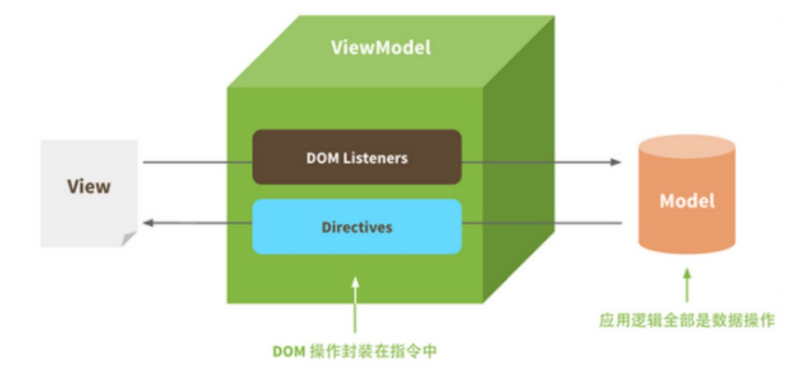

### 1.2.2.程序案例

代码编写步骤：

1. 定义html，引入vue.js。
2. 定义div，此区域作为vue的接管区域。
3. 定义vue实例，接管该区域。
4. 定义model（数据对象）。
5. VM完成在区域中展示数据。

~~~html
<!DOCTYPE html>
<html lang="en" >
<head>
    <meta charset="UTF-8">
    <title>vue测试程序</title>
    
</head>
<body>

    <!--这里就相当于MVVM中的view-->
    <!--我们可以通过v-text来取代{{}}，这样子可以防止闪烁的情况发生-->
    <a v-bind:href="url">
        <!--v-bind可以绑定到dom对象的任意属性上-->
    
    </a>
    <!--v-model仅仅能在如下的元素中使用：input,select,textarea,components<Vue的组件>-->
    <input type="text" v-model="num1"/> + <input type="text" v-model="num2"/> = 
    <button v-on:click="change">计算</button>

</body>

</html>
~~~

1. v-model：
   1. 在表单控件或者组件上创建双向绑定
   2. v-model仅能在如下元素中使用`input,select,text,components(Vue中的组件)`
2. 解决插值表达式闪烁问题，使用`v-text`.它可以将一个变量的值渲染到指定的元素中，它可以解决插值表达式闪烁的问题。
3. `v-on`绑定一个按钮的单击事件
4. `v-bind`

~~~html
<!--1、作用: v‐bind可以将数据对象绑定在dom的任意属性中。
v‐bind可以给dom对象绑定一个或多个特性，例如动态绑定style和class-->
<!--2、举例:-->

<!--3、缩写形式-->

~~~

5. `v-if`
6. `v-for`

~~~html
<!DOCTYPE html>
<html lang="en" >
<head>
    <meta charset="UTF-8">
    <title>vue测试程序</title>
    
</head>
<body>

    <ul>
        <li v-for="(item,index) in myList" :key="index" v-if="index%2==0">{{index}}--{{item}}</li>
    </ul>

</body>

</html>
~~~

# 2.Webpack

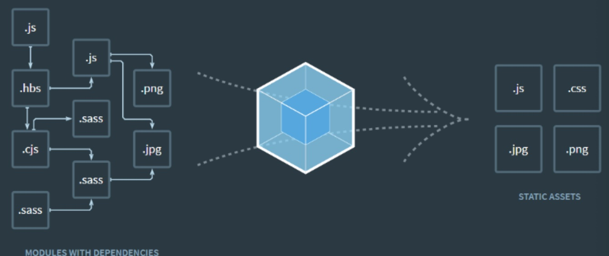

## 2.1.Webpack介绍

1. **模块化开发**：程序员在开发时可以分模块创建不同的js，css等小文件方便开发，最后使用webpack将这些小文件打包成一个文件，减少了http的请求的次数。
2. **编译typescript.ES6等高级js语法**：开发中我们可以使用javascript的很多高级版本，比如：typescript，ES6等，方便开发，webpack可以将打包文件转成浏览器可识别的js语法。
3. **CSS预编译**:webpack允许在开发中使用Sass和Less等原生CSS的扩展技术，通过sass-loader,less-loader将Sass和Less的语法编译成浏览器可识别的css语法。

## 2.2.Node.js

Webpack基于Node.js进行运行,首先需要安装Node.js

传统意义上的JavaScript运行在浏览器上，Chrome使用的JavaScript引擎是V8,Node.js是一个运行的服务端的框架，它的底层就使用V8引擎，这样就可以使用JavaScript去编写一些服务端的程序。

输入命令`node-v`可以显示出当前node的版本。

##2.3.NPM

NPM全称是Node Package Manager ,是node包管理和分发的工具，使用NPM可以对应用的依赖进行管理，NPM的功能和服务端项目已经集成了NPM工具，可以输入`npm -v`查看当前npm版本

设置包路径，包路径就是npm从远程下载js包所存放的路径。使用npm config ls查询NPM管理包路径（NPM下载的依赖包所存放的路径）

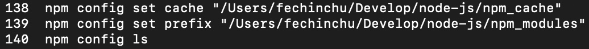

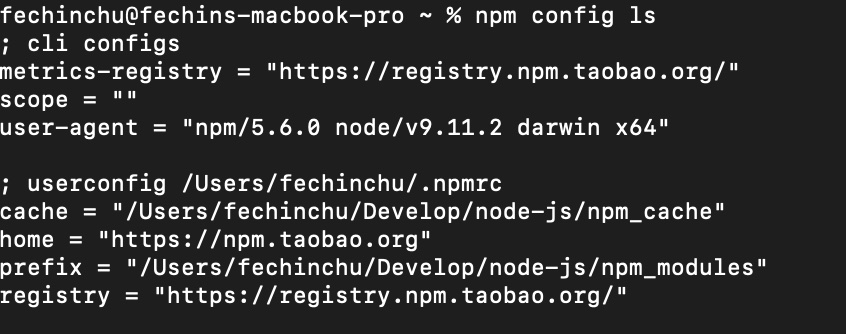

## 2.4.CNPM

npm默认会去国外的镜像去下载js包，在开发中通常我们使用国内镜像，这里我们使用淘宝镜像。

输入命令，进行全局安装淘宝镜像

`npm install -g cnpm --registry=https://registry.npm.taobao.org`

安装后，我们可以使用`cnpm -v`命令来查看cnpm的版本.使用nrm ls查看镜像指向

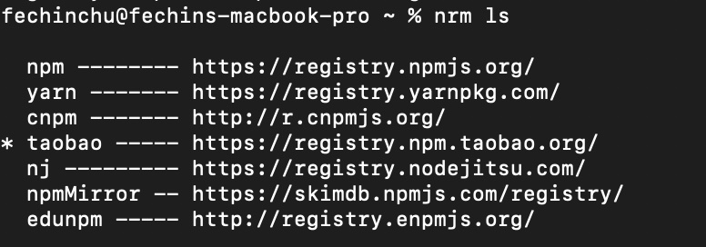

使用nrm use XXX切换镜像，如果nrm没有安装则需要进行全局安装：`cnpm install -g nrm`.

## 2.5.Webpack

### 2.5.1.Webpack安装

Webpack安装分为本地安装和全局安装。

1.本地安装：仅将webpack安装在当前项目的node_modules目录中，仅对当前项目有效。

* 在某项目目录下 `cnpm install --save-dev webpack`或`npm install --save-dev webpack`
* `cnpm install --save-dev webpack-cli`(4.0以后的版本需要安装webpack-cli)

2.全局安装：将webpack安装在本机，对所有项目有效，全局安装会锁定一个webpack版本，该版本可能不适用某个项 目。全局安装需要添加`-g`参数。

3.安装webpack指定版本：

本地`cnpm install --save-dev webpack@3.6.0`

全局`cnpm install webpack@3.6.0 -g`

### 2.5.2.Webpack开发过程

[Webpack案例链接](/Users/fechinchu/VSCodeProjects/xc-ui-pc-static-portal/webpack_test03/vue_test_02.html)

**Webpack打包过程和webpack开发过程**：

* 分模块去定义js：在js中要导出将来想要被打包的方法 module.exports
* 定义main.js入口文件(主文件):在此文件，导入引用的js文件，var{add} = require("./model01"),可以在main.js中使用导入的js方法。
* 使用webpack命令打包js：`webpack main.js build.js`
* 在html上引用打包生成的js文件。

### 2.5.3.Webpack-dev-server

Webpack-dev-server开发服务器，它的功能可以实现热加载并自动刷新浏览器。

1. 使用webpack-dev-server需要安装webpack，webpack-dev-server和html-webpack-plugin三个个包。

~~~shell
cnpm install webpack@3.6.0 webpack-dev-server@2.9.1 html-webpack-plugin@2.30.1 --save-dev
~~~

2. 安装完成之后，会发现程序目录出现一个package.json文件，此文件中记录了程序的依赖。

3. 之后需要在package.json中配置script

~~~json
"scripts": {
    "dev": "webpack-dev-server --inline --hot --open --port 5008"
  },
~~~

* `--inline`：自动刷新
* `--hot`:热加载
* `--port`:指定端口
* `--open`:自动在默认浏览器打开
* `--host`:可以指定服务器的ip，不指定则为127.0.0.1，如果对外发布则填写公网的ip地址。

4. 此时package.json的文件内容如下

~~~json
{
  "scripts": {
    "dev": "webpack-dev-server --inline --hot --open --port 5008"
  },
  "devDependencies": {
    "html-webpack-plugin": "^2.30.1",
    "webpack": "^3.6.0",
    "webpack-dev-server": "^2.9.1"
  }
}
~~~

devDependencies：开发人员在开发过程中所需要的依赖；

scripts：可执行的命令。

### 2.5.4.webpack.config.js

在项目目录下创建webpack.config.js，webpack.config.js是webpack的配置文件。在此文件可以配置应用的入口文件，输出配置，插件等，其中要实现热加载自动刷新的功能需要配置html-webpack-plugin插件。

html-webpack-plugin插件的作用是根据html模板在内存生成html文件，它的工作原理是根据模板文件在内存中生成一个index.html文件。

~~~javascript
//引用html-webpack-plugin插件，作用是根据html模板在内存生成html文件，它的工作原理是根据模板文件在内存中生成一个index.html文件。
var htmlwp = require('html-webpack-plugin');
module.exports={
    entry:'./src/main.js',  //指定打包的入口文件
    output:{
        path : __dirname+'/dist',  // 注意：__dirname表示webpack.config.js所在目录的绝对路径
        filename:'build.js'		   //输出文件
    },
    devtool: 'eval-source-map',
    plugins:[
        new htmlwp({
            title: '首页',  //生成的页面标题<head><title>首页</title></head>
            filename: 'index.html', //webpack-dev-server在内存中生成的文件名称，自动将build注入到这个页面底部，才能实现自动刷新功能
            template: 'vue_test_02.html' //根据vue_02.html这个模板来生成(这个文件请程序员自己生成)
        })
    ]
};
~~~

最后我们使用`npm run dev`的命令去运行程序。

### 2.5.5.debug调试

使用了webpack之后就不能采用传统js的调试方法在chrome中打断点。

webpack将多个源文件打包成一个文件，并且文件的内容产生了很大的变化，webpack提供了devtool进行调试，devtool是基于sourcemap的方式，在调试时会生成一个map文件，其内容记录生成文件和源文件的内容映射，即生成文件中的哪个位置对应源文件中的哪个位置，有了sourcemap就可以在调试时看到源代码。

需要在webpack.config.js中配置：

~~~json
devtool: 'eval‐source‐map',
~~~

在js代码中添加`debugger`，启动应用，刷新页面跟踪代码，就可以使用chrome进行调试了。

# 3.CMS前端工程

CMS系统使用Vue-cli脚手架创建，Vue-cli是Vue官方提供的快速构建单页应用的脚手家，github地址：[Vue-cli脚手架github](https://github.com/vuejs/vue-cli)。

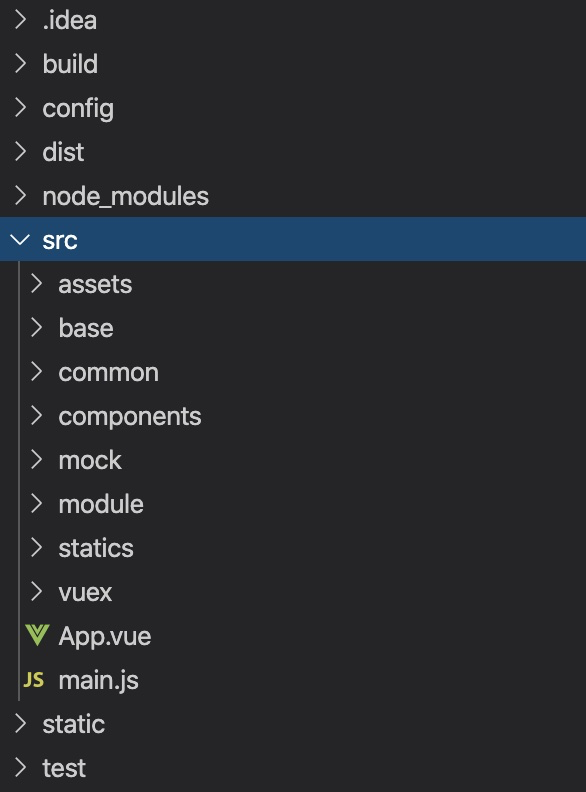

如上图：

* build:构建前端工程相关的js文件
* config:配置的js文件
  * Index.js:设置代理，暴露端口
* dist:打包输出静态文件
* node_modules:依赖包

* src下
  * assets:存放一些静态文件，如图片
  * base：存放基础组件
    * base/api:基础api接口
    * base/components:通用页面
    * base/router:总的路由配置，加载各模块的路由
  * common:工具类
  * components:组件目录，本项目不用
  * mock:存放前端单元测试方法
  * module:存放各业务模块的页面和api方法（下级目录以模块命名，下边以cms举例）
    * cms/api:cms模块的api接口
    * cms/component:cms模块的组件
    * cms/page:cms模块的页面
    * cms/router:cms模块的路由配置
  * statics:存放第三方组件的静态资源
  * vuex:存放vuex文件，本项目不使用
  * App.vue:主页。
  * main.js:入口文件。
*  static:与src平级目录，此目录存放静态资源（它与assets的区别在于：static目录中的文件不被webpack打包处理，会原样拷贝到dist目录下）

## 3.1.单页面应用

单页Web应用(single page web application,SPA),就是只有一张Web页面的应用，单页应用程序（SPA）是加载单个HTML页面并在用户与应用程序交互时动态更新页面的web应用程序，浏览器一开始会加载必需的HTML,CSS,JavaScript，所有的操作都在这张页面上完成，都由JavaScript来控制。因此，对单页应用来说模块化的开发和设计非常重要。

* 单页面应用的优点：
  * 用户操作体验好，用户不用刷新页面，整个交互过程都是通过Ajax来操作。
  * 适合前后端分离开发，服务端提供http接口，前端请求http接口获取数据，使用js进行客户端渲染。
* 单页面应用的缺点：
  * 首页加载慢：单页面应用会将js，css打包成一个文件，在加载页面显示的时候加载打包文件，如果打包文件较大或者网速慢则用户体验不好。
  * SEO(search engine optimization)为搜索引擎优化，它是一种利用搜索引擎的搜索规则来提高网站在搜索引擎排名的方法。目前各家搜索引擎对JS支持不好，所以使用单页面应用将大大减少搜索引擎对网站的收录。

## 3.2.CMS前端页面查询开发

### 3.2.1.页面结构

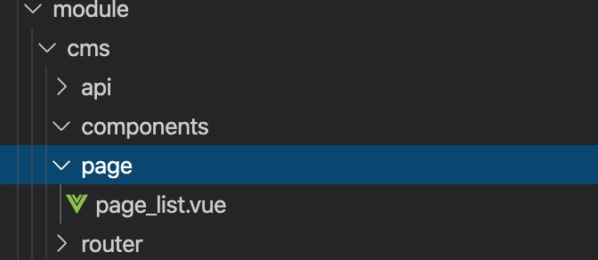

在model目录创建cms模块的目录结构，在page目录新建page_list.vue。

.vue文件的结构如下：

~~~vue
<template> <!‐‐编写页面静态部分，即view部分‐‐> 测试页面显示...
</template>

~~~

注意：template内容必须有一个根元素，否则vue会报错，这里我们在`<template>`标签内定义一个`
`。

### 3.2.2.页面路由

在cms的router下配置路由：

~~~js
import Home from '@/module/home/page/home.vue';
//@就是表示的src下的路径
import page_list from '@/module/cms/page/page_list.vue';
export default [{
    path: '/',
    component: Home,
    name: 'CMS',//菜单名称
    hidden: false,
    children:[
      {path:'/cms/page/list',name:'页面列表',component: page_list,hidden:false}
    ]
  }
]
~~~

在base目录下的router导入cms模块的路由

~~~js
import Vue from 'vue';
import Router from 'vue-router';
Vue.use(Router);
// 定义路由配置
let routes = []
let concat = (router) => {
  routes = routes.concat(router)
}
// // 导入路由规则
import HomeRouter from '@/module/home/router'
import CmsRouter from '@/module/cms/router'
// 合并路由规则
concat(HomeRouter)//加入home模块的路由
concat(CmsRouter)//加入cms模块的路由
export default routes;
~~~

### 3.2.3.Table组件测试

本项目使用Eleement-UI来构建界面，ELement是一套基于Vue2.0的桌面端组件库。

[Element-UI官方站点]: https://element.eleme.cn/#/zh-CN/component/installation

更改之前原生的Table组件

~~~vue
<template>
    <el-table
      :data="tableData"
      style="width: 100%">
      <el-table-column
        prop="date"
        label="日期"
        width="180">
      </el-table-column>
      <el-table-column
        prop="name"
        label="姓名"
        width="180">
      </el-table-column>
      <el-table-column
        prop="address"
        label="地址">
      </el-table-column>
    </el-table>
  </template>

  
~~~

更改之后的Table

~~~vue
<template>
  

    <!--编写页面静态部分，即view部分-->
    <el-button type="primary" size="small" v-on:click="query">查询</el-button>
    <el-table
      :data="list"
      stripe
      style="width: 100%">
      <el-table-column type="index" width="60">
      </el-table-column>
      <el-table-column prop="pageName" label="页面名称" width="120">
      </el-table-column>
      <el-table-column prop="pageAliase" label="别名" width="120">
      </el-table-column>
      <el-table-column prop="pageType" label="页面类型" width="150">
      </el-table-column>
      <el-table-column prop="pageWebPath" label="访问路径" width="250">
      </el-table-column>
      <el-table-column prop="pagePhysicalPath" label="物理路径" width="250">
      </el-table-column>
      <el-table-column prop="pageCreateTime" label="创建时间" width="180" >
      </el-table-column>
    </el-table>
    <el-pagination
      layout="prev, pager, next"
      :total="total"
      :page-size="params.size"
      :current-page="params.page"
      v-on:current-change="changePage"
      style="float:right">
    </el-pagination>
  

</template>

~~~

Api方法定义：

~~~js
import http from './../../../base/api/public'
import querystring from 'querystring'
let sysConfig = require('@/../config/sysConfig')
let apiUrl = sysConfig.xcApiUrlPre;

//页面查询
export const page_list = (page,size,params) =>{
  //请求服务端的页面查询接口
  return http.requestQuickGet(apiUrl+'/cms/page/list/'+page+'/'+size);
}
~~~

## 3.3.跨域问题

测试过程中，发现结果报错。

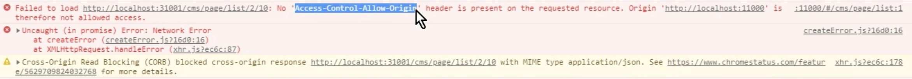

原因：浏览器的同源策略不允许跨域访问，所谓的同源策略是指协议，域名，端口相同。

解决·：采用proxyTable解决

vue-cli提供的解决vue开发环境下跨域问题的方法，proxyTable的底层使用了http-proxy-middleware

[http-proxy-middleware](https://github.com/chimurai/http-proxy-middleware),它是http代理中间件，它依赖node.js,基本原理是用服务端代理解决浏览器跨域。

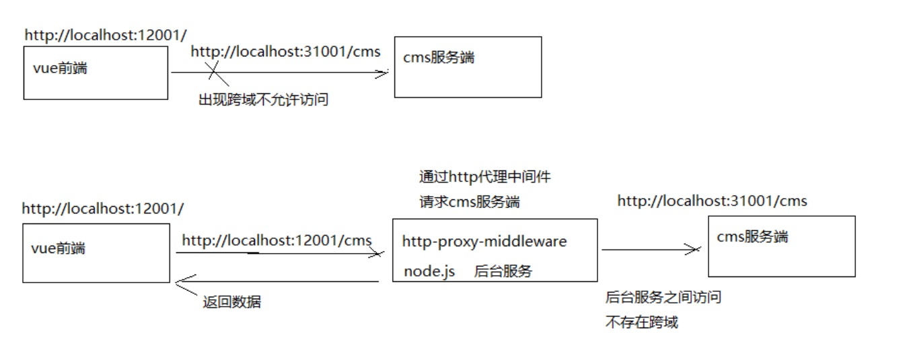

配置代理：

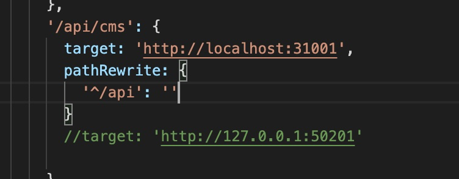

后期可以直接使用Nginx来解决跨域问题。

## 3.4.进入页面立即查询

目前实现的功能是进入页面点击查询按钮向服务端查询，实际的需求是进入页面立即查询。

则要用到Vue的钩子函数，每个Vue实例在被创建时都要经过一系列的初始化过程——例如，需要设置数据监听，编译模板，将实例挂载到DOM并在数据变化时更新DOM等，同时在这个过程中也会运行一些叫做**生命周期钩子**的函数，这给了用户在不同阶段添加自己代码的机会。

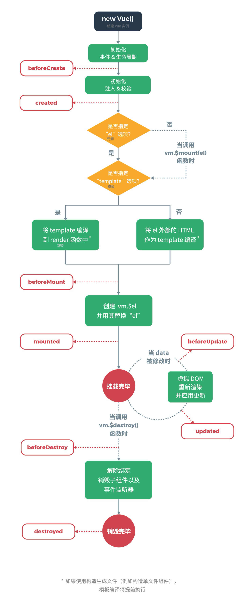

通常使用最多的是created和mounted两个钩子：

* created:Vue实例已创建但是DOM元素还没有渲染生成。
* mounted:DOM元素渲染生成完成后调用。

## 3.5.前后端请求响应流程：

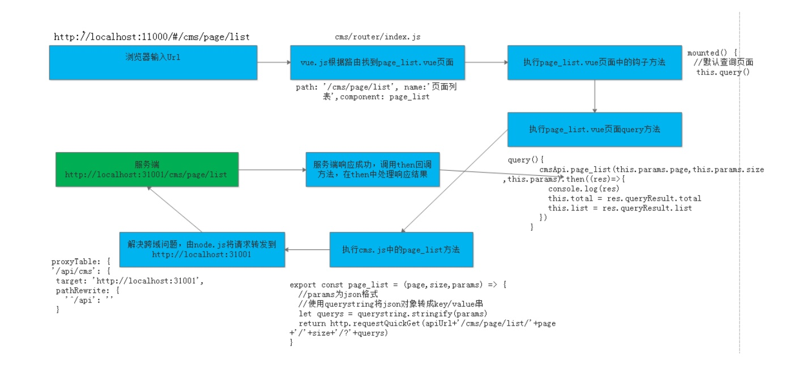

1. 在浏览器输入前端url；
2. 前端框架vue.js根据url解析路由，根据路由找到page_list.vue页面；
3. 首先执行page_list.vue中的钩子方法；
4. 在钩子方法中调用query方法；
5. 在query方法中调用cms.js中的page_list方法；
6. cms.js中的page_list方法通过axios请求服务端接口；
7. 采用proxyTable解决跨域问题，node.js将请求转发到服务端；
8. 服务端处理，将查询结果响应给前端；
9. 成功响应调用then方法，在then方法中处理响应结果，将查询结果赋值给数据模型中的total和list变量；
10. vue.js通过双向数据绑定将list数据渲染输出。