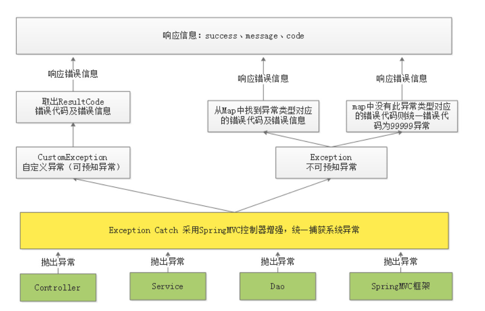

# Education 项目总结03

# 1.异常处理

## 1.1.异常处理流程

系统对异常的处理使用统一的异常处理流程：

1. 自定义异常类型；
2. 自定义错误代码及错误信息；
3. 对于可预知的异常由程序员在代码中主动抛出，由SpringMVC统一捕获；（可预知的异常是程序员在代码中手动抛出本系统定义的特定异常类型，由于是程序员抛出的异常，通常异常信息比较齐全，程序员在抛出时候会指定错误代码及错误信息，获取异常信息也比较方便）；
4. 对于不可预知的异常由SpringMVC统一捕获Exception类型的异常（不可预知的异常通常是由于系统出现BUG，或者一些不可抗拒的错误，异常类型类RuntimeException类型）；
5. 可预知的异常及不可预知的运行时异常最终会采用统一的信息格式（错误代码+错误信息）来表示，最终也会随请求响应给客户端。

**处理流程：**

1. 在controller，service，dao中程序员抛出自定义异常，SpringMVC框架抛出异常类型；
2. 统一由异常捕获类捕获异常，并进行处理；
3. 捕获到自定义异常则直接取出错误代码及错误信息，响应给用户；
4. 捕获到非自定义异常类型首先从Map中找到该异常类型是否对应具体的错误代码，如果有则取出代码和错误信息并响应给用户，如果从Map中找不到异常类型所对应的错误代码则统一为99999错误代码并响应给用户；
5. 将错误代码及错误信息以json格式响应给用户；

~~~java
@ControllerAdvice//控制器增强
@ResponseBody
public class ExceptionCatch {

    private static final Logger LOGGER = LoggerFactory.getLogger(ExceptionCatch.class);

    /**
     * 定义Map，配置异常类型所对应的错误代码
     */
    private static ImmutableMap<Class<? extends Throwable>, ResultCode> EXCEPTIONS;
    /**
     * 定义Map的builder对象，去构建ImmutableMap
     */
    protected static ImmutableMap.Builder<Class<? extends Throwable>, ResultCode> builder = ImmutableMap.builder();

    static {
        //定义异常
        builder.put(HttpMessageNotReadableException.class, CommonCode.INVALID_PARAM);
    }

    /**
     * 捕获CustomException
     * @param customException
     * @return
     */
    @ExceptionHandler(CustomException.class)
    public ResponseResult customException(CustomException customException) {
        LOGGER.error("catch exception:{}", customException.getMessage());
        ResultCode resultCode = customException.getResultCode();
        return new ResponseResult(resultCode);
    }

    @ExceptionHandler(Exception.class)
    public ResponseResult exception(Exception exception) {
        LOGGER.error("catch exception:{}", exception.getMessage());

        if (EXCEPTIONS == null) {
            EXCEPTIONS = builder.build();
            //EXCEPTIONS构建成功
        }
        //从EXCEPTIONS中找异常类型中所对应的错误代码，如果找到了将错误代码响应给用户，如果找不到给用户响应99999
        ResultCode resultCode = EXCEPTIONS.get(exception.getClass());
        if (resultCode != null) {
            return new ResponseResult(resultCode);
        } else {
            return new ResponseResult(CommonCode.SERVER_ERROR);
        }
    }
}
~~~

