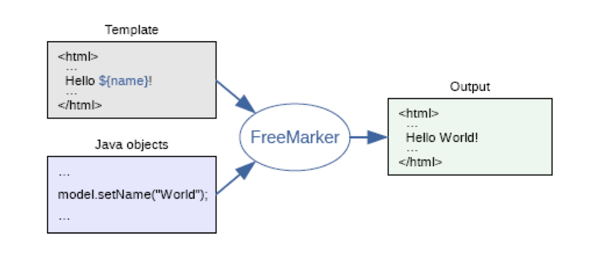
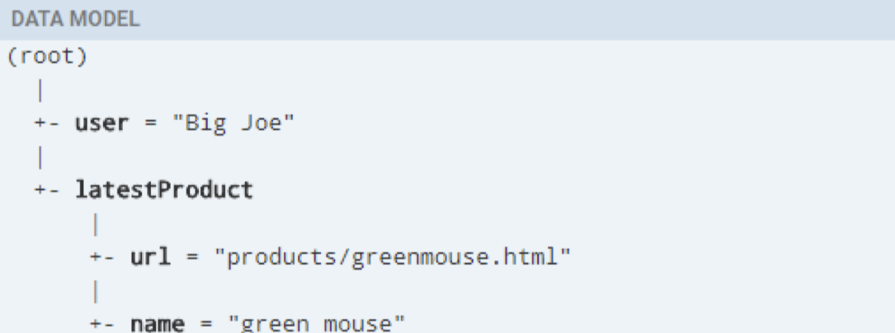
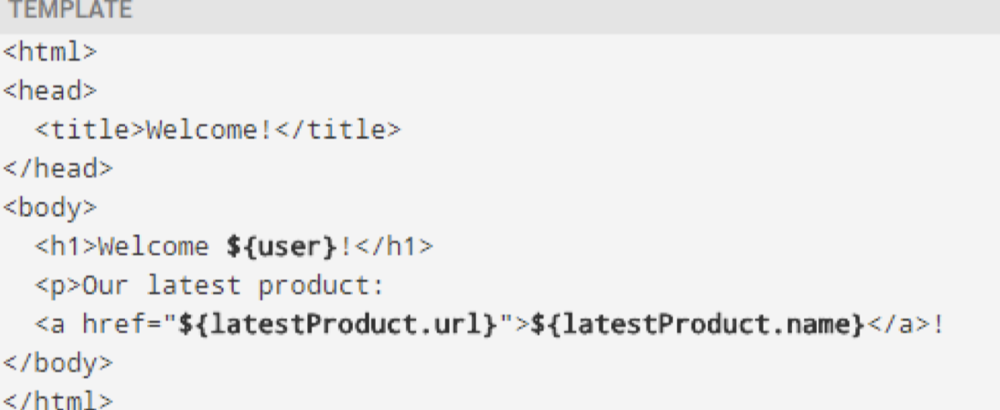
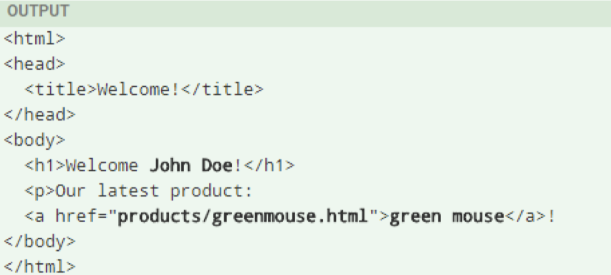
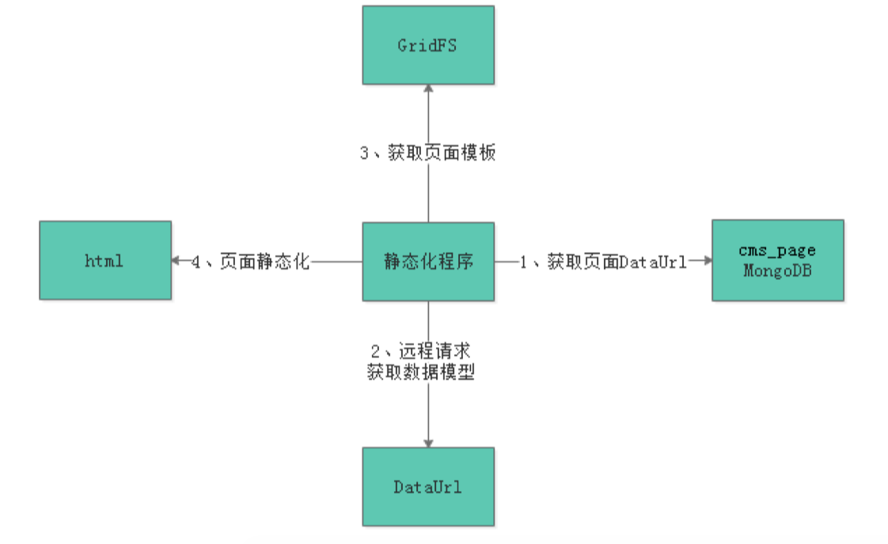
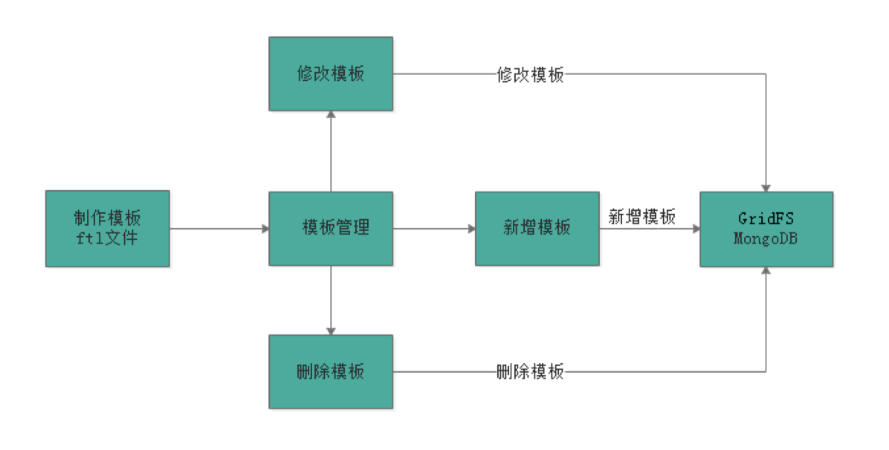
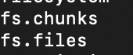
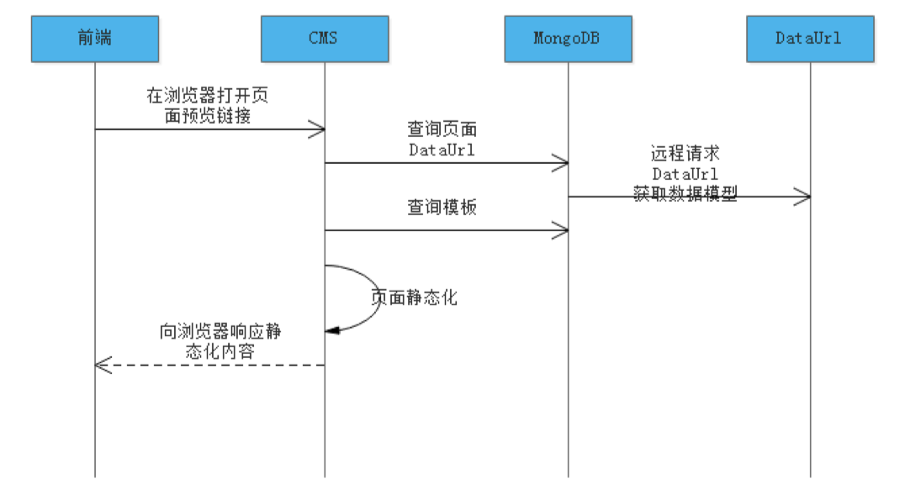

# Education 项目总结04

# 1.页面静态化需求分析

**1.为什么对页面进行管理？**

本项目对cms的定位是对页面进行管理，对那些由于经营需要（首页的广告，门户页面板式）而需要快速上线的功能页面进行管理。

**2.如何进行页面管理？**

通过人工开发来编写html页面可以实现，如果采用cms系统可以实现由cms自动化对页面进行更新，自动采用静态化的技术生成html页面，快速上线。

**3.如何对页面进行静态化呢？**

采用模板+数据=输出html的技术实现静态化。

**4.静态化的html页面存放在哪里呢？**

生成的静态化的页面，发布到服务器中，实现页面的快速上线。

# 2.FreeMarker

## 2.1.FreeMarker介绍

FreeMarkder是一款模板引擎，即一种基于模板和要改变数据，并用来生成输出文本（html文件，json文件，java文件）的通用工具，它不是面向最终用户的，而是一个Java类库，是一款程序员可以嵌入他们所开发产品的组件。



常见的Java模板引擎：JSP,Freemarker,Thymeleaf,Velocity等。

官方案例：

[官网案例]: https://freemarker.apache.org/docs/dgui_quickstart_basics.html	"官网案例"

**数据模型**



**模板**



**输出**



## 2.2.FreeMarker基础

### 2.2.1.基础语法种类

> 1. 注释：即`<#-- -->`，介于其之间的内容会被忽略
> 2. 插值：即`${...}`，freemarker会用真实的值去替代
> 3. FTL指令：和HTML标记类似，名字前加#予以区分，FreeMarker会解析标签中的表达式或逻辑。
> 4. 文本：仅文本信息，这些不是freemarker的注释，插值，FTL指令的内容会被freemarker忽略解析，直接输出内容。

### 2.2.2.遍历List集合

~~~html
<#list stus as stu>
        <tr>
            <td>${stu_index+1}</td>
            <#--if标签的用法-->
            <td <#if stu.name =='小明'>style="background: red;"</#if>>${stu.name}</td>
            <td>${stu.age}</td>
            <td <#if (stu.money > 300)>style="background: red;"</#if>>${stu.money}</td>
            <td>${stu.birthday?date}</td>
        </tr>
    </#list>
~~~

### 2.2.3.遍历Map集合

~~~jsp
<#--遍历数据模型中的Map（stuMap）-->
<#--第一种方法，在中括号中填写map的key-->
<br/>
姓名:${stuMap['stu1'].name}<br/>
年龄:${stuMap['stu1'].name}<br/>
<#--第二种方法,在map后面点key-->
姓名:${(stuMap.stu1.name)!''}<br/>
年龄:${(stuMap.stu1.name)!''}<br/>
<#--第三种方法，将map中的key遍历出来-->
<#list stuMap?keys as k>
    ${stuMap[k].name}<br/>
    ${stuMap[k].age}<br/>
</#list>
~~~

### 2.2.4.if指令判断

~~~jsp
<#--if标签的用法-->
            <td <#if stu.name =='小明'>style="background: red;"</#if>>${stu.name}</td>
            <td>${stu.age}</td>
            <td <#if (stu.money > 300)>style="background: red;"</#if>>${stu.money}</td>
            <td>${stu.birthday?date}</td>
~~~

### 2.2.5.空值处理

~~~jsp
<#--判断某变量是否存在使用"??"-->
    <#if stus ??>
    <#list stus as stu>
        <tr>
            <td>${stu_index+1}</td>
            <#--if标签的用法-->
            <td <#if stu.name =='小明'>style="background: red;"</#if>>${stu.name}</td>
            <td>${stu.age}</td>
            <td <#if (stu.money > 300)>style="background: red;"</#if>>${stu.money}</td>
            <td>${stu.birthday?date}</td>
        </tr>
    </#list>
    </#if>

姓名:${(stuMap.stu1.name)!''}<br/>
年龄:${(stuMap.stu1.name)!''}<br/>
~~~

### 2.2.6.内建函数

**内建函数的语法格式：变量+?+函数名称**

* 取到集合的大小`${集合名称?size}`

* 日期格式化

* ```jsp
  显示年月日: ${today?date}
  显示时分秒：${today?time}
  显示日期+时间：${today?datetime}
  自定义格式化： ${today?string("yyyy年MM月")}
  ```

# 3.页面静态化

## 3.1.FreeMarker的静态化测试

第一种方法

```java
//测试静态化，基于ftl模板文件生成html文件
    @Test
    public void testGenerateHtml() throws IOException, TemplateException {
        //定义配置类
        Configuration configuration = new Configuration(Configuration.getVersion());
        //定义模板
        String classPath = this.getClass().getResource("/").getPath();
        configuration.setDirectoryForTemplateLoading(new File(classPath+"/templates/"));
        //获取模板文件的内容
        Template template = configuration.getTemplate("test01.ftl");
        //定义数据模型
        Map map = getMap();
        //静态化
        String content = FreeMarkerTemplateUtils.processTemplateIntoString(template, map);
        InputStream inputStream = IOUtils.toInputStream(content);
        FileOutputStream fileOutputStream = new FileOutputStream(new File("/Users/fechinchu/JavaTest/FreemarkerTest/test01.html"));
        IOUtils.copy(inputStream, fileOutputStream);
        fileOutputStream.close();
        inputStream.close();
    }
```

第二种方法

~~~java
//基于模板文件的内容（字符串）生成html文件
    @Test
    public void testGenerateHtmlByString() throws IOException, TemplateException {
        //定义配置类
        Configuration configuration = new Configuration(Configuration.getVersion());
        //定义模板（这里测试时使用简单的字符串作为模板）
        String templateString=""
                + "<html>\n"
                + " <head></head>\n"
                + " <body>\n"
                + " 名称：${name}\n"
                + " </body>\n"
                + "</html>";
        //使用一个模板加载器
        StringTemplateLoader stringTemplateLoader = new StringTemplateLoader();
        stringTemplateLoader.putTemplate("template",templateString);
        //在配置中设置模板加载器
        configuration.setTemplateLoader(stringTemplateLoader);
        Template template = configuration.getTemplate("template", "UTF-8");
        //定义数据模型
        Map map = getMap();
        //静态化
        String content = FreeMarkerTemplateUtils.processTemplateIntoString(template, map);
        InputStream inputStream = IOUtils.toInputStream(content);
        FileOutputStream fileOutputStream = new FileOutputStream(new File("/Users/fechinchu/JavaTest/FreemarkerTest/test02.html"));
        IOUtils.copy(inputStream, fileOutputStream);
        fileOutputStream.close();
        inputStream.close();
    }
~~~

## 3.2.页面静态化流程

FreeMarker:模板+数据模型=输出，页面静态化需要准备数据模型和模板。先知道数据模型的结构才可以编写模板，因为在模板中要引用数据模型中的数据。

**1.如何获取页面的数据模型？**

CMS管理了各种页面，CMS对页面进行静态化的时候需要数据模型，但是CMS并不知道每个页面的数据模型的具体内容，它只管执行静态化程序便可以对也面进行静态化，所以CMS静态化程序需要通过一种通用的方法来获取数据模型。

在编辑页面信息时指定一个DataUrl，此DataUrl便是获取数据模型的Url，它基于Http方式，CMS对页面页面进行静态化时候，会从页面信息中读取DataUrl，通过Http远程调用的方法请求DataUrl获取数据模型。

**2.管理员如何知道DataURL的内容呢？**

举例说明：此页面是轮播页面，它的DataURL由开发轮播图管理的程序员提供。

此页面是精品课程推荐页面，它的DataURL由精品课程推荐的程序员提供。

**3.页面静态化流程**



1. 静态化程序首先读取页面获取DataURL。
2. 静态化程序远程请求DataURL得到数据模型。
3. 获取页面模板。
4. 执行页面静态化。

### 3.2.1.获取DataURL

### 3.2.2.远程请求获取数据模型

SpringMVC提供RestTemplate请求http接口，RestTemplate的底层可以使用第三方的http客户端工具实现http的请求，常用的http客户端工具有Apache HttpClient，OKHttpClient等，本项目使用OKHttpClient完成http请求。

1. 添加依赖

~~~xml
<dependency> 
  <groupId>com.squareup.okhttp3</groupId> 
  <artifactId>okhttp</artifactId> 
</dependency>
~~~

2. 配置RestTemplate（在SpringBoot启动类中配置RestTemplate）

~~~java
@SpringBootApplication
@EntityScan("com.xuecheng.framework.domain.cms")//扫描实体类
@ComponentScan(basePackages = {"com.xuecheng.api"})//扫描接口
@ComponentScan(basePackages = {"com.xuecheng.manage_cms"})//扫描本项目下的所有类
@ComponentScan(basePackages = {"com.xuecheng.framework"})//扫描common包下的类
public class ManageCmsApplication {
    public static void main(String[] args) {
        SpringApplication.run(ManageCmsApplication.class, args);
    }

    @Bean
    public RestTemplate restTemplate(){
        return new RestTemplate(new OkHttp3ClientHttpRequestFactory());
    }
}
~~~

3. 远程调用测试

~~~java
@Test
public void testRestTemplate( ){
        ResponseEntity<Map> forEntity = restTemplate.getForEntity("http://localhost:31001/cms/config/getModel/5a791725dd573c3574ee333f", Map.class);
        Map body = forEntity.getBody();
    }
~~~

###  3.2.3.模板管理



CMS提供模板管理的功能，业务流程如上：

1. 要增加新模板首先要制作模板，模板内容就是FreeMarker ftl内容；
2. 通过模板管理模块新增模板，修改模板，删除模板；
3. 模板信息存储在MongoDB数据库，其中模板信息存储在cms_template集合中，模板文件存在GridFS文件系统中。

#### 3.2.3.1.GridFS

**1.GridFS介绍**

GridFS是MongoDB提供的用于持久化存储文件的模块，CMS使用MongoDB存储数据，使用GridFS可以快速集成开发。

**GridFS工作原理**：在GridFS存储文件是将文件分块存储，文件会按照256KB的大小分割成多个块进行存储，GridFS使用两个集合（Collection）存储文件，一个集合是chunks，用于存储文件的二进制数据，一个集合是files，用于存储文件的元数据信息（文件名称，块大小，上传时间等信息）。从GridFS中读取文件要对文件的各块进行组装，合并。

详细参考

[GridFS]: https://docs.mongodb.com/manual/core/gridfs/

**2.GridFS存取文件测试**



存储原理说明：

文件存储成功得到一个文件id，此文件id是fs.file集合中的主键。可以通过文件id查询fs.chunks表中的记录，得到文件的内容。

```java
@Test
public void testSaveGridFs() throws FileNotFoundException {
    File file = new File("/Users/fechinchu/IdeaProjects/Projects_Education/xcEduCode01/test-freemarker/src/main/resources/templates/index_banner.ftl");
    FileInputStream fileInputStream = new FileInputStream(file);
    ObjectId objectId = gridFsTemplate.store(fileInputStream, "index_banner.ftl");
}
```

**3.GridFS读取文件测试**

* 在config包中定义Mongodb的配置类，GridFSBucket用于打开下载流对象

~~~java
@Configuration
public class MongoConfig {
    @Value("${spring.data.mongodb.database}")
    private String db;

    //GridFSBucket用来打开下载流对象
    @Bean
    public GridFSBucket getGridFSBucket(MongoClient mongoClient){
        MongoDatabase database = mongoClient.getDatabase(db);
        return GridFSBuckets.create(database);
    }
}
~~~

* 如下是测试代码

~~~java
@Test
public void queryFile() throws IOException {
       //根据文件ID去查询文件
        GridFSFile fsFile = gridFsTemplate.findOne(Query.query(Criteria.where("_id").is("5dfde2bb81f7a77393ccbb12")));

        //打开一个下载流对象
        GridFSDownloadStream gridFSDownloadStream = gridFSBucket.openDownloadStream(fsFile.getObjectId());
        //创建GridFSResource对象，用来操作流。
        GridFsResource gridFsResource = new GridFsResource(fsFile,gridFSDownloadStream);
        //从流中取数据
        String content = IOUtils.toString(gridFsResource.getInputStream(), "UTF-8");
    }
~~~

**4.GridFS删除文件**

~~~java
//删除文件
    @Test
    public void testDelFile() throws IOException {
        //根据文件id删除fs.files和fs.chunks中的记录
      gridFsTemplate.delete(Query.query(Criteria.where("_id").is("5b32480ed3a022164c4d2f92")));
    }
~~~

## 3.3.静态化流程代码

静态化流程：

1. 填写页面DataURL(在编辑cms页面信息界面填写DataURL，将此字段保存到cms_page集合中);
2. 静态化程序获取页面的DataURL;
3. 静态化程序远程请求DataUrl获取数据模型;
4. 静态化程序获取页面的模板信息;
5. 执行页面静态化;

~~~java
//页面静态化
    public String getPageHtml(String pageId) {
        /*
        1. 静态化程序获取页面数据模型
        */
        Map model = getModelByPageId(pageId);
        if (model == null) {
            ExceptionCast.cast(CmsCode.CMS_GENERATEHTML_DATAURLISNULL);
        }
        /*
        2. 静态化程序获取页面的模板信息
        */
        String template = getTemplateByPageId(pageId);
        if (StringUtils.isEmpty(template)) {
            ExceptionCast.cast(CmsCode.CMS_GENERATEHTML_TEMPLATEISNULL);
        }
        /*
        3. 执行页面静态化
        * */
        return generateHtml(template, model);

    }

    /**
     * 获取页面的模板信息
     *
     * @param pageId
     * @return
     */
    private String getTemplateByPageId(String pageId) {
        //取出页面信息
        CmsPage cmsPage = this.findById(pageId);
        //取出页面的DataURL
        if (cmsPage == null) {
            ExceptionCast.cast(CmsCode.CMS_PAGE_NOTEXISTS);
        }
        String templateId = cmsPage.getTemplateId();
        if (StringUtils.isEmpty(templateId)) {
            ExceptionCast.cast(CmsCode.CMS_GENERATEHTML_TEMPLATEISNULL);
        }
        Optional<CmsTemplate> cmsTemplateOptional = cmsTemplateRepository.findById(templateId);
        if (cmsTemplateOptional.isPresent()) {
            CmsTemplate cmsTemplate = cmsTemplateOptional.get();
            //获取模板的文件ID
            String templateFileId = cmsTemplate.getTemplateFileId();
            //从GridFS中取模板文件的内容
            GridFSFile fsFile = gridFsTemplate.findOne(Query.query(Criteria.where("_id").is(templateFileId)));
            //打开一个下载流对象
            GridFSDownloadStream gridFSDownloadStream = gridFSBucket.openDownloadStream(fsFile.getObjectId());
            //创建GridFSResource对象，用来操作流。
            GridFsResource gridFsResource = new GridFsResource(fsFile, gridFSDownloadStream);
            //从流中取数据
            try {
                return IOUtils.toString(gridFsResource.getInputStream(), "UTF-8");
            } catch (IOException e) {
                e.printStackTrace();
            }
        }
        return null;
    }

    /**
     * 获取数据模型
     *
     * @param pageId
     * @return
     */
    private Map getModelByPageId(String pageId) {
        //取出页面信息
        CmsPage cmsPage = this.findById(pageId);
        //取出页面的DataURL
        if (cmsPage == null) {
            ExceptionCast.cast(CmsCode.CMS_PAGE_NOTEXISTS);
        }
        String dataUrl = cmsPage.getDataUrl();
        if (StringUtils.isEmpty(dataUrl)) {
            ExceptionCast.cast(CmsCode.CMS_GENERATEHTML_DATAISNULL);
        }
        //通过restTemplate请求url来获取数据
        ResponseEntity<Map> forEntity = restTemplate.getForEntity(dataUrl, Map.class);
        return forEntity.getBody();
    }

    private String generateHtml(String templateString, Map model) {
        //定义配置类
        Configuration configuration = new Configuration(Configuration.getVersion());
        //使用一个模板加载器
        StringTemplateLoader stringTemplateLoader = new StringTemplateLoader();
        stringTemplateLoader.putTemplate("template", templateString);
        //在配置中设置模板加载器
        configuration.setTemplateLoader(stringTemplateLoader);
        FileOutputStream fileOutputStream = null;
        InputStream inputStream = null;
        try {
            Template template = configuration.getTemplate("template", "UTF-8");
            //静态化
            String content = FreeMarkerTemplateUtils.processTemplateIntoString(template, model);
            return content;
        } catch (IOException e) {
            e.printStackTrace();
        } catch (TemplateException e) {
            e.printStackTrace();
        } finally {
            if (fileOutputStream != null) {
                try {
                    fileOutputStream.close();
                } catch (IOException e) {
                    e.printStackTrace();
                }
            }
            if (inputStream != null) {
                try {
                    inputStream.close();
                } catch (IOException e) {
                    e.printStackTrace();
                }
            }
        }
        return null;
    }
~~~

# 4.页面预览

页面在发布前增加页面预览的步骤，方便用户检查页面内容是否正确，页面预览的流程如下：



## 4.1.编写代码

Service层的页面静态化代码已经实现

编写Controller层代码

```java
@RequestMapping(value = "/cms/preview/{pageId}",method = RequestMethod.GET)
public void preview(@PathVariable("pageId") String pageId){
    //执行静态化
    String pageHtml = cmsPageService.getPageHtml(pageId);
    //通过reponse对象将内容输出
    ServletOutputStream outputStream = null;
    try {
        outputStream = response.getOutputStream();
        outputStream.write(pageHtml.getBytes("UTF-8"));
    } catch (IOException e) {
        e.printStackTrace();
    } finally {
        if(outputStream!=null){
            try {
                outputStream.close();
            } catch (IOException e) {
                e.printStackTrace();
            }
        }
    }
}
```

## 4.2配置Nginx代理

为了通过Nginx请求静态资源（css,图片等），通过Nginx代理进行页面预览

~~~
	# 页面预览
	location /cms/preview/ {
	    proxy_pass http://cms_server_pool/cms/preview/;
	}
~~~

配置cms_server_pool将请求转发到cms

~~~
upstream cms_server_pool{
	server 127.0.0.1:31001 weight=10;
}
~~~

编写前端页面并进行测试。