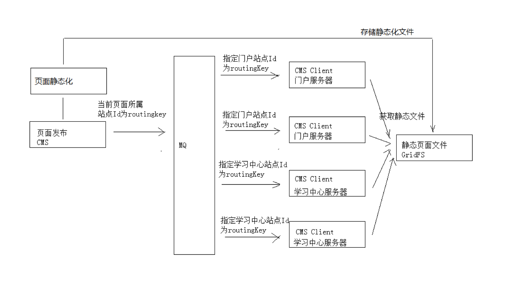
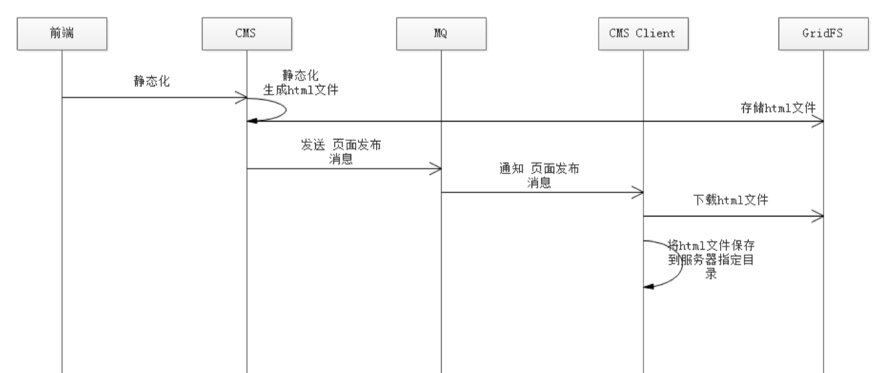

# Education 项目总结06

# 1. 页面发布

## 1.1.技术方案

本项目使用MQ实现页面发布的技术方案如下：

**技术方案说明**

1. 平台包括多个站点，页面归属不同站点；
2. 发布一个页面应该讲页面发布到所属站点的服务器上；
3. 每个站点服务部署cms client程序，并与交换机绑定，绑定时指定站点id为routingkey。指定站点id为routingKey就可以实现cms client只能接收到所属站点的页面发布消息；
4. 页面发布程序向MQ发布消息时指定页面所属站点id为routingKey，将该页面发布到它所在服务器上的cms client;

**RabbitMQ路由模式分析：**发布一个页面，需发布到该页面所属的每个站点服务器，其它站点服务器不发布。所以本项目采用routing模式，用站点id作为routingKey，这样就可以匹配页面只发布到所属的站点服务器上。

**页面发布流程：**

1. 前端请求cms执行页面发布；
2. cms执行静态化程序生成html文件；
3. cms将html文件存储到GridFS中；
4. cms向MQ发送页面发布消息；
5. Cms Client从GridFS中下载html文件；
6. Cms Client将html保存到所在服务器的指定目录。

**思考:**

1. 如果发布到服务器的页面内容不正确怎么办?

2. 如果需要发布很多服务器,点击"发布"后如何知道详细的发布结果?
3. 一个页面发布到多个服务器,其中一个服务器发布失败时怎么办?

#2.课程管理

课程管理包括如下功能需求:

1. 分类管理;
2. 新增课程;
3. 修改课程;
4. 预览课程;
5. 发布课程;

