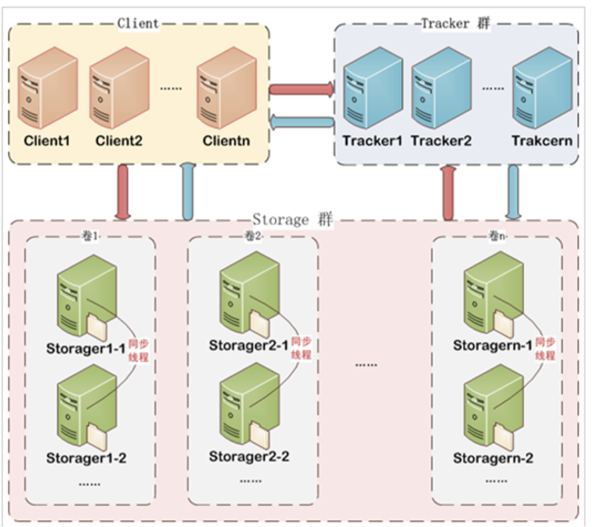
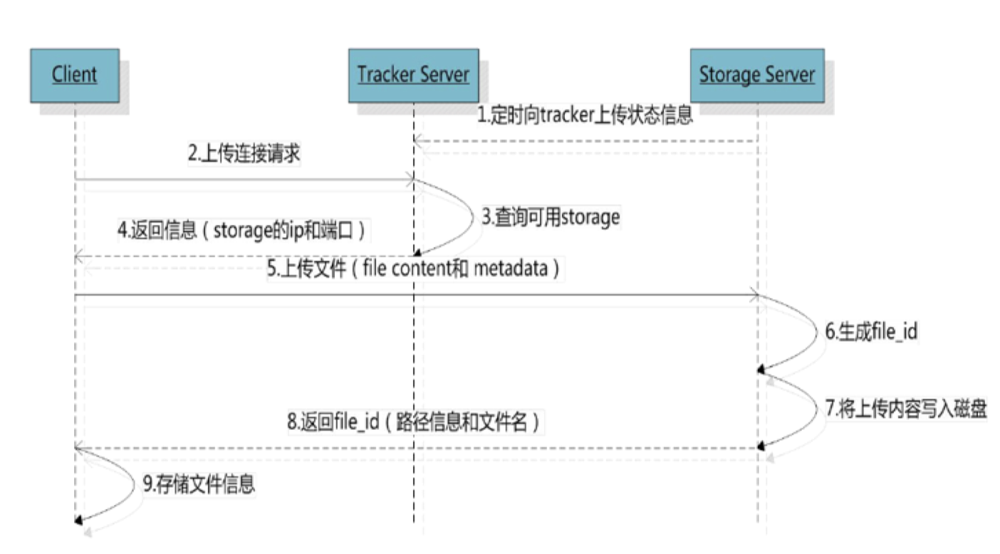
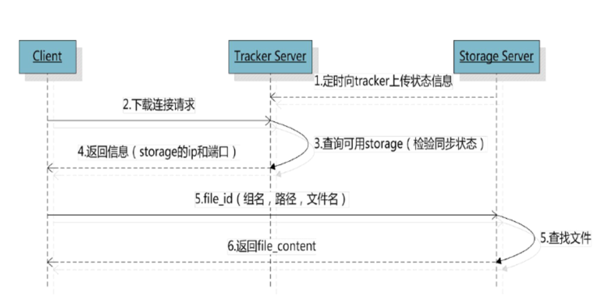

# Education 项目总结07

# 1.分布式文件系统

分布式文件系统是面对互联网的需求而产生，互联网时代对海量数据如何存储？靠简单的增加硬盘的个数已经满足不了需求。因为硬盘传输速度有限但是数据在急速增长，另外我们还要做好数据的备份，数据安全等。

采用分布式文件系统可以将多个地点的文件系统通过网络连接起来，组成一个文件系统网络，节点之间通过网络进行通信，一台文件系统的存储和传输能力有限，我们让文件在多台计算机上存储，通过多台计算共同传输。

# 2.主流分布式文件系统

## 2.1.NFS

NFS(Network File System)即网络文件系统，是FreeBSD支持的文件系统中的一种，它允许网络中的计算机之间通过TCP/IP网络共享资源，在NFS的应用中，本地NFS的客户端可以透明地读写位于远端NFS服务器上的文件，就像访问本地文件一样。

## 2.2.GFS

GFS是一个可扩展的分布式文件系统，用于大型的，分布式的，对大量数据进行访问的应用，它运行于廉价的普通硬件上，可以提供容错功能，它可以给大量的用户提供总体性能较高的服务。

## 2.3.HDFS

Hadoop分布式文件系统（HDFS）被设计成适合运行在通用硬件上的分布式文件系统。它和现有的分布式文件系统有很多共同点。但同时，它和其他的分布式文件系统的区别也是很明显的。HDFS是一个高度容错性的系统，适合部署在廉价的机器上。HDFS就能提供高吞吐量的数据访问，非常适合大规模数据集上的应用。

## 2.4.分布式文件服务提供商

* 阿里云的OSS
* 七牛云存储
* 百度云存储

# 3.FastDFS

FastDFS是用c语言编写的一款开源的分布式文件系统，它是由淘宝资深架构师余庆编写并开源。FastDFS专为互联网量身定制，充分考虑了冗余备份、负载均衡、线性扩容等机制，并注重高可用、高性能等指标，使用FastDFS很容易搭建一套高性能的文件服务器集群提供文件上传、下载等服务。

上边介绍的NFS、GFS都是通用的分布式文件系统，通用的分布式文件系统的优点的是开发体验好，但是系统复杂性高、性能一般，而专用的分布式文件系统虽然开发体验性差，但是系统复杂性低并且性能高。fastDFS非常适合存储图片等那些小文件，fastDFS不对文件进行分块，所以它就没有分块合并的开销，fastDFS网络通信采用 socket，通信速度很快。

## 3.1.FastDFS架构

FastDFS架构包括 Tracker server和Storage server。客户端请求Tracker server进行文件上传、下载，通过Tracker server调度最终由Storage server完成文件上传和下载。

1. **Tracker**

Tracker Server作用是负载均衡和调度，通过Tracker server在文件上传时可以根据一些策略找到Storage server提供文件上传服务。可以将tracker称为追踪服务器或调度服务器。

FastDFS集群中的Tracker server可以有多台，Tracker server之间是相互平等关系同时提供服务，Tracker server 不存在单点故障。客户端请求Tracker server采用轮询方式，如果请求的tracker无法提供服务则换另一个tracker。

2. **Storage**

Storage Server作用是文件存储，客户端上传的文件最终存储在Storage服务器上，Storage server没有实现自己的文件系统而是使用操作系统的文件系统来管理文件。可以将storage称为存储服务器。

Storage集群采用了分组存储方式。storage集群由一个或多个组构成，集群存储总容量为集群中所有组的存储容量之和。一个组由一台或多台存储服务器组成，组内的Storage server之间是平等关系，不同组的Storage server 之间不会相互通信，同组内的Storage server之间会相互连接进行文件同步，从而保证同组内每个storage上的文件完全一致的。一个组的存储容量为该组内的存储服务器容量最小的那个，由此可见组内存储服务器的软硬件配置最好是一致的。

采用分组存储方式的好处是灵活、可控性较强。比如上传文件时，可以由客户端直接指定上传到的组也可以由 tracker进行调度选择。一个分组的存储服务器访问压力较大时，可以在该组增加存储服务器来扩充服务能力（纵向扩容）。当系统容量不足时，可以增加组来扩充存储容量（横向扩容）。

3. **Storage状态收集**

Storage server会连接集群中所有的Tracker server，定时向他们报告自己的状态，包括磁盘剩余空间、文件同步状况、文件上传下载次数等统计信息。

## 3.2.文件上传流程

客户端上传文件后存储服务器将文件ID返回给客户端，此文件ID用于以后访问该文件的索引信息。文件索引信息包括：组名，虚拟磁盘路径，数据两级目录，文件名。

* 组名：文件上传后所在的storage组名称，在文件上传成功后有storage服务器返回，需要客户端自行保存。
* 虚拟磁盘路径：storage配置的虚拟路径，与磁盘选项store_path*对应。如果配置了store_path0则是M00， 如果配置了store_path1则是M01，以此类推。

* 数据两级目录：storage服务器在每个虚拟磁盘路径下创建的两级目录，用于存储数据文件。
* 文件名：与文件上传时不同。是由存储服务器根据特定信息生成，文件名包含：源存储服务器IP地址、文件创建时间戳、文件大小、随机数和文件拓展名等信息。

## 3.3.文件下载流程

tracker根据请求的文件路径即文件ID来快速定义文件。

* 通过组名tracker能够很快的定位到客户端需要访问的存储服务器组是group1，并选择合适的存储服务器提供客 户端访问。
* 存储服务器根据“文件存储虚拟磁盘路径”和“数据文件两级目录”可以很快定位到文件所在目录，并根据文件名找到 客户端需要访问的文件。