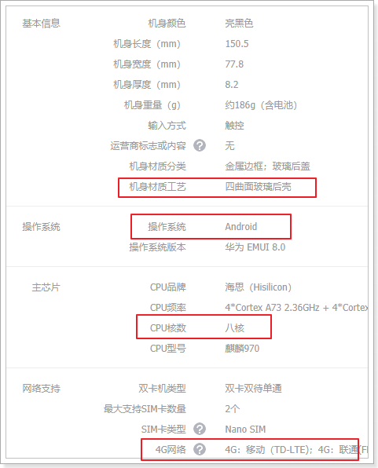
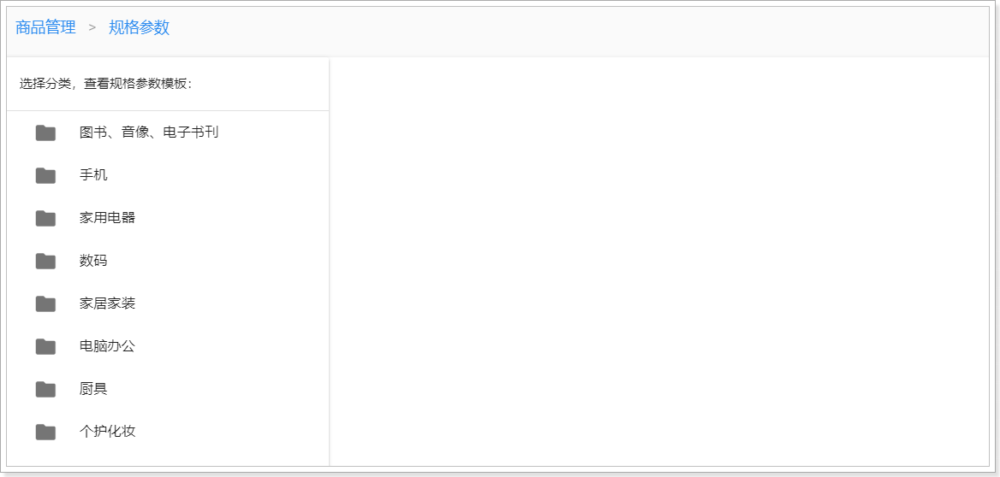
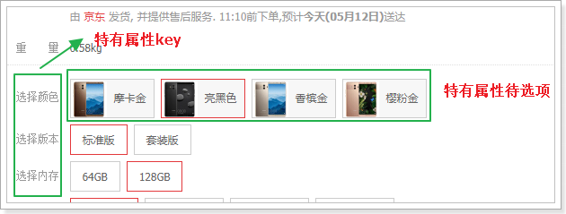

# 0.学习目标

- 了解商品规格数据结构设计思路
- 实现商品规格查询
- 了解SPU和SKU数据结构设计思路
- 实现商品查询


# 1.商品规格数据结构

商品中都有属性，不同商品，属性往往不同，这一部分数据很重要，我们一起来看看：

## 1.1.规格属性内容

我们看下京东中商品的规格属性：

一款华为手机的属性：


一款空调的属性：


我们发现，不同商品的属性名称竟然不同，假如我们要把属性放入一张表去保存，表字段该如何设计？

别着急，我们再看另一个手机的属性：

三星手机的规格属性：


我们发现，虽然不同商品，规格不同。但是同一分类的商品，比如都是手机，其规格参数名称是一致的，但是值不一样。

也就是说，商品的规格参数应该是与分类绑定的。**每一个分类都有统一的规格参数模板，但不同商品其参数值可能不同**。

因此：

- 规格参数的名称（key）与值（value）应该分开来保存

- 一个分类，对应一套规格参数模板，只有规格参数key，没有值
- 一个分类对应多个商品，每个商品的规格值不同，每个商品对应一套规格的值


## 1.2.规格与规格组

值我们暂且不管，新增商品时，再来填写规格参数值即可，我们先思考**规格参数模板**（key）该如何设计。

来看下规格参数的结构：

​	 

- 规格数据首先要分组，组内再有不同的规格参数
- 一个分类规格模板中，有多个规格组
- 每个规格组中，包含多个规格参数

从面向对象的思想来看，我们规格参数和规格组分别是两类事务，并且组与组内参数成**一对多关系**，因此可以有两个类分别描述他们，那么从数据库设计来看，也就对应两张不同的表：


- 规格组：tb_spec_group
  - 一个商品分类下有多个规格组
- 规格参数：tb_spec_param
  - 一个规格组下，有多个规格参数

如图：


大家接下来要思考的就是：

- 描述规格组需要哪些属性？
- 描述规格参数需要哪些属性？

想清楚上面的问题，就知道表该怎么设计了。


## 1.3.表结构

### 1.3.1.规格组

规格参数分组表：tb_spec_group

```mysql
CREATE TABLE `tb_spec_group` (
  `id` bigint(20) NOT NULL AUTO_INCREMENT COMMENT '主键',
  `cid` bigint(20) NOT NULL COMMENT '商品分类id，一个分类下有多个规格组',
  `name` varchar(32) NOT NULL COMMENT '规格组的名称',
  `create_time` timestamp NULL DEFAULT CURRENT_TIMESTAMP,
  `update_time` timestamp NULL DEFAULT CURRENT_TIMESTAMP ON UPDATE CURRENT_TIMESTAMP,
  PRIMARY KEY (`id`),
  KEY `key_category` (`cid`)
) ENGINE=InnoDB AUTO_INCREMENT=15 DEFAULT CHARSET=utf8 COMMENT='规格参数的分组表，每个商品分类下有多个规格参数组';
```

规格组有3个字段：

- id：主键
- cid：商品分类id，一个分类下有多个模板
- name：该规格组的名称。


### 1.3.2.规格参数

规格参数表：tb_spec_param

```mysql
CREATE TABLE `tb_spec_param` (
  `id` bigint(20) NOT NULL AUTO_INCREMENT COMMENT '主键',
  `cid` bigint(20) NOT NULL COMMENT '商品分类id',
  `group_id` bigint(20) NOT NULL COMMENT '规格参数组ID',
  `name` varchar(128) NOT NULL COMMENT '参数名',
  `numeric` tinyint(1) NOT NULL COMMENT '是否是数字类型参数，true或false',
  `unit` varchar(128) DEFAULT '' COMMENT '数字类型参数的单位，非数字类型可以为空',
  `generic` tinyint(1) NOT NULL COMMENT '是否是sku通用属性，true或false',
  `searching` tinyint(1) NOT NULL COMMENT '是否用于搜索过滤，true或false',
  `segments` varchar(1024) DEFAULT '' COMMENT '数值类型参数，如果需要搜索，则添加分段间隔值，如CPU频率间隔：0.5-1.0',
  `create_time` timestamp NULL DEFAULT CURRENT_TIMESTAMP,
  `update_time` timestamp NULL DEFAULT CURRENT_TIMESTAMP ON UPDATE CURRENT_TIMESTAMP,
  PRIMARY KEY (`id`),
  KEY `key_group` (`group_id`),
  KEY `key_category` (`cid`)
) ENGINE=InnoDB AUTO_INCREMENT=24 DEFAULT CHARSET=utf8 COMMENT='规格参数组下的参数名';
```

按道理来说，我们的规格参数就只需要记录参数名、组id、商品分类id即可。但是这里却多出了很多字段，为什么？

#### 1.3.2.1数值类型

某些规格参数可能为数值类型，我们需要标记出来，并且记录单位：

​	 

我们有两个字段来描述：

- numberic：是否为数值类型
  - true：数值类型
  - false：不是数值类型
- unit：参数的单位

#### 1.3.2.2搜索过滤

打开一个搜索页，我们来看看过滤的条件：


你会发现，过滤条件中的屏幕尺寸、运行内存、网路、机身内存、电池容量、CPU核数等，在规格参数中都能找到：

 

也就是说，规格参数中的数据，将来会有一部分作为搜索条件来使用。我们可以在设计时，将这部分属性标记出来，将来做搜索的时候，作为过滤条件。

与搜索相关的有两个字段：

- searching：标记是否用作过滤
  - true：用于过滤搜索
  - false：不用于过滤
- segments：某些数值类型的参数，在搜索时需要按区间划分，这里提前确定好划分区间
  - 比如电池容量，0~2000mAh，2000mAh~3000mAh，3000mAh~4000mAh

乐优商城是一个全品类的电商网站，因此商品的种类繁多，每一件商品，其属性又有差别。为了更准确描述商品及细分差别，抽象出两个概念：SPU和SKU，了解一下：


### 1.3.2.3.通用属性

有一个generic属性，代表通用属性，我们在商品数据结构时再聊。


# 2.商品规格参数管理

接下来，我们一起来看下页面中对规格组和规格参数的管理。

## 2.1.规格组查询

首先是规格组管理，我们点击菜单中的`规格参数`：

 

可以看到页面发生了变化

### 2.1.1页面请求

打开规格参数页面，看到如下内容：



可以看到规格参数页面的左侧是一个商品分类的树，右侧暂时是空白。那么问题来了：

我们这里是规格管理，为什么会显示商品分类信息呢？


因为规格是跟商品分类绑定的，我们在看到规格参数时，肯定希望知道接下来要管理的是哪个分类下的规格参数。

所以首先会展现商品分类树，并且提示你要选择商品分类，才能看到规格参数的模板。


此时，我们点击分类，当点击到某个3级分类时，页面发生了变化：


页面右侧出现了数据表格，不过还没有数据。同时，我们查看页面控制台，可以看到请求已经发出：


这个请求查询的应该就是当前分类下的规格参数组信息了。


### 2.1.2.后端代码

> 实体类

在`ly-item-service`中添加实体类：

```java
package com.leyou.item.entity;

import lombok.Data;
import tk.mybatis.mapper.annotation.KeySql;

import javax.persistence.Id;
import javax.persistence.Table;
import java.util.Date;

@Table(name = "tb_spec_group")
@Data
public class SpecGroup {

    @Id
    @KeySql(useGeneratedKeys = true)
    private Long id;

    private Long cid;

    private String name;

    private Date createTime;

    private Date updateTime;
}
```


在`ly-item-service`中编写业务：

> mapper

```java
public interface SpecGroupMapper extends Mapper<SpecGroup> {
}
```

> controller

先分析下需要的东西，在页面的ajax请求中可以看出：

- 请求方式：查询，肯定是get

- 请求路径：/spec/groups/of/category ，这里通过路径占位符传递商品分类的id

- 请求参数：商品分类id

- 返回结果：我们的业务是查询当前分类下的所有规格组，而一个分类下有多个规格组信息，因此查询的结果应该是规格组的集合，同以前一样，我们也定义一个DTO在`ly-item-pojo`中：

  ```java
  package com.leyou.item.dto;

  import lombok.Data;

  /**
   * @author 黑马程序员
   */
  @Data
  public class SpecGroupDTO {
      private Long id;

      private Long cid;

      private String name;
  }
  ```


代码：

```java
/**
     * 根据商品分类查询规格组
     * @param id 商品分类id
     * @return 规格组集合
     */
@GetMapping("/group/of/category")
public ResponseEntity<List<SpecGroupDTO>> queryGroupByCategory(@RequestParam("id") Long id){
    return ResponseEntity.ok(specService.queryGroupByCategory(id));
}
```


> service:

```java
/**
 * @author huyi.zhang
 */
@Service
public class SpecService {

    @Autowired
    private SpecGroupMapper groupMapper;

    public List<SpecGroupDTO> queryGroupByCategory(Long id) {
        // 查询规格组
        SpecGroup s = new SpecGroup();
        s.setCid(id);
        List<SpecGroup> list = groupMapper.select(s);
        if (CollectionUtils.isEmpty(list)) {
            throw new LyException(ExceptionEnum.BRAND_NOT_FOUND);
        }
        // 对象转换
        return BeanHelper.copyWithCollection(list, SpecGroupDTO.class);
    }
}
```


> 页面访问测试：

我们访问：http://api.leyou.com/api/item/spec/groups/of/category/?id=76

 

然后在后台系统中测试：


## 2.2.规格参数查询

在刚才的表格中，只显示了规格组信息，但是却没有看到组内的规格参数，那么规格参数信息又保存在哪里呢？

### 2.2.1.页面请求

我们在页面点击某个规格组信息，发现页面发生了变化：


可以看到当我们选中`主体`这个规格组时，其它规格组信息都隐藏了，表格变成了一个空白表格。

通过表头可以看出，这个表格显示的应该是`主体`这个规格组内的规格参数信息。

此时查看控制台，发现页面发起了新的请求：


可以看出，这个是根据规格组的id，查询规格参数的请求


### 2.2.2.后台实现

接下来，我们就编写后台接口，完成规格参数查询

> 实体类：

```java
@Table(name = "tb_spec_param")
@Data
public class SpecParam {
    @Id
    @KeySql(useGeneratedKeys = true)
    private Long id;
    private Long cid;
    private Long groupId;
    private String name;
    // @Column(name = "`numeric`")
    private Boolean numeric;
    private String unit;
    private Boolean generic;
    private Boolean searching;
    private String segments;
    private Date createTime;
    private Date updateTime;
}
```

> controller

分析：

- 请求方式：GET

- 请求路径：/spec/params

- 请求参数：gid，分组id

- 返回结果：该分组下的规格参数集合，不过我们依然需要定义一个DTO:

  ```java
  @Data
  public class SpecParamDTO {
      private Long id;
      private Long cid;
      private Long groupId;
      private String name;
      private Boolean numeric;
      private String unit;
      private Boolean generic;
      private Boolean searching;
      private String segments;
  }
  ```

  返回结果就是`List<SpecParamDTO>`

- ​

代码：

```java
/**
     * 根据规格组id查询规格参数
     * @param gid
     * @return 规格组集合
     */
@GetMapping("/params")
public ResponseEntity<List<SpecParamDTO>> querySpecParams(@RequestParam("gid") Long gid) {
    return ResponseEntity.ok(specService.querySpecParams(gid));
}
```


> service

```java
public List<SpecParamDTO> querySpecParams(Long gid) {
    SpecParam s = new SpecParam();
    s.setGroupId(gid);
    List<SpecParam> list = paramMapper.select(s);
    if (CollectionUtils.isEmpty(list)) {
        throw new LyException(ExceptionEnum.SPEC_NOT_FOUND);
    }
    return BeanHelper.copyWithCollection(list, SpecParamDTO.class);
}
```

> mapper

```java
public interface SpecParamMapper extends Mapper<SpecParam> {
}
```

测试：


发现报出错误了！！


### 2.2.3.数据库sql关键词冲突

仔细阅读错误说明，说sql语句有误，仔细观察发现Sql语句中有一个字段，名为`numeric`，这个字段名称与数据库名称冲突，这种情况下我们都需要对字段进行转义，变为普通字符串。

但是问题来了，sql是由通用mapper生成的，我们该如何修改Sql语句中的字段呢？

有两种办法，

方案一：通过mapper中的@Column注解，来声明这个字段对应的列名：


这种方式需要对所有关键字冲突字段都添加注解，如果字段比较多，很容易有遗漏，并且编写麻烦。


方案2：通过通用mapper的统一配置，全局修改关键词冲突问题

我们在`application.yml`文件中添加一段通用mapper配置：

```yaml
mapper:
  wrap-keyword: "`{0}`"
```


重启后再次测试：

 

在页面刷新：


## 2.3.增、删、改（作业）

增删改的作业就留给大家去完成了。页面中JS都已经实现，并且发出请求了，你要做的就是实现后台接口。


# 3.SPU和SKU数据结构

## 3.1.什么是SPU和SKU

SPU：Standard Product Unit （标准产品单位） ，一组具有共同属性的商品集

SKU：Stock Keeping Unit（库存量单位），SPU商品集因具体特性不同而细分的每个商品

以图为例来看：


- 本页的 华为Mate10 就是一个商品集（SPU）
- 因为颜色、内存等不同，而细分出不同的Mate10，如亮黑色128G版。（SKU）

可以看出：

- SPU是一个抽象的商品集概念，为了方便后台的管理。
- SKU才是具体要销售的商品，每一个SKU的价格、库存可能会不一样，用户购买的是SKU而不是SPU


## 3.2.数据库设计分析

### 3.2.1.思考分析

弄清楚了SPU和SKU的概念区分，接下来我们一起思考一下该如何设计数据库表。

首先来看SPU，大家一起思考下SPU应该有哪些字段来描述？

```
id:主键
title：标题
description：描述
specification：规格
packaging_list：包装
after_service：售后服务
comment：评价
category_id：商品分类
brand_id：品牌
```

似乎并不复杂.

再看下SKU，大家觉得应该有什么字段？

```
id：主键
spu_id：关联的spu
price：价格
images：图片
stock：库存
颜色？
内存？
硬盘？
```

sku的特有属性也是变化的，不同商品，特有属性不一定相同，那么我们的表字段岂不是不确定？

sku的这个特有属性该如何设计呢？


### 3.2.2.SKU的特有属性

SPU中会有一些特殊属性，用来区分不同的SKU，我们称为SKU特有属性。如华为META10的颜色、内存属性。

不同种类的商品，一个手机，一个衣服，其SKU属性不相同。

同一种类的商品，比如都是衣服，SKU属性基本是一样的，都是颜色、尺码等。

这样说起来，似乎SKU的特有属性也是与分类相关的？事实上，仔细观察你会发现，**SKU的特有属性是商品规格参数的一部分**：


也就是说，我们没必要单独对SKU的特有属性进行设计，它可以看做是规格参数中的一部分。这样规格参数中的属性可以标记成两部分：

- spu下所有sku共享的规格属性（称为通用属性）
- spu下每个sku不同的规格属性（称为特有属性）

回一下之前我们设计的tb_spec_param表，是不是有一个字段，名为generic，标记通用和特有属性。就是为了这里使用。

这样以来，商品SKU表就只需要设计规格属性以外的其它字段了，规格属性由之前的规格参数表`tb_spec_param`来保存。


但是，规格属性的值依然是需要与商品相关联的。

## 3.3.SPU表

### 3.3.1.表结构

SPU表：

```mysql
CREATE TABLE `tb_spu` (
  `id` bigint(20) NOT NULL AUTO_INCREMENT COMMENT 'spu id',
  `name` varchar(256) NOT NULL DEFAULT '' COMMENT '商品名称',
  `sub_title` varchar(256) DEFAULT '' COMMENT '副标题，一般是促销信息',
  `cid1` bigint(20) NOT NULL COMMENT '1级类目id',
  `cid2` bigint(20) NOT NULL COMMENT '2级类目id',
  `cid3` bigint(20) NOT NULL COMMENT '3级类目id',
  `brand_id` bigint(20) NOT NULL COMMENT '商品所属品牌id',
  `saleable` tinyint(1) NOT NULL DEFAULT '1' COMMENT '是否上架，0下架，1上架',
  `create_time` timestamp NULL DEFAULT CURRENT_TIMESTAMP COMMENT '添加时间',
  `update_time` timestamp NULL DEFAULT CURRENT_TIMESTAMP COMMENT '最后修改时间',
  PRIMARY KEY (`id`)
) ENGINE=InnoDB AUTO_INCREMENT=183 DEFAULT CHARSET=utf8 COMMENT='spu表，该表描述的是一个抽象性的商品，比如 iphone8';
```

与我们前面分析的基本类似，但是似乎少了一些字段，比如商品描述。

我们做了表的垂直拆分，将SPU的详情放到了另一张表：tb_spu_detail

```mysql
CREATE TABLE `tb_spu_detail` (
  `spu_id` bigint(20) NOT NULL,
  `description` text COMMENT '商品描述信息',
  `generic_spec` varchar(2048) NOT NULL DEFAULT '' COMMENT '通用规格参数数据',
  `special_spec` varchar(1024) NOT NULL COMMENT '特有规格参数及可选值信息，json格式',
  `packing_list` varchar(1024) DEFAULT '' COMMENT '包装清单',
  `after_service` varchar(1024) DEFAULT '' COMMENT '售后服务',
  `create_time` timestamp NULL DEFAULT CURRENT_TIMESTAMP,
  `update_time` timestamp NULL DEFAULT CURRENT_TIMESTAMP ON UPDATE CURRENT_TIMESTAMP,
  PRIMARY KEY (`spu_id`)
) ENGINE=InnoDB DEFAULT CHARSET=utf8;
```

这张表中的数据都比较大，为了不影响主表的查询效率我们拆分出这张表。

需要注意的是这两个字段：generic_spec和special_spec。

### 3.3.2.spu中的规格参数

前面讲过规格参数与商品分类绑定，同一分类的商品，会有一套相同的规格参数key（规格参数模板），但是这个分类下每个商品的规格参数值都不相同，因此要满足下面几点：

- 我们有一个规格参数表，跟分类关联，保存的就是某分类下的规格参数模板。

- 我们还需要表，跟商品关联，保存某个商品，相关联的规格参数的值。
- 规格参数因为分成了通用规格参数和特有规格参数，因此规格参数值也需要分别于SPU和SKU关联：
  - 通用的规格参数值与SPU关联。
  - 特有规格参数值与SKU关联。

但是我们并没有增加新的表，来看下我们的 表如何存储这些信息：

#### 3.3.2.1.generic_spec字段

如果要设计一张表，来表示spu中的通用规格属性的值，至少需要下面的字段：

```
spu_id：与哪个商品关联
param_id：是商品的哪个规格参数
value：具体的值
```

我们并没有这么设计。而是把与某个商品相关的规格属性值，直接保存到这个商品spu表中，因此这些规格属性关联的商品就一目了然，那么上述3个属性中的`spu_id`就无需保存了，而剩下的就是`param_id`和规格参数值了。两者刚好是一一对应关系，组成一个键值对。我们刚好可以用一个json结构来标示。

是也就是spuDetail表中的`generic_spec`，其中保存通用规格参数信息的值：

> 整体来看：

 

json结构，其中都是键值对：

- key：对应的规格参数的`spec_param`的id
- value：对应规格参数的值


#### 3.3.2.2.special_spec字段

我们说spu中只保存通用规格参数，那么为什么有多出了一个`special_spec`字段呢？


以手机为例，品牌、操作系统等肯定是通用规格属性，内存、颜色等肯定是特有属性。

当你确定了一个SPU，比如小米的：红米4X，因为颜色内存等不同，会形成多个sku。如果把每个sku的颜色、内存等信息都整理一下，会形成下面的结果：

```
颜色：[香槟金, 樱花粉, 磨砂黑]
内存：[2G, 3G]
机身存储：[16GB, 32GB]
```

也就是说这里把一个spu下的每个sku的特有规格属性值聚合在了一起！这个就是special_spec字段了。

来看数据格式：

 

也是json结构：

- key：规格参数id
- value：spu属性的数组


那么问题来：为什么要在spu中把所有sku的规格属性聚合起来保存呢？


因为我们有时候需要把所有规格参数都查询出来，而不是只查询1个sku的属性。比如，商品详情页展示可选的规格参数时：

   

刚好符号我们的结构，这样页面渲染就非常方便了。


综上所述，spu与商品规格参数模板的关系如图所示：


## 3.4.SKU表

### 3.4.1.表结构

```mysql
CREATE TABLE `tb_sku` (
  `id` bigint(20) NOT NULL AUTO_INCREMENT COMMENT 'sku id',
  `spu_id` bigint(20) NOT NULL COMMENT 'spu id',
  `title` varchar(256) NOT NULL COMMENT '商品标题',
  `images` varchar(1024) DEFAULT '' COMMENT '商品的图片，多个图片以‘,’分割',
  `stock` int(8) DEFAULT '9999' COMMENT '库存',
  `price` bigint(16) NOT NULL DEFAULT '0' COMMENT '销售价格，单位为分',
  `indexes` varchar(32) DEFAULT '' COMMENT '特有规格属性在spu属性模板中的对应下标组合',
  `own_spec` varchar(1024) DEFAULT '' COMMENT 'sku的特有规格参数键值对，json格式，反序列化时请使用linkedHashMap，保证有序',
  `enable` tinyint(1) NOT NULL DEFAULT '1' COMMENT '是否有效，0无效，1有效',
  `create_time` timestamp NOT NULL DEFAULT CURRENT_TIMESTAMP COMMENT '添加时间',
  `update_time` timestamp NOT NULL DEFAULT CURRENT_TIMESTAMP ON UPDATE CURRENT_TIMESTAMP COMMENT '最后修改时间',
  PRIMARY KEY (`id`),
  KEY `key_spu_id` (`spu_id`) USING BTREE
) ENGINE=InnoDB AUTO_INCREMENT=27359021554 DEFAULT CHARSET=utf8 COMMENT='sku表,该表表示具体的商品实体,如黑色的 64g的iphone 8';
```


特别需要注意的是sku表中的`indexes`字段和`own_spec`字段。sku中应该保存特有规格参数的值，就在这两个字段中。


### 3.4.2.sku中的特有规格参数

#### 3.4.2.1.indexes字段

在SPU表中，已经对特有规格参数及可选项进行了保存，结构如下：

```json
{
    "4": [
        "香槟金",
        "樱花粉",
        "磨砂黑"
    ],
    "12": [
        "2GB",
        "3GB"
    ],
    "13": [
        "16GB",
        "32GB"
    ]
}
```

这些特有属性如果排列组合，会产生12个不同的SKU，而不同的SKU，其属性就是上面备选项中的一个。

比如：

- 红米4X，香槟金，2GB内存，16GB存储
- 红米4X，磨砂黑，2GB内存，32GB存储

你会发现，每一个属性值，对应于SPUoptions数组的一个选项，如果我们记录下角标，就是这样：

- 红米4X，0,0,0
- 红米4X，2,0,1

既然如此，我们是不是可以将不同角标串联起来，作为SPU下不同SKU的标示。这就是我们的indexes字段。

 

这个设计在商品详情页会特别有用：

 

当用户点击选中一个特有属性，你就能根据 角标快速定位到sku。

#### 3.4.2.2.own_spec字段

看结构：

```json
{"4":"香槟金","12":"2GB","13":"16GB"}
```

保存的是特有属性的键值对。

SPU中保存的是可选项，但不确定具体的值，而SKU中的保存的就是具体的值。


## 3.5.导入图片信息

现在商品表中虽然有数据，但是所有的图片信息都是无法访问的，看看数据库中给出的图片信息：


现在这些图片的地址指向的是`http://image.leyou.com`这个域名。而之前我们在nginx中做了反向代理，把图片地址指向了阿里巴巴的OSS服务。

我们可以再课前资料中找到这些商品的图片：


并且把这些图片放到nginx目录，然后由nginx对其加载即可。

首先，我们需要把图片放到nginx/html目录，并且解压缩：


修改Nginx中，有关`image.leyou.com`的监听配置，使nginx来加载图片地址：

```nginx
server {
	listen       80;
	server_name  image.leyou.com;
	location /images { # 监听以/images打头的路径，
		root	html;
	}
	location / {
		proxy_pass   https://ly-images.oss-cn-shanghai.aliyuncs.com;
	}
}
```

再次测试：


# 4.商品查询

## 4.1.效果预览

接下来，我们实现商品管理的页面，先看下我们要实现的效果：


可以看出整体是一个table，然后有新增按钮。是不是跟昨天写品牌管理很像？

## 4.2.页面请求

点击页面菜单中的商品列表页面：

 

页面右侧是一个空白的数据表格：


看到浏览器发起已经发起了查询商品数据的请求：

 

因此接下来，我们编写接口即可。


## 4.3.后台提供接口

页面已经准备好，接下来在后台提供分页查询SPU的功能：

### 4.3.1.实体类

> SPU

```java
@Table(name = "tb_spu")
@Data
public class Spu {
    @Id
    @KeySql(useGeneratedKeys = true)
    private Long id;
    private Long brandId;
    private Long cid1;// 1级类目
    private Long cid2;// 2级类目
    private Long cid3;// 3级类目
    private String name;// 商品名称
    private String subTitle;// 子标题
    private Boolean saleable;// 是否上架
    private Date createTime;// 创建时间
    private Date updateTime;// 最后修改时间
}
```


> SPU详情

```java
@Data
@Table(name="tb_spu_detail")
public class SpuDetail {
    @Id
    private Long spuId;// 对应的SPU的id
    private String description;// 商品描述
    private String specialSpec;// 商品特殊规格的名称及可选值模板
    private String genericSpec;// 商品的全局规格属性
    private String packingList;// 包装清单
    private String afterService;// 售后服务
    private Date createTime;// 创建时间
    private Date updateTime;// 最后修改时间
}
```

### 4.3.2.请求业务分析

先分析：

- 请求方式：GET

- 请求路径：/spu/page

- 请求参数：

  - page：当前页
  - rows：每页大小
  - key：过滤条件
  - saleable：上架或下架

- 返回结果：通过页面能看出来，查询要展示的数据都是SPU数据，而且因为是分页查询，我们可以返回与之前品牌查询一样的PageResult。

  - 要注意，页面展示的中需要是商品分类和品牌名称，而SPU表中中保存的是id，我们需要在DTO中处理这些字段。

    我们可以对Spu拓展categoryName和brandName属性：

    ```java
    /**
     * @author HuYi
     */
    @Data
    public class SpuDTO {
        private Long id;
        private Long brandId;
        private Long cid1;// 1级类目
        private Long cid2;// 2级类目
        private Long cid3;// 3级类目
        private String name;// 名称
        private String subTitle;// 子标题
        private Boolean saleable;// 是否上架
        private Date createTime;// 创建时间
        private String categoryName; // 商品分类名称拼接
        private String brandName;// 品牌名称

        /**
         * 方便同时获取3级分类
         * @return
         */
        @JsonIgnore
        public List<Long> getCategoryIds(){
            return Arrays.asList(cid1, cid2, cid3);
        }
    }
    ```

    需要注意的是，这里通过`@JsonIgnore`注解来忽略这个`getCategoryIds`方法，避免将其序列化到JSON结果

    因此这里需要在`ly-item-pojo`中引入Jackson依赖：

    ```xml
    <dependencies>
        <dependency>
            <groupId>com.fasterxml.jackson.core</groupId>
            <artifactId>jackson-annotations</artifactId>
            <version>2.9.0</version>
            <scope>compile</scope>
        </dependency>
    </dependencies>
    ```


### 4.3.3 拓展分类和品牌查询功能

在SpuDTO中，需要的categoryName和brandName属性。而Spu中只有多级分类id：cid1、cid2、cid3，另外还有brandId。所以我们必须增加新的功能：

- 根据分类id的集合查询商品分类
- 根据品牌id查询品牌

在categoryService中新增查询商品的方法：

```java
public List<CategoryDTO> queryCategoryByIds(List<Long> ids){
    List<CategoryDTO> list = categoryMapper.selectByIdList(ids);
    if (CollectionUtils.isEmpty(list)) {
        // 没找到，返回404
        throw new LyException(ExceptionEnum.CATEGORY_NOT_FOUND);
    }
    return BeanHelper.copyWithCollection(list, CategoryDTO.class);
}
```


在brandService中新增查询品牌的方法：

```java
public BrandDTO queryById(Long id) {
    Brand brand = brandMapper.selectByPrimaryKey(id);
    if (brand == null) {
        throw new LyException(ExceptionEnum.BRAND_NOT_FOUND);
    }
    return BeanHelper.copyProperties(brand, BrandDTO.class);
}
```


### 4.3.4. 拓展通用Mapper

需要注意的是，上面的categoryMapper调用了一个`selectByIdList`的方法，而这个方法在我们学过的通用Mapper中是没有的。我们的方法都是继承自`Mapper<T>`：


事实上，除了`Mapper<T>`接口以为，通用mapper还提供了很多其它XxxMapper接口供我们使用：


所以， 只要我们的CategoryMapper继承了这些接口，那么就具备了他们的功能。

不过呢，不仅仅是CategoryMapper有这样的需求，以后的其它Mapper也有这样的需求，我们可以自定义一个BaseMapper接口，在里面把需要的其它接口都继承过来。以后再编写Mapper只要继承BaseMapper即可。


我们在ly-common中定义一个这样的Mapper：

```java
package com.leyou.common.mapper;

import tk.mybatis.mapper.additional.idlist.IdListMapper;
import tk.mybatis.mapper.annotation.RegisterMapper;
import tk.mybatis.mapper.common.IdsMapper;
import tk.mybatis.mapper.common.Mapper;

/**
 * @author 黑马程序员
 */
@RegisterMapper
public interface BaseMapper<T> extends Mapper<T>, IdListMapper<T, Long>, IdsMapper<T> {
}

```

需要额外引入通用mapper依赖：

```xml
<dependency>
    <groupId>tk.mybatis</groupId>
    <artifactId>mapper-base</artifactId>
    <version>${mapper.version}</version>
</dependency>
<dependency>
    <groupId>tk.mybatis</groupId>
    <artifactId>mapper-core</artifactId>
    <version>${mapper.version}</version>
</dependency>
<dependency>
    <groupId>tk.mybatis</groupId>
    <artifactId>mapper-extra</artifactId>
    <version>${mapper.version}</version>
</dependency>
```

可以在leyou父工程中定义mapper的版本信息：

```xml
<properties>
    <mapper.version>1.1.5</mapper.version>
</properties>
```

然后让CategoryMapper继承我们的BaseMapper即可：

```java
package com.leyou.item.mapper;

import com.leyou.common.mapper.BaseMapper;
import com.leyou.item.entity.Category;
import org.apache.ibatis.annotations.Param;
import org.apache.ibatis.annotations.Select;

import java.util.List;

/**
 * @author huyi.zhang
 */
public interface CategoryMapper extends BaseMapper<Category> {
    // ... 略
}
```


接下来，就可以编写商品查询业务了。


### 4.3.5.编写controller代码：

我们把与商品相关的一切业务接口都放到一起，起名为GoodsController，业务层也是这样

```java
package com.leyou.item.web;

import com.leyou.common.vo.PageResult;
import com.leyou.item.dto.SpuDTO;
import com.leyou.item.service.GoodsService;
import org.springframework.beans.factory.annotation.Autowired;
import org.springframework.http.ResponseEntity;
import org.springframework.web.bind.annotation.GetMapping;
import org.springframework.web.bind.annotation.RequestParam;
import org.springframework.web.bind.annotation.RestController;

@RestController
public class GoodsController {

    @Autowired
    private GoodsService goodsService;

    /**
     * 分页查询spu
     * @param page 当前页
     * @param rows 每页大小
     * @param saleable 上架商品或下降商品
     * @param key 关键字
     * @return 当前页商品数据
     */
    @GetMapping("spu/page")
    public ResponseEntity<PageResult<SpuDTO>> querySpuByPage(
            @RequestParam(value = "page", defaultValue = "1") Integer page,
            @RequestParam(value = "rows", defaultValue = "5") Integer rows,
            @RequestParam(value = "saleable", required = false) Boolean saleable,
            @RequestParam(value = "key", required = false) String key) {
 		return ResponseEntity.ok(goodsService.querySpuByPage(page, rows, saleable, key));
    }}
}
```


### 4.3.6.service

所有商品相关的业务（包括SPU和SKU）放到一个业务下：GoodsService。

```java
package com.leyou.item.service;

import com.github.pagehelper.PageHelper;
import com.github.pagehelper.PageInfo;
import com.leyou.common.enums.ExceptionEnum;
import com.leyou.common.exceptions.LyException;
import com.leyou.common.utils.BeanHelper;
import com.leyou.common.vo.PageResult;
import com.leyou.item.dto.BrandDTO;
import com.leyou.item.dto.CategoryDTO;
import com.leyou.item.dto.SpuDTO;
import com.leyou.item.entity.Spu;
import com.leyou.item.mapper.SpuDetailMapper;
import com.leyou.item.mapper.SpuMapper;
import org.apache.commons.lang3.StringUtils;
import org.springframework.beans.factory.annotation.Autowired;
import org.springframework.stereotype.Service;
import org.springframework.util.CollectionUtils;
import tk.mybatis.mapper.entity.Example;

import java.util.List;
import java.util.stream.Collectors;

@Service
public class GoodsService {

    @Autowired
    private SpuMapper spuMapper;

    @Autowired
    private SpuDetailMapper detailMapper;

    @Autowired
    private CategoryService categoryService;

    @Autowired
    private BrandService brandService;

    public PageResult<SpuDTO> querySpuByPage(Integer page, Integer rows, Boolean saleable, String key) {
        // 1 分页
        PageHelper.startPage(page, rows);
        // 2 过滤
        Example example = new Example(Spu.class);
        Example.Criteria criteria = example.createCriteria();
        // 2.1 搜索条件过滤
        if (StringUtils.isNotBlank(key)) {
            criteria.andLike("name", "%" + key + "%");
        }
        // 2.2 上下架过滤
        if(saleable != null) {
            criteria.andEqualTo("saleable", saleable);
        }
        // 2.3 默认按时间排序
        example.setOrderByClause("update_time DESC");
        // 3 查询结果
        List<Spu> list = spuMapper.selectByExample(example);
        if(CollectionUtils.isEmpty(list)){
            throw new LyException(ExceptionEnum.GOODS_NOT_FOUND);
        }
        // 4 封装分页结果
        PageInfo<Spu> info = new PageInfo<>(list);

        // DTO转换
        List<SpuDTO> spuDTOList = BeanHelper.copyWithCollection(list, SpuDTO.class);
        // 5 处理分类名称和品牌名称
        handleCategoryAndBrandName(spuDTOList);

        return new PageResult<>(info.getTotal(), spuDTOList);
    }

    private void handleCategoryAndBrandName(List<SpuDTO> list) {
        for (SpuDTO spu : list) {
            // 查询分类
            String categoryName = categoryService.queryCategoryByIds(spu.getCategoryIds())
                    .stream()
                    .map(CategoryDTO::getName).collect(Collectors.joining("/"));
            spu.setCategoryName(categoryName);
            // 查询品牌
            BrandDTO brand = brandService.queryById(spu.getBrandId());
            spu.setBrandName(brand.getName());
        }
    }
}
```


### 4.3.7.mapper

```java
public interface SpuMapper extends BaseMapper<Spu> {
}
```

```java
public interface SpuDetailMapper extends BaseMapper<SpuDetail> {
}
```


## 4.5.测试

刷新页面，查看效果：


基本与预览的效果一致，OK！


