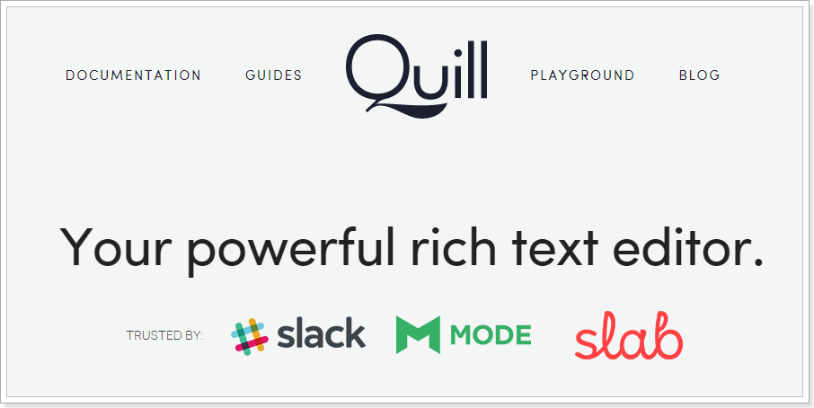
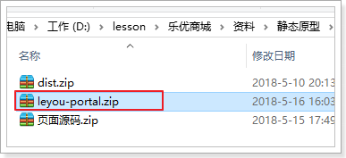

# 0.学习目标

- 独立实现商品新增后台
- 独立实现商品编辑后台
- 独立搭建前台系统页面

# 1.商品新增

## 1.1.页面预览

当我们点击新增商品按钮：

 

就会出现一个弹窗：


里面把商品的数据分为了4部分来填写：

- 基本信息：主要是一些简单的文本数据，包含了SPU和SpuDetail的部分数据，如
  - 商品分类：是SPU中的`cid1`，`cid2`，`cid3`属性
  - 品牌：是spu中的`brandId`属性
  - 标题：是spu中的`title`属性
  - 子标题：是spu中的`subTitle`属性
  - 售后服务：是SpuDetail中的`afterService`属性
  - 包装列表：是SpuDetail中的`packingList`属性
- 商品描述：是SpuDetail中的`description`属性，数据较多，所以单独放一个页面
- 规格参数：商品规格信息，对应SpuDetail中的`genericSpec`属性
- SKU属性：spu下的所有Sku信息

也就是说这个页面包含了商品相关的四张表中的数据：

- tb_spu
- tb_spu_detail
- tb_sku
- tb_stock

## 1.3.基本数据

我们先来看下基本数据：


### 1.3.1.商品分类

商品分类的级联选框我们之前在品牌查询已经做过，是要根据分类的pid查询分类，所以这里的级联选框已经实现完成：

刷新页面，可以看到请求已经发出：

 

 


 

需要注意的是，这里选中以后会显示3级分类，因为数据库中保存的就是商品的1~3级类目。

### 1.3.2.品牌选择

品牌也是一个下拉选框，不过其选项是不确定的，只有当用户选择了商品分类，才会把这个分类下的所有品牌展示出来。

所以页面编写了watch函数，监控商品分类的变化，每当商品分类值有变化，就会发起请求，查询品牌列表。刷新页面，当选中一个分类时，可以看到请求发起：


接下来，我们只要编写后台接口，根据商品分类id，查询对应品牌即可。

#### 后台接口

页面需要去后台查询品牌信息，我们自然需要提供：

> controller

```java
/**
     * 根据分类查询品牌
     * @param categoryId 商品分类id
     * @return 该分类下的品牌的集合
     */
@GetMapping("/of/category")
public ResponseEntity<List<BrandDTO>> queryByCategoryId(@RequestParam("id") Long categoryId) {
    return ResponseEntity.ok(this.brandService.queryByCategoryId(categoryId));
}
```

> service

```java
public List<BrandDTO> queryByCategoryId(Long categoryId) {
    List<Brand> list = brandMapper.queryByCategoryId(categoryId);
    // 判断是否为空
    if(CollectionUtils.isEmpty(list)){
        throw new LyException(ExceptionEnum.BRAND_NOT_FOUND);
    }
    return BeanHelper.copyWithCollection(list, BrandDTO.class);
}
```


> mapper

根据分类查询品牌有中间表，需要自己编写Sql：

```java
@Select("SELECT b.id, b.name, b.letter, b.image FROM tb_category_brand cb INNER JOIN tb_brand b ON b.id = cb.brand_id WHERE cb.category_id = #{cid}")
List<Brand> queryByCategoryId(@Param("cid") Long cid);
```


效果：

 

### 1.3.3.其它文本框

剩余的几个属性：标题、子标题等都是普通文本框，我们直接填写即可，没有需要特别注意的。


## 1.4.商品描述

商品描述信息比较复杂，而且图文并茂，甚至包括视频。

这样的内容，一般都会使用富文本编辑器。

### 1.4.1.什么是富文本编辑器

百度百科：


通俗来说：富文本，就是比较丰富的文本编辑器。普通的框只能输入文字，而富文本还能给文字加颜色样式等。

富文本编辑器有很多，例如：KindEditor、Ueditor。但并不原生支持vue

但是我们今天要说的，是一款支持Vue的富文本编辑器：`vue-quill-editor`


### 1.4.2.Vue-Quill-Editor

GitHub的主页：https://github.com/surmon-china/vue-quill-editor

Vue-Quill-Editor是一个基于Quill的富文本编辑器：[Quill的官网](https://quilljs.com/)




### 1.4.3.使用指南

使用非常简单：

第一步：安装，使用npm命令：

```
npm install vue-quill-editor --save

```

第二步：加载，在js中引入：

全局使用：

```js
import Vue from 'vue'
import VueQuillEditor from 'vue-quill-editor'

const options = {}; /* { default global options } */

Vue.use(VueQuillEditor, options); // options可选
```


局部使用：

```js
import 'quill/dist/quill.core.css'
import 'quill/dist/quill.snow.css'
import 'quill/dist/quill.bubble.css'

import {quillEditor} from 'vue-quill-editor'

var vm = new Vue({
    components:{
        quillEditor
    }
})
```


第三步：页面引用：

```html
<quill-editor v-model="goods.spuDetail.description" :options="editorOption"/>
```


### 1.4.4.自定义的富文本编辑器

不过这个组件有个小问题，就是图片上传的无法直接上传到后台，因此我们对其进行了封装，支持了图片的上传。

 

使用也非常简单：

```html
<v-stepper-content step="2">
    <v-editor v-model="goods.spuDetail.description" url="/upload/signature" needSignature/>
</v-stepper-content>
```

- url：是图片上传的路径或者上传阿里OSS时的签名路径，这里输入的是签名路径
- v-model：双向绑定，将富文本编辑器的内容绑定到goods.spuDetail.description


### 1.4.5.效果：


## 1.5.商品规格参数

规格参数的查询我们之前也已经编写过接口，因为商品规格参数也是与商品分类绑定，所以需要在商品分类变化后去查询，我们也是通过watch监控来实现：

 

可以看到这里是根据商品分类id查询规格参数：SpecParam。我们之前写过一个根据gid（分组id）来查询规格参数的接口，我们可以对其进行扩展：

> ### 改造查询规格参数接口
>

我们在原来的根据 gid（规格组id)查询规格参数的接口上，添加一个参数：cid，即商品分类id。

等一下， 考虑到以后可能还会根据是否搜索(searching)字段来过滤，我们多添加一个过滤条件：

```java
   /**
     * 查询规格参数
     * @param gid 组id
     * @param cid 分类id
     * @param searching 是否用于搜索
     * @return 规格组集合
     */
    @GetMapping("/params")
    public ResponseEntity<List<SpecParamDTO>> querySpecParams(
            @RequestParam(value = "gid", required = false) Long gid,
            @RequestParam(value = "cid", required = false) Long cid,
            @RequestParam(value = "searching", required = false) Boolean searching
    ) {
        return ResponseEntity.ok(specService.querySpecParams(gid, cid, searching));
    }
```

改造service：

```java
public List<SpecParamDTO> queryParams(Long gid, Long cid, Boolean searching) {
    // gid和cid必选一个
    if (gid == null && cid == null) {
        throw new LyException(ExceptionEnum.INVALID_PARAM_ERROR);
    }
    // 查询条件
    SpecParam record = new SpecParam();
    record.setGroupId(gid);
    record.setCid(cid);
    record.setSearching(searching);
    // 查询
    List<SpecParam> list = paramMapper.select(record);
    if (CollectionUtils.isEmpty(list)) {
        throw new LyException(ExceptionEnum.SPEC_NOT_FOUND);
    }
    return BeanHelper.copyWithCollection(list, SpecParamDTO.class);
}
```

如果param中有属性为null，则不会吧属性作为查询条件，因此该方法具备通用性，即可根据gid查询，也可根据cid查询。

测试：

 


刷新页面测试：

 


## 1.6.SKU信息

Sku属性是SPU下的每个商品的不同特征，如图：


当我们填写一些属性后，会在页面下方生成一个sku表格，大家可以计算下会生成多少个不同属性的Sku呢？

当你选择了上图中的这些选项时：

- 颜色共2种：夜空黑，绚丽红
- 内存共2种：4GB，6GB
- 机身存储1种：64GB

此时会产生多少种SKU呢？ 应该是 2 * 2 * 1 = 4种，这其实就是在求笛卡尔积。

我们会在页面下方生成一个sku的表格：


这个表格中就包含了以上颜色内存的所有可能组合，剩下的价格等信息就需要用户自己来完成了。

注意，页面中的sku的图片上传，默认是上传到本地，这样可能上传后就无法找到图片，需要修改nginx：

如果是上传到本地，则需要在nginx中配置图片地址的判断：

```nginx
server {
	listen       80;
	server_name  image.leyou.com;
	location /images {
		root	html;
	}
	location / {
		root 	html;
		if (!-f $request_filename) {
            proxy_pass http://heima64.oss-cn-shanghai.aliyuncs.com;
            break;
        }
	}
}
```

- `if (!-f $request_filename)`：判断是否在本地能找到图片，找不到才反向代理到阿里去找图片

## 

**如果不想修改nginx**，也可以修改成上传到阿里，这样nginx就无需修改了：


大概是在119行。

## 1.7.页面表单提交

在sku列表的下方，有一个提交按钮：


点击提交，查看控制台提交的数据格式：


- 整体是一个json格式数据，包含Spu表所有数据：
  - brandId：品牌id

  - cid1、cid2、cid3：商品分类id

  - subTitle：副标题

  - name：商品名称

  - spuDetail：是一个json对象，代表商品详情表数据

    

    - afterService：售后服务
    - description：商品描述
    - packingList：包装列表
    - specialSpec：sku规格属性模板
    - genericSpec：通用规格参数

  - skus：spu下的所有sku数组，元素是每个sku对象：

    

    - title：标题
    - images：图片
    - price：价格
    - stock：库存
    - ownSpec：特有规格参数
    - indexes：特有规格参数的下标

## 1.8.后台实现

### 1.8.1.实体类

> Sku

```java
package com.leyou.item.entity;

import lombok.Data;
import tk.mybatis.mapper.annotation.KeySql;

import javax.persistence.Id;
import javax.persistence.Table;
import java.util.Date;

@Data
@Table(name = "tb_sku")
public class Sku {
    @Id
    @KeySql(useGeneratedKeys=true)
    private Long id;
    private Long spuId;
    private String title;
    private String images;
    private Long price;
    private Integer stock;
    private String ownSpec;// 商品特殊规格的键值对
    private String indexes;// 商品特殊规格的下标
    private Boolean enable;// 是否有效，逻辑删除用
    private Date createTime;// 创建时间
    private Date updateTime;// 最后修改时间
}
```


然后是对应的DTO：

```java
@Data
public class SkuDTO {
    private Long id;
    private Long spuId;
    private String title;
    private String images;
    private Long price;
    private String ownSpec;// 商品特殊规格的键值对
    private String indexes;// 商品特殊规格的下标
    private Boolean enable;// 是否有效，逻辑删除用
    private Integer stock; // 库存
}
```


### 1.8.2.请求分析

四个问题：

- 请求方式：POST
- 请求路径：/goods
- 请求参数：SpuDTO的json格式的对象，但是要包含spuDetail和Sku集合。我们需要拓展SpuDTO，来接收其中的数据

- 返回类型：无

首先要定义一个SpuDetailDTO：

```java
/**
 * @author 黑马程序员
 */
@Data
public class SpuDetailDTO {
    private Long spuId;// 对应的SPU的id
    private String description;// 商品描述
    private String specialSpec;// 商品特殊规格的名称及可选值模板
    private String genericSpec;// 商品的全局规格属性
    private String packingList;// 包装清单
    private String afterService;// 售后服务
}
```

然后修改SpuDTO，在里面包含SpuDetail和Sku的集合

```java
package com.leyou.item.dto;

import lombok.Data;

import java.util.Arrays;
import java.util.Date;
import java.util.List;

/**
 * @author 黑马程序员
 */
@Data
public class SpuDTO {
	// 之前属性略 ...
    /**
     * 商品详情
     */
    private SpuDetailDTO spuDetail;
    /**
     * spu下的sku的集合
     */
    private List<SkuDTO> skus;
}

```

接下来就可以编写业务了

### 1.8.3.业务代码

> controller

代码：

```java
/**
     * 新增商品
     * @param spuDTO 页面提交商品信息
     * @return
     */
@PostMapping
public ResponseEntity<Void> saveGoods(@RequestBody SpuDTO spuDTO) {
    this.goodsService.save(spuDTO);
    return new ResponseEntity<>(HttpStatus.CREATED);
}
```

注意：通过@RequestBody注解来接收Json请求

> Service

这里的逻辑比较复杂，我们除了要对SPU新增以外，还要对SpuDetail、Sku、Stock进行保存

```java
@Transactional
public void save(SpuDTO spuDTO) {
    // 从dto中取出spu信息
    Spu spu = BeanHelper.copyProperties(spuDTO, Spu.class);
    // 保存spu
    spu.setId(null);
    spu.setCreateTime(null);
    spu.setSaleable(null);
    int count = spuMapper.insertSelective(spu);
    if (count != 1) {
        throw new LyException(ExceptionEnum.INSERT_OPERATION_FAIL);
    }

    // 初始化SpuDetail信息
    SpuDetailDTO spuDetailDTO = spuDTO.getSpuDetail();
    SpuDetail spuDetail = BeanHelper.copyProperties(spuDetailDTO, SpuDetail.class);
    spuDetail.setSpuId(spu.getId());
    // 保存spu详情
    count = detailMapper.insertSelective(spuDetail);
    if (count != 1) {
        throw new LyException(ExceptionEnum.INSERT_OPERATION_FAIL);
    }

    // 准备sku数据
    List<SkuDTO> skuDTOList = spuDTO.getSkus();
    List<Sku> skuList = new ArrayList<>();
    for (SkuDTO skuDTO : skuDTOList) {
        skuDTO.setSpuId(spu.getId());
        skuList.add(BeanHelper.copyProperties(skuDTO, Sku.class));
    }
    // 保存sku
    count = skuMapper.insertList(skuList);
    if (count != skuList.size()) {
        throw new LyException(ExceptionEnum.INSERT_OPERATION_FAIL);
    }
}
```

> mapper
>

这里因为要批量新增，因此需要再多继承一个Mapper：InsertListMapper

```java
package com.leyou.item.mapper;

import com.leyou.common.mapper.BaseMapper;
import com.leyou.item.entity.Sku;
import tk.mybatis.mapper.common.special.InsertListMapper;

/**
 * @author 黑马程序员
 */
public interface SkuMapper extends BaseMapper<Sku>, InsertListMapper<Sku> {
}
```

注意：可能有多个InsertListMapper，看清楚我导入的包。


# 2.商品修改

## 2.1.商品上下架

在商品详情页，每一个商品后面，都会有一个编辑按钮：

 

点击这个按钮，并没有打开商品编辑窗口，而是弹出了一个提示窗口：


已经上架的商品用户可能正在购买，所以不能修改。必须要先下架才可以。

### 2.1.1.页面请求

此时打开控制台，可以看到请求已经发出了：


请求方式：PUT

请求路径：/spu/saleable

参数有两个 ：

- id：应该是spu的id
- saleable：布尔值，代表上架或下架

返回结果：应该是无


### 2.1.2.后台实现

接下来我们在服务端接收请求，并且修改spu的saleable属性。

需要注意的是，我们在修改spu属性的同时，还需要修改sku的enable属性，因为spu下架，sku也要跟着进行下架

controller：

```java
/**
     * 修改商品上下架
     * @param id 商品spu的id
     * @param saleable true：上架；false：下架
     * @return
     */
@PutMapping("spu/saleable")
public ResponseEntity<Void> updateSpuSaleable(@RequestParam("id") Long id, @RequestParam("saleable") Boolean saleable) {
    goodsService.updateSaleable(id, saleable);
    return ResponseEntity.status(HttpStatus.NO_CONTENT).build();
}
```


service：

```java
@Transactional
    public void updateSaleable(Long id, Boolean saleable) {
        // 1.更新SPU
        Spu spu = new Spu();
        spu.setId(id);
        spu.setSaleable(saleable);
        int count = spuMapper.updateByPrimaryKeySelective(spu);
        if (count != 1) {
            throw new LyException(ExceptionEnum.UPDATE_OPERATION_FAIL);
        }
        // 2.更新sku
        // 2.1.准备要更新的数据
        Sku sku = new Sku();
        sku.setEnable(saleable);
        // 2.2.准备更新的匹配条件
        Example example = new Example(Sku.class);
        example.createCriteria().andEqualTo("spuId", id);
        count = skuMapper.updateByExampleSelective(sku, example);

        int size = skuMapper.selectCountByExample(example);
        if (count != size) {
            throw new LyException(ExceptionEnum.UPDATE_OPERATION_FAIL);
        }
    }

```


## 2.2.数据回显

### 2.2.1.编辑按钮点击事件

点击下架商品后，再次点击修改，发现这次没有弹出警告，但是编辑窗口也没有弹出，怎么回事呢？

打开控制台，发现发起了一次请求：


编辑是需要数据回显的，而表格数据中只有spu信息，没有spuDetail和sku信息，需要去服务端查询。

因此，接下来我们就编写后台接口，提供查询spuDetail和sku接口。

### 2.2.2.查询SpuDetail接口

> controller

需要分析的内容：

- 请求方式：GET
- 请求路径：/spu/detail
- 请求参数：id，应该是spu的id
- 返回结果：SpuDetailDTO对象


```java
/**
     * 根据spuID查询spuDetail
     * @param id spuID
     * @return SpuDetail
     */
@GetMapping("/spu/detail")
public ResponseEntity<SpuDetailDTO> querySpuDetailById(@RequestParam("id") Long id) {
    return ResponseEntity.ok(goodsService.querySpuDetailById(id));
}
```

> service

```java
public SpuDetailDTO querySpuDetailById(Long id) {
    SpuDetail spuDetail = detailMapper.selectByPrimaryKey(id);
    if (spuDetail == null) {
        throw new LyException(ExceptionEnum.GOODS_NOT_FOUND);
    }
    return BeanHelper.copyProperties(spuDetail, SpuDetailDTO.class);
}
```

测试：


### 2.2.3.查询sku

再次点击修改， 发现又发出了一次请求，这次应该是查询sku：


> 分析

- 请求方式：Get
- 请求路径：/sku/of/spu
- 请求参数：id，应该是spu的id
- 返回结果：sku的集合

> controller

```java
/**
     * 根据spuID查询sku
     * @param id spuID
     * @return sku的集合
     */
@GetMapping("sku/of/spu")
public ResponseEntity<List<SkuDTO>> querySkuBySpuId(@RequestParam("id") Long id) {
    return ResponseEntity.ok(this.goodsService.querySkuListBySpuId(id));
}
```


> service

需要注意的是，为了页面回显方便，我们一并把sku的库存stock也查询出来

```java
public List<SkuDTO> querySkuListBySpuId(Long id) {
    Sku s = new Sku();
    s.setSpuId(id);
    List<Sku> list = skuMapper.select(s);
    if (CollectionUtils.isEmpty(list)) {
        throw new LyException(ExceptionEnum.GOODS_NOT_FOUND);
    }
    return BeanHelper.copyWithCollection(list, SkuDTO.class);
}
```

> 测试：


### 2.2.4.页面回显

随便点击一个编辑按钮，发现数据回显完成：


 

## 2.3.请求分析

这里的保存按钮与新增其实是同一个，因此提交的逻辑也是一样的，这里不再赘述。

随便修改点数据，然后点击保存，可以看到浏览器已经发出请求：


区别在于，这次的请求中带上了id信息，因为需要根据id来修改数据

包括spuDetail也是一样：


但是再来看sku：


发现sku中并没有带上sku的id信息，为什么呢？如果没有id我们又该怎样修改呢？

这是因为sku的规格参数修改或删减，可能会导致新增很多sku或者以前的sku直接消失，无法去做修改操作。因此建议的业务逻辑是先对sku进行删除，然后再进行新增。


## 2.4.后台实现

接下来，我们编写后台，实现修改商品接口。

### 2.4.1.Controller

- 请求方式：PUT
- 请求路径：/goods
- 请求参数：SpuDTO对象
- 返回结果：无

```java
/**
     * 修改商品
     * @param spu
     * @return
     */
@PutMapping
public ResponseEntity<Void> updateGoods(@RequestBody SpuDTO spu) {
    goodsService.updateGoods(spu);
    return ResponseEntity.status(HttpStatus.NO_CONTENT).build();
}
```


### 2.4.2.Service

spu数据可以修改，但是SKU数据无法修改，因为有可能之前存在的SKU现在已经不存在了，或者以前的sku属性都不存在了。比如以前内存有4G，现在没了。

因此这里直接删除以前的SKU，然后新增即可。

代码：

```java
@Transactional
public void updateGoods(SpuDTO spuDTO) {
    Long spuId = spuDTO.getId();
    if (spuId == null) {
        // 请求参数有误
        throw new LyException(ExceptionEnum.INVALID_PARAM_ERROR);
    }
    // 1.删除sku
    Sku sku = new Sku();
    sku.setSpuId(spuId);
    // 查询数量
    int size = skuMapper.selectCount(sku);
    if(size > 0) {
        // 删除
        int count = skuMapper.delete(sku);
        if(count != size){
            throw new LyException(ExceptionEnum.UPDATE_OPERATION_FAIL);
        }
    }

    // 2.更新spu
    Spu spu = BeanHelper.copyProperties(spuDTO, Spu.class);
    spu.setSaleable(null);
    spu.setCreateTime(null);
    spu.setUpdateTime(null);
    int count = spuMapper.updateByPrimaryKeySelective(spu);
    if (count != 1) {
        throw new LyException(ExceptionEnum.UPDATE_OPERATION_FAIL);
    }

    // 3.更新spuDetail
    SpuDetail spuDetail = BeanHelper.copyProperties(spuDTO.getSpuDetail(), SpuDetail.class);
    spuDetail.setSpuId(spuId);
    spuDetail.setCreateTime(null);
    spuDetail.setUpdateTime(null);
    count = detailMapper.updateByPrimaryKeySelective(spuDetail);
    if (count != 1) {
        throw new LyException(ExceptionEnum.UPDATE_OPERATION_FAIL);
    }

    // 4.新增sku
    List<SkuDTO> dtoList = spuDTO.getSkus();
    // 处理dto
    List<Sku> skuList = dtoList.stream().map(dto -> {
        dto.setEnable(false);
        // 添加spu的id
        dto.setSpuId(spuId);
        return BeanHelper.copyProperties(dto, Sku.class);
    }).collect(Collectors.toList());
    count = skuMapper.insertList(skuList);
    if (count != skuList.size()) {
        throw new LyException(ExceptionEnum.UPDATE_OPERATION_FAIL);
    }
}
```


### 2.4.3.mapper

与以前一样。


# 3.搭建前台系统

后台系统的内容暂时告一段落，有了商品，接下来我们就要在页面展示商品，给用户提供浏览和购买的入口，那就是我们的门户系统。

门户系统面向的是用户，安全性很重要，而且搜索引擎对于单页应用并不友好。因此我们的门户系统不再采用与后台系统类似的SPA（单页应用）。

依然是前后端分离，不过前端的页面会使用独立的html，在每个页面中使用vue来做页面渲染。


## 3.1.静态资源

webpack打包多页应用配置比较繁琐，项目结构也相对复杂。这里为了简化开发（毕竟我们不是专业的前端人员），我们不在使用webpack，而是直接编写原生的静态HTML。

### 3.1.1.导入静态资源

将课前资料中的leyou-portal解压，并把结果赋值到工作空间的目录

 

解压缩：

 

然后通过idea打开，可以看到项目结构：

 

## 3.2.live-server

没有webpack，我们就无法使用webpack-dev-server运行这个项目，实现热部署。

所以，这里我们使用另外一种热部署方式：live-server，

### 3.2.1.简介

地址；https://www.npmjs.com/package/live-server

 

这是一款带有热加载功能的小型开发服务器。用它来展示你的HTML / JavaScript / CSS，但不能用于部署最终的网站。 

### 3.2.2.安装和运行参数

安装，使用npm命令即可，这里建议全局安装，以后任意位置可用

```
npm install -g live-server
```


运行时，直接输入命令：

```
live-server
```

另外，你可以在运行命令后，跟上一些参数以配置：

- `--port=NUMBER` - 选择要使用的端口，默认值：PORT env var或8080
- `--host=ADDRESS` - 选择要绑定的主机地址，默认值：IP env var或0.0.0.0（“任意地址”）
- `--no-browser` - 禁止自动Web浏览器启动
- `--browser=BROWSER` - 指定使用浏览器而不是系统默认值
- `--quiet | -q` - 禁止记录
- `--verbose | -V` - 更多日志记录（记录所有请求，显示所有侦听的IPv4接口等）
- `--open=PATH` - 启动浏览器到PATH而不是服务器root
- `--watch=PATH` - 用逗号分隔的路径来专门监视变化（默认值：观看所有内容）
- `--ignore=PATH`- 要忽略的逗号分隔的路径字符串（[anymatch](https://github.com/es128/anymatch) -compatible definition）
- `--ignorePattern=RGXP`-文件的正则表达式忽略（即`.*\.jade`）（**不推荐使用**赞成`--ignore`）
- `--middleware=PATH` - 导出要添加的中间件功能的.js文件的路径; 可以是没有路径的名称，也可以是引用`middleware`文件夹中捆绑的中间件的扩展名
- `--entry-file=PATH` - 提供此文件（服务器根目录）代替丢失的文件（对单页应用程序有用）
- `--mount=ROUTE:PATH` - 在定义的路线下提供路径内容（可能有多个定义）
- `--spa` - 将请求从/ abc转换为/＃/ abc（方便单页应用）
- `--wait=MILLISECONDS` - （默认100ms）等待所有更改，然后重新加载
- `--htpasswd=PATH` - 启用期待位于PATH的htpasswd文件的http-auth
- `--cors` - 为任何来源启用CORS（反映请求源，支持凭证的请求）
- `--https=PATH` - 到HTTPS配置模块的路径
- `--proxy=ROUTE:URL` - 代理ROUTE到URL的所有请求
- `--help | -h` - 显示简洁的使用提示并退出
- `--version | -v` - 显示版本并退出

### 3.2.3.测试

我们进入leyou-portal目录，输入命令：

```
live-server --port=9002
```

 


## 3.4.脚本启动

初始化npm

```
npm init -y
```

安装vue

```
npm install vue --save
```

配置启动脚本：

进入package.json文件，在script中添加启动脚本：

```json
{
  "name": "leyou-portal",
  "version": "1.0.0",
  "description": "",
  "main": "index.js",
  "scripts": {
    "test": "echo \"Error: no test specified\" && exit 1",
    "serve": "live-server --port=9002"
  },
  "keywords": [],
  "author": "",
  "license": "ISC",
  "dependencies": {
    "vue": "^2.6.10"
  }
}
```

以后可以用 npm run serve启动

## 3.3.域名访问

现在我们访问只能通过：http://127.0.0.1:9002

我们希望用域名访问：http://www.leyou.com

第一步，修改hosts文件，添加一行配置：

```
127.0.0.1 www.leyou.com
```

第二步，修改nginx配置，将www.leyou.com反向代理到127.0.0.1:9002

```nginx
server {
    listen       80;
    server_name  www.leyou.com;

    proxy_set_header X-Forwarded-Host $host;
    proxy_set_header X-Forwarded-Server $host;
    proxy_set_header X-Forwarded-For $proxy_add_x_forwarded_for;

    location / {
        proxy_pass http://127.0.0.1:9002;
        proxy_connect_timeout 600;
        proxy_read_timeout 600;
    }
}
```

重新加载nginx配置：`nginx.exe -s reload`


## 3.4.common.js

为了方便后续的开发，我们在前台系统中定义了一些工具，放在了common.js中：

 


部分代码截图：

 

- 首先对axios进行了一些全局配置，请求超时时间，请求的基础路径，是否允许跨域操作cookie等
- 定义了对象 ly ，也叫leyou，包含了下面的属性：
  - getUrlParam(key)：获取url路径中的参数
  - http：axios对象的别名。以后发起ajax请求，可以用ly.http.get()
  - store：localstorage便捷操作，后面用到再详细说明
  - formatPrice：格式化价格，如果传入的是字符串，则扩大100被并转为数字，如果传入是数字，则缩小100倍并转为字符串
  - formatDate(val, pattern)：对日期对象val按照指定的pattern模板进行格式化
  - stringify：将对象转为参数字符串
  - parse：将参数字符串变为js对象

