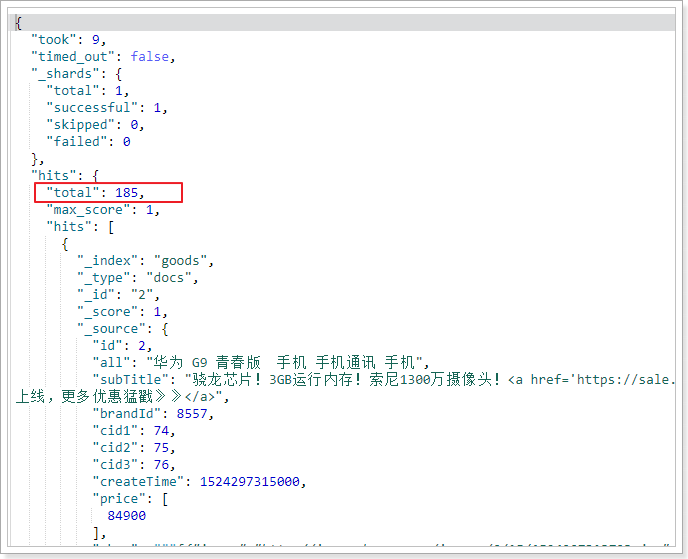
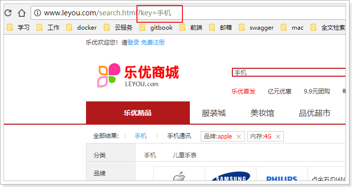
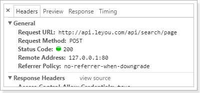
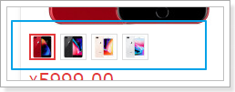
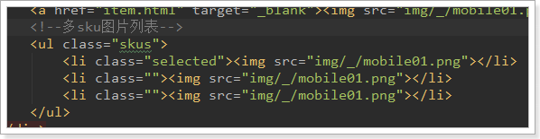
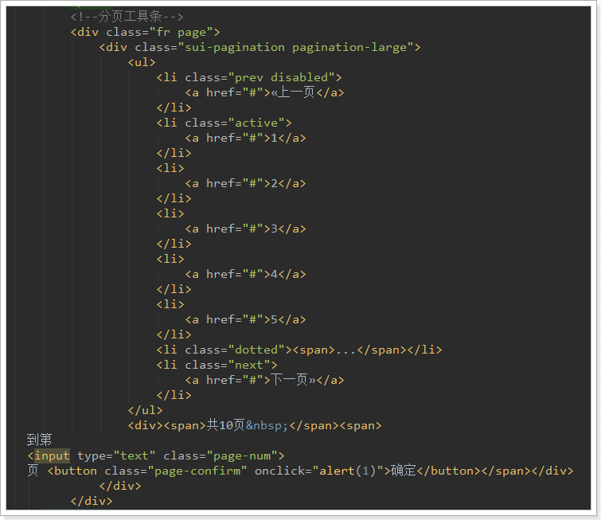
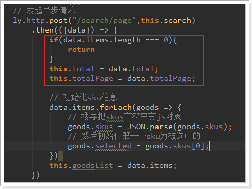
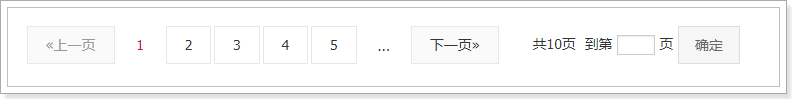

# 0.学习目标

- 独立编写数据导入功能
- 独立实现基本搜索
- 独立实现页面分页
- 独立实现结果排序


# 1.索引库数据导入

在网站的首页中，首先看到的就是一个搜索输入框：


而用户的购物习惯也是这样，都会通过搜索来寻找自己想要购买的商品。

之前我们学习了Elasticsearch的基本应用。今天就学以致用，搭建搜索微服务，利用elasticsearch实现搜索功能。

## 1.1.创建搜索服务

创建module：


 

Pom文件：

```xml
<?xml version="1.0" encoding="UTF-8"?>
<project xmlns="http://maven.apache.org/POM/4.0.0"
         xmlns:xsi="http://www.w3.org/2001/XMLSchema-instance"
         xsi:schemaLocation="http://maven.apache.org/POM/4.0.0 http://maven.apache.org/xsd/maven-4.0.0.xsd">
    <parent>
        <artifactId>leyou</artifactId>
        <groupId>com.leyou</groupId>
        <version>1.0.0-SNAPSHOT</version>
    </parent>
    <modelVersion>4.0.0</modelVersion>

    <artifactId>ly-search</artifactId>

    <dependencies>
        <dependency>
            <groupId>org.springframework.boot</groupId>
            <artifactId>spring-boot-starter-web</artifactId>
        </dependency>
        <dependency>
            <groupId>org.springframework.cloud</groupId>
            <artifactId>spring-cloud-starter-netflix-eureka-client</artifactId>
        </dependency>
        <dependency>
            <groupId>org.springframework.boot</groupId>
            <artifactId>spring-boot-starter-data-elasticsearch</artifactId>
        </dependency>
        <dependency>
            <groupId>org.springframework.boot</groupId>
            <artifactId>spring-boot-starter-test</artifactId>
        </dependency>
        <dependency>
            <groupId>com.leyou</groupId>
            <artifactId>ly-common</artifactId>
            <version>1.0.0-SNAPSHOT</version>
        </dependency>
        <dependency>
            <groupId>com.leyou</groupId>
            <artifactId>ly-item-pojo</artifactId>
            <version>1.0.0-SNAPSHOT</version>
        </dependency>
        <dependency>
            <groupId>org.springframework.cloud</groupId>
            <artifactId>spring-cloud-starter-openfeign</artifactId>
        </dependency>
    </dependencies>
    <build>
        <plugins>
            <plugin>
                <groupId>org.springframework.boot</groupId>
                <artifactId>spring-boot-maven-plugin</artifactId>
            </plugin>
        </plugins>
    </build>
</project>
```

需要注意的是，这里引入的以来中包含商品微服务的`ly-item-pojo`依赖，另外还有`openfeign`依赖，因为要从商品微服务中查询商品信息，并导入到索引库。


application.yml：

```yaml
server:
  port: 8083
spring:
  application:
    name: search-service
  data:
    elasticsearch:
      cluster-name: elasticsearch
      cluster-nodes: 192.168.58.101:9300
eureka:
  client:
    service-url:
      defaultZone: http://127.0.0.1:10086/eureka
    registry-fetch-interval-seconds: 5
  instance:
    prefer-ip-address: true
    ip-address: 127.0.0.1
```

启动类：

```java
@SpringBootApplication
@EnableDiscoveryClient
@EnableFeignClients
public class LySearchApplication {

    public static void main(String[] args) {
        SpringApplication.run(LySearchApplication.class, args);
    }
}

```

在网关`ly-gateway`中添加路由：

```yaml
zuul:
  prefix: /api # 添加路由前缀
  routes:
    search-service: /search/**
```


## 1.2.索引库数据格式分析

接下来，我们需要商品数据导入索引库，便于用户搜索。

那么问题来了，我们有SPU和SKU，到底把什么数据保存到索引库？

### 1.2.1.以结果为导向

大家来看下搜索结果页：


可以看到，每一个搜索结果都有至少1个商品，当我们选择大图下方的小图，商品会跟着变化。

因此，**搜索的结果是SPU，即多个SKU的集合**。

既然搜索的结果是SPU，那么我们索引库中存储的应该也是SPU，但是却需要包含SKU的信息。


### 1.2.2.需要什么数据

存入索引库的数据分成两种：

- 一种是用来页面渲染的数据，展示给用户看。
- 一种是用来搜索过滤的数据，方便用户搜索。

先来看看页面中直观看到有什么数据，这些数据就是用来渲染的数据：

  


直观能看到的：图片、价格、标题 属于SKU数据（用来展示的数据），另外还有副标题信息。

暗藏的数据：spu的id，sku的id

索引库数据的json示例：

```json
{
    "id": 1,# spu的id
    skus:[
    	{"id":2, "title":"xx", "price":299900, "image":""},
    	{"id":3, "title":"xxx", "price":399900, "image":""},
    ],
	"subTitle":""
}
```


再来看看页面中的过滤条件：


这些过滤条件也都需要存储到索引库中，包括：商品分类、品牌、可用来搜索的规格参数

另外还有需要排序的字段：

 

包括：商品创建时间、商品价格等

综上所述，我们需要的数据格式有：

spu的Id、spu下的所有sku（包括SkuId、图片、价格、标题）、商品分类id、品牌id、商品的创建时间、可搜索的规格参数：

```json
{
    "id": 1,# spu的id
    "skus":[
    	{"id":2, "title":"xx", "price":299900, "image":""},
    	{"id":3, "title":"xxx", "price":399900, "image":""},
    ],
	"subTitle":"",
	"categoryId":11,
	"brandId":122,
	"createTime": 12121,
	"price": [299900,399900],
	"specs":{}
}
```


### 1.2.3.最终的数据结构

我们创建一个类，封装要保存到索引库的数据，并设置映射属性：

```java
package com.leyou.search.pojo;

import lombok.Data;
import org.springframework.data.annotation.Id;
import org.springframework.data.elasticsearch.annotations.Document;
import org.springframework.data.elasticsearch.annotations.Field;
import org.springframework.data.elasticsearch.annotations.FieldType;

import java.util.Map;
import java.util.Set;

/**
 * 一个SPU对应一个Goods
 */
@Data
@Document(indexName = "goods", type = "docs", shards = 1, replicas = 1)
public class Goods {
    @Id
    @Field(type = FieldType.Keyword)
    private Long id; // spuId
    @Field(type = FieldType.Keyword, index = false)
    private String subTitle;// 卖点
    @Field(type = FieldType.Keyword, index = false)
    private String skus;// sku信息的json结构

    @Field(type = FieldType.Text, analyzer = "ik_max_word")
    private String all; // 所有需要被搜索的信息，包含标题，分类，甚至品牌
    private Long brandId;// 品牌id
    private Long categoryId;// 商品3级分类id
    private Long createTime;// spu创建时间
    private Set<Long> price;// 价格
    private Map<String, Object> specs;// 可搜索的规格参数，key是参数名，值是参数值
}
```

一些特殊字段解释：

- all：用来进行全文检索的字段，里面包含标题、商品分类、品牌、规格等信息

- price：价格数组，是所有sku的价格集合。方便根据价格进行筛选过滤

- skus：用于页面展示的sku信息，因为不参与搜索，所以转为json存储。然后设置不索引，不搜索。包含skuId、image、price、title字段

- specs：所有规格参数的集合。key是参数名，值是参数值。

  例如：我们在specs中存储 内存：4G,6G，颜色为红色，转为json就是：

  ```json
  {
      "specs":{
          "内存":[4G,6G],
          "颜色":"红色"
      }
  }
  ```

  当存储到索引库时，elasticsearch会处理为两个字段：

  - specs.内存 ： [4G,6G]
  - specs.颜色：红色


## 1.3.商品微服务提供接口

索引库中的数据来自于数据库，我们不能直接去查询商品的数据库，因为真实开发中，每个微服务都是相互独立的，包括数据库也是一样。所以我们只能调用商品微服务提供的接口服务。

先思考我们需要的数据：

- SPU信息

- SKU信息

- SPU的详情

- 商品分类（拼接all字段）

- 规格参数key

- 品牌


再思考我们需要哪些服务：

- 第一：分批查询spu的服务，已经写过。
- 第二：根据spuId查询sku的服务，已经写过
- 第三：根据spuId查询SpuDetail的服务，已经写过
- 第四：根据商品分类id，查询商品分类，没写过。需要一个根据多级分类id查询分类的接口
- 第五：查询分类下可以用来搜索的规格参数：写过
- 第六：根据id查询品牌，没写过


因此我们需要额外提供一个查询商品分类名称的接口以及品牌查询接口。

### 1.3.1.商品分类接口

controller：

```java
/**
     * 根据id的集合查询商品分类
     * @param idList 商品分类的id集合
     * @return 分类集合
     */
@GetMapping("list")
public ResponseEntity<List<CategoryDTO>> queryByIds(@RequestParam("ids") List<Long> idList){
    return ResponseEntity.ok(categoryService.queryCategoryByIds(idList));
}
```

service：

```java
public List<CategoryDTO> queryCategoryByIds(List<Long> ids){
    List<Category> list = categoryMapper.selectByIdList(ids);
    if (CollectionUtils.isEmpty(list)) {
        // 没找到，返回404
        throw new LyException(ExceptionEnum.CATEGORY_NOT_FOUND);
    }
    return BeanHelper.copyWithCollection(list, CategoryDTO.class);
}
```

测试：

 


### 1.3.2.品牌查询接口：

```java
/**
     * 根据id查询品牌
     * @param id
     * @return
     */
@GetMapping("{id}")
public ResponseEntity<BrandDTO> queryById(@PathVariable("id") Long id){
    BrandDTO brand = brandService.queryById(id);
    return ResponseEntity.ok(brand);
}
```


## 1.4.FeignClient最佳实践

### 1.4.1.传统feign用法：

现在，我们要在搜索微服务调用商品微服务的接口。

第一步要引入商品微服务依赖：`ly-item-pojo`。

```xml
<!--商品微服务-->
<dependency>
    <groupId>com.leyou.service</groupId>
    <artifactId>ly-item-pojo</artifactId>
    <version>1.0.0-SNAPSHOT</version>
</dependency>
```

第二步，编写FeignClient

```java
@FeignClient(value = "item-service")
public interface ItemClient {

    /**
     * 分页查询商品
     * @param page
     * @param rows
     * @param saleable
     * @param key
     * @return
     */
    @GetMapping("/spu/page")
    PageResult<SpuDTO> querySpuByPage(
            @RequestParam(value = "page", defaultValue = "1") Integer page,
            @RequestParam(value = "rows", defaultValue = "5") Integer rows,
            @RequestParam(value = "saleable", defaultValue = "true") Boolean saleable,
            @RequestParam(value = "key", required = false) String key);

	/**
     * 根据spuID查询spuDetail
     * @param id spuID
     * @return SpuDetail
     */
    @GetMapping("/spu/detail")
    SpuDetailDTO querySpuDetailById(@RequestParam("id") Long id);

    /**
     * 根据spu的id查询sku
     * @param id
     * @return
     */
    @GetMapping("sku/of/spu")
    List<SkuDTO> querySkuBySpuId(@RequestParam("id") Long id);
}
```

以上的这些代码直接从商品微服务中拷贝而来，几乎完全一致。大家觉得这样有没有问题？


而FeignClient代码遵循SpringMVC的风格，因此与商品微服务的Controller完全一致。这样就存在一定的问题：

- 代码冗余。尽管不用写实现，只是写接口，但服务调用方要写与服务controller一致的代码，有几个消费者就要写几次。
- 增加开发成本。调用方还得清楚知道接口的路径，才能编写正确的FeignClient。


### 1.4.2.最佳实践：

因此，一种比较友好的实践是这样的：

- 我们的服务提供方不仅提供实体类，还要提供api接口声明
- 调用方不用自己编写接口方法声明，直接调用提供方给的Api接口即可，


第一步：创建新的`ly-item`的子module模块：`ly-item-interface`


 

第二步：在`ly-item-interface`中引用依赖，

在ly-item-interface中引入下面依赖：

```xml
<dependencies>
    <dependency>
        <groupId>com.leyou.service</groupId>
        <artifactId>ly-item-pojo</artifactId>
        <version>1.0.0-SNAPSHOT</version>
    </dependency>
    <dependency>
        <groupId>org.springframework</groupId>
        <artifactId>spring-web</artifactId>
    </dependency>
    <dependency>
        <groupId>org.springframework.cloud</groupId>
        <artifactId>spring-cloud-openfeign-core</artifactId>
    </dependency>
    <dependency>
        <groupId>com.leyou.common</groupId>
        <artifactId>ly-common</artifactId>
        <version>1.0.0-SNAPSHOT</version>
    </dependency>
</dependencies>
```


第三步：服务的提供方在`ly-item-interface`中提供Feign接口，并编写接口声明：

 

然后把所有需要对外提供的接口写到一个client中：ItemClient

```java
package com.leyou.item.client;

import com.leyou.common.vo.PageResult;
import com.leyou.item.dto.*;
import org.springframework.cloud.openfeign.FeignClient;
import org.springframework.web.bind.annotation.GetMapping;
import org.springframework.web.bind.annotation.PathVariable;
import org.springframework.web.bind.annotation.RequestParam;

import java.util.List;

/**
 * @author 黑马程序员
 */
@FeignClient("item-service")
public interface ItemClient {
    /**
     * 根据id查询品牌
     * @param id
     * @return
     */
    @GetMapping("/brand/{id}")
    BrandDTO queryBrandById(@PathVariable("id") Long id);

    /**
     * 根据id的集合查询商品分类
     * @param idList 商品分类的id集合
     * @return 分类集合
     */
    @GetMapping("/category/list")
    List<CategoryDTO> queryCategoryByIds(@RequestParam("ids") List<Long> idList);

    /**
     * 分页查询spu
     * @param page 当前页
     * @param rows 每页大小
     * @param saleable 上架商品或下降商品
     * @param key 关键字
     * @return 当前页商品数据
     */
    @GetMapping("/spu/page")
    PageResult<SpuDTO> querySpuByPage(
            @RequestParam(value = "page", defaultValue = "1") Integer page,
            @RequestParam(value = "rows", defaultValue = "5") Integer rows,
            @RequestParam(value = "saleable", required = false) Boolean saleable,
            @RequestParam(value = "key", required = false) String key);

    /**
     * 根据spuID查询spuDetail
     * @param id spuID
     * @return SpuDetail
     */
    @GetMapping("/spu/detail")
    SpuDetailDTO querySpuDetailById(@RequestParam("id") Long id);

    /**
     * 根据spuID查询sku
     * @param id spuID
     * @return sku的集合
     */
    @GetMapping("sku/of/spu")
    List<SkuDTO> querySkuBySpuId(@RequestParam("id") Long id);

    /**
     * 查询规格参数
     * @param gid 组id
     * @param cid 分类id
     * @param searching 是否用于搜索
     * @return 规格组集合
     */
    @GetMapping("/spec/params")
    List<SpecParamDTO> querySpecParams(
            @RequestParam(value = "gid", required = false) Long gid,
            @RequestParam(value = "cid", required = false) Long cid,
            @RequestParam(value = "searching", required = false) Boolean searching
    );
}

```


第四步：把ly-search中的ly-item-pojo依赖修改成ly-item-interface:

 


然后，在Ly-Search中就无需编写任何Feign代码了。直接就可以调用Client

最终的微服务结构：


### 1.4.3.测试

在ly-search中编写测试案例，测试代码：

```java
package com.leyou.search.client;

import com.leyou.LySearchApplication;
import com.leyou.item.client.ItemClient;
import com.leyou.item.dto.CategoryDTO;
import org.junit.Assert;
import org.junit.Test;
import org.junit.runner.RunWith;
import org.springframework.beans.factory.annotation.Autowired;
import org.springframework.boot.test.context.SpringBootTest;
import org.springframework.test.context.junit4.SpringRunner;

import java.util.Arrays;
import java.util.List;

@RunWith(SpringRunner.class)
@SpringBootTest(classes = LySearchApplication.class)
public class CategoryClientTest {

    @Autowired
    private ItemClient itemClient;

    @Test
    public void queryByIdList() {
        List<CategoryDTO> list = itemClient.queryCategoryByIds(Arrays.asList(1L, 2L, 3L));
        for (CategoryDTO category : list) {
            System.out.println("category = " + category);
        }
        Assert.assertEquals(3, list.size());
    }
}
```

测试，发现一切正常！


## 1.5.导入数据

现在， 我们就可以调用商品微服务接口，完成数据的导入了，基本步骤如下：

- 查询商品数据
- 根据spu等信息，构建goods对象
- 把goods存入索引库

### 1.5.1.创建GoodsRepository

java代码：

```java
package com.leyou.search.repository;

import com.leyou.search.pojo.Goods;
import org.springframework.data.elasticsearch.repository.ElasticsearchRepository;

/**
 * @author 黑马程序员
 */
public interface GoodsRepository extends ElasticsearchRepository<Goods, Long> {
}
```


### 1.5.2.创建索引

我们可以通过kibana来创建索引库及映射：

```json
PUT /goods
{
  "settings": {
    "number_of_shards": 1,
    "number_of_replicas": 1
  },
  "mappings": {
    "docs":{
      "properties": {
        "id":{
          "type": "keyword"
        },
        "subTitle":{
          "type": "keyword",
          "index": false
        },
        "skus":{
          "type": "keyword",
          "index": false
        },
        "all":{
          "type": "text",
          "analyzer": "ik_max_word"
        }
      },
      "dynamic_templates": [
        {
          "strings": {
            "match_mapping_type": "string",
            "mapping": {
              "type": "keyword"
            }
          }
        }
      ]
    }
  }
}
```


### 1.5.3.导入数据

导入数据其实就是查询数据，然后把查询到的Spu转变为Goods来保存，因此我们先编写一个SearchService，然后在里面定义一个方法， 把Spu转为Goods

```java
package com.leyou.search.service;

import com.fasterxml.jackson.core.type.TypeReference;
import com.leyou.common.utils.JsonUtils;
import com.leyou.common.utils.NumberUtils;
import com.leyou.item.client.ItemClient;
import com.leyou.item.dto.*;
import com.leyou.search.pojo.Goods;
import org.apache.commons.lang3.StringUtils;
import org.springframework.beans.factory.annotation.Autowired;
import org.springframework.stereotype.Service;

import java.util.*;
import java.util.stream.Collectors;

/**
 * @author 黑马程序员
 */
@Service
public class SearchService {

    @Autowired
    private ItemClient itemClient;

    /**
     * 把一个Spu转为一个Goods对象
     *
     * @param spu
     * @return
     */
    public Goods buildGoods(SpuDTO spu) {
        // 1 商品相关搜索信息的拼接：名称、分类、品牌、规格信息等
        // 1.1 分类
        String categoryNames = itemClient.queryCategoryByIds(spu.getCategoryIds())
                .stream().map(CategoryDTO::getName).collect(Collectors.joining(","));
        // 1.2 品牌
        BrandDTO brand = itemClient.queryBrandById(spu.getBrandId());
        // 1.3 名称等，完成拼接
        String all = spu.getName() + categoryNames + brand.getName();

        // 2 spu下的所有sku的JSON数组
        List<SkuDTO> skuList = itemClient.querySkuBySpuId(spu.getId());
        // 准备一个集合，用map来代替sku，只需要sku中的部分数据
        List<Map<String, Object>> skuMap = new ArrayList<>();
        for (SkuDTO sku : skuList) {
            Map<String, Object> map = new HashMap<>();
            map.put("id", sku.getId());
            map.put("price", sku.getPrice());
            map.put("title", sku.getTitle());
            map.put("image", StringUtils.substringBefore(sku.getImages(), ","));
            skuMap.add(map);
        }

        // 3 当前spu下所有sku的价格的集合
        Set<Long> price = skuList.stream().map(SkuDTO::getPrice).collect(Collectors.toSet());

        // 4 当前spu的规格参数
        Map<String, Object> specs = new HashMap<>();

        // 4.1 获取规格参数key，来自于SpecParam中当前分类下的需要搜索的规格
        List<SpecParamDTO> specParams = itemClient.querySpecParams(null, spu.getCid3(), true);
        // 4.2 获取规格参数的值，来自于spuDetail
        SpuDetailDTO spuDetail = itemClient.querySpuDetailById(spu.getId());
        // 4.2.1 通用规格参数值
        Map<Long, Object> genericSpec = JsonUtils.toMap(spuDetail.getGenericSpec(), Long.class, Object.class);
        // 4.2.2 特有规格参数值
        Map<Long, List<String>> specialSpec = JsonUtils.nativeRead(spuDetail.getSpecialSpec(), new TypeReference<Map<Long, List<String>>>() {
        });

        for (SpecParamDTO specParam : specParams) {
            // 获取规格参数的名称
            String key = specParam.getName();
            // 获取规格参数值
            Object value = null;
            // 判断是否是通用规格
            if (specParam.getGeneric()) {
                // 通用规格
                value = genericSpec.get(specParam.getId());
            } else {
                // 特有规格
                value = specialSpec.get(specParam.getId());
            }
            // 判断是否是数字类型
            if(specParam.getNumeric()){
                // 是数字类型，分段
                value = chooseSegment(value, specParam);
            }
            // 添加到specs
            specs.put(key, value);
        }

        Goods goods = new Goods();
        // 从spu对象中拷贝与goods对象中属性名一致的属性
        goods.setBrandId(spu.getBrandId());
        goods.setCategoryId(spu.getCid3());
        goods.setId(spu.getId());
        goods.setSubTitle(spu.getSubTitle());
        goods.setCreateTime(spu.getCreateTime().getTime());
        goods.setSkus(JsonUtils.toString(skuMap));// spu下的所有sku的JSON数组
        goods.setSpecs(specs); // 当前spu的规格参数
        goods.setPrice(price); // 当前spu下所有sku的价格的集合
        goods.setAll(all);// 商品相关搜索信息的拼接：标题、分类、品牌、规格信息等
        return goods;
    }
}
```

因为过滤参数中有一类比较特殊，就是数值区间：


所以我们在存入时要进行处理：

```java
private String chooseSegment(Object value, SpecParamDTO p) {
    if (value == null || StringUtils.isBlank(value.toString())) {
        return "其它";
    }
    double val = parseDouble(value.toString());
    String result = "其它";
    // 保存数值段
    for (String segment : p.getSegments().split(",")) {
        String[] segs = segment.split("-");
        // 获取数值范围
        double begin = parseDouble(segs[0]);
        double end = Double.MAX_VALUE;
        if (segs.length == 2) {
            end = parseDouble(segs[1]);
        }
        // 判断是否在范围内
        if (val >= begin && val < end) {
            if (segs.length == 1) {
                result = segs[0] + p.getUnit() + "以上";
            } else if (begin == 0) {
                result = segs[1] + p.getUnit() + "以下";
            } else {
                result = segment + p.getUnit();
            }
            break;
        }
    }
    return result;
}

private double parseDouble(String str) {
    try {
        return Double.parseDouble(str);
    } catch (Exception e) {
        return 0;
    }
}
```


然后编写一个测试类，循环查询Spu，然后调用IndexService中的方法，把SPU变为Goods，然后写入索引库：

 ```java
package com.leyou.search.client;

import com.leyou.common.vo.PageResult;
import com.leyou.item.client.ItemClient;
import com.leyou.item.dto.SpuDTO;
import com.leyou.search.pojo.Goods;
import com.leyou.search.repository.GoodsRepository;
import com.leyou.search.service.SearchService;
import org.junit.Test;
import org.junit.runner.RunWith;
import org.springframework.beans.factory.annotation.Autowired;
import org.springframework.boot.test.context.SpringBootTest;
import org.springframework.test.context.junit4.SpringRunner;

import java.util.List;
import java.util.stream.Collectors;

@RunWith(SpringRunner.class)
@SpringBootTest
public class LoadDataTest {

    @Autowired
    private SearchService searchService;

    @Autowired
    private GoodsRepository repository;

    @Autowired
    private ItemClient itemClient;

    @Test
    public void loadData() {
        int page = 1, rows = 100, size = 0;
        do {
            try {

                // 查询spu
                PageResult<SpuDTO> result = itemClient.querySpuByPage(page, rows, true, null);
                // 取出spu
                List<SpuDTO> items = result.getItems();
                // 转换
                List<Goods> goodsList = items
                    .stream().map(searchService::buildGoods)
                    .collect(Collectors.toList());

                repository.saveAll(goodsList);
                page++;
                size = items.size();
            } catch (Exception e) {
                e.printStackTrace();
                break;
            }
        } while (size == 100);
    }
}
 ```

 通过kibana查询， 可以看到数据成功导入：

 


# 2.实现基本搜索

## 2.1.页面分析

### 2.1.1.页面跳转

在首页的顶部，有一个输入框：


当我们输入任何文本，点击搜索，就会跳转到搜索页`search.html`了：

并且将搜索关键字以请求参数携带过来：

 


我们打开`search.html`，在最下面会有提前定义好的Vue实例：

```html
<script type="text/javascript">
    const vm = new Vue({
        el: "#searchApp",
        data: {
        },
        components:{
            lyTop: () => import("./js/pages/top.js")
        }
    });
</script>
```

这个Vue实例中，通过import导入的方式，加载了另外一个js：top.js并作为一个局部组件。top其实是页面顶部导航组件，我们暂时不管

### 2.1.2.发起异步请求

要想在页面加载后，就展示出搜索结果。我们应该在页面加载时，获取地址栏请求参数，并发起异步请求，查询后台数据，然后在页面渲染。

我们在data中定义一个对象，记录请求的参数：

```js
data: {
    search:{
        key:"", // 搜索页面的关键字
        page: 0, // 记录分页参数
    }
}
```


我们通过钩子函数created，在页面加载时获取请求参数，并记录下来。

```js
created() {
    // 获取url路径中的参数，目前可以想到的有搜索参数和分页参数，分页参数需要我们初始化
    const key = ly.getUrlParam("key");
    const page = ly.getUrlParam("page");
    // 判断是否有请求参数
    if (!key) {
        return;
    }
    // 保存key
    this.search.key = key;
    this.search.page = page ？ parseInt(page) : 1;
    // 发起请求，根据条件搜索
    this.loadData();
}
```

然后发起请求，搜索数据。

```js
methods: {
    loadData() {
        // 发起异步请求
        ly.http.post("/search/page", this.search)
            .then(resp => {
            console.log(resp.data);
        })
    }
}
```

- 我们这里使用`ly`是common.js中定义的工具对象。
- 这里使用的是post请求，这样可以携带更多参数，并且以json格式发送


刷新页面测试：

 

发现被禁止了，发生了跨域限制问题，我们之前在`ly-gateway`中设置的跨域拦截器中，只允许manage.leyou.com跨域，而这里我们的域名是www.leyou.com，因此这里需要添加允许访问的路径，修改`ly-gateway`中的application.yml文件：

 

刷新页面试试：

 

请求体：

 

跨域问题解决，但是因为后台没有提供接口，所以无法访问。没关系，接下来我们实现后台接口

## 2.2.后台提供搜索接口

### 2.2.1.controller

首先分析几个问题：

- 请求方式：Post

- 请求路径：/search/page，不过前面的/search应该是网关的映射路径，因此真实映射路径page，代表分页查询

- 请求参数：json格式，目前只有一个属性：key,搜索关键字，但是搜索结果页一定是带有分页查询的，所以将来肯定会有page属性，因此我们可以用一个对象来接收请求的json数据：

  ```java
  package com.leyou.search.dto;
  
  public class SearchRequest {
      private String key;// 搜索条件
  
      private Integer page;// 当前页
  
      private static final Integer DEFAULT_SIZE = 20;// 每页大小，不从页面接收，而是固定大小
      private static final Integer DEFAULT_PAGE = 1;// 默认页
  
      public String getKey() {
          return key;
      }
  
      public void setKey(String key) {
          this.key = key;
      }
  
      public Integer getPage() {
          if(page == null){
              return DEFAULT_PAGE;
          }
          // 获取页码时做一些校验，不能小于1
          return Math.max(DEFAULT_PAGE, page);
      }
  
      public void setPage(Integer page) {
          this.page = page;
      }
  
      public Integer getSize() {
          return DEFAULT_SIZE;
      }
  }
  ```

- 返回结果：作为分页结果，一般都两个属性：当前页数据、总条数信息，我们可以使用之前定义的PageResult类，但是，PageResult中要使用DTO返回：

  ```java
  package com.leyou.search.dto;
  
  import lombok.Data;
  
  /**
   * @author 黑马程序员
   */
  @Data
  public class GoodsDTO {
      private Long id; // spuId
      private String subTitle;// 卖点
      private String skus;// sku信息的json结构
  }
  ```

结构：

 


代码：

```java
package com.leyou.search.web;

import com.leyou.common.vo.PageResult;
import com.leyou.search.dto.GoodsDTO;
import com.leyou.search.dto.SearchRequest;
import com.leyou.search.service.SearchService;
import org.springframework.beans.factory.annotation.Autowired;
import org.springframework.http.ResponseEntity;
import org.springframework.web.bind.annotation.PostMapping;
import org.springframework.web.bind.annotation.RequestBody;
import org.springframework.web.bind.annotation.RestController;

/**
 * @author 黑马程序员
 */
@RestController
public class SearchController {
    @Autowired
    private SearchService searchService;

    /**
     * 搜索
     * @param request
     * @return
     */
    @PostMapping("page")
    public ResponseEntity<PageResult<GoodsDTO>> search(@RequestBody SearchRequest request) {
        return ResponseEntity.ok(searchService.search(request));
    }
}

```


### 2.2.2.service

```java
@Autowired
private GoodsRepository repository;
@Autowired
private ElasticsearchTemplate esTemplate;

public PageResult<GoodsDTO> search(SearchRequest request) {
    // 0.健壮性判断
    String key = request.getKey();
    if (StringUtils.isBlank(key)) {
        throw new LyException(ExceptionEnum.INVALID_PARAM_ERROR);
    }
    // 1.创建原生搜索构建器
    NativeSearchQueryBuilder queryBuilder = new NativeSearchQueryBuilder();
    // 2.组织条件
    // 2.0.source过滤，控制字段数量
    queryBuilder.withSourceFilter(new FetchSourceFilter(new String[]{"id", "subTitle", "skus"}, null));
    // 2.1.搜索条件
    queryBuilder.withQuery(QueryBuilders.matchQuery("all", key).operator(Operator.AND));
    // 2.2.分页条件
    int page = request.getPage() - 1;
    int size = request.getSize();
    queryBuilder.withPageable(PageRequest.of(page, size));

    // 3.搜索结果
    AggregatedPage<Goods> result = esTemplate.queryForPage(queryBuilder.build(), Goods.class);

    // 4.解析结果
    // 4.1.解析分页数据
    long total = result.getTotalElements();
    int totalPage = result.getTotalPages();
    List<Goods> list = result.getContent();
    // 4.2.转换DTO
    List<GoodsDTO> dtoList = BeanHelper.copyWithCollection(list, GoodsDTO.class);

    // 5.封装并返回
    return new PageResult<>(total, totalPage, dtoList);
}
```

注意点：我们要设置SourceFilter，来选择要返回的结果，否则返回一堆没用的数据，影响查询效率。

### 2.2.3.测试

刷新页面测试：

  


结果：

 


## 2.3.页面渲染

页面已经拿到了结果，接下来就要渲染样式了。

### 2.3.1.保存搜索结果

首先，在data中定义属性，保存搜索的结果：

 

在`loadData`的异步查询中，将结果赋值给`goodsList`：

 


### 2.3.2.循环展示商品

在search.html的中部，有一个`div`，用来展示所有搜索到的商品：

 

可以看到，`div`中有一个无序列表`ul`，内部的每一个`li`就是一个商品spu了。

我们删除多余的，只保留一个`li`，然后利用vue的循环来展示搜索到的结果：

 

### 2.3.3.多sku展示

#### 分析

接下来展示具体的商品信息，来看图：

 

这里我们可以发现，一个商品位置，是多个sku的信息集合。**当用户鼠标选择某个sku，对应的图片、价格、标题会随之改变！**

我们先来实现sku的选择，才能去展示不同sku的数据。

 

可以看到，在列表中默认第一个是被选中的，而且渲染的图片价格也是第一个sku的，而我们返回的数据中，多个sku是json格式：


那我们就需要做4件事情：

- 把skus这个json字符串，变成JS对象

- 记录当前被选中的是哪一个sku，记录在哪里比较合适呢？显然是遍历到的goods对象自己内部，因为每一个goods都会有自己的sku信息。
- 默认把第一个sku作为被选中的，记录下来
- 以后在根据用户行为，选中不同的sku

#### 初始化sku

我们在查询成功的回调函数中，对goods进行遍历，然后添加一个selected属性，保存被选中的sku：


看到结果中，默认选中的是数组中的第一个： 


#### 多sku图片列表

接下来，我们看看多个sku的图片列表位置：

 

看到又是一个无序列表，这里我们也一样删掉多余的，保留一个`li`，需要注意选中的项有一个样式类：selected

我们的代码：

```vue
<!--多sku图片列表-->
<ul class="skus">
    <li :class="{selected: sku.id == goods.selectedSku.id}" v-for="sku in goods.skus" :key="sku.id"
        @mouseenter="goods.selectedSku=sku">
        
    </li>
</ul>
```

注意：

- class样式通过 goods.selectedSku的id是否与当前sku的id一致来判断
- 绑定了鼠标事件，鼠标进入后把当前sku赋值到goods.selectedSku


### 2.3.4.展示sku其它属性

现在，我们已经可以通过`goods.selectedSku`获取用户选中的sku，那么我们就可以在页面展示了：


刷新页面：

 

看起来很完美是吧！

但其实有一些瑕疵

### 2.3.5.几个问题

#### 1）价格显示的是分

首先价格显示就不正确，我们数据库中存放的是以分为单位，所以这里要格式化。

好在我们之前common.js中定义了工具类，可以帮我们转换。

改造：

 

结果报错：

 

为啥？

因为在Vue范围内使用任何变量，都会默认去Vue实例中寻找，我们使用ly，但是Vue实例中没有这个变量。所以解决办法就是把ly记录到Vue实例：

 

然后刷新页面：

 


#### 2）标题过长

标题内容太长了，已经无法完全显示，怎么办？

可以通过css样式隐藏多余数据：


最好在加个悬停展示所有内容的效果


### 2.3.6.最终结果：

 


# 3.页面分页效果

刚才的查询中，我们默认了查询的页码和每页大小，因此所有的分页功能都无法使用，接下来我们一起看看分页功能条该如何制作。

这里要分两步，

- 第一步：如何生成分页条
- 第二步：点击分页按钮，我们做什么

## 3.1.如何生成分页条

先看下页面关于分页部分的代码：

 

可以看到所有的分页栏内容都是写死的。

### 3.1.1.需要的数据

分页数据应该是根据**总页数**、**当前页**、**总条数**等信息来计算得出。

- 当前页：肯定是由页面来决定的，点击按钮会生成不同的页
- 总页数：需要后台传递给我们
- 总条数：需要后台传递给我们

我们首先在data中记录下这几个值：

 


### 3.1.2.页面计算分页条

首先，把后台提供的数据保存在data中：

 


然后看下我们要实现的效果：



这里最复杂的是中间的1~5的分页按钮，它需要动态变化。

思路分析：

- 最多有5个按钮，因此我们可以用`v-for`循环从1到5即可，假如遍历得到的值为`i`
- 但是分页条不一定是从1开始：
  - 如果当前页值小于等于3的时候，分页条位置从1开始到5结束，页码就是遍历得到的`i`的值
  - 但是如果大于3，则不应该是`i`，而是要比`i`大了（page-3），所以就是`page-3 + i`

所以，我们的页面这样来做：

 

a标签中的分页数字通过`index`函数来计算，需要把`i`传递过去：

```js
index(i) {
    if (this.search.page <= 3 || this.totalPage <= 5) {
        // 当前页小于3，则页码就是从 i 开始
        return i;
    } else if(this.search.page <= this.totalPage - 2) {
        // 大于3，则从page-2开始，然后逐个加1
        return this.search.page - 3 + i;
    } else{
        return this.totalPage - 5 + i;
    }
}
```


需要注意的是，如果总页数不足5页，我们就不应该遍历1~5，而是1~总页数，稍作改进：


分页条的其它部分就比较简单了：

```vue
<div class="sui-pagination pagination-large">
    <ul style="width: 550px">
        <li :class="{prev:true,disabled:search.page === 1}">
            <a href="#">«上一页</a>
        </li>
        <li :class="{active: index(i) === search.page}" v-for="i in Math.min(5,totalPage)" :key="i">
            <a href="#" @click.prevent="search.page=index(i)">{{index(i)}}</a>
        </li>
        <li class="dotted" v-show="totalPage > 5"><span>...</span></li>
        <li :class="{next:true,disabled:search.page === totalPage}">
            <a href="#">下一页»</a>
        </li>
    </ul>
    <div>
        <span>共{{totalPage}}页&nbsp;</span>
        <span>
            到第
            <input type="text" class="page-num" :value="search.page">
            页 <button class="page-confirm" onclick="alert(1)">确定</button>
        </span>
    </div>
</div>
```


## 3.2.点击分页做什么

点击分页按钮后，自然是要修改`page`的值

所以，我们在`上一页`、`下一页`按钮添加点击事件，对page进行修改，在数字按钮上绑定点击事件，点击直接修改page：

 


翻页事件的方法：

```js
    prevPage(){
        if(this.search.page > 1){
            this.search.page--
        }
    },
    nextPage(){
        if(this.search.page < this.totalPage){
            this.search.page++
        }
    }
```


当`page`发生变化，我们应该去后台重新查询数据。

不过，如果我们直接发起ajax请求，那么浏览器的地址栏中是不会有变化的，没有记录下分页信息。如果用户刷新页面，那么就会回到第一页。

这样不太友好，我们应该把**搜索条件记录在地址栏的查询参数中**。

因此，我们监听search中的page的变化，然后把search的过滤字段拼接在url路径后：

```js
watch:{
    "search.page":{
        handler(val){
            // 把search对象变成请求参数，拼接在url路径
            window.location.search = "?" + ly.stringify(this.search);
        }
    }
},
```

刷新页面测试，然后就出现重大bug：页面无限刷新！为什么？


因为Vue实例初始化的钩子函数中，我们读取请求参数，赋值给search的时候，也触发了watch监视！也就是说，每次页面创建完成，都会触发watch，然后就会去修改window.location路径，然后页面被刷新，再次触发created钩子，又触发watch，周而复始，无限循环。

思考：如果watch中我们不修改路径地址，则不会引起页面自动刷新，但是又需要把请求参数记录在URL路径中，怎么办？


## 3.4.路径hash

地址栏变化页面为什么会刷新呢？来看看location的构成，以下面路径为例：

`http://www.leyou.com/search.html?name=jack&age=21#num=123`

location对象包含下面属性：

- href：完整路径
- protocol：协议，这里是http
- host：主机名，www.leyou.com
- port：端口，默认是80
- path：请求路径，/search.html
- search：查询条件，?name=jack&age=21
- hash：哈希，#num=123

以上属性改变，都会导致页面刷新，但是`hash除外`！

解决方案：地址栏中，location.search的变化会引起页面的自动刷新，但是location.hash的变化不会引起刷新，我们可以用hash来代替location.search。


### 3.4.1.记录hash

首先：watch监控到search变化后，把除了key以为的其它属性记录到hash中：

```js
watch:{
    "search.page":{
         handler(val){
            // 把search对象中除了key以外的属性记录在obj对象中（解构表达式），
            const {key, ... obj} = this.search;
            // 把obj属性拼接在url路径的hash中
            window.location.hash = "#" + ly.stringify(obj);
            // 因为hash变化不引起刷新，需要手动调用loadData
            this.loadData();
        }
    }
}
```

### 3.4.2.读取hash

在created钩子函数中，需要读取hash中的请求参数，写回到search属性中：

```js
created() {
    // 获取url路径中的参数
    const key = ly.getUrlParam("key");
    // 获取hash属性
    const hash = ly.parse(location.hash.substring(1));
    // 判断是否有请求参数
    if (!key) {
        return;
    }
    // 保存key
    hash.key = key;
    hash.page = hash.page ? parseInt(hash.page) : 1;
    this.search = hash;
    // 加载
    this.loadData();
}
```

刷新页面，问题解决！

## 3.5.页面顶部分页条

在页面商品列表的顶部，也有一个分页条：

 

我们把这一部分，也加上点击事件：

 


# 4.排序(作业)


