# 0.学习目标

- 利用MQ实现数据同步
- 会使用SpringDataRedis
- 会使用阿里短信SDK发送短信


# 1.实现数据同步

昨天的学习中，我们已经完成了对MQ的基本学习和认识。接下来，我们就改造项目，实现搜索服务、商品静态页的数据同步。

## 1.1.思路分析

> 发送方：商品微服务

- 什么时候发？

  当商品服务对商品进行新增和上下架的时候，需要发送一条消息，通知其它服务。

- 发送什么内容？

  对商品的增删改时其它服务可能需要新的商品数据，但是如果消息内容中包含全部商品信息，数据量太大，而且并不是每个服务都需要全部的信息。因此我们**只发送商品id**，其它服务可以根据id查询自己需要的信息。

> 接收方：搜索微服务、静态页微服务

- 接收消息后如何处理？
  - 搜索微服务：
    - 上架：添加新的数据到索引库
    - 下架：删除索引库数据
  - 静态页微服务：
    - 上架：创建新的静态页
    - 下架：删除原来的静态页


在`ly-common`中编写一个常量类，记录将来会用到的Exchange名称、Queue名称、routing_key名称

```java
package com.leyou.common.constants;

/**
 * @author 黑马程序员
 */
public abstract class MQConstants {

    public static final class Exchange {
        /**
         * 商品服务交换机名称
         */
        public static final String ITEM_EXCHANGE_NAME = "ly-item-exchange";
    }

    public static final class RoutingKey {
        /**
         * 商品上架的routing-key
         */
        public static final String ITEM_UP_KEY = "item.up";
        /**
         * 商品下架的routing-key
         */
        public static final String ITEM_DOWN_KEY = "item.down";
    }

    public static final class Queue{
        /**
         * 搜索服务，商品上架的队列
         */
        public static final String SEARCH_ITEM_UP = "search-item-up-queue";
        /**
         * 搜索服务，商品下架的队列
         */
        public static final String SEARCH_ITEM_DOWN = "search-item-down-queue";

        /**
         * 搜索服务，商品上架的队列
         */
        public static final String PAGE_ITEM_UP = "page-item-up-queue";
        /**
         * 搜索服务，商品下架的队列
         */
        public static final String PAGE_ITEM_DOWN = "page-item-down-queue";
    }
}

```


## 1.2.发送消息

我们先在商品微服务`ly-item-service`中实现发送消息。

### 1.2.1.引入依赖

```xml
<dependency>
    <groupId>org.springframework.boot</groupId>
    <artifactId>spring-boot-starter-amqp</artifactId>
</dependency>
```

### 1.2.2.配置文件

我们在application.yml中添加一些有关RabbitMQ的配置：

```yaml
spring:
  rabbitmq:
    host: 192.168.56.101
    username: leyou
    password: leyou
    virtual-host: /leyou
    template:
      retry:
        enabled: true
        initial-interval: 10000ms
        max-interval: 80000ms
        multiplier: 2
    publisher-confirms: true
```

- template：有关`AmqpTemplate`的配置
  - retry：失败重试
    - enabled：开启失败重试
    - initial-interval：第一次重试的间隔时长
    - max-interval：最长重试间隔，超过这个间隔将不再重试
    - multiplier：下次重试间隔的倍数，此处是2即下次重试间隔是上次的2倍
  - exchange：缺省的交换机名称，此处配置后，发送消息如果不指定交换机就会使用这个
- publisher-confirms：生产者确认机制，确保消息会正确发送，如果发送失败会有错误回执，从而触发重试

### 1.2.3.Json消息转换器

需要注意的是，默认情况下，AMQP会使用JDK的序列化方式进行处理，传输数据比较大，效率太低。我们可以自定义消息转换器，使用JSON来处理：

```java
/**
 * @author 黑马程序员
 */
@Configuration
public class RabbitConfig {

    @Bean
    public Jackson2JsonMessageConverter messageConverter(){
        return new Jackson2JsonMessageConverter();
    }
}
```

位置：

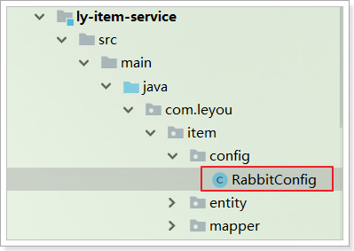 


### 1.2.3.改造GoodsService

改造GoodsService中的商品上下架功能，发送消息，注意用静态导入方式，导入在ly-common中定义的常量：

```java
import static com.leyou.common.constants.MQConstants.RoutingKey.*;
import static com.leyou.common.constants.MQConstants.Exchange.*;

@Autowired
private AmqpTemplate amqpTemplate;

@Transactional
public void updateSaleable(Long id, Boolean saleable) {
    // 修改spu
    Spu spu = new Spu();
    spu.setId(id);
    spu.setSaleable(saleable);
    int count = spuMapper.updateByPrimaryKeySelective(spu);
    if (count != 1) {
        throw new LyException(ExceptionEnum.UPDATE_OPERATION_FAIL);
    }
    // 顺便把sku中的enable也修改了
    Example example = new Example(Sku.class);
    example.createCriteria().andEqualTo("spuId", id);
    Sku sku = new Sku();
    sku.setEnable(saleable);
    skuMapper.updateByExampleSelective(sku, example);

    // 发送mq消息
    String key = saleable ? ITEM_UP_KEY : ITEM_DOWN_KEY;
    amqpTemplate.convertAndSend(ITEM_EXCHANGE_NAME,key, id);
}
```

## 1.3.搜索服务接收消息

搜索服务接收到消息后要做的事情：

- 上架：添加新的数据到索引库
- 下架：删除索引库数据

我们需要两个不同队列，监听不同类型消息。

### 1.3.1.引入依赖

```xml
<dependency>
    <groupId>org.springframework.boot</groupId>
    <artifactId>spring-boot-starter-amqp</artifactId>
</dependency>
```


### 1.3.2.添加配置

```yaml
spring:
  rabbitmq:
    host: 192.168.56.101
    username: leyou
    password: leyou
    virtual-host: /leyou
```

这里只是接收消息而不发送，所以不用配置template相关内容。

不过，不要忘了消息转换器：

 

```java
/**
 * @author 黑马程序员
 */
@Configuration
public class RabbitConfig {

    @Bean
    public Jackson2JsonMessageConverter messageConverter(){
        return new Jackson2JsonMessageConverter();
    }
}
```


### 1.3.3.编写监听器

  

代码：

```java
package com.leyou.search.mq;

import com.leyou.search.service.SearchService;
import org.springframework.amqp.core.ExchangeTypes;
import org.springframework.amqp.rabbit.annotation.Exchange;
import org.springframework.amqp.rabbit.annotation.Queue;
import org.springframework.amqp.rabbit.annotation.QueueBinding;
import org.springframework.amqp.rabbit.annotation.RabbitListener;
import org.springframework.beans.factory.annotation.Autowired;
import org.springframework.stereotype.Component;

import static com.leyou.common.constants.MQConstants.Exchange.*;
import static com.leyou.common.constants.MQConstants.Queue.*;
import static com.leyou.common.constants.MQConstants.RoutingKey.*;

@Component
public class ItemListener {

    @Autowired
    private SearchService searchService;

    @RabbitListener(bindings = @QueueBinding(
            value = @Queue(name = SEARCH_ITEM_UP, durable = "true"),
            exchange = @Exchange(
                    name = ITEM_EXCHANGE_NAME, type = ExchangeTypes.TOPIC),
            key = ITEM_UP_KEY
    ))
    public void listenInsert(Long id){
        if(id != null){
            // 新增索引
            searchService.createIndex(id);
        }
    }

    @RabbitListener(bindings = @QueueBinding(
            value = @Queue(name = SEARCH_ITEM_DOWN, durable = "true"),
            exchange = @Exchange(
                    name = ITEM_EXCHANGE_NAME, type = ExchangeTypes.TOPIC),
            key = ITEM_DOWN_KEY
    ))
    public void listenDelete(Long id){
        if(id != null){
            // 删除
            searchService.deleteById(id);
        }
    }
}
```


### 1.3.4.编写创建和删除索引方法

这里因为要创建和删除索引，我们需要在SearchService中拓展两个方法，创建和删除索引：

```java
public void createIndex(Long id){
    // 查询spu
    SpuDTO spu = itemClient.querySpuById(id);
    // 构建成goods对象 
    Goods goods = buildGoods(spu);
    // 保存数据到索引库
    goodsRepository.save(goods);
}

public void deleteById(Long id) {
    goodsRepository.deleteById(id);
}
```

创建索引的方法可以从之前导入数据的测试类中拷贝和改造。


## 1.4.静态页服务接收消息

商品静态页服务接收到消息后的处理：

- 上架：创建新的静态页
- 下架：删除原来的静态页

与前面搜索服务类似，也需要两个队列来处理。

### 1.4.1.引入依赖

```xml
<dependency>
    <groupId>org.springframework.boot</groupId>
    <artifactId>spring-boot-starter-amqp</artifactId>
</dependency>
```

### 1.4.2.添加配置

```yaml
spring:
  rabbitmq:
    host: 192.168.56.101
    username: leyou
    password: leyou
    virtual-host: /leyou
```

这里只是接收消息而不发送，所以不用配置template相关内容。

不过，不要忘了消息转换器：

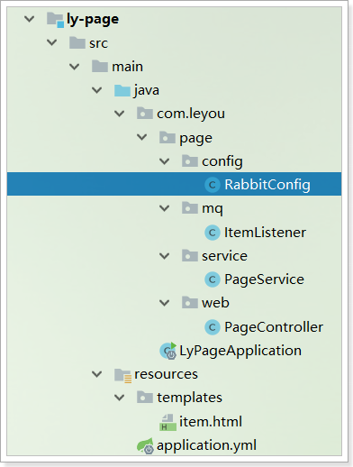 

```java
/**
 * @author 黑马程序员
 */
@Configuration
public class RabbitConfig {

    @Bean
    public Jackson2JsonMessageConverter messageConverter(){
        return new Jackson2JsonMessageConverter();
    }
}
```


### 1.4.3.编写监听器

 

代码：

```java
package com.leyou.page.mq;

import com.leyou.page.service.PageService;
import org.springframework.amqp.core.ExchangeTypes;
import org.springframework.amqp.rabbit.annotation.Exchange;
import org.springframework.amqp.rabbit.annotation.Queue;
import org.springframework.amqp.rabbit.annotation.QueueBinding;
import org.springframework.amqp.rabbit.annotation.RabbitListener;
import org.springframework.beans.factory.annotation.Autowired;
import org.springframework.stereotype.Component;

import static com.leyou.common.constants.MQConstants.Exchange.*;
import static com.leyou.common.constants.MQConstants.Queue.*;
import static com.leyou.common.constants.MQConstants.RoutingKey.*;

@Component
public class ItemListener {

    @Autowired
    private PageService pageService;

    @RabbitListener(bindings = @QueueBinding(
            value = @Queue(name = PAGE_ITEM_UP, durable = "true"),
            exchange = @Exchange(
                    name = ITEM_EXCHANGE_NAME, type = ExchangeTypes.TOPIC),
            key = ITEM_UP_KEY
    ))
    public void listenInsert(Long id) {
        if (id != null) {
            // 新增或修改
            pageService.createItemHtml(id);
        }
    }

    @RabbitListener(bindings = @QueueBinding(
            value = @Queue(name = PAGE_ITEM_DOWN, durable = "true"),
            exchange = @Exchange(
                    name = ITEM_EXCHANGE_NAME, type = ExchangeTypes.TOPIC),
            key = ITEM_DOWN_KEY
    ))
    public void listenDelete(Long id) {
        if (id != null) {
            // 删除
            pageService.deleteItemHtml(id);
        }
    }
}
```

### 1.4.4.添加删除页面方法

```java
public void deleteItemHtml(Long id) {
    File file = new File(itemDir, id + ".html");
    if(file.exists()){
        if (!file.delete()) {
            log.error("【静态页服务】静态页删除失败，商品id：{}", id);
            throw new LyException(ExceptionEnum.FILE_WRITER_ERROR);
        }
    }
}
```


## 1.5.测试

### 查看RabbitMQ控制台

重新启动项目，并且登录RabbitMQ管理界面：http://192.168.56.101:15672

可以看到，交换机已经创建出来了：

 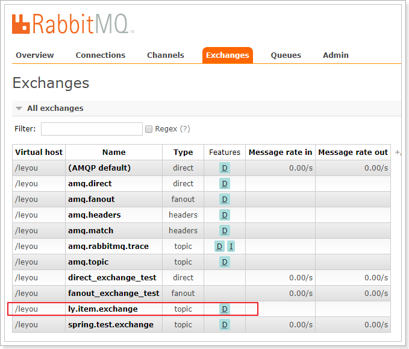

队列也已经创建完毕：

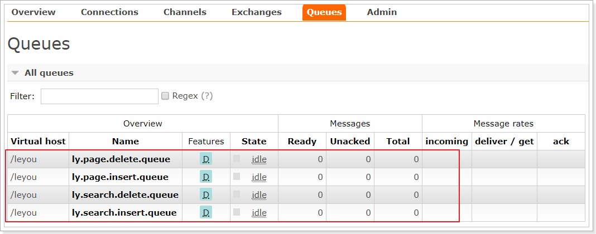

并且队列都已经绑定到交换机：

 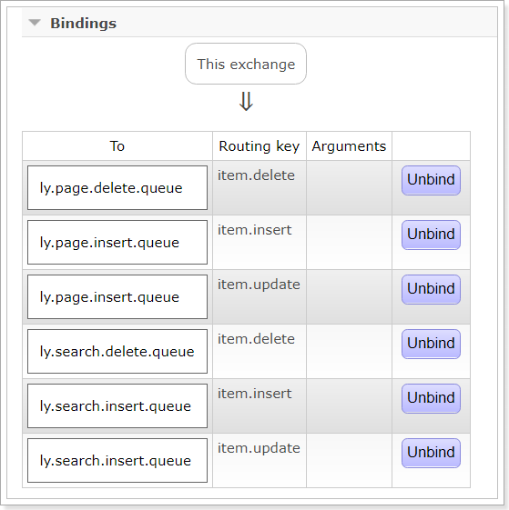

### 查看数据

我们搜索下手机：


商品详情页：


### 修改商品

然后在管理后台修改商品：

我们修改以下内容：

标题改成6.1

 


商品详情加点文字：

 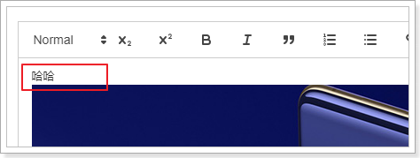

价格改为3999

 

### 再次查看数据

搜索页：

详情页：


详情内容：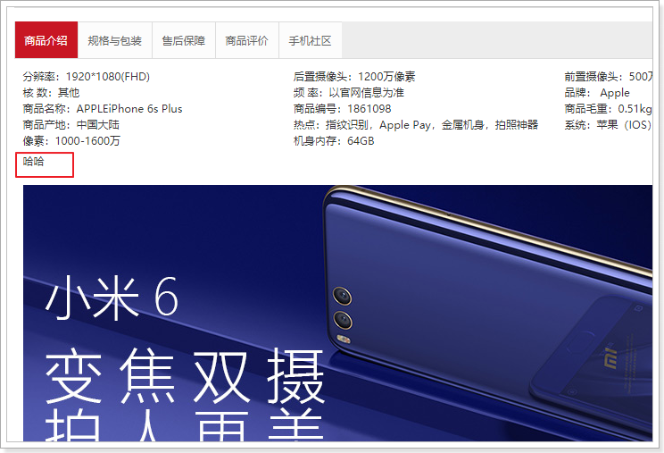


完美！

# 2.Redis回顾

完成了商品的详情展示，下一步自然是购物了。不过购物之前要完成用户的注册和登录等业务，我们需要使用到Redis技术，一起来回顾下。

## 2.1.NoSql

Redis是目前非常流行的一款NoSql数据库。

> 什么是NoSql？

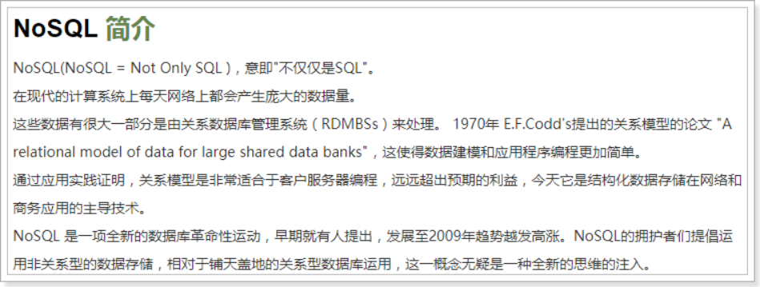


常见的NoSql产品：


## 2.2.Redis的介绍和安装

### 2.2.1.简介

> Redis的网址：

[官网](http://redis.io/)：速度很慢，几乎进去不去啊。

[中文网站](http://www.redis.cn/)：有部分翻译的官方文档，英文差的同学的福音


> 历史：

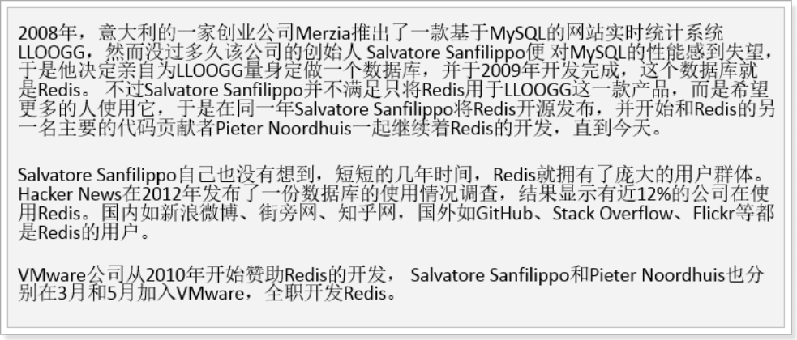

> 特性：

 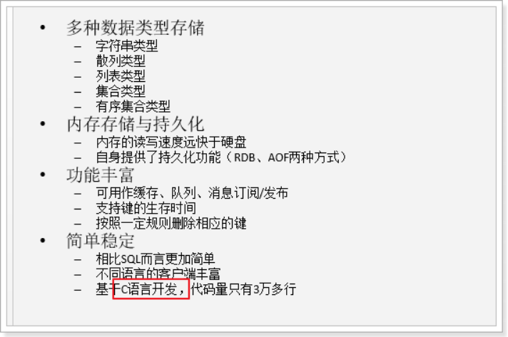

### 2.2.2.Redis与Memcache

Redis和Memcache是目前非常流行的两种NoSql数据库，读可以用于服务端缓存。两者有怎样的差异呢？

- 从实现来看：
  - redis：单线程
  - Memcache：多线程
- 从存储方式来看：
  - redis：支持数据持久化和主从备份，数据更安全
  - Memcache：数据存于内存，没有持久化功能 

- 从功能来看：
  - redis：除了基本的k-v 结构外，支持多种其它复杂结构、事务等高级功能
  - Memcache：只支持基本k-v 结构
- 从可用性看：
  - redis：支持主从备份、数据分片、哨兵监控
  - memcache：没有分片功能，需要从客户端支持

可以看出，Redis相比Memcache功能更加强大，支持的数据结构也比较丰富，已经不仅仅是一个缓存服务。而Memcache的功能相对单一。

一些面试问题：Redis缓存击穿问题、缓存雪崩问题。

### 2.2.3.安装

参考课前资料中的：《redis安装配置.md》

 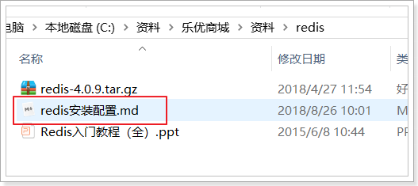


## 2.3.Redis指令

通过`help`命令可以让我们查看到Redis的指令帮助信息：

在`help`后面跟上`空格`，然后按`tab`键，会看到Redis对命令分组的组名：

 

主要包含：

- @generic：通用指令
- @string：字符串类型指令
- @list：队列结构指令
- @set：set结构指令
- @sorted_set：可排序的set结构指令
- @hash：hash结构指令

其中除了@generic以为的，对应了Redis中常用的5种数据类型：

- String：等同于java中的，`Map<String,String>`
- list：等同于java中的`Map<String,List<String>>`
- set：等同于java中的`Map<String,Set<String>>`
- sort_set：可排序的set
- hash：等同于java中的：`Map<String,Map<String,String>>`

可见，Redis中存储数据结构都是类似java的map类型。Redis不同数据类型，只是`'map'`的值的类型不同。


### 2.3.1.通用指令

> keys

获取符合规则的键名列表。

- 语法：keys pattern

	 示例：keys *	(查询所有的键)

	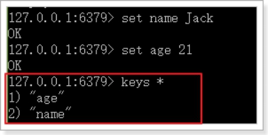

这里的pattern其实是正则表达式，所以语法基本是类似的

> exists

判断一个键是否存在，如果存在返回整数1，否则返回0

- 语法：EXISTS key

- 示例：

	

> del

DEL：删除key，可以删除一个或多个key，返回值是删除的key的个数。

- 语法：DEL key [key … ]

- 示例：

	

> expire

- 语法：

  ```
  EXPIRE key seconds
  ```

- 作用：设置key的过期时间，超过时间后，将会自动删除该key。

- 返回值：
  -  如果成功设置过期时间，返回1。
  - 如果key不存在或者不能设置过期时间，返回0

>  TTL

TTL：查看一个key的过期时间

- 语法：`TTL key`

- 返回值：
  - 返回剩余的过期时间
  -  -1：永不过期
  -  -2：已过期或不存在

- 示例：

 

> persist

- 语法：

  ```
  persist key
  ```

- 作用：

  移除给定key的生存时间，将这个 key 从带生存时间 key 转换成一个不带生存时间、永不过期的 key 。

- 返回值：
  - 当生存时间移除成功时，返回 1 .
  - 如果 key 不存在或 key 没有设置生存时间，返回 0 .

-  示例：

 

### 2.3.2.字符串指令

字符串结构，其实是Redis中最基础的K-V结构。其键和值都是字符串。类似Java的Map<String,String>


常用指令：

| 语法 | 说明 |
| ---- | ------------------------------------------------------------ |
| [SET key value](http://www.runoob.com/redis/strings-set.html) | 设置指定 key 的值 |
| [GET key](http://www.runoob.com/redis/strings-get.html) | 获取指定 key 的值。 |
| [GETRANGE key start end](http://www.runoob.com/redis/strings-getrange.html)  | 返回 key 中字符串值的子字符 |
| [INCR key](http://www.runoob.com/redis/strings-incr.html) |  将 key 中储存的数字值增一。 |
| [INCRBY key increment](http://www.runoob.com/redis/strings-incrby.html) |  将 key 所储存的值加上给定的增量值（increment） 。 |
| [DECR key](http://www.runoob.com/redis/strings-decr.html)  | 将 key 中储存的数字值减一。 |
| [DECRBY key decrement](http://www.runoob.com/redis/strings-decrby.html) |  key 所储存的值减去给定的减量值（decrement） 。 |
| [APPEND key value](http://www.runoob.com/redis/strings-append.html) |  如果 key 已经存在并且是一个字符串， APPEND 命令将 value 追加到 key 原来的值的末尾。 |
| [STRLEN key](http://www.runoob.com/redis/strings-strlen.html) |  返回 key 所储存的字符串值的长度。 |
| [MGET key1  key2 ...](http://www.runoob.com/redis/strings-mget.html) |  获取所有(一个或多个)给定 key 的值。 |
| [MSET key value key value ...](http://www.runoob.com/redis/strings-mset.html) |  同时设置一个或多个 key-value 对。 |

### 2.3.3.hash结构命令

Redis的Hash结构类似于Java中的Map<String,Map<String,Stgring>>，键是字符串，值是另一个映射。结构如图：

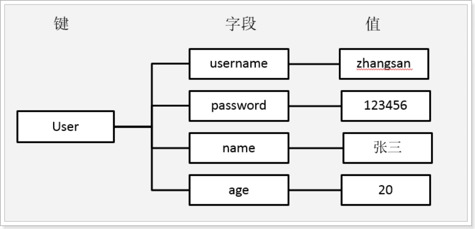

这里我们称键为key，字段名为  hKey， 字段值为 hValue


 常用指令：

> **HSET、HSETNX和HGET（添加、获取）**

HSET

- 介绍：
  - 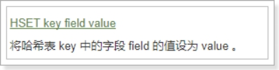 
  - Redis Hset 命令用于为哈希表中的字段赋值 。
  - 如果哈希表不存在，一个新的哈希表被创建并进行 HSET 操作。
  -  如果字段已经存在于哈希表中，旧值将被覆盖。

- 返回值：
  - 如果字段是哈希表中的一个新建字段，并且值设置成功，返回 1 。
  -  如果哈希表中域字段已经存在且旧值已被新值覆盖，返回 0

- 示例：

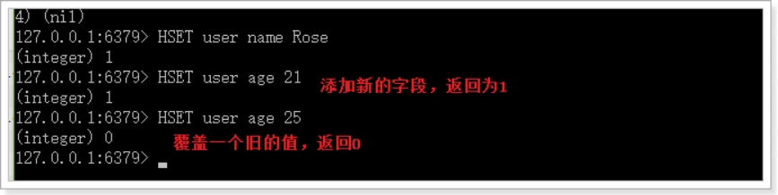 

 

>  HGET

- 介绍：

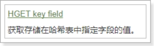 

	Hget 命令用于返回哈希表中指定字段的值。 

- 返回值：返回给定字段的值。如果给定的字段或 key 不存在时，返回 nil

- 示例：

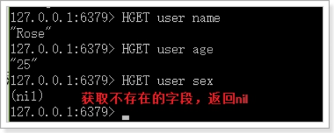 

> HGETALL

- 介绍：

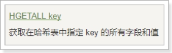 

- 返回值：

指定key 的所有字段的名及值。返回值里，紧跟每个字段名(field name)之后是字段的值(value)，所以返回值的长度是哈希表大小的两倍

- 示例：

	 

> HKEYS

- 介绍

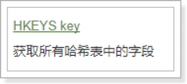 

- 示例：

	 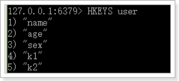

 

>  HVALS

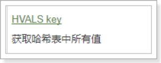 

- 注意：这个命令不是HVALUES，而是HVALS，是value 的缩写：val

- 示例：

	 

>  **HDEL（删除）**

Hdel 命令用于删除哈希表 key 中的一个或多个指定字段，不存在的字段将被忽略。

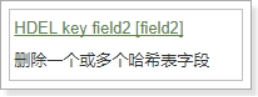 

- 语法：

	HDEL key field1 [field2 ... ]

- 返回值：

  被成功删除字段的数量，不包括被忽略的字段

- 示例：

	 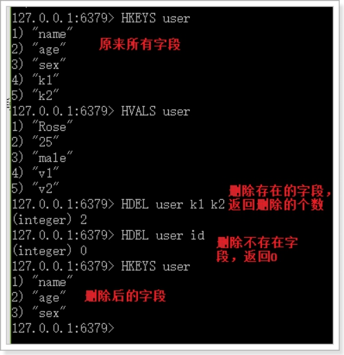


## 2.4.Redis的持久化

Redis有两种持久化方案：RDB和AOF

### 2.4.1.RDB

> 触发条件

RDB是Redis的默认持久化方案，当满足一定的条件时，Redis会自动将内存中的数据全部持久化到硬盘。

条件在redis.conf文件中配置，格式如下：

```
save (time) (count)
```

当满足在time（单位是秒）时间内，至少进行了count次修改后，触发条件，进行RDB快照。

例如，默认的配置如下：


> 基本原理

RDB的流程是这样的：

- Redis使用fork函数来复制一份当前进程（父进程）的副本（子进程）
- 父进程继续接收并处理请求，子进程开始把内存中的数据写入硬盘中的临时文件
- 子进程写完后，会使用临时文件代替旧的RDB文件


### 2.4.2.AOF

> 基本原理

AOF方式默认是关闭的，需要修改配置来开启：

```
appendonly yes # 把默认的no改成yes
```

AOF持久化的策略是，把每一条服务端接收到的写命令都记录下来，每隔一定时间后，写入硬盘的AOF文件中，当服务器重启后，重新执行这些命令，即可恢复数据。


AOF文件写入的频率是可以配置的：

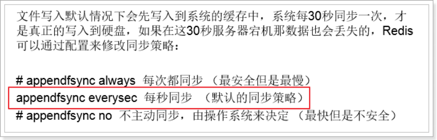


> AOF文件重写

当记录命令过多，必然会出现对同一个key的多次写操作，此时只需要记录最后一条即可，前面的记录都毫无意义了。因此，当满足一定条件时，Redis会对AOF文件进行重写，移除对同一个key的多次操作命令，保留最后一条。默认的触发条件：

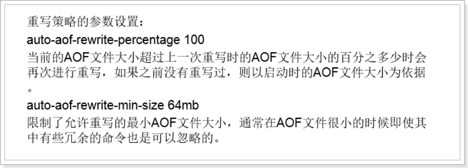

主从

## 2.5.SpringDataRedis

之前，我们使用Redis都是采用的Jedis客户端，不过既然我们使用了SpringBoot，为什么不使用Spring对Redis封装的套件呢？

### 5.2.2.Spring Data Redis

官网：<http://projects.spring.io/spring-data-redis/>

                                    

Spring Data Redis，是Spring Data 家族的一部分。 对Jedis客户端进行了封装，与spring进行了整合。可以非常方便的来实现redis的配置和操作。 

### 5.2.3.RedisTemplate基本操作

与以往学习的套件类似，Spring Data 为 Redis 提供了一个工具类：RedisTemplate。里面封装了对于Redis的五种数据结构的各种操作，包括：

- redisTemplate.opsForValue() ：操作字符串
- redisTemplate.opsForHash() ：操作hash
- redisTemplate.opsForList()：操作list
- redisTemplate.opsForSet()：操作set
- redisTemplate.opsForZSet()：操作zset

例如我们对字符串操作比较熟悉的有：get、set等命令，这些方法都在 opsForValue()返回的对象中有：

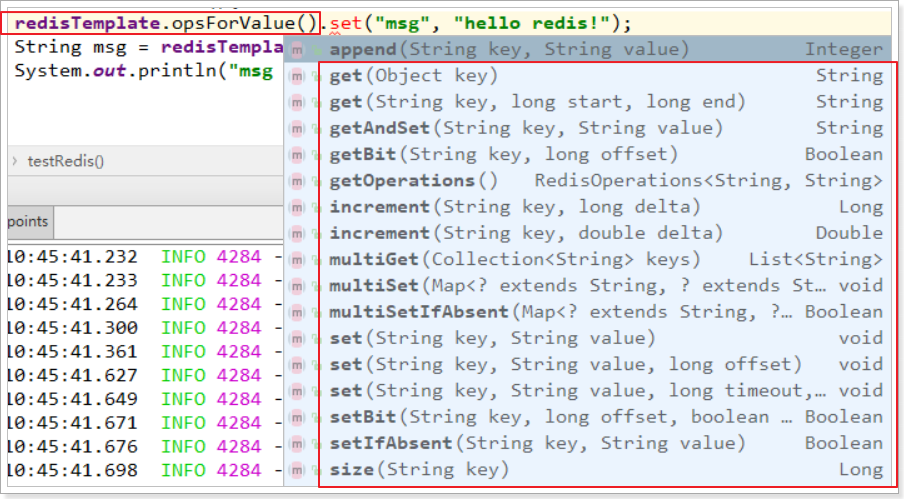


其它一些通用命令，如del，可以通过redisTemplate.xx()来直接调用。

 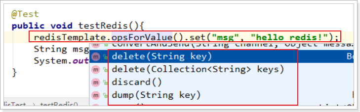


### 5.2.4.StringRedisTemplate

RedisTemplate在创建时，可以指定其泛型类型：

- K：代表key 的数据类型
- V: 代表value的数据类型

注意：这里的类型不是Redis中存储的数据类型，而是Java中的数据类型，RedisTemplate会自动将Java类型转为Redis支持的数据类型：字符串、字节、二二进制等等。

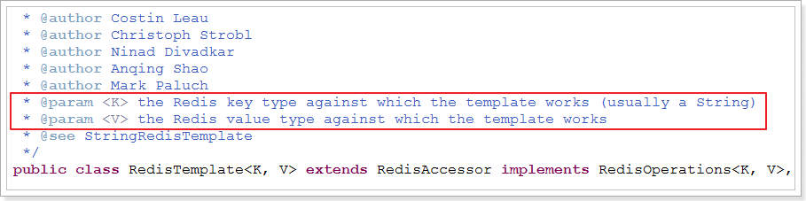

不过RedisTemplate默认会采用JDK自带的序列化（Serialize）来对对象进行转换。生成的数据十分庞大，因此一般我们都会指定key和value为String类型，这样就由我们自己把对象序列化为json字符串来存储即可。


因为大部分情况下，我们都会使用key和value都为String的RedisTemplate，因此Spring就默认提供了这样一个实现：

 

### 5.2.5.测试

我们新建一个测试项目，然后在项目中引入Redis启动器：

```xml
<dependency>
    <groupId>org.springframework.boot</groupId>
    <artifactId>spring-boot-starter-data-redis</artifactId>
</dependency>
```

然后在配置文件中指定Redis地址：

```yaml
spring:
  redis:
    host: 192.168.56.101
```

然后就可以直接注入`StringRedisTemplate`对象了：

```java
@RunWith(SpringRunner.class)
@SpringBootTest(classes = LyUserService.class)
public class RedisTest {

    @Autowired
    private StringRedisTemplate redisTemplate;

    @Test
    public void testRedis() {
        // 存储数据
        this.redisTemplate.opsForValue().set("key1", "value1");
        // 获取数据
        String val = this.redisTemplate.opsForValue().get("key1");
        System.out.println("val = " + val);
    }

    @Test
    public void testRedis2() {
        // 存储数据，并指定剩余生命时间,5小时
        this.redisTemplate.opsForValue().set("key2", "value2",
                5, TimeUnit.HOURS);
    }

    @Test
    public void testHash(){
        BoundHashOperations<String, Object, Object> hashOps =
                this.redisTemplate.boundHashOps("user");
        // 操作hash数据
        hashOps.put("name", "jack");
        hashOps.put("age", "21");

        // 获取单个数据
        Object name = hashOps.get("name");
        System.out.println("name = " + name);

        // 获取所有数据
        Map<Object, Object> map = hashOps.entries();
        for (Map.Entry<Object, Object> me : map.entrySet()) {
            System.out.println(me.getKey() + " : " + me.getValue());
        }
    }
}
```

# 3.阿里短信服务

## 3.1.demo

注册页面上有短信发送的按钮，当用户点击发送短信，我们需要生成验证码，发送给用户。我们将使用阿里提供的阿里大于来实现短信发送。

参考课前资料的《阿里短信.md》学习demo入门


## 3.2.创建短信微服务

因为系统中不止注册一个地方需要短信发送，因此我们将短信发送抽取为微服务：`ly-sms`，凡是需要的地方都可以使用。

另外，因为短信发送API调用时长的不确定性，为了提高程序的响应速度，短信发送我们都将采用异步发送方式，即：

- 短信服务监听MQ消息，收到消息后发送短信。
- 其它服务要发送短信时，通过MQ通知短信微服务。

### 3.2.1.创建module

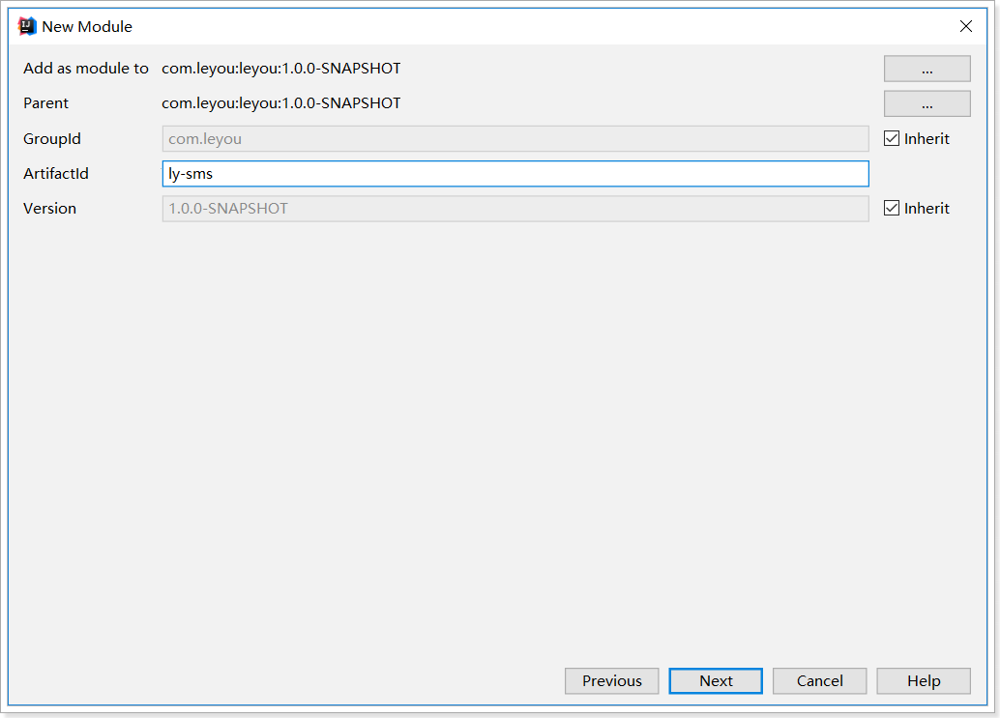

### 3.2.2.pom

```xml
<?xml version="1.0" encoding="UTF-8"?>
<project xmlns="http://maven.apache.org/POM/4.0.0"
         xmlns:xsi="http://www.w3.org/2001/XMLSchema-instance"
         xsi:schemaLocation="http://maven.apache.org/POM/4.0.0 http://maven.apache.org/xsd/maven-4.0.0.xsd">
    <parent>
        <artifactId>leyou</artifactId>
        <groupId>com.leyou</groupId>
        <version>1.0.0-SNAPSHOT</version>
    </parent>
    <modelVersion>4.0.0</modelVersion>

    <artifactId>ly-sms</artifactId>

    <dependencies>
        <dependency>
            <groupId>org.springframework.boot</groupId>
            <artifactId>spring-boot-starter-web</artifactId>
        </dependency>
        <dependency>
            <groupId>org.springframework.boot</groupId>
            <artifactId>spring-boot-starter-test</artifactId>
            <scope>test</scope>
        </dependency>
        <dependency>
            <groupId>com.aliyun</groupId>
            <artifactId>aliyun-java-sdk-core</artifactId>
            <version>4.1.1</version>
        </dependency>
        <dependency>
            <groupId>org.springframework.boot</groupId>
            <artifactId>spring-boot-starter-amqp</artifactId>
        </dependency>
        <dependency>
            <groupId>com.leyou</groupId>
            <artifactId>ly-common</artifactId>
            <version>1.0.0-SNAPSHOT</version>
        </dependency>
    </dependencies>
    <build>
        <plugins>
            <plugin>
                <groupId>org.springframework.boot</groupId>
                <artifactId>spring-boot-maven-plugin</artifactId>
            </plugin>
        </plugins>
    </build>
</project>
```


### 3.2.3.编写启动类

```java
@SpringBootApplication
public class LySmsApplication {
    public static void main(String[] args) {
        SpringApplication.run(LySmsApplication.class, args);
    }
}
```


### 3.2.4.编写application.yml

```yaml
server:
  port: 8086
spring:
  application:
    name: sms-service
  rabbitmq:
    host: 192.168.56.101
    username: leyou
    password: leyou
    virtual-host: /leyou
```

## 3.3.编写短信工具类

### 3.3.1.属性抽取

我们首先把一些常量抽取到application.yml中：

```yaml
ly:
  sms:
    accessKeyID: LTAIfmmL26haCK0b # 你自己的accessKeyId
    accessKeySecret: pX3RQns9ZwXs75M6Isae9sMgBLXDfY # 你自己的AccessKeySecret
    signName: 乐优商城 # 签名名称
    verifyCodeTemplate: SMS_133976814 # 模板名称
    domain: dysmsapi.aliyuncs.com # 域名
    action: SendSMS # API类型，发送短信
    version: 2017-05-25 # API版本，固定值
    regionID: cn-hangzhou # 区域id
```

然后注入到属性类中：

```java
package com.leyou.sms.config;

import lombok.Data;
import org.springframework.boot.context.properties.ConfigurationProperties;

@Data
@ConfigurationProperties(prefix = "ly.sms")
public class SmsProperties {
    /**
     * 账号
     */
    String accessKeyID;
    /**
     * 密钥
     */
    String accessKeySecret;
    /**
     * 短信签名
     */
    String signName;
    /**
     * 短信模板
     */
    String verifyCodeTemplate;
    /**
     * 发送短信请求的域名
     */
    String domain;
    /**
     * API版本
     */
    String version;
    /**
     * API类型
     */
    String action;
    /**
     * 区域
     */
    String regionID;
}
```


### 3.3.2.阿里客户端

首先，把发请求需要的客户端注册到Spring容器：

```java
package com.leyou.sms.config;

import com.aliyuncs.DefaultAcsClient;
import com.aliyuncs.IAcsClient;
import com.aliyuncs.profile.DefaultProfile;
import org.springframework.boot.context.properties.EnableConfigurationProperties;
import org.springframework.context.annotation.Bean;
import org.springframework.context.annotation.Configuration;

/**
 * @author 黑马程序员
 */
@Configuration
@EnableConfigurationProperties(SmsProperties.class)
public class SmsConfiguration {

    @Bean
    public IAcsClient acsClient(SmsProperties prop){
        DefaultProfile profile = DefaultProfile.getProfile(
                prop.getRegionID(), prop.getAccessKeyID(), prop.getAccessKeySecret());
        return new DefaultAcsClient(profile);
    }
}
```


### 3.3.2.工具类

我们把阿里提供的demo进行简化和抽取，封装一个工具类：

```java
package com.leyou.sms.utils;

import com.aliyuncs.CommonRequest;
import com.aliyuncs.CommonResponse;
import com.aliyuncs.IAcsClient;
import com.aliyuncs.exceptions.ClientException;
import com.aliyuncs.exceptions.ServerException;
import com.aliyuncs.http.MethodType;
import com.aliyuncs.http.ProtocolType;
import com.leyou.common.enums.ExceptionEnum;
import com.leyou.common.exceptions.LyException;
import com.leyou.common.utils.JsonUtils;
import com.leyou.sms.config.SmsProperties;
import lombok.extern.slf4j.Slf4j;
import org.apache.commons.lang3.StringUtils;
import org.springframework.stereotype.Component;

import java.util.Map;

import static com.leyou.sms.constants.SmsConstants.*;

/**
 * @author 黑马程序员
 */
@Slf4j
@Component
public class SmsHelper {

    private IAcsClient client;

    private SmsProperties prop;

    public SmsHelper(IAcsClient client, SmsProperties prop) {
        this.client = client;
        this.prop = prop;
    }

    public void sendMessage(String phone, String signName, String template, String param) {
        CommonRequest request = new CommonRequest();
        request.setProtocol(ProtocolType.HTTPS);
        request.setMethod(MethodType.POST);
        request.setDomain(prop.getDomain());
        request.setVersion(prop.getVersion());
        request.setAction(prop.getAction());
        request.putQueryParameter(SMS_PARAM_KEY_PHONE, phone);
        request.putQueryParameter(SMS_PARAM_KEY_SIGN_NAME, signName);
        request.putQueryParameter(SMS_PARAM_KEY_TEMPLATE_CODE, template);
        request.putQueryParameter(SMS_PARAM_KEY_TEMPLATE_PARAM, param);

        try {
            CommonResponse response = client.getCommonResponse(request);
            if(response.getHttpStatus() >= 300){
                log.error("【SMS服务】发送短信失败。响应信息：{}", response.getData());
            }
            // 获取响应体
            Map<String, String> resp = JsonUtils.toMap(response.getData(), String.class, String.class);
            // 判断是否是成功
            if(!StringUtils.equals(OK, resp.get(SMS_RESPONSE_KEY_CODE))){
                // 不成功，
                log.error("【SMS服务】发送短信失败，原因{}", resp.get(SMS_RESPONSE_KEY_MESSAGE));
                throw new LyException(ExceptionEnum.SEND_MESSAGE_ERROR);
            }
            log.info("【SMS服务】发送短信成功，手机号：{}, 响应：{}", phone, response.getData());
        } catch (ServerException e) {
            log.error("【SMS服务】发送短信失败，服务端异常。", e);
        } catch (ClientException e) {
            log.error("【SMS服务】发送短信失败，客户端异常。", e);
        }
    }
}
```


这里把阿里SDK中会用到的一些参数KEY，响应KEY都定义成了常量：

```java
/**
 * @author 黑马程序员
 */
public final class SmsConstants {
    /**
     * 请求参数
     */
    public static final String SMS_PARAM_KEY_PHONE = "PhoneNumbers";
    public static final String SMS_PARAM_KEY_SIGN_NAME = "SignName";
    public static final String SMS_PARAM_KEY_TEMPLATE_CODE = "TemplateCode";
    public static final String SMS_PARAM_KEY_TEMPLATE_PARAM= "TemplateParam";

    /**
     * 响应结果
     */
    public static final String SMS_RESPONSE_KEY_CODE = "Code";
    public static final String SMS_RESPONSE_KEY_MESSAGE = "Message";

    /**
     * 状态
     */
    public static final String OK = "OK";
}
```

如图：

 


## 3.4.编写消息监听器

接下来，编写消息监听器，当接收到消息后，我们发送短信。

```java
package com.leyou.sms.mq;

import com.leyou.common.exceptions.LyException;
import com.leyou.common.utils.JsonUtils;
import com.leyou.sms.config.SmsProperties;
import com.leyou.sms.utils.SmsHelper;
import lombok.extern.slf4j.Slf4j;
import org.apache.commons.lang3.StringUtils;
import org.springframework.amqp.core.ExchangeTypes;
import org.springframework.amqp.rabbit.annotation.Exchange;
import org.springframework.amqp.rabbit.annotation.Queue;
import org.springframework.amqp.rabbit.annotation.QueueBinding;
import org.springframework.amqp.rabbit.annotation.RabbitListener;
import org.springframework.beans.factory.annotation.Autowired;
import org.springframework.boot.context.properties.EnableConfigurationProperties;
import org.springframework.stereotype.Component;

import java.util.Map;

import static com.leyou.common.constants.MQConstants.Exchange.SMS_EXCHANGE_NAME;
import static com.leyou.common.constants.MQConstants.Queue.SMS_VERIFY_CODE_QUEUE;
import static com.leyou.common.constants.MQConstants.RoutingKey.VERIFY_CODE_KEY;

@Slf4j
@Component
@EnableConfigurationProperties(SmsProperties.class)
public class SmsListener {

    @Autowired
    private SmsProperties prop;

    @Autowired
    private SmsHelper smsHelper;

    @RabbitListener(bindings = @QueueBinding(
            value = @Queue(name = SMS_VERIFY_CODE_QUEUE),
            exchange = @Exchange(name = SMS_EXCHANGE_NAME, type = ExchangeTypes.TOPIC),
            key = VERIFY_CODE_KEY
    ))
    public void listenVerifyCode(Map<String, String> msg) {
        if (msg == null) {
            return;
        }
        // 移除手机数据，剩下的是短信参数
        String phone = msg.remove("phone");
        if (StringUtils.isBlank(phone)) {
            return;
        }
        try {
            smsHelper.sendMessage(phone, prop.getSignName(), prop.getVerifyCodeTemplate(), JsonUtils.toString(msg));
        } catch (LyException e) {
            // 短信验证码失败后不重发，所以需要捕获异常。
            log.error("【SMS服务】短信验证码发送失败", e);
        }
    }
}
```


我们注意到，消息体是一个Map，里面有两个属性：

- phone：电话号码
- code：短信验证码

不要忘了，几个队列和交换机的名称，定义到`ly-common`中：

```java
package com.leyou.common.constants;

/**
 * @author 黑马程序员
 */
public abstract class MQConstants {

    public static final class Exchange {
        // ... 略
        /**
         * 消息服务交换机名称
         */
        public static final String SMS_EXCHANGE_NAME = "ly.sms.exchange";
    }

    public static final class RoutingKey {
        // ... 略
        /**
         * 商品下架的routing-key
         */
        public static final String VERIFY_CODE_KEY = "sms.verify.code";
    }


    public static final class Queue{
        // ... 略
        /**
         * 搜索服务，商品下架的队列
         */
        public static final String SMS_VERIFY_CODE_QUEUE = "sms.verify.code.queue";
    }
}

```


## 3.5.启动

启动项目，然后查看RabbitMQ控制台，发现交换机已经创建：

 


## 3.6.单元测试

编写一个测试类，尝试发送一条短信消息：

```java
@RunWith(SpringRunner.class)
@SpringBootTest
public class SmsTest {

    @Autowired
    private AmqpTemplate amqpTemplate;

    @Test
    public void testSendMessage() throws InterruptedException {
        Map<String,String> map = new HashMap<>();
        map.put("phone", "13600523456");
        map.put("code", "123321");
        amqpTemplate.convertAndSend("ly.sms.exchange", "sms.verify.code", map);

        Thread.sleep(5000);
    }
}
```


