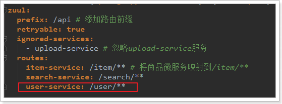
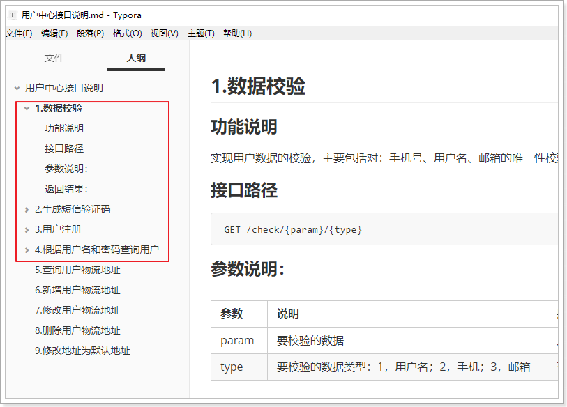
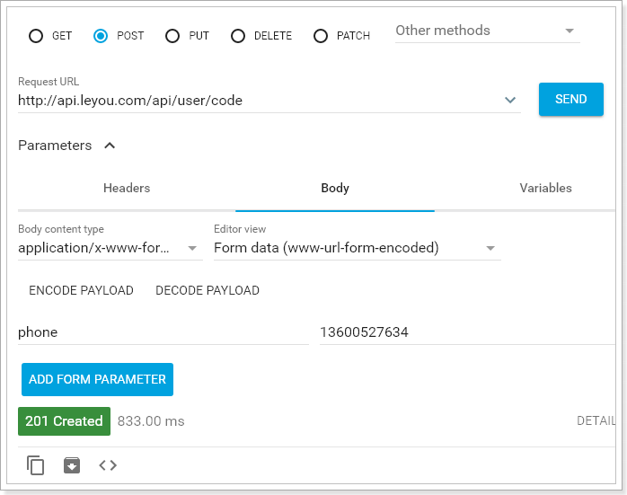
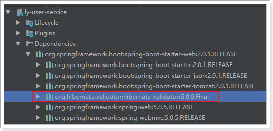
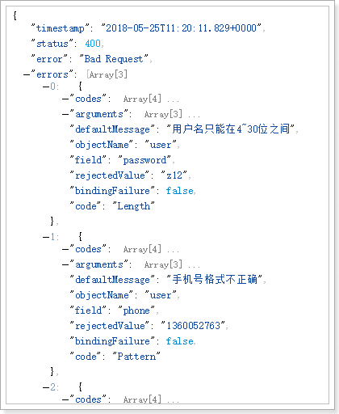

# 0.学习目标

- 了解面向接口开发方式
- 实现数据校验功能
- 实现短信发送功能
- 实现注册功能
- 实现根据用户名和密码查询用户功能


# 1.创建用户中心

用户搜索到自己心仪的商品，接下来就要去购买，但是购买必须先登录。所以接下来我们编写用户中心，实现用户的登录和注册功能。

用户中心的提供的服务：

- 用户的注册
- 用户登录
- 用户个人信息管理
- 用户地址管理
- 用户收藏管理
- ​

这里我们暂时先实现基本的：`注册和登录`功能，其它功能大家可以自行补充完整。

因为用户中心的服务其它微服务也会调用，因此这里我们做聚合：

- ly-user：父工程，包含3个子工程：
  - ly-user-interface：接口
  - ly-user-pojo:实体
  - ly-user-service：业务和服务

## 1.1.创建父module

创建


位置：

 

## 1.1.创建ly-user-pojo

项目坐标：

 

保存的位置：


pom：

```xml
<?xml version="1.0" encoding="UTF-8"?>
<project xmlns="http://maven.apache.org/POM/4.0.0"
         xmlns:xsi="http://www.w3.org/2001/XMLSchema-instance"
         xsi:schemaLocation="http://maven.apache.org/POM/4.0.0 http://maven.apache.org/xsd/maven-4.0.0.xsd">
    <parent>
        <artifactId>ly-user</artifactId>
        <groupId>com.leyou</groupId>
        <version>1.0.0-SNAPSHOT</version>
    </parent>
    <modelVersion>4.0.0</modelVersion>

    <artifactId>ly-user-pojo</artifactId>

    <dependencies>
        <dependency>
            <groupId>com.fasterxml.jackson.core</groupId>
            <artifactId>jackson-databind</artifactId>
            <version>2.9.8</version>
        </dependency>
    </dependencies>
</project>
```


## 1.2.创建ly-user-interface

创建module：


位置：

 

 

pom：

```xml
<?xml version="1.0" encoding="UTF-8"?>
<project xmlns="http://maven.apache.org/POM/4.0.0"
         xmlns:xsi="http://www.w3.org/2001/XMLSchema-instance"
         xsi:schemaLocation="http://maven.apache.org/POM/4.0.0 http://maven.apache.org/xsd/maven-4.0.0.xsd">
    <parent>
        <artifactId>ly-user</artifactId>
        <groupId>com.leyou</groupId>
        <version>1.0.0-SNAPSHOT</version>
    </parent>
    <modelVersion>4.0.0</modelVersion>

    <artifactId>ly-user-interface</artifactId>

    <dependencies>
        <dependency>
            <groupId>com.leyou</groupId>
            <artifactId>ly-user-pojo</artifactId>
            <version>1.0.0-SNAPSHOT</version>
        </dependency>
    </dependencies>
</project>
```


## 1.3.创建ly-user-service

创建module

 

 

pom

```xml
<?xml version="1.0" encoding="UTF-8"?>
<project xmlns="http://maven.apache.org/POM/4.0.0"
         xmlns:xsi="http://www.w3.org/2001/XMLSchema-instance"
         xsi:schemaLocation="http://maven.apache.org/POM/4.0.0 http://maven.apache.org/xsd/maven-4.0.0.xsd">
    <parent>
        <artifactId>ly-user</artifactId>
        <groupId>com.leyou</groupId>
        <version>1.0.0-SNAPSHOT</version>
    </parent>
    <modelVersion>4.0.0</modelVersion>

    <artifactId>ly-user-service</artifactId>

    <dependencies>
        <!--web启动器-->
        <dependency>
            <groupId>org.springframework.boot</groupId>
            <artifactId>spring-boot-starter-web</artifactId>
        </dependency>
        <!--eureka客户端-->
        <dependency>
            <groupId>org.springframework.cloud</groupId>
            <artifactId>spring-cloud-starter-netflix-eureka-client</artifactId>
        </dependency>
        <!-- 通用Mapper启动器 -->
        <dependency>
            <groupId>tk.mybatis</groupId>
            <artifactId>mapper-spring-boot-starter</artifactId>
        </dependency>
        <!-- mysql驱动 -->
        <dependency>
            <groupId>mysql</groupId>
            <artifactId>mysql-connector-java</artifactId>
        </dependency>
        <dependency>
            <groupId>com.leyou</groupId>
            <artifactId>ly-user-pojo</artifactId>
            <version>1.0.0-SNAPSHOT</version>
        </dependency>
        <dependency>
            <groupId>com.leyou</groupId>
            <artifactId>ly-common</artifactId>
            <version>1.0.0-SNAPSHOT</version>
        </dependency>
    </dependencies>
    <build>
        <plugins>
            <plugin>
                <groupId>org.springframework.boot</groupId>
                <artifactId>spring-boot-maven-plugin</artifactId>
            </plugin>
        </plugins>
    </build>
</project>
```


启动类

```java
@SpringBootApplication
@EnableDiscoveryClient
@MapperScan("com.leyou.user.mapper")
public class LyUserApplication {
    public static void main(String[] args) {
        SpringApplication.run(LyUserApplication.class,args);
    }
}
```


配置：

```yaml
server:
  port: 8085
spring:
  application:
    name: user-service
  datasource:
    url: jdbc:mysql://127.0.0.1:3306/heima
    username: root
    password: 123
eureka:
  client:
    service-url:
      defaultZone: http://127.0.0.1:10086/eureka
  instance:
    ip-address: 127.0.0.1
    prefer-ip-address: true
mybatis:
  type-aliases-package: com.leyou.user.entity
  configuration:
    map-underscore-to-camel-case: true
logging:
  level:
    com.leyou: debug
```


父工程ly-user的pom：

```xml
<?xml version="1.0" encoding="UTF-8"?>
<project xmlns="http://maven.apache.org/POM/4.0.0"
         xmlns:xsi="http://www.w3.org/2001/XMLSchema-instance"
         xsi:schemaLocation="http://maven.apache.org/POM/4.0.0 http://maven.apache.org/xsd/maven-4.0.0.xsd">
    <parent>
        <artifactId>leyou</artifactId>
        <groupId>com.leyou</groupId>
        <version>1.0.0-SNAPSHOT</version>
    </parent>
    <modelVersion>4.0.0</modelVersion>

    <artifactId>ly-user</artifactId>
    <packaging>pom</packaging>
    <modules>
        <module>ly-user-pojo</module>
        <module>ly-user-interface</module>
        <module>ly-user-service</module>
    </modules>
</project>
```


## 1.4.添加网关路由

我们修改`ly-api-gateway`，添加路由规则，对`ly-user-service`进行路由:

 


# 2.后台功能准备

## 2.1.接口文档

整个用户中心的开发，我们将模拟公司内面向接口的开发。因为在前后端分离的开发模式中，后端人员只需要对外提供接口，而不需要关心页面的实现。为了使前后端可以同时开发，必须让前端与后端基于相同的接口，声明每一个接口的路径、参数、返回值等属性。

现在假设项目经理已经设计好了接口文档，详见：《用户中心接口说明.md》




我们将根据文档直接编写后台功能，不关心页面实现。


## 2.2.数据结构

```mysql
CREATE TABLE `tb_user` (
  `id` bigint(20) NOT NULL AUTO_INCREMENT,
  `username` varchar(32) NOT NULL COMMENT '用户名',
  `password` varchar(60) NOT NULL COMMENT '密码，加密存储',
  `phone` varchar(11) DEFAULT NULL COMMENT '注册手机号',
  `create_time` timestamp NULL DEFAULT CURRENT_TIMESTAMP COMMENT '创建时间',
  `update_time` timestamp NULL DEFAULT CURRENT_TIMESTAMP ON UPDATE CURRENT_TIMESTAMP COMMENT '更新时间',
  PRIMARY KEY (`id`),
  UNIQUE KEY `username` (`username`) USING BTREE,
  UNIQUE KEY `phone` (`phone`)
) ENGINE=InnoDB AUTO_INCREMENT=30 DEFAULT CHARSET=utf8 COMMENT='用户表';
```

数据结构比较简单，因为根据用户名查询的频率较高，所以我们给用户名创建了索引

## 2.3.基本代码

### 实体类

```java
package com.leyou.user.entity;

import lombok.Data;
import tk.mybatis.mapper.annotation.KeySql;

import javax.persistence.Id;
import javax.persistence.Table;
import java.util.Date;

@Table(name = "tb_user")
@Data
public class User {
    @Id
    @KeySql(useGeneratedKeys = true)
    private Long id;
    private String username;
    private String password;
    private String phone;
    private Date createTime;
    private Date updateTime;
}
```

### mapper

```java
package com.leyou.user.mapper;

import com.leyou.user.entity.User;
import tk.mybatis.mapper.common.Mapper;

public interface UserMapper extends Mapper<User> {
}
```


### Service

```java
@Service
public class UserService {

    @Autowired
    private UserMapper userMapper;
}
```


# 3.数据验证功能

## 3.1.接口说明：

### 接口路径

```
GET /check/{data}/{type}
```

### 参数说明：

| 参数   | 说明                  | 是否必须 | 数据类型    | 默认值  |
| ---- | ------------------- | ---- | ------- | ---- |
| data | 要校验的数据              | 是    | String  | 无    |
| type | 要校验的数据类型：1，用户名；2，手机 | 是    | Integer | 无    |

### 返回结果：

返回布尔类型结果：

- true：可用
- false：不可用

状态码：

- 200：校验成功
- 400：参数有误
- 500：服务器内部异常


## 3.2.controller

因为有了接口，我们可以不关心页面，所有需要的东西都一清二楚：

- 请求方式：GET
- 请求路径：/check/{param}/{type}
- 请求参数：param,type
- 返回结果：true或false

```java
package com.leyou.user.web;

import com.leyou.user.service.UserService;
import org.springframework.beans.factory.annotation.Autowired;
import org.springframework.http.ResponseEntity;
import org.springframework.web.bind.annotation.GetMapping;
import org.springframework.web.bind.annotation.PathVariable;
import org.springframework.web.bind.annotation.RestController;

/**
 * @author 黑马程序员
 */
@RestController
public class UserController {

    @Autowired
    private UserService userService;

    /**
     * 校验数据是否可用
     * @param data
     * @param type
     * @return
     */
    @GetMapping("/check/{data}/{type}")
    public ResponseEntity<Boolean> checkUserData(@PathVariable("data") String data, @PathVariable(value = "type") Integer type) {
        return ResponseEntity.ok(userService.checkData(data, type));
    }
}
```

## 3.3.Service

```java
package com.leyou.user.service;

import com.leyou.common.enums.ExceptionEnum;
import com.leyou.common.exceptions.LyException;
import com.leyou.user.entity.User;
import com.leyou.user.mapper.UserMapper;
import org.springframework.beans.factory.annotation.Autowired;
import org.springframework.stereotype.Service;

@Service
public class UserService {

    @Autowired
    private UserMapper userMapper;

    public Boolean checkData(String data, Integer type) {
        User u = new User();
        switch (type) {
            case 1:
                u.setUsername(data);
                break;
            case 2:
                u.setPhone(data);
                break;
            default:
                throw new LyException(ExceptionEnum.INVALID_PARAM_ERROR);
        }
        int count = userMapper.selectCount(u);
        return count == 0;
    }
}
```

## 3.4.测试

我们在数据库插入一条假数据：

 

然后在浏览器调用接口，测试：

 

 


# 4.发送短信功能

短信微服务已经准备好，我们就可以继续编写用户中心接口了。

## 4.1.接口说明


这里的业务逻辑是这样的：

- 1）我们接收页面发送来的手机号码
- 2）生成一个随机验证码
- 3）将验证码保存在服务端
- 4）发送短信，将验证码发送到用户手机


那么问题来了：验证码保存在哪里呢？

验证码有一定有效期，一般是5分钟，我们可以利用Redis的过期机制来保存。

## 4.3.controller

```java
/**
     * 发送短信验证码
     * @return
     */
@PostMapping("/code")
public ResponseEntity<Void> sendCode(@RequestParam("phone") String phone){
    userService.sendCode(phone);
    return ResponseEntity.status(HttpStatus.NO_CONTENT).build();
}
```

## 4.4.service

这里的逻辑会稍微复杂：

- 生成随机验证码
- 将验证码保存到Redis中，用来在注册的时候验证
- 发送验证码到`ly-sms-service`服务，发送短信

因此，我们需要引入Redis和AMQP：

```xml
<dependency>
    <groupId>org.springframework.boot</groupId>
    <artifactId>spring-boot-starter-data-redis</artifactId>
</dependency>
<dependency>
    <groupId>org.springframework.boot</groupId>
    <artifactId>spring-boot-starter-amqp</artifactId>
</dependency>
```

添加RabbitMQ和Redis配置：

```yaml
spring:
  redis:
    host: 192.168.56.101
  rabbitmq:
    host: 192.168.56.101
    username: leyou
    password: leyou
    virtual-host: /leyou
```


Service代码：

```java
public void sendCode(String phone) {
    // 验证手机号格式
    if (!RegexUtils.isPhone(phone)) {
        throw new LyException(ExceptionEnum.INVALID_PHONE_NUMBER);
    }

    // 生成验证码
    String code = RandomStringUtils.randomNumeric(6);

    // 保存验证码到redis
    redisTemplate.opsForValue().set(KEY_PREFIX + phone, code, 1, TimeUnit.MINUTES);

    // 发送RabbitMQ消息到ly-sms
    Map<String, String> msg = new HashMap<>();
    msg.put("phone", phone);
    msg.put("code", code);
    amqpTemplate.convertAndSend(SMS_EXCHANGE_NAME, VERIFY_CODE_KEY, msg);
}
```

注意：

- 手机号校验使用了ly-common中定义的正则工具类

- 要设置短信验证码在Redis的缓存有效时间


## 4.5.测试

通过RestClient发送请求试试：

 

查看Redis中的数据：

 

查看短信：

 


# 5.注册功能

## 5.1.接口说明


## 5.2.controller

```java
@PostMapping("register")
public ResponseEntity<Void> register(User user, @RequestParam("code") String code){
    userService.register(user, code);
    return ResponseEntity.status(HttpStatus.CREATED).build();
}
```

## 5.3.service

基本逻辑：

- 1）校验短信验证码
- 2）对密码加密
- 3）写入数据库

密码加密：

密码加密使用传统的MD5加密并不安全，这里我们使用的是Spring提供的BCryptPasswordEncoder加密算法，分成加密和验证两个过程：

- 加密：算法会对明文密码随机生成一个salt，使用salt结合密码来加密，得到最终的密文。

- 验证密码：需要先拿到加密后的密码和要验证的密码，根据已加密的密码来推测出salt，然后利用相同的算法和salt对要验证码的密码加密，与已加密的密码对比即可。

为了防止有人能根据密文推测出salt，我们需要在使用BCryptPasswordEncoder时配置随即密钥：

```java
package com.leyou.user.config;

import lombok.Data;
import org.springframework.boot.context.properties.ConfigurationProperties;
import org.springframework.context.annotation.Bean;
import org.springframework.context.annotation.Configuration;
import org.springframework.security.crypto.bcrypt.BCryptPasswordEncoder;
import org.springframework.security.crypto.password.PasswordEncoder;

import java.security.SecureRandom;

/**
 * @author 黑马程序员
 */
@Data
@Configuration
@ConfigurationProperties(prefix = "ly.encoder.crypt")
public class PasswordConfig {

    private int strength;
    private String secret;

    @Bean
    public BCryptPasswordEncoder passwordEncoder(){
        // 利用密钥生成随机安全码
        SecureRandom secureRandom = new SecureRandom(secret.getBytes());
        // 初始化BCryptPasswordEncoder
        return new BCryptPasswordEncoder(strength, secureRandom);
    }
}
```

在配置文件中配置属性：

```yaml
ly:
  encoder:
    crypt:
      secret: ${random.uuid} # 随机的密钥，使用uuid
      strength: 10 # 加密强度4~31，决定了密码和盐加密时的运算次数，超过10以后加密耗时会显著增加
```


代码：

```java
@Autowired
private BCryptPasswordEncoder passwordEncoder;

public void register(User user, String code) {
    // 1 校验验证码
    // 1.1 取出redis中的验证码
    String cacheCode = redisTemplate.opsForValue().get(KEY_PREFIX + user.getPhone());
    // 1.2 比较验证码
    if (!StringUtils.equals(code, cacheCode)) {
        throw new LyException(ExceptionEnum.INVALID_VERIFY_CODE);
    }
    // 2 对密码加密
    user.setPassword(passwordEncoder.encode(user.getPassword()));
    // 3 写入数据库
    int count = userMapper.insertSelective(user);
    if (count != 1) {
        throw new LyException(ExceptionEnum.INSERT_OPERATION_FAIL);
    }
}
```

## 5.4.测试

我们通过RestClient测试：


查看数据库：

 


## 5.5.服务端数据校验

刚才虽然实现了注册，但是服务端并没有进行数据校验，而前端的校验是很容易被有心人绕过的。所以我们必须在后台添加数据校验功能：

我们这里会使用Hibernate-Validator框架完成数据校验：

而SpringBoot的web启动器中已经集成了相关依赖：

 

### 5.5.1.什么是Hibernate Validator

Hibernate Validator是Hibernate提供的一个开源框架，使用注解方式非常方便的实现服务端的数据校验。

官网：http://hibernate.org/validator/


**hibernate Validator** 是 Bean Validation 的参考实现 。

Hibernate Validator 提供了 JSR 303 规范中所有内置 constraint（约束） 的实现，除此之外还有一些附加的 constraint。

在日常开发中，Hibernate Validator经常用来验证bean的字段，基于注解，方便快捷高效。

### 5.5.2.Bean校验的注解

常用注解如下：

| **Constraint**                           | **详细信息**                                 |
| ---------------------------------------- | ---------------------------------------- |
| **@Valid**                               | 被注释的元素是一个对象，需要检查此对象的所有字段值                |
| **@Null**                                | 被注释的元素必须为 null                           |
| **@NotNull**                             | 被注释的元素必须不为 null                          |
| **@AssertTrue**                          | 被注释的元素必须为 true                           |
| **@AssertFalse**                         | 被注释的元素必须为 false                          |
| **@Min(value)**                          | 被注释的元素必须是一个数字，其值必须大于等于指定的最小值             |
| **@Max(value)**                          | 被注释的元素必须是一个数字，其值必须小于等于指定的最大值             |
| **@DecimalMin(value)**                   | 被注释的元素必须是一个数字，其值必须大于等于指定的最小值             |
| **@DecimalMax(value)**                   | 被注释的元素必须是一个数字，其值必须小于等于指定的最大值             |
| **@Size(max,   min)**                    | 被注释的元素的大小必须在指定的范围内                       |
| **@Digits   (integer, fraction)**        | 被注释的元素必须是一个数字，其值必须在可接受的范围内               |
| **@Past**                                | 被注释的元素必须是一个过去的日期                         |
| **@Future**                              | 被注释的元素必须是一个将来的日期                         |
| **@Pattern(value)**                      | 被注释的元素必须符合指定的正则表达式                       |
| **@Email**                               | 被注释的元素必须是电子邮箱地址                          |
| **@Length**                              | 被注释的字符串的大小必须在指定的范围内                      |
| **@NotEmpty**                            | 被注释的字符串的必须非空                             |
| **@Range**                               | 被注释的元素必须在合适的范围内                          |
| **@NotBlank**                            | 被注释的字符串的必须非空                             |
| **@URL(protocol=,host=,   port=,regexp=, flags=)** | 被注释的字符串必须是一个有效的url                       |
| **@CreditCardNumber**                    | 被注释的字符串必须通过Luhn校验算法，银行卡，信用卡等号码一般都用Luhn计算合法性 |

### 5.5.3.给User添加校验

我们在User对象的部分属性上添加注解：

```java
@Table(name = "tb_user")
@Data
public class User {
    @Id
    @KeySql(useGeneratedKeys = true)
    private Long id;
    @Pattern(regexp = RegexPatterns.USERNAME_REGEX, message = "用户名格式不正确")
    private String username;
    @Length(min = 4, max = 30, message = "密码格式不正确")
    private String password;
    @Pattern(regexp = RegexPatterns.PHONE_REGEX, message = "手机号格式不正确")
    private String phone;
    private Date createTime;
    private Date updateTime;
}
```


### 5.5.4.在controller上进行控制

在controller中只需要给User添加 @Valid注解即可。

 


### 5.5.5.测试

我们故意填错：

 

然后SpringMVC会自动返回错误信息：

 


如果需要自定义返回结果，可以这么写：

```java
/**
     * 注册功能
     * @return 无
     */
@PostMapping("register")
public ResponseEntity<Void> register(@Valid User user, BindingResult result, @RequestParam("code") String code){
    if (result.hasErrors()) {
        String msg = result.getFieldErrors().stream().map(FieldError::getDefaultMessage)
            .collect(Collectors.joining("|"));
        throw new LyException(400, msg);
    }
    userService.register(user, code);
    return ResponseEntity.status(HttpStatus.CREATED).build();
}
```

我们在User参数后面跟一个BindingResult参数，不管校验是否通过，都会进入方法内部。如何判断校验是否通过呢？

BindingResult中会封装错误结果，我们通过result.hashErrors来判断是否有错误，然后通过result.getFieldErrors来获取错误信息。

再次测试：


结果：


# 6.根据用户名和密码查询用户

## 6.1.接口说明

### 功能说明

查询功能，根据参数中的用户名和密码查询指定用户

### 接口路径

```
GET /query
```

### 参数说明：

form表单格式

| 参数       | 说明                     | 是否必须 | 数据类型   | 默认值  |
| -------- | ---------------------- | ---- | ------ | ---- |
| username | 用户名，格式为4~30位字母、数字、下划线  | 是    | String | 无    |
| password | 用户密码，格式为4~30位字母、数字、下划线 | 是    | String | 无    |

### 返回结果：

用户的json格式数据

```json
{
    "id": 6572312,
    "username":"test",
    "phone":"13688886666",
}
```


状态码：

- 200：查询成功
- 400：用户名或密码错误
- 500：服务器内部异常，查询失败

这里要返回的结果与数据库字段不一致，需要在`ly-user-pojo`中定义一个dto：

```java
package com.leyou.user.dto;

import lombok.Data;

/**
 * @author 黑马程序员
 */
@Data
public class UserDTO {
    private Long id;
    private String username;
    private String phone;
}
```


## 6.2.controller

```java
/**
     * 根据用户名和密码查询用户
     * @param username 用户名
     * @param password 密码
     * @return 用户信息
     */
@GetMapping("query")
public ResponseEntity<UserDTO> queryUserByUsernameAndPassword(
    @RequestParam("username") String username, @RequestParam("password") String password){
    return ResponseEntity.ok(userService.queryUserByUsernameAndPassword(username, password));
}
```

## 6.3.service

```java
public UserDTO queryUserByUsernameAndPassword(String username, String password) {
    // 1根据用户名查询
    User u = new User();
    u.setUsername(username);
    User user = userMapper.selectOne(u);
    // 2判断是否存在
    if (user == null) {
        // 用户名错误
        throw new LyException(ExceptionEnum.INVALID_USERNAME_PASSWORD);
    }

    // 3校验密码
    if(!passwordEncoder.matches(password, user.getPassword())){
        // 密码错误
        throw new LyException(ExceptionEnum.INVALID_USERNAME_PASSWORD);
    }
    return BeanHelper.copyProperties(user, UserDTO.class);
}
```

要注意，查询时也要对密码进行加密后判断是否一致。

## 6.4.测试

我们通过RestClient测试：

 


# 7.Swagger-UI

完成了用户中心接口的开发，接下来我们就要测试自己的接口了，而且为了方便前段调用和参考，我们最好提供一份更直观的api文档，这里我们介绍一个工具，叫做swagger-ui

什么是swagger呢？swagger是对Open-API的一种实现。那么，什么是OpenAPI呢？

## 7.1.什么是OpenAPI

随着互联网技术的发展，现在的网站架构基本都由原来的后端渲染，变成了：前端渲染、前后端分离的形态，而且前端技术和后端技术在各自的道路上越走越远。  前端和后端的唯一联系，变成了API接口；API文档变成了前后端开发人员联系的纽带，变得越来越重要。

没有API文档工具之前，大家都是手写API文档的，在什么地方书写的都有，而且API文档没有统一规范和格式，每个公司都不一样。这无疑给开发带来了灾难。

OpenAPI规范（OpenAPI Specification 简称OAS）是Linux基金会的一个项目，试图通过定义一种用来描述API格式或API定义的语言，来规范RESTful服务开发过程。目前V3.0版本的OpenAPI规范已经发布并开源在github上 。

官网：https://github.com/OAI/OpenAPI-Specification

## 7.2.什么是swagger？


OpenAPI是一个编写API文档的规范，然而如果手动去编写OpenAPI规范的文档，是非常麻烦的。而Swagger就是一个实现了OpenAPI规范的工具集。

官网：https://swagger.io/

看官方的说明：


Swagger包含的工具集：

- **Swagger编辑器：** Swagger Editor允许您在浏览器中编辑YAML中的OpenAPI规范并实时预览文档。
- **Swagger UI：** Swagger UI是HTML，Javascript和CSS资产的集合，可以从符合OAS标准的API动态生成漂亮的文档。
- **Swagger Codegen：**允许根据OpenAPI规范自动生成API客户端库（SDK生成），服务器存根和文档。
- **Swagger Parser：**用于解析来自Java的OpenAPI定义的独立库
- **Swagger Core：**与Java相关的库，用于创建，使用和使用OpenAPI定义
- **Swagger Inspector（免费）：** API测试工具，可让您验证您的API并从现有API生成OpenAPI定义
- **SwaggerHub（免费和商业）：** API设计和文档，为使用OpenAPI的团队构建。

## 7.3.快速入门

SpringBoot已经集成了Swagger，使用简单注解即可生成swagger的API文档。

### 7.3.1.引入依赖

```xml
<dependency>
    <groupId>io.springfox</groupId>
    <artifactId>springfox-swagger2</artifactId>
    <version>2.8.0</version>
</dependency>
<dependency>
    <groupId>io.springfox</groupId>
    <artifactId>springfox-swagger-ui</artifactId>
    <version>2.8.0</version>
</dependency>
```

### 7.3.2.编写配置

```java
package com.leyou.user.config;

import org.springframework.context.annotation.Bean;
import org.springframework.context.annotation.Configuration;
import springfox.documentation.builders.ApiInfoBuilder;
import springfox.documentation.builders.PathSelectors;
import springfox.documentation.builders.RequestHandlerSelectors;
import springfox.documentation.service.ApiInfo;
import springfox.documentation.spi.DocumentationType;
import springfox.documentation.spring.web.plugins.Docket;
import springfox.documentation.swagger2.annotations.EnableSwagger2;

@Configuration
@EnableSwagger2
public class SwaggerConfig {
    @Bean
    public Docket api() {
        return new Docket(DocumentationType.SWAGGER_2)
                .host("localhost:8086")
                .apiInfo(apiInfo())
                .select()
                .apis(RequestHandlerSelectors.basePackage("com.leyou.user.controller"))
                .paths(PathSelectors.any())
                .build();
    }

    private ApiInfo apiInfo() {
        return new ApiInfoBuilder()
                .title("乐优商城用户中心")
                .description("乐优商城用户中心接口文档")
                .version("1.0")
                .build();
    }
}
```

### 7.3.3.启动测试

重启服务，访问：http://localhost:8085/swagger-ui.html

就能看到swagger-ui为我们提供的API页面了：


可以看到我们编写的4个接口，任意点击一个，即可看到接口的详细信息：


可以看到详细的接口声明，包括：

- 请求方式：
- 请求路径
- 请求参数
- 响应等信息

点击右上角的`try it out!`还可以测试接口：


填写参数信息，点击execute，可以发起请求并测试：


## 7.4.自定义接口说明

刚才的文档说明中，是swagge-ui根据接口自动生成，不够详细。如果有需要，可以通过注解自定义接口声明。常用的注解包括：

```java
/**
 @Api：修饰整个类，描述Controller的作用
 @ApiOperation：描述一个类的一个方法，或者说一个接口
 @ApiParam：单个参数描述
 @ApiModel：用对象来接收参数
 @ApiProperty：用对象接收参数时，描述对象的一个字段
 @ApiResponse：HTTP响应其中1个描述
 @ApiResponses：HTTP响应整体描述
 @ApiIgnore：使用该注解忽略这个API
 @ApiError ：发生错误返回的信息
 @ApiImplicitParam：一个请求参数
 @ApiImplicitParams：多个请求参数
 */
```

示例：

```java
/**
     * 校验数据是否可用
     * @param data
     * @param type
     * @return
     */
@GetMapping("/check/{data}/{type}")
@ApiOperation(value = "校验用户名数据是否可用，如果不存在则可用")
@ApiResponses({
    @ApiResponse(code = 200, message = "校验结果有效，true或false代表可用或不可用"),
    @ApiResponse(code = 400, message = "请求参数有误，比如type不是指定值")
})
public ResponseEntity<Boolean> checkUserData(
    @ApiParam(value = "要校验的数据", example = "lisi") @PathVariable("data") String data,
    @ApiParam(value = "数据类型，1：用户名，2：手机号", example = "1") @PathVariable(value = "type") Integer type) {
    return ResponseEntity.ok(userService.checkData(data, type));
}
```

查看文档：


