# day14-服务鉴权

# 0.学习目标

- 理解网关权限拦截流程
- 理解服务鉴权的思路
- 了解微服务授权流程
- 会使用Spring定时任务
- 会使用Feign拦截器


# 1.网关的权限控制

昨天的课程中，我们实现了登录相关的几个功能，也就是给用户授权。接下来，用户访问我们的系统，我们还需要根据用户的身份，判断是否有权限访问微服务资源，就是鉴权。

大部分的微服务都必须做这样的权限判断，但是如果在每个微服务单独做权限控制，每个微服务上的权限代码就会有重复，如何更优雅的完成权限控制呢？

我们可以在整个服务的入口完成服务的权限控制，这样微服务中就无需再做了，如图：

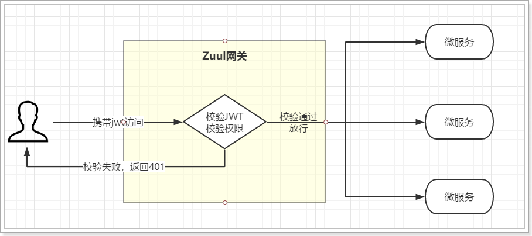


接下来，我们在Zuul编写拦截器，对用户的token进行校验，完成初步的权限判断。

## 1.1.流程分析

权限控制，一般有粗粒度、细粒度控制之分，但不管哪种，前提是用户必须先登录。知道访问者是谁，才能知道这个人具备怎样的权限，可以访问那些服务资源（也就是微服务接口）。

因此，权限控制的基本流程是这样：

- 1）获取用户的登录凭证jwt
- 2）解析jwt，获取用户身份
  - 如果解析失败，证明没有登录，返回401
  - 如果解析成功，继续向下
- 3）根据身份，查询用户权限信息
- 4）获取当前请求资源（微服务接口路径）
- 5）判断是否有访问资源的权限


一般权限信息会存储到数据库，会对应角色表和权限表：

- 角色：就是身份，例如普通用户，金钻用户，黑钻用户，商品管理员
- 权限：就是可访问的访问资源，如果是URL级别的权限控制，包含请求方式、请求路径、等信息

一个角色一般会有多个权限，一个权限也可以属于多个用户，属于多对多关系。根据角色可以查询到对应的所有权限，再根据权限判断是否可以访问当前资源即可。

在我们的功能中，因为还没有写权限功能，所以暂时只有一个角色，就是普通用户，可以访问的是商品及分类品牌等的查询功能，以及自己的信息。以后编写权限服务时，再补充相关业务。

## 1.2.加载公钥

权限控制的第一部分，就是获取cookie，并解析jwt，那么肯定需要公钥。我们在`ly-api-gateway`中配置公钥信息，并在服务启动时加载。

首先引入所需要的依赖：

```xml
<dependency>
    <groupId>com.leyou</groupId>
    <artifactId>ly-common</artifactId>
    <version>1.0.0-SNAPSHOT</version>
</dependency>
```

然后编写属性文件：

```yaml
ly:
  jwt:
    pubKeyPath: /Users/devlop/ssh/id_rsa.pub # 公钥地址
    user:
      cookieName: LY_TOKEN # cookie名称
```

编写属性类，读取公钥：

```java

@Data
@Slf4j
@ConfigurationProperties(prefix = "ly.jwt")
public class JwtProperties implements InitializingBean {
    /**
     * 公钥地址
     */
    private String pubKeyPath;
    
    private PublicKey publicKey;
    /**
     * 用户token相关属性
     */
    private UserTokenProperties user = new UserTokenProperties();

    @Data
    public class UserTokenProperties {
        /**
         * 存放token的cookie名称
         */
        private String cookieName;
    }

    @Override
    public void afterPropertiesSet() throws Exception {
        try {
            // 获取公钥和私钥
            this.publicKey = RsaUtils.getPublicKey(pubKeyPath);
        } catch (Exception e) {
            log.error("初始化公钥失败！", e);
            throw new RuntimeException(e);
        }
    }
}
```


## 1.3.编写过滤器逻辑

有了公钥，就可以编写权限控制逻辑了，权限验证通过，放行到微服务；不通过，则拦截并返回401给用户。因此拦截的逻辑需要在请求被路由之前执行，你能想到用什么实现吗？

没错，就是ZuulFilter。

ZuulFilter是Zuul的过滤器，其中pre类型的过滤器会在路由之前执行，刚好符合我们的需求。接下来，我们自定义pre类型的过滤器，并在过滤器中完成权限校验逻辑。


基本逻辑：

- 获取cookie中的token
- 通过JWT对token进行解析
  - 解析通过，继续权限校验
  - 解析不通过，返回401
- 根据用户身份获取权限信息
- 获取当前请求路径，判断权限
- 通过：则放行；不通过：则返回401

 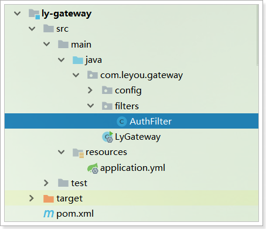

```java
package com.leyou.gateway.filters;

import com.leyou.common.auth.entity.Payload;
import com.leyou.common.auth.entity.UserInfo;
import com.leyou.common.auth.utils.JwtUtils;
import com.leyou.common.utils.CookieUtils;
import com.leyou.gateway.config.JwtProperties;
import com.netflix.zuul.ZuulFilter;
import com.netflix.zuul.context.RequestContext;
import com.netflix.zuul.exception.ZuulException;
import lombok.extern.slf4j.Slf4j;
import org.springframework.beans.factory.annotation.Autowired;
import org.springframework.boot.context.properties.EnableConfigurationProperties;
import org.springframework.cloud.netflix.zuul.filters.support.FilterConstants;
import org.springframework.stereotype.Component;

import javax.servlet.http.HttpServletRequest;


@Slf4j
@Component
@EnableConfigurationProperties(JwtProperties.class)
public class AuthFilter extends ZuulFilter {

    @Autowired
    private JwtProperties jwtProp;

    @Autowired
    private FilterProperties filterProp;

    @Override
    public String filterType() {
        return FilterConstants.PRE_TYPE;
    }

    @Override
    public int filterOrder() {
        return FilterConstants.FORM_BODY_WRAPPER_FILTER_ORDER - 1;
    }

    @Override
    public boolean shouldFilter() {
        return true;
    }

    @Override
    public Object run() throws ZuulException {
        // 获取上下文
        RequestContext ctx = RequestContext.getCurrentContext();
        // 获取request
        HttpServletRequest request = ctx.getRequest();
        // 获取token
        String token = CookieUtils.getCookieValue(request, jwtProp.getUser().getCookieName());
        // 校验
        try {
            // 解析token
            Payload<UserInfo> payload = JwtUtils.getInfoFromToken(token, jwtProp.getPublicKey(), UserInfo.class);
            // 解析没有问题，获取用户
            UserInfo user = payload.getUserInfo();
            // 获取用户角色，查询权限
            String role = user.getRole();
            // 获取当前资源路径
            String path = request.getRequestURI();
            String method = request.getMethod();
            // TODO 判断权限，此处暂时空置，等待权限服务完成后补充
            log.info("【网关】用户{},角色{}。访问服务{} : {}，", user.getUsername(), role, method, path);
        } catch (Exception e) {
            // 校验出现异常，返回403
            ctx.setSendZuulResponse(false);
            ctx.setResponseStatusCode(403);
            log.error("非法访问，未登录，地址：{}", request.getRemoteHost(), e );
        }
        return null;
    }
}
```

登录状态时，访问商品查询接口：

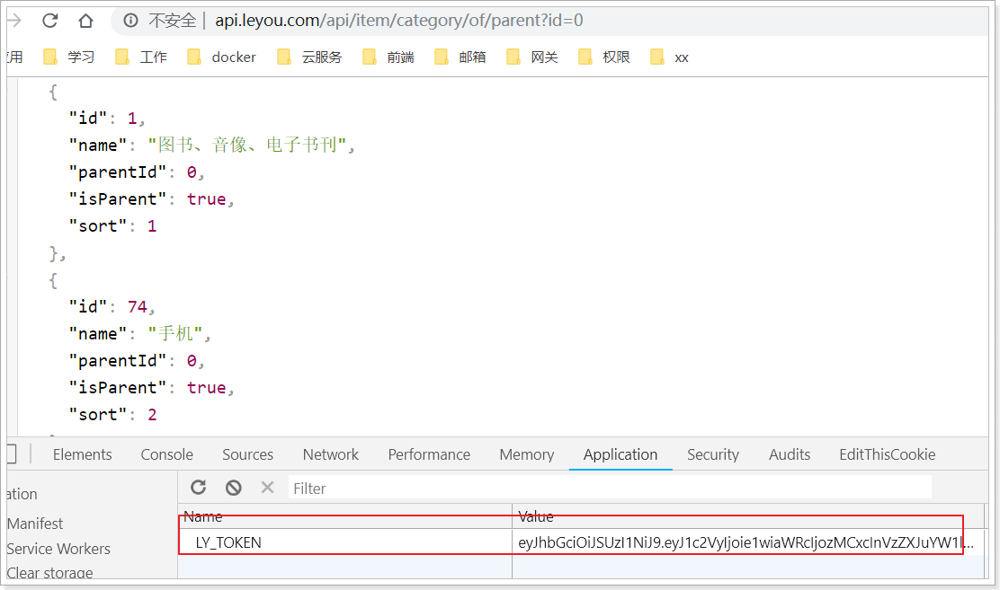

没有问题，可以访问。


退出登录，再次访问：

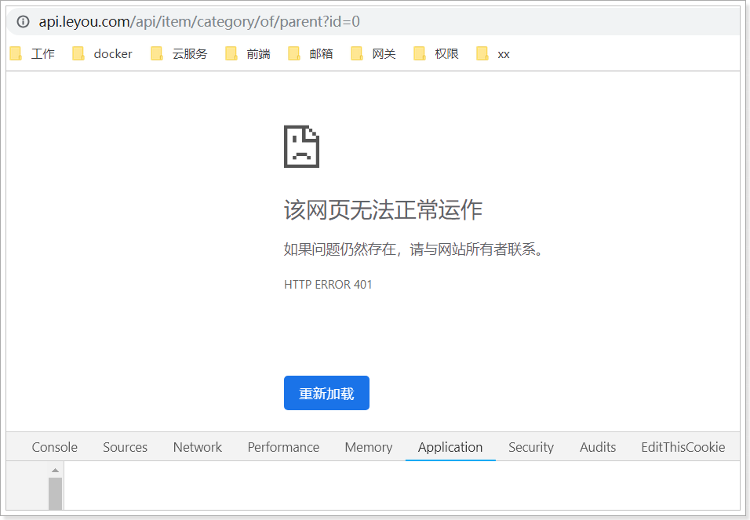

证明拦截器生效了！

## 1.4.白名单

此时我们尝试再次登录：

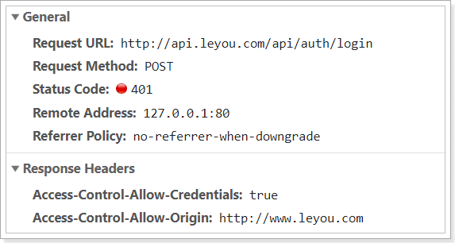 

登录接口也被拦截器拦截了！！！


要注意，并不是所有的路径我们都需要拦截，例如：

- 登录校验接口：`/auth/login`
- 注册接口：`/user/register`

  数据校验接口：`/user/check/`
- 发送验证码接口：`/user/code`
- 搜索接口：`/search/**`

另外，跟后台管理相关的接口，因为我们没有做登录和权限，因此暂时都放行，但是生产环境中要做登录校验：

- 后台商品服务：`/item/**`


所以，我们需要在拦截时，配置一个白名单，如果在名单内，则不进行拦截。

在`application.yaml`中添加规则：

```yaml
ly:
  filter:
    allowPaths:
      - /api/auth/login
      - /api/search
      - /api/user/register
      - /api/user/check
      - /api/user/code
      - /api/item
```

然后读取这些属性：

 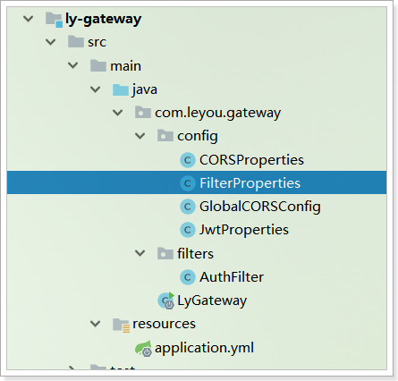

内容：

```java
@ConfigurationProperties(prefix = "ly.filter")
public class FilterProperties {

    private List<String> allowPaths;

    public List<String> getAllowPaths() {
        return allowPaths;
    }

    public void setAllowPaths(List<String> allowPaths) {
        this.allowPaths = allowPaths;
    }
}
```

在过滤器中的`shouldFilter`方法中添加判断逻辑：

 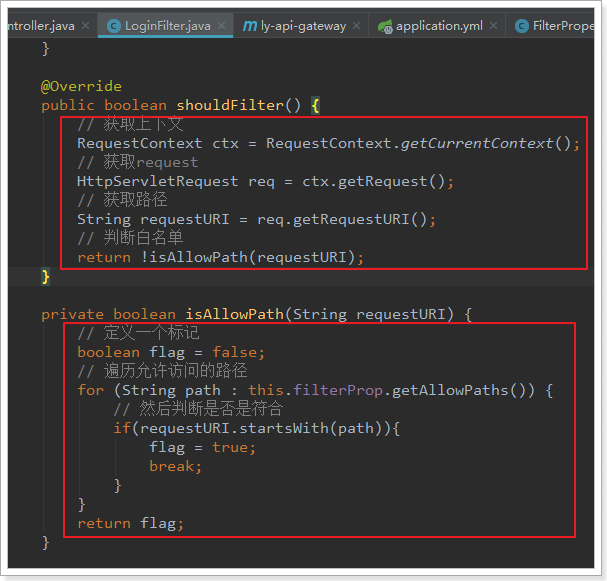

代码：

```java
package com.leyou.gateway.filters;

import com.leyou.common.auth.entity.Payload;
import com.leyou.common.auth.entity.UserInfo;
import com.leyou.common.auth.utils.JwtUtils;
import com.leyou.common.utils.CookieUtils;
import com.leyou.gateway.config.FilterProperties;
import com.leyou.gateway.config.JwtProperties;
import com.netflix.zuul.ZuulFilter;
import com.netflix.zuul.context.RequestContext;
import com.netflix.zuul.exception.ZuulException;
import lombok.extern.slf4j.Slf4j;
import org.springframework.beans.factory.annotation.Autowired;
import org.springframework.boot.context.properties.EnableConfigurationProperties;
import org.springframework.cloud.netflix.zuul.filters.support.FilterConstants;
import org.springframework.stereotype.Component;

import javax.servlet.http.HttpServletRequest;


@Slf4j
@Component
@EnableConfigurationProperties({JwtProperties.class, FilterProperties.class})
public class AuthFilter extends ZuulFilter {

    @Autowired
    private JwtProperties jwtProp;

    @Autowired
    private FilterProperties filterProp;

    @Override
    public String filterType() {
        return FilterConstants.PRE_TYPE;
    }

    @Override
    public int filterOrder() {
        return FilterConstants.FORM_BODY_WRAPPER_FILTER_ORDER - 1;
    }

    @Override
    public boolean shouldFilter() {
        // 获取上下文
        RequestContext ctx = RequestContext.getCurrentContext();
        // 获取request
        HttpServletRequest req = ctx.getRequest();
        // 获取路径
        String requestURI = req.getRequestURI();
        // 判断白名单
        return !isAllowPath(requestURI);
    }

    private boolean isAllowPath(String requestURI) {
        // 定义一个标记
        boolean flag = false;
        // 遍历允许访问的路径
        for (String path : this.filterProp.getAllowPaths()) {
            // 然后判断是否是符合
            if(requestURI.startsWith(path)){
                flag = true;
                break;
            }
        }
        return flag;
    }

    @Override
    public Object run() throws ZuulException {
        // 获取上下文
        RequestContext ctx = RequestContext.getCurrentContext();
        // 获取request
        HttpServletRequest request = ctx.getRequest();
        // 获取token
        String token = CookieUtils.getCookieValue(request, jwtProp.getUser().getCookieName());
        // 校验
        try {
            // 解析token
            Payload<UserInfo> payload = JwtUtils.getInfoFromToken(token, jwtProp.getPublicKey(), UserInfo.class);
            // 解析没有问题，获取用户
            UserInfo user = payload.getUserInfo();
            // 获取用户角色，查询权限
            String role = user.getRole();
            // 获取当前资源路径
            String path = request.getRequestURI();
            String method = request.getMethod();
            // TODO 判断权限，此处暂时空置，等待权限服务完成后补充
            log.info("【网关】用户{},角色{}。访问服务{} : {}，", user.getUsername(), role, method, path);
        } catch (Exception e) {
            // 校验出现异常，返回403
            ctx.setSendZuulResponse(false);
            ctx.setResponseStatusCode(403);
            log.error("非法访问，未登录，地址：{}", request.getRemoteHost(), e );
        }
        return null;
    }
}
```


# 了解知识：

## 1、bootstrap.yml 和 application.yml

bootstrap.yml（bootstrap.properties）用来程序引导时执行，应用于更加早期配置信息读取，如可以使用来配置application.yml中使用到参数等

application.yml（application.properties) 应用程序特有配置信息，可以用来配置后续各个模块中需使用的公共参数等。

bootstrap.yml 先于 application.yml 加载

技术上，bootstrap.yml 是被一个父级的 Spring ApplicationContext 加载的。

这个父级的 Spring ApplicationContext是先加载的，在加载application.yml 的 ApplicationContext之前。

可以通过设置`spring.cloud.bootstrap.enabled=false`来禁用`bootstrap`。

## 2、Spring Boot多环境配置切换

一般在一个项目中，总是会有好多个环境。

比如：开发环境 -> 测试环境 -> 预发布环境 -> 生产环境。

每个环境上的配置文件总是不一样的，甚至开发环境中每个开发者的环境可能也会有一点不同，配置读取可是一个让人有点伤脑筋的问题。

Spring Boot提供了一种优先级配置读取的机制来帮助我们从这种困境中走出来。

常规情况下，我们都知道Spring Boot的配置会从`application.yml或.properties`中读取

根据Spring Boot的文档,配置使用的优先级从高到低的顺序，具体如下所示：

```
1. 命令行参数。
2. 通过 System.getProperties() 获取的 Java 系统参数。
3. 操作系统环境变量。
4. 从 java:comp/env 得到的 JNDI 属性。
5. 通过 RandomValuePropertySource 生成的“random.*”属性。
6. 应用 Jar 文件之外的属性文件(application.properties/yml)。
7. 应用 Jar 文件内部的属性文件(application.properties/yml)。
8. 在应用配置 Java 类（包含“@Configuration”注解的 Java 类）中通过“@PropertySource”注解声明的属性文件。
9. 通过“SpringApplication.setDefaultProperties”声明的默认属性。
```

这意味着，如果Spring Boot在优先级更高的位置找到了配置，那么它就会无视低级的配置。

方法一、不在配置文件写上配置节定义，而是通过执行时定位不同配置文件来区分。如：

```shell
java -jar demo.jar --spring.config.location=/path/test_evn.properties
```

方法二、在配置文件写上配置节定义，在执行时传递配置节需激活定义名称来区分。

一般情况下我们这样定义环境：dev :开发，test：测试环境，prod：生产环境

在yml 文件中配置的话，写法如下：

```yaml
spring:
  profiles:
    active: prod #生产环境
  datasource:
    driver-class-name: com.mysql.jdbc.Driver
    url: jdbc:mysql://127.0.0.1:3306/test
    username: root
    password: root
```

启动Jar包的时候：Java -jar xxxxxx.jar spring.profiles.active=prod 也可以这样启动设置配置文件，但是这只是用于开发和测试

# 2 集中配置组件SpringCloudConfig 

## 2.1 Spring Cloud Config简介 

​	在分布式系统中，由于服务数量巨多，为了方便服务配置文件统一管理，实时更新，所以需要分布式配置中心组件。在Spring Cloud中，有分布式配置中心组件spring cloud config ，它支持配置服务放在配置服务的内存中（即本地），也支持放在远程Git仓库中。在spring cloud config 组件中，分两个角色，一是config server，二是config client。

​	Config Server是一个可横向扩展、集中式的配置服务器，它用于集中管理应用程序各个环境下的配置，默认使用Git存储配置文件内容，也可以使用SVN存储，或者是本地文件存储。

​	Config Client是Config Server的客户端，用于操作存储在Config Server中的配置内容。微服务在启动时会请求Config Server获取配置文件的内容，请求到后再启动容器。

详细内容看在线文档： https://springcloud.cc/spring-cloud-config.html

## 2.2 配置服务端 

### 2.2.1 将配置文件提交到码云 

​	使用GitHub时，国内的用户经常遇到的问题是访问速度太慢，有时候还会出现无法连接的情况。如果我们希望体验Git飞一般的速度，可以使用国内的Git托管服务——[码云](https://gitee.com/)（[gitee.com](https://gitee.com/)）。

​	和GitHub相比，码云也提供免费的Git仓库。此外，还集成了代码质量检测、项目演示等功能。对于团队协作开发，码云还提供了项目管理、代码托管、文档管理的服务。

步骤：

（1）浏览器打开gitee.com，注册用户 ，注册后登陆码云管理控制台

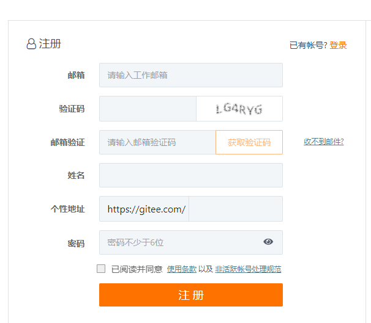


（2）创建仓库  leyou-config  (点击右上角的加号 ，下拉菜单选择创建项目)


（3）上传配置文件，将ly_item_service工程的application.yml改名为item-dev.yml后上传

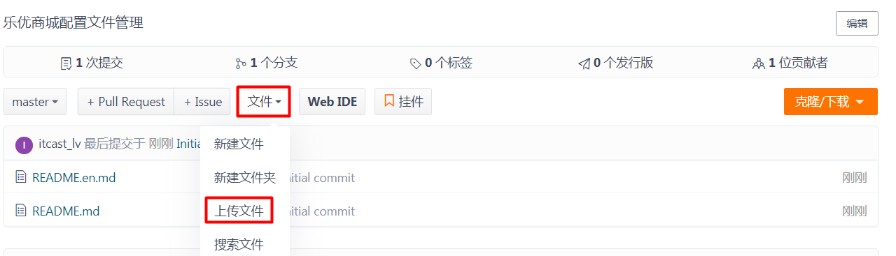

可以通过拖拽的方式将文件上传上去

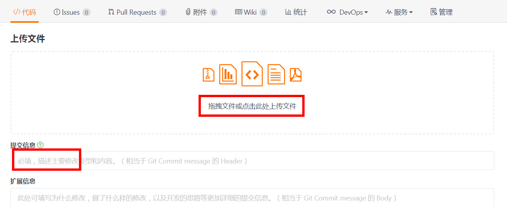

上传成功后列表可见

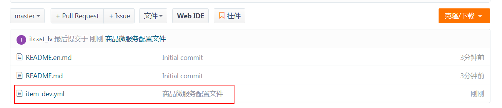

可以再次编辑此文件

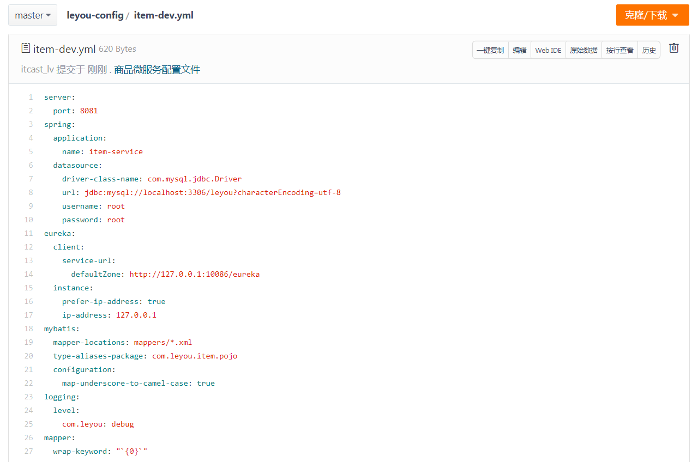

文件命名规则：

{application}-{profile}.yml或{application}-{profile}.properties

application为应用名称 profile指的开发环境（用于区分开发环境，测试环境、生产环境等）

（4）复制git地址 ,备用

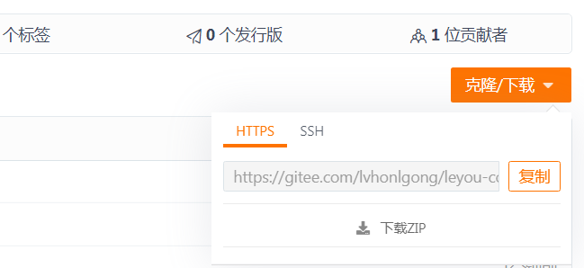

地址为：https://gitee.com/chuanzhiliubei/tensquare-config.git

### 2.2.2 配置中心微服务 

（1）创建工程模块 配置中心微服务  ly_config   ,pom.xml引入依赖

```xml
    <dependencies>
        <dependency>
            <groupId>org.springframework.cloud</groupId>
            <artifactId>spring-cloud-config-server</artifactId>
        </dependency>
        <dependency>
            <groupId>org.springframework.boot</groupId>
            <artifactId>spring-boot-starter-actuator</artifactId>
        </dependency>
    </dependencies>
```

（2）创建启动类ConfigServerApplication

```java
@EnableConfigServer //开启配置服务
@SpringBootApplication
public class LyConfigServerApplication {
    public static void main(String[] args) {
        SpringApplication.run(LyConfigServerApplication.class, args);
    }
}
```

（3）编写配置文件application.yml

```yaml
spring:
  application:
    name: config-service
  cloud:
    config:
      server:
        git:
          uri: https://gitee.com/xxx/leyou-config.git
server:
  port: 12000
```

（4）浏览器测试：http://localhost:12000/item-dev.yml 可以看到配置内容

## 2.3 配置客户端 

（1）在leyou_item_service工程添加依赖

```xml
		<dependency>
		  <groupId>org.springframework.cloud</groupId>
		  <artifactId>spring-cloud-starter-config</artifactId>
		</dependency>
```

（2）添加bootstrap.yml ,删除application.yml 

```yaml
spring:
  cloud:
    config:
      name: item
      profile: dev
      label: master
      uri: http://127.0.0.1:12000
```

（3）测试： 启动工程ly_registry、ly_config、ly_item_service，看是否可以正常运行

# 3 消息总线组件SpringCloudBus 

## 3.1 SpringCloudBus简介 

​	如果我们更新码云中的配置文件，那客户端工程是否可以及时接受新的配置信息呢？我们现在来做有一个测试，修改一下码云中的配置文件中mysql的端口 或者连接不同mysql服务器 ，然后测试数据依然可以查询出来，证明修改服务器中的配置并没有更新立刻到工程，只有重新启动程序才会读取配置。 那我们如果想在不重启微服务的情况下更新配置如何来实现呢?  我们使用SpringCloudBus来实现配置的自动更新。

## 3.2 代码实现

### 3.2.1 配置服务端 

（1）修改ly_config工程的pom.xml，引用依赖

```xml
<dependency>
    <groupId>org.springframework.cloud</groupId>
    <artifactId>spring-cloud-starter-bus-amqp</artifactId>
</dependency>
```

（2）修改application.yml ，添加配置

```yaml
spring:
  rabbitmq:
    host: 127.0.0.1
    port: 5672
    virtual-host: /leyou
    username: leyou
    password: leyou
management: #暴露触发消息总线的地址
  endpoints:
    web:
      exposure:
        include: bus-refresh
```

### 3.2.2 配置客户端 

我们还是以商品微服务模块为例，加入消息总线

（1）修改ly_item_service工程 ，引入依赖

```xml
<dependency>
    <groupId>org.springframework.cloud</groupId>
    <artifactId>spring-cloud-starter-bus-amqp</artifactId>
</dependency>
```

（2）在码云的配置文件中配置rabbitMQ的地址：

```yaml
spring:
  rabbitmq:
    host: 127.0.0.1
    port: 5672
    virtual-host: /leyou
    username: leyou
    password: leyou
```

（3）启动ly_registry、ly_config、ly_item_service  看是否正常运行

（4）修改码云上的配置文件 ，将数据库连接IP  改为127.0.0.1  ，在本地部署一份数据库。

（5）postman测试    Url: http://127.0.0.1:12000/actuator/bus-refresh   Method: post  

（6）再次观察输出的数据是否是读取了本地的mysql数据。

### 3.2.3 自定义配置的读取 

（1）修改码云上的配置文件，增加自定义配置

```
sms:
  ip: 127.0.0.1
```

（2）在ly_item_service工程中新建controller

```java

@RestController
public class TestController {
    @Value("${sms.ip}")
    private String ip;

    @RequestMapping(value = "/ip", method = RequestMethod.GET)
    public String ip() {
        return ip;
    }
}
```

（3）运行测试看是否能够读取配置信息  ，OK.

（4）修改码云上的配置文件中的自定义配置

```
sms:
  ip: 127.0.0.1
```

（5）通过postman测试    Url: http://127.0.0.1:12000/actuator/bus-refresh   Method: post    

测试后观察,发现并没有更新信息。

这是因为我们的 controller少了一个注解@RefreshScope  此注解用于刷新配置

```java
@RefreshScope
@RestController
public class TestController {
    ///......
}
```

添加后再次进行测试。

### 3.2.4 完成乐优商城工程的配置集中管理 

步骤：

（1）将每一个工程的配置文件提取出来，重命名

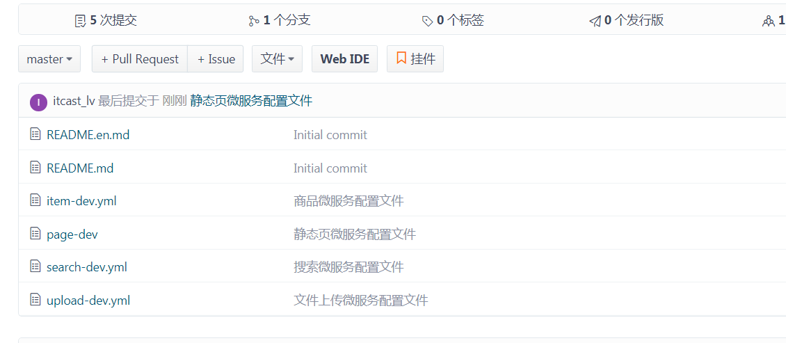

（2）将这些文件上传到码云

（3）修改每一个微服务工程，pom.xml中添加依赖

```xml
  <dependency>
    <groupId>org.springframework.cloud</groupId>
    <artifactId>spring-cloud-starter-config</artifactId>
</dependency>
<dependency>
    <groupId>org.springframework.cloud</groupId>
    <artifactId>spring-cloud-starter-bus-amqp</artifactId>
</dependency>
```

（4）删除每一个微服务的application.yml

（5）为每一个微服务添加bootstrap.yml  （参考tesquare_base工程）

（6）修改码云上的配置文件添加rabbitmq地址

```
spring:
  rabbitmq:
    host: 127.0.0.1
    port: 5672
    virtual-host: /leyou
    username: leyou
    password: leyou
```


# 3.面试常见问题

- 你们使用JWT做登录凭证，如何解决token注销问题

  答：jwt的缺陷是token生成后无法修改，因此无法让token失效。只能采用其它方案来弥补，基本思路如下：

  	1）适当减短token有效期，让token尽快失效
  	
  	2）删除客户端cookie
  	
  	3）服务端对失效token进行标记，形成黑名单，虽然有违无状态特性，但是因为token有效期短，因此标记 	时间也比较短。服务器压力会比较小

- 既然token有效期短，怎么解决token失效后的续签问题？

  答：在验证用户登录状态的代码中，添加一段逻辑：判断cookie即将到期时，重新生成一个token。比如token有效期为30分钟，当用户请求我们时，我们可以判断如果用户的token有效期还剩下10分钟，那么就重新生成token。因此用户只要在操作我们的网站，就会续签token

- 如何解决异地登录问题？

  答：在我们的应用中是允许用户异地登录的。如果要禁止用户异地登录，只能采用有状态方式，在服务端记录登录用户的信息，并且判断用户已经登录，并且在其它设备再次登录时，禁止登录请求，并要求发送短信验证。

- 如何解决cookie被盗用问题？

  答：cookie被盗用的可能性主要包括下面几种：

  - XSS攻击：这个可以再前端页面渲染时对 数据做安全处理即可，而且我们的cookie使用了Httponly为true，可以防止JS脚本的攻击。
  - CSRF攻击：
    - 我们严格遵循了Rest风格，CSRF只能发起Get请求，不会对服务端造成损失，可以有效防止CSRF攻击
    - 利用Referer头，防盗链
  - 抓包，获取用户cookie：我们采用了HTTPS协议通信，无法获取请求的任何数据
  - 请求重放攻击：对于普通用户的请求没有对请求重放做防御，而是对部分业务做好了幂等处理。运行管理系统中会对token添加随机码，认证token一次有效，来预防请求重放攻击。
  - 用户电脑中毒：这个无法防范。

- 如何解决cookie被篡改问题？

  - 答：cookie可以篡改，但是签名无法篡改，否则服务端认证根本不会通过

- 如何完成权限校验的？

  - 首先我们有权限管理的服务，管理用户的各种权限，及可访问路径等
  - 在网关zuul中利用Pre过滤器，拦截一切请求，在过滤器中，解析jwt，获取用户身份，查询用户权限，判断用户身份可以访问当前路径


