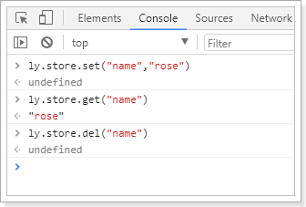
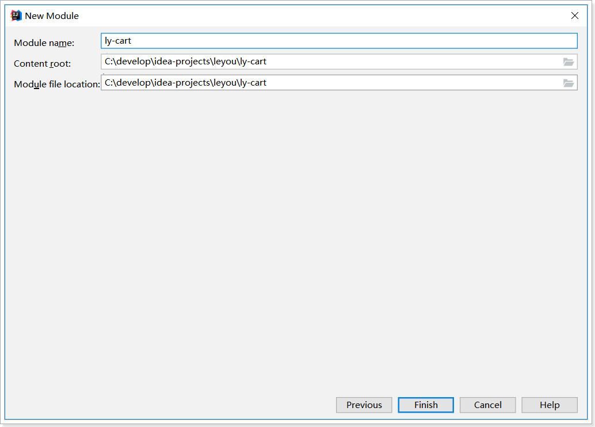

# 0.学习目标

- 了解购物车功能流程
- 实现未登录下购物车功能
- 实现已登录下购物车功能

# 1.购物车功能分析

## 1.1.需求

需求描述：

- 用户可以在登录状态下将商品添加到购物车
- 用户可以在未登录状态下将商品添加到购物车
- 用户可以使用购物车一起结算下单
- 用户可以查询自己的购物车
- 用户可以在购物车中可以修改购买商品的数量。
- 用户可以在购物车中删除商品。
- *在购物车中展示商品优惠信息*
- 提示购物车商品价格变化
- 提示商品是否下架
- 提示商品库存是否充足
- 对商品结算下单


## 1.2.业务分析

在需求描述中，不管用户是否登录，都需要实现加入购物车功能，那么已登录和未登录下，购物车数据应该存放在哪里呢？

> 未登录购物车

用户如果未登录，将数据保存在服务端存在一些问题：

- 无法确定用户身份，需要借助与客户端存储识别身份
- 服务端数据存储压力增加，而且可能是无效数据

那么我们应该用把数据保存在客户端，这样每个用户保存自己的数据，就不存在身份识别的问题了，而且也解决了服务端数据存储压力问题。

> 已登录购物车

用户登录时，数据保存在哪里呢？

大家首先想到的应该是数据库，不过购物车数据比较特殊，读和写都比较频繁，存储数据库压力会比较大。因此我们可以考虑存入Redis中。

不过大家可能会担心Redis存储空间问题，我们可以效仿淘宝，限制购物车最多只能添加99件商品，或者更少。


# 2.未登录购物车

## 2.1.数据结构

首先分析一下未登录购物车的数据结构。

我们看下页面展示需要什么数据：


因此每一个购物车信息，都是一个对象，包含：

```js
{
    skuId:2131241,
    title:"小米6",
    image:"",
    price:190000,
    num:1,
    ownSpec:"{"机身颜色":"陶瓷黑尊享版","内存":"6GB","机身存储":"128GB"}"
}
```

另外，购物车中不止一条数据，因此最终会是对象的数组。即：

```js
[
    {...},{...},{...}
]
```


## 2.2.web本地存储

知道了数据结构，下一个问题，就是如何保存购物车数据。前面我们分析过，可以使用Localstorage来实现。Localstorage是web本地存储的一种，那么，什么是web本地存储呢？

### 2.2.1.什么是web本地存储？


web本地存储主要有两种方式：

- LocalStorage：localStorage 方法存储的数据没有时间限制。第二天、第二周或下一年之后，数据依然可用。 
- SessionStorage：sessionStorage 方法针对一个 session 进行数据存储。当用户关闭浏览器窗口后，数据会被删除。 


### 2.2.2.LocalStorage的用法

语法非常简单：

 

```js
localStorage.setItem("key","value"); // 存储数据
localStorage.getItem("key"); // 获取数据
localStorage.removeItem("key"); // 删除数据
```

注意：**localStorage和SessionStorage都只能保存字符串**。

不过，在我们的common.js中，已经对localStorage进行了简单的封装：

 


示例：

 

## 2.3.添加购物车

购物车的前端js和页面都已经实现好了，我们在商品详情页面，点击加入购物车按钮：

 

即可将数据加入localstorage中：


同时，页面会跳转到购物车列表页面，不过，现在看不到任何商品：


## 2.4.购物车查询最新Sku数组列表

> 业务分析

我们进入购物车列表页，会看到控制台记录了一次请求：

 

这其实是在渲染前，要查询sku信息。

可能大家会问，之前的购物车数据中，已经有了图片、价格等信息，为什么这里还要查询sku数据呢？

还记得之前我们的需求吗，我们要做价格对比，而且购物车中的商品很可能已经下架了，需要去查询并且做出判断，在页面中渲染。


> 商品sku查询接口

分析请求：

- 请求方式：Get
- 请求路径：/api/item/sku/list，证明是商品微服务，商品查询都是以/api/item开头。
- 请求参数：ids，是购物车中多个sku的id以`,`分割的字符串
- 返回结果：sku的集合，里面需要有价格、库存，用来提示用户

接下来我们就在`ly-item-service`中的来实现查询代码

首先是`GoodsController`中，添加新的接口 ：

```java
/**
     * 根据id批量查询sku
     * @param ids skuId的集合
     * @return sku的集合
     */
@GetMapping("sku/list")
public ResponseEntity<List<SkuDTO>> querySkuByIds(@RequestParam("ids") List<Long> ids) {
    return ResponseEntity.ok(this.goodsService.querySkuListByIds(ids));
}
```

Service：

```java
public List<SkuDTO> querySkuListByIds(List<Long> ids) {
    // 查询sku
    List<Sku> skuList = skuMapper.selectByIdList(ids);
    if(CollectionUtils.isEmpty(skuList)){
        throw new LyException(ExceptionEnum.GOODS_NOT_FOUND);
    }
    return BeanHelper.copyWithCollection(skuList, SkuDTO.class);
}
```

刷新购物车页面，查看：


## 2.5.修改和删除购物车

页面JS已经实现，都是直接使用localstorage实现，离线即可完成，无需与后台服务端交互。

另外，清除下架商品，删除选中商品等按钮功能暂时没有完成，大家可以作为作业实现。


# 3.搭建购物车服务

接下来是已登录的购物车，我们需要创建独立微服务，实现购物车功能。

## 3.1.创建module




## 3.2.pom依赖

```xml
<?xml version="1.0" encoding="UTF-8"?>
<project xmlns="http://maven.apache.org/POM/4.0.0"
         xmlns:xsi="http://www.w3.org/2001/XMLSchema-instance"
         xsi:schemaLocation="http://maven.apache.org/POM/4.0.0 http://maven.apache.org/xsd/maven-4.0.0.xsd">
    <parent>
        <artifactId>leyou</artifactId>
        <groupId>com.leyou</groupId>
        <version>1.0.0-SNAPSHOT</version>
    </parent>
    <modelVersion>4.0.0</modelVersion>

    <artifactId>ly-cart</artifactId>

    <dependencies>
        <dependency>
            <groupId>org.springframework.boot</groupId>
            <artifactId>spring-boot-starter-web</artifactId>
        </dependency>
        <dependency>
            <groupId>org.springframework.cloud</groupId>
            <artifactId>spring-cloud-starter-netflix-eureka-client</artifactId>
        </dependency>
        <dependency>
            <groupId>org.springframework.boot</groupId>
            <artifactId>spring-boot-starter-data-redis</artifactId>
        </dependency>
        <dependency>
            <groupId>com.leyou</groupId>
            <artifactId>ly-common</artifactId>
            <version>1.0.0-SNAPSHOT</version>
        </dependency>
    </dependencies>
    <build>
        <plugins>
            <plugin>
                <groupId>org.springframework.boot</groupId>
                <artifactId>spring-boot-maven-plugin</artifactId>
            </plugin>
        </plugins>
    </build>
</project>
```

## 3.3.配置文件

```yaml
server:
  port: 8088
spring:
  application:
    name: cart-service
  redis:
    host: 192.168.150.101
eureka:
  client:
    service-url:
      defaultZone: http://127.0.0.1:10086/eureka
  instance:
    prefer-ip-address: true
    ip-address: 127.0.0.1
```

## 3.4.启动类

```java
@SpringBootApplication
@EnableDiscoveryClient
public class LyCartApplication {

    public static void main(String[] args) {
        SpringApplication.run(LyCartApplication.class, args);
    }
}
```

## 3.5.网关路由

在ly-gateway中添加路由：

 


## 3.6.项目结构

 


# 4.已登录购物车

接下来，我们完成已登录购物车。

## 4.1.获取登录用户信息

购物车系统只负责登录状态的购物车处理，因此需要想办法获取登录的用户信息，如何才能获取呢？

### 4.1.1.思路分析

要获取登录的用户信息，有以下几种方式：

- 方式一：页面直接把用户作为请求参数传递
  - 优点：简单，方便，代码量为0
  - 缺点：不安全，因为调用购物车CRUD的请求是从页面发过来的，我们不能确定这个传递来的id是不是真的是用户的id
- 方式二：自己从cookie的token中解析JWT
  - 优点：安全
  - 缺点：
    - 需要重复校验JWT，已经在网关中做过了
    - 代码麻烦
- 方案三：在网关校验用户的时候，把用户信息传递到后面的微服务
  - 优点：安全，并且微服务不需要自己解析
  - 缺点：
    - 需要在网关加入新的逻辑
    - 微服务也要写回去用户的逻辑，代码麻烦


以上两种方式各有一定的优缺点，不存在对与错，不同业务时的取舍问题。

我们选择方式二，但是方式二中的需要解析JWT，性能太差，因为token中的载荷是BASE64编码，可以不用验证jwt，直接解析载荷即可。

需要在JwtUtils中添加一个新的工具，作用是利用Base64解析载荷，而不做签名校验：

```java
private static final Decoder<String, byte[]> strgDecoder = Decoders.BASE64URL;
/**
     * 获取token中的载荷信息
     *
     * @param token     用户请求中的令牌
     * @return 用户信息
     */
public static <T> Payload<T> getInfoFromToken(String token, Class<T> userType) throws UnsupportedEncodingException {
    String payloadStr = StringUtils.substringBetween(token, ".");
    byte[] bytes = stringDecoder.decode(payloadStr);
    String json = new String(bytes, "UTF-8");
    Map<String, String> map = JsonUtils.toMap(json, String.class, String.class);
    Payload<T> claims = new Payload<>();
    claims.setId(map.get("jti"));
    claims.setExpiration(new Date(Long.valueOf(map.get("exp"))));
    claims.setUserInfo(JsonUtils.toBean(map.get("user"), userType));
    return claims;
}
```

### 4.1.2.在购物车服务获取用户

#### 思路分析

购物车中的每个业务都需要获取当前登录的用户信息，如果在每个接口中都写这样一段逻辑，显然是冗余的。我们是不是可以利用AOP的思想，拦截每一个进入controller的请求，统一完成登录用户的获取呢。

因此，这里获取登录用户有两步要操作：

- 编写AOP拦截，统一获取登录用户
  - 这个可以使用SpringMVC的通用拦截器：`HandlerInterceptor`来实现
- 把用户保存起来，方便后面的controller使用
  - 保存用户信息到哪里呢？
  - 每次请求都有不同的用户信息，在并发请求情况下，必须保证每次请求保存的用户信息互不干扰，线程独立。

#### ThreadLocal保存用户信息

在并发请求情况下，因为每次请求都有不同的用户信息，我们必须保证每次请求保存的用户信息互不干扰，线程独立。

注意：这里不是**解决多线程资源共享问题，而是要保证每个线程都有自己的用户资源，互不干扰**。

而JDK中提供的`ThreadLocal`恰好满足这个需求，那么ThreadLocal是如何实现这一需求的呢？

看下这幅图：

  

关键点：

- 每个线程（`Thread`）内部都持有一个`ThreadLocalMap`对象。
- `ThreadLocalMap`的Key是某个`ThreadLocal`对象，值是任意Object。
- 不同线程，内部有自己的`ThreadLocalMap`，因此Map中的资源互相不会干扰。


数据在堆栈中的存储示意图：


下面我们定义容器，存储用户数据，因为以后其它服务也可能用，我们定义到`ly-common`中：

```java
package com.leyou.common.threadlocals;

/**
 * @author 黑马程序员
 */
public class UserHolder {
    private static final ThreadLocal<Long> TL = new ThreadLocal<>();

    public static void setUser(Long userId) {
        TL.set(userId);
    }

    public static Long getUser() {
        return TL.get();
    }

    public static void removeUser() {
        TL.remove();
    }
}
```

 


#### 获取用户信息并保持

最后一步，定义SpringMVC的拦截器，在拦截器中获取用户信息，并保存到ThreadLocal中即可。

首先是定义拦截器：

```java
package com.leyou.cart.interceptors;

import com.leyou.cart.utils.UserHolder;
import com.leyou.common.auth.entity.Payload;
import com.leyou.common.auth.entity.UserInfo;
import com.leyou.common.auth.utils.JwtUtils;
import com.leyou.common.utils.CookieUtils;
import lombok.extern.slf4j.Slf4j;
import org.springframework.web.servlet.HandlerInterceptor;

import javax.servlet.http.HttpServletRequest;
import javax.servlet.http.HttpServletResponse;

/**
 * @author 黑马程序员
 */
@Slf4j
public class UserInterceptor implements HandlerInterceptor {

    private static final String COOKIE_NAME = "LY_TOKEN";

    @Override
    public boolean preHandle(HttpServletRequest request, HttpServletResponse response, Object handler) {
        try {
            // 获取cookie中的token
            String token = CookieUtils.getCookieValue(request, COOKIE_NAME);
            // 解析token中的用户
            Payload<UserInfo> payload = JwtUtils.getInfoFromToken(token, UserInfo.class);
            // 保存用户
            UserHolder.setUser(payload.getUserInfo());
            return true;
        } catch (Exception e) {
            // 解析失败，不继续向下
            log.error("【购物车服务】解析用户信息失败！", e);
            return false;
        }
    }

    @Override
    public void afterCompletion(HttpServletRequest request, HttpServletResponse response, Object handler, Exception ex) {
        UserHolder.remove();
    }
}
```

然后配置到SpringMVC中：

```java
package com.leyou.cart.config;

import com.leyou.cart.interceptor.UserInterceptor;
import org.springframework.context.annotation.Configuration;
import org.springframework.web.servlet.config.annotation.InterceptorRegistry;
import org.springframework.web.servlet.config.annotation.WebMvcConfigurer;

/**
 * @author 黑马程序员
 */
@Configuration
public class MvcConfig implements WebMvcConfigurer {
    @Override
    public void addInterceptors(InterceptorRegistry registry) {
        registry.addInterceptor(new UserInterceptor()).addPathPatterns("/**");
    }
}
```

 


## 4.2.后台购物车设计

### 数据结构设计

当用户登录时，我们需要把购物车数据保存到后台，可以选择保存在数据库。但是购物车是一个读写频率很高的数据。因此我们这里选择读写效率比较高的Redis作为购物车存储。

Redis有5种不同数据结构，这里选择哪一种比较合适呢？

- 首先不同用户应该有独立的购物车，因此购物车应该以用户的作为key来存储，Value是用户的所有购物车信息。这样看来基本的`k-v`结构就可以了。
- 但是，我们对购物车中的商品进行增、删、改操作，基本都需要根据商品id进行判断，为了方便后期处理，我们的购物车也应该是`k-v`结构，key是商品id，value才是这个商品的购物车信息。

综上所述，我们的购物车结构是一个双层Map：Map<String,Map<String,String>>

- 第一层Map，Key是用户id
- 第二层Map，Key是购物车中商品id，值是购物车数据

### 实体类

后台的购物车结构与前台是一样的：

```java
package com.leyou.cart.entity;

import lombok.Data;

@Data
public class Cart {
    private Long skuId;// 商品id
    private String title;// 标题
    private String image;// 图片
    private Long price;// 加入购物车时的价格
    private Integer num;// 购买数量
    private String ownSpec;// 商品规格参数
}
```


## 4.3.添加商品到购物车

### 4.3.1.页面发起请求：

我们再次回到商品详情页，登录以后，点击加入购物车，发现控制台发起了请求：

 

这里发起的是Json格式数据。那么我们后台也要以json接收。

### 4.3.2.后台添加购物车

#### controller

先分析一下：

- 请求方式：新增，肯定是Post
- 请求路径：/cart ，这个其实是Zuul路由的路径，我们可以不管
- 请求参数：Json对象，包含购物车的所有属性，我们可以用购物车对象介绍
- 返回结果：无

```java
@RequestMapping
public class CartController {

    @Autowired
    private CartService cartService;

    /**
     * 添加购物车
     *
     * @return
     */
    @PostMapping
    public ResponseEntity<Void> addCart(@RequestBody Cart cart) {
        this.cartService.addCart(cart);
        return ResponseEntity.ok().build();
    }
}
```

#### Service

这里我们不访问数据库，而是直接操作Redis。基本思路：

- 先查询之前的购物车数据
- 判断要添加的商品是否存在
  - 存在：则直接修改数量后写回Redis
  - 不存在：新建一条数据，然后写入Redis

代码：

```java
package com.leyou.cart.service;

import com.leyou.cart.entity.Cart;
import com.leyou.common.threadlocals.UserHolder;
import com.leyou.common.utils.JsonUtils;
import lombok.extern.slf4j.Slf4j;
import org.springframework.beans.factory.annotation.Autowired;
import org.springframework.data.redis.core.BoundHashOperations;
import org.springframework.data.redis.core.StringRedisTemplate;
import org.springframework.stereotype.Service;

@Service
public class CartService {

    @Autowired
    private StringRedisTemplate redisTemplate;

    private static final String KEY_PREFIX = "ly:cart:uid:";

    public void addCart(Cart cart) {
        // 获取当前用户
        String key = KEY_PREFIX + UserHolder.getUser().getId();

        // 获取hash操作的对象，并绑定用户id
        BoundHashOperations<String, String, String> hashOps = redisTemplate.boundHashOps(key);

        // 获取商品id，作为hashKey
        String hashKey = cart.getSkuId().toString();
        // 获取数量
        int num = cart.getNum();
        // 判断要添加的商品是否存在
        Boolean boo = hashOps.hasKey(hashKey);
        if(boo != null && boo){
            // 存在，修改数量
            cart = JsonUtils.toBean(hashOps.get(hashKey), Cart.class);
            cart.setNum(num + cart.getNum());
        }
        // 写入redis
        hashOps.put(hashKey, JsonUtils.toString(cart));
    }
}
```


### 4.3.3.结果：

 


## 4.4.查询购物车

### 4.4.1.页面发起请求

我们进入购物车列表页面，然后刷新页面，查看控制台的请求：

 

### 4.4.2.后台实现

请求分析：

- 请求方式：Get
- 请求路径：/list
- 请求参数：无
- 返回结果：当前用户的购物车集合


> Controller

```java
/**
 * 查询购物车列表
 *
 * @return
 */
@GetMapping("list")
public ResponseEntity<List<Cart>> queryCartList() {
    List<Cart> carts = this.cartService.queryCartList();
    if (carts == null) {
        return ResponseEntity.status(HttpStatus.NOT_FOUND).body(null);
    }
    return ResponseEntity.ok(carts);
}
```

> Service

```java
public List<Cart> queryCartList() {
    // 获取登录用户
    String key = KEY_PREFIX + UserHolder.getUser().getId();
    // 判断是否存在购物车
    Boolean boo = this.redisTemplate.hasKey(key);
    if(boo == null || !boo){
        // 不存在，直接返回
        throw new LyException(ExceptionEnum.CARTS_NOT_FOUND);
    }
    BoundHashOperations<String, String, String> hashOps = this.redisTemplate.boundHashOps(key);
    // 判断是否有数据
    Long size = hashOps.size();
    if(size == null || size < 0){
        // 不存在，直接返回
        throw new LyException(ExceptionEnum.CARTS_NOT_FOUND);
    }
    List<String> carts = hashOps.values();
    // 查询购物车数据
    return carts.stream()
        .map(json -> JsonUtils.toBean(json, Cart.class))
        .collect(Collectors.toList());
}
```


### 4.4.3.测试

 


## 4.5.修改商品数量

### 4.5.1.页面发起请求

 

### 4.5.2.后台实现

> Controller

```java
@PutMapping
public ResponseEntity<Void> updateNum(@RequestParam("id") Long skuId, 
                                      @RequestParam("num") Integer num) {
    this.cartService.updateNum(skuId, num);
    return ResponseEntity.ok().build();
}
```

> Service

```java
public void updateNum(Long skuId, Integer num) {
    // 获取当前用户
    Long userId = UserHolder.getUser().getId();
    String key = KEY_PREFIX + userId;

    // 获取hash操作的对象
    BoundHashOperations<String, String, String> hashOps = redisTemplate.boundHashOps(key);
    String hashKey = skuId.toString();
    Boolean boo = hashOps.hasKey(hashKey);
    if (boo == null || !boo) {
        log.error("购物车商品不存在，用户：{}, 商品：{}", userId, skuId);
        throw new LyException(ExceptionEnum.CARTS_NOT_FOUND);
    }
    // 查询购物车商品
    Cart c = JsonUtils.toBean(hashOps.get(hashKey), Cart.class);
    // 修改数量
    c.setNum(num);

    // 写回redis
    hashOps.put(hashKey, JsonUtils.toString(c));
}
```

## 4.6.删除购物车商品

### 4.6.1.页面发起请求

 

### 4.6.2.后台实现

> Controller

```java
@DeleteMapping("{skuId}")
public ResponseEntity<Void> deleteCart(@PathVariable("skuId") String skuId) {
    this.cartService.deleteCart(skuId);
    return ResponseEntity.ok().build();
}
```


> Service

```java
public void deleteCart(String skuId) {
    // 获取登录用户
    UserInfo user = LoginInterceptor.getLoginUser();
    String key = KEY_PREFIX + user.getId();
    this.redisTemplate.opsForHash().delete(key, skuId);
}
```


# 5.登录后购物车合并

用户登录后，如果未登录下添加有购物车，则需要把未登录的购物车数据添加到已登录购物车列表中。

## 5.1.思路分析

基本流程如下：

- 当跳转到购物车页面，查询购物车列表前，需要判断用户登录状态

- 如果登录：
  - 首先检查用户的LocalStorage中是否有购物车信息，
  - 如果有，则提交到后台保存，
  - 清空LocalStorage
- 如果未登录，直接查询即可


## 5.2.前端页面

先看一下现在的加载购物车的逻辑：


我们需要在加载已登录购物车数据之前，新增一段判断逻辑：


部分代码如下：

```js
// 判断本地未登录购物车是否存在，
const carts = ly.store.get("carts") || [];
if (carts.length > 0) {
    // 如果存在，发到后台，添加到redis，删除本地购物车
    ly.http.post("/cart/list", carts).then(() => {
        // 查询购物车
        this.handleLoginCarts();
        // 删除本地购物车
        ly.store.del("carts");
    }).catch(() => {
        alert("购物车数据更新失败！")
    })
} else {
    // 查询购物车
    this.handleLoginCarts();
}
```


## 5.3.批量新增购物车

刷新页面，可以看到请求已经发出：


### 5.3.1.controller

分析一下请求：

- 请求方式：POST
- 请求路径：/cart/list
- 请求参数：json数组，里面是cart对象
- 返回结果，应该是void

代码：

```java
/**
     * 批量添加购物车
     *
     * @return
     */
@PostMapping("list")
public ResponseEntity<Void> addCartList(@RequestBody List<Cart> cartList) {
    this.cartService.addCartList(cartList);
    return ResponseEntity.ok().build();
}
```


### 5.3.2.service

批量新增，其实就是循环把集合中的每个购物车商品添加到redis。因此这里可以调用之前 单商品新增的逻辑。

首先把单商品新增的代码封装为一个方法：

```java
private void addCartInRedis(Cart cart, BoundHashOperations<String, String, String> hashOps) {
    // 获取商品id，作为hashKey
    String hashKey = cart.getSkuId().toString();
    // 获取数量
    int num = cart.getNum();
    // 判断要添加的商品是否存在
    Boolean boo = hashOps.hasKey(hashKey);
    if (boo != null && boo) {
        // 存在，修改数量
        cart = JsonUtils.toBean(hashOps.get(hashKey), Cart.class);
        cart.setNum(num + cart.getNum());
    }
    // 写入redis
    hashOps.put(hashKey, JsonUtils.toString(cart));
}
```

有两个参数：

- Cart：购物车数据
- BoundHashOperations<String, String, String> hashOps：已经跟用户绑定了hash结构操作对象

看下之前的单商品新增：

```java
public void addCart(Cart cart) {
    // 获取当前用户
    String key = KEY_PREFIX + UserHolder.getUser();

    // 获取hash操作的对象，并绑定用户id
    BoundHashOperations<String, String, String> hashOps = redisTemplate.boundHashOps(key);

    // 新增cart到redis
    addCartInRedis(cart, hashOps);
}
```

批量新增的业务：

```java
public void addCartList(List<Cart> cartList) {
    // 获取当前用户
    String key = KEY_PREFIX + UserHolder.getUser();

    // 获取hash操作的对象，并绑定用户id
    BoundHashOperations<String, String, String> hashOps = redisTemplate.boundHashOps(key);

    for (Cart cart : cartList) {
        addCartInRedis(cart, hashOps);
    }
}
```

