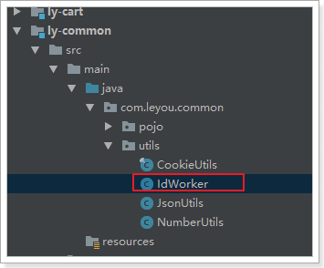
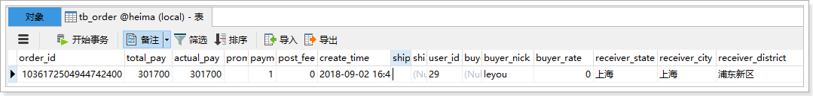

# 0.学习目标

- 独立搭建订单微服务
- 独立完成创建订单接口
- 独立完成查询订单接口


# 1.创建订单微服务

加入购物车后，自然就要完成下单，我们接下来创建订单微服务：

## 1.1.搭建服务

### 创建model

maven工程：


选择位置：


### 依赖


```xml
<?xml version="1.0" encoding="UTF-8"?>
<project xmlns="http://maven.apache.org/POM/4.0.0"
         xmlns:xsi="http://www.w3.org/2001/XMLSchema-instance"
         xsi:schemaLocation="http://maven.apache.org/POM/4.0.0 http://maven.apache.org/xsd/maven-4.0.0.xsd">
    <parent>
        <artifactId>leyou</artifactId>
        <groupId>com.leyou</groupId>
        <version>1.0.0-SNAPSHOT</version>
    </parent>
    <modelVersion>4.0.0</modelVersion>

    <artifactId>ly-order</artifactId>

    <dependencies>
        <dependency>
            <groupId>org.springframework.cloud</groupId>
            <artifactId>spring-cloud-starter-netflix-eureka-client</artifactId>
        </dependency>
        <dependency>
            <groupId>org.springframework.boot</groupId>
            <artifactId>spring-boot-starter-web</artifactId>
        </dependency>
        <!-- 通用Mapper启动器 -->
        <dependency>
            <groupId>tk.mybatis</groupId>
            <artifactId>mapper-spring-boot-starter</artifactId>
        </dependency>
        <!-- mysql驱动 -->
        <dependency>
            <groupId>mysql</groupId>
            <artifactId>mysql-connector-java</artifactId>
        </dependency>
        <dependency>
            <groupId>com.leyou</groupId>
            <artifactId>ly-item-interface</artifactId>
            <version>1.0.0-SNAPSHOT</version>
        </dependency>
        <dependency>
            <groupId>com.leyou</groupId>
            <artifactId>ly-common</artifactId>
            <version>1.0.0-SNAPSHOT</version>
        </dependency>
        <dependency>
            <groupId>org.springframework.cloud</groupId>
            <artifactId>spring-cloud-starter-openfeign</artifactId>
        </dependency>
        <dependency>
            <groupId>com.github.pagehelper</groupId>
            <artifactId>pagehelper-spring-boot-starter</artifactId>
        </dependency>
    </dependencies>
    <build>
        <plugins>
            <plugin>
                <groupId>org.springframework.boot</groupId>
                <artifactId>spring-boot-maven-plugin</artifactId>
            </plugin>
        </plugins>
    </build>
</project>
```


### 配置文件

application.yaml:

```yaml
server:
  port: 8090
spring:
  application:
    name: order-service
  datasource:
    url: jdbc:mysql://127.0.0.1:3306/leyou?characterEncoding=utf-8
    username: root
    password: root
    driver-class-name: com.mysql.jdbc.Driver
  jackson:
    default-property-inclusion: non_null
eureka:
  client:
    service-url:
      defaultZone: http://127.0.0.1:10086/eureka
mybatis:
  type-aliases-package: com.leyou.order.entity
  configuration:
    map-underscore-to-camel-case: true
```

### 启动类

```java
@SpringBootApplication
@EnableDiscoveryClient
@EnableFeignClients
@MapperScan("com.leyou.order.mapper")
public class LyOrderApplication {

    public static void main(String[] args) {
        SpringApplication.run(LyOrderApplication.class, args);
    }
}
```


### 路由

在ly-gateway中添加路由：

```yaml
zuul:
  routes:
    order-service:
      path: /order/**
      serviceId: order-service
      strip-prefix: false
```

这里选择了`strip-prefix`为false，因此路径中的`/order`会作为真实请求路径的一部分


## 1.2.用户登录信息获取

订单业务也需要知道当前登录的用户信息，如同购物车一样，我们添加一个SpringMVC的拦截器，用于获取用户信息：

### 1.2.1.拦截器

```java
package com.leyou.order.interceptor;

import com.leyou.common.enums.ExceptionEnum;
import com.leyou.common.exceptions.LyException;
import com.leyou.common.threadlocals.UserHolder;
import org.apache.commons.lang3.StringUtils;
import org.springframework.web.servlet.HandlerInterceptor;

import javax.servlet.http.HttpServletRequest;
import javax.servlet.http.HttpServletResponse;

/**
 * @author 黑马程序员
 */
public class UserInterceptor implements HandlerInterceptor {

    private static final String HEADER_NAME = "user_info";
    @Override
    public boolean preHandle(HttpServletRequest request, HttpServletResponse response, Object handler) {
       try {
            String token = CookieUtils.getCookieValue(request, CookieName);
            Payload<UserInfo> payload = JwtUtils.getInfoFromToken(token, UserInfo.class);
            UserHolder.setUserId(payload.getUserInfo().getId());
            return true;
        } catch (UnsupportedEncodingException e) {
            e.printStackTrace();
            return false;
        }
    }
}
```


### 1.2.2.配置拦截器

```java
package com.leyou.order.config;

import com.leyou.order.interceptor.UserInterceptor;
import org.springframework.context.annotation.Configuration;
import org.springframework.web.servlet.config.annotation.InterceptorRegistry;
import org.springframework.web.servlet.config.annotation.WebMvcConfigurer;

/**
 * @author 黑马程序员
 */
@Configuration
public class MvcConfig implements WebMvcConfigurer {
    @Override
    public void addInterceptors(InterceptorRegistry registry) {
        registry.addInterceptor(new UserInterceptor()).addPathPatterns("/order/**");
    }
}
```


## 1.3.数据结构

订单表：

```sql
CREATE TABLE `tb_order` (
  `order_id` bigint(20) NOT NULL COMMENT '订单id',
  `total_fee` bigint(20) NOT NULL COMMENT '总金额，单位为分',
  `actual_fee` bigint(20) NOT NULL COMMENT '实付金额。单位:分。如:20007，表示:200元7分',
  `promotion_ids` varchar(256) COLLATE utf8_bin DEFAULT '' COMMENT '优惠活动id，多个以，隔开',
  `payment_type` tinyint(1) unsigned zerofill NOT NULL COMMENT '支付类型，1、在线支付，2、货到付款',
  `post_fee` bigint(20) NOT NULL COMMENT '邮费。单位:分。如:20007，表示:200元7分',
  `user_id` bigint(20) NOT NULL COMMENT '用户id',
  `invoice_type` int(1) DEFAULT '0' COMMENT '发票类型(0无发票1普通发票，2电子发票，3增值税发票)',
  `source_type` int(1) DEFAULT '2' COMMENT '订单来源：1:app端，2：pc端，3：微信端',
  `status` tinyint(1) DEFAULT NULL COMMENT '订单的状态，1、未付款 2、已付款,未发货 3、已发货,未确认 4、确认收货，交易成功 5、交易取消，订单关闭 6、交易结束，已评价',
  `pay_time` timestamp NULL DEFAULT NULL COMMENT '支付时间',
  `consign_time` timestamp NULL DEFAULT NULL COMMENT '发货时间',
  `end_time` timestamp NULL DEFAULT NULL COMMENT '交易完成时间',
  `close_time` timestamp NULL DEFAULT NULL COMMENT '交易关闭时间',
  `comment_time` timestamp NULL DEFAULT NULL COMMENT '评价时间',
  `create_time` timestamp NULL DEFAULT CURRENT_TIMESTAMP COMMENT '创建时间',
  `update_time` timestamp NULL DEFAULT CURRENT_TIMESTAMP ON UPDATE CURRENT_TIMESTAMP COMMENT '更新时间',
  PRIMARY KEY (`order_id`),
  KEY `buyer_nick` (`user_id`)
) ENGINE=InnoDB DEFAULT CHARSET=utf8 COLLATE=utf8_bin;
```


订单-物流信息表：一对一

```mysql
CREATE TABLE `tb_order_logistics` (
  `order_id` bigint(20) NOT NULL COMMENT '订单id，与订单表一对一',
  `logistics_number` varchar(18) DEFAULT '' COMMENT '物流单号',
  `logistics_company` varchar(18) DEFAULT '' COMMENT '物流公司名称',
  `addressee` varchar(32) NOT NULL COMMENT '收件人',
  `phone` varchar(11) NOT NULL COMMENT '收件人手机号码',
  `province` varchar(16) NOT NULL COMMENT '省',
  `city` varchar(32) NOT NULL COMMENT '市',
  `district` varchar(32) NOT NULL COMMENT '区',
  `street` varchar(256) NOT NULL COMMENT '街道',
  `postcode` int(6) DEFAULT '0' COMMENT '邮编',
  `create_time` timestamp NULL DEFAULT CURRENT_TIMESTAMP COMMENT '创建时间',
  `update_time` timestamp NULL DEFAULT CURRENT_TIMESTAMP ON UPDATE CURRENT_TIMESTAMP COMMENT '更新时间',
  PRIMARY KEY (`order_id`)
) ENGINE=InnoDB DEFAULT CHARSET=utf8;
```


订单订单条目： 一对多

```sql
CREATE TABLE `tb_order_detail` (
  `id` bigint(20) NOT NULL AUTO_INCREMENT COMMENT '订单详情id ',
  `order_id` bigint(20) NOT NULL COMMENT '订单id',  #逻辑外键
  `sku_id` bigint(20) NOT NULL COMMENT 'sku商品id',
  `num` int(4) NOT NULL COMMENT '购买数量',
  `title` varchar(256) NOT NULL COMMENT '商品标题',
  `own_spec` varchar(1024) DEFAULT '' COMMENT '商品动态属性键值集',
  `price` int(16) NOT NULL COMMENT '价格,单位：分',
  `image` varchar(256) DEFAULT '' COMMENT '商品图片',
  `create_time` timestamp NULL DEFAULT CURRENT_TIMESTAMP COMMENT '创建时间',
  `update_time` timestamp NULL DEFAULT CURRENT_TIMESTAMP ON UPDATE CURRENT_TIMESTAMP COMMENT '更新时间',
  PRIMARY KEY (`id`),
  KEY `key_order_id` (`order_id`) USING BTREE
) ENGINE=InnoDB AUTO_INCREMENT=7 DEFAULT CHARSET=utf8 COMMENT='订单详情表';
```


## 1.4.基本代码

### 实体类

Order:

```java
package com.leyou.order.entity;

import lombok.Data;

import javax.persistence.Id;
import javax.persistence.Table;
import java.util.Date;

@Data
@Table(name = "tb_order")
public class Order {
    /**
     * 订单编号
     */
    @Id
    private Long orderId;
    /**
     * 商品金额
     */
    private Long totalFee;
    /**
     * 邮费
     */
    private Long postFee = 0L;
    /**
     * 实付金额
     */
    private Long actualFee;
    /**
     * 付款方式：1:在线支付, 2:货到付款
     */
    private Integer paymentType;
    /**
     * 优惠促销的活动id，
     */
    private String promotionIds;

    /**
     * 用户id
     */
    private Long userId;

    /**
     * 订单状态
     */
    private Integer status;
    /**
     * 创建时间
     */
    private Date createTime;
    /**
     * 付款时间
     */
    private Date payTime;
    /**
     * 发货时间
     */
    private Date consignTime;
    /**
     * 确认收货时间
     */
    private Date endTime;
    /**
     * 交易关闭时间
     */
    private Date closeTime;
    /**
     * 评价时间
     */
    private Date commentTime;
    /**
     * 更新时间
     */
    private Date updateTime;
    /**
     * 发票类型，0无发票，1普通发票，2电子发票，3增值税发票
     */
    private Integer invoiceType;
    /**
     *  订单来源 1:app端，2：pc端，3：微信端
     */
    private Integer sourceType;
}
```


此处我们为订单状态定义了枚举，方便订单状态的记录：

```java
package com.leyou.order.enums;

/**
 * @author 黑马程序员
 */
public enum  OrderStatusEnum {
    INIT(1, "初始化，未付款"),
    PAY_UP(2, "已付款，未发货"),
    DELIVERED(3, "已发货，未确认"),
    CONFIRMED(4, "已确认,未评价"),
    CLOSED(5, "已关闭"),
    RATED(6, "已评价，交易结束")
    ;

    private Integer value;
    private String msg;

    OrderStatusEnum(Integer value, String msg) {
        this.value = value;
        this.msg = msg;
    }

    public Integer value(){
        return this.value;
    }

    public String msg(){
        return msg;
    }
}
```


OrderDetail：

```java
package com.leyou.order.entity;

import lombok.Data;
import tk.mybatis.mapper.annotation.KeySql;

import javax.persistence.Id;
import javax.persistence.Table;
import java.util.Date;

@Data
@Table(name = "tb_order_detail")
public class OrderDetail {

    @Id
    @KeySql(useGeneratedKeys = true)
    private Long id;
    /**
     * 订单编号
     */
    private Long orderId;
    /**
     * 商品id
     */
    private Long skuId;
    /**
     * 商品购买数量
     */
    private Integer num;
    /**
     * 商品标题
     */
    private String title;
    /**
     * 商品单价
     */
    private Long price;
    /**
     * 商品规格数据
     */
    private String ownSpec;
    /**
     * 图片
     */
    private String image;
    private Date createTime;
    private Date updateTime;
}
```


物流：OrderLogistics

```java
package com.leyou.order.entity;

import lombok.Data;

import javax.persistence.Id;
import java.util.Date;

/**
 * @author 黑马程序员
 */
@Data
@Table(name = "tb_order_logistics")
public class OrderLogistics {
    /**
     * 订单id，与订单表一对一
     */
    @Id
    private Long orderId;
    /**
     * 物流单号
     */
    private String logisticsNumber;
    /**
     * 物流名称
     */
    private String logisticsCompany;
    /**
     * 收件人
     */
    private String addressee;
    /**
     * 手机号
     */
    private String phone;
    /**
     * 省
     */
    private String province;
    /**
     * 市
     */
    private String city;
    /**
     * 区
     */
    private String district;
    /**
     * 街道
     */
    private String street;
    /**
     * 邮编
     */
    private String postcode;
    private Date createTime;
    private Date updateTime;
}
```


### mapper

OrderMapper:

```java
package com.leyou.order.mapper;

import com.leyou.common.mapper.BaseMapper;
import com.leyou.order.entity.Order;

public interface OrderMapper extends BaseMapper<Order> {
}
```


OrderDetailMapper：

```java
package com.leyou.order.mapper;

import com.leyou.common.mapper.BaseMapper;
import com.leyou.order.entity.OrderDetail;

public interface OrderDetailMapper extends BaseMapper<OrderDetail>{
}
```


OrderLogisticsMapper:

```java
package com.leyou.order.mapper;

import com.leyou.common.mapper.BaseMapper;
import com.leyou.order.entity.OrderLogistics;

/**
 * @author 黑马程序员
 */
public interface OrderLogisticsMapper extends BaseMapper<OrderLogistics> {
}

```


# 2.订单结算页

在购物车页面，用户会点击`去结算`按钮:


随后就会进入订单结算页，展示用户正在购买的商品，并且需要用户选择收货人地址、付款方式等信息：


这个页面需要完成的功能如下：

- 收件人信息展示、选择
- 支付方式选择
- 商品清单展示


## 2.1.收货人信息（作业）


这里的收货人信息肯定是当前登录用户的收货地址。所以需要根据当前登录用户去查询，目前我们在页面是写的假数据：

 

大家可以在在后台提供地址的增删改查接口，然后页面加载时根据当前登录用户查询，而后赋值给addresses即可。

## 2.2.支付方式

支付方式有2种：

- 微信支付
- 货到付款

与我们订单数据中的`paymentType`关联：


所以我们可以在Vue实例中定义一个属性来记录支付方式：

 

然后在页面渲染时与这个变量关联：


## 2.3.商品清单

商品清单是通过localstorage从购物车页面传递过来的，到了本页从localstorage取出并且记录在data中：


随后在页面渲染完成：


## 2.4.提交订单

当点击`提交订单`按钮，会看到控制台发起请求：


参数说明：

- addressId：收货人地址信息的id，需要去用户中心查询收货人地址
- carts：购物车中的商品数据，可以有多个对象
  - num：购物车中指定商品的购买数量
  - skuId：购物车中的某商品的id
- paymentType：付款方式：1 在线支付，2 货到付款

对应的JS代码：


可以看到返回的提交订单成功，返回的应该是订单的编号id。


# 3.创建订单接口

订单信息共有3张表，内容很多，但是前台提交的数据却只很少，也就是说我们需要自己填充很多的数据。

## 3.1.Controller

请求分析：

- 请求方式：POST

- 请求路径：/order

- 请求参数：包含收货人地址id、付款方式、购物车商品数据集合的json内容，我们需要封装一个对象来接收：

  ```java
  @Data
  @AllArgsConstructor
  @NoArgsConstructor
  public class OrderDTO {
      @NotNull
      private Long addressId; // 收获人地址id
      @NotNull
      private Integer paymentType;// 付款类型
      @NotNull
      private List<CartDTO> carts;// 订单详情
  }
  ```

  其中的购物车数据再次封装对象：

  ```java
  @Data
  @NoArgsConstructor
  @AllArgsConstructor
  public class CartDTO {
      private Long skuId;// 商品skuId
      private Integer num;// 购买数量
  }
  ```

- 返回结果：订单id

具体代码：

```java
@RestController
@RequestMapping("order")
public class OrderController {

    @Autowired
    private OrderService orderService;

    @PostMapping
    public ResponseEntity<Long> createOrder(@RequestBody @Valid OrderDTO orderDTO) {
        return ResponseEntity.status(HttpStatus.CREATED)
            .body(this.orderService.createOrder(orderDTO));
    }
}
```


## 3.2.Service

创建订单逻辑比较复杂，需要组装订单数据，基本步骤如下：

- 组织Order数据，完成新增，包括：
  - 订单编号
  - 用户id
  - 订单金额相关数据，需要查询商品信息后逐个运算并累加获取
  - 订单状态数据
- 组织OrderDetail数据，完成新增
  - 需要查询商品信息后，封装为OrderDetail集合，然后新增
- 组织OrderLogistics数据，完成新增
  - 需要查询到收货人地址
  - 然后根据收货人地址，封装OrderLogistics后，完成新增
- 下单成功后，商品对应库存应该减掉


我们来看其中的几个关键点：

### 3.2.1.生成订单编号

> 订单id的特殊性

订单数据非常庞大，将来一定会做分库分表。那么这种情况下， 要保证id的唯一，就不能靠数据库自增，而是自己来实现算法，生成唯一id。

> 雪花算法

这里的订单id是通过一个工具类生成的：

 

而工具类所采用的生成id算法，是由Twitter公司开源的snowflake（雪花）算法。

> 简单原理

雪花算法会生成一个64位的二进制数据，为一个Long型。(转换成字符串后长度最多19) ，其基本结构：

 

第一位：为未使用

第二部分：41位为毫秒级时间(41位的长度可以使用69年)

第三部分：5位datacenterId和5位workerId(10位的长度最多支持部署1024个节点）

第四部分：最后12位是毫秒内的计数（12位的计数顺序号支持每个节点每毫秒产生4096个ID序号）

snowflake生成的ID整体上按照时间自增排序，并且整个分布式系统内不会产生ID碰撞（由datacenter和workerId作区分），并且效率较高。经测试snowflake每秒能够产生26万个ID。

> 配置

为了保证不重复，我们在application.yaml中给每个部署的节点都配置机器id：

```yaml
ly:
  worker:
    workerId: 1
    dataCenterId: 1
```

加载属性：

```java
@Data
@ConfigurationProperties(prefix = "ly.worker")
public class IdWorkerProperties {

    private long workerId;// 当前机器id

    private long dataCenterId;// 序列号
}
```

编写配置类：

```java
@Configuration
@EnableConfigurationProperties(IdWorkerProperties.class)
public class IdWorkerConfig {

    @Bean
    public IdWorker idWorker(IdWorkerProperties prop) {
        return new IdWorker(prop.getWorkerId(), prop.getDataCenterId());
    }
}
```


### 3.2.2.查询sku的接口

创建订单过程中，肯定需要查询sku信息，因此我们需要在商品微服务提供根据skuId查询sku的接口：

在`ly-item-interface`的`ItemClient`中添加接口：

```java
/**
  * 根据id批量查询sku
  * @param ids skuId的集合
  * @return sku的集合
  */
@GetMapping("sku/list")
List<SkuDTO> querySkuByIds(@RequestParam("ids") List<Long> ids);
```

对应的业务实现之前已经写过了，可以不用写了。

### 3.2.3.准备物流假数据

我们前端页面传来的是addressId，我们需要根据id查询物流信息，但是因为还没做物流地址管理。所以我们准备一些假数据。

首先是实体类：

我们在ly-user-pojo中添加物流实体类：

```java
package com.leyou.user.dto;

import lombok.Data;

@Data
public class AddressDTO {
    private Long id;
    private Long userId;
    private String addressee;// 收件人姓名
    private String phone;// 电话
    private String province;// 省份
    private String city;// 城市
    private String district;// 区
    private String street;// 街道地址
    private String  postcode;// 邮编
    private Boolean isDefault;
}
```

然后在ly-user-interface的UserClient中添加新功能：

```java
    /**
     * 根据
     * @param userId 用户id
     * @param id 地址id
     * @return 地址信息
     */
    @GetMapping("/address")
    AddressDTO queryAddressById(@RequestParam("userId") Long userId, @RequestParam("id") Long id);
```

然后在ly-user-service中编写controller：

```java
package com.leyou.user.web;

import com.leyou.user.dto.AddressDTO;
import org.springframework.http.ResponseEntity;
import org.springframework.web.bind.annotation.GetMapping;
import org.springframework.web.bind.annotation.RequestMapping;
import org.springframework.web.bind.annotation.RequestParam;
import org.springframework.web.bind.annotation.RestController;

@RestController
@RequestMapping("address")
public class AddressController {

    /**
     * 根据
     * @param userId 用户id
     * @param id 地址id
     * @return 地址信息
     */
    @GetMapping
    public ResponseEntity<AddressDTO> queryAddressById(@RequestParam("userId") Long userId, @RequestParam("id") Long id){
        AddressDTO address = new AddressDTO();
        address.setId(1L);
        address.setStreet("京顺路99号");
        address.setCity("北京");
        address.setDistrict("顺义区");
        address.setAddressee("黑马");
        address.setPhone("15800000000");
        address.setProvince("北京");
        address.setPostcode("100000");
        address.setIsDefault(true);
        return ResponseEntity.ok(address);
    }
}
```

在ly-order的pom.xml中添加user的依赖：

```xml
<dependency>
    <groupId>com.leyou.service</groupId>
    <artifactId>ly-user-interface</artifactId>
    <version>1.0.0-SNAPSHOT</version>
</dependency>
```

### 3.2.4.批量新增OrderDetail

业务中需要新增OrderDetail，而且是批量的新增，我们需要编写这样的一个SQL。

首先是Mapper接口中的方法：

```java
package com.leyou.order.mapper;

import com.leyou.common.mapper.BaseMapper;
import com.leyou.order.entity.OrderDetail;
import org.apache.ibatis.annotations.Param;

import java.util.List;

public interface OrderDetailMapper extends BaseMapper<OrderDetail>{
    /**
     * 批量新增
     * @param details 商品详情的集合
     * @return 新增成功的行
     */
    int insertDetailList(@Param("details") List<OrderDetail> details);
}
```

然后编写OrderDetailMapper文件：

 

```xml
<?xml version="1.0" encoding="UTF-8"?>
<!DOCTYPE mapper PUBLIC "-//mybatis.org//DTD Mapper 3.0//EN"
        "http://mybatis.org/dtd/mybatis-3-mapper.dtd">
<mapper namespace="com.leyou.order.mapper.OrderDetailMapper">

    <insert id="insertDetailList">
        INSERT INTO `tb_order_detail` (
        `id`,`order_id`, `sku_id`,`num`, `title`, `own_spec`, `price`, `image`
        )
        <foreach collection="details" open="VALUES" separator="," item="detail">
            (NULL, #{detail.orderId}, #{detail.skuId}, #{detail.num}, #{detail.title}, #{detail.ownSpec}, #{detail.price}, #{detail.image})
        </foreach>
    </insert>
</mapper>

```

最后，在yaml文件中配置mybatis，读取这个文件：

```yaml
mybatis:
  mapper-locations: mappers/*.xml
```


### 3.2.5.减库存接口

创建订单，肯定需要减库存，我们还要在商品微服务提供减库存接口

在`ly-item-interface`的`GoodsApi`中添加接口：

```java
/**
     * 减库存
     * @param cartMap 商品id及数量的map
     */
@PutMapping("/stock/minus")
void minusStock(@RequestBody Map<Long, Integer> cartMap);
```

在`ly-item-service`的`GoodsController`中编写业务：

```java
/**
     * 减库存
     * @param cartMap 商品id及数量的map
     */
@PutMapping("/stock/minus")
public ResponseEntity<Void> minusStock(@RequestBody Map<Long, Integer> cartMap){
    goodsService.minusStock(cartMap);
    return ResponseEntity.status(HttpStatus.NO_CONTENT).build();
}
```

在`ly-item-service`的`GoodsServicer`中编写业务

```java
@Transactional    
public void minusStock(Map<Long, Integer> cartMap) {
    for (Map.Entry<Long, Integer> entry : cartMap.entrySet()) {
        Long skuId = entry.getKey();
        Integer num = entry.getValue();
        int count = skuMapper.minusStock(skuId, num);
        if(count != 1){
            throw new RuntimeException("库存不足");
        }
    }
}
```

此处采用了手写Sql在SkuMapper中：

```java
/**
 * @author 黑马程序员
 */
public interface SkuMapper extends BaseMapper<Sku>, InsertListMapper<Sku> {

    @Update("UPDATE tb_sku SET stock = stock - #{num} WHERE id = #{id}")
    int minusStock(@Param("id") Long id, @Param("num") Integer num);
}
```

这里减库存并没有采用先查询库存，判断充足才减库存的方案，那样会有线程安全问题，当然可以通过加锁解决。不过我们此处为了效率，并没有使用。

而是把数据库中的库存stock列设置为：无符号类型，当库存减到0以下时，数据库会报错，从而避免超卖：


### 3.2.5.创建订单代码

完整代码如下：

```java
package com.leyou.order.service;

import com.leyou.common.enums.ExceptionEnum;
import com.leyou.common.exceptions.LyException;
import com.leyou.common.threadlocals.UserHolder;
import com.leyou.common.utils.BeanHelper;
import com.leyou.common.utils.IdWorker;
import com.leyou.item.client.ItemClient;
import com.leyou.item.dto.SkuDTO;
import com.leyou.order.dto.CartDTO;
import com.leyou.order.dto.OrderDTO;
import com.leyou.order.entity.Order;
import com.leyou.order.entity.OrderDetail;
import com.leyou.order.entity.OrderLogistics;
import com.leyou.order.enums.OrderStatusEnum;
import com.leyou.order.mapper.OrderDetailMapper;
import com.leyou.order.mapper.OrderLogisticsMapper;
import com.leyou.order.mapper.OrderMapper;
import com.leyou.user.client.UserClient;
import com.leyou.user.dto.AddressDTO;
import org.apache.commons.lang3.StringUtils;
import org.springframework.beans.factory.annotation.Autowired;
import org.springframework.stereotype.Service;
import org.springframework.transaction.annotation.Transactional;

import java.util.ArrayList;
import java.util.List;
import java.util.Map;
import java.util.stream.Collectors;

@Service
public class OrderService {

    @Autowired
    private OrderMapper orderMapper;

    @Autowired
    private OrderDetailMapper detailMapper;

    @Autowired
    private OrderLogisticsMapper logisticsMapper;

    @Autowired
    private IdWorker idWorker;

    @Autowired
    private UserClient userCLient;

    @Autowired
    private ItemClient itemClient;

    @Transactional
    public Long createOrder(OrderDTO orderDTO) {
        // 1 写order
        Order order = new Order();

        // 1.1 订单编号
        long orderId = idWorker.nextId();
        order.setOrderId(orderId);

        // 1.2 登录用户
        Long userId = UserHolder.getUser();
        order.setUserId(userId);

        // 1.3 金额相关信息
        List<CartDTO> carts = orderDTO.getCarts();
        // 获取所有sku的id
        List<Long> idList = carts.stream().map(CartDTO::getSkuId).collect(Collectors.toList());
        // 处理CartDTO为一个map， 其key是skuId；值是num
        Map<Long, Integer> numMap = carts.stream().collect(Collectors.toMap(CartDTO::getSkuId, CartDTO::getNum));
        // 1.3.1 查询sku
        List<SkuDTO> skuList = itemClient.querySkuByIds(idList);
        // 定义一个OrderDetail的集合
        List<OrderDetail> details = new ArrayList<>();
        // 1.3.2 计算金额的和
        long total = 0;
        for (SkuDTO sku : skuList) {
            int num = numMap.get(sku.getId());
            // 计算总金额
            total += sku.getPrice() * num;
            // 组装OrderDetail
            OrderDetail detail = new OrderDetail();
            detail.setOrderId(orderId);
            detail.setImage(StringUtils.substringBefore(sku.getImages(), ","));
            detail.setNum(num);
            detail.setSkuId(sku.getId());
            detail.setOwnSpec(sku.getOwnSpec());
            detail.setPrice(sku.getPrice());
            detail.setTitle(sku.getTitle());
            details.add(detail);
        }
        // 1.3.3 填写金额数据
        order.setTotalFee(total);
        order.setPaymentType(orderDTO.getPaymentType());
        order.setActualFee(total + order.getPostFee()/* - 优惠金额*/);

        // 1.4 订单状态初始化
        order.setStatus(OrderStatusEnum.INIT.value());

        // 1.5 写order到数据库
        int count = orderMapper.insertSelective(order);
        if(count != 1){
            throw new LyException(ExceptionEnum.INSERT_OPERATION_FAIL);
        }

        // 2 写OrderDetail
        count = detailMapper.insertDetailList(details);
        if(count != details.size()){
            throw new LyException(ExceptionEnum.INSERT_OPERATION_FAIL);
        }

        // 3 写orderLogistics
        // 3.1.查询收货地址
        AddressDTO addr = userCLient.queryAddressById(userId, orderDTO.getAddressId());
        // 3.2.填写物流信息
        OrderLogistics logistics = BeanHelper.copyProperties(addr, OrderLogistics.class);
        logistics.setOrderId(orderId);

        count = logisticsMapper.insertSelective(logistics);
        if(count != 1){
            throw new LyException(ExceptionEnum.INSERT_OPERATION_FAIL);
        }

        // 4 减库存
        itemClient.minusStock(numMap);

        return orderId;
    }
}
```


### 3.2.5.删除购物车中已经下单商品（作业）

这里删除购物车中商品，我们可以采用异步的MQ去完成，通过mq通知购物车系统，下单成功，可以删除商品了。在消息体中把sku的id传递。

## 3.3.测试

启动项目，在页面再次点击提交订单，发现提交成功，跳转到了支付页面,注：待微信支付功能完成后方可看到二维码：

 

查看数据库，发现订单已经生成：

订单



订单详情：


订单状态：

 


# 4.查询订单接口

## 4.1.接口分析

支付页面需要展示订单信息，页面加载时，就会发起请求，查询订单信息：

 

因此我们应该提供查询订单接口：

- 请求方式：Get
- 请求路径：/order/{id}
- 请求参数：路径占位符的id
- 返回结果：订单对象的json结构，包含订单状态，订单详情，需要定义对应的VO对象


## 4.2.VO对象

OrderDetailVO：

```java
package com.leyou.order.vo;

import lombok.Data;

/**
 * @author 黑马程序员
 */
@Data
public class OrderDetailVO {
    private Long id;
    /**
     * 订单编号
     */
    private Long orderId;
    /**
     * 商品id
     */
    private Long skuId;
    /**
     * 商品购买数量
     */
    private Integer num;
    /**
     * 商品标题
     */
    private String title;
    /**
     * 商品单价
     */
    private Long price;
    /**
     * 商品规格数据
     */
    private String ownSpec;
    /**
     * 图片
     */
    private String image;
}
```

OrderLogisticsVO:

```java
package com.leyou.order.vo;

import lombok.Data;

/**
 * @author 黑马程序员
 */
@Data
public class OrderLogisticsVO {
    private Long orderId;
    /**
     * 物流单号
     */
    private String logisticsNumber;
    /**
     * 物流名称
     */
    private String logisticsCompany;
    /**
     * 收件人
     */
    private String addressee;
    /**
     * 手机号
     */
    private String phone;
    /**
     * 省
     */
    private String province;
    /**
     * 市
     */
    private String city;
    /**
     * 区
     */
    private String district;
    /**
     * 街道
     */
    private String street;
    /**
     * 邮编
     */
    private String postcode;
}
```

OrderVO:

```java
package com.leyou.order.vo;

import lombok.Data;

import javax.persistence.Id;
import java.util.Date;
import java.util.List;

/**
 * @author 黑马程序员
 */
@Data
public class OrderVO {
    /**
     * 订单编号
     */
    @Id
    private Long orderId;
    /**
     * 商品金额
     */
    private Long totalFee;
    /**
     * 邮费
     */
    private Long postFee = 0L;
    /**
     * 实付金额
     */
    private Long actualFee;
    /**
     * 付款方式：1:在线支付, 2:货到付款
     */
    private Integer paymentType;
    /**
     * 优惠促销的活动id，
     */
    private String promotionIds;

    /**
     * 用户id
     */
    private Long userId;

    /**
     * 订单状态
     */
    private Integer status;
    /**
     * 创建时间
     */
    private Date createTime;
    /**
     * 付款时间
     */
    private Date payTime;
    /**
     * 发货时间
     */
    private Date consignTime;
    /**
     * 确认收货时间
     */
    private Date endTime;
    /**
     * 交易关闭时间
     */
    private Date closeTime;
    /**
     * 评价时间
     */
    private Date commentTime;
    /**
     * 发票类型，0无发票，1普通发票，2电子发票，3增值税发票
     */
    private Integer invoiceType = 0;
    /**
     *  订单来源 1:app端，2：pc端，3：微信端
     */
    private Integer sourceType = 1;
    /**
     * 订单物流信息
     */
    private OrderLogisticsVO logistics;
    /**
     * 订单详情信息
     */
    private List<OrderDetailVO> detailList;
}
```


## 4.3.业务

OrderController：

```java
@GetMapping("{id}")
public ResponseEntity<OrderVO> queryOrderById(@PathVariable("id") Long orderId){
    return ResponseEntity.ok(orderService.queryOrderById(orderId));
}
```


service：

```java
public OrderVO queryOrderById(Long id) {
    // 1.查询订单
    Order order = orderMapper.selectByPrimaryKey(id);
    if (order == null) {
        // 不存在
        throw new LyException(ExceptionEnum.ORDER_NOT_FOUND);
    }
    // 判断用户id是否正确
    Long userId = UserHolder.getUser();
    if(!userId.equals(order.getUserId())){
        throw new LyException(ExceptionEnum.ORDER_NOT_FOUND);
    }

    // 2. 查询订单详情
    OrderDetail detail = new OrderDetail();
    detail.setOrderId(id);
    List<OrderDetail> details = detailMapper.select(detail);
    if(CollectionUtils.isEmpty(details)){
        throw new LyException(ExceptionEnum.ORDER_NOT_FOUND);
    }
   

    // 3.查询订单状态
    OrderLogistics logistics = logisticsMapper.selectByPrimaryKey(id);
    if (logistics == null) {
        // 不存在
        throw new LyException(ExceptionEnum.ORDER_NOT_FOUND);
    }

    // 4.封装数据
    OrderVO orderVO = BeanHelper.copyProperties(order, OrderVO.class);
    orderVO.setDetailList(BeanHelper.copyWithCollection(details, OrderDetailVO.class));
    orderVO.setLogistics(BeanHelper.copyProperties(logistics, OrderLogisticsVO.class));
    return orderVO;
}
```


