# 0.学习目标

- 微信支付下单
- 生成二维码
- 实现支付回调
- 实现支付状态查询


# 1.微信支付简介

## 1.1.介绍

微信支付官方文档：https://pay.weixin.qq.com/index.php/core/home/login?return_url=%2F

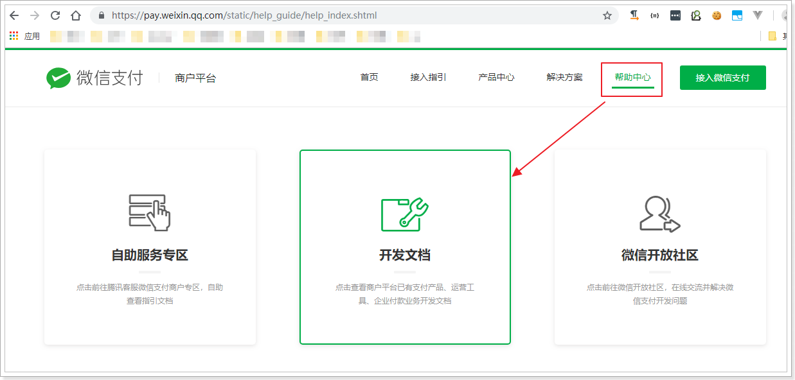

我们选择开发文档，而后进入选择页面：

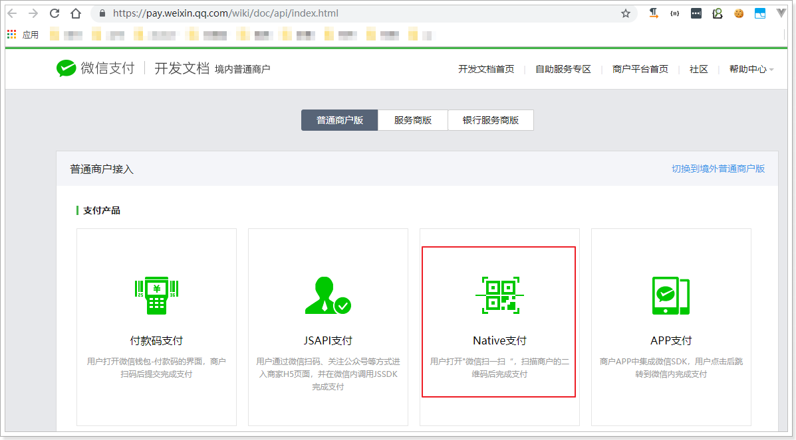

选择native支付，就是扫码支付：


此处我们使用模式二来开发：

## 1.2.开发流程

模式二与模式一相比，流程更为简单，不依赖设置的回调支付URL。

商户后台系统先调用微信支付的统一下单接口，微信后台系统返回链接参数code_url；

商户后台系统将code_url值生成二维码图片，用户使用微信客户端扫码后发起支付。

注意：code_url有效期为2小时，过期后扫码不能再发起支付。 

流程图：


这里我们把商户（我们）要做的事情总结一下：

- 1、商户生成订单
- 2、商户调用微信下单接口，获取预交易的链接
- 3、商户将链接生成二维码图片，展示给用户；
- 4、支付结果通知：
  - 微信异步通知商户支付结果，商户告知微信支付接收情况
  - 商户如果没有收到通知，可以调用接口，查询支付状态
- 5、如果支付成功，发货，修改订单状态


在前面的业务中，我们已经完成了：

- 1、生成订单

接下来，我们需要做的是：

- 2、调用微信下单接口，生成支付链接。
- 3、根据链接生成二维码图片
- 4、支付成功后修改订单状态


# 2.统一下单（生成支付链接）

按照上面的步骤分析，第一步是要生成支付链接。我们查看下微信官方文档

## 2.1.API说明

在微信支付文档中，可以查询到下面的信息：

> 请求路径

URL地址：<https://pay.weixin.qq.com/static/product/product_index.shtml>


> 请求参数

| 字段名     | 变量名           | 必填 | 类型        | 示例值                                 | 描述                                                         |
| :--------- | ---------------- | ---- | ----------- | -------------------------------------- | ------------------------------------------------------------ |
| 公众账号ID | appid            | 是   | String(32)  | wxd678efh56                            | 微信支付分配的公众账号ID                                     |
| 商户号     | mch_id           | 是   | String(32)  | 1230000109                             | 微信支付分配的商户号                                         |
| 随机字符串 | nonce_str        | 是   | String(32)  | 5K8264ILT                              | 随机字符串，长度要求在32位以内。推荐[随机数生成算法](https://pay.weixin.qq.com/wiki/doc/api/native.php?chapter=4_3) |
| 签名       | sign             | 是   | String(32)  | C380BEC2B                              | 通过签名算法计算得出的签名值，详见[签名生成算法](https://pay.weixin.qq.com/wiki/doc/api/native.php?chapter=4_3) |
| 商品描述   | body             | 是   | String(128) | 乐优手机                               | 商品简单描述，该字段请按照规范传递，具体请见[参数规定](https://pay.weixin.qq.com/wiki/doc/api/native.php?chapter=4_2) |
| 商户订单号 | out_trade_no     | 是   | String(32)  | 20150806125                            | 商户系统内部订单号，要求32个字符内，只能是数字、大小写字母_-\|* 且在同一个商户号下唯一。详见[商户订单号](https://pay.weixin.qq.com/wiki/doc/api/native.php?chapter=4_2) |
| 标价金额   | total_fee        | 是   | Int         | 88                                     | 订单总金额，单位为分，详见[支付金额](https://pay.weixin.qq.com/wiki/doc/api/native.php?chapter=4_2) |
| 终端IP     | spbill_create_ip | 是   | String(16)  | 123.12.12.123                          | APP和网页支付提交用户端ip，Native支付填调用微信支付API的机器IP。 |
| 通知地址   | notify_url       | 是   | String(256) | http://www.weixin.qq.com/wxpay/pay.php | 异步接收微信支付结果通知的回调地址，通知url必须为外网可访问的url，不能携带参数。 |
| 交易类型   | trade_type       | 是   | String(16)  | JSAPI                                  | JSAPI 公众号支付；NATIVE 扫码支付；APP APP支付说明详见[参数规定](https://pay.weixin.qq.com/wiki/doc/api/native.php?chapter=4_2) |

这些参数大致分成3类：

- appid、mch_id、spbill_create_ip、notify_url、trade_type：是商家自己的信息或固定数据，可以提前配置，因此无需每次请求单独配置，而是统一设置好即可，

- nonce_str、sign：是为了保证数据安全而添加的验证数据，根据算法去生成，每次请求自动生成即可。

- body、out_trade_no、total_fee：订单相关信息，需要我们自己填写。


## 2.2.微信SDK

### 2.2.1.下载

虽然请求参数比较复杂，但官方已经提供了SDK，供我们使用：

我也已经在课前资料提供：

 

微信没有提供maven仓库坐标，因此我们必须下载使用，建议使用课前资料中，我提供给大家的SDK，其中做了一些必要的设置：

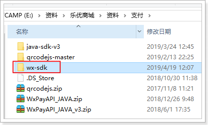 

### 2.2.2.WXPay工具

微信SDK提供了一个统一的微信支付工具类：WXPay：

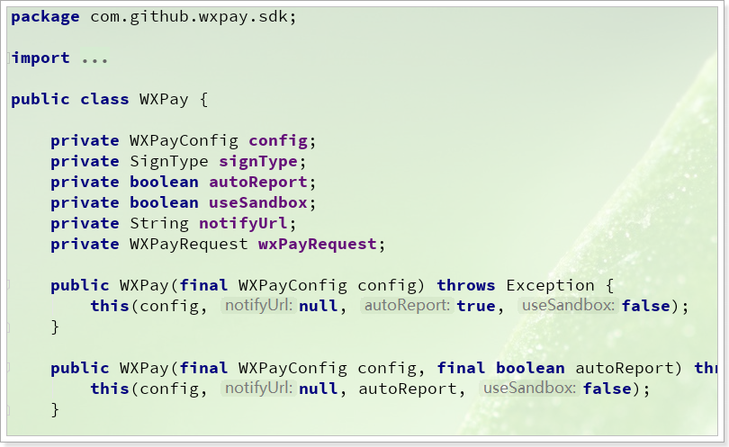

其中包含这样一些方法：

com.github.wxpay.sdk.WXPay类下提供了对应的方法：

| 方法名           | 说明             |
| ---------------- | ---------------- |
| microPay         | 刷卡支付         |
| `unifiedOrder`   | **统一下单**     |
| orderQuery       | 查询订单         |
| reverse          | 撤销订单         |
| closeOrder       | 关闭订单         |
| refund           | 申请退款         |
| refundQuery      | 查询退款         |
| downloadBill     | 下载对账单       |
| report           | 交易保障         |
| shortUrl         | 转换短链接       |
| authCodeToOpenid | 授权码查询openid |

- 注意:
  - 参数为`Map<String, String>`对象，返回类型也是`Map<String, String>`
  - 方法内部会将参数转换成含有`appid`、`mch_id`、`nonce_str`、`sign_type`和`sign`的XML
  - 通过HTTPS请求得到返回数据后会对其做必要的处理（例如验证签名，签名错误则抛出异常）

我们主要关注其中的unifiedOrder方法，统一下单：

```java
/**
     * 作用：统一下单<br>
     * 场景：公共号支付、扫码支付、APP支付
     * @param reqData 向wxpay post的请求数据
     * @return API返回数据
     * @throws Exception
     */
public Map<String, String> unifiedOrder(Map<String, String> reqData) throws Exception {
    return this.unifiedOrder(reqData, config.getHttpConnectTimeoutMs(), this.config.getHttpReadTimeoutMs());
}
```

这里的请求参数是：Map<String, String> reqData，就是官方API说明中的请求参数了，不过并不需要我们填写所有参数，而只需要下面的：

- body：商品描述
- out_trade_no：订单编号
- total_fee：订单应支付金额
- spbill_create_ip：设备IP
- notify_url：回调地址
- trade_type：交易类型

剩下的：`appid`、`mch_id`、`nonce_str`、`sign_type`和`sign`参数都有WXPay对象帮我们设置，那么问题来了：这些参数数据WXPay是怎么拿到的呢？

其中，

- nonce_str：是随机字符串，因此由WXPay随机生成，
- sign_type：是签名算法，由WXPay指定，默认是HMACSHA256；
- sign：是签名，有签名算法结合密钥加密而来，因此这里的关键是密钥：key
- appid、mch_id是商家信息，需要配置

也就是说，这例需要配置的包括：appid、mch_id、密钥key。这些从哪里来呢？

看下WXPay的构造函数：

```java
public WXPay(final WXPayConfig config) throws Exception {
    this(config, null, true, false);
}
```

这里需要一个WXPayConfig对象，显然是配置对象。


### 2.2.3..WXPayConfig配置

WXPay依赖于WXPayConfig进行配置，那么WXPayConfig是什么呢？

看下源码中的关键部分：

```java
public abstract class WXPayConfig {
    /**
     * 获取 App ID
     *
     * @return App ID
     */
    abstract String getAppID();
    /**
     * 获取 Mch ID
     *
     * @return Mch ID
     */
    abstract String getMchID();
    /**
     * 获取 API 密钥
     *
     * @return API密钥
     */
    abstract String getKey();
    
    // 。。。省略
}
```

这不就是WXPay中需要配置的3个属性嘛，当我们实现这个类，并且给出其中的值，把WXPayConfig传递给WXPay时，WXPay就会获取到这些数据:

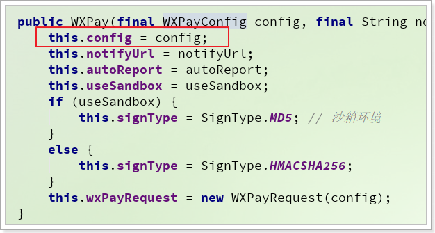 

当我们利用WXPay发送请求时，WXPay就会帮我们封装到请求参数中：

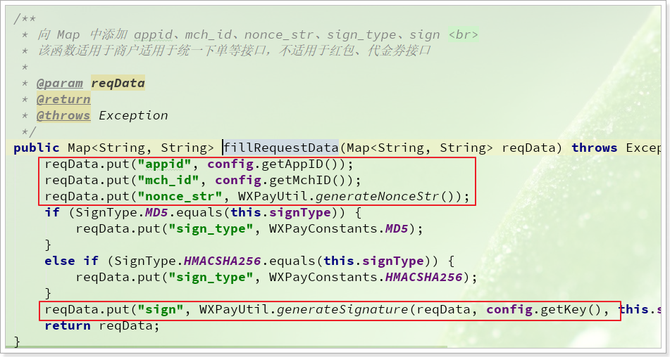


而在我提供给大家的SDK中，就编写了一个WXPayConfig的实现：

```java
package com.github.wxpay.sdk;

import lombok.Data;

import java.io.InputStream;

/**
 * @author 黑马程序员
 */
@Data
public class WXPayConfigImpl extends WXPayConfig {
    /**
     * 公众账号ID
     */
    private String appID;
    /**
     * 商户号
     */
    private String mchID;
    /**
     * 生成签名的密钥
     */
    private String key;
    /**
     * 支付回调地址
     */
    private String notifyUrl;
    /**
     * 支付方式
     */
    private String payType;

    public InputStream getCertStream(){
        return null;
    }

    public IWXPayDomain getWXPayDomain(){
        return WXPayDomainSimpleImpl.instance();
    }
}
```

将来我们只需要new出这个实现类对象，并且给这3个参数赋值即可。

## 2.3.整合到项目中

### 2.3.1.打包SDK

首先，把我提供的SDK打包并安装到本地的maven仓库，方便在项目中使用。

进入我提供的SDK的项目目录，然后打开黑窗口，输入命令：

```
mvn source:jar install -Dmaven.test.skip=true
```

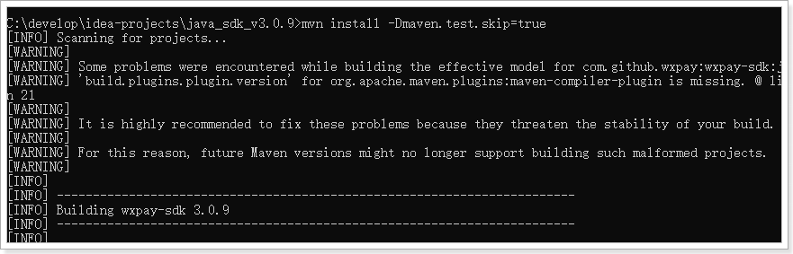

然后进入本地仓库查看：

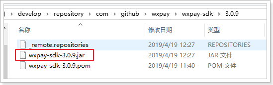 


### 2.3.2.配置WXPay

在ly-order中引入坐标：

```xml
<dependency>
    <groupId>com.github.wxpay</groupId>
    <artifactId>wxpay-sdk</artifactId>
    <version>3.0.9</version>
</dependency>
```


我们将这些WXPayConfig中的属性定义到application.yml中

```yaml
ly:
  pay:
    wx:
      appID: wx8397f8696b538317
      mchID: 1473426802
      key: T6m9iK73b0kn9g5v426MKfHQH7X8rKwb
      notifyUrl: http://www.api.leyou.com/api/pay/notify
      payType: NATIVE
```

将这些属性注入到PayConfig中：

```java
package com.leyou.order.config;

import com.github.wxpay.sdk.WXPayConfigImpl;
import org.springframework.boot.context.properties.ConfigurationProperties;
import org.springframework.context.annotation.Bean;
import org.springframework.context.annotation.Configuration;

@Configuration
public class PayConfiguration {

    @Bean
    @ConfigurationProperties(prefix = "ly.pay.wx")
    public WXPayConfigImpl payConfig(){
        return new WXPayConfigImpl();
    }
}
```


### 2.3.4.支付工具类

我们先初始化WXPay对象，并注入到Spring容器中：

```java
package com.leyou.order.config;

import com.github.wxpay.sdk.WXPay;
import com.github.wxpay.sdk.WXPayConfigImpl;
import org.springframework.boot.context.properties.ConfigurationProperties;
import org.springframework.context.annotation.Bean;
import org.springframework.context.annotation.Configuration;

@Configuration
public class PayConfiguration {

    @Bean
    @ConfigurationProperties(prefix = "ly.pay.wx")
    public WXPayConfigImpl payConfig(){
        return new WXPayConfigImpl();
    }

    /**
     * 注册WXPay对象
     * @param payConfig 支付相关配置
     * @return WXPay对象
     * @throws Exception 连结WX失败时用到
     */
    @Bean
    public WXPay wxPay(WXPayConfigImpl payConfig) throws Exception {
        return new WXPay(payConfig);
    }
}
```


我们定义支付工具类，完成后续操作：

```java
package com.leyou.order.utils;

import com.github.wxpay.sdk.WXPay;
import com.github.wxpay.sdk.WXPayConfigImpl;
import lombok.extern.slf4j.Slf4j;
import org.apache.commons.lang3.StringUtils;
import org.springframework.beans.factory.annotation.Autowired;
import org.springframework.stereotype.Component;

import java.util.HashMap;
import java.util.Map;

@Slf4j
@Component
public class PayHelper {

    @Autowired
    private WXPay wxPay;

    @Autowired
    private WXPayConfigImpl payConfig;

    public String createOrder(Long orderId, Long totalPay, String desc){
        Map<String, String> data = new HashMap<>();
        // 商品描述
        data.put("body", desc);
        // 订单号
        data.put("out_trade_no", orderId.toString());
        //金额，单位是分
        data.put("total_fee", totalPay.toString());
        //调用微信支付的终端IP
        data.put("spbill_create_ip", "127.0.0.1");
        //回调地址
        data.put("notify_url", payConfig.getNotifyUrl());
        // 交易类型为扫码支付
        data.put("trade_type", payConfig.getPayType());

        // 利用wxPay工具,完成下单
        Map<String, String> result = null;
        try {
            result = wxPay.unifiedOrder(data);
        } catch (Exception e) {
            log.error("【微信下单】创建预交易订单异常失败", e);
            throw new RuntimeException("微信下单失败", e);
        }
        // 校验业务状态
        checkResultCode(result);

        // 下单成功，获取支付链接
        String url = result.get("code_url");
        if (StringUtils.isBlank(url)) {
            throw new RuntimeException("微信下单失败，支付链接为空");
        }
        return url;
    }

    public void checkResultCode(Map<String, String> result) {
        // 检查业务状态
        String resultCode = result.get("result_code");
        if ("FAIL".equals(resultCode)) {
            log.error("【微信支付】微信支付业务失败，错误码：{}，原因：{}", result.get("err_code"), result.get("err_code_des"));
            throw new RuntimeException("【微信支付】微信支付业务失败");
        }
    }
}
```


## 2.4.下单并生成支付链接

在订单支付页面，会向后台发起请求，查询支付的URL地址：

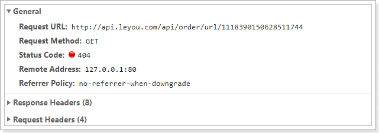 

我们需要编写controller，来实现这个功能：

- 请求方式：GET
- 请求路径：/order/url/{id}
- 请求参数：id，订单的编号
- 返回结果：url地址

代码如下：

controller：

```java
@GetMapping("url/{id}")
public ResponseEntity<String> getPayUrl(@PathVariable("id") Long orderId) {
    return ResponseEntity.ok(orderService.createPayUrl(orderId));
}
```

service，订单支付url的有效期是2小时，因此我们可以获取url后存入redis缓存：

- 先检查redis是否已经有url，有则返回
- 没有，则查询订单信息，校验订单状态是否为已经支付，是则抛出异常
- 如果没有支付，调用PayHelper，生成url
- 将url存入redis，设置有效期为2小时

引入redis依赖：

```xml
<dependency>
    <groupId>org.springframework.boot</groupId>
    <artifactId>spring-boot-starter-data-redis</artifactId>
</dependency>
```

配置：

```yaml
spring:
  redis:
    host: 192.168.150.101
```


代码：

```java
@Autowired
private PayHelper payHelper;
@Autowired
private StringRedisTemplate redisTemplate;

public String createPayUrl(Long orderId) {
    // 先看是否已经生成过：
    String key = String.format(KEY_PATTERN, orderId);
    String cacheUrl = redisTemplate.opsForValue().get(key);
    if (StringUtils.isNoneBlank(cacheUrl)) {
        return cacheUrl;
    }
    // 查询订单
    Order order = orderMapper.selectByPrimaryKey(orderId);
    if(order == null){
        throw new LyException(ExceptionEnum.ORDER_NOT_FOUND);
    }
    // 判断订单状态
    Integer status = order.getStatus();
    if(!status.equals(OrderStatusEnum.INIT.value())){
        // 订单已经支付过了，订单状态异常
        throw new LyException(ExceptionEnum.INVALID_ORDER_STATUS);
    }
    // 支付金额，测试时写1
    Long actualPay = /*order.getActualPay()*/ 1L;

    // 商品描述
    String desc = "【乐优商城】商品信息";
    String url = payHelper.createOrder(orderId, actualPay, desc);

    // 存入redis，设置有效期为 2小时
    redisTemplate.opsForValue().set(key, url, 2, TimeUnit.HOURS);
    return url;
}
```

页面响应结果：

 


# 3.生成支付二维码

## 3.1.什么是二维码

二维码又称QR Code，QR全称Quick Response，是一个近几年来移动设备上超流行的一种编码方式，它比传统的Bar Code条形码能存更多的信息，也能表示更多的数据类型。

二维条码/二维码（2-dimensional bar code）是用某种特定的几何图形按一定规律在平面（二维方向上）分布的黑白相间的图形记录数据符号信息的；在代码编制上巧妙地利用构成计算机内部逻辑基础的“0”、“1”比特流的概念，使用若干个与二进制相对应的几何形体来表示文字数值信息，通过图象输入设备或光电扫描设备自动识读以实现信息自动处理：它具有条码技术的一些共性：每种码制有其特定的字符集；每个字符占有一定的宽度；具有一定的校验功能等。同时还具有对不同行的信息自动识别功能、及处理图形旋转变化点。

## 3.2.二维码优势

- 信息容量大, 可以容纳多达1850个大写字母或2710个数字或500多个汉字

- 应用范围广, 支持文字,声音,图片,指纹等等...

- 容错能力强, 即使图片出现部分破损也能使用

- 成本低, 容易制作

## 3.3.二维码容错级别

- L级（低） 7％的码字可以被恢复。

- M级（中） 15％的码字可以被恢复。

- Q级（四分）25％的码字可以被恢复。

- H级（高）30％ 的码字可以被恢复。

## 3.4.二维码生成插件qrious

qrious是一款基于HTML5 Canvas的纯JS二维码生成插件。通过qrious.js可以快速生成各种二维码，你可以控制二维码的尺寸颜色，还可以将生成的二维码进行Base64编码。[官网](https://github.com/davidshimjs/qrcodejs)

qrious.js二维码插件的可用配置参数如下：

| 参数       | 类型   | 默认值      | 描述                               |
| ---------- | ------ | ----------- | ---------------------------------- |
| background | String | "white"     | 二维码的背景颜色。                 |
| foreground | String | "black"     | 二维码的前景颜色。                 |
| level      | String | "L"         | 二维码的误差校正级别(L, M, Q, H)。 |
| mime       | String | "image/png" | 二维码输出为图片时的MIME类型。     |
| size       | Number | 100         | 二维码的尺寸，单位像素。           |
| value      | String | ""          | 需要编码为二维码的值               |

课前资料中给出的案例可以直接生成二维码：

 


## 3.5.生成二维码

我们把课前资料中的这个js脚本引入到项目中：

 

然后在页面引用：

 


页面定义一个div，用于展示二维码：

 

然后获取到付款链接后，根据链接生成二维码：

 


刷新页面，查看效果：

 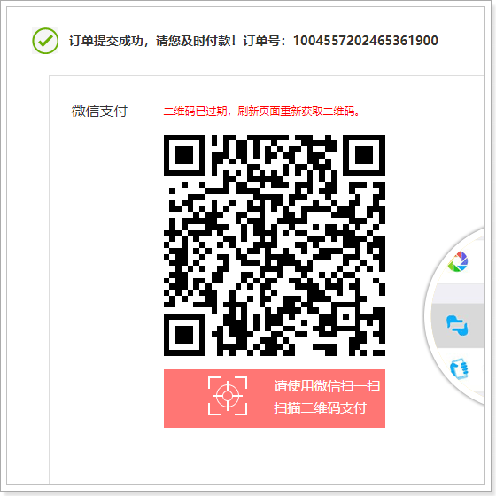

此时，客户用手机扫描二维码，可以看到付款页面。


# 4.支付结果通知

支付以后，我们后台需要修改订单状态。我们怎么得知有没有支付成功呢？

在我们的请求参数中，有一个notify_url的参数，是支付的回调地址。当用户支付成功后，微信会主动访问这个地址，并携带支付结果信息。

那么，这个notify_url该怎么用呢？


## 4.1.notify_url

### 1）什么是notify_url

参数中有一个非常重要的，叫做notify_url的：


基于上文的介绍我们知道，这个地址是在支付成功后的异步结果通知。官网介绍如下：

支付完成后，微信会把相关支付结果和用户信息发送给商户，商户需要接收处理，并返回应答。

所以，此处的地址必须是一个外网可访问地址，而且我们要定义好回调的处理接口。

http://api.leyou.com/api/order-service/notify

### 2）内网穿透

此处我们肯定不能写：http://api.leyou.com/api/order/，这个域名未经备案，是不被识别的。如何才能获取一个能够外网访问的域名呢？

我们可以通过内网穿透来实现，那么什么是内网穿透呢？

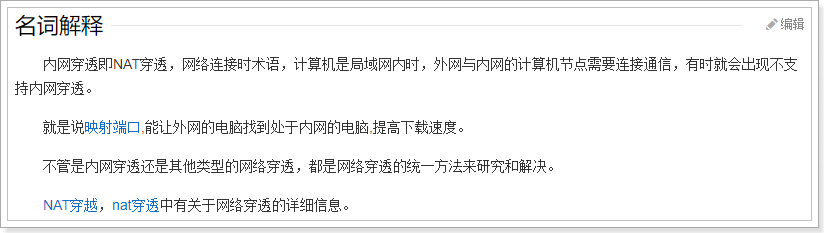

**简单来说内网穿透的目的是：让外网能访问你本地的应用，例如在外网打开你本地http://127.0.0.1指向的Web站点。**


在这里有一篇播客，详细介绍了几种内网穿透策略：[一分钟了解内网穿透](https://blog.csdn.net/zhangguo5/article/details/77848658?utm_source=5ibc.net&utm_medium=referral)


这里我们使用一个免费的内网穿透工具：Natapp：[NATAPP官网](https://natapp.cn)


详细教程在这里：[一分钟的natapp快速新手教程](https://natapp.cn/article/natapp_newbie)

启动后的样子：

 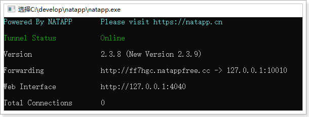

比如此处，我使用的natapp得到的域名是：http://ff7hgc.natappfree.cc，并且我设置指向到`127.0.0.1:10010`位置，也就是我的网关服务。


### 3）配置回调地址

设置内网穿透地址到配置文件application.yml：

```yaml
ly:
  pay:
    appId: wx8397f8696b538317
    mchId: 1473426802
    key: T6m9iK73b0kn9g5v426MKfHQH7X8rKwb
    notifyUrl: http://ff7hgc.natappfree.cc/api/pay/wx/notify
```

WxPayConfigImpl中本来就有notifyURL属性，因此会被自动注入。

### 4）网关白名单

因为异步回调是微信来访问我们的，因此不应该对登录做校验，我们把这个地址配置到白名单，修改ly-gateway中的application.yml

```yaml
ly:
  filter:
    allowPaths:
      - /api/pay
```

然后，将/api/pay映射到订单微服务：

```yaml
zuul:
  prefix: /api # 添加路由前缀
  routes:
    pay-service:
      path: /pay/**
      serviceId: order-service
      strip-prefix: false
```

## 4.2.支付结果通知API

来看官网关于结果通知的介绍：https://pay.weixin.qq.com/wiki/doc/api/native.php?chapter=9_7&index=8

> 应用场景

支付完成后，微信会把相关支付结果和用户信息发送给商户，商户需要接收处理，并返回应答。

对后台通知交互时，如果微信收到商户的应答不是成功或超时，微信认为通知失败，微信会通过一定的策略定期重新发起通知，尽可能提高通知的成功率，但微信不保证通知最终能成功。 （通知频率为15/15/30/180/1800/1800/1800/1800/3600，单位：秒）

**注意：同样的通知可能会多次发送给商户系统。商户系统必须能够正确处理重复的通知。**

推荐的做法是，当收到通知进行处理时，首先检查对应业务数据的状态，判断该通知是否已经处理过，如果没有处理过再进行处理，如果处理过直接返回结果成功。在对业务数据进行状态检查和处理之前，要采用数据锁进行并发控制，以避免函数重入造成的数据混乱。

**特别提醒：商户系统对于支付结果通知的内容一定要做`签名验证,并校验返回的订单金额是否与商户侧的订单金额一致`，防止数据泄漏导致出现“假通知”，造成资金损失。**


支付完成后，微信服务会自动向`notify_url`地址发起POST请求，请求参数是xml格式：

| 字段名     | 变量名      | 必填 | 类型        | 示例值  | 描述                                                         |
| ---------- | ----------- | ---- | ----------- | ------- | ------------------------------------------------------------ |
| 返回状态码 | return_code | 是   | String(16)  | SUCCESS | SUCCESS/FAIL此字段是通信标识，非交易标识，交易是否成功需要查看trade_state来判断 |
| 返回信息   | return_msg  | 是   | String(128) | OK      | 当return_code为FAIL时返回信息为错误原因 ，例如签名失败参数格式校验错误 |

通信成功，会返回下面信息：

| 签名           | sign           | 是   | String(32)  | C380BEC2BFD.. | 名，详见[签名算法](https://pay.weixin.qq.com/wiki/doc/api/native.php?chapter=4_3) |
| -------------- | -------------- | ---- | ----------- | ------------- | ------------------------------------------------------------ |
| 签名类型       | sign_type      | 否   | String(32)  | HMAC-SHA256   | 签名类型，目前支持HMAC-SHA256和MD5，默认为MD5                |
| 业务结果       | result_code    | 是   | String(16)  | SUCCESS       | SUCCESS/FAIL                                                 |
| 错误代码       | err_code       | 否   | String(32)  | SYSTEMERROR   | 错误返回的信息描述                                           |
| 错误代码描述   | err_code_des   | 否   | String(128) | 系统错误      | 错误返回的信息描述                                           |
| 用户标识       | openid         | 是   | String(128) | wxd930ea54f   | 用户在商户appid下的唯一标识                                  |
| 交易类型       | trade_type     | 是   | String(16)  | JSAPI         | JSAPI、NATIVE、APP                                           |
| 订单金额       | total_fee      | 是   | Int         | 100           | 订单总金额，单位为分                                         |
| 现金支付金额   | cash_fee       | 是   | Int         | 100           | 现金支付金额订单现金支付金额，详见[支付金额](https://pay.weixin.qq.com/wiki/doc/api/native.php?chapter=4_2) |
| 微信支付订单号 | transaction_id | 是   | String(32)  | 121775250120  | 微信支付订单号                                               |
| 商户订单号     | out_trade_no   | 是   | String(32)  | 12123212112   | 商户系统内部订单号，要求32个字符内，只能是数字、大小写字母_-\|*@ ，且在同一个商户号下唯一。 |

我们需要返回给微信的结果：

```xml
<xml>
  <return_code><![CDATA[SUCCESS]]></return_code>
  <return_msg><![CDATA[OK]]></return_msg>
</xml>
```


## 4.3.编写回调接口

先分析接口需要的四个数据：

- 请求方式：官方文档虽然没有明说，但是测试得出是POST请求
- 请求路径：我们之前指定的notify_url的路径是：/pay/wx/notify
- 请求参数：是xml格式数据，包括支付的结果和状态
- 返回结果：也是xml，表明是否成功

因为要接收xml格式数据，因此我们需要引入解析xml的依赖：

```xml
<dependency>
    <groupId>com.fasterxml.jackson.dataformat</groupId>
    <artifactId>jackson-dataformat-xml</artifactId>
    <version>2.9.6</version>
</dependency>
```

然后编写controller：

```java
package com.leyou.order.web;

import com.leyou.order.service.OrderService;
import lombok.extern.slf4j.Slf4j;
import org.springframework.beans.factory.annotation.Autowired;
import org.springframework.web.bind.annotation.PostMapping;
import org.springframework.web.bind.annotation.RequestBody;
import org.springframework.web.bind.annotation.RequestMapping;
import org.springframework.web.bind.annotation.RestController;

import java.util.HashMap;
import java.util.Map;

/**
 * @author 黑马程序员
 */
@Slf4j
@RestController
@RequestMapping("pay")
public class PayController {


    @Autowired
    private OrderService orderService;

    /**
     * 微信支付成功回调
     * @param result
     * @return
     */
    @PostMapping(value = "/wx/notify", produces = "application/xml")
    public Map<String, String> hello(@RequestBody Map<String,String> result){
        // 处理回调
        log.info("[支付回调] 接收微信支付回调, 结果:{}", result);
        orderService.handleNotify(result);

        // 返回成功
        Map<String, String> msg = new HashMap<>();
        msg.put("return_code", "SUCCESS");
        msg.put("return_msg", "OK");
        return msg;
    }
}
```


因为需要对结果的签名进行验证，所以在`PayHelper`中定义一个校验签名的算法：

```java
public void isValidSign(Map<String, String> result) throws Exception {
    boolean boo1 = WXPayUtil.isSignatureValid(result, payConfig.getKey(), WXPayConstants.SignType.MD5);
    boolean boo2 = WXPayUtil.isSignatureValid(result, payConfig.getKey(), WXPayConstants.SignType.HMACSHA256);
    if (!boo1 && !boo2) {
        throw new RuntimeException("【微信支付回调】签名有误");
    }
}
```

另外，支付是否成功，需要校验业务状态才知道，我们在`PayHelper`编写一个校验业务状态的方法：

```java
public void checkResultCode(Map<String, String> result) {
    // 检查业务状态
    String resultCode = result.get("result_code");
    if ("FAIL".equals(resultCode)) {
        log.error("【微信支付】微信支付业务失败，错误码：{}，原因：{}", result.get("err_code"), result.get("err_code_des"));
        throw new RuntimeException("【微信支付】微信支付业务失败");
    }
}
```


Service 代码：

service中需要完成下列代码；

- 签名校验
- 数据校验
  - 订单号码校验
  - 订单金额校验
- 更新订单状态

```java
@Transactional
public void handleNotify(Map<String, String> result) {
    // 1 签名校验
    try {
        payHelper.isValidSign(result);
    }catch (Exception e){
        log.error("【微信回调】微信签名有误！, result: {}",result, e);
        throw new LyException(ExceptionEnum.INVALID_NOTIFY_SIGN, e);
    }
    // 2、业务校验
    payHelper.checkResultCode(result);

    // 3 校验金额数据
    String totalFeeStr = result.get("total_fee");
    String tradeNo = result.get("out_trade_no");
    if(StringUtils.isEmpty(totalFeeStr) || StringUtils.isEmpty(tradeNo)){
        // 回调参数中必须包含订单编号和订单金额
        throw new LyException(ExceptionEnum.INVALID_NOTIFY_PARAM);
    }
    // 3.1 获取结果中的金额
    long totalFee = Long.valueOf(totalFeeStr);
    // 3.2 获取订单
    Long orderId = Long.valueOf(tradeNo);
    Order order = orderMapper.selectByPrimaryKey(orderId);
    // 3.3.判断订单的状态，保证幂等
    if(!order.getStatus().equals(OrderStatusEnum.INIT.value())){
        // 订单已经支付，返回成功
        return;
    }
    // 3.4.判断金额是否一致
    if(totalFee != /*order.getActualPay()*/ 1){
        // 金额不符
        throw new LyException(ExceptionEnum.INVALID_NOTIFY_PARAM);
    }

    // 4 修改订单状态
    Order orderStatus = new Order();
    orderStatus.setStatus(OrderStatusEnum.PAY_UP.value());
    orderStatus.setOrderId(orderId);
    orderStatus.setPayTime(new Date());
    int count = orderMapper.updateByPrimaryKeySelective(orderStatus);
    if(count != 1){
        log.error("【微信回调】更新订单状态失败，订单id：{}", orderId);
        throw new LyException(ExceptionEnum.UPDATE_OPERATION_FAIL);
    }
    log.info("【微信回调】, 订单支付成功! 订单编号:{}", orderId);
}
```


# 5.支付状态查询

当用户扫码支付成功，会自动调用回调接口，从而修改订单状态，完成订单支付。

但是，页面上并不知道支付是否成功。怎么办？


## 5.1.页面查询支付状态

因为不知道用户什么时候会支付，也不知道支付有没有成功，因此页面会采用定时任务，不断查询订单支付的状态：

```js
// 开启定时任务，查询付款状态
const taskId = setInterval(() => {
    ly.http.get("/order/state/" + id)
        .then(resp => {
        let i = resp.data;
        if (i !== 1) {
            // 付款成功
            clearInterval(taskId);
            // 跳转到付款成功页
            location.href = "/paysuccess.html?orderId=" + id;
        }
    }).catch((e) => {
        alert("支付状态查询失败，请刷新页面重试。");
        clearInterval(taskId);
    })
}, 3000);
// 同时设置一个定时任务，10分钟后，终止查询，认为付款失败
setTimeout(() => {
    clearInterval(taskId);
    location.href = "/payfail.html?orderId=" + id;
}, 600000)
```

每隔5秒就会查询一次，为了防止用户一直不支付的情况，又设置了一个定时任务，10分钟后跳转到支付失败页面。


## 5.2.支付状态查询接口

上面的查询请求 分析：

- 请求方式：Get
- 请求路径 ：/state/{id}
- 请求参数：订单id
- 返回结果：1或者其它，1代表未支付，其它是已经支付

controller：

```java
@GetMapping("/state/{id}")
public ResponseEntity<Integer> queryPayState(@PathVariable("id") Long orderId) {
    return ResponseEntity.ok(orderService.queryPayStatus(orderId));
}
```

service：

```java
public Integer queryOrderStatus(Long orderId) {
    Order order = orderMapper.selectByPrimaryKey(orderId);
    if(order == null){
        throw new LyException(ExceptionEnum.ORDER_NOT_FOUND);
    }
    return order.getStatus();
}
```


