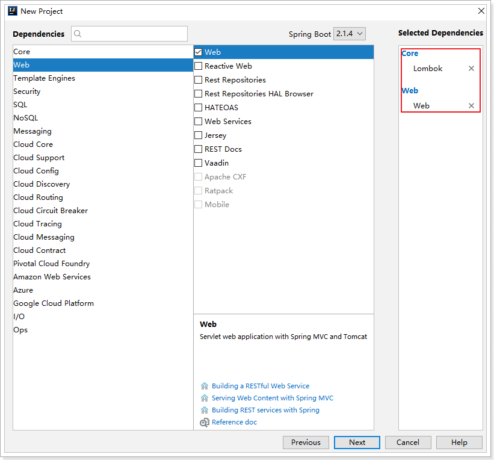
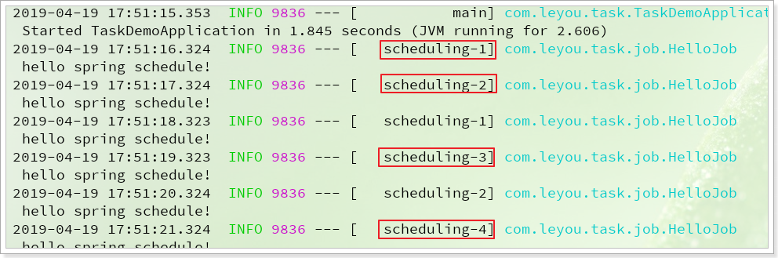
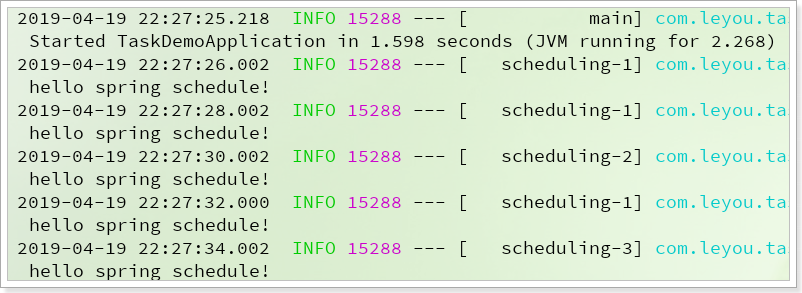
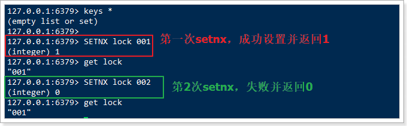
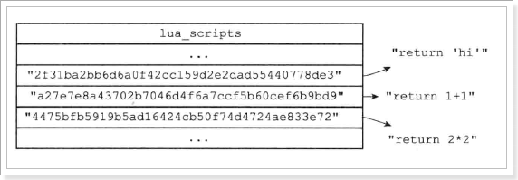
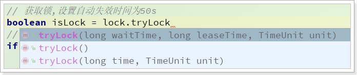
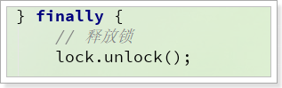

# 0.学习目标

- 定时任务
- 清理超时未支付的订单


# 1.SpringSchedule

我们完成了订单的创建，并且生成了支付的二维码，但是如果用户一直不支付，就会导致商品库存被占用，而不能形成有效交易。在商品资源有限时，会损害商家的利益。

比较常见的做法，是定时统计，对于超时未支付的订单，自动关闭并释放库存。

这就需要定时任务的支持了。

## 1.1.常见的定时任务框架

目前常用的定时任务实现:

| 实现方式        | cron表达式 | 固定时间执行 | 固定频率执行 | 开发难易程度 |
| --------------- | ---------- | ------------ | ------------ | ------------ |
| JDK 的TimeTask  | 不支持     | 支持         | 支持         | 复杂         |
| Spring Schedule | 支持       | 支持         | 支持         | 简单         |
| Quartz          | 支持       | 支持         | 支持         | 难           |

从以上表格可以看出，Spring Schedule框架功能完善，简单易用。对于中小型项目需求，Spring Schedule是完全可以胜任的。


## 1.2.简介

Spring Schedule是Spring  Framework的其中一部分功能：


并且在SpringBoot中已经默认对Spring的Schedule实现了自动配置，使用时只需要简单注解和部分属性设置即可。

## 1.3.快速入门

我们新建一个Demo工程，完成入门案例的测试：

### 1.3.1.创建项目

使用Spring的 initializr来搭建项目：


选择依赖：



### 1.3.2.开启定时任务

要开启定时任务功能，只需要在启动类上加载一个`@EnableScheduling`注解即可：

```java
@SpringBootApplication
@EnableScheduling
public class TaskDemoApplication {

    public static void main(String[] args) {
        SpringApplication.run(TaskDemoApplication.class, args);
    }
}
```

### 1.3.3.定义任务

定义任务，需要散步：

- 声明类，通过`@Component`注解注册到Spring容器
- 类中定义方法，方法内部编写任务逻辑
- 方法上添加注解`@Scheduled(fixedRate = 1000)`来定义任务执行频率，
  - 这里的fiexRate=1000，代表是每隔1000毫秒执行一次

 

```java
package com.leyou.task.job;

import lombok.extern.slf4j.Slf4j;
import org.springframework.scheduling.annotation.Scheduled;
import org.springframework.stereotype.Component;

/**
 * @author 黑马程序员
 */
@Slf4j
@Component
public class HelloJob {

    @Scheduled(fixedRate = 1000)
    public void hello(){
        log.info("hello spring schedule!");
    }
}
```

### 1.3.4.启动测试

启动项目，可以在控制台看到任务执行情况：


## 1.4.配置

定时任务有许多可以自定义的配置属性：

### 1.4.1.任务线程池大小

默认情况下，定时任务的线程池大小只有1，**当任务较多执行频繁时，会出现阻塞等待的情况**，任务调度器就会出现**时间漂移**，任务执行时间将不确定。

为了避免这样的情况发生，我们需要自定义线程池的大小：

修改application.yml即可实现：

```yaml
spring:
  task:
    scheduling:
      pool:
        size: 10
```

重启项目后测试：



可以看到执行时会切换到不同的线程执行。

### 1.4.2.定时策略

在方法上添加注解`@Scheduled`可以控制定时执行的频率，有三种策略：

- fixedRate：按照固定时间频率执行，单位毫秒，即每xx毫秒执行一次。
  - 如果上一个任务阻塞导致任务积压，则会在当前任务执行后，一次把多个积压的任务都执行完成
  - 举例：假如任务执行每秒1次，而第一个任务执行耗时4秒，会导致4个任务积压，在第一个任务执行后，积压的4个任务会立即执行，不再等待
- fixedDelay：固定延迟执行，单位毫秒，即前一个任务执行结束后xx毫秒执行第二个任务。
  - 如果上一个任务阻塞导致任务积压，则会在当前任务执行后xx毫秒执行下一个任务
- cron：知名的cron表达式，使用表达式规则来定义任务执行策略，与fixedDelay类似的。


### 1.4.3.cron表达式

什么是cron表达式呢？

Cron表达式是一个字符串，字符串包含6或7个域，每一个域代表一个含义，例如秒、分。域和域之间以空格隔开，有如下两种语法格式：

-  Seconds Minutes Hours DayofMonth Month DayofWeek Year
- Seconds Minutes Hours DayofMonth Month DayofWeek

cron表达式规则：

| 域                       | 允许值                                 | 允许的特殊字符           |
| ------------------------ | -------------------------------------- | ------------------------ |
| 秒（Seconds）            | 0~59的整数                             | ,   -   *   /            |
| 分（*Minutes*）          | 0~59的整数                             | ,   -   *   /            |
| 小时（*Hours*）          | 0~23的整数                             | ,   -   *   /            |
| 日期（*DayofMonth*）     | 1~31的整数（但是你需要考虑你月的天数） | ,   -   *  ?   /  L W C  |
| 月份（*Month*）          | 1~12的整数或者 JAN-DEC                 | ,   -   *   /            |
| 星期（*DayofWeek*）      | 1~7的整数或者 SUN-SAT （1=SUN）        | ,   -   *  ?   /  L C  # |
| 年(可选，留空)（*Year*） | 1970~2099                              | ,   -   *   /            |

每个域上一般都是数字，或者指定允许的特殊字符：

| 特殊字符 | 说明                                                         |
| -------- | ------------------------------------------------------------ |
| *        | 表示匹配该域的任意值。假如在Minutes域使用, 即表示每分钟都会触发事件 |
| ?        | 只能用在DayofMonth和DayofWeek两个域中的一个。它表示不确定的值 |
| -        | 表示范围。例如在Hours域使用5-8，表示从5点、6点、7点、8点各执行一次 |
| ,        | 表示列出枚举值。例如：在week域使用FRI,SUN，表示星期五和星期六执行 |
| /        | 一般用法：x/y，从x开始，每次递增y。如果放在minutes域，5/15，表示每小时的5分钟开始，每隔15分钟一次，即：5分钟、20分钟、35分钟、50分钟时执行 |
| L        | 表示最后，只能出现在DayofWeek和DayofMonth域。如果在DayOfMonth中，代表每个月的最后一天。如果是在DayOfWeek域，表示每周最后一天（周六），但是如果是：数字+L，如6L表示每月的 最后一个周五 |
| W        | 表示最近的有效工作日(周一到周五),只能出现在DayofMonth域，系统将在离指定日期的最近的有效工作日触发事件。例如：在 DayofMonth使用5W，如果5日是星期六，则将在最近的工作日：星期五，即4日触发。如果5日是星期天，则在6日(周一)触发；如果5日在星期一到星期五中的一天，则就在5日触发。另外一点，W的最近寻找不会跨过月份 。 |
| LW       | 两个字符可以连用，表示在某个月最后一个工作日，即最后一个星期五 |
| #        | 用在DayOfMonth中，确定每个月第几个星期几。例如在4#2，表示某月的第二个星期三（2表示当月的第二周，4表示这周的第4天，即星期三）。 |


示例：

| 表达式                     | 含义                                                 |
| -------------------------- | ---------------------------------------------------- |
| `0 0 2 1 * ?  *`           | 表示在每月的1日的凌晨2点执行任务                     |
| `0 15 10 ?  * MON-FRI`     | 表示周一到周五每天上午10:15执行作                    |
| `0 15 10 ? * 6L 2002-2020` | 表示2002-2006年的每个月的最后一个星期五上午10:15执行 |
| `0 0 9-21 * * 2-7`         | 朝九晚五工作时间内每半小时                           |

我们把代码修改一下：

```java
/**
 * @author 黑马程序员
 */
@Slf4j
@Component
public class HelloJob {

    @Scheduled(cron = "0/2 * * * * ?")
    public void hello() throws InterruptedException {
        log.info("hello spring schedule!");
    }
}
```

测试：




# 2.分布式任务调度

现在，假设我们在订单系统中已经引入了定时任务，并且定时去清理那些超时未付款的订单，而后恢复商品库存。如果是单机部署没有什么问题，但是，如果我们的订单系统搭建成集群呢？

当任务触发时，可能订单服务集群的每个节点都会去执行定时任务，有可能对同一个订单执行多次操作，因此也会导致库存增加多次，这样就出事了。

而且，扫描和清理订单，也不需要让每一个订单服务都去执行，只要一个服务节点执行就可以了。


因此，如何解决分布式集群下的定时任务分配，就是**分布式任务调度**了。

## 2.1.解决方案分析

解决方案有多种，利用我们现有的知识就可以解决，大家可以思考一下。

- 方案一：
  - 利用锁限制任务串行执行，同一时刻只能有一个节点执行任务。
- 方案二：
  - 创建分布式任务调度中心，记录定时任务，触发时不执行业务，而是通知微服务集群，利用负载均衡算法，实现任务调度。有许多的开源框架实现了这样的功能，比如：Quartz、Elastic-Job、XXL-Job等

两种方案各有自己的优缺点，我们先尝试方案一。


## 2.2.分布式锁方案

方案一的思路是利用锁，把多线程并发执行变成只有线程串行执行。大家可能会觉得，我们直接使用Synchronized来把要执行的任务锁定不就好了吗。

但是，在分布式系统，因为是多服务器部署，跨虚拟机，传统锁机制是不管用的。此时就必须使用分布式锁了。为什么呢？


> 传统锁

当存在多个线程可以同时修改某个共享变量时，因为有并发写的情况，可能会出现丢失更新、数据不一致等情况，出现线程安全问题。此时我们就需要理由锁或同步机制，保证多线程串行执行，避免安全问题发生。

锁的本质是一个标记，为了保证多个线程在一个时刻同一个代码块只能有一个线程可执行，那么需要在某个地方做个标记，**这个标记必须每个线程都能看到**，当标记不存在时可以设置该标记，其余后续线程发现已经有标记了则等待拥有标记的线程结束同步代码块取消标记后再去尝试设置标记。这个标记可以理解为锁。

> 分布式锁

在单机系统中，因为只有一个JVM进程，进程中有多线程。因此多个线程可以共享内存空间，每个线程都可以看到这个内存标记，从而实现锁的效果。

但是，在分布式系统中，因为每个系统部署都是独立的JVM进程，多进程之间不共享内存， 写在内存中的标记只对自己可见，锁就失效了。

因此，分布式系统下，如果能够把锁的标记放到一个多进程共享的内存中，**保证多进程可见**，那么就可以实现与单进程锁一样的效果了，这样的锁就是**分布式锁**。

多进程共享的内存实现有多种方式，例如`Redis`、`Memcache`、`Zookeeper`等，其原理都基本类似，只要满足下列要求即可：

- 多进程可见：多进程可见，否则就无法实现分布式效果
- 避免死锁：死锁的情况有很多，我们要思考各种异常导致死锁的情况，保证锁可以被释放
- 排它（互斥）：同一时刻，只能有一个进程获得锁
- 高可用：避免锁服务宕机或处理好宕机的补救措施


这种实现方案的特点：

- 实现**简单**
- 功能单一，只能实现竞争式的分布式锁，
- 多个竞争的服务往往只有某几个在执行任务，没有负载均衡，效率较差
- 缺乏任务管理的统计和UI交互

不过，目前就订单的定时清理业务而言，分布式锁方案非常适合。


## 2.3.任务调度中心方案

基于任务调度中心的分布式任务框架有很多，比如：

- Quartz：Java上的定时任务标准。但Quartz关注点在于定时任务而非数据，并无一套根据数据处理而定制化的流程。虽然Quartz可以基于数据库实现作业的高可用，但缺少分布式并行调度的功能
- TBSchedule：阿里早期开源的分布式任务调度系统。代码略陈旧，使用timer而非线程池执行任务调度。众所周知，timer在处理异常状况时是有缺陷的。而且TBSchedule作业类型较为单一，只能是获取/处理数据一种模式。还有就是文档缺失比较严重
- elastic-job：当当开发的弹性分布式任务调度系统，功能丰富强大，采用zookeeper实现分布式协调，实现任务高可用以及分片，目前是版本2.15，并且可以支持云开发
- Saturn：是唯品会自主研发的分布式的定时任务的调度平台，基于当当的elastic-job 版本1开发，并且可以很好的部署到docker容器上。
- xxl-job: 是大众点评员工徐雪里于2015年发布的分布式任务调度平台，是一个轻量级分布式任务调度框架，其核心设计目标是开发迅速、学习简单、轻量级、易扩展。


以上框架中，目前比较流行的主要是两个：elastic-job和xxl-job

elastic-job，目前在GitHub上有4.8K的start：


最后一次提交的时间是在：2018年的5月28日


xxl-job，目前的GitHub星数是：7.8K


最后一次提交日期是：2019年4月24日


由此对比可知：xxl-job的热度更高，也更活跃，推荐使用xxl-job

官网：http://www.xuxueli.com/xxl-job/#/


# 3.Redis分布式锁

因为Redis具备高性能、高可用、高并发的特性，这里，我们会采用Redis来实现分布式锁。

## 3.1.Redis分布式锁原理

上面讲过，分布式锁的关键是**多进程共享的内存标记**，因此只要我们在Redis中放置一个这样的标记就可以了。不过在实现过程中，不要忘了我们需要实现下列目标：

- 多进程可见：多进程可见，否则就无法实现分布式效果
- 避免死锁：死锁的情况有很多，我们要思考各种异常导致死锁的情况，保证锁可以被释放
- 排它：同一时刻，只能有一个进程获得锁
- 高可用：避免锁服务宕机或处理好宕机的补救措施

在Redis中我们可以用下面的方式来解决上述问题：

- **多进程可见**：多进程可见，否则就无法实现分布式效果

  - redis本身就是多服务共享的，因此自然满足

- **排它**：同一时刻，只能有一个进程获得锁

  - 我们需要利用Redis的setnx命令来实现，setnx是set when not exits的意思。当多次执行setnx命令时，只有第一次执行的才会成功并返回1，其它情况返回0：
  -  
  - 我们定义一个固定的key，多个进程都执行setnx，设置这个key的值，返回1的服务获取锁，0则没有获取

- **避免死锁**：死锁的情况有很多，我们要思考各种异常导致死锁的情况

  - 比如服务宕机后的锁释放问题，我们设置锁时最好设置锁的有效期，如果服务宕机，有效期到时自动删除锁。

     

- **高可用**：避免锁服务宕机或处理好宕机的补救措施

  - 利用Redis的主从、哨兵、集群，保证高可用

## 3.2.分布式锁版本1

### 3.2.1.流程

按照上面所述的理论，分布式锁的流程大概如下：

 

基本流程：

- 1、通过set命令设置锁
- 2、判断返回结果是否是OK
  - 1）Nil，获取失败，结束或重试（自旋锁）
  - 2）OK，获取锁成功
    - 执行业务
    - 释放锁，DEL 删除key即可
- 3、异常情况，服务宕机。超时时间EX结束，会自动释放锁

### 3.2.2.代码实现

定义一个锁接口：

```java
package com.leyou.task.utils;

/**
 * @author 黑马程序员
 */
public interface RedisLock {
    boolean lock(long releaseTime);
    void unlock();
}

```


先定义一个锁工具：

```java
package com.leyou.task.utils;

import org.springframework.data.redis.core.StringRedisTemplate;

import java.util.concurrent.TimeUnit;

/**
 * @author 黑马程序员
 */
public class SimpleRedisLock implements RedisLock{

    private StringRedisTemplate redisTemplate;
    /**
     * 设定好锁对应的 key
     */
    private String key;
    /**
     * 锁对应的值，无意义，写为1
     */
    private static final String value = "1";

    public SimpleRedisLock(StringRedisTemplate redisTemplate, String key) {
        this.redisTemplate = redisTemplate;
        this.key = key;
    }

    public boolean lock(long releaseTime) {
        // 尝试获取锁
        Boolean boo = redisTemplate.opsForValue().setIfAbsent(key, value, releaseTime, TimeUnit.SECONDS);
        // 判断结果
        return boo != null && boo;
    }

    public void unlock(){
        // 删除key即可释放锁
        redisTemplate.delete(key);
    }
}
```

在定时任务中使用锁：

```java
package com.leyou.task.job;

import com.leyou.task.utils.SimpleRedisLock;
import lombok.extern.slf4j.Slf4j;
import org.springframework.beans.factory.annotation.Autowired;
import org.springframework.data.redis.core.StringRedisTemplate;
import org.springframework.scheduling.annotation.Scheduled;
import org.springframework.stereotype.Component;

/**
 * @author 黑马程序员
 */
@Slf4j
@Component
public class HelloJob {

    @Autowired
    private StringRedisTemplate redisTemplate;

    @Scheduled(cron = "0/10 * * * * ?") 
    public void hello() {
        // 创建锁对象
        RedisLock lock = new SimpleRedisLock(redisTemplate, "lock");
        // 获取锁,设置自动失效时间为50s
        boolean isLock = lock.lock(50);
        // 判断是否获取锁
        if (!isLock) {
            // 获取失败
            log.info("获取锁失败，停止定时任务");
            return;
        }
        try {
            // 执行业务
            log.info("获取锁成功，执行定时任务。");
            // 模拟任务耗时
            Thread.sleep(500);
        } catch (InterruptedException e) {
            log.error("任务执行异常", e);
        } finally {
            // 释放锁
            lock.unlock();
        }
    }
}
```

 


## 3.3.分布式锁版本2

刚才的锁有没有什么问题？

### 3.3.1.释放锁的问题

大家思考一下，释放锁就是用DEL语句把锁对应的key给删除，有没有这么一种可能性：

1. 两个进程：A和B和C，在执行任务，并争抢锁，此时A获取了锁，并设置自动过期时间为10s
2. A开始执行业务，因为某种原因，业务阻塞，耗时超过了10秒，此时锁自动释放了
3. B恰好此时开始尝试获取锁，因为锁已经自动释放，成功获取锁
4. A此时业务执行完毕，执行释放锁逻辑（删除key），于是B的锁被释放了，而B其实还在执行业务
5. 此时进程C尝试获取锁，也成功了，因为A把B的锁删除了。

问题出现了：B和C同时获取了锁，违反了排它性！

如何解决这个问题呢？我们应该在删除锁之前，判断这个锁是否是自己设置的锁，如果不是（例如自己的锁已经超时释放），那么就不要删除了。


那么问题来了：**如何得知当前获取锁的是不是自己**呢？

对了，我们可以在set 锁时，存入自己的信息！删除锁前，判断下里面的值是不是与自己相等，如果不等，就不要删除了。

### 3.3.2.流程图

来看下流程的变化：

 

在释放锁之前，多了一步根据判断，判断锁的value释放跟自己存进去的一致。

### 3.3.3.代码实现

```java
package com.leyou.task.utils;

import org.springframework.data.redis.core.StringRedisTemplate;

import java.util.UUID;
import java.util.concurrent.TimeUnit;

/**
 * @author 黑马程序员
 */
public class SimpleRedisLock implements RedisLock{

    private StringRedisTemplate redisTemplate;
    /**
     * 设定好锁对应的 key
     */
    private String key;
    /**
     * 存入的线程信息的前缀，防止与其它JVM中线程信息冲突
     */
    private final String ID_PREFIX = UUID.randomUUID().toString();

    public SimpleRedisLock(StringRedisTemplate redisTemplate, String key) {
        this.redisTemplate = redisTemplate;
        this.key = key;
    }

    public boolean lock(long releaseTime) {
        // 获取线程信息作为值，方便判断是否是自己的锁
        String value = ID_PREFIX + Thread.currentThread().getId();
        // 尝试获取锁
        Boolean boo = redisTemplate.opsForValue().setIfAbsent(key, value, releaseTime, TimeUnit.SECONDS);
        // 判断结果
        return boo != null && boo;
    }

    public void unlock(){
        // 获取线程信息作为值，方便判断是否是自己的锁
        String value = ID_PREFIX + Thread.currentThread().getId();
        // 获取现在的锁的值
        String val = redisTemplate.opsForValue().get(key);
        // 判断是否是自己
        if(value.equals(val)) {
            // 删除key即可释放锁
            redisTemplate.delete(key);
        }
    }
}
```


## 3.4.分布式锁版本3

刚才的锁有没有什么问题？

如果我们在获取锁以后，执行代码的过程中，再次尝试获取锁，执行setnx肯定会失败，因为锁已经存在了。这样就是**不可重入锁**，有可能导致死锁。

如何解决呢？

当然是想办法改造成**可重入锁**。

### 3.4.1.重入锁

什么叫做可重入锁呢？

> 可重入锁，也叫做递归锁，指的是在同一线程内，外层函数获得锁之后，内层递归函数仍然可以获取到该锁。换一种说法：**同一个线程再次进入同步代码时，可以使用自己已获取到的锁。**


可重入锁可以避免因同一线程中多次获取锁而导致死锁发生。


那么，如何实现可重入锁呢？

其中的关键，就是**在锁已经被使用时，判断这个锁是否是自己的，如果是则再次获取**。


我们可以在set锁的值是，**存入获取锁的线程的信息**，这样下次再来时，就能知道当前持有锁的是不是自己，如果是就允许再次获取锁。


要注意，因为锁的获取是**可重入**的，因此必须记录重入的次数，这样不至于在释放锁时一下就释放掉，而是逐层释放。

因此，不能再使用简单的key-value结构，这里推荐使用hash结构：

- key：lock
- hashKey：线程信息
- hashValue：重入次数，默认1


释放锁时，每次都把**重入次数减一**，减到0说明多次获取锁的逻辑都执行完毕，才可以删除key，释放锁


### 3.4.2.流程图

这里重点是获取锁的流程：


下面我们假设锁的key为“`lock`”，hashKey是当前线程的id：“`threadId`”，锁自动释放时间假设为20

获取锁的步骤：

- 1、判断lock是否存在 `EXISTS lock`
  - 存在，说明有人获取锁了，下面判断是不是自己的锁
    - 判断当前线程id作为hashKey是否存在：`HEXISTS lock threadId`
      - 不存在，说明锁已经有了，且不是自己获取的，锁获取失败，end
      - 存在，说明是自己获取的锁，重入次数+1：`HINCRBY lock threadId 1`，去到步骤3
  - 2、不存在，说明可以获取锁，`HSET key threadId 1`
  - 3、设置锁自动释放时间，`EXPIRE lock 20`

释放锁的步骤：

- 1、判断当前线程id作为hashKey是否存在：`HEXISTS lock threadId`
  - 不存在，说明锁已经失效，不用管了
  - 存在，说明锁还在，重入次数减1：`HINCRBY lock threadId -1`，获取新的重入次数
- 2、判断重入次数是否为0：
  - 为0，说明锁全部释放，删除key：`DEL lock`
  - 大于0，说明锁还在使用，重置有效时间：`EXPIRE lock 20`


### 3.4.3.实现分析

上述流程有一个最大的问题，就是有大量的判断，这样在多线程运行时，会有线程安全问题，除非能保证**执行**

**命令的原子性**。

因此，这里使用java代码无法实现，那该怎么办呢？

Redis支持一种特殊的执行方式：lua脚本执行，lua脚本中可以定义多条语句，语句执行具备原子性。


## 3.5.Redis的Lua脚本

其实实现Redis的原子操作有多种方式，比如Redis事务，但是相比而言，使用Redis的Lua脚本更加优秀，具有不可替代的好处：

- 原子性：redis会将整个脚本作为一个整体执行，不会被其他命令插入。

- 复用：客户端发送的脚步会永久存在redis中，以后可以重复使用，而且各个Redis客户端可以共用。
- 高效：Lua脚本解析后会形成缓存，不用每次执行都解析。
- 减少网络开销：Lua脚步缓存后，可以形成SHA值，作为缓存的key，以后调用可以直接根据SHA值来调用脚本，不用每次发送完整脚本，较少网络占用和时延

### 3.5.1.Redis脚本命令：

通过下面这个命令，可以看到所有脚本相关命令：

```
help @scripting
```


我们看一些常用命令

> EVAL命令：

 

直接执行一段脚本，参数包括：

- script：脚本内容，或者脚本地址
- numkeys：脚本中用到的key的数量，接下来的numkeys个参数会作为key参数，剩下的作为arg参数
- key：作为key的参数，会被存入脚本环境中的KEYS数组，角标从1开始
- arg：其它参数，会被存入脚本环境中的ARGV数组，角标从1开始


示例：`EVAL "return 'hello world!'" 0`，其中：

- `"return 'hello world!'"`：就是脚本的内容，直接返回字符串，没有别的命令
- `0`：就是说没有用key参数，直接返回

效果：

 


> SCRIPT LOAD命令

 

将一段脚本编译并缓存起来，生成一个SHA1值并返回，作为脚本字典的key，方便下次使用。

参数script就是脚本内容或地址。

以之前案例中的的脚本为例：

 

此处返回的`ada0bc9efe2392bdcc0083f7f8deaca2da7f32ec`就是脚本缓存后得到的sha1值。

在脚本字典中，每一个这样的sha1值，对应一段解析好的脚本：

 


> EVALSHA 命令：

 

与EVAL类似，执行一段脚本，区别是通过脚本的sha1值，去脚本缓存中查找，然后执行，参数：

- sha1：就是脚本对应的sha1值

我们用刚刚缓存的脚本为例：

 


### 3.5.2.Lua基本语法

Lua脚本遵循Lua的基本语法，这里我们简单介绍几个常用的：

> redis.call()和redis.pcall()

这两个函数是调用redis命令的函数，区别在于call执行过程中出现错误会直接返回错误；pcall则在遇到错误后，会继续向下执行。基本语法类似：

```lua
redis.call("命令名称", 参数1， 参数2 ...)
```

例如这样的脚本：`return redis.call('set', KEYS[1], ARGV[1])`

- 'set'：就是执行set 命令
- KEYS[1]：从脚本环境中KEYS数组里取第一个key参数
- ARGV[1]：从脚本环境中ARGV数组里取第一个arg参数

完整示例：

 

执行这段脚本时传入的参数：

- 1：声明key只有一个，接下来的第一个参数作为key参数
- name：key参数，会被存入到KEYS数组
- Jack：arg参数，会被存入ARGV数组


> 条件判断和变量

条件判断语法：`if (条件语句) then ...; else ...; end;`

变量接收语法：`local num = 123;`

示例：

```lua
local val = redis.call('get', KEYS[1]);
if (val > ARGV[1]) then 
    return 1; 
else 
	return 0; 
end;
```

基本逻辑：获取指定key的值，判断是否大于指定参数，如果大于则返回1，否则返回0

执行：


- 可以看到num一开始是321。

- 我们保存脚本，
- 然后执行并传递num，400。判断num是否大于400，
- 结果返回0.

### 3.5.3.编写分布式锁脚本

这里我们假设有3个参数：

- KEYS[1]：就是锁的key
- ARGV[1]：就是线程id信息
- ARGV[2]：锁过期时长

首先是获取锁：

```lua
if (redis.call('EXISTS', KEYS[1]) == 0) then
    redis.call('HSET', KEYS[1], ARGV[1], 1);
    redis.call('EXPIRE', KEYS[1], ARGV[2]);
    return 1;
end;
if (redis.call('HEXISTS', KEYS[1], ARGV[1]) == 1) then
    redis.call('HINCRBY', KEYS[1], ARGV[1], 1);
    redis.call('EXPIRE', KEYS[1], ARGV[2]);
    return 1;
end;
return 0;
```

然后是释放锁：

```lua
if (redis.call('HEXISTS', KEYS[1], ARGV[1]) == 0) then
    return nil;
end;
local count = redis.call('HINCRBY', KEYS[1], ARGV[1], -1);
if (count > 0) then
    redis.call('EXPIRE', KEYS[1], ARGV[2]);
    return nil;
else
    redis.call('DEL', KEYS[1]);
    return nil;
end;
```


### 3.5.4.Java执行Lua脚本

`RedisTemplate`中提供了一个方法，用来执行Lua脚本：


包含3个参数：

- `RedisScript<T> script`：封装了Lua脚本的对象
- `List<K> keys`：脚本中的key的值
- `Object ... args`：脚本中的参数的值

因此，要执行Lua脚本，我们需要先把脚本封装到`RedisScript`对象中，有两种方式来构建`RedisScript`对象：

> 方式1：

通过RedisScript中的静态方法：


这个方法接受两个参数：

- `String script`：Lua脚本
- `Class<T> resultType`：返回值类型

需要把脚本内容写到代码中，作为参数传递，不够优雅。

> 方式二

另一种方式，就是自己去创建`RedisScript`的实现类`DefaultRedisScript`的对象：


可以把脚本文件写到classpath下的某个位置，然后通过加载这个文件来获取脚本内容，并设置给`DefaultRedisScript`实例。

此处我们选择方式二。

### 3.5.5.可重入分布式锁的实现

首先在classpath中编写两个Lua脚本文件：

 

然后编写一个新的RedisLock实现：ReentrantRedisLock，利用静态代码块来加载脚本并初始化：

 

```java
public class ReentrantRedisLock {
    // 获取锁的脚本
    private static final DefaultRedisScript<Long> LOCK_SCRIPT;
    // 释放锁的脚本
    private static final DefaultRedisScript<Object> UNLOCK_SCRIPT;
    static {
        // 加载释放锁的脚本
        LOCK_SCRIPT = new DefaultRedisScript<>();
        LOCK_SCRIPT.setScriptSource(new ResourceScriptSource(new ClassPathResource("lock.lua")));
        LOCK_SCRIPT.setResultType(Long.class);

        // 加载释放锁的脚本
        UNLOCK_SCRIPT = new DefaultRedisScript<>();
        UNLOCK_SCRIPT.setScriptSource(new ResourceScriptSource(new ClassPathResource("unlock.lua")));
    }
    
    // 其它代码略
}
```


然后实现RedisLock并实现lock和unlock方法，完整代码如下：

```java
public class ReentrantRedisLock implements RedisLock {

    private StringRedisTemplate redisTemplate;
    /**
     * 设定好锁对应的 key
     */
    private String key;

    /**
     * 存入的线程信息的前缀，防止与其它JVM中线程信息冲突
     */
    private final String ID_PREFIX = UUID.randomUUID().toString();

    public ReentrantRedisLock(StringRedisTemplate redisTemplate, String key) {
        this.redisTemplate = redisTemplate;
        this.key = key;
    }

    private static final DefaultRedisScript<Long> LOCK_SCRIPT;
    private static final DefaultRedisScript<Object> UNLOCK_SCRIPT;
    static {
        // 加载释放锁的脚本
        LOCK_SCRIPT = new DefaultRedisScript<>();
        LOCK_SCRIPT.setScriptSource(new ResourceScriptSource(new ClassPathResource("lock.lua")));
        LOCK_SCRIPT.setResultType(Long.class);

        // 加载释放锁的脚本
        UNLOCK_SCRIPT = new DefaultRedisScript<>();
        UNLOCK_SCRIPT.setScriptSource(new ResourceScriptSource(new ClassPathResource("unlock.lua")));
    }
    // 锁释放时间
    private String releaseTime;

    @Override
    public boolean lock(long releaseTime) {
        // 记录释放时间
        this.releaseTime = String.valueOf(releaseTime);
        // 执行脚本
        Long result = redisTemplate.execute(
                LOCK_SCRIPT,
                Collections.singletonList(key),
                ID_PREFIX + Thread.currentThread().getId(), this.releaseTime);
        // 判断结果
        return result != null && result.intValue() == 1;
    }

    @Override
    public void unlock() {
        // 执行脚本
        redisTemplate.execute(
                UNLOCK_SCRIPT,
                Collections.singletonList(key),
                ID_PREFIX + Thread.currentThread().getId(), this.releaseTime);
    }
}
```

完成！

### 3.5.6.测试

新建一个定时任务，测试重入锁：

```java
package com.leyou.task.job;

import com.leyou.task.utils.RedisLock;
import com.leyou.task.utils.ReentrantRedisLock;
import lombok.extern.slf4j.Slf4j;
import org.springframework.beans.factory.annotation.Autowired;
import org.springframework.data.redis.core.StringRedisTemplate;
import org.springframework.scheduling.annotation.Scheduled;
import org.springframework.stereotype.Component;

/**
 * @author 黑马程序员
 */
@Slf4j
@Component
public class ReentrantJob {

    @Autowired
    private StringRedisTemplate redisTemplate;

    private int max = 2;

    @Scheduled(cron = "0/10 * * * * ?")
    public void hello() {
        // 创建锁对象
        RedisLock lock = new ReentrantRedisLock(redisTemplate, "lock");
        // 执行任务
        runTaskWithLock(lock, 1);
    }

    private void runTaskWithLock(RedisLock lock, int count) {
        // 获取锁,设置自动失效时间为50s
        boolean isLock = lock.lock(50);
        // 判断是否获取锁
        if (!isLock) {
            // 获取失败
            log.info("{}层 获取锁失败，停止定时任务", count);
            return;
        }
        try {
            // 执行业务
            log.info("{}层 获取锁成功，执行定时任务。", count);
            Thread.sleep(500);
            if(count < max){
                runTaskWithLock(lock, count + 1);
            }
        } catch (InterruptedException e) {
            log.error("{}层 任务执行失败", count, e);
        } finally {
            // 释放锁
            lock.unlock();
            log.info("{}层 任务执行完毕，释放锁", count);
        }
    }
}
```

DEBUG运行，打断点在获取锁后，执行任务前。


## 3.6.Redission

虽然我们已经实现了分布式锁，能够满足大多数情况下的需求，不过我们的代码并不是万无一失。

某些场景下，可能需要实现分布式的不同类型锁，比如：公平锁、互斥锁、可重入锁、读写锁、红锁等等。实现起来比较麻烦。

而开源框架Redission就帮我们实现了上述的这些 锁功能，而且还有很多其它的强大功能。

### 3.6.1.什么是Redission

来自官网的一段介绍：

Redisson是一个在Redis的基础上实现的Java驻内存数据网格（In-Memory Data Grid）。它不仅提供了一系列的分布式的Java常用对象，还提供了许多分布式服务。其中包括(`BitSet`, `Set`, `Multimap`, `SortedSet`, `Map`, `List`, `Queue`, `BlockingQueue`, `Deque`, `BlockingDeque`, `Semaphore`, `Lock`, `AtomicLong`, `CountDownLatch`, `Publish / Subscribe`, `Bloom filter`, `Remote service`, `Spring cache`, `Executor service`, `Live Object service`, `Scheduler service`) Redisson提供了使用Redis的最简单和最便捷的方法。Redisson的宗旨是促进使用者对Redis的关注分离（Separation of Concern），从而让使用者能够将精力更集中地放在处理业务逻辑上。

[官网地址](https://redisson.org/)：https://redisson.org/

[GitHub地址](https://github.com/redisson/redisson)：https://github.com/redisson/redisson

看看Redission能实现的功能：

 

 

 

 

非常强大而且丰富！


### 3.6.2.使用Redission分布式锁

Redission中的分布式锁种类丰富，功能强大，因此使用Redission的分布式锁功能是开发时的首选方案。我们一起来试一下。

#### 1）依赖

引入Redission依赖：

```xml
<dependency>
    <groupId>org.redisson</groupId>
    <artifactId>redisson</artifactId>
    <version>3.10.6</version>
</dependency>
```

#### 2）配置

配置Redission客户端：

```java
package com.leyou.task.config;

import org.redisson.Redisson;
import org.redisson.api.RedissonClient;
import org.redisson.config.Config;
import org.springframework.boot.autoconfigure.data.redis.RedisProperties;
import org.springframework.context.annotation.Bean;
import org.springframework.context.annotation.Configuration;

/**
 * @author 黑马程序员
 */
@Configuration
public class RedisConfig {

    @Bean
    public RedissonClient redissonClient(RedisProperties prop) {
        String address = "redis://%s:%d";
        Config config = new Config();
        config.useSingleServer()
                .setAddress(String.format(address, prop.getHost(), prop.getPort()));
        return Redisson.create(config);
    }
}
```

注意：这里读取了一个名为RedisProperties的属性，因为我们引入了SpringDataRedis，Spring已经自动加载了RedisProperties，并且读取了配置文件中的Redis信息。

#### 3）常用API

RedissClient中定义了常见的锁：

 

```java
// 创建锁对象，并制定锁的名称
RLock lock = redissonClient.getLock("taskLock");
```


获取锁对象后，可以通过`tryLock()`方法获取锁：



有3个重载的方法：

- 三个参数：获取锁，设置锁等待时间`waitTime`、释放时间`leaseTime`，时间单位`unit`。
  - 如果获取锁失败后，会在`waitTime  `减去获取锁用时的剩余时间段内继续尝试获取锁，如果依然获取失败，则认为获取锁失败；
  - 获取锁后，如果超过`leaseTime`未释放，为避免死锁会自动释放。

- 两个参数：获取锁，设置锁等待时间`time`、时间单位`unit`。释放时间`leaseTime`按照默认的30s
- 空参：获取锁，`waitTime`默认0s，即获取锁失败不重试，`leaseTime`默认30s


任务执行完毕，使用`unlock()`方法释放锁：

 


#### 4）完整测试代码

```java
package com.leyou.task.job;

import lombok.extern.slf4j.Slf4j;
import org.redisson.api.RLock;
import org.redisson.api.RedissonClient;
import org.springframework.beans.factory.annotation.Autowired;
import org.springframework.scheduling.annotation.Scheduled;

/**
 * @author 黑马程序员
 */
@Slf4j
@Component
public class RedsssionJob {

    @Autowired
    private RedissonClient redissonClient;

    @Scheduled(cron = "0/10 * * * * ?")
    public void hello() {
        // 创建锁对象，并制定锁的名称
        RLock lock = redissonClient.getLock("taskLock");
        // 获取锁,设置自动失效时间为50s
        boolean isLock = lock.tryLock();
        // 判断是否获取锁
        if (!isLock) {
            // 获取失败
            log.info("获取锁失败，停止定时任务");
            return;
        }
        try {
            // 执行业务
            log.info("获取锁成功，执行定时任务。");
            // 模拟任务耗时
            Thread.sleep(500);
        } catch (InterruptedException e) {
            log.error("任务执行异常", e);
        } finally {
            // 释放锁
            lock.unlock();
            log.info("任务执行完毕，释放锁");
        }
    }
}
```


# 4.定时清理订单

回到我们今天开始时提出的需求：我们需要定时清理那些超时未支付的订单，并且保证多个订单微服务执行任务时不要重复，而是只有一个服务执行。用我们刚刚学习的分布式任务调度方案，恰好可以实现。


## 4.1.业务分析

业务主要有下列部分组成：

- 定时任务：每隔一定时间，尝试执行清理订单的任务
- 清理订单任务：
  - 1）设置一个超时时间限制，例如1小时，超过1小时未付款则取消订单
  - 2）查询当前以及超时未支付的订单（状态为1，创建时间是1小时以前）
  - 3）修改这些订单的状态为5，交易取消并关闭
  - 4）查询这些订单对应的商品信息
  - 5）恢复库存

其中，1~4的步骤都是在订单微服务完成，而步骤5是在商品微服务完成，需要远程调用。


## 4.2.商品服务加库存接口

我们先完成商品微服务的恢复库存接口，与减库存非常相似。

> 定义API接口

在`ly-item-interface`中的`ItemClient`中添加新的接口：

```java
/**
     * 加库存
     * @param skuMap 商品id及数量的map
     */
@PutMapping("/stock/plus")
void plusStock(@RequestBody Map<Long, Integer> skuMap);
```

> 业务实现

然后在GoodsController中定义handler：

注意，因为一个订单中有多个商品，因此这里接收的参数是一个map，key是商品的id，值是对应的数量num

```java
/**
     * 加库存
     * @param skuMap 商品id及数量的map
     */
@PutMapping("/stock/plus")
public ResponseEntity<Void> plusStock(@RequestBody Map<Long, Integer> skuMap){
    goodsService.plusStock(skuMap);
    return ResponseEntity.status(HttpStatus.NO_CONTENT).build();
}
```

在GoodsService中添加新业务：

```java
public void plusStock(Map<Long, Integer> skuMap) {
    for (Map.Entry<Long, Integer> entry : skuMap.entrySet()) {
        Long skuId = entry.getKey();
        Integer num = entry.getValue();
        int count = skuMapper.plusStock(skuId, num);
        if(count != 1){
            throw new RuntimeException("恢复库存异常！");
        }
    }
}
```

修改GoodsMapper接口，添加新功能：

```java
@Update("UPDATE tb_sku SET stock = stock + #{num} WHERE id = #{id}")
int plusStock(@Param("id") Long id, @Param("num") Integer num);
```


## 4.3.清理订单(作业)

我们在`ly-order`的`OrderService`中，添加一个清理订单的业务，基本流程如下：

- 查询已经超时的订单
- 更新这些订单的状态
- 查询订单详情，并获取商品相关信息
- 调用商品服务更新库存


### 4.3.1.查询超时订单

其中，查询超时订单业务的查询条件包括两点：

- 未付款
- 超过了1个小时

因此我们的sql查询条件不能通过通用mapper来实现，需要自己定义，我们在`OrderMapper`中定义接口：

```java
public interface OrderMapper extends BaseMapper<Order> {
    @Select("SELECT order_id FROM tb_order WHERE `status` = 1 AND `create_time` <= #{deadline}")
    List<Long> queryOverdueUnpaidOrder(Date deadline);
}
```

这里查询的条件是status和create_time，这两个字段在数据库中我们添加了联合索引：


因此查询时依然会走索引，可以通过mysql的执行计划证实这一点。

另外，这里只查询了order_id，因为得到id后，我们再根据id更新数据库表就可以了，无需其它信息。


### 4.3.2.订单中的商品及数量

要恢复库存，必须获取订单对应的商品及数量，而这些数据都在订单详情表：`tb_order_detail`中。我们根据orderId查询出OrderDetail的集合后，还需要整理出其中的商品及数量信息。

我们需要知道订单详情中包含的商品的**`skuId`**和数量**`num`**，因此可以把数据整理成一个Map，map的key是skuId，value就是num的值。

这里我们通过JDK8中的Stream流的分组功能和求和功能来实现：


### 4.3.3.清理订单

```java
@Transactional
public void closeOverdueOrders(Date deadline) {
    // 查询超时订单
    List<Long> orderIds = orderMapper.queryOverdueUnpaidOrder(deadline);
    if(CollectionUtils.isEmpty(orderIds)){
        log.info("【订单服务】没有需要清理的订单");
        return;
    }
    // 关闭超时订单
    Order record = new Order();
    record.setCloseTime(new Date());
    record.setStatus(OrderStatusEnum.CLOSED.value());
    // 更新订单的条件
    Example example = new Example(Order.class);
    example.createCriteria().andIn("orderId", orderIds);
    // 更新
    int count = orderMapper.updateByExampleSelective(record, example);
    log.info("【订单服务】定时关闭订单数量：{}", count);
    if (count != orderIds.size()) {
        throw new LyException(ExceptionEnum.UPDATE_OPERATION_FAIL);
    }
    // 恢复订单中的商品库存
    Example detailExample = new Example(OrderDetail.class);
    detailExample.createCriteria().andIn("orderId", orderIds);
    // 查询订单对应的订单详情
    List<OrderDetail> orderDetails = detailMapper.selectByExample(detailExample);
    if (CollectionUtils.isEmpty(orderDetails)) {
        throw new LyException(ExceptionEnum.ORDER_DETAIL_NOT_FOUND);
    }
    // 把以商品skuId为key，取出其中对应的库存数据，并叠加求和作为值
    Map<Long, Integer> skuMap = orderDetails.stream()
        .collect(Collectors.groupingBy(
            OrderDetail::getSkuId,
            Collectors.summingInt(OrderDetail::getNum)));
    // 调用加库存功能
    itemClient.plusStock(skuMap);
}
```


## 4.4.定时任务

最后，我们通过定时任务，调用OrderService中的业务即可。

> 引入依赖

在ly-order中引入Redisson的依赖：

```xml
<dependency>
    <groupId>org.redisson</groupId>
    <artifactId>redisson</artifactId>
    <version>3.10.6</version>
</dependency>
```

> 配置Redisson

在ly-order中添加配置类：

```java
package com.leyou.order.config;

import org.redisson.Redisson;
import org.redisson.api.RedissonClient;
import org.redisson.config.Config;
import org.springframework.boot.autoconfigure.data.redis.RedisProperties;
import org.springframework.context.annotation.Bean;
import org.springframework.context.annotation.Configuration;

/**
 * @author 黑马程序员
 */
@Configuration
public class RedissonConfig {

    @Bean
    public RedissonClient redissonClient(RedisProperties prop) {
        String address = "redis://%s:%d";
        Config config = new Config();
        config.useSingleServer()
                .setAddress(String.format(address, prop.getHost(), prop.getPort()));
        return Redisson.create(config);
    }
}
```

> 编写定时任务

这里约定好任务的一些参数：

- 任务执行频率：30分钟一次
- 订单超时未付款的期限：1小时
- 任务锁的自动释放时间：2分钟
- 任务锁等待时长：0

```java
package com.leyou.order.task;

import com.leyou.order.service.OrderService;
import lombok.extern.slf4j.Slf4j;
import org.joda.time.DateTime;
import org.redisson.api.RLock;
import org.redisson.api.RedissonClient;
import org.springframework.beans.factory.annotation.Autowired;
import org.springframework.scheduling.annotation.Scheduled;
import org.springframework.stereotype.Component;

import java.util.Date;
import java.util.concurrent.TimeUnit;

/**
 * @author 黑马程序员
 */
@Slf4j
@Component
public class CloseOrderTask {

    @Autowired
    private RedissonClient redissonClient;

    @Autowired
    private OrderService orderService;

    /**
     * 定时任务的频率，30分钟
     */
    private static final long TASK_INTERVAL = 1800000;
    /**
     * 定时任务的锁自动释放时间。 \r\n
     * 一般只要大于各服务器的时钟飘移时长+任务执行时长即可。\r\n
     * 此处默认120秒。\r\n
     */
    private static final long TASK_LEASE_TIME = 120;
    /**
     * 订单超时的期限，1小时
     */
    private static final int OVERDUE_SECONDS = 3600;

    private static final String LOCK_KEY = "close:order:task:lock";

    @Scheduled(fixedDelay = TASK_INTERVAL)
    public void closeOrder() {
        // 0.创建锁对象
        RLock lock = redissonClient.getLock(LOCK_KEY);
        try {
            // 1.获取锁
            boolean isLock = lock.tryLock(0, TASK_LEASE_TIME, TimeUnit.SECONDS);
            if(!isLock){
                // 获取锁失败，结束任务
                log.info("【清理订单任务】未能获取任务锁，结束任务。");
                return;
            }
            // 2.开始执行任务
            try {
                // 2.1计算订单清理截止时间
                Date deadline = DateTime.now().minusSeconds(OVERDUE_SECONDS).toDate();
                // 2.2清理订单
                orderService.closeOverdueOrders(deadline);
            } finally {
                // 任务结束，释放锁
                lock.unlock();
                log.info("【清理订单任务】任务执行完毕，释放锁。");
            }

        } catch (InterruptedException e) {
            log.error("【清理订单任务】获取任务锁异常，原因：{}", e.getMessage(), e);
        }
    }
}
```


