# 分布式事务  第一天


## 学习目标

###### 目标1  理解本地事务和分布式事务的概念和区别(理解) 

###### 目标2  分布式事务的理论基础(了解)

###### 目标3 各分布式事务方案的优缺点及适用场景(知道)

###### 目标4 如何根据自己的业务场景选择合适的分布式事务方案(掌握)

###### 目标5  Atomikos+jta实现分布式事务(掌握)


# 第1章 本地事务和分布式事务的概念和区别

#### 1.1 事务概念回顾目标:

##### 目标

1.什么是事务?

一组sql,原子性(要么全部成功,要么全部失败)

2.事务的四个特性

#### 1.1.1什么是事务:

a原子性:不可分割,同生共死

c:一致性:相互抵消(卖方-200 , 买方接收200)

i:隔离性:并行事务,原则上是不应该相互干扰的(一个人谈了倆女朋友,相互之间不该干扰)

d:持久性:已经发生的状态,不应该在反悔(写入数据库)

#### 1.1.2事务的四个特性ACID：(四字总结)


**原子性(Atomicity)**: 

**一致性(Consistency):** 

**隔离性(Isolation)**：

**持久性(Durability)**：

#### 1.3  事务的隔离级别及可能发生的情况

##### 1.3.1目标:

同一个资源读写时会发生哪些问题?

###### 	1.知道两组事务并发时隔离性正常情况和非正常情况的区别:

​			脏读

​            不可重复读:

​            

###### 	2.事务的隔离级别

​         读未提交\读已提交\可重复读\串行化

**脏读**：

​	1.什么时候回出现脏读?

​	2.如何解决?

**不可重复读**：

​	1.什么时候出现不可重复读

​	2.如何解决?

**虚读（幻读）****：

​	1.什么时候回出现幻读?	

​	2.如何解决?


**脏读和幻读的区别**：


**四种隔离级别起的作用,如何解决隔离性问题:**


**隔离级别与性能的关系**

隔离级别越高,性能越低.


小结:

有哪三种并发访问问题

脏读

不可重复读

幻读

哪四种隔离级别?能解决什么问题?

读未提交

读已提交

可重复读

串行化


#### 1.2 本地事务

​	目标:

​		1.什么是本地事务?(单\单\原子组)

​			本质:单个服务,单个数据库,单个会话,原子性

​		2.如何实现本地事务?(jdbc\spring)

​			aop实现(面向切面编程)

   	3.spring如何实现本地事务


spring配置事务方式及步骤:

方式: 

​		aop'实现

​	    xml\注解形式(@Transaction)

步骤:

 		1.配置数据源

​		2.配置事务管理器,跟数据源匹配

​		3.切面和切入点(决定给哪些业务配置事务)

​		4.配置事务通知

​		5.将切入点和事务通知联系起来

​		

#### 1.3 什么是分布式事务

看图说话:

事务的参与者\服务器\数据源\事务管理器,分布在不同的节点上.原子性操作,要么全部成功,要么全部失败.


目标:

​	1.理解分布式事务概念

​	2.理解分布式事务本质

概念:

(参\服\库\tm \分\,全\全)

本质:

* 对于不同数据库,要求达到最终的一致性。

| 事务类别   | 数据库   | 会话     | 类比     | 事务管理器     |
| ---------- | -------- | -------- | -------- | -------------- |
| 本地事务   | 单数据库 | 单会话   | 单机游戏 | 本地事务管理器 |
| 分布式事务 | 多数据源 | 多个会话 | 斗地主   |                |

配图:

本地事务


分布式事务架构图


#### 1.4 分布式事务应用架构

目标: 

* 知道三种分布式服务架构
* 知道每种分布式服务架构的解决方案


##### 1.4.1 单一服务分布式事务(重点讨论)

单服务-多库。 

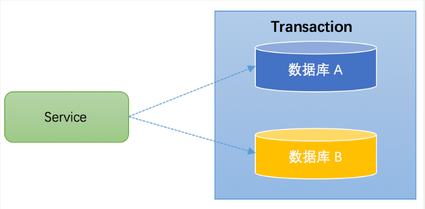

解决方案:(全局事务管理器TM)


##### 1.4.2 分库分表(不做重点讨论)

数据量大时,分库分表

解决方案:中间件+数据库同步技术

分库分表中间件:mycat  \shardingdb 

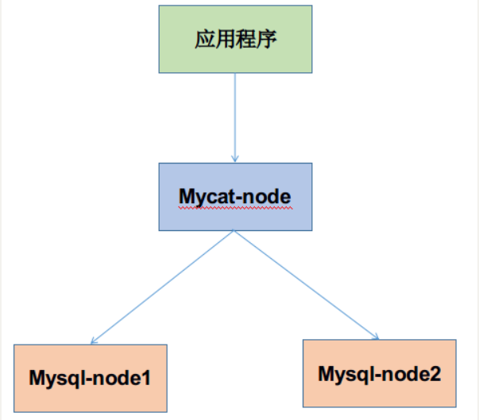


##### 1.4.3 多服务多数据源分布式事务

多数据库--多服务:

解决方案:全局TM(数据库) 和 服务协调者(服务),共同协调\数据库资源\服务


##### 1.4.4 解决方案的分类

刚性事务:ACID

柔性事务:(CAP\BASE)

比较:

| 事务类型 | 时间要求   | 一致性要求 | 应用类型        | 场景           |      |
| -------- | ---------- | ---------- | --------------- | -------------- | ---- |
| 刚性事务 | 立刻\马上  | 强一致性   | 局域网\企业应用 | 订单\日志      |      |
| 柔性事务 | 有时间弹性 | 最终一致性 | 互联网应用      | 付款\订单\收货 |      |

  

#### 1.5 CAP理论

目标:

* 1.CAP是什么

* 2.CAP理论的结论是什么

定义:数据一致性(consistency)、服务可用性(availability)、分区容错性(partition-tolerance)

结论:2\P ,  cap中,最多只有两个条件能成立.

p必须要保证. cp    \     ap

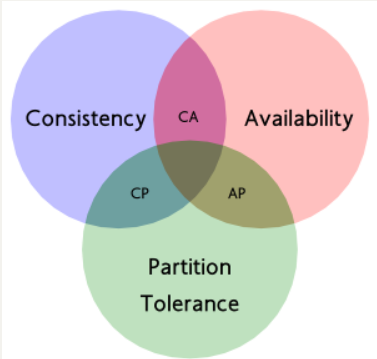


**C (一致性)：**


**A (可用性)：**非故障的节点在==合理的时间==内返回==合理的响应==

**P (分区容错性)：**集群可用。

**==网络无法 100% 可靠，分区其实是一个必然现象。p必须保证==**


**CA无法保证**:

**如果我们选择了 CA 而放弃了 P，那么当发生分区现象时，为了保证一致性，这个时候必须拒绝请求，但是 A 又不允许，所以分布式系统理论上不可能选择 CA 架构，只能选择 CP 或者 AP 架构。**

 CP应用 ， Zookeeper      。

 AP 来说，==放弃一致性(这里说的一致性是强一致性)==， B

ap例子:下单,购买了一件商品,不要求马上最库存进行扣减,但只要最终库存扣减即可.

 **总结:**

CAP:一致性\可用性\分区容错性(集群可用性)

cp:  zookeeper

ap: 最终一致性(BASE)

#### 1.6 BASE理论

###### 1.6.1目标:

* 1.什么是BASE理论

* 2.什么是柔性事务

核心思想:达到最终一致性（Eventual Consitency）即可。

- Basically Available（基本可用）
- Soft state（软状态）:比如订单状态:(待付款\已付款\发货\已签收\已结束)
- Eventually consistent（最终一致性）
- 


**


#### 1.7 柔性事务解决方案

概念:符和BASE理论的分布式解决方案,就叫做柔性事务

##### 1.典型的柔性事务方案如下:(重点)

* TCC（两阶段型、补偿型）  案例:(定婚-领证)

* 可靠消息最终一致性（异步确保型）消息队列来保证事务的一致性
  * 1.非事务型消息中间件(activimq\rabbitmq\kafka)
  * 2.事务性消息rocketmq(阿里的消息队列)
  * 3.案例:(在线下棋)

* 最大努力通知（非可靠消息、定期校对）
  * 案例:dd通知

小结:

​			1.base理论 cap理论的延伸 

​				一致性\可用\p分区容错

​				cp\ap

2. 柔性事务(刚性事务相对应)

   1. acid 刚性事务
   2. base/cap柔性事务

3. 柔性事务的几种解决方案

   1. tcc (订婚-领证)
   2. 消息保障性(在线下棋
   3. 最大努力通知(迪迪通知)


提问环节:

# 第2章 分布式事务解决方案

目标:

​			1.DTP -----XA-----二阶段提交协议(2pc  tcc)

​			2.XA ------JTA------==atomikos的关系==

​			3.二阶段2pc与TCC关系

#### 2. DTP -----XA-----二阶段提交协议(2pc  tcc)

##### 2.1==分布式事务处理模型(DTP)==标准的提供者.

谁提出来的?


##### 2.1.2 **DTP模型与XA规范**

##### 2.1.3  **DTP模型**

######  1.**模型元素(*5个)


* **应用程序(Application Program ，简称AP)：**

* **资源管理器(Resource Manager，简称RM)：**==如数据库、文件系统==等，并提供访问资源的方式。

* **事务管理器(Transaction Manager ，简称TM)：**负责分配事务唯一标识，监控事务的执行进度，并负责事务的提交、回滚等。

* **通信资源管理器(Communication Resource Manager，简称CRM)：**控制一个TM域(TM domain)内或者跨TM域的分布式应用之间的通信。

* **通信协议(Communication Protocol，简称CP)：**


###### 2.**模型实例(Instance of the Model)**

3部分：

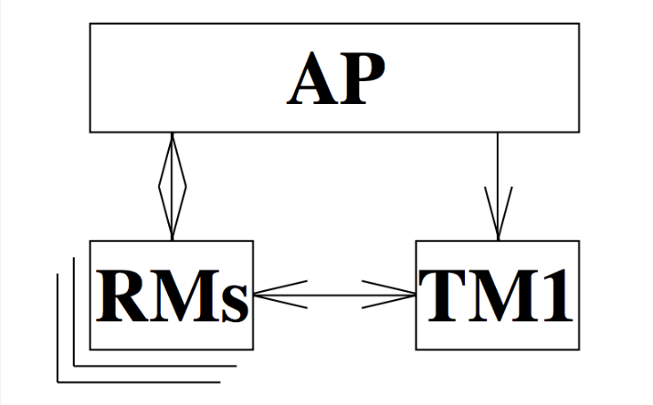


##### 2.1.4 **XA规范**


 定义:**==XA规范描述如下:XA规范的最主要的作用是，就是定义了RM-TM的交互接口==**，

下图更加清晰了演示了XA规范在DTP模型中发挥作用的位置

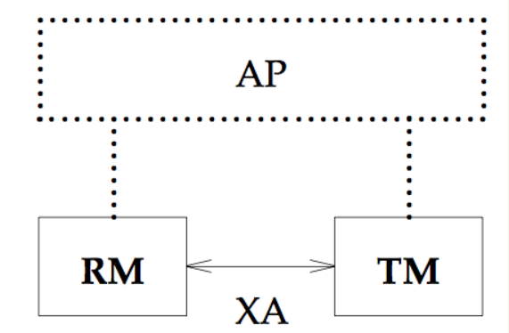

##### 2.1.5 XA规范与二阶段协议的关系:

协议与接口(XA)

 ==二阶段提交协议并非在XA规范中提出来的。但XA规范定义了两阶段提交协议中需要使用到的接口==.

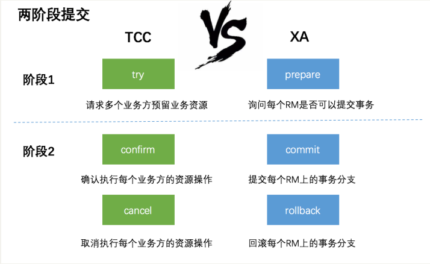

 总结:

DTP :分布式事务处理的模型

==XA: 数据库和tm之间的接口==


##### **2.1.6 二阶段协议:**

订婚和领证的关系

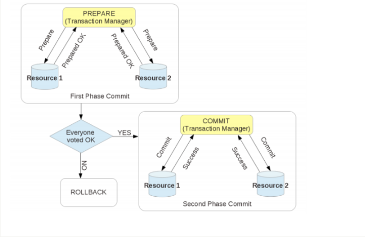

**第一阶段**。准备阶段

**第二阶段**:执行阶段 commit/rollback

 

**优点：** 尽量保证了数据的强一致，==适合对数据强一致要求很高的关键领域==。（其实也不能100%保证强一致）

**缺点：** 实现复杂，牺牲了可用性，对性能影响较大，不适合高并发高性能场景，如果分布式系统跨接口调用。

**XA的性能问题** 
==XA的性能很低==。。 
==只有在这些都无法实现，且性能不是瓶颈时才应该使用XA==。


总结:

1.XA :接口

 二阶段:一组协议,

2.二阶段:

​	优点:   实现起来相对来说比较简单

​     缺点: 性能不高.  

​      应用场景:对性能要求不太高,并且要求数据强一致性时,可选择二阶段协议的方案

#####  2.1.7 JTA规范事务模型

 概念:（JTA：Java  Transaction Api）xa的java实现版

**==某种程度上，可以认为JTA规范是XA规范的Java版==**，在JTA 中，==事务管理器抽象为javax.transaction.TransactionManager接口==，并通过底层事务服务（即JTS）实现。

==JTA仅仅定义了接口==

实现:

* 1.J2EE容器所提供的JTA实现==(JBoss)==
* 2.==独立的JTA实现:如JOTM，Atomikos==.用于Tomcat,Jetty以及普通的java应用。
* Atomikos    JTA的实现,用于tomcat等容器

#### 2.2 补偿事务（TCC）(自由恋爱.)


TCC 其实就是采用的补偿机制，其核心思想是：针对每个操作，都要注册一个与其对应的确认和==补偿（撤销）==操作。它分为三个阶段：

- Try 阶段主要是对业务系统做检测及资源预留
- ==Confirm 阶段主要是对业务系统做确认提交，Try阶段执行成功并开始执行 Confirm阶段时，默认 Confirm阶段是不会出错的。即：只要Try成功，Confirm一定成功==。
- ==Cancel== 阶段主要是在业务执行错误，需要回滚的状态下执行的业务取消，预留资源释放。


例如： A要向 B 转账，思路大概是： 

```properties
我们有一个本地方法，里面依次调用 
1、首先在=Try 阶段，要先调用远程接口把 B和 A的钱给冻结起来。= 
2、在 Confirm 阶段，执行远程调用的转账的操作，转账成功进行解冻。 
3、如果第2步执行成功，那么转账成功，如果第二步执行失败，则调用远程冻结接口对应的解冻方法 (Cancel)。 
```

**优点：** 跟2PC比起来，实现以及流程相对简单了一些，但数据的一致性比2PC也要差一些

**缺点：** 缺点还是比较明显的，==在2,3步中都有可能失败==。TCC属于应用层的一种补偿方式，所以==需要程序员在实现的时候多写很多补偿的代码==，在一些场景中，一些业务流程可能用TCC不太好定义及处理。==在代码无法完成事务时,可以通过手工干预==

总结:

1.TCC  (TRY-CONMIT 或者 TRY-CANCEL)

2. 优点:可以再try阶段,预留一部分资源,使剩余的资源得到释放(与二阶段做比较,二阶段在第一阶段锁定资源,所以二阶段的效率低)
3. 缺点:2 和3 步都可能失败,需要些更多的补偿代码


#### 2.3 本地消息表（异步确保）

本地消息表这种实现方式应该是业界使用最多的，其核心思想是将分布式事务拆分成本地事务进行处理，==这种思路是来源于ebay==。我们可以从下面的流程图中看出其中的一些细节： 

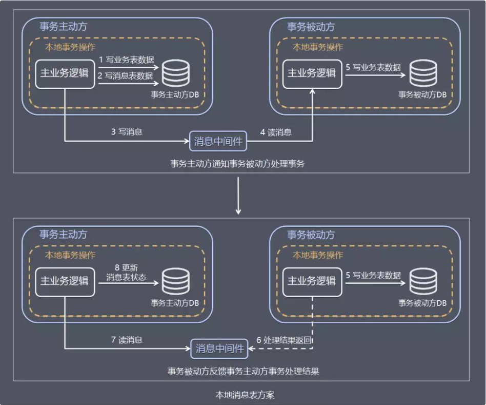

具体保存一致性的容错处理如下：

- **当步骤 1 处理出错，**事务回滚，相当于什么都没发生。
- **当步骤 2、步骤 3 处理出错，**由于未处理的事务消息还是保存在事务发送方，事务发送方可以定时轮询为超时消息数据，再次发送到消息中间件进行处理。事务被动方消费事务消息重试处理。
- **如果是业务上的失败，**事务被动方可以发消息给事务主动方进行回滚。
- **如果多个事务被动方已经消费消息，**事务主动方需要回滚事务时需要通知事务被动方回滚。

基本思路就是：

==消息生产方，需要额外建一个消息表，并记录消息发送状态。消息表和业务数据要在一个事务里提交，也就是说他们要在一个数据库里面==。然后消息会经过MQ发送到消息的消费方。如果消息发送失败，会进行重试发送。

消息消费方，需要处理这个消息，并完成自己的业务逻辑。此时如果本地事务处理成功，表明已经处理成功了，如果处理失败，那么就会重试执行。==如果是业务上面的失败，可以给生产方发送一个业务补偿消息，通知生产方进行回滚等操作==。

生产方和消费方定时扫描本地消息表，把还没处理完成的消息或者失败的消息再发送一遍。如果有靠谱的自动对账补账逻辑，这种方案还是非常实用的。

这种方案遵循BASE理论，采用的是最终一致性，笔者认为是这几种方案里面比较适合实际业务场景的，即不会出现像2PC那样复杂的实现(当调用链很长的时候，2PC的可用性是非常低的)，也不会像TCC那样可能出现确认或者回滚不了的情况。

**优点：** 一种非常经典的实现，避免了分布式事务，实现了最终一致性。

**缺点：** 消息表会耦合到业务系统中，如果没有封装好的解决方案，会有很多杂活需要处理。


#### 2.4 MQ 事务消息(rocketMQ)

有一些第三方的MQ是支持事务消息的，比如RocketMQ，他们支持事务消息的方式也是类似于采用的二阶段提交，但是市面上一些主流的MQ都是不支持事务消息的，比如 RabbitMQ 和 Kafka 都不支持。

以阿里的 RocketMQ 中间件为例，其思路大致为：

第一阶段Prepared消息，会拿到消息的地址。
第二阶段执行本地事务，第三阶段通过第一阶段拿到的地址去访问消息，并修改状态。

也就是说在业务方法内要想消息队列提交两次请求，一次发送消息和一次确认消息。如果确认消息发送失败了RocketMQ会定期扫描消息集群中的事务消息，这时候发现了Prepared消息，它会向消息发送者确认，所以生产方需要实现一个check接口，RocketMQ会根据发送端设置的策略来决定是回滚还是继续发送确认消息。这样就保证了消息发送与本地事务同时成功或同时失败。


**异常情况：事务主动方消息恢复**


**容错处理**

如果事务被动方消费消息异常，需要不断重试，业务处理逻辑需要保证幂等。 

如果是事务被动方业务上的处理失败，可以通过 MQ 通知事务主动方进行补偿或者事务回滚。

**优点：** 实现了最终一致性，不需要依赖本地数据库事务。

**缺点：** 目前主流MQ中只有RocketMQ支持事务消息。

共同点:

特点:都需要自己写业务补偿代码(cancle代码)

(优点)用消息队列的方式实现分布式事务,效率较高

缺点:实现难度较大,和业务耦合比较紧密

# 第3章 分布式事务实战

xa--jta---具体实现的一种Atomikos.

适合:单服务,多数据源


核心步骤:

1.导入atomikos的jar(pom)

```xml
<!--JTA atomikos-->
        <dependency>
            <groupId>javax.transaction</groupId>
            <artifactId>jta</artifactId>
            <version>${jta.version}</version>
        </dependency>
        <dependency>
            <groupId>com.atomikos</groupId>
            <artifactId>atomikos-util</artifactId>
            <version>${atomikos.version}</version>
        </dependency>
        <dependency>
            <groupId>com.atomikos</groupId>
            <artifactId>transactions</artifactId>
            <version>${atomikos.version}</version>
        </dependency>
        <dependency>
            <groupId>com.atomikos</groupId>
            <artifactId>transactions-jta</artifactId>
            <version>${atomikos.version}</version>
        </dependency>
        <dependency>
            <groupId>com.atomikos</groupId>
            <artifactId>transactions-jdbc</artifactId>
            <version>${atomikos.version}</version>
        </dependency>
        <dependency>
            <groupId>com.atomikos</groupId>
            <artifactId>transactions-api</artifactId>
            <version>${atomikos.version}</version>
        </dependency>
        <dependency>
            <groupId>cglib</groupId>
            <artifactId>cglib-nodep</artifactId>
            <version>${cglib.nodep.version}</version>
        </dependency>

```


2配置多个数据源:(有区别)

```xml
 <!-- 数据库基本信息配置 -->
    <bean id="dataSourceOne" parent="abstractXADataSource">
        <property name="uniqueResourceName">
            <value>dataSourceOne</value>
        </property>
        <!--数据库驱动-->
        <property name="xaDataSourceClassName" value="com.mysql.jdbc.jdbc2.optional.MysqlXADataSource"/>
        <property name="xaProperties">
            <props>
                <prop key="URL">${jdbc.url}</prop>
                <prop key="user">${jdbc.username}</prop>
                <prop key="password">${jdbc.pwd}</prop>
            </props>
        </property>
    </bean>

    <!--日志数据源-->
    <bean id="dataSourceLog" parent="abstractXADataSource">
        <property name="uniqueResourceName">
            <value>dataSourceLog</value>
        </property>
        <property name="xaDataSourceClassName" value="com.mysql.jdbc.jdbc2.optional.MysqlXADataSource"/>
        <property name="xaProperties">
            <props>
                <prop key="URL">${jdbc.log.url}</prop>
                <prop key="user">${jdbc.log.username}</prop>
                <prop key="password">${jdbc.log.pwd}</prop>
            </props>
        </property>
    </bean>


    <!--SqlSessionFactoryBean的配置-->
    <bean id="sqlSessionFactoryBeanOne" class="org.mybatis.spring.SqlSessionFactoryBean">
        <property name="typeAliasesPackage" value="com.itheimabk01.domain" />
        <property name="mapperLocations">
            <array>
                <value>classpath:com/itheimabk01/mapper/*Mapper.xml</value>
            </array>
        </property>
        <property name="dataSource" ref="dataSourceOne"/>
    </bean>

    <bean id="sqlSessionFactoryBeanLog" class="org.mybatis.spring.SqlSessionFactoryBean">
        <property name="typeAliasesPackage" value="com.itheimabk01.domain" />
        <property name="mapperLocations">
            <array>
                <value>classpath:com/itheimabk01/logmapper/*Mapper.xml</value>
            </array>
        </property>
        <property name="dataSource" ref="dataSourceLog"/>
    </bean>


    <!--包扫描-->
    <bean id="mapperScannerConfigurerOne" class="org.mybatis.spring.mapper.MapperScannerConfigurer">
        <property name="basePackage" value="com.itheimabk01.mapper" />
        <property name="sqlSessionFactoryBeanName" value="sqlSessionFactoryBeanOne" />
    </bean>
    <bean id="mapperScannerConfigurerLog" class="org.mybatis.spring.mapper.MapperScannerConfigurer">
        <property name="basePackage" value="com.itheimabk01.logmapper" />
        <property name="sqlSessionFactoryBeanName" value="sqlSessionFactoryBeanLog" />
    </bean>
```


2.配置公共事务管理器


```xml
<!-- 配置atomikos事务管理器 -->
    <bean id="atomikosTransactionManager" class="com.atomikos.icatch.jta.UserTransactionManager" init-method="init" destroy-method="close">
        <property name="forceShutdown" value="false"/>
    </bean>
    <!--配置本地事务管理器-->
    <bean id="atomikosUserTransaction" class="com.atomikos.icatch.jta.UserTransactionImp">
        <property name="transactionTimeout" value="300000"/>
    </bean>

    <!--JTA事务管理器-->
    <bean id="springTransactionManager" class="org.springframework.transaction.jta.JtaTransactionManager">
        <property name="transactionManager">
            <ref bean="atomikosTransactionManager"/>
        </property>
        <property name="userTransaction">
            <ref bean="atomikosUserTransaction"/>
        </property>
        <property name="allowCustomIsolationLevels" value="true"/>
    </bean>
```


4.配置事务通知

```xml

    <!--@Aspect-->
    <aop:aspectj-autoproxy/>

    <!--使用CGLIB动态代理-->
    <tx:annotation-driven transaction-manager="springTransactionManager" proxy-target-class="true" />

    <!--配置事务的通知-->
    <!-- the transactional advice (what 'happens'; see the <aop:advisor/> bean
        below) 事务传播特性配置 -->
    <tx:advice id="txAdvice" transaction-manager="springTransactionManager">
        <!-- the transactional semantics... -->
        <tx:attributes>
            <tx:method name="add*" propagation="REQUIRED" isolation="DEFAULT"
                       rollback-for="java.lang.Exception" />
            <tx:method name="save*" propagation="REQUIRED" isolation="DEFAULT"
                       rollback-for="java.lang.Exception" />
            <tx:method name="insert*" propagation="REQUIRED" isolation="DEFAULT"
                       rollback-for="java.lang.Exception" />
            <tx:method name="update*" propagation="REQUIRED" isolation="DEFAULT"
                       rollback-for="java.lang.Exception" />
            <tx:method name="modify*" propagation="REQUIRED" isolation="DEFAULT"
                       rollback-for="java.lang.Exception" />
            <tx:method name="delete*" propagation="REQUIRED" isolation="DEFAULT"
                       rollback-for="java.lang.Exception" />
            <!-- 查询方法 -->
            <tx:method name="query*" read-only="true" />
            <tx:method name="select*" read-only="true" />
            <tx:method name="find*" read-only="true" />
        </tx:attributes>
    </tx:advice>
```

3.配置切面和切入点


5.织入业务(关联切入点和事务通知给服务service的impl层)

```xml
<!-- 声明式事务AOP配置 -->
    <aop:config>
        <!--配合aop的切入点-->
        <aop:pointcut expression="execution(* com.itheimabk01.service.impl.*.*(..))" id="tranpointcut" />

        <!--生命式事务通知,配置事务通知和切入点关系-->
        <aop:advisor advice-ref="txAdvice" pointcut-ref="tranpointcut" />
    </aop:config>
```


业务场景:

服务a:下订单,在另一个数据库中写日志.

```java
package com.itheimabk02.service.impl;
import com.itheimabk02.domain.LogInfo;
import com.itheimabk02.domain.OrderInfo;
import com.itheimabk02.logmapper.LogInfoMapper;
import com.itheimabk02.mapper.OrderInfoMapper;
import com.itheimabk02.service.OrderInfoService;
import org.springframework.beans.factory.annotation.Autowired;
import org.springframework.stereotype.Service;

import java.util.Date;

/**
 * @version 1.0
 * @Author 周洪丙
 **/
@Service
public class OrderInfoServiceImpl implements OrderInfoService {
    @Autowired
    private OrderInfoMapper orderInfoMapper;

    @Autowired
    private  LogInfoMapper logInfoMapper;

    public int add(OrderInfo orderInfo) {


        //测试用例1:此处发生异常(不用测)

        //保存orderInfo到 order库中order_info表
        int i1 = orderInfoMapper.add(orderInfo);
        System.out.println("orderInfo表受影响行数"+i1);

        //测试用例2:此处发生异常,orderInfo已经保存到 order库中order_info表中,但是前面的保存要做要做回滚
//        System.out.println("发生异常:测试用例1...............................");
//        int i=10/0;
        //保存logInfo到log库中log_info表
        LogInfo logInfo = new LogInfo();
        logInfo.setId((int) (Math.random()*1000));
        logInfo.setCreateTime(new Date());
        logInfo.setContent(orderInfo.toString());
        int i2 = logInfoMapper.add(logInfo);

        System.out.println("loginfo表受影响行数"+i2);
        //测试用例3:此处发生异常,orderInfo已经保存到 order库中order_info表中,保存logInfo到log库中log_info表,但是前面的保存的orderinfo和loginfo要做要做回滚
        System.out.println("发生异常:测试用例2...............................");
        int i=10/0;
        return 0;
    }
}

```


测试结果 

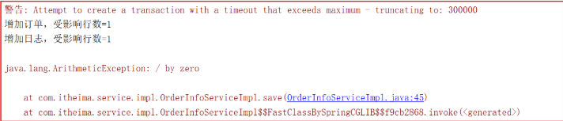 

数据库数据 

order_info表的数据为空 

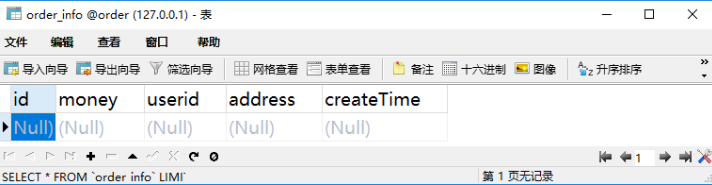 

log_info表的数据为空 

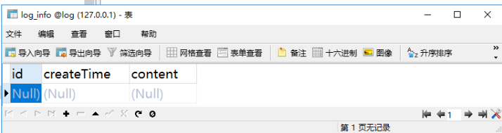

从上面结果我们可以看得到，分布式事务成功了！  


