# 分布式事务  第一天

[TOC]


## 学习目标

###### 目标1  理解本地事务和分布式事务的概念和区别(理解) 

###### 目标2  分布式事务的理论基础(了解)

###### 目标3 各分布式事务方案的优缺点及适用场景(知道)

###### 目标4 如何根据自己的业务场景选择合适的分布式事务方案(掌握)

###### 目标5  Atomikos+jta实现分布式事务(掌握)


# 第1章 本地事务和分布式事务的概念和区别

#### 1.1 什么是事务

事务(Transaction)是访问并可能更新数据库中各种数据项的一个程序执行单元(unit)。在关系数据库中，一个事务由一组SQL语句组成。

#### 1.2 事务的四个特性ACID：

事务应该具有4个属性：原子性、一致性、隔离性、持久性。这四个属性通常称为ACID特性。

**原子性(Atomicity)**：事务作为一个整体被执行，包含在其中的对数据库的操作要么全部被执行，要么都不执行。

**一致性(Consistency)**：事务应确保数据库的状态从一个一致状态转变为另一个一致状态。一致状态是指数据库中的数据应满足完整性约束。除此之外，一致性还有另外一层语义，就是事务的中间状态不能被观察到(这层语义也有说应该属于原子性)。

**隔离性(Isolation)**：多个事务并发执行时，一个事务的执行不应影响其他事务的执行，如同只有这一个操作在被数据库所执行一样。

**持久性(Durability)**：已被提交的事务对数据库的修改应该永久保存在数据库中。在事务结束时，此操作将不可逆转。

#### 1.3  事务的隔离级别

**更新丢失**：两事务同时更新，一个失败回滚覆盖另一个事务的更新。

**脏读**：事务T1读取到事务T2修改了但是还未提交的数据，之后事务T2又回滚其更新操作，导致事务T1读到的是脏数据。

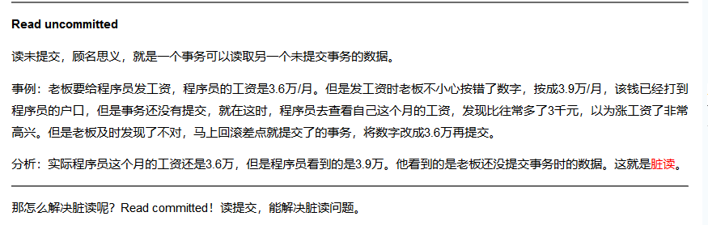

**不可重复读**：事务T1读取某个数据后，事务T2对其做了修改，当事务T1再次读该数据时得到与前一次不同的值。

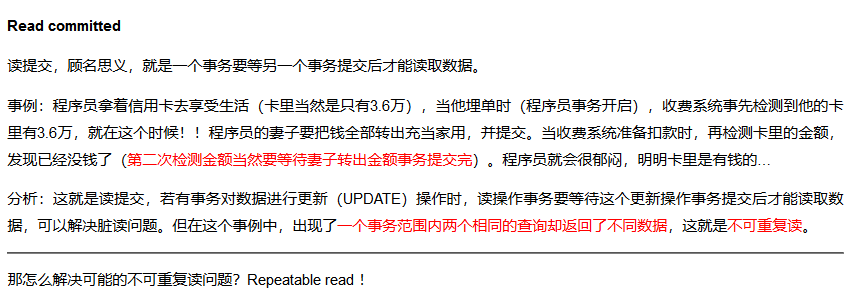

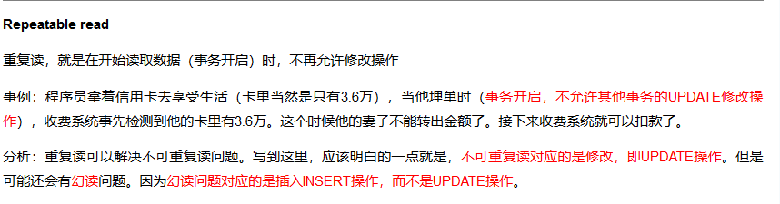

虚读（幻读）**：事务T1在读取某个范围内的数据时，事务T2又插入一条数据，当事务T1再次读取这个范围数据时发现不一样了，出现了一些“幻影行”。

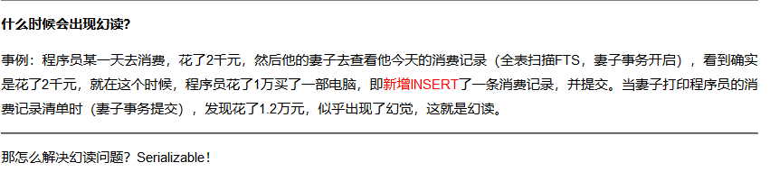

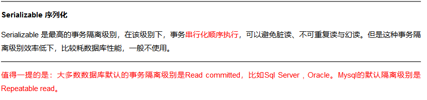

不可重复读和脏读的区别：脏读是某一事务读取了另一个事务未提交的脏数据，而

不可重复读则是读取了前一事务提交的数据。

幻读和不可重复读的异同：都是读取了另一条已经提交的事务，所不同的是不可重复读查询的都是同一个数据项，而幻读针对的是一批数据整体（比如数据的个数）。


#### 1.2 本地事务

当我们对单一数据库资源进行访问控制时,这类基于单个服务单一数据库资源访问的事务，被称为本地事务(Local Transaction)。 

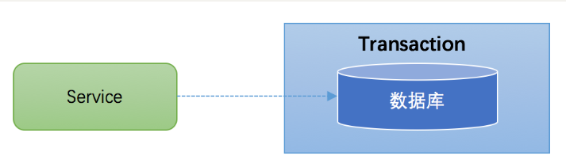


#### 1.3 什么是分布式事务

分布式事务指==事务的参与者==、支持事务的==服务器==、资源服务器==(数据库)==以及==事务管理器==分别位于不同的==分布式系统的不同节点之上==,且属于不同的应用，分布式事务需要保证这些操作要么全部成功，要么全部失败。==本质上来说，分布式事务就是为了保证不同数据库的数据一致性。==

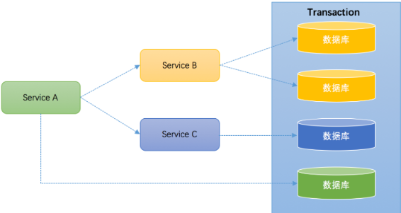


#### 1.4 分布式事务应用架构

==本地事务==主要限制在==单个会话==内，不涉及多个数据库资源。但是在基于==分布式==应用环境下，越来越多的应用要求对==多个数据库==资源，==多个服务==的访问都能纳入到同一个事务当中，==管理多个会话==分布式事务应运而生。 


##### 1.4.1 单一服务分布式事务

最早的分布式事务应用架构很简单，不涉及服务间的访问调用，仅仅是服务内操作涉及到对多个数据库资源的访问。 

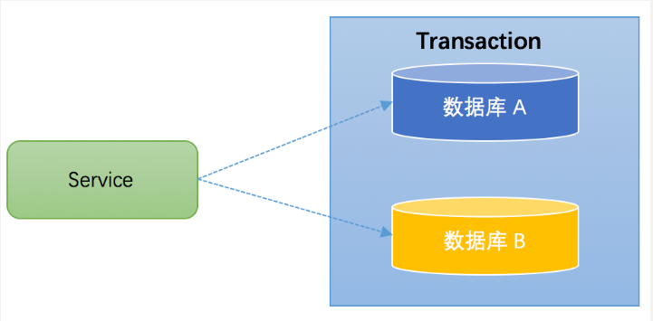

##### 1.4.2 分库分表

当数据库的数据量越来越大时,数据库效率将会显著降低,涉及到分库分表,引入数据库中间件后,为了保证插入不同数据库数据的一致性,也必须要面对分布式事务的业务场景：

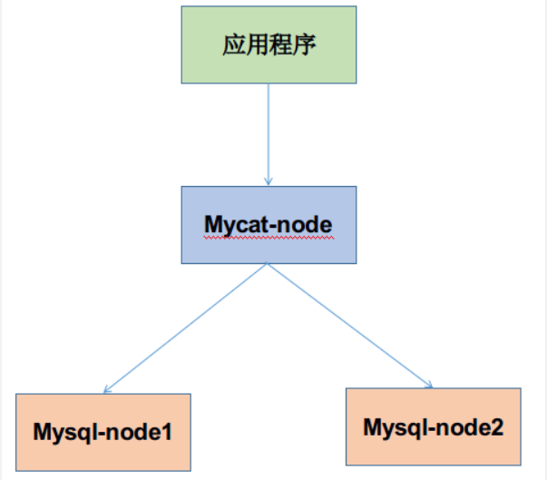


##### 1.4.3 多服务多数据源分布式事务

如果将上面这两种场景(一个服务可以调用多个数据库资源，也可以调用其他服务)结合在一起，对此进行延伸，整个分布式事务的参与者将会组成如下图所示的树形拓扑结构。在一个跨服务的分布式事务中，事务的发起者和提交均系同一个，它可以是整个调用的客户端，也可以是客户端最先调用的那个服务。 

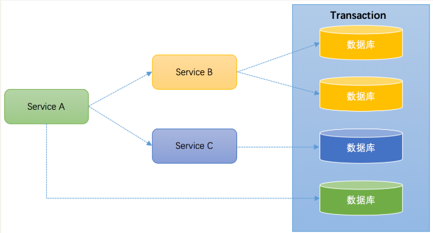

较之基于单一数据库资源访问的本地事务，分布式事务的应用架构更为复杂。在不同的分布式应用架构下，实现一个分布式事务要考虑的问题并不完全一样，比如对多资源的协调、事务的跨服务传播等，实现机制也是复杂多变。 


#### 1.5 CAP理论

CAP 理论，又被叫作布鲁尔理论。由[Eric Brewer](https://en.wikipedia.org/wiki/Eric_Brewer_(scientist))在2000年PODC会议上提出的关于数据一致性(consistency)、服务可用性(availability)、分区容错性(partition-tolerance)的猜想：

Brewer认为在设计一个大规模的分布式系统时会遇到三个特性：一致性（consistency）、可用性（Availability）、分区容错（partition-tolerance），而一个分布式系统最多只能满足其中的2项。

2年后，麻省理工学院的Seth Gilbert和Nancy Lynch从理论上证明了CAP。之后，CAP理论正式成为分布式计算领域的公认定理。 

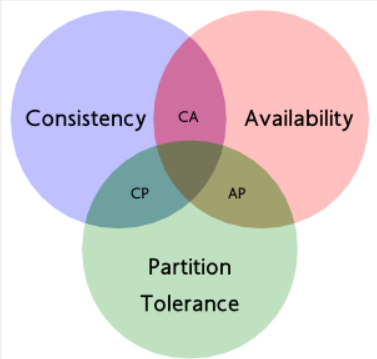


**C (一致性)：**对某个指定的客户端来说，读操作能返回最新的写操作。

对于数据分布在不同节点上的数据来说，如果在某个节点更新了数据，那么在其他节点如果都能读取到这个最新的数据，那么就称为强一致，如果有某个节点没有读取到，那就是分布式不一致。

**A (可用性)：**非故障的节点在合理的时间内返回合理的响应(不是错误和超时的响应)。可用性的两个关键一个是合理的时间，一个是合理的响应。

合理的时间指的是请求不能无限被阻塞，应该在合理的时间给出返回。合理的响应指的是系统应该明确返回结果并且结果是正确的，这里的正确指的是比如应该返回 50，而不是返回 40。

**P (分区容错性)：**当出现网络分区后，系统能够继续工作。打个比方，这里集群有多台机器，有台机器网络出现了问题，但是这个集群仍然可以正常工作。

熟悉 CAP 的人都知道，三者不能共有，如果感兴趣可以搜索 CAP 的证明，在分布式系统中，**==网络无法 100% 可靠，分区其实是一个必然现象。==**

**如果我们选择了 CA 而放弃了 P，那么当发生分区现象时，为了保证一致性，这个时候必须拒绝请求，但是 A 又不允许，所以分布式系统理论上不可能选择 CA 架构，只能选择 CP 或者 AP 架构。**

对于 CP 来说，放弃可用性，追求一致性和分区容错性，我们的 ZooKeeper 其实就是追求的强一致。

对于 AP 来说，放弃一致性(这里说的一致性是强一致性)，追求分区容错性和可用性，这是很多分布式系统设计时的选择，后面的 BASE 也是根据 AP 来扩展。

顺便一提，CAP 理论中是忽略网络延迟，也就是当事务提交时，从节点 A 复制到节点 B 没有延迟，但是在现实中这个是明显不可能的，所以总会有一定的时间是不一致。

同时 CAP 中选择两个，比如你选择了 CP，并不是叫你放弃 A。因为 P 出现的概率实在是太小了，大部分的时间你仍然需要保证 CA。

就算分区出现了你也要为后来的 A 做准备，比如通过一些日志的手段，是其他机器回复至可用。

 

#### 1.6 BASE理论

 BASE理论是对CAP理论的延伸，核心思想是即使无法做到强一致性（Strong Consistency，CAP的一致性就是强一致性），但应用可以采用适合的方式达到最终一致性（Eventual Consitency）。

BASE是Basically Available（基本可用）、Soft state（软状态）和Eventually consistent（最终一致性）三个短语的缩写。

- Basically Available（基本可用）
- Soft state（软状态）
- Eventually consistent（最终一致性）

和ACID的强一致性模型不同，BASE理论而是通过牺牲强一致性来获得可用性，并允许数据在一段时间内是不一致的，但最终达到一致状态。

BASE理论是对CAP中的一致性和可用性进行一个权衡的结果，理论的核心思想就是：**我们无法做到强一致，但每个应用都可以根据自身的业务特点，采用适当的方式来使系统达到最终一致性**（Eventual consistency）。

符合BASE理论的事务解决方案,被称**柔性事务解决方案**

#### 1.7 柔性事务解决方案

##### 1.柔性事务和刚性事务

* 刚性事务满足ACID理论 

* 柔性事务满足BASE理论（基本可用，最终一致）

刚性事务已无法满足互联网环境下的业务应用,柔性事务则正好使用于互联网和分布式环境的应用.

##### 2.典型的柔性事务方案如下:

​	 最大努力通知（非可靠消息、定期校对）

​     可靠消息最终一致性（异步确保型）

​     TCC（两阶段型、补偿型）

# 第2章 分布式事务解决方案

#### 2.1分布式事务中的模型与规范

##### 2.1.1 X/Open，分布式事务处理(DTP)标准的提供者.

X/Open是open group的前身，是一个独立的组织，主要负责制定各种行业技术标准,由世界著名的产业巨头组成的联盟,成员包括IBM,oracle,飞利浦,华为等工业巨头公司.


##### 2.1.2 **DTP模型与XA规范**

DTP:分布式事务处理(Distributed Transaction Processing)的简称.由X/Open提供的标准.包括

DTP 参考模型： [**<<Distributed Transaction Processing: Reference Model>>**](http://pubs.opengroup.org/onlinepubs/9294999599/toc.pdf)

   DTP XA规范：[ **<< Distributed Transaction Processing: The XA Specification>>**](http://pubs.opengroup.org/onlinepubs/009680699/toc.pdf)

##### 2.1.3  **DTP模型**

######  1.**模型元素**

在<<Distributed Transaction Processing: Reference Model>>第3版中，规定了构成DTP模型的5个基本元素：

* **应用程序(Application Program ，简称AP)：**用于定义事务边界(即定义事务的开始和结束)，并且在事务边界内对资源进行操作。

* **资源管理器(Resource Manager，简称RM)：**==如数据库、文件系统==等，并提供访问资源的方式。

* **事务管理器(Transaction Manager ，简称TM)：**负责分配事务唯一标识，监控事务的执行进度，并负责事务的提交、回滚等。

* **通信资源管理器(Communication Resource Manager，简称CRM)：**控制一个TM域(TM domain)内或者跨TM域的分布式应用之间的通信。

* **通信协议(Communication Protocol，简称CP)：**提供CRM提供的分布式应用节点之间的底层通信服务。

​    其中由于通信资源管理器(Communication Resource Manager)和通信协议(Communication Protocol)是一对好基友，从Communication Protocol的简称CP上就可以看出来，两个元素的关系不一般，因此有的文章在介绍DTP模型元素时，只提到了通信资源管理器....

###### 2.**模型实例(Instance of the Model)**

一个DTP模型实例，至少有3个组成部分：AP、RMs、TM。如下所示：

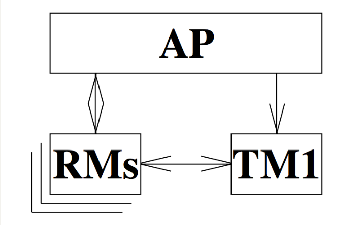

这张图类似于我们之前提到的跨库事务的概念，即单个应用需要操作多个库。==在这里就是一个AP需要操作多个RM上的资源。AP通过TM来声明一个全局事务，然后操作不同的RM上的资源，最后通知TM来提交或者回滚全局事务。==


##### 2.1.4 **XA规范**

在DTP本地模型实例中，由AP、RMs和TM组成，不需要其他元素。AP、RM和TM之间，彼此都需要进行交互：

图中(1)表示AP-RM的交互接口，(2)表示AP-TM的交互接口，(3)表示RM-TM的交互接口。


 **==XA规范描述如下:XA规范的最主要的作用是，就是定义了RM-TM的交互接口==**，下图更加清晰了演示了XA规范在DTP模型中发挥作用的位置

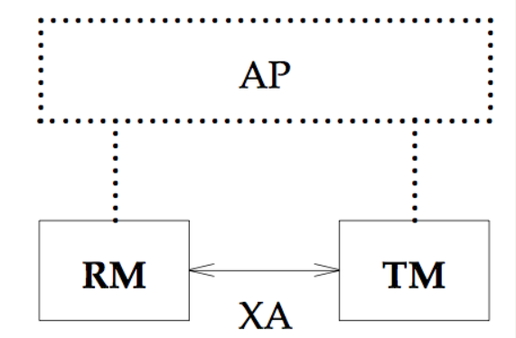

##### 2.1.5 XA规范与二阶段协议的关系:

1.XA规范除了定义的RM-TM交互的接口(XA Interface)之外，还对两阶段提交协议进行了优化.

 ==二阶段提交协议并非在XA规范中提出来的。但XA规范定义了两阶段提交协议中需要使用到的接口==.

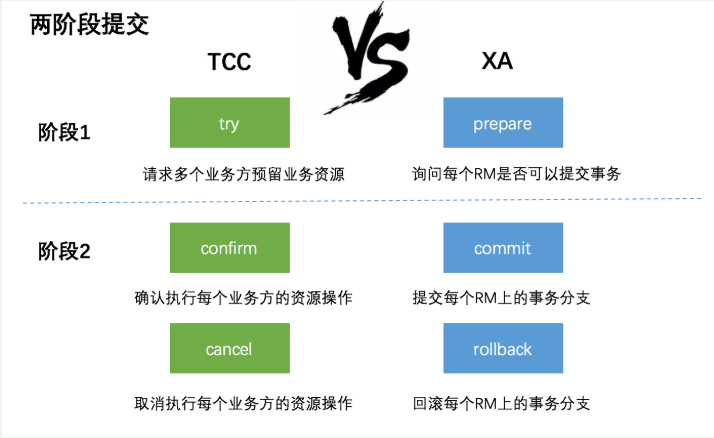

 

##### **2.1.6 二阶段协议:**

两阶段协议(two-phase commit)是在OSI TP标准中提出的；但在DTP参考模型(<<Distributed Transaction Processing: Reference Model>>)中，指定了全局事务的提交要使用two-phase commit协议；


**第一阶段**TM要求所有的RM准备提交对应的事务分支，询问RM是否有能力保证成功的提交事务分支，RM根据自己的情况，如果判断自己进行的工作可以被提交，那就就对工作内容进行持久化，并给TM回执OK；否者给TM的回执NO。RM在发送了否定答复并回滚了已经的工作后，就可以丢弃这个事务分支信息了。

**第二阶段**TM根据阶段1各个RM prepare的结果，决定是提交还是回滚事务。如果所有的RM都prepare成功，那么TM通知所有的RM进行提交；如果有RM prepare回执NO的话，则TM通知所有RM回滚自己的事务分支。

也就是TM与RM之间是通过两阶段提交协议进行交互的.

 

**优点：** 尽量保证了数据的强一致，==适合对数据强一致要求很高的关键领域==。（其实也不能100%保证强一致）

**缺点：** 实现复杂，牺牲了可用性，对性能影响较大，不适合高并发高性能场景，如果分布式系统跨接口调用。

**XA的性能问题** 
==XA的性能很低==。一个数据库的事务和多个数据库间的XA事务性能对比可发现，性能差10倍左右。因此要尽量避免XA事务，例如可以将数据写入本地，用高性能的消息系统分发数据。或使用数据库复制等技术。 
==只有在这些都无法实现，且性能不是瓶颈时才应该使用XA==。


#####  2.1.7 JTA规范事务模型

 Java事务API（JTA：Java Transaction API）和它的同胞Java事务服务（JTS：Java Transaction Service），为J2EE平台提供了分布式事务服务（distributed transaction）的能力。 

**==某种程度上，可以认为JTA规范是XA规范的Java版==**，其把XA规范中规定的DTP模型交互接口抽象成Java接口中的方法，并规定每个方法要实现什么样的功能。

作为java平台上事务规范JTA（Java Transaction API）也定义了对XA事务的支持，实际上，JTA是基于XA架构上建模的，在JTA 中，事务管理器抽象为javax.transaction.TransactionManager接口，并通过底层事务服务（即JTS）实现。

像很多其他的java规范一样，==JTA仅仅定义了接口==，具体的实现则是由供应商(如J2EE厂商)负责提供，目前JTA的实现主要由以下几种：


* 1.J2EE容器所提供的JTA实现(JBoss)
* 2.==独立的JTA实现:如JOTM，Atomikos==.这些实现可以应用在那些不使用J2EE应用服务器的环境里用以提供分布事事务保证。如Tomcat,Jetty以及普通的java应用。

#### 2.2 补偿事务（TCC）

TCC 其实就是采用的补偿机制，其核心思想是：针对每个操作，都要注册一个与其对应的确认和补偿（撤销）操作。它分为三个阶段：

- Try 阶段主要是对业务系统做检测及资源预留
- ==Confirm 阶段主要是对业务系统做确认提交，Try阶段执行成功并开始执行 Confirm阶段时，默认 Confirm阶段是不会出错的。即：只要Try成功，Confirm一定成功==。
- Cancel 阶段主要是在业务执行错误，需要回滚的状态下执行的业务取消，预留资源释放。


例如： A要向 B 转账，思路大概是： 

```properties
我们有一个本地方法，里面依次调用 
1、首先在=Try 阶段，要先调用远程接口把 B和 A的钱给冻结起来。= 
2、在 Confirm 阶段，执行远程调用的转账的操作，转账成功进行解冻。 
3、如果第2步执行成功，那么转账成功，如果第二步执行失败，则调用远程冻结接口对应的解冻方法 (Cancel)。 
```

**优点：** 跟2PC比起来，实现以及流程相对简单了一些，但数据的一致性比2PC也要差一些

**缺点：** 缺点还是比较明显的，==在2,3步中都有可能失败==。TCC属于应用层的一种补偿方式，所以==需要程序员在实现的时候多写很多补偿的代码==，在一些场景中，一些业务流程可能用TCC不太好定义及处理。==在代码无法完成事务时,可以通过手工干预==


#### 2.3 本地消息表（异步确保）

本地消息表这种实现方式应该是业界使用最多的，其核心思想是将分布式事务拆分成本地事务进行处理，==这种思路是来源于ebay==。我们可以从下面的流程图中看出其中的一些细节： 

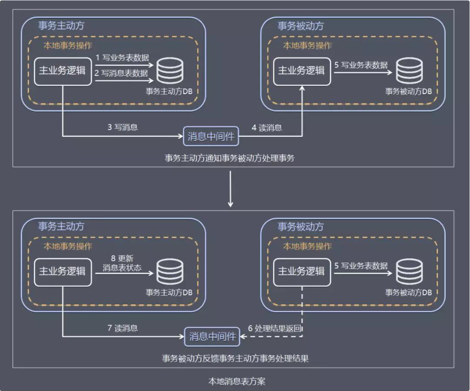

具体保存一致性的容错处理如下：

- **当步骤 1 处理出错，**事务回滚，相当于什么都没发生。
- **当步骤 2、步骤 3 处理出错，**由于未处理的事务消息还是保存在事务发送方，事务发送方可以定时轮询为超时消息数据，再次发送到消息中间件进行处理。事务被动方消费事务消息重试处理。
- **如果是业务上的失败，**事务被动方可以发消息给事务主动方进行回滚。
- **如果多个事务被动方已经消费消息，**事务主动方需要回滚事务时需要通知事务被动方回滚。


基本思路就是：

==消息生产方，需要额外建一个消息表，并记录消息发送状态。消息表和业务数据要在一个事务里提交，也就是说他们要在一个数据库里面==。然后消息会经过MQ发送到消息的消费方。如果消息发送失败，会进行重试发送。

消息消费方，需要处理这个消息，并完成自己的业务逻辑。此时如果本地事务处理成功，表明已经处理成功了，如果处理失败，那么就会重试执行。==如果是业务上面的失败，可以给生产方发送一个业务补偿消息，通知生产方进行回滚等操作==。

生产方和消费方定时扫描本地消息表，把还没处理完成的消息或者失败的消息再发送一遍。如果有靠谱的自动对账补账逻辑，这种方案还是非常实用的。

这种方案遵循BASE理论，采用的是最终一致性，笔者认为是这几种方案里面比较适合实际业务场景的，即不会出现像2PC那样复杂的实现(当调用链很长的时候，2PC的可用性是非常低的)，也不会像TCC那样可能出现确认或者回滚不了的情况。

**优点：** 一种非常经典的实现，避免了分布式事务，实现了最终一致性。

**缺点：** 消息表会耦合到业务系统中，如果没有封装好的解决方案，会有很多杂活需要处理。


#### 2.4 MQ 事务消息

有一些第三方的MQ是支持事务消息的，比如RocketMQ，他们支持事务消息的方式也是类似于采用的二阶段提交，但是市面上一些主流的MQ都是不支持事务消息的，比如 RabbitMQ 和 Kafka 都不支持。

以阿里的 RocketMQ 中间件为例，其思路大致为：

第一阶段Prepared消息，会拿到消息的地址。
第二阶段执行本地事务，第三阶段通过第一阶段拿到的地址去访问消息，并修改状态。

也就是说在业务方法内要想消息队列提交两次请求，一次发送消息和一次确认消息。如果确认消息发送失败了RocketMQ会定期扫描消息集群中的事务消息，这时候发现了Prepared消息，它会向消息发送者确认，所以生产方需要实现一个check接口，RocketMQ会根据发送端设置的策略来决定是回滚还是继续发送确认消息。这样就保证了消息发送与本地事务同时成功或同时失败。

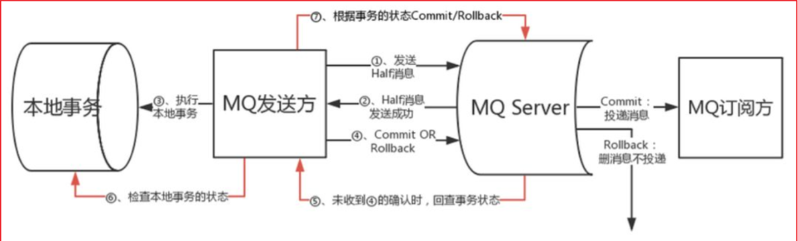

**优点：** 实现了最终一致性，不需要依赖本地数据库事务。

**缺点：** 目前主流MQ中只有RocketMQ支持事务消息。


# 第3章 分布式事务实战

我们这里将演示Atomikos和阿里的fescar以及RocketMQ和TX-LCN的分布式事务实现方式，我们先做一些准备工作。

我们这里准备2个数据库，分别是订单数据库和日志数据库，订单数据库用于接收用户订单，日志数据库用于记录用户的订单创建操作。 

order数据库 

```sql
CREATE TABLE `order_info` (
  `id` int(11) NOT NULL,
  `money` double NOT NULL,
  `userid` varchar(20) DEFAULT NULL,
  `address` varchar(200) DEFAULT NULL,
  `createTime` datetime DEFAULT NULL,
  PRIMARY KEY (`id`)
) ENGINE=InnoDB DEFAULT CHARSET=utf8;
```

log数据库 

```sql
CREATE TABLE `log_info` (
  `id` int(11) NOT NULL,
  `createTime` datetime DEFAULT NULL,
  `content` longtext,
  PRIMARY KEY (`id`)
) ENGINE=InnoDB DEFAULT CHARSET=utf8;
```


#### 3.1 Atomikos分布式事务

##### 3.1.1 Atomikos 介绍

Atomikos TransactionsEssentials 是一个为Java平台提供增值服务的并且开源类事务管理器，以下是包括在这个开源版本中的一些功能：

l 全面崩溃 / 重启恢复

l 兼容标准的sun公司jta api

l 嵌套事务

l 为xa和非xa提供内置的jdbc适配器


##### 3.1.2 创建工程

创建工程atomikos-transaction

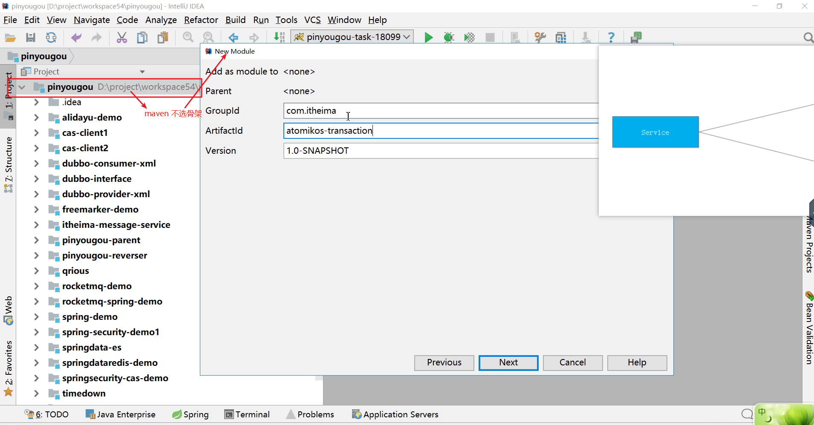

###### 3.1.2.1 pom.xml

引入pom.xml依赖，如下：

```xml
<?xml version="1.0" encoding="UTF-8"?>
<project xmlns="http://maven.apache.org/POM/4.0.0"
         xmlns:xsi="http://www.w3.org/2001/XMLSchema-instance"
         xsi:schemaLocation="http://maven.apache.org/POM/4.0.0 http://maven.apache.org/xsd/maven-4.0.0.xsd">
    <modelVersion>4.0.0</modelVersion>

    <groupId>com.itheima</groupId>
    <artifactId>atomikos-transaction</artifactId>
    <version>1.0-SNAPSHOT</version>

    <packaging>jar</packaging>

    <!--常量和版本号-->
    <properties>
        <project.build.sourceEncoding>UTF-8</project.build.sourceEncoding>
        <project.reporting.outputEncoding>UTF-8</project.reporting.outputEncoding>
        <aspectj.version>1.8.6</aspectj.version>
        <aspectj.weaver>1.8.6</aspectj.weaver>
        <mybatis.spring.version>1.3.0</mybatis.spring.version>
        <mybatis.version>3.4.5</mybatis.version>
        <mysql.version>5.1.32</mysql.version>
        <junit.version>4.12</junit.version>
        <spring.version>5.0.2.RELEASE</spring.version>
        <jta.version>1.1</jta.version>
        <atomikos.version>4.0.6</atomikos.version>
        <cglib.nodep.version>3.2.5</cglib.nodep.version>
        <druid.version>1.0.13</druid.version>
    </properties>

    <dependencies>
        <!--JTA atomikos-->
        <dependency>
            <groupId>javax.transaction</groupId>
            <artifactId>jta</artifactId>
            <version>${jta.version}</version>
        </dependency>
        <dependency>
            <groupId>com.atomikos</groupId>
            <artifactId>atomikos-util</artifactId>
            <version>${atomikos.version}</version>
        </dependency>
        <dependency>
            <groupId>com.atomikos</groupId>
            <artifactId>transactions</artifactId>
            <version>${atomikos.version}</version>
        </dependency>
        <dependency>
            <groupId>com.atomikos</groupId>
            <artifactId>transactions-jta</artifactId>
            <version>${atomikos.version}</version>
        </dependency>
        <dependency>
            <groupId>com.atomikos</groupId>
            <artifactId>transactions-jdbc</artifactId>
            <version>${atomikos.version}</version>
        </dependency>
        <dependency>
            <groupId>com.atomikos</groupId>
            <artifactId>transactions-api</artifactId>
            <version>${atomikos.version}</version>
        </dependency>
        <dependency>
            <groupId>cglib</groupId>
            <artifactId>cglib-nodep</artifactId>
            <version>${cglib.nodep.version}</version>
        </dependency>


        <!--数据连接池-->
        <dependency>
            <groupId>com.alibaba</groupId>
            <artifactId>druid</artifactId>
            <version>${druid.version}</version>
        </dependency>


        <!-- spring-context -->
        <dependency>
            <groupId>org.springframework</groupId>
            <artifactId>spring-context</artifactId>
            <version>${spring.version}</version>
        </dependency>

        <dependency>
            <groupId>org.springframework</groupId>
            <artifactId>spring-context-support</artifactId>
            <version>${spring.version}</version>
        </dependency>

        <!-- spring-context -->
        <dependency>
            <groupId>org.springframework</groupId>
            <artifactId>spring-context</artifactId>
            <version>${spring.version}</version>
        </dependency>

        <!-- AspectJ Runtime -->
        <dependency>
            <groupId>org.aspectj</groupId>
            <artifactId>aspectjrt</artifactId>
            <version>${aspectj.version}</version>
        </dependency>

        <!-- AspectJ Weaver -->
        <dependency>
            <groupId>org.aspectj</groupId>
            <artifactId>aspectjweaver</artifactId>
            <version>${aspectj.weaver}</version>
        </dependency>

        <!-- Spring Jdbc 的支持 -->
        <dependency>
            <groupId>org.springframework</groupId>
            <artifactId>spring-jdbc</artifactId>
            <version>${spring.version}</version>
        </dependency>

        <!-- mybatis-spring 整合 -->
        <dependency>
            <groupId>org.mybatis</groupId>
            <artifactId>mybatis-spring</artifactId>
            <version>${mybatis.spring.version}</version>
        </dependency>

        <!-- mybatis -->
        <dependency>
            <groupId>org.mybatis</groupId>
            <artifactId>mybatis</artifactId>
            <version>${mybatis.version}</version>
        </dependency>

        <!-- MySql -->
        <dependency>
            <groupId>mysql</groupId>
            <artifactId>mysql-connector-java</artifactId>
            <version>${mysql.version}</version>
        </dependency>

        <dependency>
            <groupId>org.springframework</groupId>
            <artifactId>spring-test</artifactId>
            <version>${spring.version}</version>
        </dependency>

        <!-- Test dependencies -->
        <dependency>
            <groupId>junit</groupId>
            <artifactId>junit</artifactId>
            <version>${junit.version}</version>
            <scope>test</scope>
        </dependency>
    </dependencies>
</project>
```


###### 3.1.2.2 数据源配置

创建jdbc.properties，分别配置2个数据源 

```properties
#订单数据库
jdbc.driver=com.mysql.jdbc.Driver
jdbc.url=jdbc:mysql://127.0.0.1:3306/order?useUnicode=true&characterEncoding=utf8&autoReconnect=true
jdbc.username=root
jdbc.pwd=123456
#日志数据库
jdbc.log.driver=com.mysql.jdbc.Driver
jdbc.log.url=jdbc:mysql://127.0.0.1:3306/log?useUnicode=true&characterEncoding=utf8&autoReconnect=true
jdbc.log.username=root
jdbc.log.pwd=123456
```


###### 3.1.2.3 spring.xml配置

创建一个spring.xml文件，用于配置Spring+MyBatis+Atomikos集成。 

```xml
<?xml version="1.0" encoding="UTF-8"?>
<beans xmlns="http://www.springframework.org/schema/beans"
       xmlns:xsi="http://www.w3.org/2001/XMLSchema-instance"
       xmlns:context="http://www.springframework.org/schema/context"
       xmlns:tx="http://www.springframework.org/schema/tx"
       xmlns:aop="http://www.springframework.org/schema/aop"
       xsi:schemaLocation="
        http://www.springframework.org/schema/beans
        http://www.springframework.org/schema/beans/spring-beans.xsd
        http://www.springframework.org/schema/context
        http://www.springframework.org/schema/context/spring-context.xsd
        http://www.springframework.org/schema/tx
        http://www.springframework.org/schema/tx/spring-tx.xsd
        http://www.springframework.org/schema/aop
        http://www.springframework.org/schema/aop/spring-aop.xsd">

    <!--加载配置文件-->
    <context:property-placeholder location="jdbc.properties" />

    <!--包扫描-->
    <context:component-scan base-package="com.itheima" />

    <!--@Aspect-->
    <aop:aspectj-autoproxy/>

    <!--使用CGLIB动态代理-->
    <tx:annotation-driven transaction-manager="springTransactionManager" proxy-target-class="true" />

    <!-- the transactional advice (what 'happens'; see the <aop:advisor/> bean
        below) 事务传播特性配置 -->
    <tx:advice id="txAdvice" transaction-manager="springTransactionManager">
        <!-- the transactional semantics... -->
        <tx:attributes>
            <tx:method name="add*" propagation="REQUIRED" isolation="DEFAULT"
                       rollback-for="java.lang.Exception" />
            <tx:method name="save*" propagation="REQUIRED" isolation="DEFAULT"
                       rollback-for="java.lang.Exception" />
            <tx:method name="insert*" propagation="REQUIRED" isolation="DEFAULT"
                       rollback-for="java.lang.Exception" />
            <tx:method name="update*" propagation="REQUIRED" isolation="DEFAULT"
                       rollback-for="java.lang.Exception" />
            <tx:method name="modify*" propagation="REQUIRED" isolation="DEFAULT"
                       rollback-for="java.lang.Exception" />
            <tx:method name="delete*" propagation="REQUIRED" isolation="DEFAULT"
                       rollback-for="java.lang.Exception" />
            <!-- 查询方法 -->
            <tx:method name="query*" read-only="true" />
            <tx:method name="select*" read-only="true" />
            <tx:method name="find*" read-only="true" />
        </tx:attributes>
    </tx:advice>


    <!-- 配置事务管理器 -->
    <bean id="atomikosTransactionManager" class="com.atomikos.icatch.jta.UserTransactionManager" init-method="init" destroy-method="close">
        <property name="forceShutdown" value="false"/>
    </bean>
    <bean id="atomikosUserTransaction" class="com.atomikos.icatch.jta.UserTransactionImp">
        <property name="transactionTimeout" value="300000"/>
    </bean>

    <!--JTA事务管理器-->
    <bean id="springTransactionManager" class="org.springframework.transaction.jta.JtaTransactionManager">
        <property name="transactionManager">
            <ref bean="atomikosTransactionManager"/>
        </property>
        <property name="userTransaction">
            <ref bean="atomikosUserTransaction"/>
        </property>
        <property name="allowCustomIsolationLevels" value="true"/>
    </bean>


    <!--数据源基础配置-->
    <bean id="abstractXADataSource" class="com.atomikos.jdbc.AtomikosDataSourceBean" init-method="init" destroy-method="close" abstract="true">
        <property name="xaDataSourceClassName" value="com.mysql.jdbc.jdbc2.optional.MysqlXADataSource"/>
        <property name="poolSize" value="10"/>
        <property name="minPoolSize" value="10"/>
        <property name="maxPoolSize" value="30"/>
        <property name="borrowConnectionTimeout" value="60"/>
        <property name="reapTimeout" value="20"/>
        <property name="maxIdleTime" value="60"/>
        <property name="maintenanceInterval" value="60"/>
        <property name="testQuery">
            <value>SELECT 1</value>
        </property>
    </bean>


    <!-- 数据库基本信息配置 -->
    <bean id="dataSourceOne" parent="abstractXADataSource">
        <property name="uniqueResourceName">
            <value>dataSourceOne</value>
        </property>
        <property name="xaDataSourceClassName" value="com.mysql.jdbc.jdbc2.optional.MysqlXADataSource"/>
        <property name="xaProperties">
            <props>
                <prop key="URL">${jdbc.url}</prop>
                <prop key="user">${jdbc.username}</prop>
                <prop key="password">${jdbc.pwd}</prop>
            </props>
        </property>
    </bean>

    <!--日志数据源-->
    <bean id="dataSourceLog" parent="abstractXADataSource">
        <property name="uniqueResourceName">
            <value>dataSourceLog</value>
        </property>
        <property name="xaDataSourceClassName" value="com.mysql.jdbc.jdbc2.optional.MysqlXADataSource"/>
        <property name="xaProperties">
            <props>
                <prop key="URL">${jdbc.log.url}</prop>
                <prop key="user">${jdbc.log.username}</prop>
                <prop key="password">${jdbc.log.pwd}</prop>
            </props>
        </property>
    </bean>


    <!-- 声明式事务AOP配置 -->
    <aop:config>
        <aop:pointcut expression="execution(* com.itheima.service.impl.*.*(..))" id="tranpointcut" />

        <!--生命式事务通知-->
        <aop:advisor advice-ref="txAdvice" pointcut-ref="tranpointcut" />
    </aop:config>


    <!--SqlSessionFactoryBean的配置-->
    <bean id="sqlSessionFactoryBeanOne" class="org.mybatis.spring.SqlSessionFactoryBean">
        <property name="typeAliasesPackage" value="com.itheima.domain" />
        <property name="mapperLocations">
            <array>
                <value>classpath:com/itheima/mapper/*Mapper.xml</value>
            </array>
        </property>
        <property name="dataSource" ref="dataSourceOne"/>
    </bean>

    <bean id="sqlSessionFactoryBeanLog" class="org.mybatis.spring.SqlSessionFactoryBean">
        <property name="typeAliasesPackage" value="com.itheima.domain" />
        <property name="mapperLocations">
            <array>
                <value>classpath:com/itheima/logmapper/*Mapper.xml</value>
            </array>
        </property>
        <property name="dataSource" ref="dataSourceLog"/>
    </bean>


    <!--包扫描-->
    <bean id="mapperScannerConfigurerOne" class="org.mybatis.spring.mapper.MapperScannerConfigurer">
        <property name="basePackage" value="com.itheima.mapper" />
        <property name="sqlSessionFactoryBeanName" value="sqlSessionFactoryBeanOne" />
    </bean>
    <bean id="mapperScannerConfigurerLog" class="org.mybatis.spring.mapper.MapperScannerConfigurer">
        <property name="basePackage" value="com.itheima.logmapper" />
        <property name="sqlSessionFactoryBeanName" value="sqlSessionFactoryBeanLog" />
    </bean>
</beans>
```


###### 3.1.2.4 创建model、service、mapper

**Model**

创建com.itheima.model,然后再包里分别新建LogInfo和OrderInfo实体Bean 

LogInfo 

```java
public class LogInfo implements Serializable {

    private Integer id;
    private Date createTime;
    private String content;
    
 	//...略   
    
}
```

OrderInfo 

```java
public class OrderInfo implements Serializable{

    private Integer id;
    private Double money;
    private String userid;
    private String address;
    private Date createTime;
    
    //...略
    
}
```


**Mapper**

创建一个LogInfoMapper接口和LogInfoMapper.xml,并分别添加一个添加方法

LogInfoMapper接口

```java
public interface LogInfoMapper {
    int add(LogInfo logInfo);
}
```

LogInfoMapper.xml 

```xml
<?xml version="1.0" encoding="UTF-8" ?>
<!DOCTYPE mapper PUBLIC "-//mybatis.org//DTD Mapper 3.0//EN" "http://mybatis.org/dtd/mybatis-3-mapper.dtd" >
<mapper namespace="com.itheima.logmapper.LogInfoMapper" >

    <!--添加日志-->
    <insert id="add" parameterType="LogInfo">
        INSERT INTO log_info(id,createTime,content) VALUES(#{id},#{createTime},#{content})
    </insert>
</mapper>
```


创建一个OrderInfoMapper接口和OrderInfoMapper.xml，并分别添加一个添加方法

OrderInfoMapper接口

```java
public interface OrderInfoMapper {
    int add(OrderInfo orderInfo);
}
```

OrderInfoMapper.xml 

```xml
<?xml version="1.0" encoding="UTF-8" ?>
<!DOCTYPE mapper PUBLIC "-//mybatis.org//DTD Mapper 3.0//EN" "http://mybatis.org/dtd/mybatis-3-mapper.dtd" >
<mapper namespace="com.itheima.mapper.OrderInfoMapper" >

    <!--添加订单-->
    <insert id="add" parameterType="OrderInfo">
      INSERT INTO order_info(id,money,userid,address,createTime) VALUES(#{id},#{money},#{userid},#{address},#{createTime})
    </insert>

</mapper>
```


**Service**

创建一个OrderInfoService接口和OrderInfoServiceImpl实现类，在接口和类中增加一个添加订单方法，用于测试分布式事务

OrderInfoService接口

```java
public interface OrderInfoService {

    /**
     * 增加订单测试事务
     * @param orderInfo
     */
    void save(OrderInfo orderInfo);
}
```

OrderInfoServiceImpl实现类 

```java
@Service
public class OrderInfoServiceImpl implements OrderInfoService {

    @Autowired
    private LogInfoMapper logInfoMapper;

    @Autowired
    private OrderInfoMapper orderInfoMapper;

    /**
     * 增加订单测试事务
     * @param orderInfo
     */
    @Override
    public void save(OrderInfo orderInfo) {
        //增加订单
        int acount = orderInfoMapper.add(orderInfo);

        System.out.println("增加订单，受影响行数="+acount);

        //增加日志记录
        int lcount = logInfoMapper.add(new LogInfo((int)(Math.random()*10000),new Date(),"测试事务。。。。。"));
        System.out.println("增加日志，受影响行数="+lcount);

        //制造异常
        int q=10/0;
    }
}
```


###### 3.1.2.5 测试

```java
@RunWith(SpringJUnit4ClassRunner.class)
@ContextConfiguration(locations = "classpath:spring.xml")
public class AtomikosTest {

    @Autowired
    private OrderInfoService orderInfoService;


    /***
     * 事务测试
     */
    @Test
    public void testTransaction(){
        OrderInfo orderInfo = new OrderInfo();
        orderInfo.setAddress("深圳市");
        orderInfo.setCreateTime(new Date());
        orderInfo.setId(1);
        orderInfo.setMoney(99d);
        orderInfo.setUserid("zhangsan");

        orderInfoService.save(orderInfo);
    }
}
```

测试结果 

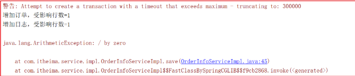 

数据库数据 

order_info表的数据为空 

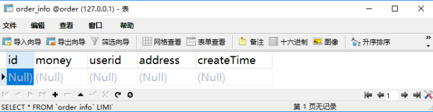 

log_info表的数据为空 

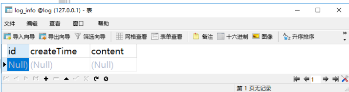

从上面结果我们可以看得到，分布式事务成功了！  


