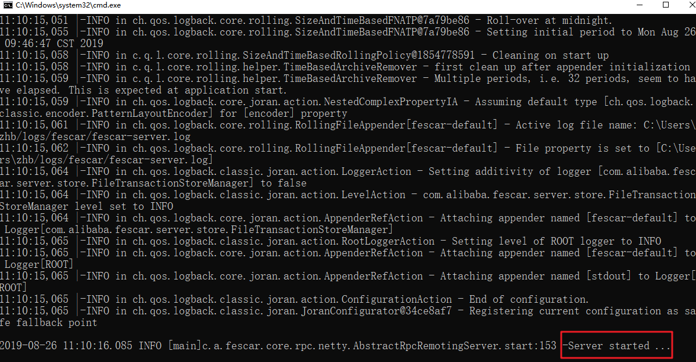
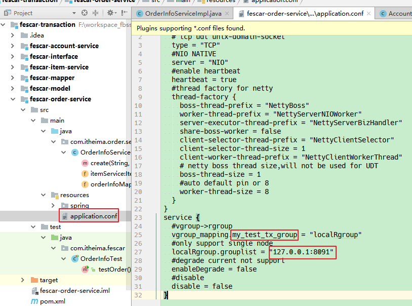
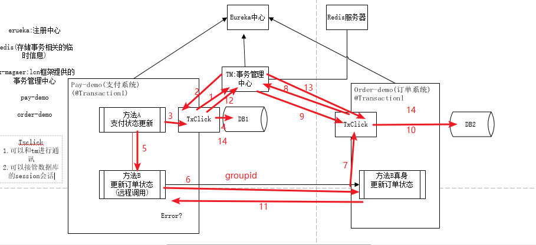
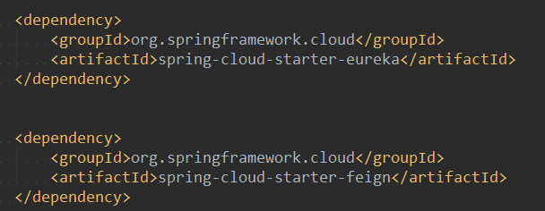

# 分布式事务 第二天


## 1.1学习目标

目标1  fescar+dubbo实现分布式事务

目标2  TX-LCN分布式事务框架

目标3  RocketMQ事务消息(了解)

# 第二章 fescar分布式事务实现

### 一. fescar介绍

##### 1.1 fescar介绍

https://www.oschina.net/p/fescar

升级后的名称叫:seata

https://github.com/seata/seata

1.2 FESCAR（Fast & Easy Commit And Rollback）

* 1.含义:

* 2.特点:高\易
  * 高性能
  * 易使用(基于注解)

* 3.出身:
  * 阿里开源

 


* 4.主要角色:TM \TC \RM


* 5.角色作用:

  https://www.oschina.net/p/fescar

```text


TM：全局事务管理器，在标注开启fescar分布式事务的服务端开启，并将全局事务发送到TC事务控制端管理

TC：事务控制中心，控制全局事务的提交或者回滚。这个组件需要独立部署维护，目前只支持单机版本，后续迭代计划会有集群版本

RM：资源管理器，主要负责分支事务的上报，本地事务的管理
```


* 6.机制

一段话简述其实现过程：服务起始方发起全局事务并注册到TC。在调用协同服务时，协同服务的事务分支事务会先完成阶段一的事务提交或回滚，并生成事务回滚的undo_log日志，同时注册当前协同服务到TC并上报其事务状态，归并到同一个业务的全局事务中。此时若没有问题继续下一个协同服务的调用，期间任何协同服务的分支事务回滚，都会通知到TC，TC在通知全局事务包含的所有已完成一阶段提交的分支事务回滚。如果所有分支事务都正常，最后回到全局事务发起方时，也会通知到TC，TC在通知全局事务包含的所有分支删除回滚日志。在这个过程中为了解决写隔离和度隔离的问题会涉及到TC管理的全局锁。

1.3 生命周期


##### 1.2 fescar核心步骤

- 1.开启TC服务 (fescar)

- 2.在父工程中的pom文件引入fescar的jar包,或者在各自服务的工程中引入fescar的jar包
- 3.配置三个数据库连接信息
- 4.分别在三个事务对应的服务端==配置全局事务管理器TM==
- 5.分别在三个事务对应的服务端==配置代理数据源,接管数据源==
- 6.分别在三个事务对应的服务端==配置sessionFactoryBean,使用代理数据源==
- 7.分别在三个事务对应的服务端==配置sessionFactoryBean中的接口扫描包位置==
- 8.分别在三个事务对应的服务端==配置TM与TC的通讯协议==(配置表)
- 9.事务的发起方,通过注解==@GlobalTransactional(name="fescar-itheima-tx")==发起全局事务

##### 1.3分布式事务案例说明

###### 1.业务描述


如上图，我们创建多个服务，分别为订单服务，账号服务，和库存服务，以用户下单为例，用户下单在Order服务中实现，账号扣款在Account服务中实现，库存减少，在Item服务中实现，每个服务操作的数据库不一致，使用fescar实现跨服务之间事务管理。


###### 2.数据库及表

fescar-order库中的表

undo_log(做事务回滚),不需要我们控制


fescar-item库中的表


fescar-account库中的表


###### 4.业务的事务调用链:

order服务--->item服务---->account服务

###### 5.测试用例:

```
测试用例1:
下单服务orderInfoServiceImpl,生成一条新的订单记录
Item中库存数量服务减少1
账户信息,金额减少100元
成功:三个服务都提交成功

测试用例2:
下单服务后出现异常,三个本地事务均回滚

测试用例3:
库存数量减少环节,出现异常,三个本地事务均回滚

测试用例4:
账户服务环节出现异常,三个本地事务均回滚
```

##### 

### 二. 基本业务实现

#### 2.1分布式事务的步骤课分为两步:

* 基本业务的实现
* 分布式事务的配置

#### 2.2基本业务实现:

##### 2.2.1公共工程搭建(工程的导入)


##### 2.2.2已完成工作的列表及步骤


如何捋清楚项目的结构


###### 

##### 2.2.3修改maven库


##### 2.2.4修改配置文件


##### 2.2.5跑起来zookeeper(查到zookeeper的ip地址),

##### 2.2.6修改dubbo的注册中心地址(其他服务层地址类似,略)


##### 2.2.7业务调用链条及分析

order-->item-->account(原子操作)

###### 业务逻辑步骤:

* 下单服务orderInfoServiceImpl,生成一条新的订单记录
* Item中库存数量服务减少1
* 账户信息,金额减少100元
* 成功:三个服务都提交成功

##### 2.2.8 **fescar-order-server项目的OrderInfoServiceImpl代码实现**

```java
@Service
public class OrderInfoServiceImpl implements OrderInfoService{

    @Autowired
    private OrderInfoMapper orderInfoMapper;

    //修改商品库存远程服务
    @Reference(check = false)
    private ItemService itemService;

    /***
     * 创建订单
     * @param id:商品ID
     * @param count：购买数量
     * @param usernumber：购买用户
     * @return
     */
    @Override
    @GlobalTransactional(timeoutMills = 300000, name = "itheima-dubbo-tx")
    public int add(int id, int count, String usernumber){
        //查询Item信息
        Item item = new Item(1,"华为荣耀4",100L,10);

        //创建订单
        OrderInfo orderInfo = new OrderInfo(count*item.getPrice(),new Date(),usernumber);
        int acount = orderInfoMapper.add(orderInfo);
        System.out.println("创建订单受影响行数："+acount);
        
        //制造异常，测试跨服务分布式事务
        // int q=10/0;  测试时使用
        
        //修改库存和账号余额
        item.setNum(count);
        int mcount = itemService.update(item,usernumber);

        //制造异常，测试跨服务分布式事务
        // int q=10/0;  测试时使用
        return mcount;
    }
}
```


##### 2.2.9 **fescar-item-server项目的ItemServiceImpl代码实现** 

```java
@Service
public class ItemServiceImpl implements ItemService {

    @Autowired
    private ItemMapper itemMapper;

    /***
     * 远程服务
     */
    @Reference(check = false)
    private AccountService accountService;

    /***
     * 修改商品个数
     * @param item：购买商品信息
     * @param  usernumber:用户账号
     * @return
     */
    @Override
    public int update(Item item,String usernumber){
        //调用远程服务修改账号金额信息
        Account account = new Account(usernumber,item.getPrice());
        int update = accountService.update(account);

        //修改商品库存
        int mcount = itemMapper.update(item);
        System.out.println("修改商品个数受影响行数："+mcount);
        return  mcount;
    }
}
```

##### 2.2.10 业务逻辑的测试代码

###### **fescar-account-service测试代码**

```java
public class ServiceAccountTest {
    /***
     * 服务启动测试
     * @param args
     */
    public static void main(String[] args) throws IOException {
        ApplicationContext act = new ClassPathXmlApplicationContext("spring/spring-dubbo.xml");
        System.in.read();
    }
}
```

###### **fescar-item-service测试代码**

```java
public class ServiceItemTest {
    /***
     * 服务启动测试
     * @param args
     */
    public static void main(String[] args) throws IOException {
        ApplicationContext act = new ClassPathXmlApplicationContext("spring/spring-dubbo.xml");
        System.in.read();
    }
}
```


###### ***fescar-item-service的测试**

```java
public class ServiceOrderTest {

    /***
     * 服务启动测试
     * @param args
     */
    public static void main(String[] args) throws IOException {
        ApplicationContext act = new ClassPathXmlApplicationContext("spring/spring-dubbo.xml");

        //获取订单实例对象
        OrderInfoService orderInfoService = act.getBean(OrderInfoService.class);
        orderInfoService.add(1, 5, "itheima");

        System.out.println("==========执行完毕==========");
    }
}
```


### **三. 分布式事务核心步骤配置说明:(重点)**

#### 3.1 fescar核心步骤说明

- 1.开启TC服务 (fescar)

- 2.在父工程中的pom文件引入fescar的jar包,或者在各自服务的工程中引入fescar的jar包
- 3.配置三个数据库连接信息
- 4.分别在三个事务对应的服务端==配置全局事务管理器TM==
- 5.分别在三个事务对应的服务端==配置代理数据源,接管数据源==
- 6.分别在三个事务对应的服务端==配置sessionFactoryBean,使用代理数据源==
- 7.分别在三个事务对应的服务端==配置sessionFactoryBean中的接口扫描包位置==
- 8.分别在三个事务对应的服务端==配置TM与TC的通讯协议==(配置表)
- 9.事务的发起方,通过注解==@GlobalTransactional(name="fescar-itheima-tx")==发起全局事务

#### 3.2 开启TC服务 (fescar)

##### 1.压缩包到本地文件夹,并修改配置文件


##### 2.修改配置文件


##### 3.启动TC



#### 3.3.在父工程中的pom文件引入fescar的jar包,或者在各自服务的工程中==引入fescar的jar包==

父工程中导入fescar核心jar包

pom.xml代码如下：

```xml
<?xml version="1.0" encoding="UTF-8"?>
<project xmlns="http://maven.apache.org/POM/4.0.0"
         xmlns:xsi="http://www.w3.org/2001/XMLSchema-instance"
         xsi:schemaLocation="http://maven.apache.org/POM/4.0.0 http://maven.apache.org/xsd/maven-4.0.0.xsd">
    <modelVersion>4.0.0</modelVersion>
    <groupId>com.itheima</groupId>
    <artifactId>fescar-transaction</artifactId>
    <version>1.0-SNAPSHOT</version>
    <packaging>pom</packaging>
    <dependencies>

        <!--fescar依赖-->
        <dependency>
            <groupId>com.alibaba.fescar</groupId>
            <artifactId>fescar-tm</artifactId>
            <version>0.1.3</version>
        </dependency>
        <dependency>
            <groupId>com.alibaba.fescar</groupId>
            <artifactId>fescar-spring</artifactId>
            <version>0.1.3</version>
        </dependency>
        <dependency>
            <groupId>com.alibaba.fescar</groupId>
            <artifactId>fescar-dubbo</artifactId>
            <version>0.1.3</version>
        </dependency>
        
       ....
    </dependencies>
</project>
```


#### 3.4 ==配置三个数据库连接信息==

mapper项目中配置多个数据源config/jdbc.properties

```properties
#account
driverClassName_account=com.mysql.jdbc.Driver
url_account=jdbc:mysql://192.168.211.1:3306/fescar-account?useUnicode=true&characterEncoding=utf8&autoReconnect=true
username_account=root
password_account=123456

#item
driverClassName_item=com.mysql.jdbc.Driver
url_item=jdbc:mysql://192.168.211.1:3306/fescar-item?useUnicode=true&characterEncoding=utf8&autoReconnect=true
username_item=root
password_item=123456

#order
driverClassName_order=com.mysql.jdbc.Driver
url_order=jdbc:mysql://192.168.211.1:3306/fescar-order?useUnicode=true&characterEncoding=utf8&autoReconnect=true
username_order=root
password_order=123456
```


#### 3.5分别在三个事务对应的服务端==配置全局事务管理器TM==

以修改fescar-order的spring-dubbo.xml,添加全局事务管理器为例


#### 3.6 ==配置数据源的扫描包位置==.


#### ==3.7配置TM与TC的通讯协议==(配置表)



#### 3.8 事务的发起方,通过注解==@GlobalTransactional(name="fescar-itheima-tx")==发起全局事务


### 四. 核心代码具体实现

#### 4. 1 fescar-orderinfo-service

该工程搭建dubbo服务，实现用户购买商品创建订单操作，同时远程调用修改库存服务。

##### 4.1.1 配置全局事务管理器和数据源 **spring/spring-dubbo.xml**

```xml
<?xml version="1.0" encoding="UTF-8"?>
<beans xmlns="http://www.springframework.org/schema/beans"
       xmlns:xsi="http://www.w3.org/2001/XMLSchema-instance"
       xmlns:dubbo="http://dubbo.apache.org/schema/dubbo"
       xsi:schemaLocation="http://www.springframework.org/schema/beans
       http://www.springframework.org/schema/beans/spring-beans.xsd
       http://dubbo.apache.org/schema/dubbo
       http://dubbo.apache.org/schema/dubbo/dubbo.xsd">
    <!--注册dubbo服务名字-->
    <dubbo:application name="fescar-orderinfo" />
    <!--注册中心  (略)-->
    
    <dubbo:annotation package="com.itheima" />

    <!--注入全局事务管理器-->
    <bean class="com.alibaba.fescar.spring.annotation.GlobalTransactionScanner">
        <constructor-arg value="fescar-orderinfo"/>
        <constructor-arg value="my_test_tx_group"/>
    </bean>

    <!--代理数据源-->
    <bean id="dataSourceProxy" class="com.alibaba.fescar.rm.datasource.DataSourceProxy">
        <constructor-arg ref="dataSource" />
    </bean>

    <!--引入spring-mybatis.xml-->
    <import resource="spring-mybatis.xml" />
</beans>
```


##### **4.1.2 配置sqlsessionFactoryBean和扫描包 spring/spring-mybatis.xml**

```xml
<?xml version="1.0" encoding="UTF-8"?>
<beans xmlns="http://www.springframework.org/schema/beans"
       xmlns:xsi="http://www.w3.org/2001/XMLSchema-instance"
       xmlns:p="http://www.springframework.org/schema/p"
       xmlns:context="http://www.springframework.org/schema/context"
       xsi:schemaLocation="
        http://www.springframework.org/schema/beans
        http://www.springframework.org/schema/beans/spring-beans.xsd
        http://www.springframework.org/schema/context
        http://www.springframework.org/schema/context/spring-context.xsd">

    <!--解析配置文件-->
    <context:property-placeholder location="classpath:config/jdbc.properties" />

    <!-- 数据库连接池  (略) -->
    
    <!-- SqlSessionFactoryBean -->
    <bean id="sqlSessionFactoryBean" class="org.mybatis.spring.SqlSessionFactoryBean">
        <property name="dataSource" ref="dataSourceProxy" />
    </bean>

    <!--
        配置接口扫描包
        如果是单数据源，则可以不配置sqlSessionFactoryBeanName
    -->
    <bean class="org.mybatis.spring.mapper.MapperScannerConfigurer"
          p:basePackage="com.itheima.mapper"
          p:sqlSessionFactoryBeanName="sqlSessionFactoryBean" />
</beans>
```


##### **4.1.3 配置TM与TC的通讯协议,application.conf**

```properties
transport {
  # tcp udt unix-domain-socket
  type = "TCP"
  #NIO NATIVE
  server = "NIO"
  #enable heartbeat
  heartbeat = true
  #thread factory for netty
  thread-factory {
    boss-thread-prefix = "NettyBoss"
    worker-thread-prefix = "NettyServerNIOWorker"
    server-executor-thread-prefix = "NettyServerBizHandler"
    share-boss-worker = false
    client-selector-thread-prefix = "NettyClientSelector"
    client-selector-thread-size = 1
    client-worker-thread-prefix = "NettyClientWorkerThread"
    # netty boss thread size,will not be used for UDT
    boss-thread-size = 1
    #auto default pin or 8
    worker-thread-size = 8
  }
}
service {
  #vgroup->rgroup 注意这里
  vgroup_mapping.my_test_tx_group = "localRgroup"
  #only support single node  注意这里
  localRgroup.grouplist = "127.0.0.1:8091" 
  #degrade current not support
  enableDegrade = false
  #disable
  disable = false
}
```

4.1.4 业务代码上添加全局事务注解

​    @GlobalTransactional(name="fescar-itheima-tx")

```java
package com.itheima.order.service.impl;

import com.alibaba.fescar.spring.annotation.GlobalTransactional;
import com.itheima.mapper.OrderInfoMapper;
import com.itheima.model.Account;
import com.itheima.model.Item;
import com.itheima.model.OrderInfo;
import com.itheima.service.ItemService;
import com.itheima.service.OrderInfoService;
import org.apache.dubbo.config.annotation.Reference;
import org.apache.dubbo.config.annotation.Service;
import org.springframework.beans.factory.annotation.Autowired;

import java.util.Date;

/***
 *
 *
 ****/
@Service
public class OrderInfoServiceImpl implements OrderInfoService {

    @Autowired
    private OrderInfoMapper orderInfoMapper;

    @Reference(check = false)
    private ItemService itemService;

    /****
     * 创建订单
     * 调用ItemService修改库存(调用AccountService修改余额)
     *
     * @param  usernumber:购买商品的用户
     * @param  id：购买的商品ID
     * @param  count:要减的数量
     */
    @GlobalTransactional(name="fescar-itheima-tx")
    @Override
    public int create(String usernumber, Integer id, Integer count){
        //从数据库查询商品信息
        Item item = new Item();
        item.setId(id);
        item.setNum(count);
        item.setPrice(100L);
        item.setTitle("华为荣耀4");

        //创建订单
        OrderInfo orderInfo = new OrderInfo();
        orderInfo.setId((int)(Math.random()*1000));
        orderInfo.setMoney(item.getPrice()*count);
        orderInfo.setCreatetime(new Date());
        orderInfo.setUsernumber(usernumber);
        int acount = orderInfoMapper.add(orderInfo);

        System.out.println("添加订单受影响行数："+acount);

        //制造异常
//        System.out.println("开始报错了。。。。");
//        int q=10/0;

        //调用ItemService(远程调用)
        Account account = new Account();
        account.setUsernumber(usernumber);
        account.setMoney(item.getPrice()*count); //花掉的钱
        itemService.update(item,account);

        //制造异常
//        System.out.println("开始报错了。。。。");
//        int q=10/0;
        return  acount;
    }


}

```


#### 4.2 fescar-item-service

该工程搭建dubbo服务，实现商品数量修改操作以及调用fescar-account服务实现账号余额修改。

##### 4.2.1 配置全局事务管理器和数据源**spring/spring-dubbo.xml**

```xml
<?xml version="1.0" encoding="UTF-8"?>
<beans xmlns="http://www.springframework.org/schema/beans"
       xmlns:xsi="http://www.w3.org/2001/XMLSchema-instance"
       xmlns:dubbo="http://dubbo.apache.org/schema/dubbo"
       xsi:schemaLocation="http://www.springframework.org/schema/beans
       http://www.springframework.org/schema/beans/spring-beans.xsd
       http://dubbo.apache.org/schema/dubbo
       http://dubbo.apache.org/schema/dubbo/dubbo.xsd">
    <!--注册dubbo服务名字-->
    <dubbo:application name="fescar-item" />
    <!--注册中心-->
   
    <dubbo:annotation package="com.itheima" />

    <!--注入全局事务管理器-->
    <bean class="com.alibaba.fescar.spring.annotation.GlobalTransactionScanner">
        <constructor-arg value="fescar-item"/>
        <constructor-arg value="my_test_tx_group"/>
    </bean>

    <!--代理数据源-->
    <bean id="dataSourceProxy" class="com.alibaba.fescar.rm.datasource.DataSourceProxy">
        <constructor-arg ref="dataSource" />
    </bean>

    <!--引入spring-mybatis.xml-->
    <import resource="spring-mybatis.xml" />
</beans>
```


##### 4.2.2 配置扫描包位置 **spring/spring-mybatis.xml**

```xml
<?xml version="1.0" encoding="UTF-8"?>
<beans xmlns="http://www.springframework.org/schema/beans"
       xmlns:xsi="http://www.w3.org/2001/XMLSchema-instance"
       xmlns:p="http://www.springframework.org/schema/p"
       xmlns:context="http://www.springframework.org/schema/context"
       xsi:schemaLocation="
        http://www.springframework.org/schema/beans
        http://www.springframework.org/schema/beans/spring-beans.xsd
        http://www.springframework.org/schema/context
        http://www.springframework.org/schema/context/spring-context.xsd">

    <!--解析配置文件-->
    <context:property-placeholder location="classpath:config/jdbc.properties" />

    
    <!-- SqlSessionFactoryBean -->
    <bean id="sqlSessionFactoryBean" class="org.mybatis.spring.SqlSessionFactoryBean">
        <property name="dataSource" ref="dataSourceProxy" />
    </bean>

    <!--
        配置接口扫描包
        如果是单数据源，则可以不配置sqlSessionFactoryBeanName
    -->
    <bean class="org.mybatis.spring.mapper.MapperScannerConfigurer"
          p:basePackage="com.itheima.mapper"       p:sqlSessionFactoryBeanName="sqlSessionFactoryBean" />
</beans>
```

##### 4.2.3 配置通讯模块  **application.conf**

```properties
transport {
  # tcp udt unix-domain-socket
  type = "TCP"
  #NIO NATIVE
  server = "NIO"
  #enable heartbeat
  heartbeat = true
  #thread factory for netty
  thread-factory {
    boss-thread-prefix = "NettyBoss"
    worker-thread-prefix = "NettyServerNIOWorker"
    server-executor-thread-prefix = "NettyServerBizHandler"
    share-boss-worker = false
    client-selector-thread-prefix = "NettyClientSelector"
    client-selector-thread-size = 1
    client-worker-thread-prefix = "NettyClientWorkerThread"
    # netty boss thread size,will not be used for UDT
    boss-thread-size = 1
    #auto default pin or 8
    worker-thread-size = 8
  }
}
service {
  #vgroup->rgroup
  vgroup_mapping.my_test_tx_group = "localRgroup"
  #only support single node
  localRgroup.grouplist = "127.0.0.1:8091"
  #degrade current not support
  enableDegrade = false
  #disable
  disable = false
}
```


#### 4.3 fescar-Account-service

##### 4.3.1 配置全局事务管理器和数据源**spring/spring-dubbo.xml**

```xml
<?xml version="1.0" encoding="UTF-8"?>
<beans xmlns="http://www.springframework.org/schema/beans"
       xmlns:xsi="http://www.w3.org/2001/XMLSchema-instance"
       xmlns:dubbo="http://dubbo.apache.org/schema/dubbo"
       xsi:schemaLocation="http://www.springframework.org/schema/beans
       http://www.springframework.org/schema/beans/spring-beans.xsd
       http://dubbo.apache.org/schema/dubbo
       http://dubbo.apache.org/schema/dubbo/dubbo.xsd">
    <!--注册dubbo服务名字-->
    <dubbo:application name="fescar-account" />
    <!--注册中心-->
   
    <dubbo:annotation package="com.itheima" />

    <!--注入全局事务管理器-->
    <bean class="com.alibaba.fescar.spring.annotation.GlobalTransactionScanner">
        <constructor-arg value="fescar-account"/>
        <constructor-arg value="my_test_tx_group"/>
    </bean>

    <!--代理数据源-->
    <bean id="dataSourceProxy" class="com.alibaba.fescar.rm.datasource.DataSourceProxy">
        <constructor-arg ref="dataSource" />
    </bean>

    <!--引入spring-mybatis.xml-->
    <import resource="spring-mybatis.xml" />
</beans>
```


##### 4.3.2 配置扫描包位置 **spring/spring-mybatis.xml**

```xml
<?xml version="1.0" encoding="UTF-8"?>
<beans xmlns="http://www.springframework.org/schema/beans"
       xmlns:xsi="http://www.w3.org/2001/XMLSchema-instance"
       xmlns:p="http://www.springframework.org/schema/p"
       xmlns:context="http://www.springframework.org/schema/context"
       xsi:schemaLocation="
        http://www.springframework.org/schema/beans
        http://www.springframework.org/schema/beans/spring-beans.xsd
        http://www.springframework.org/schema/context
        http://www.springframework.org/schema/context/spring-context.xsd">

    <!--解析配置文件-->
    <context:property-placeholder location="classpath:config/jdbc.properties" />

    
    <!-- SqlSessionFactoryBean -->
    <bean id="sqlSessionFactoryBean" class="org.mybatis.spring.SqlSessionFactoryBean">
        <property name="dataSource" ref="dataSourceProxy" />
    </bean>

    <!--
        配置接口扫描包
        如果是单数据源，则可以不配置sqlSessionFactoryBeanName
    -->
    <bean class="org.mybatis.spring.mapper.MapperScannerConfigurer"
          p:basePackage="com.itheima.mapper"       p:sqlSessionFactoryBeanName="sqlSessionFactoryBean" />
</beans>
```

##### 4.3.3 配置通讯模块  **application.conf**

```properties
transport {
  # tcp udt unix-domain-socket
  type = "TCP"
  #NIO NATIVE
  server = "NIO"
  #enable heartbeat
  heartbeat = true
  #thread factory for netty
  thread-factory {
    boss-thread-prefix = "NettyBoss"
    worker-thread-prefix = "NettyServerNIOWorker"
    server-executor-thread-prefix = "NettyServerBizHandler"
    share-boss-worker = false
    client-selector-thread-prefix = "NettyClientSelector"
    client-selector-thread-size = 1
    client-worker-thread-prefix = "NettyClientWorkerThread"
    # netty boss thread size,will not be used for UDT
    boss-thread-size = 1
    #auto default pin or 8
    worker-thread-size = 8
  }
}
service {
  #vgroup->rgroup
  vgroup_mapping.my_test_tx_group = "localRgroup"
  #only support single node
  localRgroup.grouplist = "127.0.0.1:8091"
  #degrade current not support
  enableDegrade = false
  #disable
  disable = false
}
```


测试:

```java
package com.itheima.fescar;

import com.itheima.service.OrderInfoService;
import org.junit.Test;
import org.springframework.context.ApplicationContext;
import org.springframework.context.support.ClassPathXmlApplicationContext;

import java.io.IOException;

/***
 *
 *
 ****/
public class OrderInfoTest {

    /***
     * 业务测试
     */
    @Test
    public void testOrder() throws IOException {
        ApplicationContext act = new ClassPathXmlApplicationContext("spring/spring-dubbo.xml");
        OrderInfoService orderInfoService = act.getBean(OrderInfoService.class);
        orderInfoService.create("itheima",1, 1);

    }
}

```


### 五 测试用例:

全部成功时,数据都变更


**测试用例1:**

* 用例描述:==添加订单后出现异常,未调用后续服务,所以只有订单回滚,属于本地事务,不涉及分布式事务数据一致性,(测试略)==

  

* 测试结果:(==本地事务控制,测试略==)


**测试用例2:**

* 用例描述:执行完本地订单事务,同时调用了远程的扣库存和扩宽服务后,出现了异常,三个数据库的数据都应该回滚.

  

* 测试结果:

  * 订单表测试结果

  

测试用例2:


# 第三章 RocketQ事务消息

RocketMq的简介:

出身:阿里巴巴,消息中间件.性能

特点:

* ==支持事务消息==
* 顺序消息
* 定时消息
* 批量消息
* 消息回溯.

事务消息的概念:==执行本地事务（Bob账户扣款）和发送异步消息应该保证同时成功或者同时失败==


##### 3.1 RocketMQ事务消息流程

RocketMQ的事务消息，主要是通过消息的异步处理，可以保证本地事务和消息发送同时成功执行或失败，从而保证数据的最终一致性，这里我们先看看一条事务消息从诞生到结束的整个时间线流程： 


```properties
事务消息的成功投递是需要经历三个Topic的，分别是：
	Half Topic：用于记录所有的prepare消息
	Op Half Topic：记录已经提交了状态的prepare消息
	Real Topic：事务消息真正的Topic,在Commit后会才会将消息写入该Topic，从而进行消息的投递
```


##### 3.2 事务消息生产者

我们创建一个事务消息生产者TransactionProducer,事务消息发送消息对象是TransactionMQProducer，为了实现本地事务操作和回查，我们需要创建一个监听器，监听器需要实现TransactionListener接口，实现代码如下：

监听器TransactionListenerImpl，代码如下：


上图代码如下

```java
package com.itheima.mq;

import org.apache.rocketmq.client.producer.LocalTransactionState;
import org.apache.rocketmq.client.producer.TransactionListener;
import org.apache.rocketmq.common.message.Message;
import org.apache.rocketmq.common.message.MessageExt;

import java.util.concurrent.ConcurrentHashMap;

public class MyTransactionListener implements TransactionListener {

    //记录对应事务消息的执行状态   1:正在执行，2：执行成功，3：失败了
    //对于mq来说,正在事务发起方正在执行查询结果,只要未收到明确的commit或者rollback,都是未知结果unkown
    //对于mq来说,commit执行成功,才发送消息
    //对于mq来说,事务执行失败了将不再发送消息,并且将消息队列中的half消息干掉,以免再次扫描到再次回查
    //通过事务的id来辨别不同的事务

    private ConcurrentHashMap<String,Integer> transMap = new ConcurrentHashMap<String,Integer>();

    /**
     * 消息发送方执行自身业务操作的方法
     * @param msg 发送方发送的东西
     * @param arg 额外的参数
     * @return
     */
    public LocalTransactionState executeLocalTransaction(Message msg, Object arg) {
            //业务代码写这里

        String transactionId = msg.getTransactionId();
        //设置执行状态为正在执行,state=1
        transMap.put(transactionId, 1);

        try {
            //控制本地事务
            System.out.println("转账开始");
            System.out.println("转账成功");
            //测试用例1
//            int i=1/0;
            //测试用例2 测试网络超时状态
//            Thread.sleep(70000);
            System.out.println("更新订单状态");
            System.out.println("订单已更新");
            //执行成功时,返回提交事务消息成功的标识
            transMap.put(transactionId, 2);
            if(1==1){
                return  LocalTransactionState.UNKNOW;
            }


        }catch (Exception e){
            //发生异常时，返回回滚事务消息
            //执行成功时,返回提交事务消息成功的标识
            transMap.put(transactionId, 3);
            System.out.println("事务执行失败,事务执行状态为:"+LocalTransactionState.ROLLBACK_MESSAGE);
            return  LocalTransactionState.ROLLBACK_MESSAGE;
        }
        System.out.println("事务执行成功,事务执行状态为:"+LocalTransactionState.COMMIT_MESSAGE);
        return LocalTransactionState.COMMIT_MESSAGE;

    }


    /***
     * 事务超时，回查方法
     * @param msg:携带要回查的事务ID
     * @return
     */
    @Override
    public LocalTransactionState checkLocalTransaction(MessageExt msg) {
        //根据transaction的id回查该事务的状态,并返回给消息队列
        //未知状态:查询事务状态,但始终无结果,或者由于网络原因发送不成功,对mq来说都是未知状态,LocalTransactionState.UNKNOW
        //正确提交返回LocalTransactionState.COMMIT_MESSAGE
        //事务执行失败返回LocalTransactionState.ROLLBACK_MESSAGE
        String transactionId = msg.getTransactionId();
        Integer state = transMap.get(transactionId);
        System.out.println("回查的事务id为:"+transactionId+",当前的状态为"+state);

        if (state==2){
            //执行成功,返回commit
            System.out.println("回查结果为事务正确提交,返回状态为:"+LocalTransactionState.COMMIT_MESSAGE);
            return  LocalTransactionState.COMMIT_MESSAGE;

        }else if(state==3){
            //执行失败,返回rollback
            System.out.println("回查结果为事务回滚,返回状态为:"+LocalTransactionState.ROLLBACK_MESSAGE);
            return  LocalTransactionState.ROLLBACK_MESSAGE;
        }

            //正在执行
            System.out.println("回查正在执行,返回状态为:"+LocalTransactionState.UNKNOW);
            return  LocalTransactionState.UNKNOW;

    }
}

```


创建消息发送对象TransactionProducer,代码如下： 

生产者(事务消息生产者)

线程池

监听器

事务id

消息体

消息生产者,将线程池和监听器装配到消息生产者中.

生成消息体,通过发送方法,将消息体发送出去.


上图代码如下：

```java
package com.itheima.mq;

import org.apache.rocketmq.client.producer.TransactionMQProducer;
import org.apache.rocketmq.common.message.Message;
import org.apache.rocketmq.remoting.common.RemotingHelper;

import java.util.concurrent.*;

public class TransactionProducer {
    public static void main(String[] args) throws Exception{
        //创建事务消息消费者
        TransactionMQProducer transactionMQProducer = new TransactionMQProducer("trans_producer_group_zhb");
        //指定链接的服务器地址(nameserver)
        transactionMQProducer.setNamesrvAddr("127.0.0.1:9876");
        //创建消息回查的类,我们自己的监听器
        transactionMQProducer.setTransactionListener(new MyTransactionListener());
        //创建线程池,
        ExecutorService executorService = new ThreadPoolExecutor(
                2,
                5,
                100,
                TimeUnit.SECONDS,
                new ArrayBlockingQueue<Runnable>(
                        2000),
                new ThreadFactory() {
                    @Override
                    public Thread newThread(Runnable runnable) {
                        Thread thread = new Thread(runnable);
                        thread.setName("zhb_client-transaction-msg-check-thread");
                        return thread;
                    }
                }
        );

        //创建发送的消息
        Message message = new Message(
                "zhbtopic", "zhbtags", "zhbkeys", "zhb的消息".getBytes(RemotingHelper.DEFAULT_CHARSET)
        );
        //启动发送者
        transactionMQProducer.start();
        //发送消息
        transactionMQProducer.sendMessageInTransaction(message,"额外的消息");
        //关闭消息的发送者
        transactionMQProducer.shutdown();
    }
}

```

小知识：上述用到了线程池，相关参数如下：

| 序号 | 名称            | 类型                     | 含义             |
| ---- | --------------- | ------------------------ | ---------------- |
| 1    | corePoolSize    | int                      | 核心线程池大小   |
| 2    | maximumPoolSize | int                      | 最大线程池大小   |
| 3    | keepAliveTime   | long                     | 线程最大空闲时间 |
| 4    | unit            | TimeUnit                 | 时间单位         |
| 5    | workQueue       | BlockingQueue<Runnable>  | 线程等待队列     |
| 6    | threadFactory   | ThreadFactory            | 线程创建工厂     |
| 7    | handler         | RejectedExecutionHandler | 拒绝策略         |


##### 3.3 事务消息消费

事务消息的消费者和普通消费者一样，这里我们就不做介绍了，直接贴代码： 

```java
package com.itheima.mq;

import org.apache.rocketmq.client.consumer.DefaultMQPushConsumer;
import org.apache.rocketmq.client.consumer.listener.ConsumeConcurrentlyContext;
import org.apache.rocketmq.client.consumer.listener.ConsumeConcurrentlyStatus;
import org.apache.rocketmq.client.consumer.listener.MessageListenerConcurrently;
import org.apache.rocketmq.common.consumer.ConsumeFromWhere;
import org.apache.rocketmq.common.message.MessageExt;
import org.apache.rocketmq.remoting.common.RemotingHelper;

import java.io.UnsupportedEncodingException;
import java.util.List;

public class TransactionConsumer {
    public static void main(String[] args) throws Exception{
        //创建消息的消费者
        DefaultMQPushConsumer consumer = new DefaultMQPushConsumer("zhb_trans-client-group");
        //设置要链接的服务器地址(nameserver)
        consumer.setNamesrvAddr("127.0.0.1:9876");
        //设置单次消费的消息的数量
        consumer.setConsumeMessageBatchMaxSize(5);
        //设置消息消费的顺序
        consumer.setConsumeFromWhere(ConsumeFromWhere.CONSUME_FROM_FIRST_OFFSET);
        //设置消费者监听哪些消息
        consumer.subscribe("zhbtopic", "zhbtags");
        //进行消息的接收，并返回接收消息的结果
        consumer.registerMessageListener(new MessageListenerConcurrently() {
            @Override
            public ConsumeConcurrentlyStatus consumeMessage(List<MessageExt> list, ConsumeConcurrentlyContext consumeConcurrentlyContext) {

                try {
                    for(MessageExt mes :list){
                        String topic = mes.getTopic();
                        String tags = mes.getTags();
                        String keys = mes.getKeys();
                        String s = new String(mes.getBody(), "utf-8");
                        String transactionId = mes.getTransactionId();
                        System.out.println("接收到的transactionid:"+transactionId+", topic:"+topic+",tags:"+tags+",消息:"+s);
                    }
                }catch( Exception e){
                    e.printStackTrace();
                }

                return ConsumeConcurrentlyStatus.CONSUME_SUCCESS;
            }
        });
        //启动消费者
        System.out.println("启动完成");
        consumer.start();
    }
}

```

##### 测试结果:

* 执行超时后,mq调用回查方法.返回为未知状态unkonw

* mq继续调用回查方法,此时网络问题解决,事务执行成功,mq收到事务commit消息

* mq发送消息带订阅者.


消费者读取消息:


事务消息参考地址：http://rocketmq.apache.org/docs/transaction-example/ 


# 第四章  Lcn分布式事务框架介绍

 

### **1、****什么是LCN框架**

LCN分布式事务框架,最新版本v5.0   [https://www.txlcn.org](https://www.txlcn.org/)

本次实例,是基于4.0

==注意点:==  

* 1. lcn5.0 是使用的注解是@LcnTransaction,  4.0 使用的是 TxTransaction
  2. springboot的版本,4.0 使用的是1.5.4 ,  springcloud版本号和lcn版本号要相对应的版本.

### **2、****框架特点**

1) 支持各种基于spring的db框架

2) 兼容SpringCloud、Dubbo

3) 使用简单，低依赖，代码完全开源

4) 基于切面的强一致性事务框架

5) 高可用，模块可以依赖Dubbo或SpringCloud的集群方式做集群化，TxManager也可以做集群化

6) 支持本地事务和分布式事务共存

7) 事务补偿机制，服务故障或挂机再启动时可恢复事务

### **3、****LCN框架原理**

参考网站 

[https://github.com/codingapi/tx-lcn/wiki/LCN%E5%8E%9F%E7%90%86](https://github.com/codingapi/tx-lcn/wiki/LCN原理)

 

1)LCN事务控制原理是由事务模块TxClient下的代理连接池与TxManager的协调配合完成的事务协调控制。

 

2)TxClient的代理连接池实现了javax.sql.DataSource接口，并重写了close方法，事务模块在提交关闭以后TxClient连接池将执行"假关闭"操作，等待TxManager协调完成事务以后在关闭连接。

### **4、****核心步骤**

**创建事务组**是指在事务发起方开始执行业务代码之前先调用TxManager创建事务组对象，然后拿到事务标示GroupId的过程。

**添加事务组**添加事务组是指参与方在执行完业务方法以后，将该模块的事务信息添加通知给TxManager的操作。

**关闭事务组**是指在发起方执行完业务代码以后，将发起方执行结果状态通知给TxManager的动作。当执行完关闭事务组的方法以后，TxManager将根据事务组信息来通知相应的参与模块提交或回滚事务。

 

 

业务场景：

 

 

时序图：

 

 

若参与方B出现异常，那么他们的业务时序图为：

 

若他们的调用关系是这样的情况

 

此时发生参与方B出现异常时他们的时序图为


 

### **5、****SpringCloud整合LCN框架实战**

### ==5.1 Lcn核心步骤:==

* 1.建立eureka注册中心、并启动
* 2.启动redis
* 2.TX-manager项目修改redis地址和端口
* 项目发起方:
  * pom文件引入lcn的jar包,
  * 以及druid的jar包(数据库代理服务)
  * 在配置文件中添加tx-manager的地址(通讯用)
  * 启动类中添加数据源代理
  * 添加与tx-manager的通讯模块
  * 发起方业务方法上添加@TxTransaction(isStart=true)注解

* 事务参与方:
  * pom文件引入lcn的jar包,以及druid的jar包(数据库代理服务)
  * 在配置文件中添加tx-manager的地址(通讯用)
    * http://127.0.0.1:8899/
  * 启动类中添加数据源代理,接管数据库的会话
  * 添加与tx-manager的通讯模块
  * 业务全局事务的参与方的业务方法上添加@TxTransaction注解

  

### **6、****准备的软件环境**

**1)** **TX-LCN4.0.1、springcloud   版本、spring boot1.5.4【注意】**

**2)** **Tx-LCN项目案例、tx-manager** **（注意：lcn版本和springboot 及springcloud要匹配）**

**3)** **JRE1.8+, Mysql5.6+, Redis3.2+**

**4) **注册中心（zk或eureka）、项目A、项目B

 

 案例分析:


支付项目pay、订单项目order,

更新支付表,更新订单表,

条件:只有支付表的状态更新为ispay变为1时,订单表才可以做状态更新,由status,0变更为1.

系统的分布,paytable在pay数据库中,订单表orderInfo在order数据库中

数据表：paytable、订单表ordertable

开发环境:springcloud\eureka\

设计系统:

erueka:注册中心

redis(存储事务相关的临时信息)

tx-magaer:lcn框架提供的事务管理中心

pay-demo

order-demo


测试用例:

伪代码

Public String updatePayAndOrder( payid,ispay,allok ){

异常?(不用测)

pay-demo控制自己的事务

==Status=payService.update();//本地支付成功 实际业务==

异常?(测试用例1)

order-demo控制自己的事务

==Status=orderService.update();//  B其他系统的改变订单状态==

异常?(测试用例2)

}




### **8、构建测试用例**

8.1、建立eureka注册中心、并启动

8.2、数据库准备

8.3、创建两个项目，支付端服务pay A、订单系统B

8.4、构建pay-demo项目

​	1) 添加payService接口

​	2) 添加payServiceImp类

​	3) 添加payController类

​	4) 写feign接口

​	5) 调试远程调用

8.5、订单服务order-demo

​	1) 新建一个接口orderService接口

​	2) orderServiceImp实现类

​	3) 建orderController实现类

​	4) 添加事务

​	5) 测试效果

​	6) 启动类添加feign注解

​	7) 远程调用测试

8.6、测试用例1，各自维护自己的事务


 

# 第五章 lcn框架集成实战

 

###  ==5.1 Lcn核心步骤:==

- 1.建立eureka注册中心、并启动
- 2.启动redis
- 2.TX-manager项目修改redis地址和端口
- 项目发起方:
  - pom文件引入lcn的jar包,
  - 以及druid的jar包(数据库代理服务)
  - 在配置文件中添加tx-manager的地址(通讯用)
  - 启动类中添加数据源代理
  - 添加与tx-manager的通讯模块
  - 发起方业务方法上添加@TxTransaction(isStart=true)注解

- 事务参与方:
  - pom文件引入lcn的jar包,以及druid的jar包(数据库代理服务)
  - 在配置文件中添加tx-manager的地址(通讯用)
    - http://127.0.0.1:8899/
  - 启动类中添加数据源代理,接管数据库的会话
  - 添加与tx-manager的通讯模块
  - 业务全局事务的参与方的业务方法上添加@TxTransaction注解

### **5.2、****下载源码和示例 LCN，查看lcn对应的版本号及启动并运行tx-manager项目，**

(1) 导入idea


查看重要版本号


### 5.3 修改tx-manager项目的eureka地址和redis配置、


### 5.4服务器端口建议保持不变

 

### **5.5、启动redis** (linux或win版本都可)

#### 5.5.1 Linux版本启动

./redis-server  redis.conf

./redis-cli -h 127.0.0.1 -p6379

查看是否启动成功 ps -ef | grep redis


#### 5.5.2 Windows版本启动


### 5.6 运行eureka注册中心


### **5.7、启动成功，可以看到tx-manager的客户端假面。**

1) 启动路径：http://localhost:8899


2) 界面


### **5.8、发起事务组的项目配置与开发（pay-demo配置）**

#### **1)** **从【springcloud-lcn-demo】拷贝依赖jar包到发起方与所有参与方。****【注意版本号】非常重要**

#### **2)** **Pom文件引入相应的jar包到*

 


 

#### **3)** 到**【springcloud-mybatis-demo1】项目下pom拷贝对应的jar包,有则不用拷贝了**


#### **4)** **修改Application.properties文件**

重点:配置tm-manager地址


```properties
#txmanager地址
tm.manager.url=http://127.0.0.1:8899/tx/manager/
```


 

#### **5)** **启动类中加入自动配置注解并返回dataSource**


```java
@Autowired
private Environment env;

@Bean
public DataSource dataSource() {
   DruidDataSource dataSource = new DruidDataSource();
   dataSource.setUrl(env.getProperty("spring.datasource.url"));
   dataSource.setUsername(env.getProperty("spring.datasource.username"));//用户名
   dataSource.setPassword(env.getProperty("spring.datasource.password"));//密码
   dataSource.setInitialSize(2);
   dataSource.setMaxActive(20);
   dataSource.setMinIdle(0);
   dataSource.setMaxWait(60000);
   dataSource.setValidationQuery("SELECT 1");
   dataSource.setTestOnBorrow(false);
   dataSource.setTestWhileIdle(true);
   dataSource.setPoolPreparedStatements(false);
   return dataSource;
}
```


 

#### **6)** **拷贝文件到实现类到现有项目中**

 


#### **7)** **业务方法上加上TxTransaction（isStart=true）注解**


 

#### **8)** **主要业务代码** 

```java
package com.itheima.pay.service.impl;

//import com.codingapi.tx.annotation.TxTransaction;
import com.codingapi.tx.annotation.TxTransaction;
import com.itheima.pay.client.FeignOrderClient;
import com.itheima.pay.mapper.PaytableMapper;
import com.itheima.pay.service.PayService;
import org.springframework.beans.factory.annotation.Autowired;
import org.springframework.stereotype.Service;
import org.springframework.transaction.annotation.Transactional;

import javax.annotation.Resource;

@Service
public class PayServiceImp implements PayService {
    /**
     *1.注入支付表的mapper
     *2. 远程调用订单表的服务,这里使用feign转化为本地服务
     *3.更新支付表   payMapper
     *4.更新订单表的服务
     *5.开启本地事务
     *6.整合lcn框架,实现分布式事务
     *  加入tc模块:
     *  加入lcn的jar包
     *  与tm通信,需要通讯模块
     *  接管数据源
     *  添加lcn注解开启分布式事务
     */

    @Autowired
    private PaytableMapper paytableMapper;

    @Autowired
    private FeignOrderClient orderClient;

    @Override
    @Transactional
    @TxTransaction(isStart = true)  // lcn全局事务管理器的发起方法,想tm发起全局事务管理的请求
    public Integer updatePayTable(Integer id, Integer ispay) {
        Integer status;

        //更新paytable的数据
       status  = paytableMapper.update(id, ispay);
        //通过feign远程调用order-demo的保存订单的方法

        status=orderClient.updateOrder();

        int i=1/0;
        return status;
    }
}

```


 

 

### **5.9、**Order-deamo的全局事务配置与开发

#### **1)** **从【springcloud-lcn-demo】拷贝到发起方与所有参与方jar包信息。【注意版本号】**


#### **2)** **Pom文件引入相应的jar包**

```xml
<!--引入lcn的jar包到pom文件中来-->
<dependency>
    <groupId>com.codingapi</groupId>
    <artifactId>transaction-springcloud</artifactId>
    <version>${lcn.last.version}</version>
    <exclusions>
        <exclusion>
            <groupId>org.slf4j</groupId>
            <artifactId>*</artifactId>
        </exclusion>
    </exclusions>
</dependency>

<dependency>
    <groupId>com.codingapi</groupId>
    <artifactId>tx-plugins-db</artifactId>
    <version>${lcn.last.version}</version>
    <exclusions>
        <exclusion>
            <groupId>org.slf4j</groupId>
            <artifactId>*</artifactId>
        </exclusion>
    </exclusions>
</dependency>
<!--引入lcn的jar包到pom文件中来    完毕-->
```

#### **)** **修改Application.properties文件**

```xml

#配置服务名称及端口
spring.application.name=eureka-client-order
server.port=1002

#将服务注册到注册中心
eureka.client.serviceUrl.defaultZone=http://localhost:8761/eureka/


#数据库驱动
spring.datasource.url=jdbc:mysql://localhost:3306/order
spring.datasource.username=root
spring.datasource.password=
spring.datasource.driver-class-name=com.mysql.jdbc.Driver
#spring.datasource.driver-class-name=com.mysql.jdbc.Driver
eureka.client.register-with-eureka=true
#txmanager地址    lcn配置文件
tm.manager.url=http://127.0.0.1:8899/tx/manager/
```

 

#### **5)** **启动类中加入自动配置注解并返回dataSource**

```java
@Autowired
private Environment env;

@Bean
public DataSource dataSource() {
   DruidDataSource dataSource = new DruidDataSource();
   dataSource.setUrl(env.getProperty("spring.datasource.url"));
   dataSource.setUsername(env.getProperty("spring.datasource.username"));//用户名
   dataSource.setPassword(env.getProperty("spring.datasource.password"));//密码
   dataSource.setInitialSize(2);
   dataSource.setMaxActive(20);
   dataSource.setMinIdle(0);
   dataSource.setMaxWait(60000);
   dataSource.setValidationQuery("SELECT 1");
   dataSource.setTestOnBorrow(false);
   dataSource.setTestWhileIdle(true);
   dataSource.setPoolPreparedStatements(false);
   return dataSource;
}
```


 

#### **6)** **拷贝文件到实现类所在的目录中**

 

#### **7)** **业务方法上加上接口**

```java
package com.itheima.order.service;

//import com.codingapi.tx.annotation.ITxTransaction;
//import com.codingapi.tx.annotation.TxTransaction;
import com.codingapi.tx.annotation.TxTransaction;
import com.itheima.order.mapper.OrderMapper;
import org.springframework.beans.factory.annotation.Autowired;
import org.springframework.stereotype.Service;
import org.springframework.transaction.annotation.Transactional;
import org.springframework.web.bind.annotation.RequestMapping;
import org.springframework.web.bind.annotation.RestController;

import javax.annotation.Resource;
import javax.xml.ws.RequestWrapper;

@RestController
//@Service
@RequestMapping("demo")
public class OrderServiceImpl implements OrderService{
	/**
	 *1.注入订单表的mapper
	 *2.更新订单表
	*3.开启本地事务
	 * 发布对外接口(原本应该写controller层,这里为了简化,直接加上controller注解)
	*4.整合lcn框架,实现分布式事务
	 * 加入tc模块:
	 * 加入lcn的jar包
	*4.1 与tm通信,需要通讯模块
	 * 4.2接管数据源
	 * 4.3添加lcn注解,开启分布式事务
	 */
	@Resource
	private OrderMapper orderMapper;

	@TxTransaction	//开启lcn的全局事务管理
	@Transactional
	@Override
	@RequestMapping("/updateOrder")
	public int updateOrder() {

		//status 0:代表未支付, 1:代表已支付
		int i = orderMapper.update(1111, 1);
		System.out.println("更新已完成,受影响的数据为"+i+"条");
		return 0;
	}
}

```

### 5.10测试

测试用例:

当paytable和ordertable表各自都提交了本地事务后,发生了异常,此时两遍的数据应该都回滚.


测试前数据状态:


测试发生500异常


测试后数据状态:


### 通讯模块说明:

​	通过TxManagerTxUrlServiceImpl类获取tx-manager的通讯地址

​    通过TxManagerHttpRequestServiceImpl与tx-manager通信

```java
@Service
public class TxManagerHttpRequestServiceImpl implements TxManagerHttpRequestService {

	@Override
	public String httpGet(String url) {
		System.out.println("httpGet-start");
		String res = HttpUtils.get(url);
		System.out.println("httpGet-end");
		return res;
	}

	@Override
	public String httpPost(String url, String params) {
		System.out.println("httpPost-start");
		String res = HttpUtils.post(url, params);
		System.out.println("httpPost-end");
		return res;
	}
}
```


 ```java
@Service
public class TxManagerTxUrlServiceImpl implements TxManagerTxUrlService {

	@Value("${tm.manager.url}")
	private String url;

	@Override
	public String getTxUrl() {
		System.out.println("load tm.manager.url ");
		return url;
	}
}
 ```


 

 

# 总结:几种框架的选择

## TCC (Try-Confirm-Cancle)

>
>   适用场景
>
> - 严格一致性
> - 执行时间短
> - 实时性要求高
>
> 举例: 红包, 收付款, 实时汇款业务.

## 异步确保型

### 适用场景

- 执行周期较长
- 实时性要求不高

例如:

- 非实时汇款业务
- 退货/退款业务
- 财务, 账单统计业务(先发送到消息中间件, 而后可进行批量记账)


## 最大努力通知型

## 优点

- 高并发, 低耦合

## 缺点

- 不支持回滚;

### 适用场景

交易结果消息的通知等