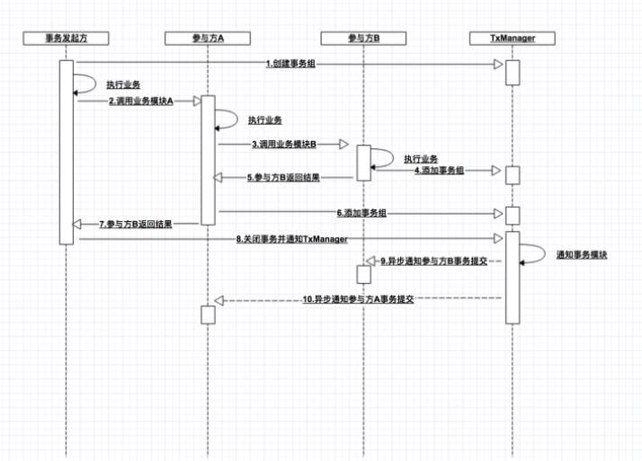
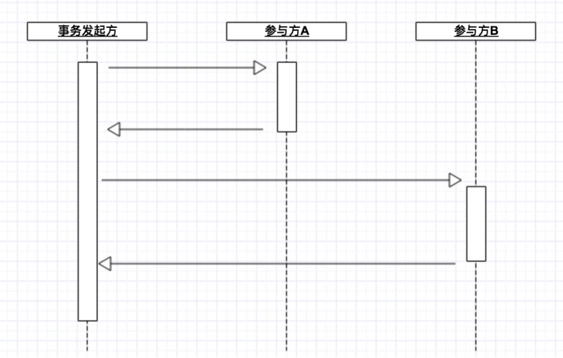
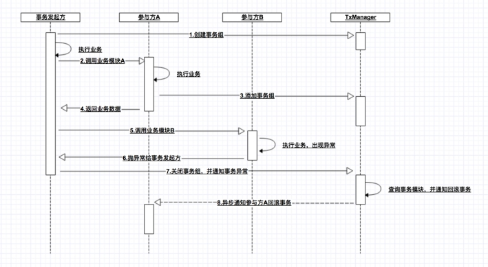
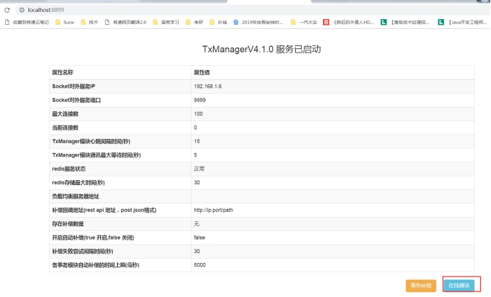
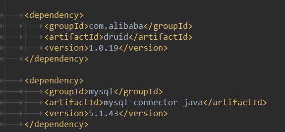

# 分布式事务 第二天

[TOC]


## 1.1学习目标

目标1  fescar+dubbo实现分布式事务

目标2  RocketMQ事务消息

目标3  TX-LCN分布式事务框架

# 第二章 fescar分布式事务实现

##### 2.1 fescar介绍

FESCAR（Fast & Easy Commit And Rollback） 是一个用于微服务架构的分布式事务解决方案，它的特点是高性能且易于使用，旨在实现简单并快速的事务提交与回滚，由阿里开源。 


TM：全局事务管理器，在标注开启fescar分布式事务的服务端开启，并将全局事务发送到TC事务控制端管理

TC：事务控制中心，控制全局事务的提交或者回滚。这个组件需要独立部署维护，目前只支持单机版本，后续迭代计划会有集群版本

RM：资源管理器，主要负责分支事务的上报，本地事务的管理

##### 2.3 fescar核心步骤


一段话简述其实现过程：服务起始方发起全局事务并注册到TC。在调用协同服务时，协同服务的事务分支事务会先完成阶段一的事务提交或回滚，并生成事务回滚的undo_log日志，同时注册当前协同服务到TC并上报其事务状态，归并到同一个业务的全局事务中。此时若没有问题继续下一个协同服务的调用，期间任何协同服务的分支事务回滚，都会通知到TC，TC在通知全局事务包含的所有已完成一阶段提交的分支事务回滚。如果所有分支事务都正常，最后回到全局事务发起方时，也会通知到TC，TC在通知全局事务包含的所有分支删除回滚日志。在这个过程中为了解决写隔离和度隔离的问题会涉及到TC管理的全局锁。


##### 2.2 分布式事务案例说明


如上图，我们创建多个服务，分别为订单服务，账号服务，和库存服务，以用户下单为例，用户下单在Order服务中实现，账号扣款在Account服务中实现，库存减少，在Item服务中实现，每个服务操作的数据库不一致，使用fescar实现跨服务之间事务管理。


##### 2.3 建库操作

我们这里一共分为3个数据库，分别是fescar-order、fescar-item、fescar-account，每个数据库中分别有2张表。


**fescar-item：**


SQL语句如下：

```sql
/*
Navicat MySQL Data Transfer

Source Server         : 127.0.0.1
Source Server Version : 50719
Source Host           : 127.0.0.1:3306
Source Database       : fescar-item

Target Server Type    : MYSQL
Target Server Version : 50719
File Encoding         : 65001

Date: 2019-03-25 19:36:25
*/

SET FOREIGN_KEY_CHECKS=0;

-- ----------------------------
-- Table structure for `item`
-- ----------------------------
DROP TABLE IF EXISTS `item`;
CREATE TABLE `item` (
  `id` int(11) NOT NULL AUTO_INCREMENT,
  `title` varchar(100) DEFAULT NULL,
  `price` bigint(20) NOT NULL,
  `num` int(11) DEFAULT NULL,
  PRIMARY KEY (`id`)
) ENGINE=InnoDB AUTO_INCREMENT=2 DEFAULT CHARSET=utf8;

-- ----------------------------
-- Records of item
-- ----------------------------
INSERT INTO `item` VALUES ('1', '华为荣耀4', '100', '100');

-- ----------------------------
-- Table structure for `undo_log`
-- ----------------------------
DROP TABLE IF EXISTS `undo_log`;
CREATE TABLE `undo_log` (
  `id` bigint(20) NOT NULL AUTO_INCREMENT,
  `branch_id` bigint(20) NOT NULL,
  `xid` varchar(100) NOT NULL,
  `rollback_info` longblob NOT NULL,
  `log_status` int(11) NOT NULL,
  `log_created` datetime NOT NULL,
  `log_modified` datetime NOT NULL,
  `ext` varchar(100) DEFAULT NULL,
  PRIMARY KEY (`id`),
  KEY `idx_unionkey` (`xid`,`branch_id`)
) ENGINE=InnoDB AUTO_INCREMENT=6 DEFAULT CHARSET=utf8;

-- ----------------------------
-- Records of undo_log
-- ----------------------------
```


**fescar-account**


SQL语句如下：

```sql
/*
Navicat MySQL Data Transfer

Source Server         : 127.0.0.1
Source Server Version : 50719
Source Host           : 127.0.0.1:3306
Source Database       : fescar-account

Target Server Type    : MYSQL
Target Server Version : 50719
File Encoding         : 65001

Date: 2019-03-25 19:39:32
*/

SET FOREIGN_KEY_CHECKS=0;

-- ----------------------------
-- Table structure for `account`
-- ----------------------------
DROP TABLE IF EXISTS `account`;
CREATE TABLE `account` (
  `usernumber` varchar(20) NOT NULL,
  `money` bigint(20) NOT NULL,
  `username` varchar(20) DEFAULT NULL,
  PRIMARY KEY (`usernumber`)
) ENGINE=InnoDB DEFAULT CHARSET=utf8;

-- ----------------------------
-- Records of account
-- ----------------------------
INSERT INTO `account` VALUES ('itheima', '1000', '王五');

-- ----------------------------
-- Table structure for `undo_log`
-- ----------------------------
DROP TABLE IF EXISTS `undo_log`;
CREATE TABLE `undo_log` (
  `id` bigint(20) NOT NULL AUTO_INCREMENT,
  `branch_id` bigint(20) NOT NULL,
  `xid` varchar(100) NOT NULL,
  `rollback_info` longblob NOT NULL,
  `log_status` int(11) NOT NULL,
  `log_created` datetime NOT NULL,
  `log_modified` datetime NOT NULL,
  `ext` varchar(100) DEFAULT NULL,
  PRIMARY KEY (`id`),
  KEY `idx_unionkey` (`xid`,`branch_id`)
) ENGINE=InnoDB AUTO_INCREMENT=6 DEFAULT CHARSET=utf8;

-- ----------------------------
-- Records of undo_log
-- ----------------------------
```


**fescar-order**


SQL语句如下：

```sql
/*
Navicat MySQL Data Transfer

Source Server         : 127.0.0.1
Source Server Version : 50719
Source Host           : 127.0.0.1:3306
Source Database       : fescar-order

Target Server Type    : MYSQL
Target Server Version : 50719
File Encoding         : 65001

Date: 2019-03-25 19:41:29
*/

SET FOREIGN_KEY_CHECKS=0;

-- ----------------------------
-- Table structure for `order_info`
-- ----------------------------
DROP TABLE IF EXISTS `order_info`;
CREATE TABLE `order_info` (
  `id` int(11) NOT NULL AUTO_INCREMENT,
  `money` bigint(20) NOT NULL,
  `createtime` datetime NOT NULL,
  `usernumber` varchar(20) DEFAULT NULL,
  PRIMARY KEY (`id`)
) ENGINE=InnoDB AUTO_INCREMENT=9 DEFAULT CHARSET=utf8;

-- ----------------------------
-- Records of order_info
-- ----------------------------

-- ----------------------------
-- Table structure for `undo_log`
-- ----------------------------
DROP TABLE IF EXISTS `undo_log`;
CREATE TABLE `undo_log` (
  `id` bigint(20) NOT NULL AUTO_INCREMENT,
  `branch_id` bigint(20) NOT NULL,
  `xid` varchar(100) NOT NULL,
  `rollback_info` longblob NOT NULL,
  `log_status` int(11) NOT NULL,
  `log_created` datetime NOT NULL,
  `log_modified` datetime NOT NULL,
  `ext` varchar(100) DEFAULT NULL,
  PRIMARY KEY (`id`),
  KEY `idx_unionkey` (`xid`,`branch_id`)
) ENGINE=InnoDB AUTO_INCREMENT=5 DEFAULT CHARSET=utf8;

-- ----------------------------
-- Records of undo_log
-- ----------------------------
```


##### 2.4 公共工程搭建

我们把父工程、interface和model以及dao公共工程搭建起来，其他工程依赖使用

###### 2.4.1 fescar-transaction

该工程为父工程，主要存放一些公共的依赖。

pom.xml代码如下：

```xml
<?xml version="1.0" encoding="UTF-8"?>
<project xmlns="http://maven.apache.org/POM/4.0.0"
         xmlns:xsi="http://www.w3.org/2001/XMLSchema-instance"
         xsi:schemaLocation="http://maven.apache.org/POM/4.0.0 http://maven.apache.org/xsd/maven-4.0.0.xsd">
    <modelVersion>4.0.0</modelVersion>
    <groupId>com.itheima</groupId>
    <artifactId>fescar-transaction</artifactId>
    <version>1.0-SNAPSHOT</version>
    <packaging>pom</packaging>
    <dependencies>
        <!--mybatis-->
        <dependency>
            <groupId>org.mybatis</groupId>
            <artifactId>mybatis</artifactId>
            <version>3.4.5</version>
        </dependency>

        <!--MyBatis集成Spring-->
        <dependency>
            <groupId>org.mybatis</groupId>
            <artifactId>mybatis-spring</artifactId>
            <version>1.3.1</version>
        </dependency>

        <!--spring依赖-->
        <dependency>
            <groupId>org.springframework</groupId>
            <artifactId>spring-context</artifactId>
            <version>5.0.2.RELEASE</version>
        </dependency>
        <dependency>
            <groupId>org.springframework</groupId>
            <artifactId>spring-jdbc</artifactId>
            <version>5.0.2.RELEASE</version>
        </dependency>
        <!--数据库驱动-->
        <dependency>
            <groupId>mysql</groupId>
            <artifactId>mysql-connector-java</artifactId>
            <version>5.1.31</version>
        </dependency>

        <!--fescar依赖-->
        <dependency>
            <groupId>com.alibaba.fescar</groupId>
            <artifactId>fescar-tm</artifactId>
            <version>0.1.3</version>
        </dependency>
        <dependency>
            <groupId>com.alibaba.fescar</groupId>
            <artifactId>fescar-spring</artifactId>
            <version>0.1.3</version>
        </dependency>
        <dependency>
            <groupId>com.alibaba.fescar</groupId>
            <artifactId>fescar-dubbo</artifactId>
            <version>0.1.3</version>
        </dependency>
        <dependency>
            <groupId>com.101tec</groupId>
            <artifactId>zkclient</artifactId>
            <version>0.10</version>
        </dependency>
        <dependency>
            <groupId>com.alibaba</groupId>
            <artifactId>dubbo-registry-nacos</artifactId>
            <version>0.0.2</version>
        </dependency>
        <dependency>
            <groupId>com.alibaba.spring</groupId>
            <artifactId>spring-context-support</artifactId>
            <version>1.0.2</version>
        </dependency>

        <dependency>
            <groupId>org.apache.curator</groupId>
            <artifactId>curator-recipes</artifactId>
            <version>4.1.0</version>
        </dependency>

        <dependency>
            <groupId>junit</groupId>
            <artifactId>junit</artifactId>
            <scope>test</scope>
            <version>4.12</version>
        </dependency>
    </dependencies>
</project>
```


###### 2.4.2 fescar-model

**Account**

```java
public class Account implements Serializable {
    private String usernumber;
    private Long money;
    private String username;
    
    //...get..set  略
}
```

**Item**

```java
public class Item implements Serializable {
    private Integer id;
    private String title;
    private Long price;
    private Integer num;
    
    //...get..set  略
}
```

**OrderInfo**

```java
public class OrderInfo implements Serializable {
    private Integer id;
    private Long money;
    private Date createtime;
    private String usernumber;
    //...get..set  略
}
```


###### 2.4.3 fescar-interface

搭建工程fescar-interface,存放所有接口,该工程需要依赖model工程

pom.xml代码如下：

```xml
<?xml version="1.0" encoding="UTF-8"?>
<project xmlns="http://maven.apache.org/POM/4.0.0"
         xmlns:xsi="http://www.w3.org/2001/XMLSchema-instance"
         xsi:schemaLocation="http://maven.apache.org/POM/4.0.0 http://maven.apache.org/xsd/maven-4.0.0.xsd">
    <parent>
        <artifactId>fescar-transaction</artifactId>
        <groupId>com.itheima</groupId>
        <version>1.0-SNAPSHOT</version>
    </parent>
    <modelVersion>4.0.0</modelVersion>
    <artifactId>fescar-interface</artifactId>
    <packaging>jar</packaging>
    <!--依赖-->
    <dependencies>
        <dependency>
            <groupId>com.itheima</groupId>
            <artifactId>fescar-model</artifactId>
            <version>1.0-SNAPSHOT</version>
        </dependency>
    </dependencies>
</project>
```


创建对应的接口，代码如下：

**AccountService**

```java
public interface AccountService {

    /***
     * 修改账号余额信息
     * @param account
     * @return
     */
    int update(Account account);
}
```


**ItemService**

```java
public interface ItemService {

    /****
     * 修改库存信息，并调用修改账户余额信息
     * @param item:商品信息
     * @param usernumber：账户信息
     * @return
     */
    int update(Item item,String usernumber);
}
```


**OrderInfoService**

```java
public interface OrderInfoService {

    /***
     * 创建订单信息
     * @param id:商品ID
     * @param count:购买数量
     * @param usernumber:用户会员账号
     * @return
     */
    int add(int id, int count, String usernumber);
}
```


###### 2.4.4 fescar-mapper

dao工程需要依赖model，代码如下：

pom.xml代码如下：

```xml
<?xml version="1.0" encoding="UTF-8"?>
<project xmlns="http://maven.apache.org/POM/4.0.0"
         xmlns:xsi="http://www.w3.org/2001/XMLSchema-instance"
         xsi:schemaLocation="http://maven.apache.org/POM/4.0.0 http://maven.apache.org/xsd/maven-4.0.0.xsd">
    <parent>
        <artifactId>fescar-transaction</artifactId>
        <groupId>com.itheima</groupId>
        <version>1.0-SNAPSHOT</version>
    </parent>
    <modelVersion>4.0.0</modelVersion>
    <artifactId>fescar-mapper</artifactId>
    <packaging>jar</packaging>

    <!--依赖-->
    <dependencies>
        <dependency>
            <groupId>com.itheima</groupId>
            <artifactId>fescar-model</artifactId>
            <version>1.0-SNAPSHOT</version>
        </dependency>
    </dependencies>
</project>
```


**AccountMapper**

```java
public interface AccountMapper {

    /***
     * 修改
     * @param account
     * @return
     */
    @Update("update account set money=money-#{money} where usernumber=#{usernumber}")
    int update(Account account);
}
```


**ItemMapper**

```java
public interface ItemMapper {

    /***
     * 修改商品个数
     * @param item
     * @return
     */
    @Update("update item set num=num-#{num} where id=#{id}")
    int update(Item item);

    /***
     * 根据ID查询Item信息
     * @param id
     * @return
     */
    @Select("select * from item where id=#{id}")
    Item getById(int id);
}
```


**OrderInfoMapper**

```java
public interface OrderInfoMapper {

    /***
     * 添加订单
     * @param orderInfo
     * @return
     */
    @Insert("insert into order_info(money,createtime,usernumber) values(#{money},#{createtime},#{usernumber})")
    int add(OrderInfo orderInfo);
}
```


**config/jdbc.properties**

```properties
#account
driverClassName_account=com.mysql.jdbc.Driver
url_account=jdbc:mysql://192.168.211.1:3306/fescar-account?useUnicode=true&characterEncoding=utf8&autoReconnect=true
username_account=root
password_account=123456

#item
driverClassName_item=com.mysql.jdbc.Driver
url_item=jdbc:mysql://192.168.211.1:3306/fescar-item?useUnicode=true&characterEncoding=utf8&autoReconnect=true
username_item=root
password_item=123456

#order
driverClassName_order=com.mysql.jdbc.Driver
url_order=jdbc:mysql://192.168.211.1:3306/fescar-order?useUnicode=true&characterEncoding=utf8&autoReconnect=true
username_order=root
password_order=123456
```


##### 2.5 业务层搭建

###### 2.5.1 fescar-account-service

该工程搭建dubbo服务，实现账号余额修改操作。

pom.xml代码如下：

```xml
<?xml version="1.0" encoding="UTF-8"?>
<project xmlns="http://maven.apache.org/POM/4.0.0"
         xmlns:xsi="http://www.w3.org/2001/XMLSchema-instance"
         xsi:schemaLocation="http://maven.apache.org/POM/4.0.0 http://maven.apache.org/xsd/maven-4.0.0.xsd">
    <parent>
        <artifactId>fescar-transaction</artifactId>
        <groupId>com.itheima</groupId>
        <version>1.0-SNAPSHOT</version>
    </parent>
    <modelVersion>4.0.0</modelVersion>
    <artifactId>fescar-account-service</artifactId>
    <packaging>jar</packaging>

    <!--依赖-->
    <dependencies>
        <dependency>
            <groupId>com.itheima</groupId>
            <artifactId>fescar-mapper</artifactId>
            <version>1.0-SNAPSHOT</version>
        </dependency>
        <dependency>
            <groupId>com.itheima</groupId>
            <artifactId>fescar-interface</artifactId>
            <version>1.0-SNAPSHOT</version>
        </dependency>
    </dependencies>
</project>
```


**AccountServiceImpl**

```java
@Service
public class AccountServiceImpl implements AccountService {

    @Autowired
    private AccountMapper accountMapper;

    /***
     * 修改账号信息
     * @param account
     * @return
     */
    @Override
    public int update(Account account){
        int acount = accountMapper.update(account);
        System.out.println("账号扣款受影响行数："+acount);
        return acount;
    }
}
```


**spring/spring-dubbo.xml**

```xml
<?xml version="1.0" encoding="UTF-8"?>
<beans xmlns="http://www.springframework.org/schema/beans"
       xmlns:xsi="http://www.w3.org/2001/XMLSchema-instance"
       xmlns:dubbo="http://dubbo.apache.org/schema/dubbo"
       xsi:schemaLocation="http://www.springframework.org/schema/beans
       http://www.springframework.org/schema/beans/spring-beans.xsd
       http://dubbo.apache.org/schema/dubbo
       http://dubbo.apache.org/schema/dubbo/dubbo.xsd">
    <!--注册dubbo服务名字-->
    <dubbo:application name="fescar-account" />
    <!--注册中心-->
    <dubbo:registry address="zookeeper://192.168.211.128:2181" />
    <!--提供服务端口-->
    <dubbo:protocol name="dubbo" port="20881" />
    <dubbo:annotation package="com.itheima" />

    <!--注入全局事务管理器-->
    <bean class="com.alibaba.fescar.spring.annotation.GlobalTransactionScanner">
        <constructor-arg value="fescar-account"/>
        <constructor-arg value="my_test_tx_group"/>
    </bean>

    <!--代理数据源-->
    <bean id="dataSourceProxy" class="com.alibaba.fescar.rm.datasource.DataSourceProxy">
        <constructor-arg ref="dataSource" />
    </bean>

    <!--引入spring-mybatis.xml-->
    <import resource="spring-mybatis.xml" />
</beans>
```


**spring/spring-mybatis.xml**

```xml
<?xml version="1.0" encoding="UTF-8"?>
<beans xmlns="http://www.springframework.org/schema/beans"
       xmlns:xsi="http://www.w3.org/2001/XMLSchema-instance"
       xmlns:p="http://www.springframework.org/schema/p"
       xmlns:context="http://www.springframework.org/schema/context"
       xsi:schemaLocation="
        http://www.springframework.org/schema/beans
        http://www.springframework.org/schema/beans/spring-beans.xsd
        http://www.springframework.org/schema/context
        http://www.springframework.org/schema/context/spring-context.xsd">

    <!--解析配置文件-->
    <context:property-placeholder location="classpath:config/jdbc.properties" />

    <!-- 数据库连接池 -->
    <bean id="dataSource" class="com.alibaba.druid.pool.DruidDataSource" destroy-method="close">
        <property name="driverClassName" value="${driverClassName_account}" />
        <property name="url" value="${url_account}" />
        <property name="username" value="${username_account}" />
        <property name="password" value="${password_account}" />
    </bean>

    <!-- SqlSessionFactoryBean -->
    <bean id="sqlSessionFactoryBean" class="org.mybatis.spring.SqlSessionFactoryBean">
        <property name="dataSource" ref="dataSourceProxy" />
    </bean>

    <!--
        配置接口扫描包
        如果是单数据源，则可以不配置sqlSessionFactoryBeanName
    -->
    <bean class="org.mybatis.spring.mapper.MapperScannerConfigurer"
          p:basePackage="com.itheima.mapper"
          p:sqlSessionFactoryBeanName="sqlSessionFactoryBean" />
</beans>
```


**application.conf**

```properties
transport {
  # tcp udt unix-domain-socket
  type = "TCP"
  #NIO NATIVE
  server = "NIO"
  #enable heartbeat
  heartbeat = true
  #thread factory for netty
  thread-factory {
    boss-thread-prefix = "NettyBoss"
    worker-thread-prefix = "NettyServerNIOWorker"
    server-executor-thread-prefix = "NettyServerBizHandler"
    share-boss-worker = false
    client-selector-thread-prefix = "NettyClientSelector"
    client-selector-thread-size = 1
    client-worker-thread-prefix = "NettyClientWorkerThread"
    # netty boss thread size,will not be used for UDT
    boss-thread-size = 1
    #auto default pin or 8
    worker-thread-size = 8
  }
}
service {
  #vgroup->rgroup
  vgroup_mapping.my_test_tx_group = "localRgroup"
  #only support single node
  localRgroup.grouplist = "127.0.0.1:8091"
  #degrade current not support
  enableDegrade = false
  #disable
  disable = false
}
```


**测试**

```java
public class ServiceAccountTest {
    /***
     * 服务启动测试
     * @param args
     */
    public static void main(String[] args) throws IOException {
        ApplicationContext act = new ClassPathXmlApplicationContext("spring/spring-dubbo.xml");
        System.in.read();
    }
}
```


###### 2.5.2 fescar-item-service

该工程搭建dubbo服务，实现商品数量修改操作以及调用fescar-account服务实现账号余额修改。

pom.xml代码如下：

```xml
<?xml version="1.0" encoding="UTF-8"?>
<project xmlns="http://maven.apache.org/POM/4.0.0"
         xmlns:xsi="http://www.w3.org/2001/XMLSchema-instance"
         xsi:schemaLocation="http://maven.apache.org/POM/4.0.0 http://maven.apache.org/xsd/maven-4.0.0.xsd">
    <parent>
        <artifactId>fescar-transaction</artifactId>
        <groupId>com.itheima</groupId>
        <version>1.0-SNAPSHOT</version>
    </parent>
    <modelVersion>4.0.0</modelVersion>
    <artifactId>fescar-item-service</artifactId>
    <packaging>jar</packaging>

    <!--依赖-->
    <dependencies>
        <dependency>
            <groupId>com.itheima</groupId>
            <artifactId>fescar-mapper</artifactId>
            <version>1.0-SNAPSHOT</version>
        </dependency>
        <dependency>
            <groupId>com.itheima</groupId>
            <artifactId>fescar-interface</artifactId>
            <version>1.0-SNAPSHOT</version>
        </dependency>
    </dependencies>
</project>
```


**ItemServiceImpl**

```java
@Service
public class ItemServiceImpl implements ItemService {

    @Autowired
    private ItemMapper itemMapper;

    /***
     * 远程服务
     */
    @Reference(check = false)
    private AccountService accountService;

    /***
     * 修改商品个数
     * @param item：购买商品信息
     * @param  usernumber:用户账号
     * @return
     */
    @Override
    public int update(Item item,String usernumber){
        //调用远程服务修改账号金额信息
        Account account = new Account(usernumber,item.getPrice());
        int update = accountService.update(account);

        //修改商品库存
        int mcount = itemMapper.update(item);
        System.out.println("修改商品个数受影响行数："+mcount);
        return  mcount;
    }
}
```


**spring/spring-dubbo.xml**

```xml
<?xml version="1.0" encoding="UTF-8"?>
<beans xmlns="http://www.springframework.org/schema/beans"
       xmlns:xsi="http://www.w3.org/2001/XMLSchema-instance"
       xmlns:dubbo="http://dubbo.apache.org/schema/dubbo"
       xsi:schemaLocation="http://www.springframework.org/schema/beans
       http://www.springframework.org/schema/beans/spring-beans.xsd
       http://dubbo.apache.org/schema/dubbo
       http://dubbo.apache.org/schema/dubbo/dubbo.xsd">
    <!--注册dubbo服务名字-->
    <dubbo:application name="fescar-item" />
    <!--注册中心-->
    <dubbo:registry address="zookeeper://192.168.211.128:2181" />
    <!--提供服务端口-->
    <dubbo:protocol name="dubbo" port="20882" />
    <dubbo:annotation package="com.itheima" />

    <!--注入全局事务管理器-->
    <bean class="com.alibaba.fescar.spring.annotation.GlobalTransactionScanner">
        <constructor-arg value="fescar-item"/>
        <constructor-arg value="my_test_tx_group"/>
    </bean>

    <!--代理数据源-->
    <bean id="dataSourceProxy" class="com.alibaba.fescar.rm.datasource.DataSourceProxy">
        <constructor-arg ref="dataSource" />
    </bean>

    <!--引入spring-mybatis.xml-->
    <import resource="spring-mybatis.xml" />
</beans>
```

**spring/spring-mybatis.xml**

```xml
<?xml version="1.0" encoding="UTF-8"?>
<beans xmlns="http://www.springframework.org/schema/beans"
       xmlns:xsi="http://www.w3.org/2001/XMLSchema-instance"
       xmlns:p="http://www.springframework.org/schema/p"
       xmlns:context="http://www.springframework.org/schema/context"
       xsi:schemaLocation="
        http://www.springframework.org/schema/beans
        http://www.springframework.org/schema/beans/spring-beans.xsd
        http://www.springframework.org/schema/context
        http://www.springframework.org/schema/context/spring-context.xsd">

    <!--解析配置文件-->
    <context:property-placeholder location="classpath:config/jdbc.properties" />

    <!-- 数据库连接池 -->
    <bean id="dataSource" class="com.alibaba.druid.pool.DruidDataSource" destroy-method="close">
        <property name="driverClassName" value="${driverClassName_item}" />
        <property name="url" value="${url_item}" />
        <property name="username" value="${username_item}" />
        <property name="password" value="${password_item}" />
    </bean>

    <!-- SqlSessionFactoryBean -->
    <bean id="sqlSessionFactoryBean" class="org.mybatis.spring.SqlSessionFactoryBean">
        <property name="dataSource" ref="dataSourceProxy" />
    </bean>

    <!--
        配置接口扫描包
        如果是单数据源，则可以不配置sqlSessionFactoryBeanName
    -->
    <bean class="org.mybatis.spring.mapper.MapperScannerConfigurer"
          p:basePackage="com.itheima.mapper"
          p:sqlSessionFactoryBeanName="sqlSessionFactoryBean" />
</beans>
```

**application.conf**

```properties
transport {
  # tcp udt unix-domain-socket
  type = "TCP"
  #NIO NATIVE
  server = "NIO"
  #enable heartbeat
  heartbeat = true
  #thread factory for netty
  thread-factory {
    boss-thread-prefix = "NettyBoss"
    worker-thread-prefix = "NettyServerNIOWorker"
    server-executor-thread-prefix = "NettyServerBizHandler"
    share-boss-worker = false
    client-selector-thread-prefix = "NettyClientSelector"
    client-selector-thread-size = 1
    client-worker-thread-prefix = "NettyClientWorkerThread"
    # netty boss thread size,will not be used for UDT
    boss-thread-size = 1
    #auto default pin or 8
    worker-thread-size = 8
  }
}
service {
  #vgroup->rgroup
  vgroup_mapping.my_test_tx_group = "localRgroup"
  #only support single node
  localRgroup.grouplist = "127.0.0.1:8091"
  #degrade current not support
  enableDegrade = false
  #disable
  disable = false
}
```


**测试**

```java
public class ServiceItemTest {
    /***
     * 服务启动测试
     * @param args
     */
    public static void main(String[] args) throws IOException {
        ApplicationContext act = new ClassPathXmlApplicationContext("spring/spring-dubbo.xml");
        System.in.read();
    }
}
```


###### 2.5.3 fescar-orderinfo-service

该工程搭建dubbo服务，实现用户购买商品创建订单操作，同时远程调用修改库存服务。

pom.xml代码如下：

```xml
<?xml version="1.0" encoding="UTF-8"?>
<project xmlns="http://maven.apache.org/POM/4.0.0"
         xmlns:xsi="http://www.w3.org/2001/XMLSchema-instance"
         xsi:schemaLocation="http://maven.apache.org/POM/4.0.0 http://maven.apache.org/xsd/maven-4.0.0.xsd">
    <parent>
        <artifactId>fescar-transaction</artifactId>
        <groupId>com.itheima</groupId>
        <version>1.0-SNAPSHOT</version>
    </parent>
    <modelVersion>4.0.0</modelVersion>
    <artifactId>fescar-orderinfo-service</artifactId>
    <packaging>jar</packaging>

    <!--依赖-->
    <dependencies>
        <dependency>
            <groupId>com.itheima</groupId>
            <artifactId>fescar-mapper</artifactId>
            <version>1.0-SNAPSHOT</version>
        </dependency>
        <dependency>
            <groupId>com.itheima</groupId>
            <artifactId>fescar-interface</artifactId>
            <version>1.0-SNAPSHOT</version>
        </dependency>
    </dependencies>
</project>
```


**OrderInfoServiceImpl**

```java
@Service
public class OrderInfoServiceImpl implements OrderInfoService{

    @Autowired
    private OrderInfoMapper orderInfoMapper;

    //修改商品库存远程服务
    @Reference(check = false)
    private ItemService itemService;

    /***
     * 创建订单
     * @param id:商品ID
     * @param count：购买数量
     * @param usernumber：购买用户
     * @return
     */
    @Override
    @GlobalTransactional(timeoutMills = 300000, name = "itheima-dubbo-tx")
    public int add(int id, int count, String usernumber){
        //查询Item信息
        Item item = new Item(1,"华为荣耀4",100L,10);

        //创建订单
        OrderInfo orderInfo = new OrderInfo(count*item.getPrice(),new Date(),usernumber);
        int acount = orderInfoMapper.add(orderInfo);
        System.out.println("创建订单受影响行数："+acount);
        //修改库存和账号余额
        item.setNum(count);
        int mcount = itemService.update(item,usernumber);

        //制造异常，测试跨服务分布式事务
        int q=10/0;
        return mcount;
    }
}
```


**spring/spring-dubbo.xml**

```xml
<?xml version="1.0" encoding="UTF-8"?>
<beans xmlns="http://www.springframework.org/schema/beans"
       xmlns:xsi="http://www.w3.org/2001/XMLSchema-instance"
       xmlns:dubbo="http://dubbo.apache.org/schema/dubbo"
       xsi:schemaLocation="http://www.springframework.org/schema/beans
       http://www.springframework.org/schema/beans/spring-beans.xsd
       http://dubbo.apache.org/schema/dubbo
       http://dubbo.apache.org/schema/dubbo/dubbo.xsd">
    <!--注册dubbo服务名字-->
    <dubbo:application name="fescar-orderinfo" />
    <!--注册中心-->
    <dubbo:registry address="zookeeper://192.168.211.128:2181" />
    <!--提供服务端口-->
    <dubbo:protocol name="dubbo" port="20883" />
    <dubbo:annotation package="com.itheima" />

    <!--注入全局事务管理器-->
    <bean class="com.alibaba.fescar.spring.annotation.GlobalTransactionScanner">
        <constructor-arg value="fescar-orderinfo"/>
        <constructor-arg value="my_test_tx_group"/>
    </bean>

    <!--代理数据源-->
    <bean id="dataSourceProxy" class="com.alibaba.fescar.rm.datasource.DataSourceProxy">
        <constructor-arg ref="dataSource" />
    </bean>

    <!--引入spring-mybatis.xml-->
    <import resource="spring-mybatis.xml" />
</beans>
```


**spring/spring-mybatis.xml**

```xml
<?xml version="1.0" encoding="UTF-8"?>
<beans xmlns="http://www.springframework.org/schema/beans"
       xmlns:xsi="http://www.w3.org/2001/XMLSchema-instance"
       xmlns:p="http://www.springframework.org/schema/p"
       xmlns:context="http://www.springframework.org/schema/context"
       xsi:schemaLocation="
        http://www.springframework.org/schema/beans
        http://www.springframework.org/schema/beans/spring-beans.xsd
        http://www.springframework.org/schema/context
        http://www.springframework.org/schema/context/spring-context.xsd">

    <!--解析配置文件-->
    <context:property-placeholder location="classpath:config/jdbc.properties" />

    <!-- 数据库连接池 -->
    <bean id="dataSource" class="com.alibaba.druid.pool.DruidDataSource" destroy-method="close">
        <property name="driverClassName" value="${driverClassName_order}" />
        <property name="url" value="${url_order}" />
        <property name="username" value="${username_order}" />
        <property name="password" value="${password_order}" />
    </bean>

    <!-- SqlSessionFactoryBean -->
    <bean id="sqlSessionFactoryBean" class="org.mybatis.spring.SqlSessionFactoryBean">
        <property name="dataSource" ref="dataSourceProxy" />
    </bean>

    <!--
        配置接口扫描包
        如果是单数据源，则可以不配置sqlSessionFactoryBeanName
    -->
    <bean class="org.mybatis.spring.mapper.MapperScannerConfigurer"
          p:basePackage="com.itheima.mapper"
          p:sqlSessionFactoryBeanName="sqlSessionFactoryBean" />
</beans>
```


**application.conf**

```properties
transport {
  # tcp udt unix-domain-socket
  type = "TCP"
  #NIO NATIVE
  server = "NIO"
  #enable heartbeat
  heartbeat = true
  #thread factory for netty
  thread-factory {
    boss-thread-prefix = "NettyBoss"
    worker-thread-prefix = "NettyServerNIOWorker"
    server-executor-thread-prefix = "NettyServerBizHandler"
    share-boss-worker = false
    client-selector-thread-prefix = "NettyClientSelector"
    client-selector-thread-size = 1
    client-worker-thread-prefix = "NettyClientWorkerThread"
    # netty boss thread size,will not be used for UDT
    boss-thread-size = 1
    #auto default pin or 8
    worker-thread-size = 8
  }
}
service {
  #vgroup->rgroup
  vgroup_mapping.my_test_tx_group = "localRgroup"
  #only support single node
  localRgroup.grouplist = "127.0.0.1:8091"
  #degrade current not support
  enableDegrade = false
  #disable
  disable = false
}
```


**测试**

```java
public class ServiceOrderTest {

    /***
     * 服务启动测试
     * @param args
     */
    public static void main(String[] args) throws IOException {
        ApplicationContext act = new ClassPathXmlApplicationContext("spring/spring-dubbo.xml");

        //获取订单实例对象
        OrderInfoService orderInfoService = act.getBean(OrderInfoService.class);
        orderInfoService.add(1, 5, "itheima");

        System.out.println("==========执行完毕==========");
    }
}
```


# 第三章 RocketMQ事务消息

在RocketMQ4.3.0版本后，开放了事务消息这一特性，对于分布式事务而言，最常说的还是二阶段提交协议。 


##### 3.1 RocketMQ事务消息流程

RocketMQ的事务消息，主要是通过消息的异步处理，可以保证本地事务和消息发送同时成功执行或失败，从而保证数据的最终一致性，这里我们先看看一条事务消息从诞生到结束的整个时间线流程： 


```properties
事务消息的成功投递是需要经历三个Topic的，分别是：
	Half Topic：用于记录所有的prepare消息
	Op Half Topic：记录已经提交了状态的prepare消息
	Real Topic：事务消息真正的Topic,在Commit后会才会将消息写入该Topic，从而进行消息的投递
```


##### 3.2 事务消息生产者

我们创建一个事务消息生产者TransactionProducer,事务消息发送消息对象是TransactionMQProducer，为了实现本地事务操作和回查，我们需要创建一个监听器，监听器需要实现TransactionListener接口，实现代码如下：

监听器TransactionListenerImpl，代码如下：


上图代码如下

```java
public class TransactionListenerImpl implements TransactionListener {

    //存储当前线程对应的事务状态
    private ConcurrentHashMap<String, Integer> localTrans = new ConcurrentHashMap<>();

    /***
     * 发送prepare消息成功后回调该方法用于执行本地事务
     * @param msg:回传的消息，利用transactionId即可获取到该消息的唯一Id
     * @param arg:调用send方法时传递的参数，当send时候若有额外的参数可以传递到send方法中，这里能获取到
     * @return
     */
    @Override
    public LocalTransactionState executeLocalTransaction(Message msg, Object arg) {
        //获取线程ID
        String transactionId = msg.getTransactionId();
        //初始状态为0
        localTrans.put(transactionId,0);

        try {
            //此处执行本地事务操作
            System.out.println("....执行本地事务");
            Thread.sleep(70000);
            System.out.println("....执行完成本地事务");
        } catch (InterruptedException e) {
            e.printStackTrace();
            //发生异常，则回滚消息
            localTrans.put(transactionId,2);
            return LocalTransactionState.UNKNOW;
        }

        //修改状态
        localTrans.put(transactionId,1);
        System.out.println("executeLocalTransaction------状态为1");
        //本地事务操作如果成功了，则提交该消息，让该消息可见
        return LocalTransactionState.UNKNOW;
    }

    /***
     * 消息回查
     * @param msg
     * @return
     */
    @Override
    public LocalTransactionState checkLocalTransaction(MessageExt msg) {
        //获取事务id
        String transactionId = msg.getTransactionId();

        //通过事务id获取对应的本地事务执行状态
        Integer status = localTrans.get(transactionId);
        System.out.println("消息回查-----"+status);
        switch (status){
            case 0:
                return LocalTransactionState.UNKNOW;
            case 1:
                return LocalTransactionState.COMMIT_MESSAGE;
            case 2:
                return LocalTransactionState.ROLLBACK_MESSAGE;
        }
        return LocalTransactionState.UNKNOW;
    }
}
```


创建消息发送对象TransactionProducer,代码如下： 


上图代码如下：

```java
public class TransactionProducer {

    //nameserver地址
    private static String namesrvaddress="192.168.211.143:9876;";

    public static void main(String[] args) throws MQClientException, UnsupportedEncodingException, InterruptedException {
        //创建事务消息发送对象
        TransactionMQProducer producer = new TransactionMQProducer("transaction_producer_group_name");
        //设置namesrv地址
        producer.setNamesrvAddr(namesrvaddress);
        //创建监听器
        TransactionListener transactionListener = new TransactionListenerImpl();
        //创建线程池
        ExecutorService executorService = new ThreadPoolExecutor(
                2,
                5,
                100,
                TimeUnit.SECONDS,
                new ArrayBlockingQueue<Runnable>(
                        2000),
                        new ThreadFactory() {
                            @Override
                            public Thread newThread(Runnable runnable) {
                                Thread thread = new Thread(runnable);
                                thread.setName("client-transaction-msg-check-thread");
                                return thread;
                            }
                        }
                );

        //设置线程池
        producer.setExecutorService(executorService);
        //设置监听器
        producer.setTransactionListener(transactionListener);
        //启动producer
        producer.start();

        //创建消息
        Message message = new Message(
                "TopicTxt_Demo",
                "TagTx",
                "KeyTx1",
                "hello".getBytes(RemotingHelper.DEFAULT_CHARSET));

        //发送事务消息,此时消息不可见
        TransactionSendResult transactionSendResult = producer.sendMessageInTransaction(message, "发送消息，回传所需数据！");
        System.out.println(transactionSendResult);


        //休眠
        Thread.sleep(120000);
        //关闭
        producer.shutdown();
    }
}
```


小知识：上述用到了线程池，相关参数如下：

| 序号 | 名称            | 类型                     | 含义             |
| ---- | --------------- | ------------------------ | ---------------- |
| 1    | corePoolSize    | int                      | 核心线程池大小   |
| 2    | maximumPoolSize | int                      | 最大线程池大小   |
| 3    | keepAliveTime   | long                     | 线程最大空闲时间 |
| 4    | unit            | TimeUnit                 | 时间单位         |
| 5    | workQueue       | BlockingQueue<Runnable>  | 线程等待队列     |
| 6    | threadFactory   | ThreadFactory            | 线程创建工厂     |
| 7    | handler         | RejectedExecutionHandler | 拒绝策略         |


##### 3.3 事务消息消费

事务消息的消费者和普通消费者一样，这里我们就不做介绍了，直接贴代码： 

```java
public class TransactionConsumer {

    //nameserver地址
    private static String namesrvaddress="192.168.211.143:9876;";


    public static void main(String[] args) throws MQClientException {
        //创建DefaultMQPushConsumer
        DefaultMQPushConsumer consumer = new DefaultMQPushConsumer("transaction_consumer_group_name");
        //设置nameserver地址
        consumer.setNamesrvAddr(namesrvaddress);
        //设置每次拉去的消息个数
        consumer.setConsumeMessageBatchMaxSize(5);
        //设置消费顺序
        consumer.setConsumeFromWhere(ConsumeFromWhere.CONSUME_FROM_FIRST_OFFSET);
        //设置监听的消息
        consumer.subscribe("TopicTxt_Demo","TagTx");
        //消息监听
        consumer.registerMessageListener(new MessageListenerConcurrently() {
            @Override
            public ConsumeConcurrentlyStatus consumeMessage(List<MessageExt> msgs, ConsumeConcurrentlyContext context) {
                try {
                    for (MessageExt msg : msgs) {
                        String topic = msg.getTopic();
                        String tags = msg.getTags();
                        String keys = msg.getKeys();
                        String body = new String(msg.getBody(), RemotingHelper.DEFAULT_CHARSET);
                        System.out.println("topic:"+topic+",tags:"+tags+",keys:"+keys+",body:"+body);
                    }
                } catch (UnsupportedEncodingException e) {
                    e.printStackTrace();
                }
                return ConsumeConcurrentlyStatus.CONSUME_SUCCESS;
            }
        });
        //启动消费
        consumer.start();
    }
}
```

事务消息参考地址：http://rocketmq.apache.org/docs/transaction-example/ 


##### 3.4 分布式事务实现流程

MQ事务消息解决分布式事务问题，但第三方MQ支持事务消息的中间件不多，比如RocketMQ，他们支持事务消息的方式也是类似于采用的二阶段提交，但是市面上一些主流的MQ都是不支持事务消息的，比如 RabbitMQ 和 Kafka 都不支持。 以阿里的 RocketMQ 中间件为例，其思路大致为： 第一阶段Prepared消息，会拿到消息的地址。 第二阶段执行本地事务，第三阶段通过第一阶段拿到的地址去访问消息，并修改状态。 也就是说在业务方法内要想消息队列提交两次请求，一次发送消息和一次确认消息。如果确认消息发送失败了RocketMQ会定期扫描消息集群中的事务消息，这时候发现了Prepared消息，它会向消息发送者确认，所以生产方需要实现一个check接口，RocketMQ会根据发送端设置的策略来决定是回滚还是继续发送确认消息。这样就保证了消息发送与本地事务同时成功或同时失败。 


# 第四章  Lcn分布式事务框架介绍

 

### **1、****什么是LCN框架**

LCN分布式事务框架v3.0   [https://www.txlcn.org](https://www.txlcn.org/)

### **2、****框架特点**

1) 支持各种基于spring的db框架

2) 兼容SpringCloud、Dubbo

3) 使用简单，低依赖，代码完全开源

4) 基于切面的强一致性事务框架

5) 高可用，模块可以依赖Dubbo或SpringCloud的集群方式做集群化，TxManager也可以做集群化

6) 支持本地事务和分布式事务共存

7) 事务补偿机制，服务故障或挂机再启动时可恢复事务

### **3、****LCN框架原理**

参考网站 

[https://github.com/codingapi/tx-lcn/wiki/LCN%E5%8E%9F%E7%90%86](https://github.com/codingapi/tx-lcn/wiki/LCN原理)

 

1)LCN事务控制原理是由事务模块TxClient下的代理连接池与TxManager的协调配合完成的事务协调控制。

 

2)TxClient的代理连接池实现了javax.sql.DataSource接口，并重写了close方法，事务模块在提交关闭以后TxClient连接池将执行"假关闭"操作，等待TxManager协调完成事务以后在关闭连接。

### **4、****核心步骤**

**创建事务组**是指在事务发起方开始执行业务代码之前先调用TxManager创建事务组对象，然后拿到事务标示GroupId的过程。

**添加事务组**添加事务组是指参与方在执行完业务方法以后，将该模块的事务信息添加通知给TxManager的操作。

**关闭事务组**是指在发起方执行完业务代码以后，将发起方执行结果状态通知给TxManager的动作。当执行完关闭事务组的方法以后，TxManager将根据事务组信息来通知相应的参与模块提交或回滚事务。

 

 

业务场景：

 

 

时序图：

 

 

若参与方B出现异常，那么他们的业务时序图为：

 

若他们的调用关系是这样的情况

 

此时发生参与方B出现异常时他们的时序图为



 

### **5、****SpringCloud整合LCN框架****实战**

### **6、****准备****的****软件****环境**

**1)** **TX-LCN4.0.1、springcloud   版本、spring boot1.5.****4【注意】**

**2)** **Tx-LCN项目案例、tx-manager** **（注意：lcn版本和springboot 及springcloud要匹配）**

**3)** **JRE1.8+, Mysql5.6+, Redis3.2+**

**4) **注册中心（****zk或eureka****）、项目****A、项目B**

 

 

### **7、****测试用例分析：**

 

 

支付项目pay、订单项目order

数据表：paytable、订单表ordertable

用例

伪代码

Public String updatePayAndOrder( payid,iispay,allok ){

Int status=0;

Status=payServer.update();//本地支付成功 实际业务

Status=orderServer.update();//  B其他系统的改变订单状态

error

}

### **8、构建测试用例**

8.1、建立eureka注册中心、并启动

8.2、数据库准备

8.3、创建两个项目，支付端服务pay A、订单系统B

8.4、构建pay项目

​	1) 添加payService接口

​	2) 添加payServiceImp类

​	3) 添加payController类

​	4) 写feign接口

​	5) 调试远程调用

8.5、订单服务order

​	1) 新建一个接口orderService接口

​	2) orderServiceImp实现类

​	3) 建orderController实现类

​	4) 添加事务

​	5) 测试效果

​	6) 启动类添加feign注解

​	7) 远程调用测试

8.6、测试用例1，各自维护自己的事务


 

# 第五章 lcn框架集成实战

 

 

### **4.1、****下载源源码和示例 LCN，查看lcn对应的版本号及启动并运行tx-manager项目，**

(1) 导入idea

(2) 修改redis配置、

 

(3) 服务器端口建议保持不变

 

### **4.2、启动redis** 

./redis-server  redis.conf

./redis-cli -h 127.0.0.1 -p6379

查看是否启动成功 ps -ef | grep redis


### **4.3、启动成功，可以看到tx-manager的客户端假面。**

1) 启动路径：http://localhost:8899

2) 界面

 

## **4.4、发起事务组的项目配置与开发（pay-demo配置）**

### **1)** **从【springcloud-lcn-demo】拷贝到发起方与所有参与方。****【注意版本号】非常重要**

### **2)** **Pom文件引入相应的jar包到*

 


 

### **3)** 到**【springcloud-mybatis-demo1】项目下pom拷贝对应的jar包,有则不用拷贝了**



### **4)** **修改Application.properties文件**


```properties
#txmanager地址
tm.manager.url=http://127.0.0.1:8899/tx/manager/
```


 

### **5)** **启动类中加入自动配置注解并返回dataSource**


```java
@Autowired
private Environment env;

@Bean
public DataSource dataSource() {
   DruidDataSource dataSource = new DruidDataSource();
   dataSource.setUrl(env.getProperty("spring.datasource.url"));
   dataSource.setUsername(env.getProperty("spring.datasource.username"));//用户名
   dataSource.setPassword(env.getProperty("spring.datasource.password"));//密码
   dataSource.setInitialSize(2);
   dataSource.setMaxActive(20);
   dataSource.setMinIdle(0);
   dataSource.setMaxWait(60000);
   dataSource.setValidationQuery("SELECT 1");
   dataSource.setTestOnBorrow(false);
   dataSource.setTestWhileIdle(true);
   dataSource.setPoolPreparedStatements(false);
   return dataSource;
}
```


 

### **6)** **拷贝文件到实现类到现有项目中**

 

### **7)** **业务方法上加上TxTransaction（isStart=true）注解**


 

### **8)** **主要业务代码** 

a. payController代码，加注解	@TxTransaction(isStart = true)  开始分布式事物发起

b. application.yml新增 

c. Txmanager

 

 

## **4.5、**OrderController参与方项目的配置与开发（Order-deamo）

### **1)** **从【springcloud-lcn-demo】拷贝到发起方与所有参与方jar包信息。【注意版本号】**

### **2)** **Pom文件引入相应的jar包**

```xml
<!--引入lcn的jar包到pom文件中来-->
<dependency>
    <groupId>com.codingapi</groupId>
    <artifactId>transaction-springcloud</artifactId>
    <version>${lcn.last.version}</version>
    <exclusions>
        <exclusion>
            <groupId>org.slf4j</groupId>
            <artifactId>*</artifactId>
        </exclusion>
    </exclusions>
</dependency>

<dependency>
    <groupId>com.codingapi</groupId>
    <artifactId>tx-plugins-db</artifactId>
    <version>${lcn.last.version}</version>
    <exclusions>
        <exclusion>
            <groupId>org.slf4j</groupId>
            <artifactId>*</artifactId>
        </exclusion>
    </exclusions>
</dependency>
<!--引入lcn的jar包到pom文件中来    完毕-->
```


 

### **3)** **到【springcloud-mybatis-demo1】项目下pom拷贝对应的jar包,有则不用拷贝了**

### **4)** **修改Application.properties文件**


 

### **5)** **启动类中加入自动配置注解并返回dataSource**

```java
@Autowired
private Environment env;

@Bean
public DataSource dataSource() {
   DruidDataSource dataSource = new DruidDataSource();
   dataSource.setUrl(env.getProperty("spring.datasource.url"));
   dataSource.setUsername(env.getProperty("spring.datasource.username"));//用户名
   dataSource.setPassword(env.getProperty("spring.datasource.password"));//密码
   dataSource.setInitialSize(2);
   dataSource.setMaxActive(20);
   dataSource.setMinIdle(0);
   dataSource.setMaxWait(60000);
   dataSource.setValidationQuery("SELECT 1");
   dataSource.setTestOnBorrow(false);
   dataSource.setTestWhileIdle(true);
   dataSource.setPoolPreparedStatements(false);
   return dataSource;
}
```


 

### **6)** **拷贝文件到实现类所在的目录中**

 

### **7)** **业务方法上加上接口**


### **8)** **主要业务代码** **orderController代码**

### **a.** **application.yml新增** 

### **b.** **Txmanager**

```java
@Service
public class TxManagerHttpRequestServiceImpl implements TxManagerHttpRequestService {

	@Override
	public String httpGet(String url) {
		System.out.println("httpGet-start");
		String res = HttpUtils.get(url);
		System.out.println("httpGet-end");
		return res;
	}

	@Override
	public String httpPost(String url, String params) {
		System.out.println("httpPost-start");
		String res = HttpUtils.post(url, params);
		System.out.println("httpPost-end");
		return res;
	}
}
```


 ```java
@Service
public class TxManagerTxUrlServiceImpl implements TxManagerTxUrlService {

	@Value("${tm.manager.url}")
	private String url;

	@Override
	public String getTxUrl() {
		System.out.println("load tm.manager.url ");
		return url;
	}
}
 ```


 

 

