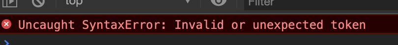
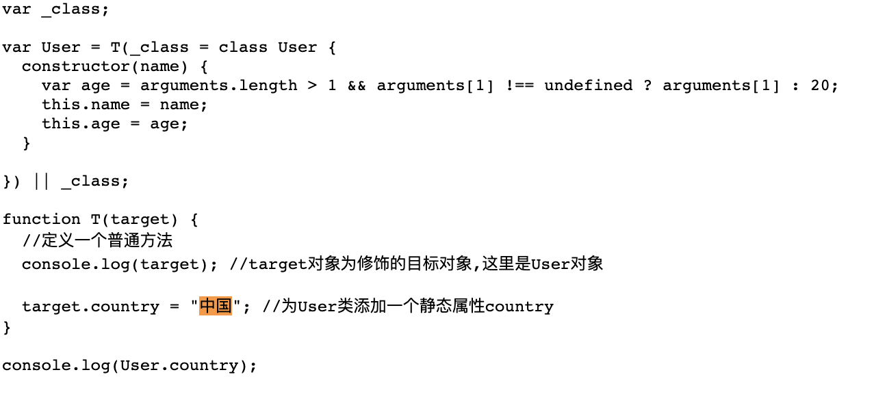
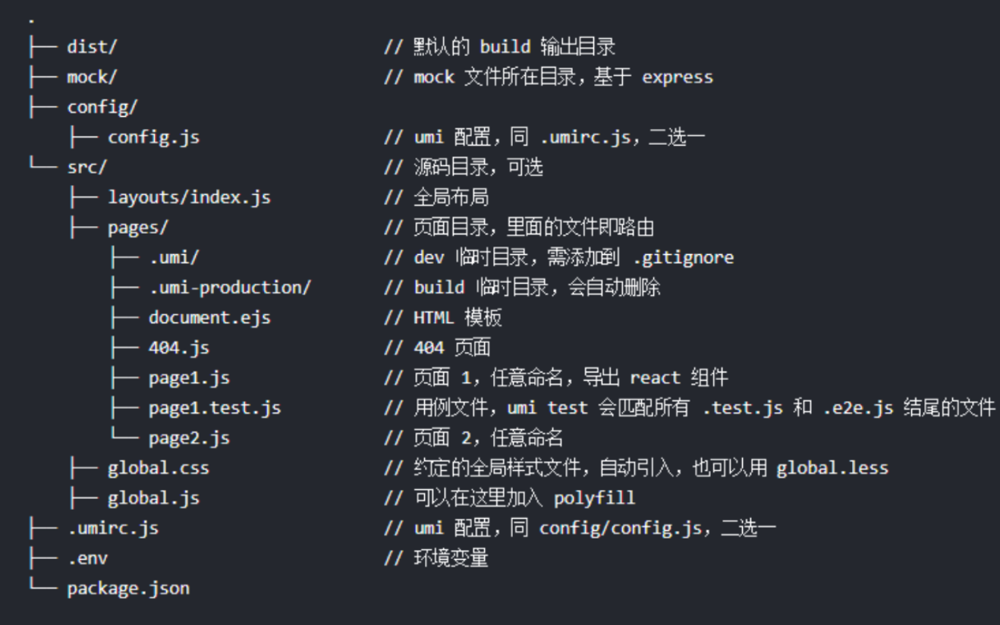
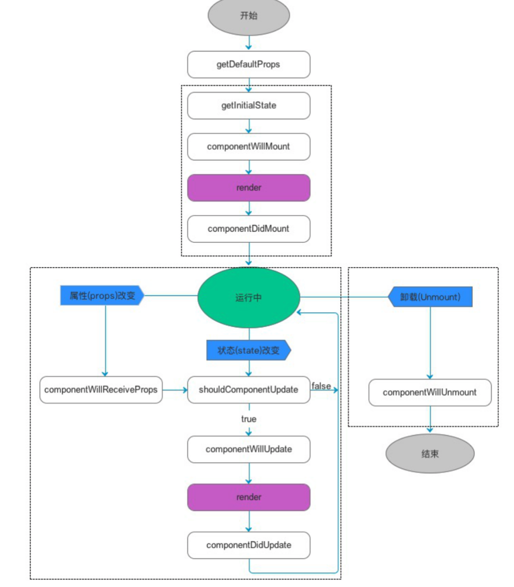

# 01-ES6与ReactJs

# 1.ES6

ES6,是ECMAScript 6 的简称，是JavaScript语言的下一代标准，已于2015年6月正式发布。

## 1.1. let于const

之前，我们在编写js定义变量的时候，只有一个关键字 var。var有一个问题，就是定义的变量会成为全局变量。

~~~js
// var变量的作用域问题检查
for(var i = 0;i<5;i++){
    console.log(i);
}
console.log("循环外:"+i);
~~~

可以看出，在循环外部也可以获取到变量i的值。

1. `let`关键字 ：可以将i的作用域控制在循环内部。

~~~js
//let 所声明的变量,只在let命令所在的代码块内有效.
for(let i = 0;i<5;i++){
    console.log(i);
}
//index.html:21 Uncaught ReferenceError: i is not defined
//console.log("循环外:"+i);
~~~

2. `const`关键字：声明的变量是常量，不能被修改，类似于java中的final关键字。

~~~js
//const 所声明的变量是常量,不能被修改,类似于java中的final关键字
const a = 1;
console.log("a = ",a);
//给a重新赋值;Uncaught TypeError: Assignment to constant variable.
//a = 2;
console.log("a = ",a);
~~~

## 1.2.字符串扩展

ES6中,为字符串扩展了几个新的API

* `includes()`:返回布尔值,标识是否找到了参数字符串

* `startWith()`:返回布尔值,标识参数字符串是否在原字符串的尾部

* `endWith()`:返回布尔值,标识参数字符串是否在原字符串的尾部

~~~js
let str = "hello fechin";
console.log(str,"中是否包含了fechin ==>",str.includes("fechin"));
console.log(str,"中是否包含了fuck ==>",str.includes("fuck"));
~~~

## 1.3.字符串模板

ES6中提供了" ` "来作为字符串模板标记

~~~js
 let str2 = `你好
 哈哈
 呵呵`;
 console.log("试一试",str2);   
 //在``之间的部分都会被认为是字符串的值,可以任意换行;
~~~

## 1.4.解构表达式

ES6中允许按照一定模式从数组和对象中提取值，然后对变量进行赋值，这被称为解构。

1. 数组解构

~~~js
let arr = [1,2,3];
const [x,y,z] = arr; //x,y,z将与arr中的每个位置来对应
console.log(x,y,z);
//结果为[1,2,3]

const a = arr;
console.log("+++++",a);
//结果为[1,2,3]

const [b] = arr;
console.log("-----",b);
//结果为1
~~~

2. 对象解构

~~~js
const person = {
    name : "fechin",
    age : "12",
    language : ["java","js","html"]
}

let {name,age,language} = person;
console.log(name,age,language);
//如果想要用其他变量接收，那么需要额外指定别名
//{name:na}:name是person中的属性名，冒号后面的n是解构后要赋值给的变量
let {name:na,age:ag,language:la} = person;
console.log("+-+-+-+-+-",na,ag,la);
~~~

## 1.5.函数优化

### 1.5.1.函数参数默认值

在ES6之前,我们无法给一个函数参数设置默认值，只能采用变通写法

~~~js
function add(a,b){
    //判断b是否为空，为空就给默认值0
    if(!b){
        b = 0;
    }
    //判断b是否为空，为空就给默认值0
    // b = b || 0;
    return a + b;
}
console.log(add(1));
~~~

ES6之后，可以这么写

~~~js
function add(a,b = 0){
    return a + b;
}
console.log(add(1));
~~~

### 1.5.2.箭头函数

~~~js
//箭头函数
//没有参数
let sayHello = () => console.log("你好");
sayHello();

//一个参数
let print = a => console.log(a);
print("你好呀");

//多个参数
let sum = (a,b) => {return a+b;}
let result = sum(1,2);
console.log(result);
~~~

### 1.5.3.对象函数的属性简写

~~~js
		let person = {
        name : "fechin",
        eat : function(food){
            console.log(this.name+"在吃"+food);
        },
        //箭头函数
        drink : food => {
            //不能从this.name中获取到值,目前只能使用 person.name
            console.log(person.name+"在喝"+food);
        },
        //直接写函数
        sleep(time) {
            console.log(person.name+" just slepp: " + time +" minutes");
        }
    }
    person.eat("象拔蚌");
    person.drink("香蕉油");
    person.sleep("60");

~~~

### 1.5.4.箭头函数结合解构表达式

~~~js
		//传统方式
    function hello(person){
        console.log("hello"+person.name);
    }
    hello(person);

    //解构表达式与箭头函数
    const hello = ({age}) => {
        console.log("++++"+age); //输出为 '++++21'
    }
    hello(person);
~~~

## 1.6.map和reduce

1. `map()`：接收一个函数，将原数组中的所有元素用这个函数处理后返回。

~~~js
				let arr = ['1','20','30'];
        console.log(arr);

        let newArr = arr.map( s => parseInt(s));
        console.log(newArr);
~~~

2. `reduce()`：接收一个函数（必须）和一个初始值（可选），该函数接收两个参数。

   * 第一个参数是上一次reduce处理的结果；
   * 第二个参数是数组中要处理的下一个元素；

   `reduce()`：会从左到右依次把数组中的元素用reduce处理，并把处理的结果作为下次reduce的第一个参数。如果是第一次，会把前两个元素作为计算参数，或者把用户指定的初始值作为起始参数。

~~~js
				const arr = [1,20,-5,3];
        let result = arr.reduce((a,b) => {
            return a + b;
        });
        console.log(result);
        //19

        let result2 = arr.reduce((a,b) => {
            return a + b;
        }, 1);
        console.log(result2);
        //20
~~~

## 1.7.扩展运算符

扩展运算符是三个点`...`，将一个数组转为用逗号分隔的参数序列。

~~~js
				console.log([1,2,3]) //[1,2,3]
        console.log(...[1,2,3]) //1,2,3
        
        let add = (x,y) => {
            return x+y;
        }
        let numbers = [1,2];
        console.log(add(...numbers)); //3

        //...可以用作数组的合并
        let arr = [...[1,2,3],...[4,5,6]];
        console.log(arr); //[1,2,3,4,5,6];

        //与结构表达式结合
        const [first,...rest] = [1,2,3,4,5];
        console.log(first,rest); //1,[2,3,4,5]

				//将字符串转成数组
        console.log([...'hello']);//['h','e','l','l','o']
~~~

## 1.8.Promise

Promise,简单说是一个容器，里面保存着某个未来才会结束的事件（通常是一个异步操作）的结果，从语法上来说Promise是一个对象，从它可以获取异步操作的消息，Promise提供统一的API，各种异步操作都可以用同样的方法进行处理。

我们可以通过Promise的构造函数来创建Promise对象，并在内部封装一个异步执行的结果。

~~~js
				const p = new Promise((resolve,reject) => {
            //编写异步操作,通常写ajax的操作,(模拟)
            setTimeout(()=>{
                let num = Math.random();
                if(num <0.5){
                    //认为成功了
                    resolve("成功了"+num);//调用resolve,代表promise将返回成功的结果
                }else{
                    //认为失败了
                    reject("失败了"+num);//调用reject,代表promise将返回失败的结果
                }
            });
        });

        p.then(value => {
            console.log(value)
        }).catch(value =>{
            console.log(value);
        });
~~~

## 1.9.Set和Map

ES6中提供了Set和Map的数据结构

1. Set本质上与数组类似，不同在于Set中只能保存不同的元素，如果元素相同会被忽略，和java中的Set集合非常相似。

~~~js
				//set构造函数可以接受一个数组或空
        let set = new Set();
        set.add(1);//[1]添加
        set.clear();//清空
        set.delete(1);//删除指定元素,并不是下标
        set.has(2);//判断是否存储
        set.forEach(s => console.log(s+1));//遍历元素
        set.size;//元素个数

        let set2 = new Set([2,3,4,4]);//[2,3,4]
~~~

2. Map本质上与Object类似的结构，不同的在于，Object强制规定key只能是字符串，而Map结构的key可以是任意对象，即：
   * Object是`<String,Object>`集合
   * map是`<Object,Object>`集合

~~~js
        const map = new Map([
            ['key01','value01'],
            ['key02','value02']
        ]);

        map.set('key03','value03');//添加
        map.clear();//清空
        map.delete('key01');//删除
        map.forEach((value,key)=>console.log(key,value));//遍历元素,第一个拿到是value,第二个才是key
        map.size;//元素个数

        map.values();//获取value的迭代器
        map.keys();//获取key的迭代器
        map.entries();//获取entry的迭代器
    
        
        for(let key of map.keys()){
            console.log(key);
            
        }
        console.log(...map.values());
        for(let entry of map.entries()){
            console.log("+++++++++",entry);
        }
        
~~~

## 1.10.class(类)的基本语法

JavaScript语言的传统方法是通过构造函数定义并生成新的对象，ES6中引入了class的概念，通过class关键字自定义类。

~~~js
				class User {
            //构造函数
            constructor(name,age=20){
                this.name = name;
                this.age = age;
            }

            sayHello(){
                return "hello,"+this.name;
            }

            //静态函数
            static isAdult(age){
                if(age>=18){
                    return "成年人";
                }
                return "未成年人";
            }
        }

        let user = new User("张三");
        console.log(user);
        console.log(user.sayHello());
        console.log(User.isAdult(20));

        class Somebody extends User{
            constructor(){
                super('李四');
            }
            test(){
                return "test ->" +this.name;         
            }
        }

        let somebody = new Somebody();
        console.log(somebody.test()); 
        console.log(somebody.sayHello());
        console.log(Somebody.isAdult(20));
~~~

## 1.11.Generator函数

Generator函数是ES6提供的一种异步编程解决方案，语法行为与传统函数完全不同；

Generator函数有两个特征：一是function命令与函数名之间有一个`*`号，二是函数内部使用`yield`定义不同的状态。

~~~js
				function* hello(){
            yield "hello";
            yield "world";
            yield "haha";
            return "hehe";
        }
        
        let h = hello();
        console.log(h); //类型是一个Generator对象
        console.log(h.next()); //{value: "hello", done: false} done为false标识并未执行完成
        console.log(h.next()); //done:false
        console.log(h.next()); //done:false
        console.log(h.next()); //{value: "hehe", done: true}
        console.log(h.next()); //{value: undefined, done: true}

        for(let obj of h){
            console.log("++++",obj);
        }
        /*
        结果为:
        ++++ hello
        ++++ world
        ++++ haha
        */
~~~

## 1.12.修饰器(Decorator)

修饰器是一个函数，用来修改类的行为，ES2017引入了这项功能，目前Babel转码器已经支持。

~~~js
				@T
        class User {
            constructor(name,age = 20){
                this.name = name;
                this.age = age;
            }
        }

        function T(target){ //定义一个普通方法
            console.log(targer); //target对象为修饰的目标对象,这里是User对象
            target.country = "中国"; //为User类添加一个静态属性country(通过修饰器添加的属性是静态属性)
        }
				
        console.log(User.country);
~~~

运行报错：在ES6中，并没有支持该用法，在ES2017中才有，需要进行编码后才能执行，转码的意思是将ES6或ES2017转成ES5执行。

## 1.13.转码器

* BabelBabel (babeljs.io)是一个广为使用的ES6转码器，可以将ES6代码转为ES5代码，从而在浏览器或其他环境执行。
* Google公司的Traceur转码器(github.com/google/traceur-compiler),也可以将ES6代码转为ES5的代码。

我们使用的阿里的开源企业级react框架：UmiJS.

~~~shell
# 安装完node之后，开始安装yarn，其中tyarn使用的是npm.taobao.org的源，速度要快一些，可以把yarn看成优化后的npm
npm i yarn tyarn -g #-g是全局安装
tyarn -v #进行测试
tyarn global add umi #开始安装
umi #进行测试
~~~

在项目路径下：

~~~shell
#通过初始化命令生成package.json文件，它是NodeJS约定的用来存放项目的信息和配置等信息的文件
tyarn init -y
#通过umi命令创建index.js文件
umi g pages index #可以看到在pages下创建好了index.js和index.css文件
#1.12修饰器的js代码拷贝到index.js
#通过执行命令启动umi的后台服务，用于本地开发
umi dev
~~~

通过查看网页源代码可以看到转码之后的代码

## 1.14.模块化

模块化就是把代码进行拆分，方便重复调用，类似java中的包，要使用一个包，必须先导包。而js中没有包的概念，换来的是模块的概念。模块功能主要两个命令构成 `export` `import`。

* `export`:命令用于规定模块的对外接口；

~~~js
class MyUtils{
    static sum =(a,b) => a + b;
}
export default MyUtils;
~~~

* `import`:命令用于导入其他模块提供的功能；

~~~js
import MyUtils from './MyUtils';
console.log(MyUtils.sum(1,2));
~~~

# 2.ReactJS

## 2.1.前端开发的演变

到目前为止，前端的开发经历了四个阶段，目前处在第四个阶段

1. 阶段一：静态页面阶段

在第一个阶段中前端页面都是静态的，所有前端代码和前端数据都是后端生成的。前端只是纯粹的展示功能。js脚本的作用只是增加一些特殊效果，比如那时很流行用脚本控制页面上飞来飞去的广告。

那时候的网站开发，采用的是后端MVC模式，前端只是后端MVC的V

2. 阶段二：ajax阶段

2004年，AJAX技术诞生，改变了前端开发，Gmail和Google地图这样革命性的产品出现，使得开发者发现，前端的作用不仅仅是展示技术，还可以管理数据并与用户互动。

3. 阶段三：前端MVC阶段

2010年，第一个前端MVC框架Backbone.js诞生，它基本上是把MVC模式搬到了前端，但是只有M（读写数据）和V（展示数据），没有C（处理数据）。有些框架提出了MVVM代替Controller。Model拿到数据后，VIew Model将数据处理成视图层需要的格式，在视图层展示出来。

4. 阶段四：SPA阶段

前端可以做到读写数据，切换视图，用户交互，这意味着，网页其实是一个应用程序，而不是信息的纯展示，这种单张网页应用被称为SPA（single-page-application）

目前最流行的前端框架 Vue ，Angular，React都属于SPA开发框架。

## 2.2.ReactJS简介

**ReactJS就是一个用于构建用户界面的JavaScript框架**，是Facebook开发的一款JS框架。ReactJS把复杂的页面拆分成一个个的组件，将这些组件一个个的拼装起来，就会呈现多样化的页面

ReactJS圈内的一些框架简称：

* Flux:Flux是Facebook用户建立客户端Web应用的前端架构，它通过利用一个单向的数据流补充了React的组合视图组件，这更是一种模式而非框架。
* Redux:Redux是JavaScript状态容器，提供可预测化的状态管理。Redux可以让React组件状态共享变得简单。
* Ant Design of React：阿里开源的基于React的企业级后台产品，其中集成了多种框架，包含了上面提到的Flux,Redux。Ant Design提供了丰富的组件。

## 2.3.环境搭建

1. 第一步：输入命令进行初始化

~~~shell
tyarn init -y
~~~

2. 第二步：项目中添加umi的依赖

~~~shell
tyarn add umi --dev
~~~

在umi中，约定的目录结构如下：

3. 第三步，在工程的根目录下创建config目录，在config目录下创建config.js文件。**在UmiJS的约定中，config/config.js将作为UmiJS的全局配置文件**。在config.js文件中输入以下内容，方便后面使用

~~~js
//导出一个对象，暂时设置为空对象，后面再填充内容
export default {};
~~~

4. 第四步，创建HelloWorld.js页面文件

在umi中，约定存放页面代码的文件夹是在src/pages,

~~~js
export default ()=>{
    //这是ReactJS自创的写法,叫做JSX
    return 
hello world
;
    //在umi中,可以使用约定式的路由,在pages下面的JS文件都会按照文件名映射到一个路由,比如上面的这个访问 /HelloWorld 会对应到HelloWorld.js.
}
~~~

5. 第五步：启动服务查看效果

~~~shell
umi dev
~~~

6. 第六步：添加 umi-plugin-react 插件

~~~shell
tyarn add umi-plugin-react --dev
~~~

7. 第七步：在config.js中引入该插件

~~~js
export default {
    plugins: [
        ['umi-plugin-react',{
            //暂时不开启任何功能
        }]
    ]
};
~~~

8. 第八步：构建与部署

~~~shell
umi build
~~~

## 2.4.ReactJS介绍

### 2.4.1.JSX语法

JSX语法就是，可以在js文件中插入html片段。JSX语法会被Babel转码工具进行转码，得到正常的js代码再执行。

使用JSX语法，需要注意2点。

1. 所有的html标签必须是闭合的，如`
hello world
`
2. 在JSX语法中只能有一个根标签，不能有多个。
3. 在JSX语法中，如果想要在html标签中插入js脚本，需要`{}`插入JS脚本。

~~~js
export default ()=>{
    //这是ReactJS自创的写法,叫做JSX
    const t =() => "你好";
    return (
hello world {t()}
);
}
~~~

### 2.4.2.组件

1. 自定义一个组件

~~~js
import React from 'react';

class HelloWorld extends React.Component{
    //render渲染
    render(){
    return (
Hello World ,name = {this.props.name},content= {this.props.children}
);
    }
}

export default HelloWorld;
~~~

2. 导入自定义组件

~~~js
import React from 'react';
import HelloWorld from './HelloWorld';

class Show extends React.Component{
    render(){
        return <HelloWorld name="张三">你好呀</HelloWorld>;
    }
}
export default Show;
~~~

输出结果：

### 2.4.3.组件状态

每个组件都有一个状态，其保存在this.state中，当状态值发生改变时，React框架会自动调用`render()`方法，重新渲染页面。

注意：

* this.state值的设置要在构造函数参数中完成；
* 要修改this.state的值，需要调用`this.setState()`完成，不能直接对this.state进行修改。

~~~js
import React from 'react';

class List extends React.Component{

    constructor(props){
        super(props);
        this.state = {
            dataList : [1,2,3],
            maxNum : 3
        }
    }

    render(){
        return (
            

                <ul>
                    {
                        this.state.dataList.map((value,index)=>{
                            return <li key ={index}>{value}</li>
                        })
                    }
                </ul>
                <button onClick={()=>{
                    let maxNum = this.state.maxNum + 1;
                    let newArr = [...this.state.dataList,maxNum];
                    this.setState({
                        dataList : newArr,
                        maxNum : maxNum
                    })
                }}>点我试试</button>
            

        );
    }
}

export default List;
~~~

### 2.4.4.生命周期

~~~js
import React from 'react'; //第一步，导入React
class LifeCycle extends React.Component {
    constructor(props) {
        super(props);
        //构造方法
        console.log("constructor()");
    }
    componentDidMount() {
        //组件挂载后调用
        console.log("componentDidMount()");
    }

    componentWillUnmount() {
        //在组件从 DOM 中移除之前立刻被调用。
        console.log("componentWillUnmount()");
    }

    componentDidUpdate() {
        //在组件完成更新后立即调用。在初始化时不会被调用。
        console.log("componentDidUpdate()");
    }
    
    shouldComponentUpdate(nextProps, nextState) {
        // 每当this.props或this.state有变化，在render方法执行之前，就会调用这个方法。
        // 该方法返回一个布尔值，表示是否应该继续执行render方法，即如果返回false，UI 就不会更新， 默认返回true。
        // 组件挂载时，render方法的第一次执行，不会调用这个方法。
        console.log("shouldComponentUpdate()");
    }
    
    render() {
        return (
            

                <h1>React Life Cycle!</h1>
            

        );
    }
}
export default LifeCycle;
~~~

