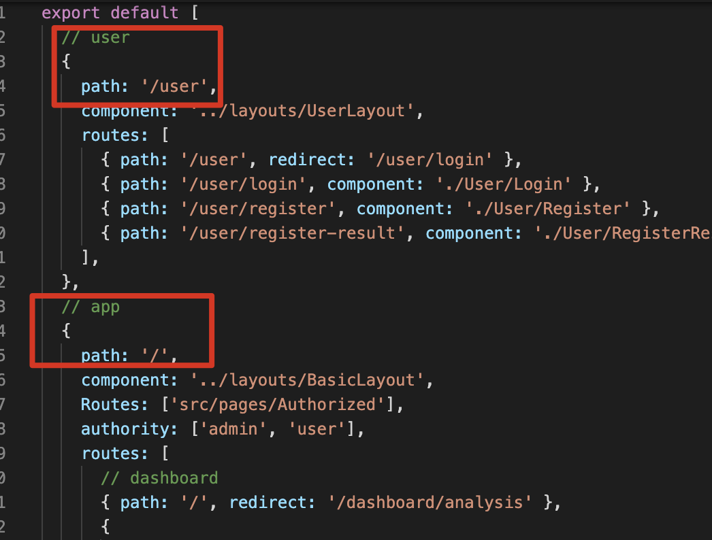

# 02-Ant Desgin

#1.ReactJS

### 1.1.分层

上图中，左侧是服务端代码的层次结构，由Controller,Service,Data Access三层组成服务服务端系统。

右侧是前端代码的结构，同样需要进行必要的分层：

* Page负责与用户直接打交道：渲染页面，接受用户的操作输入，侧重于展示型交互性逻辑；
* Model负责处理业务逻辑，为Page做数据，状态的读写，变化，暂存等；
* Service负责与HTTP接口对接，进行纯粹的数据读写。

### 1.2.使用DVA进行数据分层管理

DVA是基于redux,redux-saga和react-router的轻量级前端框架，想要使用它，我们需要在config.js文件中进行配置：

~~~js
export default {
    plugins: [
        ['umi-plugin-react',{
            dva:true //开启dva功能
        }]
    ]
};
~~~

接下来，创建model文件，约定在src/models文件夹中定义model

~~~js
export default {
    //导出模型数据
    namespace: 'List',//通过namespace区分名称
    state: {
        dataList: [1, 2, 3],
        maxNum: 3
    },
    reducers: {
        //定义一些函数
        addNewData: function (state) {//这个state是更新之前的数据
            
            let maxNum = state.maxNum + 1;
            let newArr = [...state.dataList, maxNum];

            //通过return返回更新后的数据
            return {
                dataList: newArr,
                maxNum: maxNum
            }
        }
    }
}
~~~

~~~js
import React from 'react';
import { connect } from 'dva';

const namespace = 'List';
//说明第一个回调函数,将page层和model层进行链接,返回model中的数据;
//并且,将返回的数据绑定到this.props中

// 接收第二个函数,这个函数的作用:将定义的函数绑定到this.props中,调用model层中定义的函数
@connect((state) => {
    return {
        dataList: state[namespace].dataList,
        maxNum: state[namespace].maxNum
    }
},

(dispatch)=>{
    //dispatch的作用可以调用model定义的函数
    return {
        add : function () {
            dispatch({//通过dispatch调用model中定义的函数,通过type属性,指定函数名
                type: namespace+"/addNewData"
            });
        }
    }
})
class List extends React.Component {

    constructor(props) {
        super(props);
    }

    render() {
        return (
            

                <ul>
                    {
                        this.props.dataList.map((value, index) => {
                            return <li key={index}>{value}</li>
                        })
                    }
                </ul>
                <button onClick={() => {
                    this.props.add();
                }}>点我试试</button>
            

        );
    }
}

export default List;
~~~

具体流程如下：

### 1.3.在model层中请求数据

首先在src下创建utils目录，并且创建request.js文件

~~~js
// import fetch from 'dva/fetch';

function checkStatus(response) {
    if (response.status >= 200 && response.status < 300) {
        return response;
    }
    const error = new Error(response.statusText); error.response = response;
    throw error;

}

/**
* Requests a URL, returning a promise.	
* @param	{string} url The URL we want to request
* @param	{object} [options]	The options we want to pass to "fetch"
* @return   {object} An object containing either "data" or "err"
*/

export default async function request(url, options) {
    const response = await fetch(url, options); checkStatus(response);
    return await response.json();
}
~~~

在model中新增如下方法

~~~js
import request from '../util/request';

export default {
    //导出模型数据
    namespace: 'List',//通过namespace区分名称
    state: {
        dataList: [],
        maxNum: 1
    },
    reducers: {
        //定义一些函数
        addNewData: function (state, result) {//这个state是更新之前的数据 result是请求的结果数据

            if (result.data) {
                //如result中存在data数据,直接返回,在做初始化操作
                console.log('11111',result.data);
                return result.data;
            }

            let maxNum = state.maxNum + 1;
            let newArr = [...state.dataList, maxNum];

            //通过return返回更新后的数据
            return {
                dataList: newArr,
                maxNum: maxNum
            }
        }
    },

    effects: { //新增effects配置，用于异步加载数据
        *initData(params, sagaEffects) { //定义异步方法
            const { call, put } = sagaEffects; //获取到call、put方法
            const url = "/ds/list"; // 定义请求的url
            let data = yield call(request, url); //执行请求
            console.log('----',data);
            yield put({ // 调用reducers中的方法
                type: "addNewData", //指定方法名
                data: data //传递ajax回来的数据
            });
            console.log('++++',data);
        }
    }
}
~~~

修改page层

~~~js
import React from 'react';
import { connect } from 'dva';

const namespace = 'List';
//说明第一个回调函数,将page层和model层进行链接,返回model中的数据;
//并且,将返回的数据绑定到this.props中

//接收第二个函数,这个函数的作用:将定义的函数绑定到this.props中,调用model层中定义的函数
@connect((state) => {
    return {
        dataList: state[namespace].dataList,
        maxNum: state[namespace].maxNum
    }
},

    (dispatch) => {
        //dispatch的作用可以调用model定义的函数
        return {
            add: function () {
                dispatch({//通过dispatch调用model中定义的函数,通过type属性,指定函数名
                    type: namespace + "/addNewData"
                });
            },
            init: () =>{
                dispatch({//通过dispatch调用model中定义的函数,通过type属性,指定函数名
                    type: namespace + "/initData"
                });
            }
    }
    })
class List extends React.Component {

    componentDidMount() {
        //初始化操作
        this.props.init();
    }

    constructor(props) {
        super(props);
    }

    render() {
        return (
            

                <ul>
                    {
                        this.props.dataList.map((value, index) => {
                            return <li key={index}>{value}</li>
                        })
                    }
                </ul>
                <button onClick={() => {
                    this.props.add();
                }}>点我试试</button>
            

        );
    }
}

export default List;
~~~

### 1.4.mock数据

umi中支持对请求的模拟，由于我们现在没有真正的服务可以返回数据，所以才需要模拟，在项目根目录下创建mock目录，然后创建MockListData.js,并且输入如下内容

~~~js
export default {
    'get /ds/list': function (req, res) {
        //模拟请求返回数据
        res.json(
            {
                dataList: [1, 2, 3, 4],
                maxNum: 4
            }
        );
    }
}
~~~

# 2.Ant Design

## 2.1.Ant Design介绍

Ant Design是阿里的蚂蚁金服团队基于React开发的UI组件，主要用于中后台系统的使用。

特性：

* 提炼自企业级中后台产品的交互语言和视觉风格；
* 开箱即用的高质量React组件；
* 使用TypeScript构建，提供完整的类型定义文件；
* 全链路开发和设计工具体系。

## 2.2.Ant Design使用

Ant Design是一个服务于企业级产品的设计体系，组件库是它的React实现，antd被发布为一个npm包方便开发者安装并且使用；

在umi中，可以通过在插件集umi-plugin-react中配置antd打开antd插件，antd插件会帮你引入antd并实现按需编译。

在config.js文件中进行配置：

~~~js
export default {
    plugins: [
        ['umi-plugin-react',{
            dva:true, //开启dva功能
            antd:true //开启AntDesign
        }]
    ]
};
~~~

我们参考Ant Design的官网

~~~js
import React from 'react';
import { Tabs } from 'antd';//第一步导入需要使用的组件

function callback(key) {
    console.log(key);
}

const TabPane = Tabs.TabPane;

class MyTabs extends React.Component {
    render() {
        return (
            <Tabs defaultActiveKey="1" onChange={callback}>
                <TabPane tab="Tab 1" key="1">
                    Content of Tab Pane 1
                </TabPane>
                <TabPane tab="Tab 2" key="2">
                    Content of Tab Pane 2
                    </TabPane>
                <TabPane tab="Tab 3" key="3">
                    Content of Tab Pane 3
                </TabPane>
            </Tabs>
        );
    }
}

export default MyTabs;
~~~

## 2.3.布局

在后台系统页面布局中，往往是经典的三部分布局.

* `Layout`：布局容器，其下可以嵌套`Header``Sider``Content``Footer`或者`Layout`本身，可以放在任何父容器中；
* `Header`：顶部布局，自带默认样式，其下可嵌套任何元素，只能放在`Layout`中；
* `Sider`:侧边栏，自带默认样式及基本功能，其下可嵌套任何元素，只能放在`Layout`中；
* `Content`：内容部分，自带默认样式，其下可嵌套任何元素，只能放在`Layout`中；
* `Footer`:底部布局，自带默认样式，其下可嵌套任何元素，只能放在`Layout`中。

在src目录下创建layouts目录，并且在layouts目录下创建index.js文件，写入内容。

~~~js
import React from 'react';
import { Layout } from 'antd';

const { Header, Footer, Sider, Content } = Layout;

class BasicLayout extends React.Component {
    render() {
        return (
            <Layout>
                <Sider>Sider</Sider>
                <Layout>
                    <Header>Header</Header>
                    <Content>
                        {
                            this.props.children
                        }
                    </Content>
                    <Footer>Footer</Footer>
                </Layout>
            </Layout>
        );
    }
}
export default BasicLayout;
~~~

> 需要特别说明的是，在umi中约定的目录结构中，layouts/index.js文件将被作为全局的布局文件。

接下来，配置路由（非必须），在config.js文件中：

注意：下面的路由配置，是表明你需要通过手动配置的方式进行访问页面，而不是采用umi默认的路由方式。

~~~js
export default {
    plugins: [
        ['umi-plugin-react', {
            dva: true, //开启dva功能
            antd: true //开启AntDesign
        }]
    ],
  	//非必须
    routes: [{
        path: '/',
        component: '../layouts', //配置布局路由
        
    }]
};
~~~

之后我们需要对页面进行美化，并需要引入导航条。最后给导航条添加链接

~~~js
import React from 'react';
import { Layout, Menu, Icon } from 'antd';
import Link from 'umi/link';

const { Header, Footer, Sider, Content } = Layout;
const SubMenu = Menu.SubMenu;

class BasicLayout extends React.Component{

    constructor(props){
        super(props);
        this.state = {
            collapsed: false,
        }
    }

    render(){
        return (
            <Layout>
                <Sider width={256} style={{minHeight: '100vh', color: 'white'}}>
                    

                    <Menu
                        defaultSelectedKeys={['1']}
                        defaultOpenKeys={['sub1']}
                        mode="inline"
                        theme="dark"
                        inlineCollapsed={this.state.collapsed}
                    >
                        <SubMenu key="sub1" title={<Icon type="user"/>用户管理}>
                            {/* 通过umi提供的Link来代理a标签就可以解决点击链接标签选中状态异常问题 */}
                            <Menu.Item key="1"><Link to="/user/UserAdd">新增用户</Link></Menu.Item>
                            <Menu.Item key="2"><Link to="/user/UserList">新增列表</Link></Menu.Item>
                        </SubMenu>
                    </Menu>
                </Sider>
                <Layout>
                    <Header style={{ background: '#fff', textAlign: 'center', padding: 0 }}>Header</Header>
                    <Content style={{ margin: '24px 16px 0' }}>
                        

                            {this.props.children}
                        

                    </Content>
                    <Footer style={{ textAlign: 'center' }}>后台系统 ©2018 Created by 黑马程序员</Footer>
                </Layout>
            </Layout>
        )
    }

}

export default BasicLayout;
~~~

## 2.4.表格

1.page层

~~~js
import React from 'react';
import { connect } from 'dva';

import {Table, Divider, Tag, Pagination } from 'antd';

const {Column} = Table;

const namespace = 'userList';

@connect((state)=>{
    return {
        data : state[namespace].list
    }
}, (dispatch) => {
    return {
        initData : () => {
            dispatch({
                type: namespace + "/initData"
            });
        }
    }
})
class UserList extends React.Component {

    componentDidMount(){
        this.props.initData();
    }

    render() {
        return (
            

                <Table dataSource={this.props.data} pagination={{position:"bottom",total:500,pageSize:10, defaultCurrent:3}}>
                    <Column
                        title="姓名"
                        dataIndex="name"
                        key="name"
                    />
                    <Column
                        title="年龄"
                        dataIndex="age"
                        key="age"
                    />
                    <Column
                        title="地址"
                        dataIndex="address"
                        key="address"
                    />
                    <Column
                        title="标签"
                        dataIndex="tags"
                        key="tags"
                        render={tags => (
                            
                                {tags.map(tag => <Tag color="blue" key={tag}>{tag}</Tag>)}
                            
                        )}
                    />
                    <Column
                        title="操作"
                        key="action"
                        render={(text, record) => (
                            
                                <a href="javascript:;">编辑</a>
                                <Divider type="vertical"/>
                                <a href="javascript:;">删除</a>
                            
                        )}
                    />
                </Table>
            

        );
    }

}

export default UserList;
~~~

2.model层

~~~js
import request from "../util/request";

export default {
    namespace: 'userList',
    state: {
        list: []
    },

    effects: {
        *initData(params, sagaEffects) {
            const {call, put} = sagaEffects;
            const url = "/ds/user/list";
            let data = yield call(request, url);
            yield put({
                type : "queryList",
                data : data
            });
        }
    },

    reducers: {
        queryList(state, result) {
            let data = [...result.data];
            return { //更新状态值
                list: data
            }
        }
    }

}
~~~

3.添加mock数据

~~~js
export default {
    'get /ds/list': function (req, res) {
        //模拟请求返回数据
        res.json(
            {
                dataList: [1, 2, 3, 4],
                maxNum: 4
            }
        );
    },
    'get /ds/user/list': function (req, res) {
        res.json([{
            key: '1',
            name: '张三1',
            age: 32,
            address: '上海市',
            tags: ['程序员', '帅气'],
        }, {
            key: '2',
            name: '李四2',
            age: 42,
            address: '北京市',
            tags: ['屌丝'],
        }, {
            key: '3',
            name: '王五3',
            age: 32,
            address: '杭州市',
            tags: ['高富帅', '富二代'],
        }]);
    }
}
~~~

# 3.Ant Design Pro

Ant Design Pro是基于Ant Design的一个开箱即用的，企业级中后前端/设计解决方案。我们可以直接去github上下载文件。

源码地址：

[Ant Design Pro]: https://github.com/ant-design/ant-design-pro

Ant Design Pro提供的目录如下：

进行初始化以及启动：

~~~shell
tyarn install #安装相关依赖
tyarn start #启动服务
~~~

## 3.1.菜单和路由

在Ant Design Pro中，菜单和路由，在router.config.js配置文件中进行管理

打开router.config.js后，可以看出，pro提供了2套路由布局。分别是`/user`和`/`

我们可以新增一个路由进行测试:

得到的结果如下图，显示的文字我们需要去国际化进行配置

下面我们将在国际化文件中进行配置

##3.2.新增页面

所有的页面是保存在src/pages中，在pages目录下，以功能为单元创建目录。创建文件MyTestAnalysis.js

~~~js
import React from 'react';

class MyTestAnalysis extends React.Component{
    render(){
        return (
MyTestAnalysis
);
    }
}

export default MyTestAnalysis
~~~

修改路由中的路径

之后进行测试，就可以看到一个新的页面就建好了，并且已经加入到菜单中。

