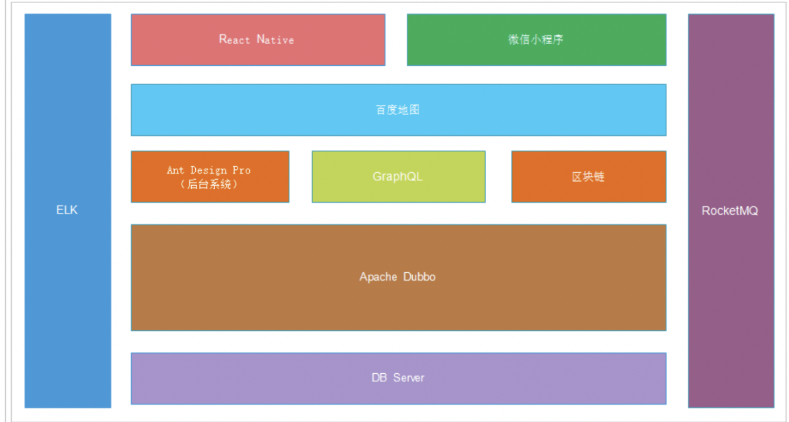
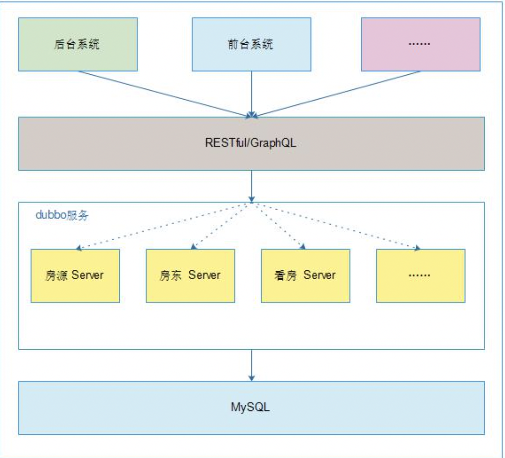
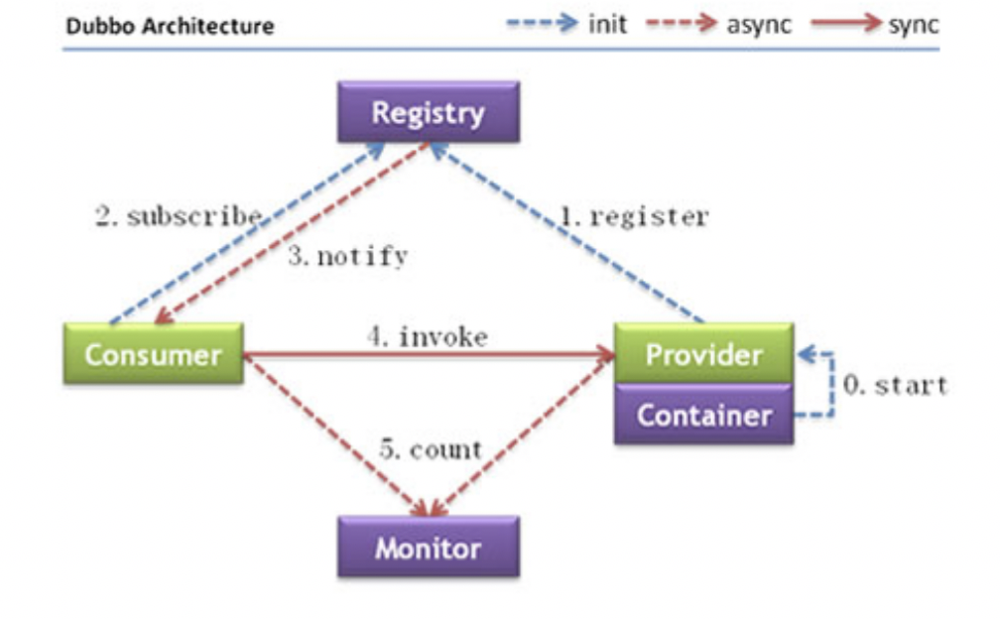
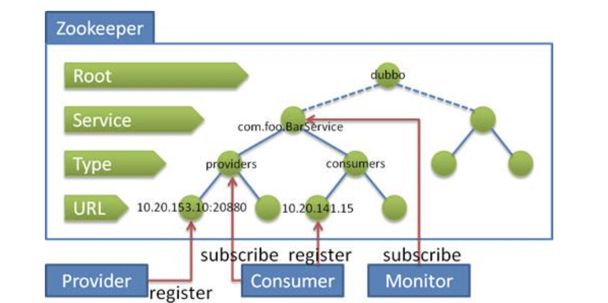
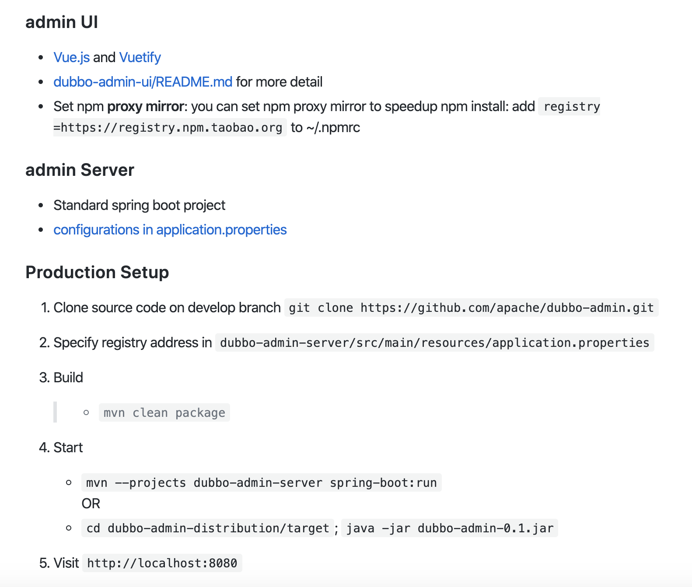
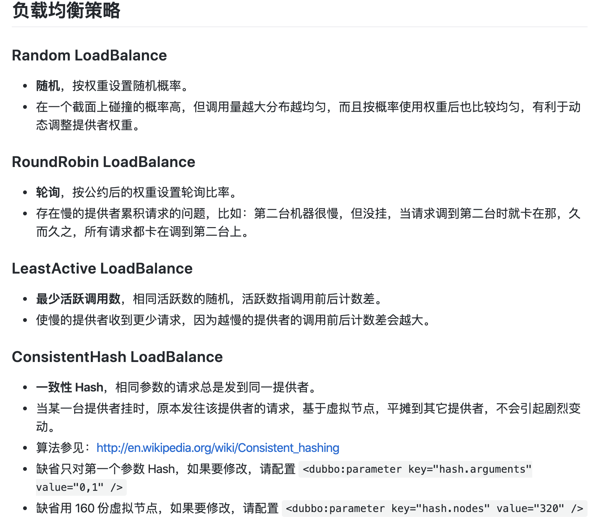
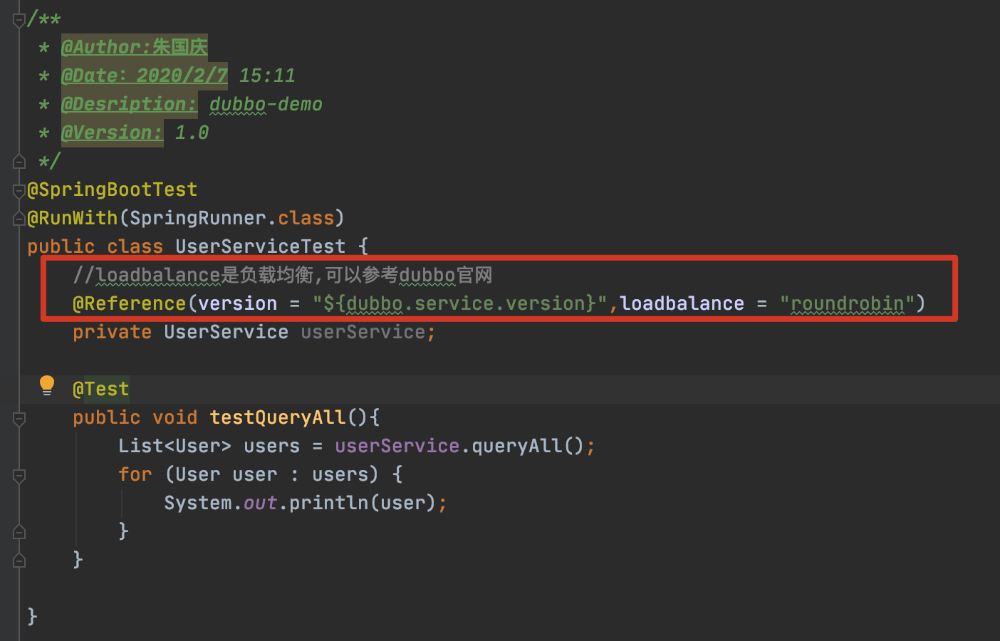
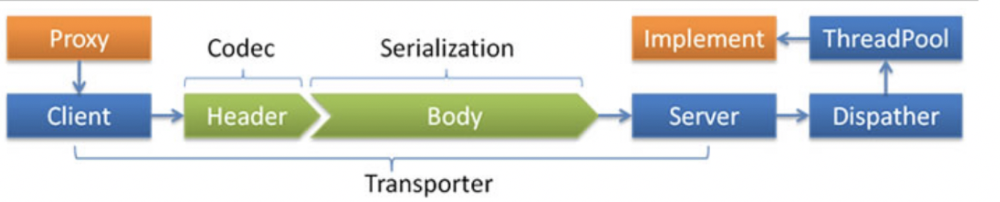

# 03-项目介绍

# 1.项目架构

项目采用SOA架构思想进行设计，采用SpringBoot，SpringMVC，MyBatis，Dubbo等技术框架实现，是直接促成房东对租户对接的生活服务平台，包含房东发布房源，租户多维度寻找房源，智能匹配房源，近期行情查询等功能，减少中间环节产生的费用，提高房东与租户匹配的成功率。

* 后端架构：SpringBoot+SpringMVC+Dubbo+MyBatis+ELK+区块链
* 前端架构：React.js+html5+百度地图+微信小程序

# 2.后台系统搭建

后台系统采用的是前后端分离开发模式，前端使用Ant Design Pro系统作为模板进行改造，后端采用的是SpringBoot+SpringMVC+Dubbo+Mybatis的架构进行开发。

## 2.1.前端搭建

~~~shell
tyarn install #安装相关依赖
tyarn start #启动服务
~~~

## 2.2.后台系统服务

前端系统已经搭建完成，需要后台系统为其提供接口服务。如：新增房源，房源列表，房东列表。

## 2.3.Dubbo

###2.3.1.Dubbo架构

节点角色说明：

| 节点      | 角色说明                           |
| --------- | :--------------------------------- |
| Provider  | 暴露服务的服务提供方               |
| Consumer  | 调用远程服务的服务消费方           |
| Registry  | 服务注册与发现的注册中心           |
| Monitor   | 统计服务的调用次数和调用时间监控中 |
| Container | 服务运行容器                       |

1. 服务容器负责启动，加载，运行服务提供者。
2. 服务提供者在启动时，向注册中心注册自己提供的服务。
3. 服务消费者在启动时，向注册中心订阅自己所需的服务。
4. 注册中心返回服务提供者地址列表给消费者，如有变更，注册中心将基于长连接推送变更数据给消费者。
5. 服务消费者，从提供者地址列表中，基于软负载均衡算法，选一台提供者进行调用，如果调用失败，再选另选一台调用。
6. 服务消费者和提供者，在内存中累计调用次数和调用时间，定时每分钟发送一次统计数据到监控中心。

### 2.3.2.Zookeeper

Zookeeper是Apache Hadoop的子项目，是一个树型的目录服务，支持变更推送，适合作为Dubbo服务的注册中心，工业强度较高，可用于生产环境，并推荐使用。

流程说明：

* 服务提供者启动时：向`/dubbo/com.foo.BarService/providers`目录下写入自己的URL地址；
* 服务消费者启动时：订阅`/dubbo/com.foo.BarService/providers`目录下的提供者URL地址。并向`/dubbo/com.foo.BarService/consumers`目录下写入的URL地址；
* 监控中心启动时：订阅`/dubbo/com.foo.BarService`目录下的所有提供者和消费者URL地址。

支持以下功能：

* 当提供者出现断电等异常停机时，注册中心能自动删除提供者信息；
* 当注册中心重启时，能自动恢复注册数据，以及订阅请求；
* 当会话过期时，能自动恢复注册数据，以及订阅请求；
* 当设置`<dubbo:registry check='false'/>`时，记录失败注册和订阅请求，后台定时重试；
* 可通过`<dubbo:registry username="admin" password="1234"/>`设置zookeeper登录信息；
* 可通过`<dubbo:registry group="dubbo"/>`设置zookeeper的根节点，不设置将使用无根数；
* 支持`*`号通配符`<dubbo:reference group="*" version="*"/>`，可订阅服务的所有分组和所有版本的提供者；

使用docker部署ZooKeeper

~~~shell
#创建容器
docker create --name zk -p 2181:2181 zookeeper:3.5

#启动容器
docker start zk
~~~

### 2.3.3.Dubbo Admin

~~~shell
git clone https://github.com/apache/incubator-dubbo-ops.git
~~~

### 2.3.4.服务的负载均衡

在集群负载均衡时，Dubbo提供了多种均衡策略，缺省为`random`随机调用。

### 2.3.5.dubbo协议

Dubbo缺省协议采用单一长连接和NIO异步通讯，适合于小数据量大并发的服务调用，以及服务消费者机器数远大于服务提供者机器数的情况。反之，dubbo缺省协议不适合传送大数据量的服务，比如传文件，传视频等，除非请求量很低。

* Transporter(传输):mina,netty,grizzy
* Serialization(序列化):dubbo,hessian2,java,json
* Dispatcher(分布调度):all,direct,message.execution,connection
* ThreadPool(线程池):fixed,cached

缺省协议，使用基于mina 1.1.7和hessian 3.2.1的tbremoting交互

* 连接个数:单连接
* 连接方式:长连接
* 传输协议:TCP
* 传输方式:NIO异步传输
* 序列化:Hessian二进制序列化
* 适用范围:传入传出参数数据包较小(建议小于100k),消费者比提供者个数多,单一消费者无法压满提供者，尽量不要用dubbo协议传输大文件或超大字符串
* 适用场景:常规远程服务方法调用