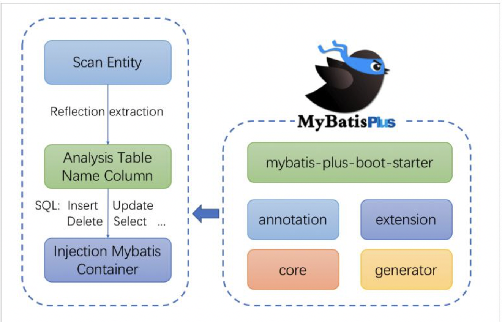

# 04-服务的具体实现及MyBatis Plus

# 1.使用Docker安装MySQL

我们使用MySQL的衍生版本Percona，并且采用docker容器化的方式进行部署。

## 1.1.Percona

Percona为MySQL数据库服务器进行了改进，在功能和性能上较MySQL上有着很显著的提升。该版本提升了在高负债情况下的InnoDB的性能，为DBA提供一些非常有用的性能诊断工具；另外有更多的参数和命令来控制服务器行为。

Percona Server 只包含MySQL的服务器版，并没有提供相应对MySQL的Connector和GUI工具进行改进；

Percona Server使用了一些google-mysql-tools，Proven Scaling，Open Query对MySQL进行改造。

官网:

[Percona版本的MySQL]: https://www.percona.com/software/mysql-databas

## 1.2.安装部署

~~~shell
#拉取镜像
docker pull percona:5.7.23

#创建容器
docker create --name percona -v /data/mysql-data:/var/lib/mysql -p 3306:3306 -e MYSQL_ROOT_PASSWORD=root percona:5.7.23 
#(目录挂载总是失败，原因未知)

#参数解释
--name:percona 指定是容器的名称
-v： /data/mysql-data:/var/lib/mysql 将主机目录/data/mysql-data 挂载到容器的/var/lib/mysql上；
-p:  3306:3306 设置端口映射，主机端口是3306，容器内部端口3306
-e:  MYSQL_ROOT_PASSWORD=root 设置容器参数，设置root用户的密码为root
percona:5.7.23; 镜像名：版本

#启动容器
docker start percona

~~~

**上述的安装与部署存在目录挂载失败问题,还很难解决，我们不妨换成官方的MySQL镜像进行操作**

~~~shell
#拉取镜像
docker pull mysql

#挂载外部配置和数据
mkdir /opt/mysql
mkdir /opt/mysql/conf.d
mkdir /opt/mysql/data/

#创键my.cnf配置文件
touch /opt/mysql/my.cnf

#在my.cnf添加如下内容
[mysqld]
user=mysql
character-set-server=utf8
default_authentication_plugin=mysql_native_password
secure_file_priv=/var/lib/mysql
expire_logs_days=7
sql_mode=STRICT_TRANS_TABLES,NO_ZERO_IN_DATE,NO_ZERO_DATE,ERROR_FOR_DIVISION_BY_ZERO,NO_ENGINE_SUBSTITUTION
max_connections=1000

[client]
default-character-set=utf8

[mysql]
default-character-set=utf8

#创建容器并启动
docker run  --privileged=true -d -v /opt/mysql/data/:/var/lib/mysql -v /opt/mysql/conf.d:/etc/mysql/conf.d -v /opt/mysql/my.cnf:/etc/mysql/my.cnf -p 3306:3306 --name my-mysql -e MYSQL_ROOT_PASSWORD=root mysql
#--restart=always： 当Docker 重启时，容器会自动启动。
#--privileged=true：容器内的root拥有真正root权限，否则容器内root只是外部普通用户权限
#-v /opt/mysql/conf.d/my.cnf:/etc/my.cnf：映射配置文件
#-v /opt/mysql/data/:/var/lib/mysql：映射数据目录
# 大功告成
~~~

# 2.MyBatis Plus入门

在后台系统服务的开发过程中，必然要和数据库进行交互，ORM这一层的技术选型，我们采用MyBatis框架作为持久层框架，原因是MyBatis对SQL语句编写更加灵活。

为了提升开发的效率，所以选用MyBatisPlus作为MyBatis的插件，以提升开发的效率。下面我们来学习MyBatis Plus插件的使用。

## 2.1.简介

MyBatis Plus是一个MyBatis的增强工具，在MyBatis的基础上只做增强不做改变，为简化开发，提高效率而生。

## 2.2.特性

* 无侵入：只做增强不做改变，引入它不会对现有工程产生影响，如丝般顺滑；
* 损耗小：启动即会自动注入基本CURD，性能基本无损耗，直接面向对象操作；
* 强大的CRUD操作：内置通过Mapper，通过Service，仅仅通过少量配置即可实现单表大部分CRUD操作，更有强大的条件构造器，满足各类使用需求；
* 支持Lambda形式调用：通过Lambda表达式，方便的编写各类查询条件，无需再担心字段写错；
* 支持多种数据库：支持MySQL，MariaDB，Oracle，H2，HSQL，SQLife，Postgre，SQLServer2005，SQLServer等多种数据库；
* 支持主键自动生成：支持多达4种主键策略(内部分布式唯一ID生成器-Sequence)，可自由配置，完美解决主键问题；
* 支持XML热加载：Mapper对应的XML支持热加载，对于简单的CURD操作，甚至可以无XML启动；
* 支持ActiveRecord模型：支持ActiveRecord形式调用，实体类只需要继承Model类即可进行强大的CRUD操作；
* 支持自定义全局通用操作：支持全局通用方法注入；
* 支持关键词自动转义：支持数据库关键词（order，key......）自动转义，还可自定义关键词；
* 内置代码生成器：采用代码或者Maven插件可快速生成Mapper，Model，Service，Controller层代码，支持模板引擎，更有超多自定义配置等您来使用；
* 内置分页插件：基于MyBatis物理分页，开发者无需关心具体操作，配置好插件之后，写分页等同于普通List查询；
* 内置性能分析插件：可输出SQL语句以及其执行时间，建议开发测试时启动该功能，能快速揪出慢查询；
* 内置全局拦截插件：提供全表delete，update操作只能分析阻断，也可自定义拦截规则，预防误操作；
* 内置SQL注入剥离器：支持SQL注入剥离，有效预防SQL注入攻击；

## 2.3.架构

