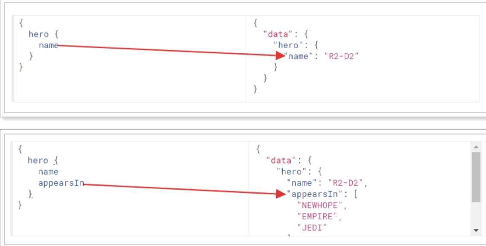
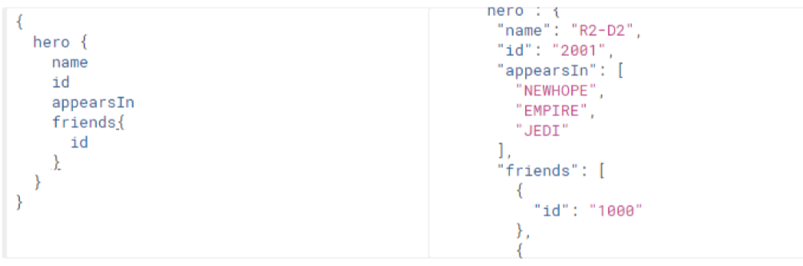
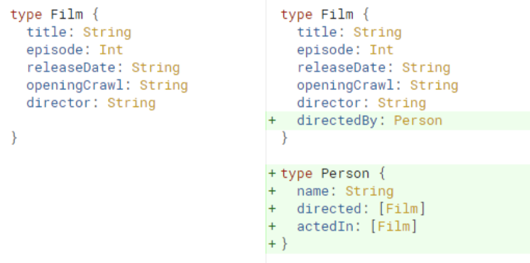
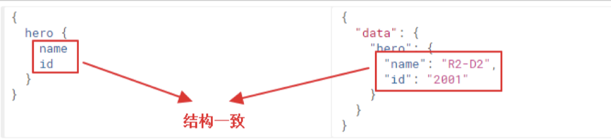
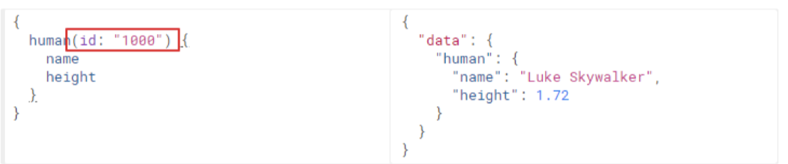
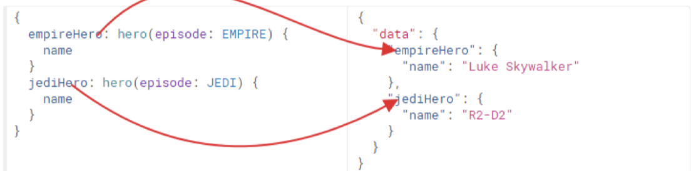
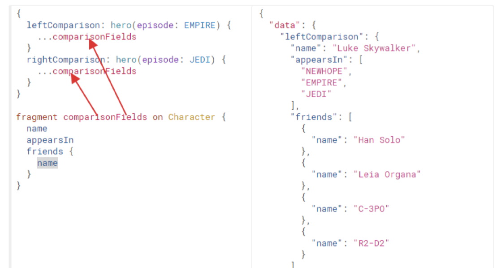
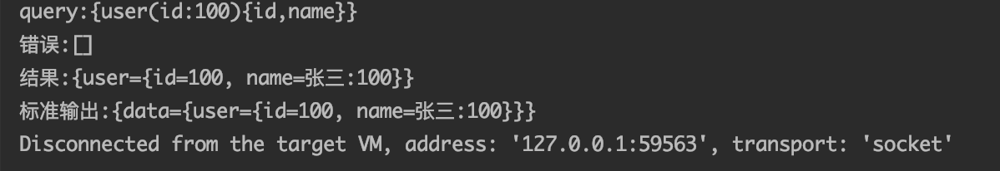

# 05-阿里云OSS与GraphQL

# 1.图片储存解决方案

开发一个图片上传服务，需要有存储的支持，那么我们的解决方案将常见的以下几种

1. 直接将图片保存到服务的硬盘
   1. 优点：开发便捷，成本低；
   2. 缺点：扩容困难
2. 使用分布式文件系统进行存储
   1. 优点：容易实现扩容
   2. 缺点：开发复杂度较大
3. 使用NFS(Network File System)做存储
   1. 优点：开发较为便捷
   2. 缺点：需要有一定的运维知识进行部署和维护
4. 使用第三方的存储服务
   1. 优点：开发简单，拥有强大功能，免维护
   2. 缺点：付费

# 2.阿里云OSS存储

# 3.本地文件系统存储

# 4.GraphQL

## 4.1.GraphQL介绍

GraphQL是由Facebook创造的用于描述复杂数据模型的一种查询语言，这里查询语言所指的并不是常规意义上的类似SQL语句的查询语言，而是一种用于前后端数据查询方式的规范。

[官网](https://graphql.cn/)

[规范地址](http://spec.graphql.cn/)

## 4.2.分析RESTful存在的问题

RESTful在查询的时候，往往是这样的：

~~~shell
#请求
GET http://127.0.0.1/user/1001

#响应
{
	id:1001, 
	name:"张三", 
	age:20, 
	address:"北京市"
}
~~~

这样似乎是没有问题的，如果，对于这次请求，我只要id和name属性，其他的属性我都不需要，如果我依然拿到的是全部属性，就是一种资源浪费。

~~~shell
#查询用户信息
GET http://127.0.0.1/user/1001
#响应
{
   id:1001,
   name:"张三"，
   age:20,
   address:"北京市"
}

#查询用户的身份信息
GET http://127.0.0.1/card/8888
#响应
{
		id:8888,
		name:"张三"，
		cardNumber:"999999999999",
		address:"北京市"
}
~~~

查询用户以及身份证信息，需要进行2次查询才能完成，这样对于前段等接口的使用方法是很不友好的，试想查询信息有10个，那么需要发起10次请求才能完成。

## 4.3.GraphQL特点

### 4.3.1.按需索取数据，避免浪费

可以看出，当请求中只有name属性时，响应结果中只包含name属性，如果请求中添加appearsin属性，那么结果中就会返回appearsin的值。

### 4.3.2.一次查询多个数据

可以看到，一次请求，不仅查询到了hero数据，而且还查询到了friends数据，节省了网络请求次数。

### 4.3.3.API的演进无需划分版本

可以看出，当API进行升级的时候，客户端可以不进行升级，等到后期一起升级，这样就大大减少了客户端和服务端的耦合度。

## 4.4.GraphQL的查询规范

GraphQL定义了一套规范，用来描述语法定义，仅仅是规范，并不是具体的实现，需要各种语言进行实现。

### 4.4.1.字段（Fields）

在GraphQL的查询中，请求结构中包含了所预期结果的结构，这个就是字段，并且响应的结构和请求结构基本一致，这是GraphQL的一个特性，这样就可以让请求者很清楚自己想要什么。

### 4.4.2.参数（Arguments）

在查询数据时，离不开传递参数，在GraphQL的查询中，也是可以传递参数的，语法：（参数名：参数值）

### 4.4.3.别名（Aliases）

如果一次查询多个相同的对象，但是值不同，这个时候就需要起别名，否则json的语法就不能通过了

### 4.4.4.片段（Fragments）

查询结果的属性如果相同，可以采用片段的方式进行简化定义

## 4.5.GraphQL的Schema和类型规范

Schema是用于定义数据结构的，比如说，User对象中有哪些属性，对象与对象之间是什么关系等。

### 4.5.1.Schema定义结构

~~~shell
schema { #定义查询 
	query:UserQuery 
}

type UserQuery { #定义查询的类型
	user(id:ID):User #指定对象以及参数类型 
}

type User { #定义对象 
	id:ID! # !表示该属性是非空项 
	name:String 
	age:Int
}
~~~

### 4.5.2.标量类型

GraphQL规范中，默认定义了5种类型

* `Int`:有符号32位整数；
* `Float`:有符号双精度浮点值；
* `String`: UTF-8字符序列;
* `Boolean`：`true`或者`false`;
* `ID`:`ID`标量类型表示一个唯一标识符，通常用以重新获取对象或者作为缓存中的键。

规范中定义的这5种类型，显然是不能同时满足需求的，所以在各种语言实现中，都有对类型进行了补充，

也就是GraphQL支持自定义类型，比如在graphQL-java中实现增加了`Long`，`Byte`等；

### 4.5.3.枚举类型

枚举类型是一种特殊的标量，它限制在一个特殊的可选值集合内

~~~shell
enum Episode { #定义枚举
 NEWHOPE
 EMPIRE
 JEDI
}

type Human { 
	id: ID!
	name: String!
	appearsIn: [Episode]! #使用枚举类型
  homePlanet: String
}
~~~

### 4.5.4.接口（Interface）

跟许多类型系统一样，GraphQL支持接口，一个接口是一个抽象类型，它包含某些字段，而对象类型必须包含这些字段，才能算实现了这个接口；

~~~shell
#定义接口
interface Character {
  id: ID!
  name: String!
  friends: [Character]
  appearsIn: [Episode]!
}

#实现接口
type Human implements Character {
  id: ID!
  name: String!
  friends: [Character]
  appearsIn: [Episode]!
  starships: [Starship]
  totalCredits: Int
}

type Droid implements Character {
  id: ID!
  name: String!
  friends: [Character]
  appearsIn: [Episode]!
  primaryFunction: String
}
~~~

## 4.6.GraphQL的Java实现

官方只是定义了规范并没有做实现，就需要有第三方来进行实现，关于GraphQL的java实现有几种，我们选择使用官方推荐的实现：graphql-java，我们通过该实现就可以编写GraphQL的服务端了

[官网](https://www.graphql-java.com/)

[GitHub](https://github.com/graphql-java/graphql-java)

### 4.6.1.基本步骤

**第一步：导入依赖**

~~~xml
		<dependency>
        <groupId>com.graphql-java</groupId>
        <artifactId>graphql-java</artifactId>
        <version>14.0</version>
    </dependency>
~~~

**第二步：创建对象**

**第三步：编写查询对象实现**

~~~shell
#对应的User定义如下：
schema { #定义查询
    query: UserQuery
}
type UserQuery { #定义查询类型
    user(id:Long) : User #指定对象以及参数类型
}
type User {#定义对象
    id:Long! #！表示该属性是非空项
    name:String
    age:Int
    card:Card
}
type Card{
    cardNumber:String
    userId:Long
}
~~~

我们可以根据上述的Schema来进行Java的实现

~~~java
package org.fechin.graphql.demo;

import graphql.ExecutionResult;
import graphql.GraphQL;
import graphql.schema.GraphQLFieldDefinition;
import graphql.schema.GraphQLObjectType;
import graphql.schema.GraphQLSchema;
import org.fechin.graphql.vo.User;

/**
 * 设置静态引用
 */
import static graphql.Scalars.*;
import static graphql.schema.GraphQLArgument.newArgument;
import static graphql.schema.GraphQLFieldDefinition.newFieldDefinition;
import static graphql.schema.GraphQLObjectType.newObject;

public class GraphQLDemo {

    public static void main(String[] args) {

        /**
         * type User { #定义对象}
         */
        GraphQLObjectType userObjectType = newObject()
                .name("User")
                .field(newFieldDefinition().name("id").type(GraphQLLong))
                .field(newFieldDefinition().name("name").type(GraphQLString))
                .field(newFieldDefinition().name("age").type(GraphQLInt))
                .build();

        /**
         * user : User #指定对象以及参数类型
         */
        GraphQLFieldDefinition userFieldDefinition = newFieldDefinition()
                .name("user")
                .type(userObjectType)
                .argument(newArgument().name("id").type(GraphQLLong).build())
                .dataFetcher(environment -> {
                    Long id = environment.getArgument("id");
                    // 查询数据库了
                    // TODO 先模式实现
                    return new User(id, "张三:" + id, 20 + id.intValue(), null);
                })
                //静态数据
                //.dataFetcher(new StaticDataFetcher(new User(1L, "张三", 20)))
                .build();

        /**
         * type UserQuery { #定义查询的类型}
         */
        GraphQLObjectType userQueryObjectType = newObject()
                .name("UserQuery")
                .field(userFieldDefinition)
                .build();

        /**
         * schema { #定义查询 }
         */
        GraphQLSchema graphQLSchema = GraphQLSchema.newSchema().query(userQueryObjectType).build();

        GraphQL graphQL = GraphQL.newGraphQL(graphQLSchema).build();

        String query = "{user(id:100){id,name}}";
        ExecutionResult result = graphQL.execute(query);

        System.out.println("query:" + query);
        System.out.println("错误:" + result.getErrors());
        System.out.println("结果:" + (Object) result.getData());
        System.out.println("标准输出:"+result.toSpecification());

    }
}
~~~

**第四步：测试**

### 4.6.2.使用SDL构建schema

**第一步：安装GraphQL插件**

**第二步：创建user.graphqls文件**

~~~shell
#对应的User定义如下：
schema { #定义查询
    query: UserQuery
}
type UserQuery { #定义查询类型
    user(id:Long) : User #指定对象以及参数类型
}
type User {#定义对象
    id:Long! #！表示该属性是非空项
    name:String
    age:Int
    card:Card
}
type Card{
    cardNumber:String
    userId:Long
}
~~~

**第三步：编写代码**

~~~java
package org.fechin.graphql.demo;

import graphql.ExecutionResult;
import graphql.GraphQL;
import graphql.schema.GraphQLSchema;
import graphql.schema.idl.RuntimeWiring;
import graphql.schema.idl.SchemaGenerator;
import graphql.schema.idl.SchemaParser;
import graphql.schema.idl.TypeDefinitionRegistry;
import org.apache.commons.io.IOUtils;
import org.fechin.graphql.vo.Card;
import org.fechin.graphql.vo.User;

import java.io.IOException;

public class GraphQLSDLDemo {

    public static void main(String[] args) throws IOException {

        // 读取GraphQL文件，进行解析
        String fileName = "user.graphqls";
        String fileContent = IOUtils.toString(GraphQLSDLDemo.class.getClassLoader().getResource(fileName), "UTF-8");
        TypeDefinitionRegistry typeRegistry = new SchemaParser().parse(fileContent);

        // 解决的是数据的查询
        RuntimeWiring wiring = RuntimeWiring.newRuntimeWiring()
                .type("UserQuery", builder ->
                        builder.dataFetcher("user", environment -> {
                            Long id = environment.getArgument("id");
                            Card card = new Card("123456789", id);
                            return new User(id, "张三:" + id, 20 + id.intValue(), card);
                        })
                )
                .build();

        // 生成Schema
        GraphQLSchema graphQLSchema = new SchemaGenerator().makeExecutableSchema(typeRegistry, wiring);

        // 根据Schema对象生成GraphQL对象
        GraphQL graphQL = GraphQL.newGraphQL(graphQLSchema).build();

        String query = "{user(id:100){id,name,age,card{cardNumber}}}";
        ExecutionResult result = graphQL.execute(query);

        System.out.println("query:" + query);
        System.out.println(result.toSpecification());

    }
}

~~~

**第四步：测试**

