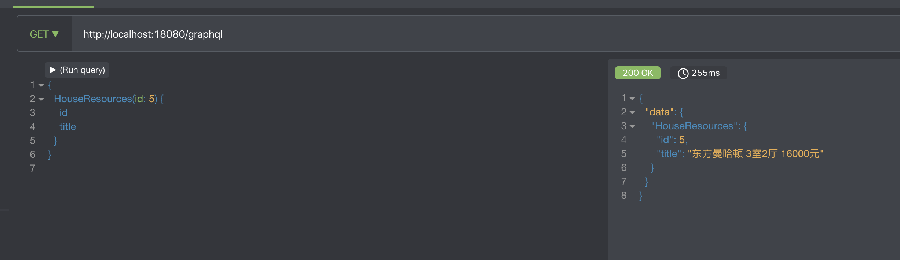

# 06-GraphQL服务及前端工程

# 1.使用GraphQL结合项目进行开发

## 1.1.根据需求编写GraphQL文件

在resources目录下新建`.graphqls`文件

~~~json
schema {
    query: HaokeQuery
}

type HaokeQuery {
    HouseResources(id:Long) : HouseResources
    HouseResourcesList(page:Int, pageSize:Int) : TableResult
    IndexAdList:IndexAdResult
}

type HouseResources {
    id:Long!
    title:String
    estateId:Long
    buildingNum:String
    buildingUnit:String
    buildingFloorNum:String
    rent:Int
    rentMethod:Int
    paymentMethod:Int
    houseType:String
    coveredArea:String
    useArea:String
    floor:String
    orientation:String
    decoration:Int
    facilities:String
    pic:String
    houseDesc:String
    contact:String
    mobile:String
    time:Int
    propertyCost:String
}

type TableResult{
    list:[HouseResources]
    pagination:Pagination
}

type Pagination{
    current:Int
    pageSize:Int
    total:Int
}

type IndexAdResult{
    list:[IndexAdResultData]
}

type IndexAdResultData{
    original:String
}
~~~

## 1.2.将GraphQL对象注入到Spring容器中

~~~java
package org.fechin.haoke.dubbo.api.graphql;

import graphql.GraphQL;
import graphql.schema.GraphQLSchema;
import graphql.schema.idl.RuntimeWiring;
import graphql.schema.idl.SchemaGenerator;
import graphql.schema.idl.SchemaParser;
import graphql.schema.idl.TypeDefinitionRegistry;
import org.fechin.haoke.dubbo.api.service.HouseResourcesService;
import org.springframework.beans.factory.annotation.Autowired;
import org.springframework.context.annotation.Bean;
import org.springframework.context.annotation.Configuration;
import org.springframework.util.ResourceUtils;

import javax.annotation.PostConstruct;
import java.io.File;
import java.io.FileNotFoundException;

/**
 * @Author:朱国庆
 * @Date：2020/2/13 14:47
 * @Desription: haoke-manage
 * @Version: 1.0
 */
@Configuration
public class GraphQLConfig {

    private GraphQL graphQL;

    @Autowired
    private HouseResourcesService houseResourcesService;

    /**
     * 在Spring容器做初始化的时候执行
     */
    @PostConstruct
    public void init() throws FileNotFoundException {
        File file = ResourceUtils.getFile("classpath:haoke.graphqls");
        this.graphQL = GraphQL.newGraphQL(buildGraphQLSchema(file)).build();
    }

    private GraphQLSchema buildGraphQLSchema(File file){
        TypeDefinitionRegistry typeRegistry = new SchemaParser().parse(file);
        return  new SchemaGenerator().makeExecutableSchema(typeRegistry, buildWiring());
    }

    private RuntimeWiring buildWiring(){
        // 解决的是数据的查询
        return RuntimeWiring.newRuntimeWiring()
                .type("HaokeQuery", builder ->
                        builder.dataFetcher("HouseResources", environment -> {
                            Long id = environment.getArgument("id");
                            return this.houseResourcesService.queryHouseResourcesById(id);
                        })
                )
                .build();
    }

    @Bean
    public GraphQL graphQL(){
        return this.graphQL;
    }

}
~~~

## 1.3.编写Service层业务逻辑（略）

## 1.4.编写Controller层代码

~~~java
package org.fechin.haoke.dubbo.api.controller;

import graphql.GraphQL;
import org.springframework.beans.factory.annotation.Autowired;
import org.springframework.web.bind.annotation.GetMapping;
import org.springframework.web.bind.annotation.RequestMapping;
import org.springframework.web.bind.annotation.RequestParam;
import org.springframework.web.bind.annotation.RestController;

import java.util.Map;

/**
 * @Author:朱国庆
 * @Date：2020/2/13 14:44
 * @Desription: haoke-manage
 * @Version: 1.0
 */

@RestController
@RequestMapping("/graphql")
public class GraphQLController {

    @Autowired
    private GraphQL graphQL;

    /**
     * 实现GraphQL查询
     * @param query
     * @return
     */
    @GetMapping
    public Map<String,Object> query(@RequestParam("query")String query){
        return graphQL.execute(query).toSpecification();
    }
}
~~~

## 1.5.安装Chrome的Altair GraphQL Client插件

使用谷歌商店安装插件：

## 1.6.进行测试

使用Altair GraphQL Client进行测试：

## 1.7.存在问题

在注入到Spring容器中时候，我们需要构建wiring，然而代码如果是上图的话，就只能查询这一个业务，想要查询多个业务逻辑，代码必须写成如下样子：

随着业务逻辑越来越复杂，代码就会越来越不方便于编写和维护，显然是

## 1.8.优化改进

改进思路：

1. 编写接口；
2. 所有实现查询的业务逻辑都实现该接口；
3. 在GraphQLConfigr中使用该接口的实现类进行处理；
4. 以后需要新增查询只需要增加实现类即可

**第一步，就是先编写接口，目的就是把构建wiring中的代码抽象出来**

~~~java
package org.fechin.haoke.dubbo.api.graphql;

import graphql.schema.DataFetchingEnvironment;

/**
 * @Author:朱国庆
 * @Date：2020/2/13 16:12
 * @Desription: haoke-manage
 * @Version: 1.0
 */
public interface MyDataFetcher {

    /**
     * GraphQL查询的名称
     * @return
     */
    String fieldName();

    /**
     * 数据的查询
     * @param dataFetchingEnvironment
     * @return
     */
    Object dataFetcher(DataFetchingEnvironment dataFetchingEnvironment);

}
~~~

**第二步，实现该接口，我们将所有的这种实现类都注入到Spring容器中去**

~~~java
package org.fechin.haoke.dubbo.api.graphql;

import graphql.schema.DataFetchingEnvironment;
import org.fechin.haoke.dubbo.api.service.HouseResourcesService;
import org.springframework.beans.factory.annotation.Autowired;
import org.springframework.stereotype.Component;

/**
 * @Author:朱国庆
 * @Date：2020/2/13 16:30
 * @Desription: haoke-manage
 * @Version: 1.0
 */
@Component
public class HouseResourcesDataFetcher implements MyDataFetcher{

    @Autowired
    private HouseResourcesService houseResourcesService;

    @Override
    public String fieldName() {
        return "HouseResources";
    }

    @Override
    public Object dataFetcher(DataFetchingEnvironment environment) {
        Long id = environment.getArgument("id");
        return houseResourcesService.queryHouseResourcesById(id);
    }
}
~~~

**第三步,在GraphQLConfigr中使用该接口的实现类进行处理**

注意：我们在依赖注入`MyDataFetchers`的时候直接注入它整个集合；

~~~java
package org.fechin.haoke.dubbo.api.graphql;

import graphql.GraphQL;
import graphql.schema.GraphQLSchema;
import graphql.schema.idl.RuntimeWiring;
import graphql.schema.idl.SchemaGenerator;
import graphql.schema.idl.SchemaParser;
import graphql.schema.idl.TypeDefinitionRegistry;
import org.fechin.haoke.dubbo.api.service.HouseResourcesService;
import org.springframework.beans.factory.annotation.Autowired;
import org.springframework.context.annotation.Bean;
import org.springframework.context.annotation.Configuration;
import org.springframework.util.ResourceUtils;

import javax.annotation.PostConstruct;
import java.io.File;
import java.io.FileNotFoundException;
import java.util.List;

/**
 * @Author:朱国庆
 * @Date：2020/2/13 14:47
 * @Desription: haoke-manage
 * @Version: 1.0
 */
@Configuration
public class GraphQLConfig {

    private GraphQL graphQL;

    @Autowired
    private HouseResourcesService houseResourcesService;

    @Autowired
    private List<MyDataFetcher> myDataFetchers;

    /**
     * 在Spring容器做初始化的时候执行
     */
    @PostConstruct
    public void init() throws FileNotFoundException {
        File file = ResourceUtils.getFile("classpath:haoke.graphqls");
        this.graphQL = GraphQL.newGraphQL(buildGraphQLSchema(file)).build();
    }

    private GraphQLSchema buildGraphQLSchema(File file) {
        TypeDefinitionRegistry typeRegistry = new SchemaParser().parse(file);
        return new SchemaGenerator().makeExecutableSchema(typeRegistry, buildWiring());
    }

    private RuntimeWiring buildWiring() {
        // 解决的是数据的查询
        return RuntimeWiring.newRuntimeWiring()
                .type("HaokeQuery", builder -> {
                            for (MyDataFetcher myDataFetcher : myDataFetchers) {
                                builder.dataFetcher(myDataFetcher.fieldName(), environment -> myDataFetcher.dataFetcher(environment));
                            }
                            return builder;
                        }
                )
                .build();
    }

    @Bean
    public GraphQL graphQL() {
        return this.graphQL;
    }
}
~~~

**第四步，测试(略)**

# 2.搭建前台系统

本项目是采用前后端分离开发模式，前端系统由前端团队进行开发，接下来我们需要整合前端，前端使用React+semantic+ui实现移动端web展示，后期可以将web打包成app进行发布。

前端在开发时，没有采用mock的方式，而是采用了node.js开发服务端的方式进行了demo化的开发。

## 2.1.前台系统实现分析

### 2.1.1.目录结构

### 2.1.2.加载数据流程

以首页为例，查看数据加载流程；打开home.js文件可以看到，在组件加载完成后进行加载数据；

