# 07-GraphQL参数,Redis实现缓存及WebSocket

# 1.GraphQL参数问题

# 2.Redis实现缓存

在接口服务中，如果每次都进行数据库查询，那么必然会给数据库造成很大的并发压力，所以需要为接口添加缓存，缓存技术选用Redis，并且使用Redis集群，Api使用的是Spring-Data-Redis。

## 2.1.使用Docker搭建Redis集群

通过`ifconfig`查看docker的网卡

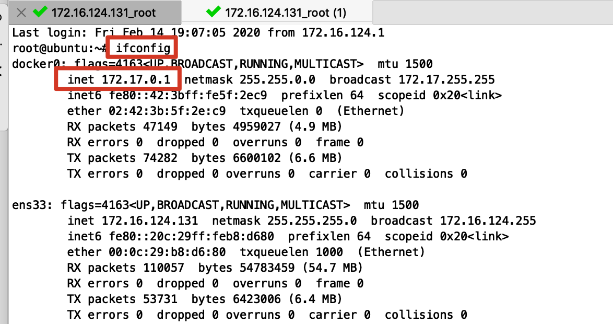

~~~shell
#拉取镜像
docker pull redis:5.0.2

#创建容器
docker create --name redis-node01 -v /opt/redis/data/node01:/data -p 6379:6379 redis:5.0.2 --cluster-enabled yes --cluster-config-file nodes-node-01.conf

docker create --name redis-node02 -v /opt/redis/data/node02:/data -p 6380:6379 redis:5.0.2 --cluster-enabled yes --cluster-config-file nodes-node-02.conf

docker create --name redis-node03 -v /opt/redis/data/node03:/data -p 6381:6379 redis:5.0.2 --cluster-enabled yes --cluster-config-file nodes-node-03.conf

#启动容器
docker start redis-node01 redis-node02 redis-node03

#开始组建集群
#进入redis-node01进行操作
docker exec -it redis-node01 /bin/bash

#在容器内组建集群(没有replicas,即没有分片，全是master主节点)
redis-cli --cluster create 172.17.0.1:6379 172.17.0.1:6380 172.17.0.1:6381 --cluster-replicas 0
~~~

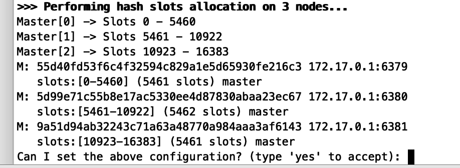

这时候出现连接不到redis节点的问题,我们尝试使用容器的ip地址

~~~shell
#查看容器的ip地址
#172.17.0.4
docker inspect redis-node01
#172.17.0.5
docker inspect redis-node02
#172.17.0.6
docker inspect redis-node03
~~~

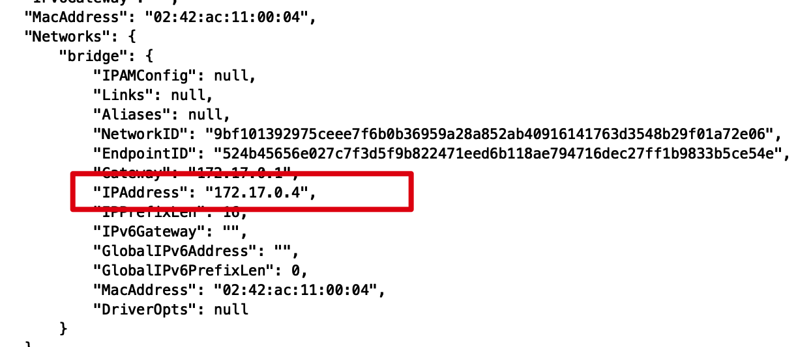

~~~shell
#再次进入redis-node01进行操作
docker exec -it redis-node01 /bin/bash
#组建集群(注意端口的变化)
redis-cli --cluster create 172.17.0.4:6379 172.17.0.5:6379 172.17.0.6:6379 --cluster-replicas 0
~~~

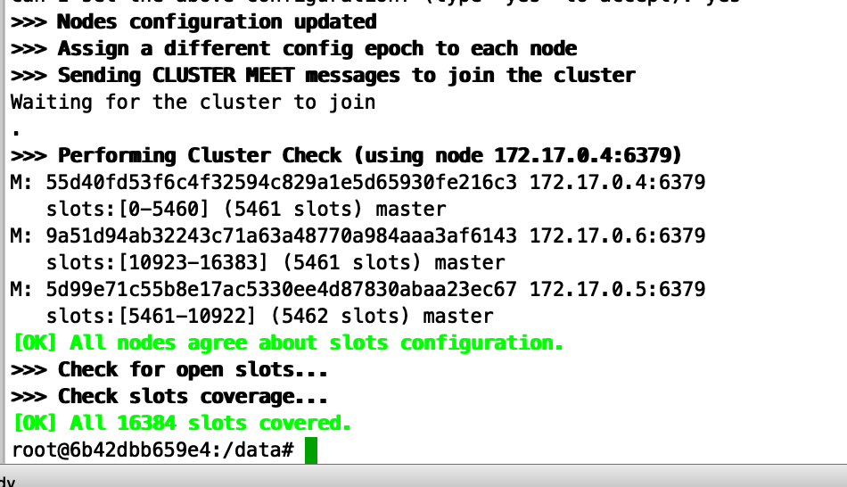

搭建成功！

我们在redis容器中使用`CLUSTER NODES`来查看该集群信息：

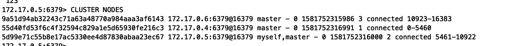

我们可以看到，集群中节点的ip地址是docker分配的地址，在外部客户端是没有办法访问到的。我们需要使用docker的网络类型进行操作。

## 2.2.Docker的网络类型

docker的网络类型

* None:不为容器配置任何网络功能，没有网络 --net=none
* Container:与另一个运行中的容器共享Network Namespace，--net=container:containerID
* Host:与主机共享Network NameSpace, --net=host
* Bridge:Docker设计的NAT网络模型(默认类型)

host模式创建的容器没有自己独立的网络命名空间，是和物理机共享一个Network Namespace,并且共享物理机的所有端口与IP。但是它将容器直接暴露在公共网络中，是有安全隐患的。但是目前我们只能使用这种方法。

**最终版的Redis集群**

~~~shell
#创建容器
docker create --name redis-node01 --net host -v /opt/redis/data/node01:/data redis:5.0.2 --cluster-enabled yes --cluster-config-file nodes-node-01.conf --port 6379

docker create --name redis-node02 --net host -v /opt/redis/data/node02:/data redis:5.0.2 --cluster-enabled yes --cluster-config-file nodes-node-02.conf --port 6380

docker create --name redis-node03 --net host -v /opt/redis/data/node03:/data  redis:5.0.2 --cluster-enabled yes --cluster-config-file nodes-node-03.conf --port 6381

#启动容器
docker start redis-node01 redis-node02 redis-node03

#开始组建集群
#进入redis-node01进行操作
docker exec -it redis-node01 /bin/bash
#组建集群(172.16.124.131是主机的ip地址)
redis-cli --cluster create 172.16.124.131:6379 172.16.124.131:6380 172.16.124.131:6381 --cluster-replicas 0

~~~

外部测试连接，成功！

## 2.3.Spring-Data-Redis代码测试

1.导入相关依赖

~~~xml
				<!--redis-->
        <dependency>
            <groupId>org.springframework.boot</groupId>
            <artifactId>spring-boot-starter-data-redis</artifactId>
        </dependency>
        <dependency>
            <groupId>redis.clients</groupId>
            <artifactId>jedis</artifactId>
            <version>2.9.0</version>
        </dependency>
        <dependency>
            <groupId>commons-io</groupId>
            <artifactId>commons-io</artifactId>
            <version>2.6</version>
        </dependency>
~~~

2.编写配置文件

~~~properties
# redis集群配置
spring.redis.jedis.pool.max-wait = 5000
spring.redis.jedis.pool.max-Idle = 100
spring.redis.jedis.pool.min-Idle = 10
spring.redis.timeout = 10
spring.redis.cluster.nodes = 172.16.124.131:6379,172.16.124.131:6380,172.16.124.131:6381
spring.redis.cluster.max-redirects=5
~~~

3.编写properties类

~~~java
package org.fechin.haoke.dubbo.api.config;

import lombok.Data;
import org.springframework.boot.context.properties.ConfigurationProperties;
import org.springframework.stereotype.Component;

import java.util.List;

@Component
@ConfigurationProperties(prefix = "spring.redis.cluster")
@Data
public class ClusterConfigurationProperties {

    private List<String> nodes;

    private Integer maxRedirects;

}
~~~

4.编写配置类

```java
package org.fechin.haoke.dubbo.api.config;

import org.springframework.beans.factory.annotation.Autowired;
import org.springframework.context.annotation.Bean;
import org.springframework.context.annotation.Configuration;
import org.springframework.data.redis.connection.RedisClusterConfiguration;
import org.springframework.data.redis.connection.RedisConnectionFactory;
import org.springframework.data.redis.connection.jedis.JedisConnectionFactory;
import org.springframework.data.redis.core.RedisTemplate;
import org.springframework.data.redis.serializer.StringRedisSerializer;

@Configuration
public class RedisClusterConfig {

    @Autowired
    private ClusterConfigurationProperties clusterProperties;

    @Bean
    public RedisConnectionFactory connectionFactory() {
        RedisClusterConfiguration configuration = new
                RedisClusterConfiguration(clusterProperties.getNodes());
        configuration.setMaxRedirects(clusterProperties.getMaxRedirects());
        return new JedisConnectionFactory(configuration);
    }

    @Bean
    public RedisTemplate<String, String> redisTemplate(RedisConnectionFactory redisConnectionfactory) {
        RedisTemplate<String, String> redisTemplate = new RedisTemplate<>();
        redisTemplate.setConnectionFactory(redisConnectionfactory);
        redisTemplate.setKeySerializer(new StringRedisSerializer());
        redisTemplate.setValueSerializer(new StringRedisSerializer());
        redisTemplate.afterPropertiesSet();

        return redisTemplate;
    }
}
```

4.编写测试类

~~~java
package org.fechin.haoke.dubbo.api;

import org.junit.Test;
import org.junit.runner.RunWith;
import org.springframework.beans.factory.annotation.Autowired;
import org.springframework.boot.test.context.SpringBootTest;
import org.springframework.data.redis.core.RedisTemplate;
import org.springframework.test.context.junit4.SpringRunner;

import java.util.Set;

/**
 * @Author:朱国庆
 * @Date：2020/2/15 16:41
 * @Desription: haoke-manage
 * @Version: 1.0
 */
@RunWith(SpringRunner.class)
@SpringBootTest
public class RedisTest {

    @Autowired
    private RedisTemplate<String, String> redisTemplate;

    @Test
    public void testSave() {
        for (int i = 0; i < 100; i++) {
            this.redisTemplate.opsForValue().set("key_" + i, "value_" + i);
        }
        Set<String> keys = this.redisTemplate.keys("key_*");

        for (String key : keys) {
            String value = this.redisTemplate.opsForValue().get(key);
            System.out.println(value);
            this.redisTemplate.delete(key);
        }
    }
}
~~~

## 2.4.缓存命中

实现缓存逻辑有两种方式：1.每个接口单独控制缓存逻辑；2.统一控制缓存逻辑。我们采用第二种方式。

**1.编写拦截器**

~~~java
package org.fechin.haoke.dubbo.api.interceptor;

import com.fasterxml.jackson.databind.ObjectMapper;
import org.apache.commons.codec.digest.DigestUtils;
import org.apache.commons.io.IOUtils;
import org.apache.commons.lang3.StringUtils;
import org.springframework.beans.factory.annotation.Autowired;
import org.springframework.data.redis.core.RedisTemplate;
import org.springframework.stereotype.Component;
import org.springframework.web.servlet.HandlerInterceptor;
import org.springframework.web.servlet.ModelAndView;

import javax.servlet.http.HttpServletRequest;
import javax.servlet.http.HttpServletResponse;
import java.util.Map;

@Component
public class RedisCacheInterceptor implements HandlerInterceptor {

    private static ObjectMapper mapper = new ObjectMapper();

    @Autowired
    private RedisTemplate<String, String> redisTemplate;

    /**
     * 在请求到达之前执行,返回true就放行,返回false就不放行;
     * @param request
     * @param response
     * @param handler
     * @return
     * @throws Exception
     */
    @Override
    public boolean preHandle(HttpServletRequest request, HttpServletResponse response, Object handler) throws Exception {

        if(StringUtils.equalsIgnoreCase(request.getMethod(), "OPTIONS")){
            return true;
        }

        // 判断请求方式，get还是post还是其他。。。
        if (!StringUtils.equalsIgnoreCase(request.getMethod(), "GET")) {
            // 非get请求，如果不是graphql请求，放行
            if (!StringUtils.equalsIgnoreCase(request.getRequestURI(), "/graphql")) {
                return true;
            }
        }

        // 通过缓存做命中，查询redis，redisKey ?  组成：md5（请求的url + 请求参数）
        String redisKey = createRedisKey(request);
        String data = this.redisTemplate.opsForValue().get(redisKey);
        if (StringUtils.isEmpty(data)) {
            // 缓存未命中
            return true;
        }

        // 将data数据进行响应
        response.setCharacterEncoding("UTF-8");
        response.setContentType("application/json; charset=utf-8");

        // 支持跨域
        response.setHeader("Access-Control-Allow-Origin", "*");
        response.setHeader("Access-Control-Allow-Methods", "GET,POST,PUT,DELETE,OPTIONS");
        response.setHeader("Access-Control-Allow-Credentials", "true");
        response.setHeader("Access-Control-Allow-Headers", "Content-Type,X-Token");
        response.setHeader("Access-Control-Allow-Credentials", "true");
        //缓存命中
        response.getWriter().write(data);

        return false;
    }

    public static String createRedisKey(HttpServletRequest request) throws
            Exception {
        String paramStr = request.getRequestURI();
        Map<String, String[]> parameterMap = request.getParameterMap();
        if (parameterMap.isEmpty()) {
            paramStr += IOUtils.toString(request.getInputStream(), "UTF-8");
        } else {
            paramStr += mapper.writeValueAsString(request.getParameterMap());
        }
        String redisKey = "WEB_DATA_" + DigestUtils.md5Hex(paramStr);
        return redisKey;
    }
}
~~~

**2.注册拦截器到Spring容器中**

~~~java
package org.fechin.haoke.dubbo.api.config;


import org.fechin.haoke.dubbo.api.interceptor.RedisCacheInterceptor;
import org.springframework.beans.factory.annotation.Autowired;
import org.springframework.context.annotation.Configuration;
import org.springframework.web.servlet.config.annotation.InterceptorRegistry;
import org.springframework.web.servlet.config.annotation.WebMvcConfigurer;

@Configuration
public class WebConfig implements WebMvcConfigurer {

    @Autowired
    private RedisCacheInterceptor redisCacheInterceptor;

    @Override
    public void addInterceptors(InterceptorRegistry registry) {
        registry.addInterceptor(this.redisCacheInterceptor).addPathPatterns("/**");
    }
}
~~~

**3.进行测试**

我们发现如果是POST请求的话，会报400的错误

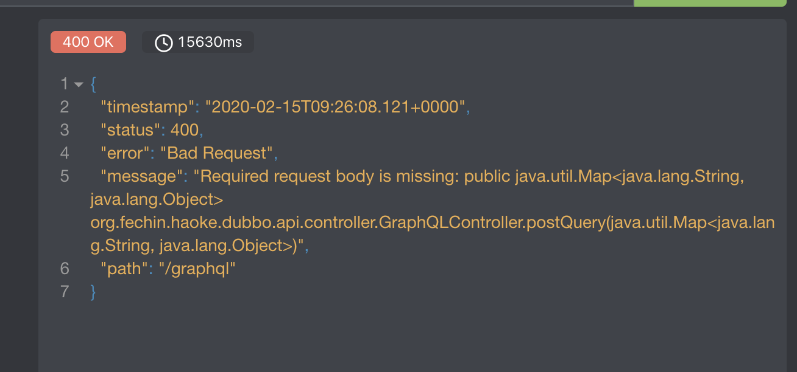

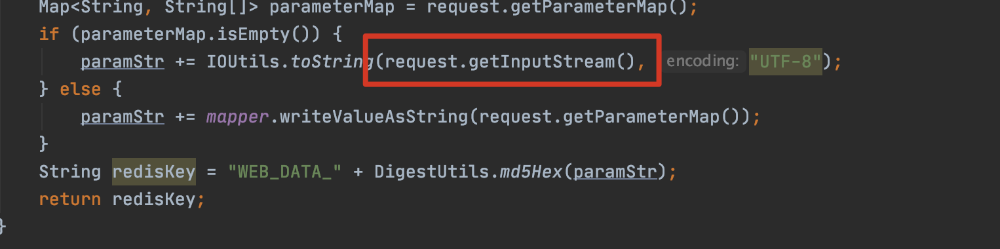

错误原因是，在拦截器中读取了输入流的数据，在request中的输入流只能读取一次，请求进入controller时候，输入流已经没有数据了，导致获取不到数据。

**4.通过包装request解决**

~~~java
package org.fechin.haoke.dubbo.api.interceptor;

import org.apache.commons.io.IOUtils;

import javax.servlet.ReadListener;
import javax.servlet.ServletInputStream;
import javax.servlet.http.HttpServletRequest;
import javax.servlet.http.HttpServletRequestWrapper;
import java.io.BufferedReader;
import java.io.IOException;
import java.io.InputStreamReader;

/**
 * 包装HttpServletRequest
 */
public class MyServletRequestWrapper extends HttpServletRequestWrapper {

    private final byte[] body;

    /**
     * Construct a wrapper for the specified request.
     *
     * @param request The request to be wrapped
     */
    public MyServletRequestWrapper(HttpServletRequest request) throws IOException {
        super(request);
        body = IOUtils.toByteArray(super.getInputStream());
    }

    @Override
    public BufferedReader getReader() throws IOException {
        return new BufferedReader(new InputStreamReader(getInputStream()));
    }

    @Override
    public ServletInputStream getInputStream() throws IOException {
        return new RequestBodyCachingInputStream(body);
    }

    private class RequestBodyCachingInputStream extends ServletInputStream {
        private byte[] body;
        private int lastIndexRetrieved = -1;
        private ReadListener listener;

        public RequestBodyCachingInputStream(byte[] body) {
            this.body = body;
        }

        @Override
        public int read() throws IOException {
            if (isFinished()) {
                return -1;
            }
            int i = body[lastIndexRetrieved + 1];
            lastIndexRetrieved++;
            if (isFinished() && listener != null) {
                try {
                    listener.onAllDataRead();
                } catch (IOException e) {
                    listener.onError(e);
                    throw e;
                }
            }
            return i;
        }

        @Override
        public boolean isFinished() {
            return lastIndexRetrieved == body.length - 1;
        }

        @Override
        public boolean isReady() {
            // This implementation will never block
            // We also never need to call the readListener from this method, as this method will never return false
            return isFinished();
        }

        @Override
        public void setReadListener(ReadListener listener) {
            if (listener == null) {
                throw new IllegalArgumentException("listener cann not be null");
            }
            if (this.listener != null) {
                throw new IllegalArgumentException("listener has been set");
            }
            this.listener = listener;
            if (!isFinished()) {
                try {
                    listener.onAllDataRead();
                } catch (IOException e) {
                    listener.onError(e);
                }
            } else {
                try {
                    listener.onAllDataRead();
                } catch (IOException e) {
                    listener.onError(e);
                }
            }
        }

        @Override
        public int available() throws IOException {
            return body.length - lastIndexRetrieved - 1;
        }

        @Override
        public void close() throws IOException {
            lastIndexRetrieved = body.length - 1;
            body = null;
        }
    }
}
~~~

我们在过滤器中对Request进行替换

~~~java
package org.fechin.haoke.dubbo.api.interceptor;

import org.springframework.stereotype.Component;
import org.springframework.web.filter.OncePerRequestFilter;

import javax.servlet.FilterChain;
import javax.servlet.ServletException;
import javax.servlet.http.HttpServletRequest;
import javax.servlet.http.HttpServletResponse;
import java.io.IOException;

/**
 * 替换Request对象
 */
@Component
public class RequestReplaceFilter extends OncePerRequestFilter {

    @Override
    protected void doFilterInternal(HttpServletRequest request, HttpServletResponse response, FilterChain filterChain) throws ServletException, IOException {
        if (!(request instanceof MyServletRequestWrapper)) {
            request = new MyServletRequestWrapper(request);
        }
        filterChain.doFilter(request, response);
    }
}
~~~

##2.5.响应结果写入缓存

通过ResponseBodyAdvice进行实现

ResponseBodyAdvice是Spring提供的高级用法，会在结果被处理前进行拦截，拦截的逻辑自己实现，这样就可以实现拿到结果数据进行写入缓存的操作了。

~~~java
package org.fechin.haoke.dubbo.api.interceptor;

import com.fasterxml.jackson.databind.ObjectMapper;
import org.apache.commons.lang3.StringUtils;
import org.fechin.haoke.dubbo.api.controller.GraphQLController;
import org.springframework.beans.factory.annotation.Autowired;
import org.springframework.core.MethodParameter;
import org.springframework.data.redis.core.RedisTemplate;
import org.springframework.http.MediaType;
import org.springframework.http.server.ServerHttpRequest;
import org.springframework.http.server.ServerHttpResponse;
import org.springframework.http.server.ServletServerHttpRequest;
import org.springframework.web.bind.annotation.ControllerAdvice;
import org.springframework.web.bind.annotation.GetMapping;
import org.springframework.web.bind.annotation.PostMapping;
import org.springframework.web.servlet.mvc.method.annotation.ResponseBodyAdvice;

import java.time.Duration;

@ControllerAdvice
public class MyResponseBodyAdvice implements ResponseBodyAdvice {

    @Autowired
    private RedisTemplate<String, String> redisTemplate;

    private ObjectMapper mapper = new ObjectMapper();

    @Override
    public boolean supports(MethodParameter returnType, Class converterType) {
        if (returnType.hasMethodAnnotation(GetMapping.class)) {
            return true;
        }

        if (returnType.hasMethodAnnotation(PostMapping.class) &&
                StringUtils.equals(GraphQLController.class.getName(), returnType.getExecutable().getDeclaringClass().getName())) {
            return true;
        }

        return false;
    }

    @Override
    public Object beforeBodyWrite(Object body, MethodParameter returnType, MediaType selectedContentType, Class selectedConverterType, ServerHttpRequest request, ServerHttpResponse response) {
        try {
            String redisKey = RedisCacheInterceptor.createRedisKey(((ServletServerHttpRequest) request).getServletRequest());
            String redisValue;
            if (body instanceof String) {
                redisValue = (String) body;
            } else {
                redisValue = mapper.writeValueAsString(body);
            }
            this.redisTemplate.opsForValue().set(redisKey, redisValue, Duration.ofHours(1));
        } catch (Exception e) {
            e.printStackTrace();
        }
        return body;
    }
}
~~~

经过测试，数据已经写入了缓存。

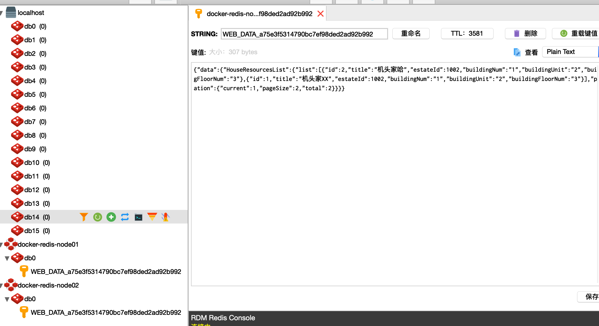

## 2.6.增加CORS的支持

整合前端系统测试会发现，前面实现的拦截器并没有对跨域进行支持，需要对CORS跨域支持。

在拦截器中我们添加如下代码：

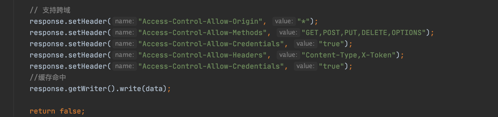

# 3.WebSocket

## 3.1.什么是WebSocket?

WebSocket是HTML5一种新的协议，它实现了浏览器与服务器**全双工通信**(full-duplex)，一开始的握手需要借助HTTP请求完成。WebSocket是真正实现了全双工通信的服务器向客户端推的互联网技术，它是一种在单个TCP连接上进行全双工通讯协议。

## 3.2.Http与Websocket的区别

**1.http:http协议是短连接，因为请求之后，都会关闭连接，下次重新请求数据，需要再次打开连接**

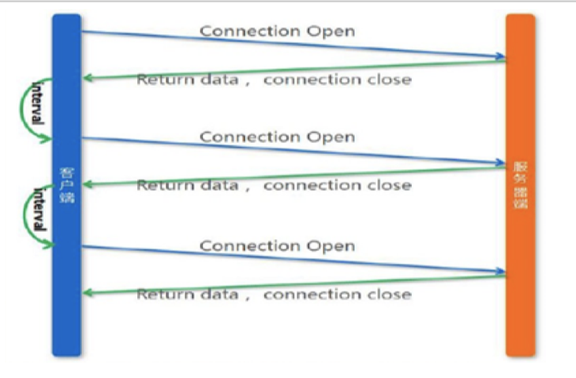

**2.WebSocket:WebSocket是一种长连接，只需要通过一次请求初始化链接，然后所有的请求和响应都是通过这个TCP连接进行通讯**

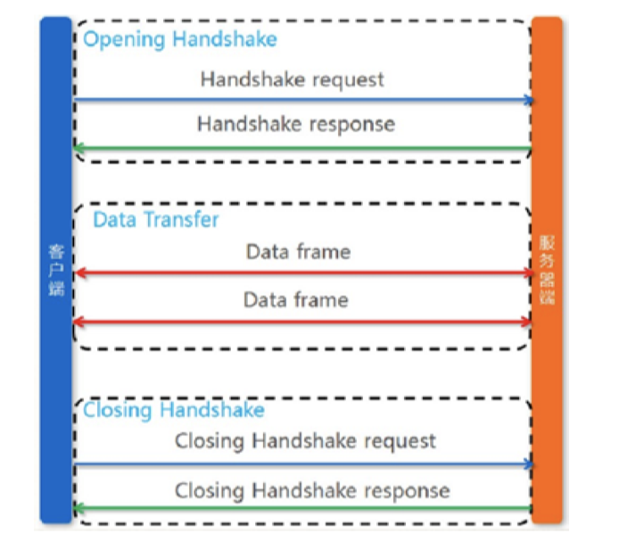

## 3.3.服务器和客户端对WebSocket的支持情况

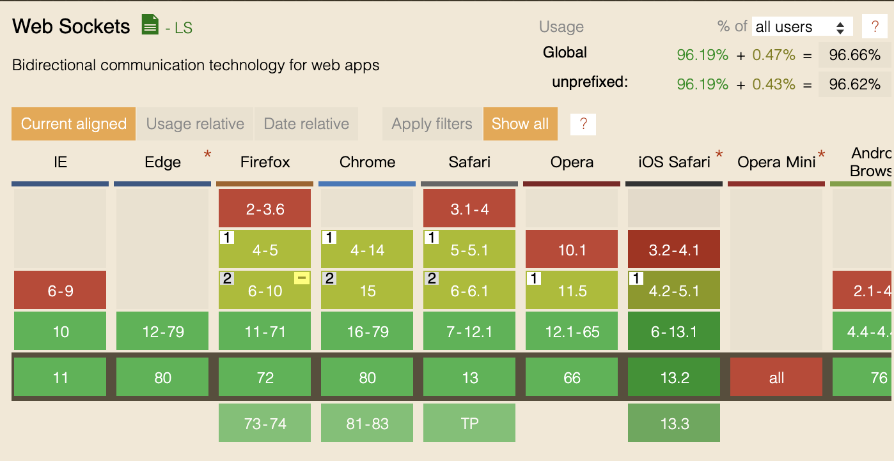

查看：https://caniuse.com/#search=websocket

服务器支持情况：Tomcat 7.0.47+以上才支持

## 3.4.WebSocket的Demo

### 3.4.1.创建WebSocket的Demo工程

~~~xml
<?xml version="1.0" encoding="UTF-8"?>
<project xmlns="http://maven.apache.org/POM/4.0.0"
         xmlns:xsi="http://www.w3.org/2001/XMLSchema-instance"
         xsi:schemaLocation="http://maven.apache.org/POM/4.0.0 http://maven.apache.org/xsd/maven-4.0.0.xsd">
    <modelVersion>4.0.0</modelVersion>

    <groupId>org.fechin.websocket</groupId>
    <artifactId>demo-websoket</artifactId>
    <version>1.0-SNAPSHOT</version>

    <!--spring boot的支持-->
    <!--    <parent>-->
    <!--        <groupId>org.springframework.boot</groupId>-->
    <!--        <artifactId>spring-boot-starter-parent</artifactId>-->
    <!--        <version>2.1.0.RELEASE</version>-->
    <!--    </parent>-->

    <dependencies>
        <dependency>
            <groupId>javax</groupId>
            <artifactId>javaee-api</artifactId>
            <version>7.0</version>
            <scope>provided</scope>
        </dependency>
        <!--        <dependency>-->
        <!--            <groupId>org.springframework.boot</groupId>-->
        <!--            <artifactId>spring-boot-starter-websocket</artifactId>-->
        <!--        </dependency>-->
    </dependencies>

    <build>
        <plugins>
            <!-- java编译插件 -->
            <plugin>
                <groupId>org.apache.maven.plugins</groupId>
                <artifactId>maven-compiler-plugin</artifactId>
                <version>3.2</version>
                <configuration>
                    <source>1.8</source>
                    <target>1.8</target>
                    <encoding>UTF-8</encoding>
                </configuration>
            </plugin>
            <!-- 配置Tomcat插件 -->
            <plugin>
                <groupId>org.apache.tomcat.maven</groupId>
                <artifactId>tomcat7-maven-plugin</artifactId>
                <version>2.2</version>
                <configuration>
                    <port>8082</port>
                    <path>/</path>
                </configuration>
            </plugin>
        </plugins>
    </build>
</project>
~~~

### 3.4.2.WebSocket的相关注解说明

> * @ServerEndpoint("/websoket"/{uid})
>   * 声明这是一个websocket服务
>   * 需要制定访问该服务的地址，在地址中可以指定参数，需要通过{}进行站位
> * @OnOpen
>   * 用法：public void onopen(Session session,@PathParam("uid")String uid) throws IOException{}
>   * 该方法将在建立连接后执行，会传入session对象，就是客户端与服务端建立的长连接通道
>   * 通过@PathParam获取url申明中的参数
> * @OnClose
>   * 用法：public void onClose(){}
>   * 该方法是在连接关闭后执行
> * @OnMessage
>   * 用法：public void onMessage(String message,Session session)throws IOException{}
>   * 该方法用于接收客户端发来的消息
>   * message：发来的消息数据
>   * session：会话对象（也是通道）
> * 发送消息到客户端
>   * 用法：session.getBasicRemote().sendText("你好")；
>   * 通过session进行发送

### 3.4.3.实现WebSocket服务

~~~java
package org.fechin.websocket;

import javax.websocket.*;
import javax.websocket.server.PathParam;
import javax.websocket.server.ServerEndpoint;
import java.io.IOException;

/**
 * @Author:朱国庆
 * @Date：2020/2/16 12:28
 * @Desription: haoke-manage
 * @Version: 1.0
 */
@ServerEndpoint("/websocket/{uid}")
public class MyWebSocket {

    @OnOpen
    public void onOpen(Session session,@PathParam(value = "uid") String uid) throws IOException {
        System.out.println("WebSocket已经连接," + session);
        //给客户端响应,欢迎连接系统
        session.getBasicRemote().sendText(uid+",你好,欢迎登陆系统");
    }

    @OnClose
    public void onClose(Session session) {
        System.out.println("WebSocket已经关闭," + session);
    }

    @OnMessage
    public void onMessage(String message, Session session) throws IOException {
        System.out.println("收到客户端的消息:" + message);
        session.getBasicRemote().sendText("消息已经收到");
    }

    @OnError
    public void onError(Session session, Throwable error) {
        System.out.println("发生错误");
        error.printStackTrace();
    }

}
~~~

### 3.4.4.测试

我们可以在安装Chrome插件，Simple Websocket Client

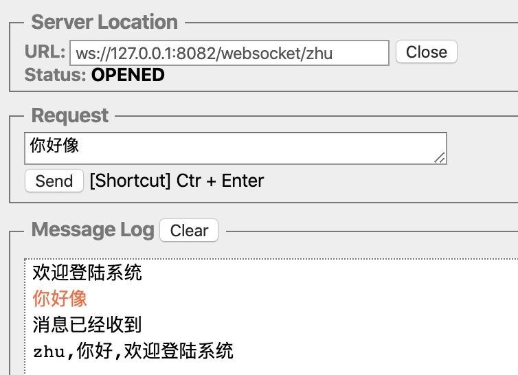

### 3.4.5.编写JS客户端

```html
<!DOCTYPE html>
<html lang="en">
<head>
    <meta charset="UTF-8">
    <title>Title</title>
</head>
<body>

</body>
<script>
    const socket = new WebSocket("ws://localhost:8082/websocket/1");
    socket.onopen = (ws) => {
        console.log("建立连接", ws);
    };
    socket.onmessage = (ws) => {
        console.log("接收到消息 >> ", ws.data);
    };
    socket.onclose = (ws) => {
        console.log("连接已断开！", ws);
    };
    socket.onerror = (ws) => {
        console.log("发送错误！", ws);
    };

    // 2秒后向服务端发送消息
    setTimeout(() => {
        socket.send("发送一条消息试试");
    }, 2000);

    // 5秒后断开连接
    setTimeout(() => {
        socket.close();
    }, 5000);
</script>
</html>
```

访问页面进行测试

chrome的console显示：

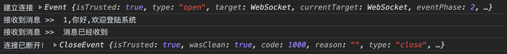

后端console显示：

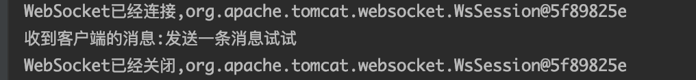

## 3.5.SpringBoot整合WebSocket

### 3.5.1.导入依赖

~~~xml
<?xml version="1.0" encoding="UTF-8"?>
<project xmlns="http://maven.apache.org/POM/4.0.0"
         xmlns:xsi="http://www.w3.org/2001/XMLSchema-instance"
         xsi:schemaLocation="http://maven.apache.org/POM/4.0.0 http://maven.apache.org/xsd/maven-4.0.0.xsd">
    <modelVersion>4.0.0</modelVersion>

    <groupId>org.fechin.websocket</groupId>
    <artifactId>demo-websoket</artifactId>
    <version>1.0-SNAPSHOT</version>
    <packaging>war</packaging>

    <!--spring boot的支持-->
    <parent>
        <groupId>org.springframework.boot</groupId>
        <artifactId>spring-boot-starter-parent</artifactId>
        <version>2.1.0.RELEASE</version>
    </parent>

    <dependencies>
        <dependency>
            <groupId>org.springframework.boot</groupId>
            <artifactId>spring-boot-starter-websocket</artifactId>
        </dependency>
    </dependencies>

    <build>
        <plugins>
            <!-- java编译插件 -->
            <plugin>
                <groupId>org.apache.maven.plugins</groupId>
                <artifactId>maven-compiler-plugin</artifactId>
                <version>3.2</version>
                <configuration>
                    <source>1.8</source>
                    <target>1.8</target>
                    <encoding>UTF-8</encoding>
                </configuration>
            </plugin>
            <!-- 配置Tomcat插件 -->
            <plugin>
                <groupId>org.apache.tomcat.maven</groupId>
                <artifactId>tomcat7-maven-plugin</artifactId>
                <version>2.2</version>
                <configuration>
                    <port>8082</port>
                    <path>/</path>
                </configuration>
            </plugin>
        </plugins>
    </build>
</project>
~~~

### 3.5.2.编写WebSocketHandler

~~~java
package org.fechin.websocket.springboot;

import org.springframework.stereotype.Component;
import org.springframework.web.socket.CloseStatus;
import org.springframework.web.socket.TextMessage;
import org.springframework.web.socket.WebSocketSession;
import org.springframework.web.socket.handler.TextWebSocketHandler;

import java.io.IOException;

@Component
public class MyHandler extends TextWebSocketHandler {

    /**
     * 服务端接收到消息的时候
     * @param session
     * @param message
     * @throws IOException
     */
    @Override
    public void handleTextMessage(WebSocketSession session, TextMessage message)
            throws IOException {
        System.out.println("获取到消息 >> " + message.getPayload());
        //人工智能代码!!!!!!!!(哈哈)
        String question = message.getPayload();
        question = question.replace("吗","");
        question = question.replace("我","我也");
        question = question.replace("?","!");
        question = question.replace("你","你才");
        try {
            Thread.sleep(100);
        } catch (InterruptedException e) {
            e.printStackTrace();
        }
        session.sendMessage(new TextMessage("回复:"+question));

    }

    @Override
    public void afterConnectionEstablished(WebSocketSession session) throws
            Exception {
        Integer uid = (Integer) session.getAttributes().get("uid");
        session.sendMessage(new TextMessage(uid+", 你好！欢迎连接到ws服务"));
    }

    @Override
    public void afterConnectionClosed(WebSocketSession session, CloseStatus status)
            throws Exception {
        System.out.println("断开连接！");
    }
}
~~~

### 3.5.3.编写拦截器

```java
package org.fechin.websocket.springboot;

import org.springframework.http.server.ServerHttpRequest;
import org.springframework.http.server.ServerHttpResponse;
import org.springframework.stereotype.Component;
import org.springframework.web.socket.WebSocketHandler;
import org.springframework.web.socket.server.HandshakeInterceptor;

import java.util.Map;

/**
 * 我们可以在建立连接之前写一些业务逻辑,比如校验登陆等（拦截器可写可不写）
 */
@Component
public class MyHandshakeInterceptor implements HandshakeInterceptor {

    /**
     * 握手之前，若返回false，则不建立链接
     *
     * @param request
     * @param response
     * @param wsHandler
     * @param attributes
     * @return
     * @throws Exception
     */
    @Override
    public boolean beforeHandshake(ServerHttpRequest request, ServerHttpResponse
            response, WebSocketHandler wsHandler, Map<String, Object> attributes) throws
            Exception {
        //将用户id放入socket处理器的会话(WebSocketSession)中
        //这样我们就可以在WebSocketHandle中通过'Integer uid = (Integer) session.getAttributes().get("uid");'来获取到uid.
        attributes.put("uid", 1001);
        System.out.println("开始握手。。。。。。。");
        return true;
    }

    @Override
    public void afterHandshake(ServerHttpRequest request, ServerHttpResponse
            response, WebSocketHandler wsHandler, Exception exception) {
        System.out.println("握手成功啦。。。。。。");
    }
}
```

### 3.5.4.编写配置类

```java
package org.fechin.websocket.springboot;

import org.springframework.beans.factory.annotation.Autowired;
import org.springframework.context.annotation.Configuration;
import org.springframework.web.socket.config.annotation.EnableWebSocket;
import org.springframework.web.socket.config.annotation.WebSocketConfigurer;
import org.springframework.web.socket.config.annotation.WebSocketHandlerRegistry;

@Configuration
@EnableWebSocket
public class WebSocketConfig implements WebSocketConfigurer {

    @Autowired
    private MyHandler myHandler;

    @Autowired
    private MyHandshakeInterceptor myHandshakeInterceptor;

    @Override
    public void registerWebSocketHandlers(WebSocketHandlerRegistry registry) {
        registry.addHandler(this.myHandler, "/ws")
                //允许跨域
                .setAllowedOrigins("*")
                .addInterceptors(this.myHandshakeInterceptor);
    }
}
```

### 3.5.5.测试

我们需要再编写一个SpringBoot的启动类，启动服务。

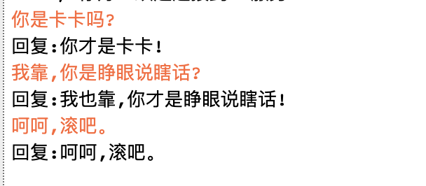

