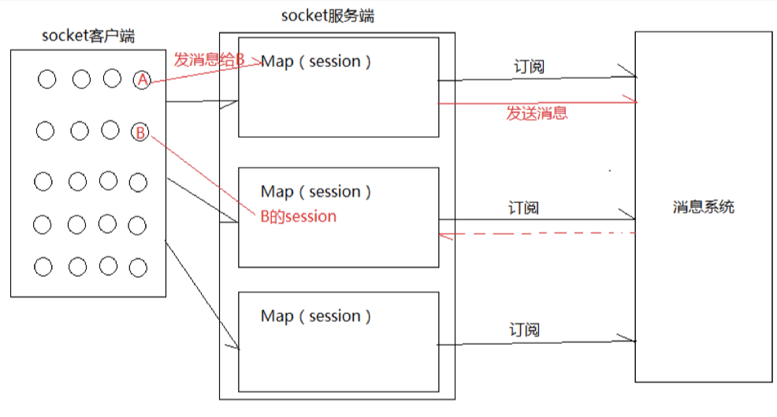

# 08-MongoDB以及实现微聊功能

# 1.MongoDB

## 1.1.MongoDB简介

MongoDB是一个基于分布式文件存储的数据库，由C++语言编写。为WEB应用提供可扩展的高性能数据存储解决方案。

MongoDB是一个介于关系数据库和非关系数据库之间的产品，是非关系数据库中功能最丰富的，最像关系数据库的，它支持的数据结构非常松散，是类似json的bson格式，因此可以存储比较复杂的数据类型。

MongoDB最大的特点是它支持的查询语言非常强大，其语法有点类似于面向对象的查询语言，几乎可以实现类似关系数据库单表查询的绝大部分功能，而且还支持对数据库建立索引。

## 1.2.通过Docker安装MongoDB

~~~shell
#拉取镜像
docker pull mongo:4.0.3

#创建容器
docker create --name mongodb -p 27017:27017 -v /data/mongodb:/opt/mongodb/data mongo:4.0.3

#启动容器
docker start mongodb

#进入容器
docker exec -it mongodb /bin/bash

#使用MongoDB客户端进行操作
mongo
> show dbs #查询所有数据库
# admin   0.000GB
# config  0.000GB
# local   0.000GB
~~~

## 1.3.MongoDB基本操作

### 1.3.1.基本概念


### 1.3.2.数据库以及表的操作

~~~shell
#查看所有的数据库表
> show dbs
admin   0.000GB
config  0.000GB
local   0.000GB

#通过use关键字切换数据库
> use admin
switched to db admin

#创建数据库
#说明：在MongoDB中，数据库是自动创建的，通过use切换到新数据库中，进行插入数据即可自动创建数据库。
> use testdb01
switched to db testdb01

> show dbs #发现并没有创建数据库
admin   0.000GB
config  0.000GB
local   0.000GB

> db.user.insert({id:1,name:'zhangsan'}) #插入数据
WriteResult({ "nInserted" : 1 })

> show dbs
admin     0.000GB
config    0.000GB
local     0.000GB
testdb01  0.000GB #数据库自动创建

#查看集合（表）
> show tables
user
> show collections
user

#删除集合（表）
> db.user.drop()
true #删除成功返回true，否则返回false
#删除数据库
> use testdb01 #先切换到要删除的数据中
switched to db testdb01

> db.dropDatabase()
{ "dropped" : "testdb01", "ok" : 1 }

> show dbs
admin   0.000GB
config  0.000GB
local   0.000GB
~~~

### 1.3.3.新增数据

在MongoDB中，存储的文档结构是一种类似json的结构，称之为bson(全称为：Binary JSON)

~~~shell
> use testdb02
switched to db testdb02

# 语法：db.COLLECTION_NAME.insert(document)
> db.user.insert({id:1,username:'zhangsan',age:20})
WriteResult({ "nInserted" : 1 })
> db.user.save({id:2,username:'lisi',age:25})
WriteResult({ "nInserted" : 1 })

> db.user.find()#查询数据
{ "_id" : ObjectId("5e4900a5421039b619d5fc70"), "id" : 1, "username" : "zhangsan", "age" : 20 }
{ "_id" : ObjectId("5e4900c8421039b619d5fc71"), "id" : 2, "username" : "lisi", "age" : 25 }
~~~

### 1.3.4.更新数据

update( )方法用于更新已存在的文档，语法格式如下；

~~~shell
db.collection.update(
	<query>,
	<update>,
	[
		upsert: <boolean>,
		multi: <boolean>,
		writeConcern:<document>
	]
)
~~~

参数说明：

* **query**:update的查询条件，类似sql update查询内where后面的；
* **update**:update的对象和一些更新的操作符等，也可以理解为sql update查询内set后面的；
* **upset**:可选，这个参数的意思是，如果不存在update的记录，是否插入objNew，true为插入，默认是false，不插入；
* **multi**:可选，默认是flase，只更新查到的第一条记录，如果这个参数为true，就把按条件查出来多条记录全部更新。
* **writeConcern**:可选，抛出异常的级别

~~~shell
> db.user.find()
{ "_id" : ObjectId("5e4900a5421039b619d5fc70"), "id" : 1, "username" : "zhangsan", "age" : 20 }
{ "_id" : ObjectId("5e4900c8421039b619d5fc71"), "id" : 2, "username" : "lisi", "age" : 25 }
#更新数据
> db.user.update({id:1},{$set:{age:22}})
WriteResult({ "nMatched" : 1, "nUpserted" : 0, "nModified" : 1 })
> db.user.find()
{ "_id" : ObjectId("5e4900a5421039b619d5fc70"), "id" : 1, "username" : "zhangsan", "age" : 22 }
{ "_id" : ObjectId("5e4900c8421039b619d5fc71"), "id" : 2, "username" : "lisi", "age" : 25 }

#注意：如果这样写，会删除掉其他字段
> db.user.update({id:1},{age:25})
WriteResult({ "nMatched" : 1, "nUpserted" : 0, "nModified" : 1 })
> db.user.find()
{ "_id" : ObjectId("5e4900a5421039b619d5fc70"), "age" : 25 }
{ "_id" : ObjectId("5e4900c8421039b619d5fc71"), "id" : 2, "username" : "lisi", "age" : 25 }

#更新不存在的字段，会新增字段
> db.user.update({id:2},{$set:{sex:1}})
WriteResult({ "nMatched" : 1, "nUpserted" : 0, "nModified" : 1 })
> db.user.find()
{ "_id" : ObjectId("5e4900a5421039b619d5fc70"), "age" : 25 }
{ "_id" : ObjectId("5e4900c8421039b619d5fc71"), "id" : 2, "username" : "lisi", "age" : 25, "sex" : 1 }

#更新不存在的数据，默认不会新增数据
> db.user.update({id:3},{$set:{sex:1}})
WriteResult({ "nMatched" : 0, "nUpserted" : 0, "nModified" : 0 })
> db.user.find()
{ "_id" : ObjectId("5e4900a5421039b619d5fc70"), "age" : 25 }
{ "_id" : ObjectId("5e4900c8421039b619d5fc71"), "id" : 2, "username" : "lisi", "age" : 25, "sex" : 1 }

#如果设置第一个参数为true，就是新增数据
> db.user.update({id:3},{$set:{sex:1}},true)
WriteResult({
        "nMatched" : 0,
        "nUpserted" : 1,
        "nModified" : 0,
        "_id" : ObjectId("5e490716171c2f3eb61c8eb3")
})
> db.user.find()
{ "_id" : ObjectId("5e4900a5421039b619d5fc70"), "age" : 25 }
{ "_id" : ObjectId("5e4900c8421039b619d5fc71"), "id" : 2, "username" : "lisi", "age" : 25, "sex" : 1 }
{ "_id" : ObjectId("5e490716171c2f3eb61c8eb3"), "id" : 3, "sex" : 1 }
~~~

### 1.3.5.删除数据

通过remove( )方法进行删除数据，语法如下

~~~shell
db.collection.remove(
	<query>,
	{
		justOne:<boolean>,
		writeConcern:<documents>
	}
)
~~~

参数说明：

* **query**:(可选)删除的文档的条件
* **justOne**：(可选)如果设为true或1，则只删除一个文档，如果不设置该参数，或使用默认false，则删除所有匹配条件的文档
* **writeConcern**(可选)抛出异常的级别；

~~~shell
> db.user.remove({age:25})
WriteResult({ "nRemoved" : 2 }) #删除所有匹配的数据
> db.user.find()
{ "_id" : ObjectId("5e490716171c2f3eb61c8eb3"), "id" : 3, "sex" : 1 }

#新插入4条数据
> db.user.insert({id:1,username:'zhangsan',age:20}) 
WriteResult({ "nInserted" : 1 })
> db.user.insert({id:2,username:'lisi',age:21})
WriteResult({ "nInserted" : 1 })
> db.user.insert({id:3,username:'wangwu',age:22})
WriteResult({ "nInserted" : 1 })
> db.user.insert({id:4,username:'zhaoliu',age:22})
WriteResult({ "nInserted" : 1 })

#删除1条数据
> db.user.remove({age:22},true)
WriteResult({ "nRemoved" : 1 })
#删除所有数据
> db.user.remove({})
WriteResult({ "nRemoved" : 4 })

#说明：为了简化操作，官方推荐使用deleteOne()与deleteMany()进行删除数据操作
db.user.deleteOne({id:1})
db.user.deleteMany({})
~~~

### 1.3.6.查询数据

~~~shell
db.user.find([query],[fields])
~~~

* **query**:可选，使用查询操作符指定查询条件；
* **fields**:可选，使用投影操作符指定返回的值，查询时返回文档中所有的减值，只需要省略该参数即可（默认省略）；

如果需要以易读的方式来读取数据，可以使用pretty( )方法

~~~shell
> db.user.find().pretty()
{
        "_id" : ObjectId("5e490bf5421039b619d5fc76"),
        "id" : 1,
        "username" : "zhangsan",
        "age" : 20
}
~~~

~~~shell
#插入测试数据
db.user.insert({id:1,username:'zhangsan',age:20}) 
db.user.insert({id:2,username:'lisi',age:21})
db.user.insert({id:3,username:'wangwu',age:22})
db.user.insert({id:4,username:'zhaoliu',age:22})

#查询
db.user.find() #查询全部数据
db.user.find({},{id:1,username:1})
db.user.find().count() #查询数据条数
db.user.find({id:1}) #查询id为1的数据
db.user.find({age:{$lte:21}}) #查询小于等于21的数据
db.user.find({age:{$lte:21}, id:{$gte:2}}) #and查询，age小于等于21并且id大于等于2
db.user.find({$or:[{id:1},{id:2}]}) #查询id=1 or id=2

#分页查询：Skip()跳过几条，limit()查询条数
db.user.find().limit(2).skip(1) #跳过1条数据，查询2条数据

db.user.find().sort({id:-1}) #按照age倒序排序，-1为倒序，1为正序
~~~

## 1.4.MongoDB的索引

索引通常能够极大的提高查询的效率，如果没有索引，MongoDB在读取数据时必须扫描集合中的每个文件并选取那些符合查询条件的记录。这种扫描全集合的查询效率是非常低的。特别是在处理大量数据的时候。

**索引是特殊的数据结构，索引存储在一个易于遍历读取的数据集合中，索引是对数据库表中一列或多列的值进行排序的一种结构。**

~~~shell
#查看索引
> db.user.getIndexes()
[
        {
                "v" : 2,
                "key" : {
                        "_id" : 1
                },
                "name" : "_id_",
                "ns" : "testdb02.user"
        }
]

#创建索引(说明：1表示升序创建索引，-1表示降序创建索引)
> db.user.createIndex({'age':1})
{
        "createdCollectionAutomatically" : false,
        "numIndexesBefore" : 1,
        "numIndexesAfter" : 2,
        "ok" : 1
}
#删除索引
> db.user.dropIndex("age_1")
{ "nIndexesWas" : 2, "ok" : 1 }
#或者删除除了_id之外的索引
> db.user.dropIndexes()
{
        "nIndexesWas" : 1,
        "msg" : "non-_id indexes dropped for collection",
        "ok" : 1
}
#创建联合索引
> db.user.createIndex({'age':1,'id':-1})
{
        "createdCollectionAutomatically" : false,
        "numIndexesBefore" : 1,
        "numIndexesAfter" : 2,
        "ok" : 1
}
#查看索引大小，单位：字节
> db.user.totalIndexSize()
53248
~~~

## 1.5.MongoDB执行计划

~~~shell
#插入1000条数据
for(var i=1;i<1000;i++)db.user.insert({id:100+i,username:'name_'+i,age:10+i})

#查看执行计划
> db.user.find({age:{$gt:100},id:{$lt:200}}).explain()
{
        "queryPlanner" : {
                "plannerVersion" : 1,
                "namespace" : "testdb02.user",
                "indexFilterSet" : false,
                "parsedQuery" : {
                        "$and" : [
                                {
                                        "id" : {
                                                "$lt" : 200
                                        }
                                },
                                {
                                        "age" : {
                                                "$gt" : 100
                                        }
                                }
                        ]
                },
                "winningPlan" : { #最佳执行计划
                        "stage" : "FETCH", #查询方式，常见的有COLLSCAN/全表扫描，IXSCAN/索引扫描，FETCH/根据索引去检索文档，SHARD_MERGE/合并分片结果，IDHACK/针对_id进行查询
                        "inputStage" : {
                                "stage" : "IXSCAN",
                                "keyPattern" : {
                                        "age" : 1,
                                        "id" : -1
                                },
                                "indexName" : "age_1_id_-1",
                                "isMultiKey" : false,
                                "multiKeyPaths" : {
                                        "age" : [ ],
                                        "id" : [ ]
                                },
                                "isUnique" : false,
                                "isSparse" : false,
                                "isPartial" : false,
                                "indexVersion" : 2,
                                "direction" : "forward",
                                "indexBounds" : {
                                        "age" : [
                                                "(100.0, inf.0]"
                                        ],
                                        "id" : [
                                                "(200.0, -inf.0]"
                                        ]
                                }
                        }
                },
                "rejectedPlans" : [ ]
        },
        "serverInfo" : {
                "host" : "42192ee740d9",
                "port" : 27017,
                "version" : "4.0.3",
                "gitVersion" : "7ea530946fa7880364d88c8d8b6026bbc9ffa48c"
        },
        "ok" : 1
}
~~~

## 1.6.JavaAPI操作MongoDB

~~~xml
<?xml version="1.0" encoding="UTF-8"?>
<project xmlns="http://maven.apache.org/POM/4.0.0"
         xmlns:xsi="http://www.w3.org/2001/XMLSchema-instance"
         xsi:schemaLocation="http://maven.apache.org/POM/4.0.0 http://maven.apache.org/xsd/maven-4.0.0.xsd">
    <modelVersion>4.0.0</modelVersion>

    <groupId>org.example</groupId>
    <artifactId>demo-mongodb</artifactId>
    <version>1.0-SNAPSHOT</version>

    <dependencies>
        <dependency>
            <groupId>org.mongodb</groupId>
            <artifactId>mongodb-driver-sync</artifactId>
            <version>3.9.1</version>
        </dependency>

        <dependency>
            <groupId>junit</groupId>
            <artifactId>junit</artifactId>
            <version>4.12</version>
            <scope>test</scope>
        </dependency>

        <dependency>
            <groupId>org.projectlombok</groupId>
            <artifactId>lombok</artifactId>
            <version>1.18.4</version>
        </dependency>
    </dependencies>

    <build>
        <!-- java编译插件 -->
        <plugins>
            <plugin>
                <groupId>org.apache.maven.plugins</groupId>
                <artifactId>maven-compiler-plugin</artifactId>
                <version>3.2</version>
                <configuration>
                    <source>1.8</source>
                    <target>1.8</target>
                    <encoding>UTF-8</encoding>
                </configuration>
            </plugin>
        </plugins>
    </build>
</project>
~~~

## 1.7.编写HelloWorld Demo

```java
package org.fechin.mongodb;

import com.mongodb.client.*;
import org.bson.Document;

import java.util.function.Consumer;

public class MongoDBDemo {

    public static void main(String[] args) {
        // 建立连接
        MongoClient mongoClient = MongoClients.create("mongodb://172.16.124.131:27017");

        // 选择数据库
        MongoDatabase database = mongoClient.getDatabase("testdb02");

        // 选择表
        MongoCollection<Document> userCollection = database.getCollection("user");

        // 操作
        userCollection.find().limit(10).forEach((Consumer<? super Document>) document -> {
            System.out.println(document.toJson());
        });

        // 关闭连接，释放资源
        mongoClient.close();
    }
}
```

## 1.8.CURD TEST操作

~~~java
package org.fechin.mongodb;

import com.mongodb.client.MongoClient;
import com.mongodb.client.MongoClients;
import com.mongodb.client.MongoCollection;
import com.mongodb.client.MongoDatabase;
import com.mongodb.client.model.Filters;
import com.mongodb.client.model.Projections;
import com.mongodb.client.model.Sorts;
import com.mongodb.client.model.Updates;
import com.mongodb.client.result.DeleteResult;
import com.mongodb.client.result.UpdateResult;
import org.bson.Document;
import org.junit.Before;
import org.junit.Test;

import java.util.function.Consumer;

import static com.mongodb.client.model.Filters.*;
import static com.mongodb.client.model.Filters.and;
import static com.mongodb.client.model.Projections.*;
import static com.mongodb.client.model.Sorts.*;

public class TestMongoDB {

    MongoCollection<Document> collection;

    @Before
    public void init() {
        // 建立连接
        MongoClient mongoClient = MongoClients.create("mongodb://172.16.124.131:27017");

        // 选择数据库
        MongoDatabase database = mongoClient.getDatabase("testdb02");

        // 选择表
        collection = database.getCollection("user");
    }

    // 查询age<=50并且id>=100的用户信息，并且按照id倒序排序，只返回id，age字段，不返回_id字段
    @Test
    public void testQuery() {
        this.collection.find(
                and(
                        lte("age", 50),
                        gte("id", 100)
                )
        ).sort(descending("id"))
                .projection(fields(include("id", "age"),
                        excludeId()))
                .forEach((Consumer<? super Document>) document -> {
                    System.out.println(document.toJson());
                });
    }

    @Test
    public void testInsert(){
        Document document = new Document();
        document.append("id", 9999);
        document.append("username", "张三");
        document.append("age", 30);
        this.collection.insertOne(document);

        // 查询该数据
        this.collection.find(eq("id", 9999)).forEach((Consumer<? super Document>) document1 -> {
            System.out.println(document1.toJson());
        });
    }

    @Test
    public void testUpdate(){
        UpdateResult updateResult = this.collection.updateOne(eq("id", 9999), Updates.set("age", 40));
        System.out.println(updateResult);

        // 查询该数据
        this.collection.find(eq("id", 9999)).forEach((Consumer<? super Document>) document1 -> {
            System.out.println(document1.toJson());
        });
    }

    @Test
    public void testDelete(){
        DeleteResult deleteResult = this.collection.deleteMany(eq("age", 25));
        System.out.println(deleteResult);
    }
}
~~~

## 1.9.面向对象CRUD TEST操作

~~~java
package org.fechin.mongodb;

import com.mongodb.MongoClientSettings;
import com.mongodb.client.MongoClient;
import com.mongodb.client.MongoClients;
import com.mongodb.client.MongoCollection;
import com.mongodb.client.MongoDatabase;
import com.mongodb.client.model.Filters;
import com.mongodb.client.model.Updates;
import com.mongodb.client.result.DeleteResult;
import com.mongodb.client.result.UpdateResult;
import org.bson.codecs.configuration.CodecRegistries;
import org.bson.codecs.configuration.CodecRegistry;
import org.bson.codecs.pojo.PojoCodecProvider;
import org.bson.types.ObjectId;
import org.junit.Before;
import org.junit.Test;

import java.util.Arrays;
import java.util.List;
import java.util.function.Consumer;

import static com.mongodb.client.model.Filters.*;
import static com.mongodb.client.model.Updates.*;

public class TestMongoDBPerson {

    MongoCollection<Person> personCollection;

    @Before
    public void init() {
        //定义对象的解码注册器
        CodecRegistry pojoCodecRegistry = CodecRegistries.
                fromRegistries(MongoClientSettings.getDefaultCodecRegistry(),
                        CodecRegistries.fromProviders(PojoCodecProvider.builder().automatic(true).build())
                );
        // 建立连接
        MongoClient mongoClient =
                MongoClients.create("mongodb://172.16.124.131:27017");
        // 选择数据库 并且 注册解码器
        MongoDatabase mongoDatabase = mongoClient.getDatabase("testdb02")
                .withCodecRegistry(pojoCodecRegistry);
        // 选择表
        this.personCollection = mongoDatabase
                .getCollection("person", Person.class);
    }

    @Test
    public void testInsert() {
        Person person = new Person(ObjectId.get(), "张三", 20,new Address("人民路", "上海市", "666666"));
        this.personCollection.insertOne(person);
        System.out.println("插入数据成功");
    }

    @Test
    public void testInserts() {
        List<Person> personList = Arrays.asList(new Person(ObjectId.get(), "张三",
                        20, new Address("人民路", "上海市", "666666")),
                new Person(ObjectId.get(), "李四", 21, new Address("北京西路", "上海市", "666666")),
        new Person(ObjectId.get(), "王五", 22, new Address("南京东路", "上海市", "666666")),
        new Person(ObjectId.get(), "赵六", 23, new Address("陕西南路", "上海市", "666666")),
        new Person(ObjectId.get(), "孙七", 24, new Address("南京西路", "上海市", "666666")));
        this.personCollection.insertMany(personList);
        System.out.println("插入数据成功");
    }

    @Test
    public void testQuery() {
        this.personCollection.find(eq("name", "张三"))
                .forEach((Consumer<? super Person>) person -> {
                    System.out.println(person);
                });
    }

    @Test
    public void testUpdate() {
        UpdateResult updateResult =
                this.personCollection.updateMany(eq("name", "张三"), set("age", 22));
        System.out.println(updateResult);
    }

    @Test
    public void testDelete() {
        DeleteResult deleteResult =
                this.personCollection.deleteMany(eq("name", "张三"));
        System.out.println(deleteResult);
    }

}

~~~

## 1.10.SpringBoot整合MongoDB

**1.POM文件**

~~~xml
<?xml version="1.0" encoding="UTF-8"?>
<project xmlns="http://maven.apache.org/POM/4.0.0"
         xmlns:xsi="http://www.w3.org/2001/XMLSchema-instance"
         xsi:schemaLocation="http://maven.apache.org/POM/4.0.0 http://maven.apache.org/xsd/maven-4.0.0.xsd">
    <modelVersion>4.0.0</modelVersion>

    <groupId>org.example</groupId>
    <artifactId>demo-mongodb-springboot</artifactId>
    <version>1.0-SNAPSHOT</version>

    <parent>
        <groupId>org.springframework.boot</groupId>
        <artifactId>spring-boot-starter-parent</artifactId>
        <version>2.1.0.RELEASE</version>
    </parent>

    <dependencies>
        <dependency>
            <groupId>org.springframework.boot</groupId>
            <artifactId>spring-boot-starter-data-mongodb</artifactId>
        </dependency>
        <dependency>
            <groupId>org.springframework.boot</groupId>
            <artifactId>spring-boot-starter-test</artifactId>
            <scope>test</scope>
        </dependency>
        <dependency>
            <groupId>org.mongodb</groupId>
            <artifactId>mongodb-driver-sync</artifactId>
            <version>3.9.1</version>
        </dependency>
        <dependency>
            <groupId>junit</groupId>
            <artifactId>junit</artifactId>
            <version>4.12</version>
            <scope>test</scope>
        </dependency>
        <dependency>
            <groupId>org.projectlombok</groupId>
            <artifactId>lombok</artifactId>
            <version>1.18.4</version>
        </dependency>
    </dependencies>

    <build>
        <plugins>
            <!-- java编译插件 -->
            <plugin>
                <groupId>org.apache.maven.plugins</groupId>
                <artifactId>maven-compiler-plugin</artifactId>
                <version>3.2</version>
                <configuration>
                    <source>1.8</source>
                    <target>1.8</target>
                    <encoding>UTF-8</encoding>
                </configuration>
            </plugin>
        </plugins>
    </build>

</project>
~~~

**2.properties文件**

~~~properties
# Spring boot application
spring.application.name = demo-mongodb-springboot

spring.data.mongodb.uri=mongodb://172.16.124.131:27017/testdb02
~~~

**3.编写PersonDao**

```java
package org.fechin.mongodb;

import com.mongodb.client.result.DeleteResult;
import com.mongodb.client.result.UpdateResult;
import org.springframework.beans.factory.annotation.Autowired;
import org.springframework.data.mongodb.core.MongoTemplate;
import org.springframework.data.mongodb.core.query.Criteria;
import org.springframework.data.mongodb.core.query.Query;
import org.springframework.data.mongodb.core.query.Update;
import org.springframework.stereotype.Component;

import java.util.List;

@Component
public class PersonDao {

    @Autowired
    private MongoTemplate mongoTemplate;

    public Person savePerson(Person person){
        return this.mongoTemplate.save(person);
    }

    public List<Person> queryPersonListByName(String name) {
        Query query = Query.query(Criteria.where("name").is(name));
        return this.mongoTemplate.find(query, Person.class);
    }

    public List<Person> queryPagePersonList(Integer page, Integer rows) {
        Query query = new Query().limit(rows).skip((page - 1) * rows);
        return this.mongoTemplate.find(query, Person.class);
    }

    public UpdateResult update(Person person) {
        Query query = Query.query(Criteria.where("id").is(person.getId()));
        Update update = Update.update("age", person.getAge());
        return this.mongoTemplate.updateFirst(query, update, Person.class);
    }

    public DeleteResult deleteById(String id) {
        Query query = Query.query(Criteria.where("id").is(id));
        return this.mongoTemplate.remove(query, Person.class);
    }

}
```

**4.编写测试类**

~~~java
package org.fechin.mongodb;

import com.mongodb.client.result.DeleteResult;
import com.mongodb.client.result.UpdateResult;
import org.bson.types.ObjectId;
import org.junit.Test;
import org.junit.runner.RunWith;
import org.springframework.beans.factory.annotation.Autowired;
import org.springframework.boot.test.context.SpringBootTest;
import org.springframework.test.context.junit4.SpringRunner;

import java.util.List;

/**
 * @Author:朱国庆
 * @Date：2020/2/16 19:51
 * @Desription: haoke-manage
 * @Version: 1.0
 */
@RunWith(SpringRunner.class)
@SpringBootTest
public class MongoDBPersonDaoTest {
    @Autowired
    private PersonDao personDao;

    @Test
    public void testSave(){
        Person person = new Person(ObjectId.get(), "刘德华", 50,new Address("人民路", "香港市", "666666"));
        this.personDao.savePerson(person);
    }

    @Test
    public void testQueryPersonListByName(){
        List<Person> list = this.personDao.queryPersonListByName("刘德华");
        for (Person person : list) {
            System.out.println(person);
        }
    }

    @Test
    public void testQueryPagePersonList(){
        List<Person> list = this.personDao.queryPagePersonList(2, 2);
        for (Person person : list) {
            System.out.println(person);
        }
    }

    @Test
    public void testUpdatae(){
        Person person = new Person();
        person.setId(new ObjectId("5c0c8a19235e194494ae65cc"));
        person.setAge(23);
        UpdateResult update = this.personDao.update(person);
        System.out.println(update);
    }

    @Test
    public void testDelete(){
        DeleteResult deleteResult = this.personDao.deleteById("5c0c9c1d235e1936645533ad");
        System.out.println(deleteResult);
    }
}
~~~

# 2.搭建微聊系统

## 2.1.微聊系统流程

**发送消息流程**


**2.接收消息流程**


## 2.2.后端代码实现

**1.POM文件**

```xml
<?xml version="1.0" encoding="UTF-8"?>
<project xmlns="http://maven.apache.org/POM/4.0.0"
         xmlns:xsi="http://www.w3.org/2001/XMLSchema-instance"
         xsi:schemaLocation="http://maven.apache.org/POM/4.0.0 http://maven.apache.org/xsd/maven-4.0.0.xsd">
    <modelVersion>4.0.0</modelVersion>

    <groupId>org.example</groupId>
    <artifactId>haoke-wetalker</artifactId>
    <version>1.0-SNAPSHOT</version>

    <parent>
        <groupId>org.springframework.boot</groupId>
        <artifactId>spring-boot-starter-parent</artifactId>
        <version>2.1.0.RELEASE</version>
    </parent>

    <dependencies>
        <dependency>
            <groupId>org.springframework.boot</groupId>
            <artifactId>spring-boot-starter-web</artifactId>
        </dependency>
        <dependency>
            <groupId>org.springframework.boot</groupId>
            <artifactId>spring-boot-starter-data-mongodb</artifactId>
        </dependency>
        <dependency>
            <groupId>org.springframework.boot</groupId>
            <artifactId>spring-boot-starter-websocket</artifactId>
        </dependency>
        <dependency>
            <groupId>org.springframework.boot</groupId>
            <artifactId>spring-boot-starter-test</artifactId>
            <scope>test</scope>
        </dependency>
        <dependency>
            <groupId>org.mongodb</groupId>
            <artifactId>mongodb-driver-sync</artifactId>
            <version>3.9.1</version>
        </dependency>
        <dependency>
            <groupId>junit</groupId>
            <artifactId>junit</artifactId>
            <version>4.12</version>
            <scope>test</scope>
        </dependency>
        <dependency>
            <groupId>org.projectlombok</groupId>
            <artifactId>lombok</artifactId>
            <version>1.18.4</version>
        </dependency>
        <dependency>
            <groupId>org.apache.commons</groupId>
            <artifactId>commons-lang3</artifactId>
        </dependency>
    </dependencies>

    <build>
        <plugins>
            <!-- java编译插件 -->
            <plugin>
                <groupId>org.apache.maven.plugins</groupId>
                <artifactId>maven-compiler-plugin</artifactId>
                <version>3.2</version>
                <configuration>
                    <source>1.8</source>
                    <target>1.8</target>
                    <encoding>UTF-8</encoding>
                </configuration>
            </plugin>
        </plugins>
    </build>

</project>
```

**2.消息处理**

```java
package org.fechin.wetalker.websocket;

import com.fasterxml.jackson.databind.JsonNode;
import com.fasterxml.jackson.databind.ObjectMapper;
import org.fechin.wetalker.dao.MessageDao;
import org.fechin.wetalker.pojo.Message;
import org.fechin.wetalker.pojo.UserData;
import org.springframework.beans.factory.annotation.Autowired;
import org.springframework.stereotype.Component;
import org.springframework.web.socket.TextMessage;
import org.springframework.web.socket.WebSocketMessage;
import org.springframework.web.socket.WebSocketSession;
import org.springframework.web.socket.handler.TextWebSocketHandler;

import java.util.HashMap;
import java.util.Map;

/**
 * @Author:朱国庆
 * @Date：2020/2/17 18:17
 * @Desription: haoke-manage
 * @Version: 1.0
 */
@Component
public class MessageHandler extends TextWebSocketHandler {


    private static final ObjectMapper MAPPER = new ObjectMapper();

    private static final Map<Long, WebSocketSession> SESSIONS = new HashMap<>();

    @Autowired
    private MessageDao messageDao;


    @Override
    public void afterConnectionEstablished(WebSocketSession session) throws Exception {
        Long uid = (Long) session.getAttributes().get("uid");
        //将当前用户的session放到map中,后面会使用响应的session通信
        SESSIONS.put(uid,session);
    }

    @Override
    protected void handleTextMessage(WebSocketSession session, TextMessage message) throws Exception {
        Long uid = (Long) session.getAttributes().get("uid");
        JsonNode jsonNode = MAPPER.readTree(message.getPayload());
        long toId = jsonNode.get("toId").asLong();
        String msg = jsonNode.get("msg").asText();

        Message messageObj = Message.builder()
                .from(UserData.USER_MAP.get(uid))
                .to(UserData.USER_MAP.get(toId))
                .msg(msg)
                .build();

        messageObj = messageDao.saveMessage(messageObj);

        //我们需要去判断to的用户是否在线
        WebSocketSession toSession = SESSIONS.get(toId);
        if(toSession != null && toSession.isOpen()){
            //TODO 具体格式与前端对接
            toSession.sendMessage(new TextMessage(MAPPER.writeValueAsBytes(messageObj)));
            //更新消息状态为已读
            messageDao.updateMessageState(messageObj.getId(),2);
        }
    }
}
```

**3.拦截器**

~~~java
package org.fechin.wetalker.websocket;

import org.apache.commons.lang3.StringUtils;
import org.springframework.http.server.ServerHttpRequest;
import org.springframework.http.server.ServerHttpResponse;
import org.springframework.stereotype.Component;
import org.springframework.web.socket.WebSocketHandler;
import org.springframework.web.socket.server.HandshakeInterceptor;

import java.util.Map;

/**
 * @Author:朱国庆
 * @Date：2020/2/17 18:30
 * @Desription: haoke-manage
 * @Version: 1.0
 */
@Component
public class MessageHandshakeInterceptor implements HandshakeInterceptor {
    @Override
    public boolean beforeHandshake(ServerHttpRequest request, ServerHttpResponse response,
                                   WebSocketHandler wsHandler, Map<String, Object> attributes) throws Exception {
        String path = request.getURI().getPath();
        String[] str = StringUtils.split(path, '/');
        if(str.length!=2){
            return false;
        }
        if(!StringUtils.isNumeric(str[1])){
            return false;
        }
        attributes.put("uid",Long.valueOf(str[1]));
        return true;
    }

    @Override
    public void afterHandshake(ServerHttpRequest request, ServerHttpResponse response, WebSocketHandler wsHandler, Exception exception) {

    }
}
~~~

**4.配置类**

~~~java
package org.fechin.wetalker.websocket;

import org.springframework.beans.factory.annotation.Autowired;
import org.springframework.context.annotation.Configuration;
import org.springframework.web.socket.config.annotation.EnableWebSocket;
import org.springframework.web.socket.config.annotation.WebSocketConfigurer;
import org.springframework.web.socket.config.annotation.WebSocketHandlerRegistry;

@Configuration
@EnableWebSocket
public class WebSocketConfig implements WebSocketConfigurer {

    @Autowired
    private MessageHandler messageHandler;

    @Autowired
    private MessageHandshakeInterceptor messageHandshakeInterceptor;

    @Override
    public void registerWebSocketHandlers(WebSocketHandlerRegistry registry) {
        registry.addHandler(this.messageHandler, "/ws/{uid}")
                //允许跨域
                .setAllowedOrigins("*")
                .addInterceptors(this.messageHandshakeInterceptor);
    }
}
~~~

上述代码只是实现了消息发送接收的与websocket的基本逻辑，我们还需要将消息保存在MongoDB中，在获取好友列表和查看聊天记录的时候我们都需要通过查询MongoDB来进行查询。

接下来我们通过WebSocket的客户端进行测试：


**前端功能我们这里不做实现，回去让你老板娘帮你写。整合前端后实现效果如下。有一说一，鸡头的头是真滴帅。**


## 2.3.后端存在问题

前面的实现中，将Session对象放到全局Map中，当连接变得非常多时，这将成为系统瓶颈，因为不能进行分布式部署。解决方案：采用消息系统进行解决。



