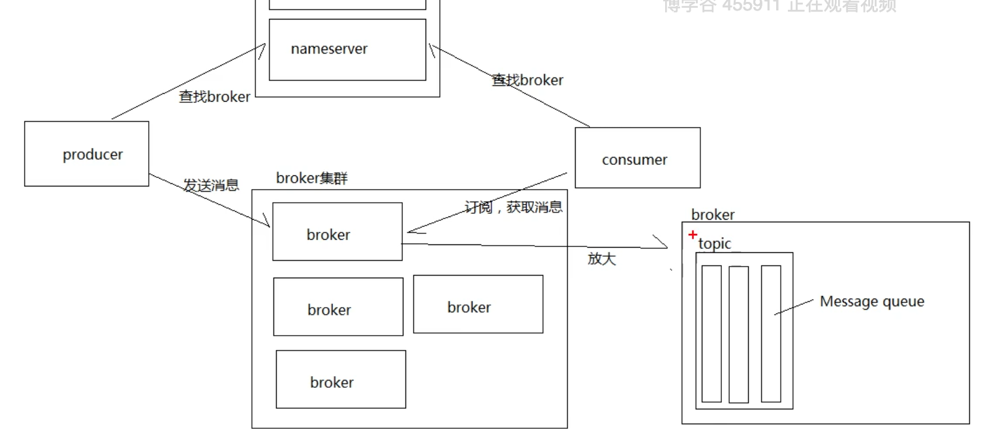
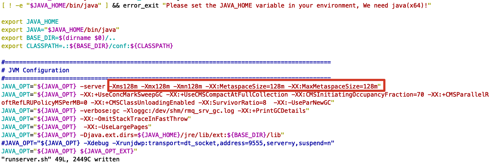
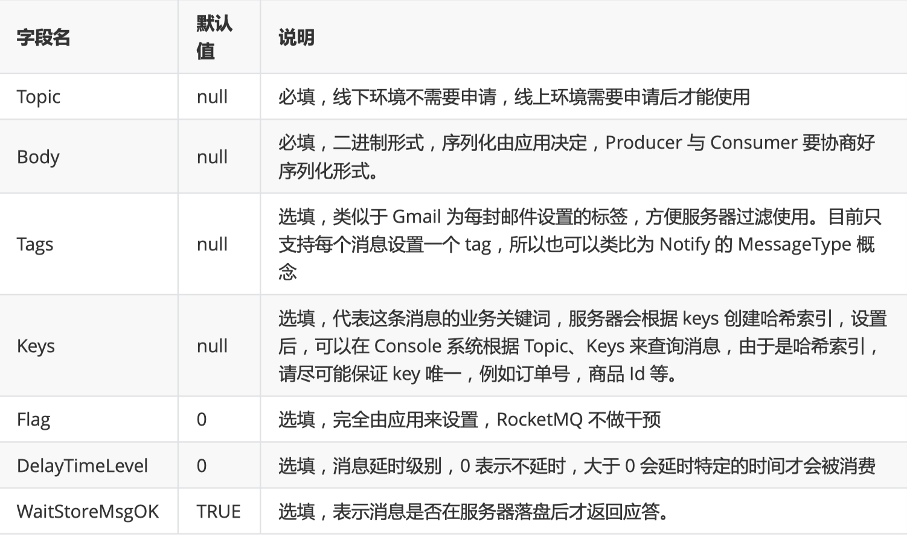
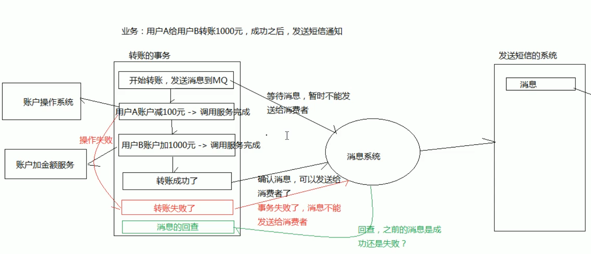
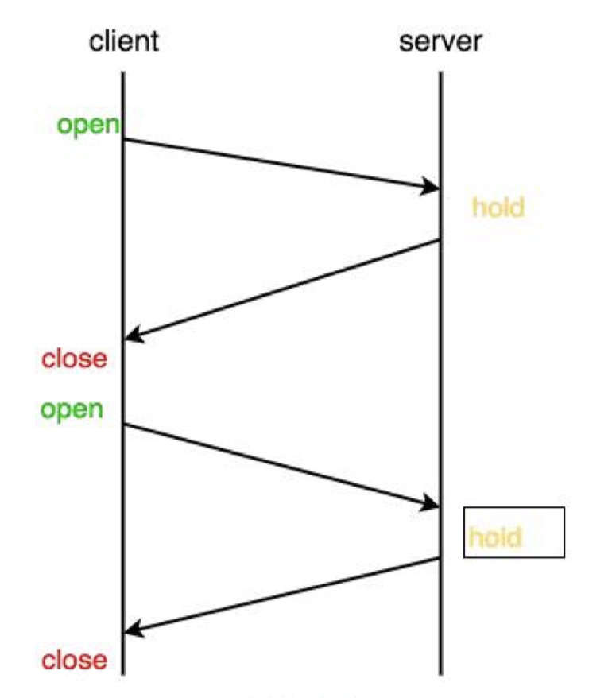
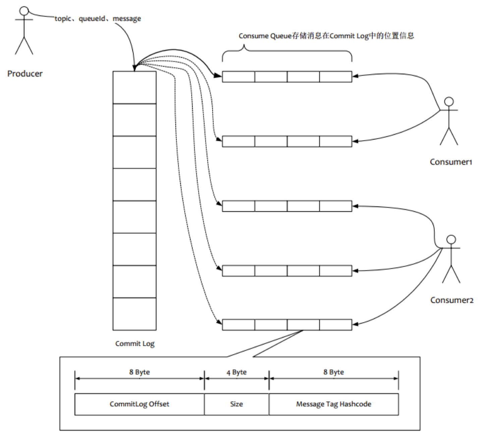
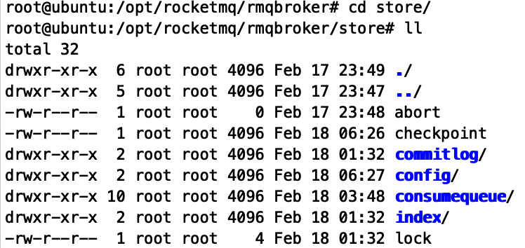
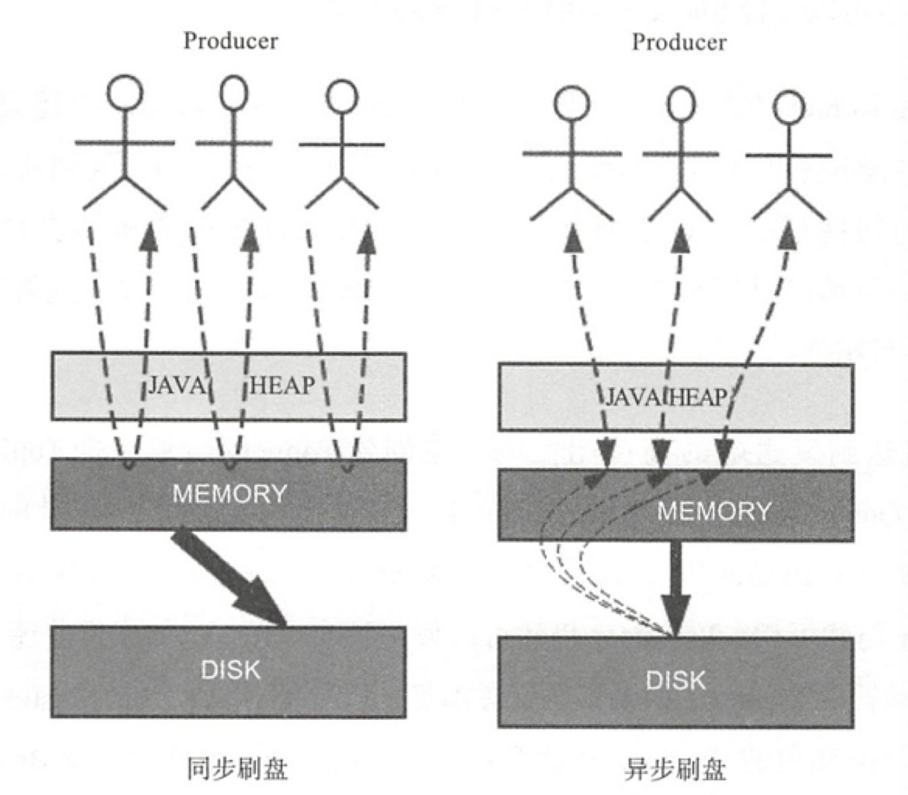

# 09-RocketMQ

# 1.RocketMQ简介与安装

## 1.1.RocketMQ简介

Apache RocketMQ是一个采用Java语言开发的分布式的消息系统，由阿里巴巴团队开发，与2016年底共享给Apache，成为Apache的一个顶级项目。

在阿里内部，RocketMQ很好地服务了集团大大小小上千个应用，在每年双十一当天，更有不可思议的万亿级消息通过RocketMQ流转（在2017年双十一当天，整个阿里巴巴集团通过RocketMQ流转的线上消息达到了万亿级，峰值TPS达到5600万），在阿里大中台策略上发挥着举足轻重的作用。

## 1.2.RocketMQ核心概念

* Producer
  * 消息生产者，负责生产消息，一般由业务系统负责生产消息。
  * Producer Group：一类Producer的集合名称，这类Producer通常发送一类消息，且发送逻辑一致。
* Consumer
  * 消息消费者，负责消费消息，一般是后台系统负责异步消费。
  * Push Consumer：服务端向消费者推送消息。
  * Pull Consumer：消费端向服务定时拉取消息。
  * Consumer Group：一类Consumer的集合名称，这类Consumer通常消费一类消息，且消费逻辑一致。
* NameServer
  * 集群架构中的组织协调员。
  * 收集broker的工作情况。
  * 不负责消息的处理。
* Broker
  * 是RocketMQ的核心。负责消息的发送，接收，高可用等（真正干活的）。
  * 需要定时发送自身情况到NameServer，默认10s发送一次，超时2分钟会认为该broker失效。
* Topic
  * 不同类型的消息以不同的Topic名称进行区分，如User，Order等。
  * 是逻辑概念
  * Message Queue：消息队列，用于存储消息。

## 1.3.部署安装

### 1.3.1.非Docker安装

~~~shell
#选择安装目录，我这里选择的是 /usr/local/mySoftWare
unzip rocketmq-all-4.3.2-bin-release.zip
cd rocketmq-all-4.3.2-bin-release.zip

#启动nameserver
bin/mqnamesrv
#The Name Server boot success. serializeType=JSON表示启动成功

#启动broker
bin/mqbroker -n 172.16.124.131:9876 # -n 指定nameserver地址和端口。
#Java HotSpot(TM) 64-Bit Server VM warning: INFO: os::commit_memory(0x00000005c0000000, 8589934592, 0) failed; error='Cannot allocate memory' (errno=12)
#启动失败，是因为内存不够，导致启动失败，原因：RocketMQ的默认配置是生产环境的配置，设置JVM的内存大小只比较大，需要调整默认值。
~~~

修改runserver.sh

~~~shell
cd bin/
vim runserver.sh
~~~

修改runbroker.sh

~~~shell
vim runbroker.sh
~~~

重新启动

~~~shell
bin/mqbroker -n 172.16.124.131:9876
# The broker[ubuntu, 172.17.0.1:10911] boot success. serializeType=JSON and name server is 172.16.124.131:9876 
# 启动成功
~~~

下面我们可以进行发送消息进行测试

~~~shell
export NAMESRV_ADDR=127.0.0.1:9876
cd bin/
sh tools.sh org.apache.rocketmq.example.quickstart.Producer
~~~

可以发现消息发送成功

接收消息进行测试

~~~shell
sh tools.sh org.apache.rocketmq.example.quickstart.Consumer
~~~

### 1.3.2.通过Java代码进行测试

**第一步:导入依赖**

~~~xml
<?xml version="1.0" encoding="UTF-8"?>
<project xmlns="http://maven.apache.org/POM/4.0.0"
         xmlns:xsi="http://www.w3.org/2001/XMLSchema-instance"
         xsi:schemaLocation="http://maven.apache.org/POM/4.0.0 http://maven.apache.org/xsd/maven-4.0.0.xsd">
    <modelVersion>4.0.0</modelVersion>

    <groupId>org.example</groupId>
    <artifactId>demo-rocketmq</artifactId>
    <version>1.0-SNAPSHOT</version>

    <dependencies>
        <dependency>
            <groupId>org.apache.rocketmq</groupId>
            <artifactId>rocketmq-client</artifactId>
            <version>4.3.2</version>
        </dependency>
    </dependencies>

    <build>
        <plugins>
            <!-- java编译插件 -->
            <plugin>
                <groupId>org.apache.maven.plugins</groupId>
                <artifactId>maven-compiler-plugin</artifactId>
                <version>3.2</version>
                <configuration>
                    <source>1.8</source>
                    <target>1.8</target>
                    <encoding>UTF-8</encoding>
                </configuration>
            </plugin>
        </plugins>
    </build>
</project>
~~~

**第二步:编写测试**

~~~Java
package org.fechin.rocketmq;

import org.apache.rocketmq.client.producer.DefaultMQProducer;
import org.apache.rocketmq.client.producer.SendResult;
import org.apache.rocketmq.common.message.Message;
import org.apache.rocketmq.remoting.common.RemotingHelper;

public class SyncProducer {
    public static void main(String[] args) throws Exception {
        //Instantiate with a producer group name.
        DefaultMQProducer producer = new
                DefaultMQProducer("test-group");
        // Specify name server addresses.
        producer.setNamesrvAddr("172.16.124.131:9876");
        //Launch the instance.
        producer.start();
        for (int i = 0; i < 100; i++) {
            //Create a message instance, specifying topic, tag and message body.
            Message msg = new Message("TopicTest11", "TagA",
                    ("Hello RocketMQ " + i).getBytes(RemotingHelper.DEFAULT_CHARSET) /* Message body */);
            //Call send message to deliver message to one of brokers.
            SendResult sendResult = producer.send(msg);
            System.out.printf("%s%n", sendResult);
        }
    }
}
~~~

**第三步:进行测试**

原因解析：我们在启动的时候可以发现broker的ip地址是`172.17.0.1`那么在开发及上是不可能访问到的。

所以我们需要指定broker的ip地址

~~~shell
#创建broker的配置文件
mkdir /usr/local/mySoftware/rocketmq-file/rmqbroker/conf/ -p
cd /usr/local/mySoftware/rocketmq-file/rmqbroker/conf
vim ./broker.conf

#在broker.conf中新增加如下内容
brokerIP1=172.16.124.131
namesrvAddr=172.16.124.131:9876
brokerName=haoke_broker_wetalker

#启动broker，通过 -c 指定配置文件
./mqbroker -c /usr/local/mySoftware/rocketmq-file/rmqbroker/conf/broker.conf 
#The broker[haoke_broker_wetalker, 172.16.124.131:10911] boot success.serializeType=JSON and name server is 172.16.124.131:9876
#我们就可以发现broker的地址已经改变了。

~~~

这时候我们再次启动测试程序：

成功！

### 1.3.3.Docker安装

~~~shell
docker pull foxiswho/rocketmq:server-4.3.2
docker pull foxiswho/rocketmq:broker-4.3.2

#创建nameserver容器
docker create -p 9876:9876 --name rmqserver \
-e "JAVA_OPT_EXT=-server -Xms128m -Xmx128m -Xmn128m" \
-e "JAVA_OPTS=-Duser.home=/opt" \
-v /opt/rocketmq/rmqserver/logs:/opt/logs \
-v /opt/rocketmq/rmqserver/store:/opt/store \
foxiswho/rocketmq:server-4.3.2

#创建broker容器(这里的broker.conf与之前的配置文件是一样的)
#10911是与消费者生产者通信的端口，10909是做主从复制的端口
docker create -p 10911:10911 -p 10909:10909 --name rmqbroker \
-e "JAVA_OPTS=-Duser.home=/opt" \
-e "JAVA_OPT_EXT=-server -Xms128m -Xmx128m -Xmn128m" \
-v /opt/rocketmq/rmqbroker/conf/broker.conf:/etc/rocketmq/broker.conf \
-v /opt/rocketmq/rmqbroker/logs:/opt/logs \
-v /opt/rocketmq/rmqbroker/store:/opt/store \
foxiswho/rocketmq:broker-4.3.2

#启动两个容器
docker start rmqserver rmqbroker
~~~

### 1.3.4.部署RocketMQ的管理工具

RocketMQ提供了UI管理工具，名为rocketmq-console，项目地址：https://github.com/apache/rocketmq-externals/tree/master/rocketmq-console

该工具支持docker或非docker安装。我们选择docker安装

~~~shell
docker pull styletang/rocketmq-console-ng:1.0.0

#创建并启动容器
docker run -e "JAVA_OPTS=-Drocketmq.namesrv.addr=172.16.124.131:9876 -Dcom.rocketmq.sendMessageWithVIPChannel=false" -p 8082:8080 -t styletang/rocketmq-console-ng:1.0.0
~~~

# 2.RocketMQ HelloWorld

## 2.1.创建Topic

~~~java
package org.fechin.rocketmq.topic;

import org.apache.rocketmq.client.exception.MQClientException;
import org.apache.rocketmq.client.producer.DefaultMQProducer;

/**
 * @Author:朱国庆
 * @Date：2020/2/18 16:15
 * @Desription: haoke-manage
 * @Version: 1.0
 */
public class ToicDemo {
    public static void main(String[] args) {
        DefaultMQProducer producer = new DefaultMQProducer("haoke");

        //设置nameserver的地址
        producer.setNamesrvAddr("172.16.124.131:9876");

        //启动生产者
        try {
            producer.start();
            /*这里的key的haoke_broker_wetalker就是我们在broker.conf中配置的内容*/
            producer.createTopic("haoke_broker_wetalker","my-topic",4);
        } catch (MQClientException e) {
            e.printStackTrace();
        }
        System.out.println("topic创建成功");
        producer.shutdown();
    }
}
~~~

执行完毕即可成功创建Topic，该Topic的名字是“my-topic”

## 2.2.同步发送消息

~~~java
package org.fechin.rocketmq.sendmsg;

import org.apache.rocketmq.client.producer.DefaultMQProducer;
import org.apache.rocketmq.client.producer.SendResult;
import org.apache.rocketmq.common.message.Message;

/**
 * @Author:朱国庆
 * @Date：2020/2/18 16:23
 * @Desription: haoke-manage
 * @Version: 1.0
 */
public class SyncProducer {
    public static void main(String[] args) throws Exception{
        DefaultMQProducer producer = new DefaultMQProducer("haoke");
        //设置nameserver的地址
        producer.setNamesrvAddr("172.16.124.131:9876");
        producer.start();

        String msg = "神头鬼脸";
        Message message = new Message("my-topic","mytags",msg.getBytes("UTF-8"));
        SendResult sendResult = producer.send(message);
        System.out.println("消息id:"+sendResult.getMsgId());
        System.out.println("消息队列:"+sendResult.getMessageQueue());
        System.out.println("sendResult"+sendResult);

        producer.shutdown();
    }
}
~~~

打印的结果为：

Message对象的数据结构：

## 2.3.异步发送消息

~~~java
package org.fechin.rocketmq.sendmsg;

import org.apache.rocketmq.client.producer.DefaultMQProducer;
import org.apache.rocketmq.client.producer.SendCallback;
import org.apache.rocketmq.client.producer.SendResult;
import org.apache.rocketmq.common.message.Message;

/**
 * @Author:朱国庆
 * @Date：2020/2/18 16:49
 * @Desription: haoke-manage
 * @Version: 1.0
 */
public class AsyncProducer {
    public static void main(String[] args) throws Exception{
        DefaultMQProducer producer = new DefaultMQProducer("haoke");
        //设置nameserver的地址
        producer.setNamesrvAddr("172.16.124.131:9876");
        producer.start();

        //发送消息
        String msg = "异步发送神头鬼脸";
        Message message = new Message("my-topic",msg.getBytes("UTF-8"));
        producer.send(message, new SendCallback() {
            @Override
            public void onSuccess(SendResult sendResult) {
                System.out.println("发送成功:"+sendResult);
            }

            @Override
            public void onException(Throwable e) {
                System.out.println("消息发送失败:"+e);
            }
        });

        //producer.shutdown();
    }
}

~~~

**注意：producer.shutdown()要注释掉，否则消息发送失败。原因是：异步发送，还未来得及发送成功就被关闭了。**

## 2.4.消费消息

~~~java
package org.fechin.rocketmq.consumer;

import org.apache.rocketmq.client.consumer.DefaultMQPushConsumer;
import org.apache.rocketmq.client.consumer.listener.ConsumeConcurrentlyContext;
import org.apache.rocketmq.client.consumer.listener.ConsumeConcurrentlyStatus;
import org.apache.rocketmq.client.consumer.listener.MessageListenerConcurrently;
import org.apache.rocketmq.client.producer.DefaultMQProducer;
import org.apache.rocketmq.common.message.MessageExt;

import java.io.UnsupportedEncodingException;
import java.util.List;

/**
 * @Author:朱国庆
 * @Date：2020/2/18 16:59
 * @Desription: haoke-manage
 * @Version: 1.0
 */
public class ConsumerDemo {
    public static void main(String[] args) throws Exception{
        DefaultMQPushConsumer consumer = new DefaultMQPushConsumer("haoke-consumer");
        consumer.setNamesrvAddr("172.16.124.131:9876");

      	//订阅topic，接收此Topic下所有的消息
      	//当然它的第二个参数：subscription expression.it only support or operation such as "tag1 || tag2 || tag3"
        consumer.subscribe("my-topic","*");

        consumer.registerMessageListener(new MessageListenerConcurrently() {
            @Override
            public ConsumeConcurrentlyStatus consumeMessage(List<MessageExt> msgs, ConsumeConcurrentlyContext context) {
                System.out.println("接收到消息->"+msgs);
                for (MessageExt msg : msgs) {
                    try {
                        System.out.println("消息:"+new String(msg.getBody(),"UTF-8"));
                    } catch (UnsupportedEncodingException e) {
                        e.printStackTrace();
                    }
                }
                return ConsumeConcurrentlyStatus.CONSUME_SUCCESS;
            }
        });

        consumer.start();
    }
}
~~~

## 2.5.消息过滤器

RocketMQ支持根据用户自定义属性进行过滤，过滤表达式类似于SQL的where，如 `a>5 AND b='123'`;

**消息生产方**

~~~java
package org.fechin.rocketmq.filter;

import org.apache.rocketmq.client.producer.DefaultMQProducer;
import org.apache.rocketmq.client.producer.SendResult;
import org.apache.rocketmq.common.message.Message;

public class SyncProducer {

    public static void main(String[] args) throws Exception {
        DefaultMQProducer producer = new DefaultMQProducer("haoke");

        producer.setNamesrvAddr("172.16.124.131:9876");

        producer.start();

        //发送消息
        String msg = "这是一个用户的消息, id = 1003";
        Message message = new Message("my-topic-filter", "tag1", msg.getBytes("UTF-8"));
        //这里设置的属性根消息本身并没有关系
        message.putUserProperty("sex","男");
        message.putUserProperty("age","20");
        SendResult sendResult = producer.send(message);
        System.out.println("消息id：" + sendResult.getMsgId());
        System.out.println("消息队列：" + sendResult.getMessageQueue());
        System.out.println("消息offset值：" + sendResult.getQueueOffset());
        System.out.println(sendResult);

        producer.shutdown();
    }
}

~~~

**消息消费方**

~~~java
package org.fechin.rocketmq.filter;

import org.apache.rocketmq.client.consumer.DefaultMQPushConsumer;
import org.apache.rocketmq.client.consumer.MessageSelector;
import org.apache.rocketmq.client.consumer.listener.ConsumeConcurrentlyContext;
import org.apache.rocketmq.client.consumer.listener.ConsumeConcurrentlyStatus;
import org.apache.rocketmq.client.consumer.listener.MessageListenerConcurrently;
import org.apache.rocketmq.common.message.MessageExt;

import java.io.UnsupportedEncodingException;
import java.util.List;

public class ConsumerFilter {

    public static void main(String[] args) throws Exception {
        DefaultMQPushConsumer consumer = new DefaultMQPushConsumer("haoke-consumer");
        consumer.setNamesrvAddr("172.16.124.131:9876");

        // 订阅消息，接收的是所有消息
        consumer.subscribe("my-topic-filter", MessageSelector.bySql("sex='女' AND age>=18"));

        consumer.registerMessageListener(new MessageListenerConcurrently() {
            @Override
            public ConsumeConcurrentlyStatus consumeMessage(List<MessageExt> msgs,
                                                            ConsumeConcurrentlyContext context) {
                try {
                    for (MessageExt msg : msgs) {
                        System.out.println("消息:" + new String(msg.getBody(), "UTF-8"));
                    }
                } catch (UnsupportedEncodingException e) {
                    e.printStackTrace();
                }

                System.out.println("接收到消息 -> " + msgs);
                return ConsumeConcurrentlyStatus.CONSUME_SUCCESS;
            }
        });

        // 启动消费者
        consumer.start();

    }
}

~~~

测试报错：

原因是broker的默认配置不支持自定义属性，需要设置开启。

~~~shell
enablePropertyFilter=true
~~~

# 3.Producer

## 3.1.顺序消息

在某些业务中，consumer在消费消息时候，是按照生产者发送消息的顺序进行消费的，比如在电商系统中，订单的消息会有创建订单，订单支付，订单完成，如果消息的顺序发生改变，那么这样的消息就没有意义了。

**1.生产者**

~~~java
package org.fechin.rocketmq.order;

import org.apache.rocketmq.client.producer.DefaultMQProducer;
import org.apache.rocketmq.client.producer.SendResult;
import org.apache.rocketmq.common.message.Message;
import org.apache.rocketmq.remoting.common.RemotingHelper;

public class OrderProducer {

    public static void main(String[] args) throws Exception {
        DefaultMQProducer producer = new DefaultMQProducer("HAOKE_ORDER_PRODUCER");
        producer.setNamesrvAddr("172.16.124.131:9876");
        producer.start();
        for (int i = 0; i < 100; i++) {
            // 模拟生成订单id
            int orderId = i % 10;
            String msgStr = "order --> " + i + ", id = " + orderId;
            Message message = new Message("haoke_order_topic", "ORDER_MSG", msgStr.getBytes(RemotingHelper.DEFAULT_CHARSET));
            /**
             * producer.send的第二个参数就是:MessageQueueSelector
             * mgs:List<MessageQueue>,默认的话就是4
             * msg:Message
             * arg:Object
             * Producer.send的第三个参数就会传递给MessageQueueSelector的第三个参数arg.
             */
            SendResult sendResult = producer.send(message, (mqs, msg, arg) -> {
                Integer id = (Integer) arg;
                int index = id % mqs.size();
                //我们需要返回的是选择的哪个MessageQueue?
                return mqs.get(index);
            }, orderId);
            System.out.println(sendResult);
        }
        producer.shutdown();
    }

}
~~~

**2.消费者**

~~~java
package org.fechin.rocketmq.order;

import org.apache.rocketmq.client.consumer.DefaultMQPushConsumer;
import org.apache.rocketmq.client.consumer.listener.ConsumeOrderlyContext;
import org.apache.rocketmq.client.consumer.listener.ConsumeOrderlyStatus;
import org.apache.rocketmq.client.consumer.listener.MessageListenerOrderly;
import org.apache.rocketmq.common.message.MessageExt;

import java.io.UnsupportedEncodingException;
import java.util.List;

public class OrderConsumer {
    public static void main(String[] args) throws Exception {
        DefaultMQPushConsumer consumer = new
                DefaultMQPushConsumer("HAOKE_ORDER_CONSUMER");
        consumer.setNamesrvAddr("172.16.124.131:9876");
        consumer.subscribe("haoke_order_topic", "*");
        consumer.registerMessageListener(new MessageListenerOrderly() {
            @Override
            public ConsumeOrderlyStatus consumeMessage(List<MessageExt> msgs,
                                                       ConsumeOrderlyContext context) {
                for (MessageExt msg : msgs) {
                    try {
                        System.out.println("currentThread:"+Thread.currentThread().getName()
                                + "--- queueId:" + msg.getQueueId()
                                + "--- Message:" + new String(msg.getBody(),"UTF-8"));
                    } catch (UnsupportedEncodingException e) {
                        e.printStackTrace();
                    }
                }
                return ConsumeOrderlyStatus.SUCCESS;
            }
        });
        consumer.start();
    }
}
~~~

## 3.2.分布式事务消息

随着项目越来越复杂，越来越服务化，就会导致系统间的事务问题，这个就是分布式事务问题。

分布式事务有这几种：

* 基于单个JVM,数据库拆分了；
* 基于多个JVM,服务拆分,但是不跨越数据库；
* 基于多个JVM,服务拆分,并且数据库分库分表了。

解决分布式事务的问题的方案有很多种，使用消息实现只是其中一种。

### 3.2.1.原理

**Half(Prepare) Message**

指的是暂不能投递的消息，发送方已经将消息成功发送到了MQ服务端，但是服务端未收到生产者对该消息的二次确认，此时该消息被标记为“暂不能投递”状态，处于这种状态下的消息即半消息。

**Message Status Check**

由于网络闪断，生产者应用重启等原因，导致某条事务消息的二次确认丢失，MQ服务端通过扫描发现某条消息长期处于“半消息”时候，需要主动向消息生产者询问该消息的最终状态（Commit或者Rollback），该过程即消息回查。

### 3.2.2.执行流程

1. 发送方向MQ服务器发送消息；
2. MQ Server将消息持久化成功后，向发送方ACK确认消息已经发送成功，此时消息为半消息；
3. 发送方开始执行本地事务逻辑；
4. 发送方根据本地事务执行结果向MQ Server提交二次确认，MQ Server收到Commit状态则将半消息标记为扣投递，订阅方最终将收到该消息；MQ Server收到Rollback状态则删除办消息，订阅方将不会收到该消息；
5. 在断网或者是应用重启的特殊情况下，上述步骤4提交的二次确认最终未到达MQ Server，经过固定时间后MQ Server将对该消息发起消息回查；
6. 发送方收到消息回查后，需要检查对应消息的本地事务执行的最红结果。
7. 发送方根据检查得到的本地事务的最终状态再次提交二次确认，MQ Server仍然按照步骤4对半消息进行操作。

### 3.2.3.生产者代码

~~~java
package org.fechin.rocketmq.transaction;

import org.apache.rocketmq.client.producer.TransactionMQProducer;
import org.apache.rocketmq.common.message.Message;

public class TransactionProducer {
    public static void main(String[] args) throws Exception {

        TransactionMQProducer producer = new
                TransactionMQProducer("transaction_producer");
        producer.setNamesrvAddr("172.16.124.131:9876");

        // 设置事务监听器
        producer.setTransactionListener(new TransactionListenerImpl());
        producer.start();

        // 发送消息
        Message message = new Message("pay_topic", "用户A给用户B转账500元".getBytes("UTF-8"));
        producer.sendMessageInTransaction(message, null);

        Thread.sleep(999999);
        producer.shutdown();
    }
}
~~~

### 3.2.4.本地事务处理代码

~~~java
package org.fechin.rocketmq.transaction;

import org.apache.rocketmq.client.producer.LocalTransactionState;
import org.apache.rocketmq.client.producer.TransactionListener;
import org.apache.rocketmq.common.message.Message;
import org.apache.rocketmq.common.message.MessageExt;

import java.util.HashMap;
import java.util.Map;

public class TransactionListenerImpl implements TransactionListener {

    private static Map<String, LocalTransactionState> STATE_MAP = new HashMap<>();

    /**
     * 执行具体的业务逻辑
     *
     * @param msg 发送的消息对象
     * @param arg
     * @return
     */
    @Override
    public LocalTransactionState executeLocalTransaction(Message msg, Object arg) {
        try {
            System.out.println("用户A账户减500元.");
            //模拟调用服务
            Thread.sleep(500);

            //System.out.println(1/0);

            System.out.println("用户B账户加500元.");
            Thread.sleep(800);

            STATE_MAP.put(msg.getTransactionId(), LocalTransactionState.COMMIT_MESSAGE);

            // 二次提交确认
            //return LocalTransactionState.UNKNOW;
            return LocalTransactionState.COMMIT_MESSAGE;
        } catch (Exception e) {
            e.printStackTrace();
        }
        STATE_MAP.put(msg.getTransactionId(), LocalTransactionState.ROLLBACK_MESSAGE);
        // 回滚
        return LocalTransactionState.ROLLBACK_MESSAGE;
    }

    /**
     * 消息回查
     *
     * @param msg
     * @return
     */
    @Override
    public LocalTransactionState checkLocalTransaction(MessageExt msg) {
        System.out.println("状态回查 ---> " + msg.getTransactionId() + " " + STATE_MAP.get(msg.getTransactionId()));
        return STATE_MAP.get(msg.getTransactionId());
    }
}
~~~

### 3.2.5.消费者代码

~~~java
package org.fechin.rocketmq.transaction;

import org.apache.rocketmq.client.consumer.DefaultMQPushConsumer;
import org.apache.rocketmq.client.consumer.listener.ConsumeConcurrentlyContext;
import org.apache.rocketmq.client.consumer.listener.ConsumeConcurrentlyStatus;
import org.apache.rocketmq.client.consumer.listener.MessageListenerConcurrently;
import org.apache.rocketmq.common.message.MessageExt;

import java.io.UnsupportedEncodingException;
import java.util.List;

public class TransactionConsumer {
    public static void main(String[] args) throws Exception {
        DefaultMQPushConsumer consumer = new
                DefaultMQPushConsumer("HAOKE_CONSUMER");
        consumer.setNamesrvAddr("172.16.124.131:9876");

        // 订阅topic，接收此Topic下的所有消息
        consumer.subscribe("pay_topic", "*");
        consumer.registerMessageListener(new MessageListenerConcurrently() {
            @Override
            public ConsumeConcurrentlyStatus consumeMessage(List<MessageExt> msgs,
                                                            ConsumeConcurrentlyContext context) {
                for (MessageExt msg : msgs) {
                    try {
                        System.out.println(new String(msg.getBody(), "UTF-8"));
                    } catch (UnsupportedEncodingException e) {
                        e.printStackTrace();
                    }
                }
                return ConsumeConcurrentlyStatus.CONSUME_SUCCESS;
            }
        });
        consumer.start();
    }
}
~~~

# 4.Consumer

## 4.1.push和pull模式

在RocketMQ中，消费者有两种模式，一种是push模式，另一种是pull模式。

> push模式：客户端与服务端建立连接后，当服务端有消息时候，将消息推送到客户端。
>
> pull模式：客户端不断的轮询请求服务端，来获取新的消息。

但是在具体实现时，Push和Pull模式都是采用消费端主动拉取的方式，即consumer轮询从broker拉取消息。

> 区别：
>
> push模式：consumer把轮询过程封装了，并注册MessageListener监听器，取到消息后，唤醒MessageListener的consumeMessage()来消费，对用户而言，感觉消息是被推送过来的。
>
> pull模式：取消息的过程需要用户自己写，首先通过打算消费的Topic拿到MessageQueue的集合，遍历MessageQueue集合，然后针对每个MessageQueue批量取消息，一次取完后，记录该队列下一次要取的开始offset，直到取完了，再换另一个MessageQueue。

既然是采用pull方式实现，RocketMQ如何保证消息的实时性呢？可以使用长轮询。

### 4.1.1.长轮询

RocketMQ中采用了长轮询的方式实现，什么是长轮询呢？

> 长轮询即是在请求的过程中，若是服务器数据并没有更新，那么则将这个连接挂起，直到服务器推送新的数据，再返回，然后进入循环周期。
>
> 客户端像传统轮询一样从服务端请求数据，服务端会阻塞请求不会立刻返回，直到有数据或超时才返回给客户端，然后关闭连接，客户端处理完响应信息后再向服务器发送新的请求。

## 4.2.消息模式

DefaultMQPushConsumer实现了自动保存offset值以及实现多个consumer的负载均衡；

~~~java
//设置组名
DefaultMQPushConsumer consumer = new DefaultMQPushConsumer("HAOKE_IM");
~~~

通过groupname将多个consumer组合在一起，那么就会存在一个问题，消息发送到这个组后，消息怎么分配？这个时候，就需要指定消息模式，分别有集群和广播模式。

* 集群模式
  * 同一个ConsumerGroup(GroupName相同)里的每个Consumer只消费所订阅消息的一部分内容，同一个ConsumerGroup里所有的Consumer消费的内容合起来才是所订阅Topic内容的整体，从而达到负载均衡的目的。
* 广播模式
  * 同一个ConsumerGroup里的每个Consumer都能消费到所订阅Topic和全部消息，也就是一个消息会被多次分发，被多个Consumer消费。

~~~java
//集群模式
consumer.setMessageModel(MessageModel.CLUSTERING);
//广播模式
consumer.setMessageModel(MessageModel.BROADCASTING);
~~~

通过查看源码我们可以看到DefaultMQPushConsumer默认是集群模式。

## 4.3.重复消息的解决方案

造成消息重复的根本原因是：网络不可达。只要通过交换数据，就无法避免这个问题。所以解决这个问题的办法就是绕过这个问题。那么问题就变成了：如果消费端收到两条一样的消息，应该怎么处理？

1. 消费端处理消息的业务逻辑保持幂等性（无论执行多少次结果都是一样的）。
2. 保证每条消费都有唯一编号且保证消息处理成功与去重表的日志同时出现。

第1条很好理解，只要保持幂等性，不管来多少条重复消息，最后处理的结果都一样。第2条原理就是利用一张日志表来记录已经处理成功的消息的ID,如果新到的消息ID已经在日志表中，那么就不再处理这条消息。

第1条解决方案，很明显应该在消费端实现，不属于消息系统要实现的功能。第2条可以消息系统实现，也可以业务端实现。正常情况下出现重复消息的概率其实很小，如果由消息系统来实现的话，肯定会对消息系统的吞吐量和高可用有影响，所以最好还是由业务端自己处理消息重复的问题，这也是RocketMQ不解决消息重复的问题的原因。

**RocketMQ不保证消息不重复，如果你的业务需要保证严格的不重复消息，需要你自己在业务端去重。**

# 5.RocketMQ存储机制

RocketMQ中的消息数据存储，采用了零拷贝技术(使用mmap+write方式)，文件系统采用Linux Ext4文件系统进行存储。

## 5.1.消息数据的存储

在RocketMQ中，消息数据是保存在磁盘文件中，为了保证写入的性能，RocketMQ尽可能保证顺序写入，顺序写入的效率比随机写入的效率高很多。

RocketMQ的存储是由ConsumerQueue和CommitLog配合完成的，CommitLog是真正存储数据的文件，ConsumerQueue是索引文件，存储数据指向到物理文件的配置。

如上图所示：

* 消息主体以及元数据都存储在CommitLog当中；
* Consume Queue是一个逻辑队列，存储了这个Queue在CommitLog中的其实offset，log大小和MessageTag的hashCode;
* 每次读取消息队列先读取consumerQueue,然后在通过consumerQueue去commitLog中拿到消息主体。

具体的目录结构如下:

## 5.2.同步刷盘与异步刷盘

RocketMQ为了提高性能，会尽可能地保证磁盘的顺序写。消息在通过Producer写入RocketMQ的时候，有两种写磁盘方式，分别是同步刷盘与异步刷盘。

* 同步刷盘
  * 在返回写成功状态时，消息已经被写入磁盘；
  * 具体流程是：消息写入内存的PAGECACHE后，立刻通知刷盘线程刷盘，然后等待刷盘完成，刷盘线程执行完后唤醒等待的线程，返回消息写成功的状态。
* 异步刷盘
  * 在返回写成功状态时，消息可能只是被写入了内存的PAGECACHE，写操作的返回快，吞吐量达；
  * 当内存里的消息量积累到一定程度时，统一出发写磁盘动作，快速写入。

* broker配置文件中指定刷盘方式

  * `flushDiskType=ASYNC_FLUSH`  --异步
  * `flushDiskType=SYNC_FLUSH`  --同步

  

