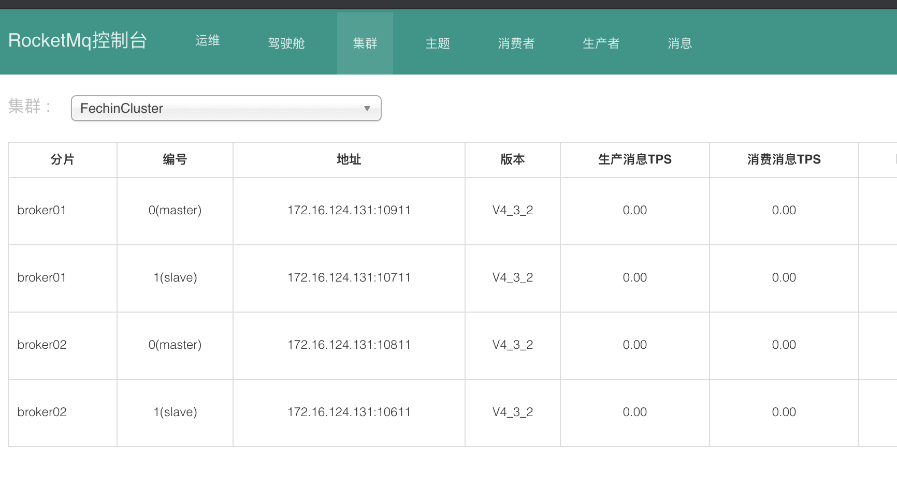
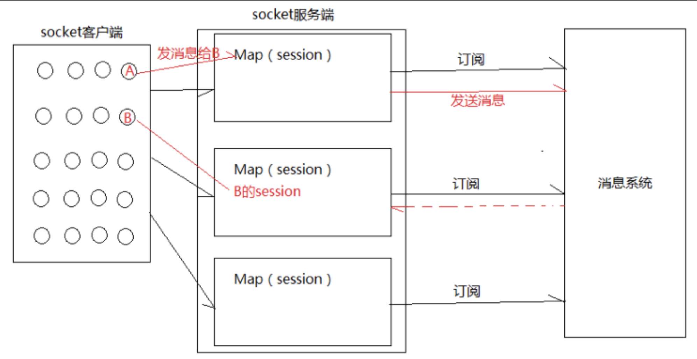

# 10-RocketMQ集群,分布式WebSocket及地图找房功能实现

# 1.RocketMQ错误消息重试策略

在消息的发送和消费的过程中，都有可能出现错误，如网络异常等，出现了错误就需要进行错误重试，这种消息的重试分两种，分别是producer端重试和consumer端重试。

## 1.1.Producer端重试

生产者端的消息失败，也就是Producer往MQ上发消息没有发送成功，比如网络抖动导致生产者发送消息到MQ失败。

~~~java
package org.fechin.rocketmq.retry;

import org.apache.rocketmq.client.producer.DefaultMQProducer;
import org.apache.rocketmq.client.producer.SendResult;
import org.apache.rocketmq.common.message.Message;
import org.apache.rocketmq.remoting.common.RemotingHelper;

public class SyncProducer {

    public static void main(String[] args) throws Exception {
        DefaultMQProducer producer = new DefaultMQProducer("HAOKE_IM");
        producer.setNamesrvAddr("172.16.124.131:9876");

        //消息发送失败时，重试3次
        producer.setRetryTimesWhenSendFailed(3);

        producer.start();
        String msgStr = "用户A发送消息给用户B";
        Message msg = new Message("my-test-topic", "SEND_MSG",
                msgStr.getBytes(RemotingHelper.DEFAULT_CHARSET));

        // 发送消息,并且指定超时时间
        SendResult sendResult = producer.send(msg, 1000);

        System.out.println("消息状态：" + sendResult.getSendStatus());
        System.out.println("消息id：" + sendResult.getMsgId());
        System.out.println("消息queue：" + sendResult.getMessageQueue());
        System.out.println("消息offset：" + sendResult.getQueueOffset());
        System.out.println(sendResult);

        producer.shutdown();
    }
}
~~~

## 1.2.Consumer端重试

消费者端的失败，分为2种情况，一个是exception,一个是timeout

### 1.2.1.exception

消息正常到了消费者，结果消费者发生了异常，处理失败了。例如反序列化失败，消息数据本身无法处理（例如话费充值，当前消息的手机号被注销，无法充值等）。

~~~java
package org.fechin.rocketmq.retry;

import org.apache.rocketmq.client.consumer.DefaultMQPushConsumer;
import org.apache.rocketmq.client.consumer.listener.ConsumeConcurrentlyContext;
import org.apache.rocketmq.client.consumer.listener.ConsumeConcurrentlyStatus;
import org.apache.rocketmq.client.consumer.listener.MessageListenerConcurrently;
import org.apache.rocketmq.common.message.MessageExt;

import java.io.UnsupportedEncodingException;
import java.util.List;

public class ConsumerDemo {

    public static void main(String[] args) throws Exception {
        DefaultMQPushConsumer consumer = new DefaultMQPushConsumer("HAOKE_IM");
        consumer.setNamesrvAddr("172.16.124.131:9876");
        // 订阅topic，接收此Topic下的所有消息
        consumer.subscribe("my-test-topic", "*");

        consumer.registerMessageListener(new MessageListenerConcurrently() {
            @Override
            public ConsumeConcurrentlyStatus consumeMessage(List<MessageExt> msgs,
                                                            ConsumeConcurrentlyContext context) {
                for (MessageExt msg : msgs) {
                    try {
                        System.out.println(new String(msg.getBody(), "UTF-8"));
                    } catch (UnsupportedEncodingException e) {
                        e.printStackTrace();
                    }
                }

                System.out.println("收到消息->" + msgs);
                if(msgs.get(0).getReconsumeTimes() >= 3){
                    // 重试3次后，不再进行重试
                    return ConsumeConcurrentlyStatus.CONSUME_SUCCESS;
                }

                return ConsumeConcurrentlyStatus.RECONSUME_LATER;
            }
        });
        consumer.start();
    }

}
~~~

如果消息返回的状态为失败会怎么样呢？在启动broker的日志中可以看到这样的信息

这个表示，如果消息消费失败，那么消息将会在1s，5s，10s后重试，一直到2h后不再重试。其实有些时候并不需要重试那么多次，一般重试3-5此即可。这个时候既可以通过`msg.getReconsumeTimes()`获取重试次数进行控制。

通过查看控制台打印的MessageExt，我们可以看到msgId并不相同，是因为重试的话是从消息服务器中重新发送新的内容相同的消息。

### 1.2.2.timeout

比如由于网络原因导致消息压根就没有从MQ到消费者身上，那么在RocketMQ内部会不断的尝试发送这条消息，直到发送成功为止。也就是说，服务端没有接受到消息的反馈，既不是成功也不是失败，这个时候定义为超时。

# 2.RocketMQ的集群搭建

## 2.1.集群模式

在RocketMQ中，集群的部署模式是比较多的，有以下几种：

* 单个Master模式
  * 这种方式风险比较大，一旦Broker重启或者宕机，会导致整个服务不可用，不建议线上环境使用。
* 多个Master模式
  * 一个集群无Slave，全是Master。例如2个Master或者3个Master；
  * 单台机器宕机期间，这台机器上未被消费的消息在机器恢复之前不可订阅，消息实时性会受到影响。
* 多Master多Slave模式，异步复制
  * 每个Master配置一个Slave，有多对Master-Slave，HA采用异步复制方式，主备有短暂消息延迟，毫秒级；
  * 优点：即使磁盘损坏，消息丢失的非常少，且消息实时性不受影响，因为Master宕机后，消费者仍然可以从Slave消费，此过程对应用透明，不需要人工干预，性能同多Master模式机会一样；
  * 缺点：Master宕机，磁盘损坏情况会丢失少量信息。
* 多Master多Slave模式，同步双写
  * 每个Master配置一个Slave，有多对Master-Slave，HA采用同步双写方式，主备都写成功，向应用返回成功。
  * 优点：数据与服务都无单点，Master宕机的情况下，消息无延迟，服务可用性和数据可用性都非常高。
  * 缺点：性能比异步复制模式略低，大约10%左右。

## 2.2.搭建集群

通过docker搭建2个master加上2个slave集群

~~~shell
#创建2个master
#nameserver1
docker create -p 9876:9876 --name rmqserver01 \
-e "JAVA_OPT_EXT=-server -Xms128m -Xmx128m -Xmn128m" \
-e "JAVA_OPTS=-Duser.home=/opt" \
-v /opt/rocketmq/rmqserver01/logs:/opt/logs \
-v /opt/rocketmq/rmqserver01/store:/opt/store \
foxiswho/rocketmq:server-4.3.2

#nameserver2
docker create -p 9877:9876 --name rmqserver02 \
-e "JAVA_OPT_EXT=-server -Xms128m -Xmx128m -Xmn128m" \
-e "JAVA_OPTS=-Duser.home=/opt" \
-v /opt/rocketmq/rmqserver02/logs:/opt/logs \
-v /opt/rocketmq/rmqserver02/store:/opt/store \
foxiswho/rocketmq:server-4.3.2

#创建第1个master broker
#master broker01
docker create --net host --name rmqbroker01 \
-e "JAVA_OPTS=-Duser.home=/opt" \
-e "JAVA_OPT_EXT=-server -Xms128m -Xmx128m -Xmn128m" \
-v /opt/rocketmq/rmqbroker01/conf/broker.conf:/etc/rocketmq/broker.conf \
-v /opt/rocketmq/rmqbroker01/logs:/opt/logs \
-v /opt/rocketmq/rmqbroker01/store:/opt/store \
foxiswho/rocketmq:broker-4.3.2

#第一个master broker配置
namesrvAddr=172.16.124.131:9876;172.16.124.131:9877
brokerClusterName=FechinCluster
brokerName=broker01
brokerId=0
deleteWhen=04
fileReservedTime=48
brokerRole=SYNC_MASTER
flushDiskType=ASYNC_FLUSH
brokerIP1=172.16.124.131
brokerIp2=172.16.124.131
listenPort=10911

#创建第2个master broker
#master broker02
docker create --net host --name rmqbroker02 \
-e "JAVA_OPTS=-Duser.home=/opt" \
-e "JAVA_OPT_EXT=-server -Xms128m -Xmx128m -Xmn128m" \
-v /opt/rocketmq/rmqbroker02/conf/broker.conf:/etc/rocketmq/broker.conf \
-v /opt/rocketmq/rmqbroker02/logs:/opt/logs \
-v /opt/rocketmq/rmqbroker02/store:/opt/store \
foxiswho/rocketmq:broker-4.3.2

#第二个master broker配置
namesrvAddr=172.16.124.131:9876;172.16.124.131:9877
brokerClusterName=FechinCluster
brokerName=broker02
brokerId=0
deleteWhen=04
fileReservedTime=48
brokerRole=SYNC_MASTER
flushDiskType=ASYNC_FLUSH
brokerIP1=172.16.124.131
brokerIp2=172.16.124.131
listenPort=10811

#创建第1个slave broker
#slave broker01
docker create --net host --name rmqbroker03 \
-e "JAVA_OPTS=-Duser.home=/opt" \
-e "JAVA_OPT_EXT=-server -Xms128m -Xmx128m -Xmn128m" \
-v /opt/rocketmq/rmqbroker03/conf/broker.conf:/etc/rocketmq/broker.conf \
-v /opt/rocketmq/rmqbroker03/logs:/opt/logs \
-v /opt/rocketmq/rmqbroker03/store:/opt/store \
foxiswho/rocketmq:broker-4.3.2

#第一个slave broker配置
namesrvAddr=172.16.124.131:9876;172.16.124.131:9877
brokerClusterName=FechinCluster
brokerName=broker01
brokerId=1
deleteWhen=04
fileReservedTime=48
brokerRole=SLAVE
flushDiskType=ASYNC_FLUSH 
brokerIP1=172.16.124.131
brokerIp2=172.16.124.131
listenPort=10711

#创建第2个slave broker
#slave broker01
docker create --net host --name rmqbroker04 \
-e "JAVA_OPTS=-Duser.home=/opt" \
-e "JAVA_OPT_EXT=-server -Xms128m -Xmx128m -Xmn128m" \
-v /opt/rocketmq/rmqbroker04/conf/broker.conf:/etc/rocketmq/broker.conf \
-v /opt/rocketmq/rmqbroker04/logs:/opt/logs \
-v /opt/rocketmq/rmqbroker04/store:/opt/store \
foxiswho/rocketmq:broker-4.3.2

#第二个slave broker配置
namesrvAddr=172.16.124.131:9876;172.16.124.131:9877
brokerClusterName=FechinCluster
brokerName=broker02
brokerId=1
deleteWhen=04
fileReservedTime=48
brokerRole=SLAVE
flushDiskType=ASYNC_FLUSH
brokerIP1=172.16.124.131
brokerIp2=172.16.124.131
listenPort=10611

#启动容器
docker start rmqserver01 rmqserver02
docker start rmqbroker01 rmqbroker02 rmqbroker03 rmqbroker04
~~~

> broker配置说明：
>
> ~~~shell
> #第一个master broker配置
> namesrvAddr=172.16.124.131:9876;172.16.124.131:9877 brokerClusterName=FechintCluster
> brokerName=broker01 #brokerName一致表示是一对master和slave
> brokerId=0 #0代表的是master，非0代表的是slave
> deleteWhen=04 #过期文件在凌晨4点进行清理
> fileReservedTime=48 #在硬盘保存48小时
> brokerRole=SYNC_MASTER #同步双写
> flushDiskType=ASYNC_FLUSH #刷盘方式
> brokerIP1=172.16.124.131 #客户端访问
> brokerIp2=172.16.124.131 #主从同步访问
> listenPort=10911 #会在此端口的基础上+1 -2生成3个端口
> ~~~

我们可以通过RocketMQ-Console来查看集群状态

# 3.RocketMQ整合SpringBoot

## 3.1.导入依赖

~~~xml
<?xml version="1.0" encoding="UTF-8"?>
<project xmlns="http://maven.apache.org/POM/4.0.0"
         xmlns:xsi="http://www.w3.org/2001/XMLSchema-instance"
         xsi:schemaLocation="http://maven.apache.org/POM/4.0.0 http://maven.apache.org/xsd/maven-4.0.0.xsd">
    <modelVersion>4.0.0</modelVersion>

    <groupId>org.example</groupId>
    <artifactId>demo-rocketmq-springboot</artifactId>
    <version>1.0-SNAPSHOT</version>

    <parent>
        <groupId>org.springframework.boot</groupId>
        <artifactId>spring-boot-starter-parent</artifactId>
        <version>2.1.0.RELEASE</version>
    </parent>

    <dependencies>
        <dependency>
            <groupId>org.springframework.boot</groupId>
            <artifactId>spring-boot-starter</artifactId>
        </dependency>
        <dependency>
            <groupId>org.springframework.boot</groupId>
            <artifactId>spring-boot-starter-test</artifactId>
            <scope>test</scope>
        </dependency>
        <!--rocketmq-spring-boot-starter的依赖包是不能直接从中央仓库下载的，需要自己通过源码install到本 地仓库的。-->
        <dependency>
            <groupId>org.apache.rocketmq</groupId>
            <artifactId>rocketmq-spring-boot-starter</artifactId>
            <version>2.0.0</version>
        </dependency>
        <dependency>
            <groupId>org.apache.rocketmq</groupId>
            <artifactId>rocketmq-client</artifactId>
            <version>4.3.2</version>
        </dependency>
    </dependencies>

    <build>
        <plugins>
            <!-- java编译插件 -->
            <plugin>
                <groupId>org.apache.maven.plugins</groupId>
                <artifactId>maven-compiler-plugin</artifactId>
                <version>3.2</version>
                <configuration>
                    <source>1.8</source>
                    <target>1.8</target>
                    <encoding>UTF-8</encoding>
                </configuration>
            </plugin>
        </plugins>
    </build>

</project>
~~~

**需要注意：rocketmq-spring-boot-starter的依赖包不能直接从中央仓库下载，需要自己通过源码install到本地仓库。**

~~~shell
#源码地址
git clone https://github.com/apache/rocketmq-spring

#进入源码目录执行如下
mvn clean install
~~~

~~~xml
<?xml version="1.0" encoding="UTF-8"?>
<project xmlns="http://maven.apache.org/POM/4.0.0"
         xmlns:xsi="http://www.w3.org/2001/XMLSchema-instance"
         xsi:schemaLocation="http://maven.apache.org/POM/4.0.0 http://maven.apache.org/xsd/maven-4.0.0.xsd">
    <modelVersion>4.0.0</modelVersion>

    <groupId>org.example</groupId>
    <artifactId>demo-rocketmq-springboot</artifactId>
    <version>1.0-SNAPSHOT</version>

    <parent>
        <groupId>org.springframework.boot</groupId>
        <artifactId>spring-boot-starter-parent</artifactId>
        <version>2.1.0.RELEASE</version>
    </parent>

    <dependencies>
        <dependency>
            <groupId>org.springframework.boot</groupId>
            <artifactId>spring-boot-starter</artifactId>
        </dependency>
        <dependency>
            <groupId>org.springframework.boot</groupId>
            <artifactId>spring-boot-starter-test</artifactId>
            <scope>test</scope>
        </dependency>
        <!--rocketmq-spring-boot-starter的依赖包是不能直接从中央仓库下载的，需要自己通过源码install到本 地仓库的。-->
        <dependency>
            <groupId>org.apache.rocketmq</groupId>
            <artifactId>rocketmq-spring-boot-starter</artifactId>
            <version>2.1.1-SNAPSHOT</version>
        </dependency>
        <dependency>
            <groupId>org.apache.rocketmq</groupId>
            <artifactId>rocketmq-client</artifactId>
            <version>4.3.2</version>
        </dependency>
    </dependencies>

    <build>
        <plugins>
            <!-- java编译插件 -->
            <plugin>
                <groupId>org.apache.maven.plugins</groupId>
                <artifactId>maven-compiler-plugin</artifactId>
                <version>3.2</version>
                <configuration>
                    <source>1.8</source>
                    <target>1.8</target>
                    <encoding>UTF-8</encoding>
                </configuration>
            </plugin>
        </plugins>
    </build>
</project>
~~~

## 3.2.编写application.properties

~~~properties
spring.application.name=fechin-rocketmq

rocketmq.name-server=172.16.124.131:9876
rocketmq.producer.group=my-group
~~~

## 3.3.编写生产者

~~~java
package org.fechin.rocketmq.springboot;

import org.apache.rocketmq.spring.core.RocketMQTemplate;
import org.springframework.stereotype.Component;

import javax.annotation.Resource;

/**
 * @Author:朱国庆
 * @Date：2020/2/19 17:09
 * @Desription: haoke-manage
 * @Version: 1.0
 */
@Component
public class SpringBootProducer {

    @Resource
    private RocketMQTemplate rocketMQTemplate;

    public void sendMsg(String topic,String msg){
        rocketMQTemplate.convertAndSend(topic,msg);
    }
}

~~~

## 3.4.编写消费者

~~~java
package org.fechin.rocketmq.springboot;

import org.apache.rocketmq.spring.annotation.ConsumeMode;
import org.apache.rocketmq.spring.annotation.RocketMQMessageListener;
import org.apache.rocketmq.spring.core.RocketMQListener;
import org.springframework.stereotype.Component;

/**
 * @Author:朱国庆
 * @Date：2020/2/25 14:07
 * @Desription: haoke-manage
 * @Version: 1.0
 */
@Component
@RocketMQMessageListener(
        topic = "my-spring-topic",
        consumerGroup = "spring-consumer-group",
        selectorExpression = "*",
        consumeMode = ConsumeMode.CONCURRENTLY
)
public class SpringBootConsumer implements RocketMQListener<String> {

    @Override
    public void onMessage(String s) {
        System.out.println("接收到消息=>"+s);
    }
}
~~~

## 3.5.编写启动程序,并测试(略)

## 3.6.事务消息

### 3.6.1.生产者

~~~java
package org.fechin.rocketmq.springboot.transaction;

import org.apache.rocketmq.spring.core.RocketMQTemplate;
import org.springframework.beans.factory.annotation.Autowired;
import org.springframework.messaging.Message;
import org.springframework.messaging.support.MessageBuilder;
import org.springframework.stereotype.Component;

import java.io.UnsupportedEncodingException;

@Component
public class SpringTransactionProducer {

    @Autowired
    private RocketMQTemplate rocketMQTemplate;

    /**
     * 发送消息
     *
     * @param topic
     * @param msg
     */
    public void sendMsg(String topic, String msg) {
        Message message = MessageBuilder.withPayload(msg).build();
        // myTransactionGroup要和@RocketMQTransactionListener(txProducerGroup = "myTransactionGroup")定义的一致
        this.rocketMQTemplate.sendMessageInTransaction(topic, message, null);

        System.out.println("发送消息成功");
    }
}
~~~

### 3.6.2.事务监听

~~~java
package org.fechin.rocketmq.springboot.transaction;

import org.apache.rocketmq.spring.annotation.RocketMQTransactionListener;
import org.apache.rocketmq.spring.core.RocketMQLocalTransactionListener;
import org.apache.rocketmq.spring.core.RocketMQLocalTransactionState;
import org.apache.rocketmq.spring.support.RocketMQHeaders;
import org.springframework.messaging.Message;

import java.util.HashMap;
import java.util.Map;

@RocketMQTransactionListener
public class TransactionListenerImpl implements RocketMQLocalTransactionListener {

    private static Map<String, RocketMQLocalTransactionState> STATE_MAP = new HashMap<>();

    /**
     *  执行业务逻辑
     *
     * @param message
     * @param o
     * @return
     */
    @Override
    public RocketMQLocalTransactionState executeLocalTransaction(Message message, Object o) {
        String transId = (String)message.getHeaders().get(RocketMQHeaders.PREFIX+RocketMQHeaders.TRANSACTION_ID);

        try {
            System.out.println("执行操作1");
            Thread.sleep(500);

            System.out.println("执行操作2");
            Thread.sleep(800);

            STATE_MAP.put(transId, RocketMQLocalTransactionState.COMMIT);

            return RocketMQLocalTransactionState.UNKNOWN;

        } catch (Exception e) {
            e.printStackTrace();
        }

        STATE_MAP.put(transId, RocketMQLocalTransactionState.ROLLBACK);
        return RocketMQLocalTransactionState.ROLLBACK;

    }

    /**
     * 回查
     *
     * @param message
     * @return
     */
    @Override
    public RocketMQLocalTransactionState checkLocalTransaction(Message message) {
        String transId = (String)message.getHeaders().get(RocketMQHeaders.PREFIX+RocketMQHeaders.TRANSACTION_ID);

        System.out.println("回查消息 -> transId = " + transId + ", state = " + STATE_MAP.get(transId));

        return STATE_MAP.get(transId);
    }
}

~~~

### 3.6.3.消费者

~~~java
package org.fechin.rocketmq.springboot.transaction;

import org.apache.rocketmq.spring.annotation.RocketMQMessageListener;
import org.apache.rocketmq.spring.core.RocketMQListener;
import org.springframework.stereotype.Component;

@Component
@RocketMQMessageListener(topic = "spring-tx-my-topic",
        consumerGroup = "haoke-consumer",
        selectorExpression = "*")
public class SpringTxConsumer implements RocketMQListener<String> {

    @Override
    public void onMessage(String msg) {
        System.out.println("接收到消息 -> " + msg);
    }
}
~~~

# 4.通过RocketMQ实现分布式的WebSocket

我们在wetalk的微聊项目中会有一定问题,就是我们把所有session都放在一个服务器上,这样单个服务器的压力必然会很大.所以我们将websocket服务器模拟拆分出来.

## 4.1.导入RocketMQ的相关依赖

我们在微聊项目中添加如下的依赖

~~~xml
 				<!--RocketMQ相关依赖-->
        <!--rocketmq-spring-boot-starter的依赖包是不能直接从中央仓库下载的，需要自己通过源码install到本 地仓库的。-->
        <dependency>
            <groupId>org.apache.rocketmq</groupId>
            <artifactId>rocketmq-spring-boot-starter</artifactId>
            <version>2.1.1-SNAPSHOT</version>
        </dependency>
~~~

## 4.2.添加SpringBoot配置

我们在微聊项目中添加下面的两行配置

~~~properties
rocketmq.name-server=172.16.124.131:9876
rocketmq.producer.group=haoke-im-websocket-group
~~~

## 4.3.实现

我们在微聊项目中修改MessageHandler类.通过修改properties配置文件的端口启动两个服务,就可以实现.

~~~java
package org.fechin.wetalker.websocket;

import com.fasterxml.jackson.databind.JsonNode;
import com.fasterxml.jackson.databind.ObjectMapper;
import org.apache.rocketmq.spring.annotation.MessageModel;
import org.apache.rocketmq.spring.annotation.RocketMQMessageListener;
import org.apache.rocketmq.spring.core.RocketMQListener;
import org.apache.rocketmq.spring.core.RocketMQTemplate;
import org.bson.types.ObjectId;
import org.fechin.wetalker.dao.MessageDao;
import org.fechin.wetalker.pojo.Message;
import org.fechin.wetalker.pojo.UserData;
import org.springframework.beans.factory.annotation.Autowired;
import org.springframework.stereotype.Component;
import org.springframework.web.socket.TextMessage;
import org.springframework.web.socket.WebSocketMessage;
import org.springframework.web.socket.WebSocketSession;
import org.springframework.web.socket.handler.TextWebSocketHandler;

import javax.annotation.Resource;
import java.io.IOException;
import java.util.HashMap;
import java.util.Map;

/**
 * @Author:朱国庆
 * @Date：2020/2/17 18:17
 * @Desription: haoke-manage
 * @Version: 1.0
 */
@Component
@RocketMQMessageListener(
        topic = "haoke-im-send-message-topic",
        selectorExpression = "SEND_MSG",
        messageModel = MessageModel.BROADCASTING,
        consumerGroup = "haoke-im-group"
)
public class MessageHandler extends TextWebSocketHandler implements RocketMQListener<String> {

    private static final ObjectMapper MAPPER = new ObjectMapper();

    private static final Map<Long, WebSocketSession> SESSIONS = new HashMap<>();

    @Autowired
    private RocketMQTemplate rocketMQTemplate;

    @Autowired
    private MessageDao messageDao;

    @Override
    public void afterConnectionEstablished(WebSocketSession session) throws Exception {
        Long uid = (Long) session.getAttributes().get("uid");
        //将当前用户的session放到map中,后面会使用响应的session通信
        SESSIONS.put(uid, session);
    }

    @Override
    protected void handleTextMessage(WebSocketSession session, TextMessage message) throws Exception {
        Long uid = (Long) session.getAttributes().get("uid");
        JsonNode jsonNode = MAPPER.readTree(message.getPayload());
        long toId = jsonNode.get("toId").asLong();
        String msg = jsonNode.get("msg").asText();

        Message messageObj = Message.builder()
                .from(UserData.USER_MAP.get(uid))
                .to(UserData.USER_MAP.get(toId))
                .msg(msg)
                .build();

        messageObj = messageDao.saveMessage(messageObj);
        byte[] msgJson = MAPPER.writeValueAsBytes(messageObj);

        //我们需要去判断to的用户是否在线
        WebSocketSession toSession = SESSIONS.get(toId);
        if (toSession != null && toSession.isOpen()) {
            //TODO 具体格式与前端对接
            toSession.sendMessage(new TextMessage(msgJson));
            //更新消息状态为已读
            messageDao.updateMessageState(messageObj.getId(), 2);
        } else {
            //该用户可能下线,可能是在其他节点中,发送消息到MQ中
            //需求,添加一个tag,便于对消息的筛选
            //"haoke-im-send-message-topic:SEND_MSG"这个字符串中冒号的前者是Topic,后者是Tag
            rocketMQTemplate.convertAndSend("haoke-im-send-message-topic:SEND_MSG", new TextMessage(msgJson));
        }
    }

    @Override
    public void onMessage(String msg) {
        try {
            JsonNode jsonNode = MAPPER.readTree(msg);
            long toId = jsonNode.get("to").get("id").longValue();

            WebSocketSession toSession = SESSIONS.get(toId);
            if (toSession != null && toSession.isOpen()) {
                //TODO 具体格式与前端对接
                toSession.sendMessage(new TextMessage(msg));
                //更新消息状态为已读
                messageDao.updateMessageState(new ObjectId(jsonNode.get("id").asText()), 2);
            }
        } catch (IOException e) {
            e.printStackTrace();
        }
    }
}

~~~

# 5.实现地图找房功能

