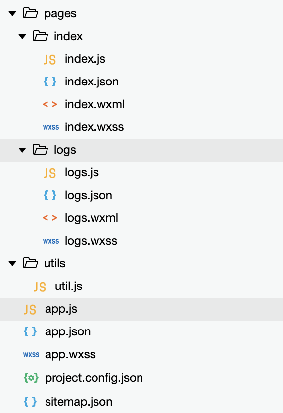
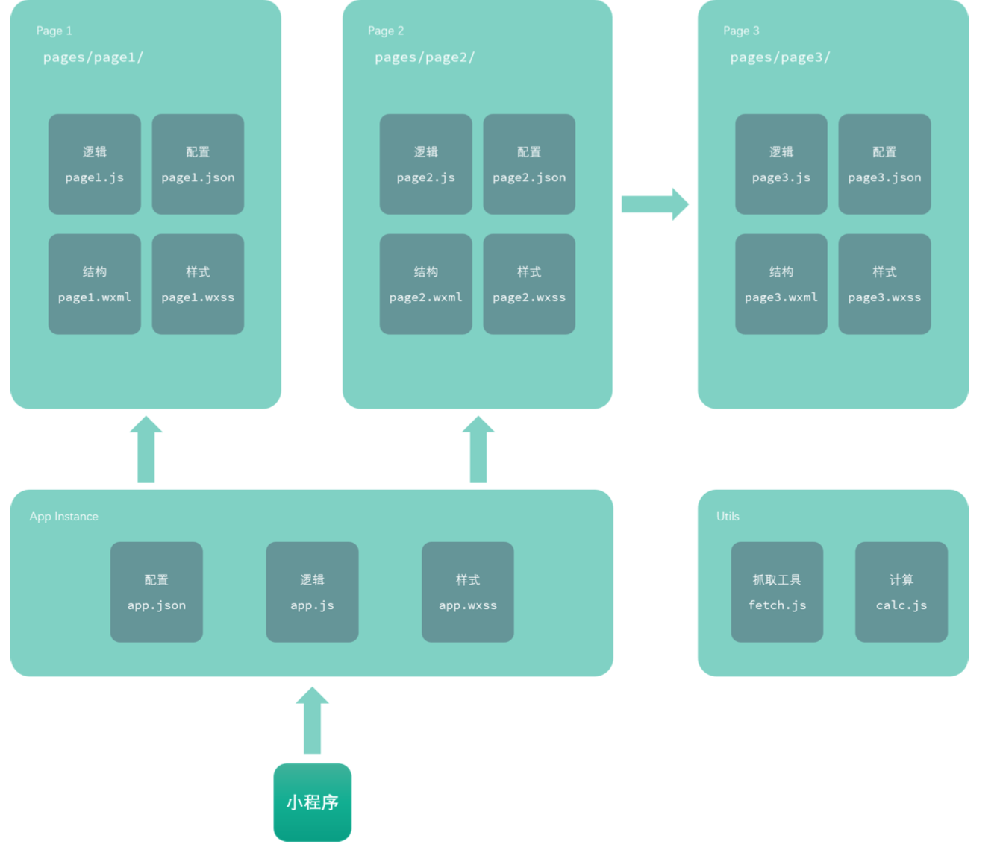
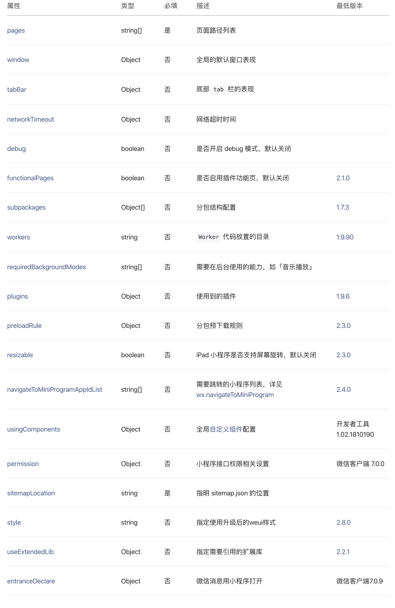
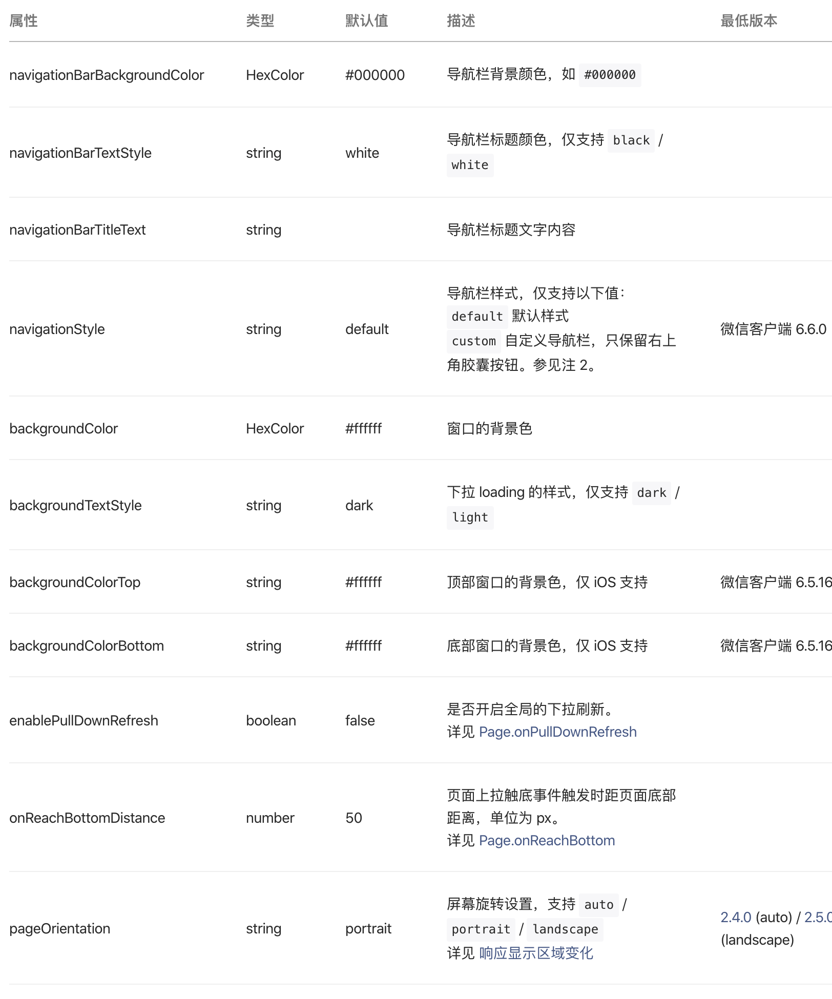
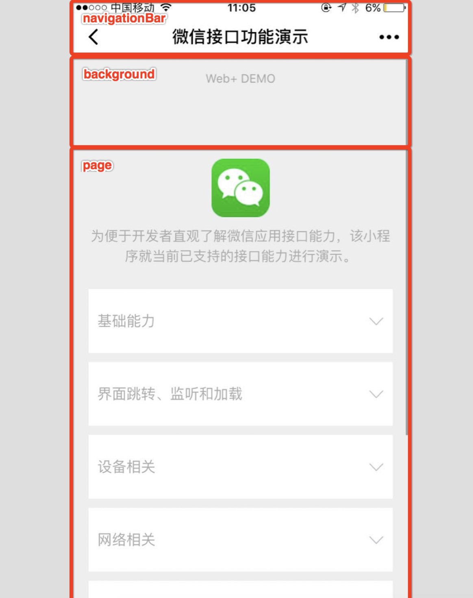
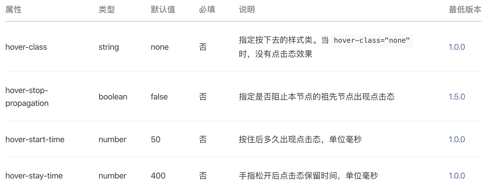

# 11-微信小程序

# 1.微信小程序介绍以及开发准备

## 1.1.微信小程序介绍

# 2.微信小程序快速入门

## 2.1.目录结构说明

在小程序中,对于html,js,css都做了扩展与限制,并且对其文件后缀有了新的定义.

> 主体文件,由三个文件组成,必须放在项目的根目录,集体内容如下:

| 文件     | 必输 | 作用             |
| -------- | ---- | ---------------- |
| app.js   | 是   | 小程序逻辑       |
| app.json | 是   | 小程序公共设置   |
| app.wxss | 否   | 小程序公共样式表 |

> 页面由四个文件组成,分别是:

| 文件类型 | 必填 | 作用                                                         |
| -------- | ---- | ------------------------------------------------------------ |
| js       | 是   | 页面逻辑(微信小程序没有window和document对象)                 |
| wxml     | 是   | 页面结构(WeiXin Markup Language,不是HTML语法)                |
| wxss     | 否   | 页面样式表(WeiXin Style Sheets拓展了rpx尺寸单位,微信专属响应式像素) |
| json     | 否   | 页面配置                                                     |

## 2.2.配置说明

### 2.2.1.app.json配置项列表

关于app.json的配置内容可以直接参考官网链接:https://developers.weixin.qq.com/miniprogram/dev/reference/configuration/app.html.

> app.json文件用来对微信小程序进行全局配置,决定页面文件的路径,窗口表现,设置网络超时时间,设置多tab等.

~~~json
{
  "pages":[
    "pages/index/index",
    "pages/logs/logs",
    "pages/demo/index"
  ],
  "window":{
    "backgroundTextStyle":"light",
    "navigationBarBackgroundColor": "#FF00FF",
    "navigationBarTitleText": "我的第一个小程序",
    "navigationBarTextStyle":"white"
  },
  "tabBar":{
    "list":[
      {
        "pagePath":"pages/index/index",
        "text":"首页"
      },
      {
        "pagePath": "pages/logs/logs",
        "text": "日志"
      },
      {
        "pagePath": "pages/demo/index",
        "text": "Demo"
      }
    ]
  }
}
~~~

### 2.2.1.windows配置

关于windows的配置内容可以直接参考官网链接:https://developers.weixin.qq.com/miniprogram/dev/reference/configuration/app.html.

> 用于设置小程序的状态栏,导航条,标题,窗口背景色.

* 注一:HexColor是十六进制颜色值.如"#ff00ff";
* 注二:关于`navigationStyle`
  * 客户端7.0.0以下版本,`navigationStyle`只在app.json中生效;
  * 客户端6.7.2版本开始,`navigationStyle:custon`对web-view无效;
  * 开启custon后,低版本客户端需要做好兼容,开发者工具基础库版本切到1.7.0(不代表最低版本,只供调试用)可方便切到旧视觉;

### 2.2.2.tabBar配置

如果小程序是一个多tab应用(客户端窗口的底部或顶部有tab栏可以切换页面),可以通过tabBar篇配置项来指定tabBar的表现.

## 2.3.组件

关于windows的配置内容可以直接参考官网链接:https://developers.weixin.qq.com/miniprogram/dev/component/

### 2.3.1.视图组件

#### 2.3.1.1.View

视图容器,相当于html中的

#### 2.3.1.2.滑块视图容器

