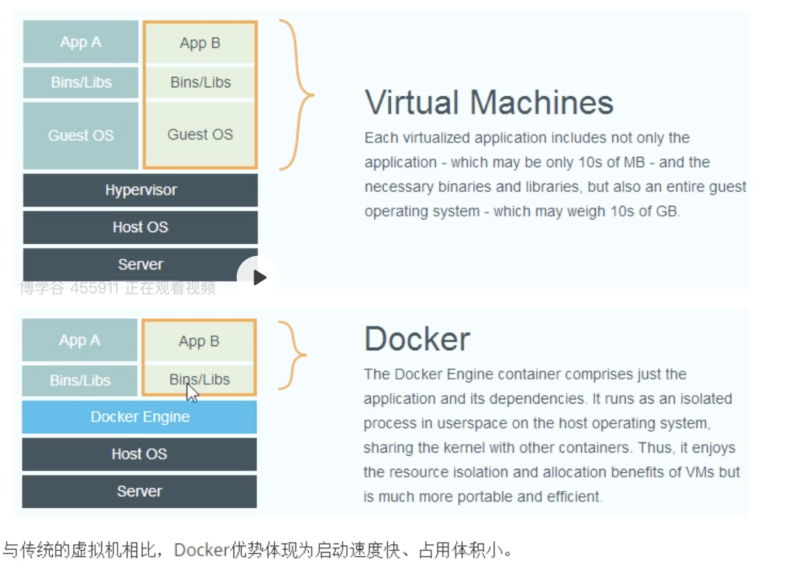
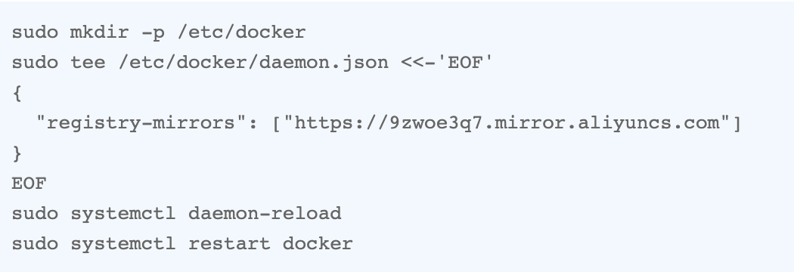
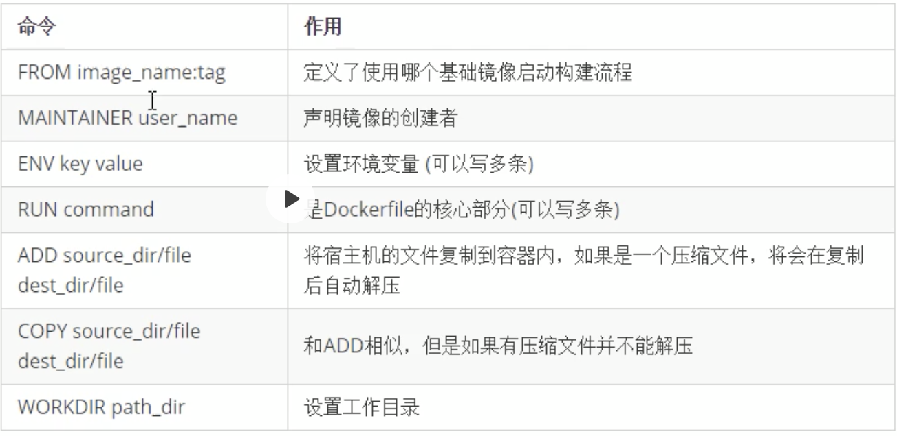
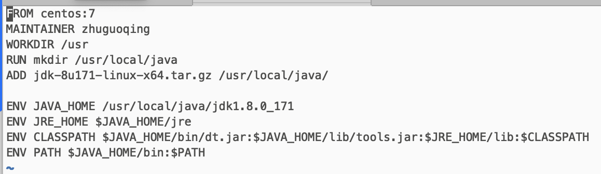

# Docker
## 1.Docker与传统虚拟化方式比较




## 2.Docker的镜像与容器

容器是基于镜像启动起来的，容器中可以运行一个或多个进程。我们可以认为，镜像是Docker生命周期中构建或者打包阶段，而容器则是启动或者执行阶段。容器给予镜像启动，一旦容器启动完成后，我们就可以登陆到容器中安装自己需要的软件或者服务。

## 3.Docker安装与启动
需要使用CentOS7.X以上的版本：
1. yum包更新到最新；
```shell
sudo yum update
```
2. 安装需要的软件包，yum-util提供yum-config-manager功能，另外两个是device mapper驱动依赖的
```shell
sudo yum install ‐y yum‐utils device‐mapper‐persistent‐data lvm2
```
3. 设置yum源为阿里云
```shell
sudo yum-config-manager --add-repo http://mirrors.aliyun.com/docker-ce/linux/centos/docker-ce.repo
```
4. 安装docker
```shell
sudo yum install docker-ce
```
5. 安装后查看docker版本
```shell
docker -v
```

## 4.设置阿里云的镜像


## 5.Docker的启动与停止
`systemctl`命令是系统服务管理器指令；
* 启动docker `systemctl start docker`
* 停止docker `systemctl stop docker`
* 重启docker `systemctl restart docker`
* 参看docker状态 `systemctl status docker`
* 开机启动 `systemctl enable docker`
* 查看docker概要信息 `docker info`
* 查看docker帮助文档 `docker --help`

## 6.镜像相关命令
* 查看镜像 `docker images`
* 搜索镜像 `docker search 镜像名称`
* 拉取镜像 `docker pull 镜像名称`
* 按照镜像ID删除镜像 `docker rmi 镜像ID`
* 删除所有镜像 `docker rmi 'docker images -q'`其中的 ` 是esc键下的按键

## 7.容器相关命令
* 查看正在运行的容器 `docker ps`
* 参看所有容器 `docker ps -a`
* 查看最后一次运行的容器 `docker ps -l`
* 参看停止的容器 `docker ps -f status=exited`
* 创建容器 `docker run`
	* `-i` 表示运行容器
	* `-t` 表示容器启动后会进入器命令行。加入这两个参数后，容器创建就能登陆进去。即分配一个伪终端。
	* `--name` 为创建的容器命名
	* `-v` 表示目录映射关系（前者是宿主机目录，后者是映射到宿主机上的目录）
	* `-d`在run后面加上`-d`参数，则会创建一个守护式容器在后台运行，这样创建容器后不会自动登录容器，如果只加了`-i -t`两个参数，创建后就会自动进去容器。
	* `-p` 表示端口映射，前者是宿主机端口，后者是容器内的映射端口。可以使用多个`-p`做多个端口映射。
	* **交互式方式创建容器** `docker run ‐it ‐‐name=容器名称 镜像名称:标签 /bin/bash`这时我们可以通过`exit`命令退出当前容器。
	* **守护式方式创建容器** `docker run ‐di ‐‐name=容器名称 镜像名称:标签`登录守护式容器方式`docker exec ‐it 容器名称 (或者容器ID) /bin/bash`。
	* 启动容器 `docker start 容器名称（或容器ID）`
	* 停止容器 `docker stop 容器名称（或容器ID）`
* 删除指定容器`docker rm 容器名称（容器ID）`

## 8.文件拷贝
如果我们需要将文件拷贝到容器内可以使用cp命令
```shell
docker cp 需要拷贝到文件或目录 容器名称：容器目录
```
也可以将文件从容器内拷贝出来
```shell
docker cp 容器名称：容器目录 需要拷贝到文件或目录
```

## 9.目录挂载
我们可以在创建容器的时候，将宿主机的目录与容器内的目录进行映射，这样我们就可以通过修改宿主机某个目录的文件而去影响容器。
创建容器添加-v参数，后面为宿主机目录：容器目录，例如：
```shell
docker run ‐di ‐v /usr/local/myhtml:/usr/local/myhtml ‐‐name=mycentos3 centos：7
```
如果你共享的是多级的目录，可能会出现权限不足的提示。
这是因为CentOS7的安全模块selinux把权限静掉了，我们需要添加参数 `--privileged=true` 来解决挂载的目录没有权限的问题。

## 10.查看容器IP地址
我们可以通过以下命令查看容器运行的各种数据
```shell
docker inspect 容器名称（容器ID）
```
也可以直接执行下面的命令直接输出IP地址
```shell
docker inspect ‐‐format='{{.NetworkSettings.IPAddress}}' 容器名称（容器ID）
```

## 11.MySQL部署
1. 拉取MySQL镜像
```shell
docker pull centos/mysql-57-centos7
```
2. 创建MySQL容器
```shell
docker run -di --name=mysql01 -p 33306:3306 -e MYSQL_ROOT_PASSWORD=320512 centos/mysql-57-centos7
```
-p 代表端口映射，格式为 宿主机映射端口：容器运行端口
-e 代表添加环境变量 MYSQL_ROOT_PASSWORD 是root用户的登录密码

## 12.Tomcat部署
1. 拉取镜像
```shell
docker pull tomcat：7-jre7
```
2. 创建容器
创建容器 -p表示地址映射
```shell
docker run ‐di ‐‐name=mytomcat ‐p 9000:8080
‐v /usr/local/webapps:/usr/local/tomcat/webapps tomcat:7‐jre7
```

## 13.Nginx部署
1. 拉取镜像
```shell
docker pull nginx
```
2. 创建容器
```shell
docker run ‐di ‐‐name=mynginx ‐p 80:80 nginx
```

## 14.Redis部署
1. 拉取镜像
```shell
docker pull redis
```
2. 创建容器
```shell
docker run ‐di ‐‐name=myredis ‐p 6379:6379 redis
```

## 15.迁移与备份
1. 我们可以通过以下命令将容器保存为镜像
```shell
docker commit 容器名称 镜像名称
```
2. 我们可以通过以下命令将镜像保存为tar文件
```shell
docker save -o 文件名称(tar格式的文件) 镜像名称
```
3. 恢复镜像
```shell
docker load -i 文件名称(tar格式的文件)
```

## 16.Dockerfile
Dockerfile是由一系列命令和参数构成的脚本，这些命令应用于基础镜像并最终创建一个新的镜像。

1. 对于开发人员,可以为开发团队提供一个完全一致的开发环境
2. 对于测试人员,可以直接拿开发时所构建的镜像或者通过Dockerfile文件构建一个新的镜像开始工作了;
3. 对于运维人员,在部署时,可以实现应用的无缝移植;


**使用脚本创建镜像案例**：

1. 创建目录：
```shell
mkdir -p /usr/local/dockerjdk8
```
2. 下载`jdk-8u171-linux-x64.tar.gz`并上传到服务器（虚拟机）中的`/usr/local/dockerjdk8`目录中
3. 创建文件Dockerfile `vi Dockerfile`

4. 执行命令构建镜像（注意后边的空格和点，不能省略）
```shell
docker build ‐t='jdk1.8' .
```
5. 参看镜像是否建立完成
```shell
docker images
```

## 17.Docker私有仓库搭建与配置
1. 拉取私有仓库镜像
```shell
docker pull registry 
```
2. 启动私有仓库容器
```shell
docker run -di --name=registry -p 5000:5000 registry
```
3. 打开浏览器输入地址`http://172.16.124.130:5000/v2/_catalog`，看到`{"repositories":[]}`表示私有仓库搭建成功并且内容为空。
4. 修改daemon.json
```shell
vi /etc/docker/daemon.json
```
添加以下内容，保存退出,这是为了让docker信任私有仓库地址
```json
{"insecure-registries":["172.16.124.130:5000"]}
```
5. 重启docker服务
```shell
systemctl restart docker
```

## 18.镜像上传到私有仓库
1. 标记此镜像为私有仓库的镜像
```shell
docker tag jdk1.8 172.16.124.130:5000/jdk1.8
```
2. 再次启动私服容器
```shell
docker start registry
```
3. 上传标记的镜像
```shell
docker push 172.16.124.130:5000/jdk1.8
```

## 19.Docker Compose

我们现在已经知道使用一个Dockerfile模板文件,可以让用户很方便的定义一个单独的应用容器.然而,在日常工作中,经常会碰到需要多个容器相互配合来完成某项任务的情况.例如要实现一个Web项目,除了Web服务容器本身,往往还需要再加上后端的数据库服务容器,甚至还包括负载均衡容器;

Docker Compose恰好满足了这样的需求.它允许用户通过一个单独的docker-compose.yml模板文件来定义一组相关联的应用容器为一个项目.

* 服务(service):一个应用的容器,实际上可以包括若干运行相同镜像的容器实例;
* 项目(project):一组关联的应用容器组成的一个完整业务单元;

