# Linux(CentOS7)

我构建项目服务的时候，每次都在Linux上栽跟头。终于在昨天，我的Linux由于消息服务存放的消息太多，硬盘容量不够，导致系统崩溃，所有服务和Docker镜像容器全部GG(这些构建起来可真能花我不少时间)。我不得不停一停项目，从头开始搞Linux。

我对于Linux上的概念只是一知半解。出了问题只能去百度上查找问题然后复制粘贴命令运行，甚至都不能理解这条命令是做什么用的。半年前我就已经有系统学习Linux的想法。想法是美好的，实践起来可真不容易。

我觉得村上春树的一句话很不错：今天不想跑，所以才去跑，这是长跑者的思维方式。

# 1.系统操作篇

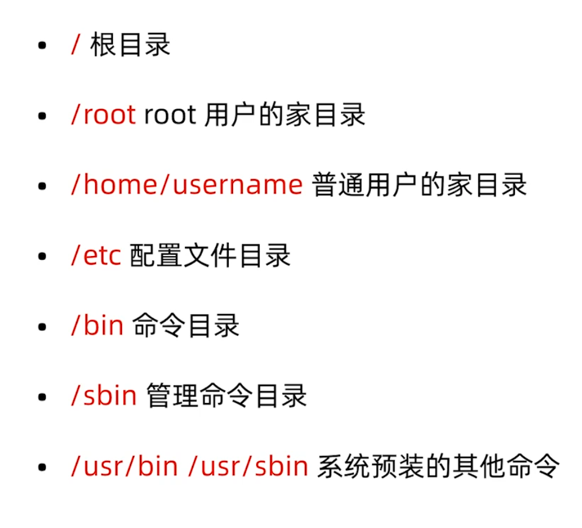

## 1.1.帮助命令:man help info

### 1.1.1.man

* man 是 manual的缩写。
* man帮助用法演示
  * `man ls` 当然我们也可以写成`man 1 ls`意思是获取 ls 的第一章的帮助信息，当章节为1的时候，1是可以省略的。
* man也是一条命令，分为9章，可以使用man命令获得man的帮助。
  * `man 7 man` 获得man的第七章的描述。
  * `man man`
  * `man -a passwd`当我们不知道passwd是一条命令还是什么，我们就可以直接使用该命令，退出之后使用回车键查看下一章的 passwd

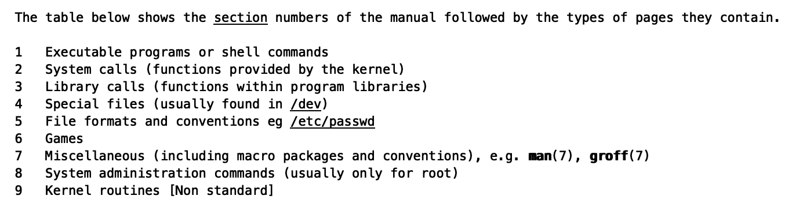

* man命令用来执行`man cd`通过man命令来查看命令的时候发现：cd 命令是内置命令，它是命令解释器shell的内置命令，用man只能查看出bash，所以这种命令只能通过help来进行查看。

  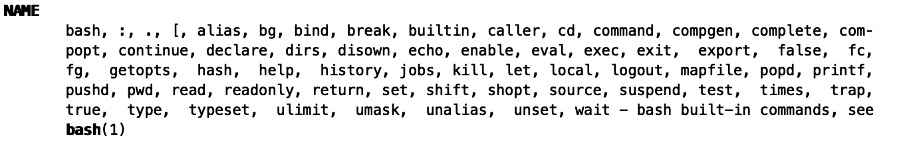

* 通过`man mkdir`命令我们可以得知mkdir后面可以跟多个OPTION参数，也可以跟着多个DIRECTORY(因为后面有省略号)。

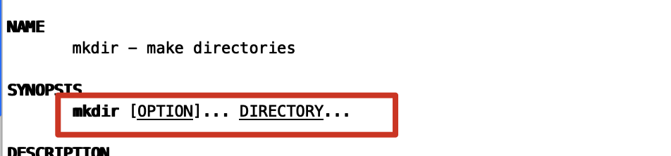

###1.1.2.help

* help
  * 内部命令使用help帮助：`help cd`
  * 外部命令使用help帮助：`ls --help`
  * shell(命令解释器)自带的命令称为内部命令，其他的是外部命令。
  * 我们可以使用`type cd`（从下图我们可以看出 cd 是内部命令，ls 是外部命令）

### 1.1.3.info

* Info帮助比help更详细，作为help的补充。`info ls`

## 1.2.文件管理命令:pwd ls cd

Linux:一切皆文件。

### 1.2.1.pwd

pwd就是显示当前目录的名称：Print working directory。

### 1.2.2.ls

* `ls -l`是长格式显示
  * 如图中 lrwxrwxrwx 第一个l就表示是一个link，如果是d表示是一个directory，如果是-表示是一个普通文件；
  * 后面的rwxrwxrwx表示的是文件的权限；
  * 仅仅接的是1表示的是该文件或文件夹内的文件个数；
  * 第一个root表示是谁创建了该文件，第二个root表示该用户是属于哪一个用户组的；

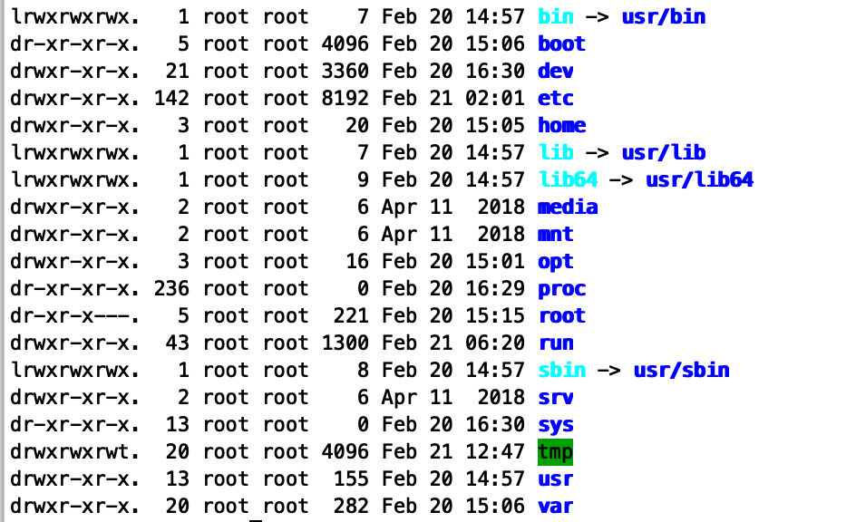

* `ls -a`表示的是显示所有文件包括隐藏文件
* `ls -l -r`以文件名逆序显示
* `ls -l -r -t`表示以文件的修改时间排序显示，同样我们也可以使用`ls -lrt`

* `ls -R`递归显示

### 1.2.3.cd

cd 是表示的更改当前的操作目录。change directory

* `cd /path/to/...`绝对路径
* `cd ./path/to/...`相对路径
* `cd ../path/to/...`相对路径
* `cd -`回到之前的所在目录

## 1.3.文件管理命令:mkdir rmdir

* `mkdir (文件目录)`	make directory。
  * `mkdir -p /a/b/c/d/e/f`这里 -p的意思是parents，no error if existing，make parent directories as needed
* `rmdir (文件目录)` remove enpty directory
  * 只能删除空目录
* `rm -r (文件目录)` remove directories and their contents recursively(递归)
* `rm -rf (文件目录)`force(强制)删除文件目录和内容

## 1.4.复制和移动命令:cp mv

* `cp (文件) (目标文件夹)`
  * `cp -r (源文件夹) (目标文件夹)`递归复制，这种复制方法可以直接将文件夹复制过去;
  * `cp -p (源文件) (目标文件夹)`与--preserve是一样的，复制的时候维持一些原有的属性。如：mode,ownership,timestamps。
  * `cp -a (源文件) (目标文件夹)`与--preserve是一样的
  * `cp -v (源文件) (目标文件夹)`verbose(冗长的) explain what is being down
* `mv (文件) (文件)`
  * `mv /tmp/filea /fileb`可以既移动文件的位置，也修改了文件的名称。
* 通配符`*` `?`。
  * `*`表示的是一个字符或者多个字符
  * `?`表示的是单个字符

## 1.5.文本查看命令:cat head tail wc more less

* `cat` 查看内容显示到终端
* `head` 查看文件开头
* `tail` 查看文件结尾
  * 常用参数`-f` follow文件内容更新后，显示信息同步更新。
* `wc` 统计文件内容信息
  * print newline, word, and byte counts for each file；
  * `wc -l (文件)`line 显示文件的行数；
* `more`
* `less`:less is more

## 1.6.压缩和解压缩命令: tar

* `tar -cf /tmp/etc-backup.tar /etc`(打包示例)
  * 表示的是对 /etc目录进行打包，将该目录下的所有文件打包成.tar放在/tmp目录下。
  * `-c `:create a new archive(档案)
  * `-f`:use archive file or device ARCHIVE
* 压缩的话目前有两条命令`gzip` `bzip2`,但实际上`tar`已经帮我们对`gzip`,`bzip2`进行了集成
  * `tar -zcf /tmp/etc-backup.tar.gz /etc`打包的时候就已经实现了压缩，并且是以gzip的格式进行压缩；
  * `tar -jcf /tmp/etc-backup.tar.bz2 /etc`以bzip2的格式进行压缩；
* 解包 `tar xf /tmp/etc-backup.tar -C /root`
* 解压缩包 extract(提取)
  * `tar -zxf /tmp/etc-backup.tar.gz -C /root`将gzip的格式文件进行解压缩
  * `tar -zxf /tmp/etc-backup.tar.bz2 -C /root`将bzip2格式文件进行解压缩
* `.tbz2`实际上就是`tar.gz`的缩写，`.tgz`实际上就是`tar.bz2`的缩写

## 1.7.文本编辑器 vim

文本编辑器vim一共有四种模式

* 正常模式(Normal-mode)
  * 进入插入模式`i`,`I`,`o`,`O`,`a`,`A`;
  * 在正常模式下我们可以使用`h`,`j`,`k`,`l`进行左,下,上,右的操作；
  * 复制整行`yy`，粘贴`p`,我们可以使用`3yy`来复制3行文本内容。复制光标位置到该行结尾的内容用`y$`;
  * 剪切整行`dd`，同样我们可以使用`3dd`来剪切3行文本内容，剪切光标位置到该行结尾的内容用`d$`;
  * 撤销`u`;
  * 重做`ctrl+r`:to newer change;
  * 快速移动到某行：例如：先输入11然后按`shift+g`。小写的`g`可以定位到文本的首行，大写的`G`可以定位到文本的末行；
  * 快速移动到该行的位置：`^`移动到该行的开头，`$`移动到该行的结尾。
* 插入模式(Insert-mode)
* 命令模式(Command-mode)
  * `:set nu`:显示行数，`:set nonu`：不显示行数;
  * `:w /root/a.txt`将文件保存到...;
  * `:/(content)` 查找文本中内容的位置，之后我们可以使用`n`键来查找下一个匹配的字符；
  * `:!(shell):我们可以使用`!`+其他的操作命令来打开其他的相应内容，方便我们查看复制到文本中；
  * 替换文本内容：
    * `:s/(old)/(new)`：将该行旧的内容替换为新的内容;
    * `:%s/(old)/(new)`：对全文内容进行替换;
    * `:(firstLine),(lastLine)s/(old)/(new)`:将firstLine到lastLine的旧的内容替换成新的内容。
* 可视模式(Visual-mode)
  * 我们可以在正常模式中使用`v`（字符可视模式）,`shift+v`（可视行模式）`ctrl+v`（可视块模式） 进入
  * 我们在选中之后可以使用`I`进行插入，然后连续2次使用`ESC`；
  * 我们也可以在选中之后使用`d`键进行删除；

我们修改/etc/vimrc文件,就可以修改vim的配置,我们在该配置文件的最后一行加入`set nu`，就可以每次打开vim的时候显示行号；

## 1.8.用户和用户组管理及密码管理

### 1.8.1.用户管理命令

* `useradd (用户名)`：新建用户；
  * `useradd -g (组名) (用户名)`：新建的时候就直接将用户放到指定的组下
* `userdel (用户名)`：删除用户；这个时候用户虽然被删除了，但是该用户的home目录被保留了下来，我们可以使用`userdel -r (用户名)`同时也删除掉用户的home目录；
* `passwd (用户名)`：修改用户密码；我们也可以直接使用`passwd`修改当前登录的密码
* `usermod (option) (用户名)`：修改用户属性；
  * `usermod -g (组名) (用户名)`:将用户放到指定的用户组下
* `chage (option) (用户名)`：修改用户属性;

/etc/passwd，/etc/shadow这两个目录下都保留了用户的信息； 

我们可以通过`id (用户名)`来查看用户的相关信息；

### 1.8.2.用户组命令

* `groupadd (用户组)`：新建用户组；
* `groupdel (用户组)`：删除用户组；

## 1.9.用户切换

* `su - (用户名)`：切换用户
* `sudo (用户名)`：以其他用户身份执行命令
  * `visudo`：设置需要使用sudo的用户（组）；

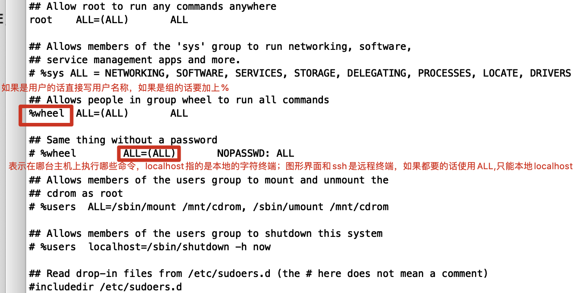

在我们设置命令的时候有可能不知道该命令所在位置；我们可以在vim的命令模式下使用`:which (命令)`来找到该命令在哪个目录。

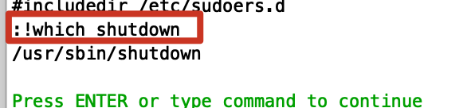

我们在文件的最后一行添加相关内容。修改之后，我们使用`sudo /sbin/shutdown`命令就可以。

## 1.10.用户和用户组的配置文件

### 1.10.1.`/etc/passwd`

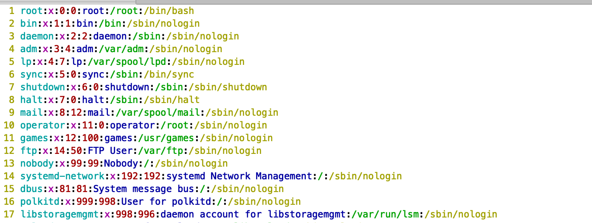

以第一行的`root`用户为例；

* root：该用户为root
* x：有x表示需要密码，如不需要密码，那么就没有x，该行就显示为：root::0:0:root(等等)；
* 第二个root：用户的uid
* 第三个root：用户的gid
* 第五个字段：注释
* /root ：家目录所在位置
* /bin/bash：用户登录的命令解释器，如果是/sbin/nologin表示的是该账号不能够被登录

### 1.10.2.`/etc/shadow`

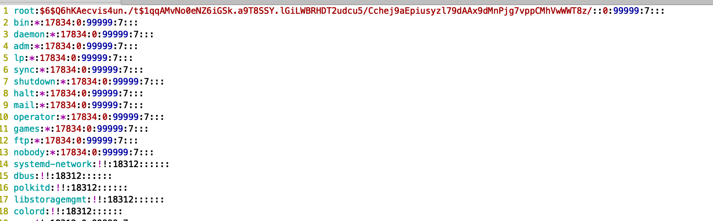

以第一行的root用户为例：

* root：该用户为root
* $6.......：加密后的密码

### 1.10.3. `/etc/group`

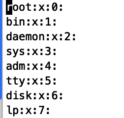

以第一行的root组为例：

* root：该组为root
* x：该组是否需要密码
* 0：该组的gid

* postfix：该组还属于postfix组

## 1.11.文件与目录权限

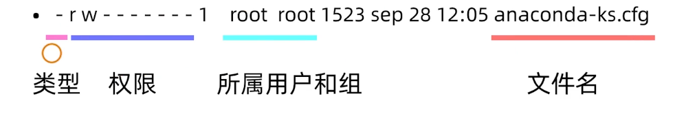

**下图是普通文件的权限说明：**

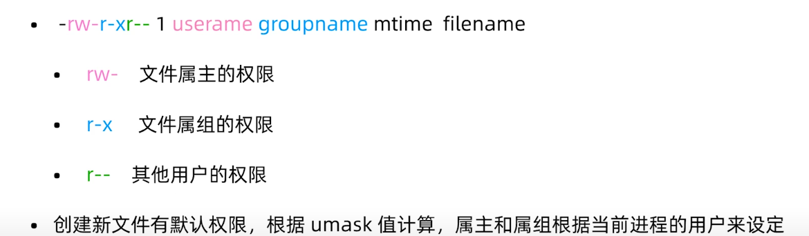

注意1：我们使用vim对文件进行写的时候并不是真正意义上的对文件进行写操作，而是新建一个隐藏文件，用户所有编写的内容全部保存在该隐藏文件中，当用户保存文件并退出的时候，vim把之前的隐藏文件对之前的文件进行替换。

注意2：权限限制是针对非root用户的，root用户拥有一切权限。

**下图是目录文件的权限说明：**

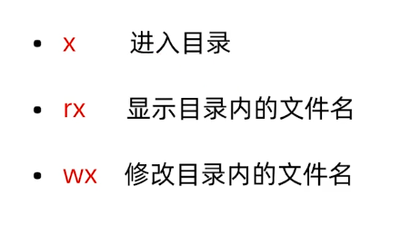

### 1.11.1.文件类型

* \- 普通文件
* d 目录文件
* b 块特殊文件（列入外接硬盘）
* c 字符特殊文件 （终端）
* l 符号链接 
* f 命名管道 
* s 套接字文件

### 1.11.2.文件权限

* r 可读（4）
* w 可写（2）
* x 可执行（1）

### 1.11.3.权限修改命令

* `chmod` 修改文件，目录权限
  * `chmod u+x g-x o+w (文件名)`这里的u表示的属主，g表示的属组，o表示的其他用户，a表示所有
  * `+`,`-`,`=`加代表加什么权限，减代表减什么权限，等于代表直接设置什么权限。
  * `chmod 777 (文件名)`用数字修改权限
* `chown` 修改属主，属组。
  * `chown (属主) (文件)`修改文件的属主
  * `chown :(属组) (文件)`修改文件的属组
  * `chown (属主)|(属组) (文件)`修改文件的属主和属组
* `chgrp` 单独更改属组，不常用
  * `chgrp (属组) (文件)`修改文件的属组

# 2.系统管理篇

## 2.1.网络管理

### 2.1.1.网络状态查看

网络状态查看工具主流有两个工具包（net-tools和iproute）

* net-tools

  * `ifconfig`
    * eth0是我们的第一块网卡（网络接口）
    * 但我们的第一个网络接口可能叫做下面的名字
      * eno1 板载网卡
      * ens33 PCI-E网卡
      * enp0s3 无法获取物理信息的PCI-E网卡
      * CentOS7使用了一致性设备命名，以上都不匹配才使用eth0
    * 网卡命名规则受biosdevname和net.ifnames两个参数影响
      * 编辑 `/etc/default/grub`文件，在第六行的'rhgb quiet'的末尾新增`biosdevname=0 net.ifnames=0`；
      * 更新grub ,使用命令`grub2-mkconfig -o /boot/grub2/grub.cfg`；
      * 重启`reboot`
    * 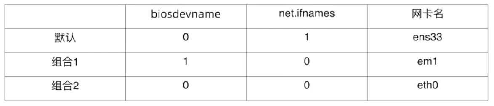
  * `mii-tool (网卡名)`测试网线的连接状态；

  * `route` 当我们需要连接其他网络通信范围的时候，我们就需要配置一个网关（路由）；
    * `route -n`使用-n参数不解析主机名

  * `netstat`

* iproute2

  * netstat：检查服务范围
    * `netstat -ntpl`
  * ss：检查服务范围
    * `ss -ntpl`

### 2.1.2.网络配置命令

* 网卡配置

  * `ifconfig <接口> <IP地址> [netmask <子网掩码>]`

  * `ifup <接口>`启用网卡
  * `ifdown <接口>`禁用网卡

* 添加和删除网关，我们在添加和删除之前可以使用`route -n`对网关进行查看

  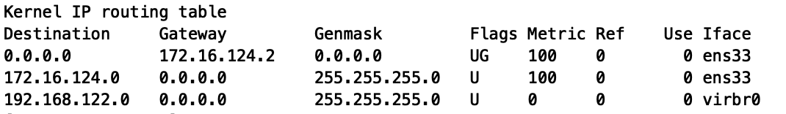

  * `route del default gw <网关ip>`
  * `route add default gw <网关ip>`
  * `route add -host <指定ip> gw <网关ip>`
  * `route add -net <指定网段> netmask <子网掩码> gw <网关ip> `

### 2.1.3.网络故障排除命令

* ping
* traceroute：辅助ping命令,路由追踪
* mtr：辅助ping命令,检查数据包有没有可能丢失
* `nslookup (域名或ip)`：解析域名
* `telnet (域名或ip) (端口)`：检查端口
* tcpdump：更细致的分析数据包
  * `tcpdump -i any -n port (端口)`：抓指定端口的包
  * `tcpdump -i any -n host (ip地址)`：抓指定ip的包
  * `tcpdump -i any -n host (ip地址) and port（端口）`：抓指定ip和端口的包
  * `tcpdump -i any -n host (ip地址) and port（端口）-w (文件目录)`：抓取指定ip和端口的包并写入到指定文件下中
* netstat：检查服务范围
  * `netstat -ntpl`
* ss：检查服务范围
  * `ss -ntpl`

### 2.1.4.网络配置文件

网络服务管理程序分为两种：分别为SysV何systemd

* `service network start|stop|restart|status`
* `chkconfig --list network`,在执行完该命令后出现下图，我买了可以将SysV这个网络管理程序进行关闭。我们可以执行`chkconfig --level 2345 network off`。

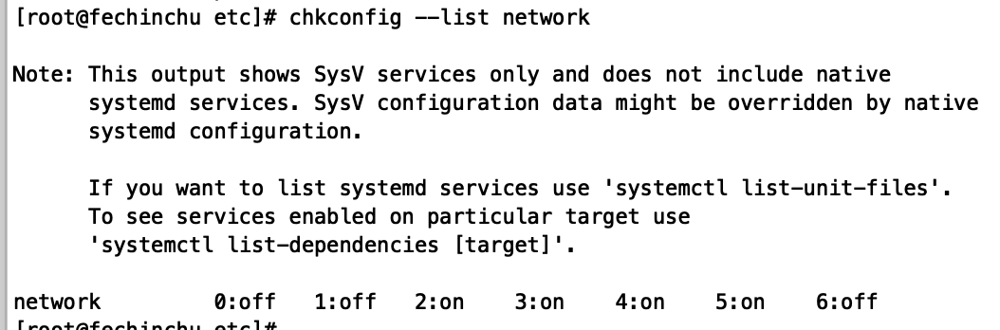

* `systemctl list-unit-files NetworkManager.service`
* `systemctl start|stop|restart|enable|disable NetworkManager`

网络配置文件

* `ifcfg-eth0`在`/etc/sysconfig/network-scripts/`目录下,下图是我设置的静态IP的网络配置文件

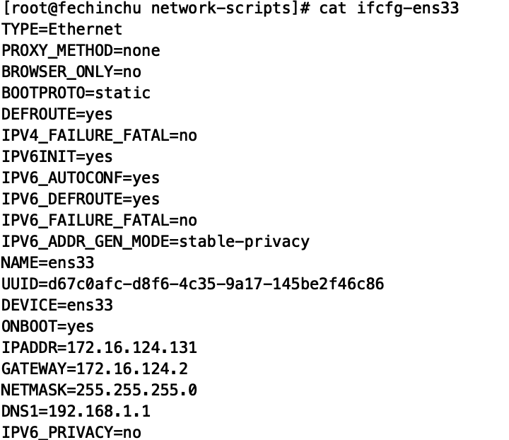

* `/etc/hosts`

## 2.2.软件包管理

### 2.2.1.rpm

* 包管理器是方便软件安装，卸载，解决软件依赖关系的重要工具
  * CentOS，RedHat使用yum包管理器，软件安装包格式为rpm；
  * Debian，Ubuntu使用apt包管理器，软件安装包格式为deb
* 我们的光盘文件中已经有大量的rpm包，我们需要将该光盘文件(块特殊文件)挂载到指定的目录上，推荐挂载到`/mnt`目录下
  
* `mount /dev/sr0 /mnt`
  
* rpm包格式

  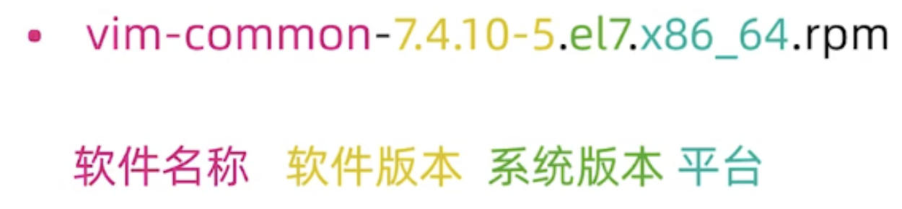

* `rpm`命令常用参数
  * `-q` 查询软件包；
    * `rpm -qa | more`：查看所有安装的软件包
    * `rpm -q (软件包名)`：查看指定的软件包
  * `-i` 安装软件包；
  * `-e` 卸载软件包；

### 2.2.2.yum

* CentOS 的yum源

  * http://mirror.centos.org/centos/7/ (国外镜像)
  * https://opsx.alibaba.com/ (国内镜像)

* yum配置文件

  * `/etc/yum.repos.d/CentOS-Base.repo`

  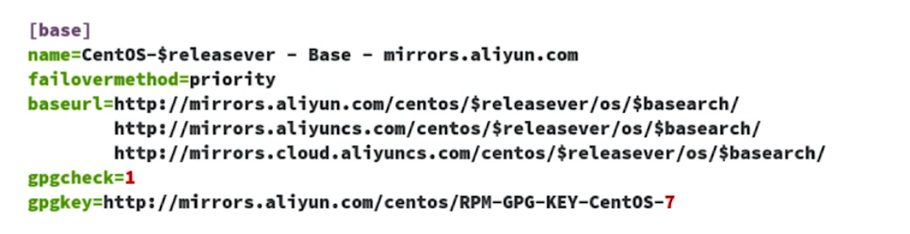

  * `wget -O /etc/yum.repos.d/CentOS-Base.repo http://mirrors.aliyun.com/repo/Centos-7.repo` 通过命令来获取配置文件，并覆盖原有的配置文件。

* yum常用命令

  * `yum makecache` 将服务器上的软件包信息进行本地缓存,以提高搜索效率.
  * `yum install (软件包)`安装软件包
  * `yum remove (软件包)`卸载软件包
  * `yum list|grouplist`查看软件包
  * `yum update (软件包)`升级软件包

### 2.2.3.源代码编译安装

* 二进制安装
* 源代码编译安装(以openresty服务器为例)
  1. `wget https://openresty.org/download/openresty-1.15.8.1.tar.gz`
  2. `tar -zxf openresty-VERSION.tar.gz`
  3. `cd openresty-VERSION/`
  4. `./configure --prefix=/usr/local/openresty`
  5. `make -j2`
  6. `make install`

## 2.3.进程管理

### 2.3.1.查看进程

* `ps`
  * `ps -e | more`:select all processes except session leaders and processes not  associated with a terminal
  * `ps -ef | more`do full-format listing
  * `ps -eLf | grep (字符)`获取到线程信息
* `pstree`
* `top`

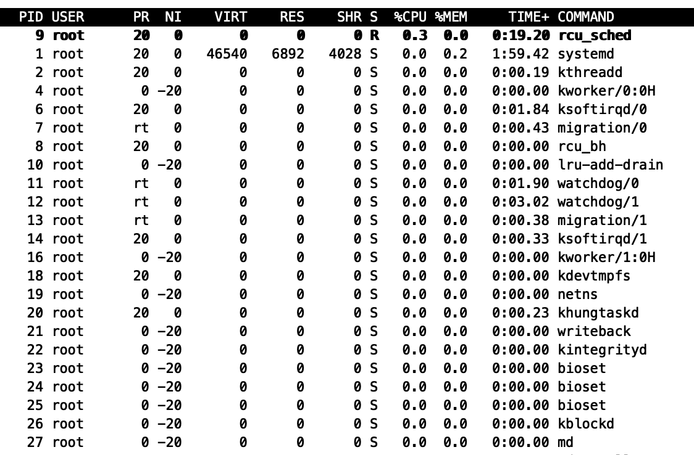

### 2.3.2.调整进程优先级

* 调整优先级
  * `nice` 范围从-20到19,值越小优先级越高,抢占资源就越多;
    * 我们在`top`命令中可以根据NI来查看nice值
    * `nice -n (nice值) (可执行程序)`
  * renice 重新设置优先级
    * `renice -n (nice值) (pid)`
* 进程的作业控制
  * `jobs`我们可以通过`jobs`命令找到后台运行的程序
    * `fg (jobs编号)` 将程序调回到前台运行;
    * `bg (jobs编号)`将程序调回到后台运行;
  * `&`
    * `(执行程序) &`就可以让程序在后台运行;
  * `ctrl+z`当在前台运行某个程序的时候我们可以使用`ctrl+z`将该程序在后台暂停;

### 2.3.3.进程间的通信

* 信号是进程间通信方式之一,典型用法是:终端输入终端命令,通过信号机制停止一个程序的运行;
* 使用信号的常用快捷键和命令
  * `kill -l` 查看所有支持的信号
    * SIGINT 通知前台进程组终止进程`ctrl+c`;
    * SIGKILL 立即结束程序,不能被阻塞和处理`kill -9 (pid)`

### 2.3.4.守护进程(daemon)及日志

守护进程:实现了不需要终端就可以启动,输出打印到指定文件中,占用的目录是根目录;

* 使用`nohup`与`&`配合运行一个命令,让该命令在终端退出的时候继续运行;(类似于守护进程)
  * `nohup (某指令例如:tail -f /var/log/messages) &`:
  * `nohup`使进程忽略`hangup`(挂起)信号;
  * `nohup`忽略输入并把输出追加到`./nohup.out`
* 查看`nohup`与守护进程的挂载目录和输出
  * 我们可以使用`cd /proc/(pid)`进入进程的目录,接着`ll cwd`来查看进程挂载的目录.由于我们是在根目录进行创建该进程,所以我们挂载目录也是根目录.我们也可以使用`ll fd`来查看文件的输入输出.

* 使用`screen`,在进行终端操作的时候,先进入到screen的环境.即使网络断开,还可以继续运行程序.
  * `screen`进入screen环境;
  * `ctrl+a d`退出(datached) screen环境;
  * `screen -ls `查看screen的会话;
  * `screen -r (sessionid)`恢复会话;
* daemon的日志全部都在`/var/log`目录下
  * `/var/log/messages`:系统常规日志;
  * `/var/log/dmesg`:内核的运行信息;
  * `/var/log/secure`:系统的安全日志;
  * `/var/log/cron`:计划任务的日志信息;

## 2.4.服务管理

### 2.4.1.服务管理工具systemctl

* `systemctl`常见操作
  * `systemctl start|stop|restart|reload(部分服务支持)|enable|disable (服务名称)`;
  * 软件包安装的服务单元 `/usr/lib/systemd/system`;
* 在`/usr/lib/systemd/system`目录下:我们可以使用下图命令查看默认的级别,同样`systemctl set-default multi-user.target`,默认启动级别为多用户级别,即字符界面.

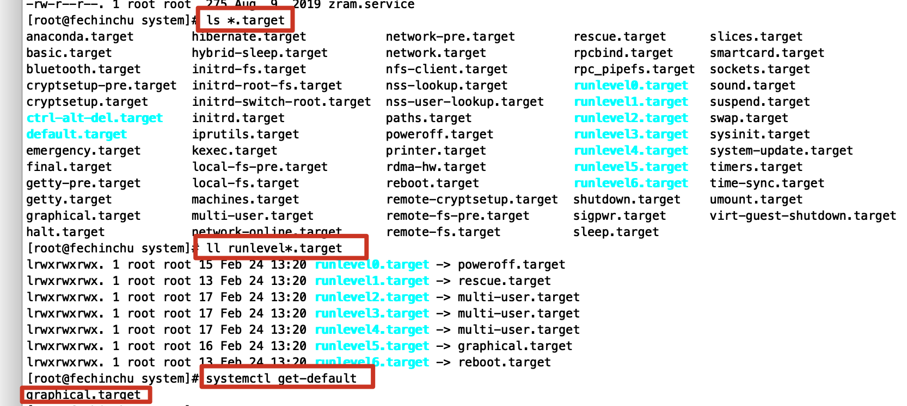

* 在`/usr/lib/systemd/system`目录下,我们可以查看`vi sshd.service` ,在shell篇我们去编写定制服务;

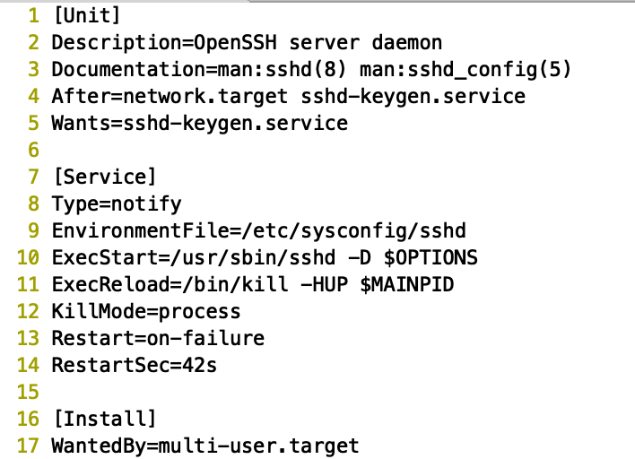

## 2.5.安全管理

### 2.5.1.SELinux(安全增强的Linux)

* 查看SELinux的命令

  * `getenforce`查看SELinux的状态
  * `/etc/selinux/config`可以去配置SELinux的状态,通常我们配置permissive级别即可.配置完成之后重启之后生效.
    * enforcing:强制
    * permissive:警告
    * disabled:关闭

  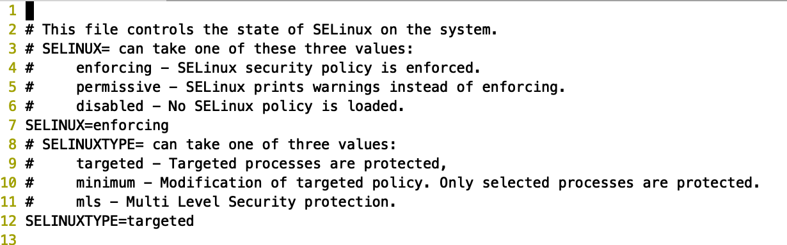

## 2.6.内存和磁盘管理

### 2.6.1.内存和磁盘查看

* 内存查看

  * `free`

    * `free`同样还有几个参数`-m`,`-g`来以M和G的数值显示内存大小

    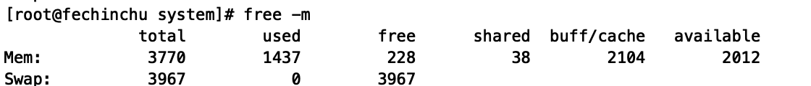

  * `top`:见2.3.1

* 磁盘查看

  * `fdisk`

    * `fdisk -l`来查看硬盘的相关信息;我们可以发现我们的硬盘文件是在`/dev`目录下,在Linux系统上,任何设备与接口都是以文件的形式存在于该目录中,你只要通过读写这个目录下面的某个文件,就等于在读写某个设备;

    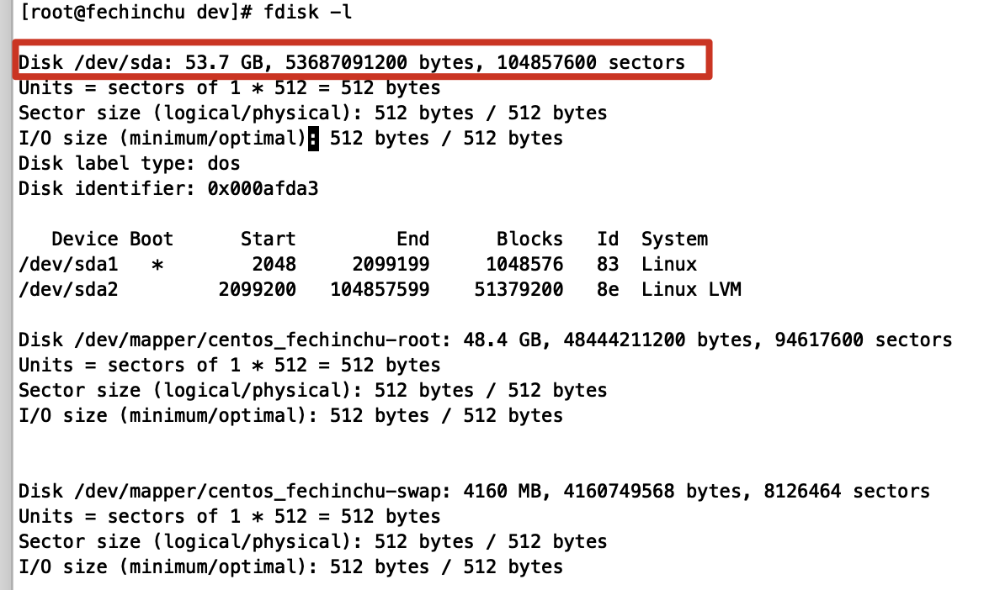

  * `parted -l`来查看硬盘相关信息

  * `df`

    * `df -h`查看挂载信息

  * `du`

    * `du -h (文件名)`查看文件的实际的占用大小(去掉空洞内容)
    * `du -h (文件名)`与`ls -lh (文件名)`区别就在于前者占用大小去掉空洞内容,而后者没有.

### 2.6.2.常见文件系统

* Linux支持多种文件系统,常见的有
  * ext4(CentOS6默认)
  * xfs(CentOS7默认)
  * NTFS(需要额外安装软件)

