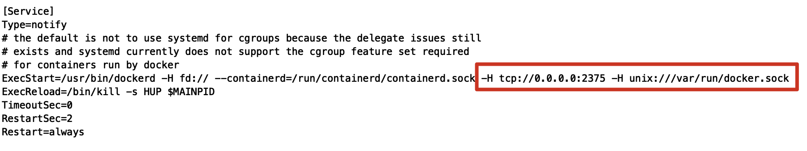

# 持续集成与容器管理

# 1.DockerMaven插件

**微服务部署有两种方法**:

* 手动部署:首先基于源码打包生成Jar/War包,将Jar/War上传并拷贝到JDK容器;
* 自动部署:通过Maven插件自动部署

**通过Maven插件自动部署的步骤**:

1. 修改宿主机的docker配置,让其可以远程访问

~~~shell
vi /lib/systemd/system/docker.service
~~~

其中ExecStart后面添加配置`-H tcp://0.0.0.0:2375 -H unix:///var/run/docker.sock`

修改后如下:

2. 刷新配置,重启服务

~~~shell
systemctl daemon-reload
systemctl restart docker
docker start registry
~~~

3. 在工程pom.xml增加配置

~~~xml
<build>
	<finalName>app</finalName>
	<plugins>
		<plugin>
			<groupId>org.springframework.boot</groupId>
      <artifactId>spring-boot-maven-plugin</artifactId>
		</plugin>
		<!-- docker的maven插件，官网:https://github.com/spotify/docker-maven-plugin-->
		<plugin>
			<groupId>com.spotify</groupId>
      <artifactId>docker-maven-plugin</artifactId> 
      <version>0.4.13</version>
			<configuration>
        <imageName>172.16.124.131:5000/${project.artifactId}:${project.version}</imageName>						<baseImage>jdk1.8</baseImage>
        	<entryPoint>["java", "-jar", "/${project.build.finalName}.jar"]</entryPoint>
          <resources>
          	<resource>
							<targetPath>/</targetPath>
              <directory>${project.build.directory}</directory>
              <include>${project.build.finalName}.jar</include>
            </resource>
          </resources>
					<dockerHost>http://172.16.124.131:2375</dockerHost>
      </configuration>
    </plugin>
	</plugins>
</build>
~~~

以上配置会自动生成Dockerfile

~~~shell
FROM jdk1.8
ADD app.jar /
ENTRYPOINT ["java","-jar","/app.jar"]
~~~

4. 进入工程的所在目录

~~~shell
mvn install
~~~

5. 进入想要上传的所在目录,输入以下命令,进行打包和上传镜像

~~~shell
mvn docker:build -DpushImage
~~~

6. 进入宿主机,查看镜像

~~~shell
docker images
~~~

7. 浏览器访问http://172.16.124.131:5000/v2/_catalog
8. 启动容器

~~~shell
docker run -di --name=base -p 9001:9001 (镜像名称)
~~~

# 2.持续集成工具Jenkins

## 2.1.持续集成介绍

持续集成Continuous integration,简称CI

随着软件开发复杂度的不断提高,团队开发间如何更好地协同工作以确保软件开发的质量已经慢慢成为开发过程中不可回避的问题,尤其是近年来,敏捷开发在软件工程领域越来越火,如何能在不断变化的需求中快速适应和保证软件的质量也显得尤其的重要.

持续集成正是针对这一类问题的一种软件开发实践.它提倡团队开发成员必须经常集成他们的工作,甚至每天都可能发生多次集成,而每次的集成都是通过自动化的构建来验证,包括自动编译,发布和测试,从而尽快地发现集成错误,让团队能够更快的开发内聚的软件.

持续集成具有的特点:

* 它是一个自动化的周期性的集成测试过程,从检出代码,编译构建,运行测试,结果记录,测试统计等都是自动完成的,无需人工干预;
* 需要有专门的集成服务器来执行集成构建;
* 需要有代码托管工具的支持;

持续集成的作用:

* 保证团队开发人员提交代码的质量,减轻了软件发布时的压力;
* 持续集成中的任何一个环节都是自动完成的,无需太多的人工干预,有利于减少重复过程以节省时间,费用和工作量;

## 2.2.Jenkins简介

官方网站:https://jenkins.io/zh/

## 2.3.Jenkins安装

### 2.3.1.JDK安装

~~~shell
rpm -ivh jdk-8u171-linux-x64.rpm
~~~

RPM方式安装JDK,其根目录为:`/usr/java/jdk1.8.0._171-amd64`

### 2.3.2.Jenkins安装与启动

1. 下载jenkins

~~~shell
wget https://pkg.jenkins.io/redhat/jenkins-2.83-1.1.noarch.rpm
~~~

2. 安装jenkins

~~~shell
rpm -ivh jenkins-2.83-1.1.noarch.rpm
~~~

3. 配置jenkins

~~~shell
vi /etc/sysconfig/jenkins
#配置文件
JENKINS_USER="root"
JENKINS_PORT="8888"
~~~

4. 启动服务

~~~shell
systemctl start jenkins
~~~

5. 访问链接:http://172.16.124.131:8888,从`/var/lib/jenkins/secrets/initialAdminPassword`中获取初始密码串:`ab885e7a480947518357a0aad04f0ba7`

访问时一直卡在该界面:首先我们通`rpm -ql jenkins`来找到jenkins的工作目录;`cd /var/lib/jenkins`来进入该目录.

~~~shell
vi hudson.model.UpdateCenter.xml
#把
https://updates.jenkins.io/update-center.json
#改成
http://mirror.xmission.com/jenkins/updates/update-center.json
~~~

## 2.4.全局工具配置

~~~shell
tar zxvf apache-maven-3.5.4-bin.tar.gz
~~~

